# Introduction à `Python`

[`Python`](https://www.python.org/) est un langage de programmation en pleine croissance dans le domaine de la **Data Science** et du **Big Data**. Il a une syntaxe particulière pour certains aspects, avec des points communs tout de même avec de nombreux autres. Nous allons ici aborder les éléments suivants sur ce langage :

- les premiers éléments de syntaxe ;
- l'importation et la manipulation de données ;
- la visualisation de données.


## Eléments de base

### Utilisation en mode console

`python` est un langage scripté, dont l'exécution se fait dans une console. Dans celle-ci, il est donc possible d'exécuter les commandes les unes après les autres. Il est aussi possible (et recommander) d'écrire son script dans un fichier texte (souvent avec l'extension `.py`) et de l'exécuter via `execfile()`.

Pour accéder à l'aide d'une fonction, il existe la fonction `help()`, prenant éventuellement en paramètre une fonction directement, ou une chaîne de caractère. Si la fonction n'a pas de paramètre, elle démarre l'aide interactive.

### *Notebook*

Le module `jupyter` permet de travailler avec des *notebooks*, qui sont des documents contenant à la fois le code, les résultat et du texte. Ce document est ainsi un *notebook*. 

### Types de données

Comme tous les autres langages, `python` a plusieurs types de base possibles pour les données. En voici quelques uns. Vous pouvez exécuter les commandes dans une console pour voir le résultat.

| type | valeur | type() | commentaires |
|:-|:-:|:-|:-|
|entier | 1 |int | |
|réel | 1.234 | float | |
|chaîne de caractères | "un mot" | str | on peut utiliser indifférement `""` ou `''` |
|liste | [1, 2] | list | chaque élément peut être différent des autres |
|tuple | (1, 2) | tuple | similaire à une liste mais **constante** |
|dictionnaire | {"a": 1, "b": "deux"} | dict | ensemble de valeurs quelconques **nommées** |

Les `tuples`, `lists` et les `dicts` peuvent s'imbriquer les uns dans les autres.

```
(1, (2, 3), [4, 5], {"a": 1, "b": "deux"})
[1, [2, 3], (4, 5), {"a": 1, "b": "deux"}]
{"a": 1, "b": "deux", "c": (5, 6), "d": [7, 8]}
```

Il existe des fonctions permettant de passer d'un type à l'autre (quand cela est possible), telles que `int()`, `float()`, `str()`, `tuple()` et `list()`.

Il existe aussi des valeurs prédéfinies, telles que `True` (vrai), `False` (faux) et `None` (donnée absente).

### Création et suppression de variables

Il n'y a pas de mot-clé pour la définition d'une variable. Celle-ci est définie/créée lors de sa première affectation. Si elle n'existe pas mais qu'on essaie de l'utiliser, alors un message d'erreur apparaît. Il est aussi possible de la supprimer via la fonction `del()`.

### Type dynamique

Bien que `python` soit rigoureux dans l'évaluation des expressions (il ne fait pas de `cast` automatique - i.e. changement de type des données), le type d'une variable est dit **dynamique**. Le type d'une variable dépend uniquement de la valeur de son affectation. 

### Affichage

Comme vu précédemment, il existe la fonction `print()` permettant d'afficher du texte et/ou le contenu des variables dans la console. Celle-ci peut prendre les paramètres `sep`, qui permet d'indiquer le ou les caractères séparant les champs (un espace `" "` par défaut), et `end`, qui permet d'indiquer le caractère de fin de ligne (retour à la ligne `"\n"` par défaut).

### Opérateurs

Il existe bien évidemment tous les opérateurs classiques, tels que présentés ci-dessous.

| Type | Opérateurs |
|:-|:-|
| Arithmétiques | `+ - * / // % **` |
| Comparaisons | `> >= < <= == !=` |
| Booléens | `\| & not()` |


## Eléments de langage

### Traitement conditionnel

Comme dans tout langage, le traitement conditionnel se fait à partir d'un `if`. Une particularité de `python` est d'utiliser l'indentation (*i.e.* le décalage à droite à l'aide d'au moins une tabulation) pour définir les opérations à réaliser dans un bloc. Les clauses `elif` et `else` sont bien évidemment optionnelles.

```
if condition:
    ...
elif condition:
    ...
else:
    ...
```  

### Traitement itératif

On utilise en premier la boucle `for` dans laquelle on peut utiliser la fonction `range()` pour avoir les valeurs entre `0` (par défaut) et la valeur passée en paramètre - 1. Pour information, `i` est persistant à la boucle et garde la dernière valeur. 

```
for i in range(5):
    print(i)
```

La fonction `range()` peut prendre deux ou trois paramètres, et dans ce cas, génère la boucle entre les deux par pas de 1 (ou autre selon le troisième paramètres - celui-ci doit être cohérent par rapport aux deux premières valeurs).

Il est aussi possible d'utiliser :

- une chaîne de caractère (une itération par caractère) ;
- une `list` ou un `tuple` pour définir les valeurs à prendre ;
- un `dict`, l'itérateur prenant les valeurs des champs de celui-ci ;
- la fonction `enumerate()` sur une liste, permettant de récupérer 2 valeurs (dont 2 variables à mettre à gauche), qui seront l'indice de la position et la valeur ;
- la fonction `zip()` permettant de combiner 2 listes (élément par élément), et retournant elle aussi 2 valeurs.

Enfin, on dispose aussi de la boucle `while` qui teste en début de boucle si une condition est toujours vérifiée. 

```
while condition:
    ...
```

## Création et manipulations d'objets 

Comme indiqué, il existe différents types d'objets en `python`. Sont présentés ici des exemples de créations et de manipulations de chaînes (`str`), de `tuples`, de `list` et de dictionnaires (`dict`).

### Chaînes

Une chaîne de caractère se définit à l'aide des quotes simples (`''`) ou doubles (`""`). Par défaut, `python` présentera les chaînes avec des simples quotes. Mais en présence d'une apostrophe dans la chaîne, il faut la déclarer avec des doubles quotes. Il est possible de connaître la longueur de la chaîne avec la fonction `len()`.

Sur ces chaînes, on peut réaliser un certain nombre d'opérations classiques, telles que le changement de casse (`upper()` ou `lower()`), la mise en majuscule des premières lettres de chaque mot (`capitalize()`), la recherche d'une sous-chaîne (`find()` - première occurence), le remplacement d'une sous-chaîne (`replace()`), le dénombrement de sous-chaînes (`count()`) ou le découpage en sous-chaînes selon un caractère (`split()`). 

### Tuples

Un `tuple` en `python` est un ensemble déclaré via des `()`, composé de valeurs pas forcément de même type et éventuellement complexe, qu'il n'est pas possible de modifier. C'est une constante, une fois déclarée.

### Listes

Une `list` est aussi un ensemble déclarée via des `[]`, composé d'éléments pas forcément tous du même type et possiblement complexe. A la différence d'un tuple, une liste est modifiable.

Nous disposons sur ces listes de plusieurs fonctions tels que `reverse()` (pour inverser la liste), `sort()` (tri, avec l'option `reverse` pour le choix du tri), `pop()` (pour récupérer et supprimer le dernier élément), `append()` (pour ajouter un élément à la fin), `insert()` (pour insérer un élément dans la liste, à la position indiquée - paramètres = position suivie de la valeur), `remove()` (pour supprimer les valeurs passées en paramètre). Toutes ces fonctions modifient directement la liste sur laquelle on les applique.

Un autre moyen d'insérer une valeur, voire plusieurs, à une liste est d'utiliser l'opérateur `+`, tel qu'indiqué ci-dessous. Celui-ci permet une concaténation des deux listes en une seule. L'opérateur `*` permet lui de répéter une liste autant de fois que désiré.

Par contre, il faut faire très attention au **passage de référence** lorsqu'on copie une liste. En effet, dans le code suivant, on copie `a` dans `b`. Et en modifiant `a`, on remarque que `b` est aussi modifié. Et l'inverse est aussi vrai. Pour remédier à ce problème, on doit dupliquer la liste avec la fonction `copy()` de la liste initiale.

### Dictionnaires

Les **dictionnaires** (`dict` en `python`) sont des listes nommées (définies via des `{}`), c'est-à-dire que chaque élément a un nom (appelé aussi clé). Ces éléments ne sont pas forcément tous du même type, et peuvent aussi être complexe. Ils sont similaires (pour ne pas dire identique) à des littéraux **JSON**.

Pour accéder aux élements d'un dictionnaire, on utlise le nom du champs dont on veut la valeur entre `[]`. Il existe aussi des fonctions utiles sur ces objets, telles que `get()` (pour récupérer la valeur d'une clé), `keys()` (pour avoir la liste des clés de l'objet), `values()` (pour avoir les valeurs des clés, dans le même ordre que listé dans `keys()`), `popitem()` (pour récupérer un dictionnaire avec le dernier item, et le supprimer du dictionnaire initiale) et `pop()` (pour récupérer la valeur de l'item passé en paramètre, et le supprimer de l'élément de départ).

On peut ajouter facilement un item à un dictionnaire, en lui affectant simplement une valeur.

De même que pour les listes, il faut faire attention lors de l'affectation d'un dictionnaire à un autre. La fonction `copy()` permet donc d'obtenir une copie indépendante de l'objet initial.

### Indexation

Pour indexer une liste, un tuple, voire une chaîne de caractères, nous passons entre `[]` les valeurs de la position, avec plusieurs possibilités :

- `a[p]` : élément de `a` à la position `p` (pour rappel, 1ère position = 0)
- `a[:p]` : tous les élements de 0 à `p-1`
- `a[p:]` : tous les élements de `p` jusqu'à la fin
- `a[p:q]` :  tous les éléments de `p` à `q-1`
- `a[:]` ou `a[::]` : tous les élements
- `a[::-1]` : tous les éléments dans l'ordre inverse
- `a[p:q:r]` : les élements de `p` à `q` par pas `r` (celui-ci peut être négatif : dans ce cas `q`
 < `p`)

### Manipulation de type *comprehension*

On peut utiliser un mécanisme spécifique, appelé *list comprehension* (fonctionnant aussi sur les chaînes et les tuples), permettant de récupérer les valeurs (ou un calcul sur chaque valeur) pour tous les éléments de la liste (ou certains si on applique un `if`).


```python
a = [3, 1, 9, 7]
b = [x**2 for x in a]
print('b = ', b)

c = [x**2 for x in a if x >= 4]
print('c = ', c)
```

    b =  [9, 1, 81, 49]
    c =  [81, 49]


Le mécanisme de *list comprehension* est aussi utilisable pour créer un dictionnaire. Il faut dans ce cas indiquer deux valeus : la clé et sa valeur. Dans notre cas, la fonction `dict()` appliqué sur le résultat de la fonction `zip()` des deux listes nous permet d'avoir le même résultat.


```python
fruits = ["pommes", "bananes", "poires", "oranges"]
nombres = [5, 2, 10, 4]

d1 = {fruits[i]:nombres[i] for i in range(4)}
print('d1 = ', d1)

d2 = dict(zip(fruits, nombres))
print('d2 = ', d2)
```

    d1 =  {'pommes': 5, 'bananes': 2, 'poires': 10, 'oranges': 4}
    d2 =  {'pommes': 5, 'bananes': 2, 'poires': 10, 'oranges': 4}


## Fonctions

### Définition

L'opérateur `def` permet de créer une fonction (ou une procédure qui sera juste une fonction ne renvoyant rien). L'opérateur `return` indiquant le résultat à renvoyer le cas échéant. Comme pour un `if`, le bloc d'instructions est défini selon l'indentation. 

Il est bien évidemment possible de passer un paramètre à une fonction, sans qu'on ait à déclarer son type. 

Lorqu'il y a plus d'un paramètre, on peut faire un appel classique. Mais il est aussi possible de nommer explicitement les paramètres. Avec ce mécanisme, il est ainsi possible de les déclarer dans l'ordre que l'on veut. Mais si l'on nomme un paramètre, il est obligatoire de nommer les autres (erreur d'exécution sinon).

Il existe la possibilité de définir une valeur par défaut à un paramètre dans une fonction. Ceci permet d'appeler la fonction sans donner de valeur pour ce paramètre (la fonction utilisera la valeur par défaut donc). 

```
def f(...):
    ...
    return ...
```


Il est possible d'ajouter une condition `if` dans la fonction `lambda` avec un formalisme de type `valeurTrue if condition else valeurFalse`. Ci-après, nous calculons le carré de chaque valeur, multiplié par `-1` pour celles inférieur ou égale à 8.


```python
b = map(lambda v: v **2 if v > 8 else -(v ** 2), a)
print(list(b))
```

    [-9, -1, 81, -49]


## Manipulation de données

Nous allons utiliser dans ce TP le module `pandas` permettant la gestion de données avec Python dans un format (individus décrits par des variables) plus classique pour les méthodes statistiques. 

### Importation de données avec `pandas`

Nous allons travailler sur les données [tips](tips.csv). Vous pouvez trouver des informations ([ici](https://www.rdocumentation.org/packages/reshape2/versions/1.4.2/topics/tips)). Voici comment lire ces données dans `python` avec `read_csv()` de `pandas`.


```python
import pandas

# Lecture d'un fichier texte
tips = pandas.read_csv("tips.csv", header = 0, sep = ",")
tips.head()
```


<div>
<style scoped>
    .dataframe tbody tr th:only-of-type {
        vertical-align: middle;
    }

    .dataframe tbody tr th {
        vertical-align: top;
    }

    .dataframe thead th {
        text-align: right;
    }
</style>
<table border="1" class="dataframe">
  <thead>
    <tr style="text-align: right;">
      <th></th>
      <th>total_bill</th>
      <th>tip</th>
      <th>sex</th>
      <th>smoker</th>
      <th>day</th>
      <th>time</th>
      <th>size</th>
    </tr>
  </thead>
  <tbody>
    <tr>
      <th>0</th>
      <td>16.99</td>
      <td>1.01</td>
      <td>Female</td>
      <td>No</td>
      <td>Sun</td>
      <td>Dinner</td>
      <td>2</td>
    </tr>
    <tr>
      <th>1</th>
      <td>10.34</td>
      <td>1.66</td>
      <td>Male</td>
      <td>No</td>
      <td>Sun</td>
      <td>Dinner</td>
      <td>3</td>
    </tr>
    <tr>
      <th>2</th>
      <td>21.01</td>
      <td>3.50</td>
      <td>Male</td>
      <td>No</td>
      <td>Sun</td>
      <td>Dinner</td>
      <td>3</td>
    </tr>
    <tr>
      <th>3</th>
      <td>23.68</td>
      <td>3.31</td>
      <td>Male</td>
      <td>No</td>
      <td>Sun</td>
      <td>Dinner</td>
      <td>2</td>
    </tr>
    <tr>
      <th>4</th>
      <td>24.59</td>
      <td>3.61</td>
      <td>Female</td>
      <td>No</td>
      <td>Sun</td>
      <td>Dinner</td>
      <td>4</td>
    </tr>
  </tbody>
</table>
</div>


Sur ces données, il est bien évidemment possible de voir quelques informations classiques.


```python
# Type de la variable
type(tips)
```


    pandas.core.frame.DataFrame


```python
# nombre de lignes et de colonnes de la table
tips.shape
```


    (244, 7)


```python
# nombre de valeurs présentes dans chaque colonne
tips.count()
```


    total_bill    244
    tip           244
    sex           244
    smoker        244
    day           244
    time          244
    size          244
    dtype: int64


```python
# détail complet de la table
tips.info()
```

    <class 'pandas.core.frame.DataFrame'>
    RangeIndex: 244 entries, 0 to 243
    Data columns (total 7 columns):
     #   Column      Non-Null Count  Dtype  
    ---  ------      --------------  -----  
     0   total_bill  244 non-null    float64
     1   tip         244 non-null    float64
     2   sex         244 non-null    object 
     3   smoker      244 non-null    object 
     4   day         244 non-null    object 
     5   time        244 non-null    object 
     6   size        244 non-null    int64  
    dtypes: float64(2), int64(1), object(4)
    memory usage: 13.5+ KB


```python
# nom des colonnes (au format liste)
list(tips.columns)
```


    ['total_bill', 'tip', 'sex', 'smoker', 'day', 'time', 'size']


```python
# idem
list(tips)
```


    ['total_bill', 'tip', 'sex', 'smoker', 'day', 'time', 'size']


### Manipulation *à la SQL*

Une fois qu'on a des données, la première chose qu'on souhaite savoir faire souvent, est de pouvoir manipuler ces données; C'est-à-dire réaliser les opérations classiques en bases de données, à savoir :

- Restriction
- Projection
- Tri et limitation des résultats
- Ajout de nouvelles variables (via des valeurs ou un calcul à partir des autres)
- Agrégats
- Jointures

Il y a bien évidmement d'autres opérations possibles, spécifiques ou non à Python.

*Note Bene* : certaines fonctions renvoient un nouvel objet qu'il faudra donc stocker dans une variable (nouvelle ou la même). Par contre, d'autres fonctions modifient directement l'objet en question.

### Restriction

Première étape essentielle, cela consiste à sélectionner un certain nombre de lignes de la table, selon une condition sur les valeurs des variables. Il exite pour cela la fonction `query()` prenant en paramètre une chaîne de caractères contenant la condition à appliquer. Voici quelques exemples de condition. Il y a bien évidemment beaucoup d'autres fonctions existantes, en particuliers pour les chaînes.


```python
tips.query('total_bill > 48') # que les factures de plus de 48$
```


<div>
<style scoped>
    .dataframe tbody tr th:only-of-type {
        vertical-align: middle;
    }

    .dataframe tbody tr th {
        vertical-align: top;
    }

    .dataframe thead th {
        text-align: right;
    }
</style>
<table border="1" class="dataframe">
  <thead>
    <tr style="text-align: right;">
      <th></th>
      <th>total_bill</th>
      <th>tip</th>
      <th>sex</th>
      <th>smoker</th>
      <th>day</th>
      <th>time</th>
      <th>size</th>
    </tr>
  </thead>
  <tbody>
    <tr>
      <th>59</th>
      <td>48.27</td>
      <td>6.73</td>
      <td>Male</td>
      <td>No</td>
      <td>Sat</td>
      <td>Dinner</td>
      <td>4</td>
    </tr>
    <tr>
      <th>156</th>
      <td>48.17</td>
      <td>5.00</td>
      <td>Male</td>
      <td>No</td>
      <td>Sun</td>
      <td>Dinner</td>
      <td>6</td>
    </tr>
    <tr>
      <th>170</th>
      <td>50.81</td>
      <td>10.00</td>
      <td>Male</td>
      <td>Yes</td>
      <td>Sat</td>
      <td>Dinner</td>
      <td>3</td>
    </tr>
    <tr>
      <th>212</th>
      <td>48.33</td>
      <td>9.00</td>
      <td>Male</td>
      <td>No</td>
      <td>Sat</td>
      <td>Dinner</td>
      <td>4</td>
    </tr>
  </tbody>
</table>
</div>


```python
tips.query('day in ("Sat", "Sun")') # que les factures ayant eu lieu un samedi ou un dimanche
```


<div>
<style scoped>
    .dataframe tbody tr th:only-of-type {
        vertical-align: middle;
    }

    .dataframe tbody tr th {
        vertical-align: top;
    }

    .dataframe thead th {
        text-align: right;
    }
</style>
<table border="1" class="dataframe">
  <thead>
    <tr style="text-align: right;">
      <th></th>
      <th>total_bill</th>
      <th>tip</th>
      <th>sex</th>
      <th>smoker</th>
      <th>day</th>
      <th>time</th>
      <th>size</th>
    </tr>
  </thead>
  <tbody>
    <tr>
      <th>0</th>
      <td>16.99</td>
      <td>1.01</td>
      <td>Female</td>
      <td>No</td>
      <td>Sun</td>
      <td>Dinner</td>
      <td>2</td>
    </tr>
    <tr>
      <th>1</th>
      <td>10.34</td>
      <td>1.66</td>
      <td>Male</td>
      <td>No</td>
      <td>Sun</td>
      <td>Dinner</td>
      <td>3</td>
    </tr>
    <tr>
      <th>2</th>
      <td>21.01</td>
      <td>3.50</td>
      <td>Male</td>
      <td>No</td>
      <td>Sun</td>
      <td>Dinner</td>
      <td>3</td>
    </tr>
    <tr>
      <th>3</th>
      <td>23.68</td>
      <td>3.31</td>
      <td>Male</td>
      <td>No</td>
      <td>Sun</td>
      <td>Dinner</td>
      <td>2</td>
    </tr>
    <tr>
      <th>4</th>
      <td>24.59</td>
      <td>3.61</td>
      <td>Female</td>
      <td>No</td>
      <td>Sun</td>
      <td>Dinner</td>
      <td>4</td>
    </tr>
    <tr>
      <th>...</th>
      <td>...</td>
      <td>...</td>
      <td>...</td>
      <td>...</td>
      <td>...</td>
      <td>...</td>
      <td>...</td>
    </tr>
    <tr>
      <th>238</th>
      <td>35.83</td>
      <td>4.67</td>
      <td>Female</td>
      <td>No</td>
      <td>Sat</td>
      <td>Dinner</td>
      <td>3</td>
    </tr>
    <tr>
      <th>239</th>
      <td>29.03</td>
      <td>5.92</td>
      <td>Male</td>
      <td>No</td>
      <td>Sat</td>
      <td>Dinner</td>
      <td>3</td>
    </tr>
    <tr>
      <th>240</th>
      <td>27.18</td>
      <td>2.00</td>
      <td>Female</td>
      <td>Yes</td>
      <td>Sat</td>
      <td>Dinner</td>
      <td>2</td>
    </tr>
    <tr>
      <th>241</th>
      <td>22.67</td>
      <td>2.00</td>
      <td>Male</td>
      <td>Yes</td>
      <td>Sat</td>
      <td>Dinner</td>
      <td>2</td>
    </tr>
    <tr>
      <th>242</th>
      <td>17.82</td>
      <td>1.75</td>
      <td>Male</td>
      <td>No</td>
      <td>Sat</td>
      <td>Dinner</td>
      <td>2</td>
    </tr>
  </tbody>
</table>
<p>163 rows × 7 columns</p>
</div>


```python
tips.query('size > 4 & sex == "Male"') # que les tables de plus de 4 convives et payées par un homme
```


<div>
<style scoped>
    .dataframe tbody tr th:only-of-type {
        vertical-align: middle;
    }

    .dataframe tbody tr th {
        vertical-align: top;
    }

    .dataframe thead th {
        text-align: right;
    }
</style>
<table border="1" class="dataframe">
  <thead>
    <tr style="text-align: right;">
      <th></th>
      <th>total_bill</th>
      <th>tip</th>
      <th>sex</th>
      <th>smoker</th>
      <th>day</th>
      <th>time</th>
      <th>size</th>
    </tr>
  </thead>
  <tbody>
    <tr>
      <th>141</th>
      <td>34.30</td>
      <td>6.7</td>
      <td>Male</td>
      <td>No</td>
      <td>Thur</td>
      <td>Lunch</td>
      <td>6</td>
    </tr>
    <tr>
      <th>142</th>
      <td>41.19</td>
      <td>5.0</td>
      <td>Male</td>
      <td>No</td>
      <td>Thur</td>
      <td>Lunch</td>
      <td>5</td>
    </tr>
    <tr>
      <th>156</th>
      <td>48.17</td>
      <td>5.0</td>
      <td>Male</td>
      <td>No</td>
      <td>Sun</td>
      <td>Dinner</td>
      <td>6</td>
    </tr>
    <tr>
      <th>185</th>
      <td>20.69</td>
      <td>5.0</td>
      <td>Male</td>
      <td>No</td>
      <td>Sun</td>
      <td>Dinner</td>
      <td>5</td>
    </tr>
    <tr>
      <th>187</th>
      <td>30.46</td>
      <td>2.0</td>
      <td>Male</td>
      <td>Yes</td>
      <td>Sun</td>
      <td>Dinner</td>
      <td>5</td>
    </tr>
    <tr>
      <th>216</th>
      <td>28.15</td>
      <td>3.0</td>
      <td>Male</td>
      <td>Yes</td>
      <td>Sat</td>
      <td>Dinner</td>
      <td>5</td>
    </tr>
  </tbody>
</table>
</div>


### Projection

Deuxième étape, celle-ci consiste tout simple à sélectionner certaines colonnes de la tables. En python, on utilise la fonction `filter()`. Il faut noter que celle-ci peut aussi fonctionner sur les lignes (quand celles-ci ont un index - pas vu ici).


```python
tips.filter(["sex", "total_bill"])
```


<div>
<style scoped>
    .dataframe tbody tr th:only-of-type {
        vertical-align: middle;
    }

    .dataframe tbody tr th {
        vertical-align: top;
    }

    .dataframe thead th {
        text-align: right;
    }
</style>
<table border="1" class="dataframe">
  <thead>
    <tr style="text-align: right;">
      <th></th>
      <th>sex</th>
      <th>total_bill</th>
    </tr>
  </thead>
  <tbody>
    <tr>
      <th>0</th>
      <td>Female</td>
      <td>16.99</td>
    </tr>
    <tr>
      <th>1</th>
      <td>Male</td>
      <td>10.34</td>
    </tr>
    <tr>
      <th>2</th>
      <td>Male</td>
      <td>21.01</td>
    </tr>
    <tr>
      <th>3</th>
      <td>Male</td>
      <td>23.68</td>
    </tr>
    <tr>
      <th>4</th>
      <td>Female</td>
      <td>24.59</td>
    </tr>
    <tr>
      <th>...</th>
      <td>...</td>
      <td>...</td>
    </tr>
    <tr>
      <th>239</th>
      <td>Male</td>
      <td>29.03</td>
    </tr>
    <tr>
      <th>240</th>
      <td>Female</td>
      <td>27.18</td>
    </tr>
    <tr>
      <th>241</th>
      <td>Male</td>
      <td>22.67</td>
    </tr>
    <tr>
      <th>242</th>
      <td>Male</td>
      <td>17.82</td>
    </tr>
    <tr>
      <th>243</th>
      <td>Female</td>
      <td>18.78</td>
    </tr>
  </tbody>
</table>
<p>244 rows × 2 columns</p>
</div>


Quand on fait ce genre d'opérations, il est courant que nous nous retrouvions avec des lignes identiques. Pour supprimer les doublons, nous utilisons la fonction `drop_duplicates()` sur le résultat.


```python
tips.filter(["sex", "smoker"]).drop_duplicates()
```


<div>
<style scoped>
    .dataframe tbody tr th:only-of-type {
        vertical-align: middle;
    }

    .dataframe tbody tr th {
        vertical-align: top;
    }

    .dataframe thead th {
        text-align: right;
    }
</style>
<table border="1" class="dataframe">
  <thead>
    <tr style="text-align: right;">
      <th></th>
      <th>sex</th>
      <th>smoker</th>
    </tr>
  </thead>
  <tbody>
    <tr>
      <th>0</th>
      <td>Female</td>
      <td>No</td>
    </tr>
    <tr>
      <th>1</th>
      <td>Male</td>
      <td>No</td>
    </tr>
    <tr>
      <th>56</th>
      <td>Male</td>
      <td>Yes</td>
    </tr>
    <tr>
      <th>67</th>
      <td>Female</td>
      <td>Yes</td>
    </tr>
  </tbody>
</table>
</div>


On peut aussi utiliser le formalisme `dataframe.colonne` pour accéder aux valeurs d'une seule colonne


```python
tips.total_bill
```


    0      16.99
    1      10.34
    2      21.01
    3      23.68
    4      24.59
           ...  
    239    29.03
    240    27.18
    241    22.67
    242    17.82
    243    18.78
    Name: total_bill, Length: 244, dtype: float64


### Tri et limitation des résultats

Pour le tri, il existe la fonction `sort_values()`, dans laquelle on indique la ou les variables à utiliser pour le tri. Si on veut un tri descendant, on modifie la valeur du paramètre `ascending` (`True` par défaut).


```python
tips.sort_values(by = "total_bill")
```


<div>
<style scoped>
    .dataframe tbody tr th:only-of-type {
        vertical-align: middle;
    }

    .dataframe tbody tr th {
        vertical-align: top;
    }

    .dataframe thead th {
        text-align: right;
    }
</style>
<table border="1" class="dataframe">
  <thead>
    <tr style="text-align: right;">
      <th></th>
      <th>total_bill</th>
      <th>tip</th>
      <th>sex</th>
      <th>smoker</th>
      <th>day</th>
      <th>time</th>
      <th>size</th>
    </tr>
  </thead>
  <tbody>
    <tr>
      <th>67</th>
      <td>3.07</td>
      <td>1.00</td>
      <td>Female</td>
      <td>Yes</td>
      <td>Sat</td>
      <td>Dinner</td>
      <td>1</td>
    </tr>
    <tr>
      <th>92</th>
      <td>5.75</td>
      <td>1.00</td>
      <td>Female</td>
      <td>Yes</td>
      <td>Fri</td>
      <td>Dinner</td>
      <td>2</td>
    </tr>
    <tr>
      <th>111</th>
      <td>7.25</td>
      <td>1.00</td>
      <td>Female</td>
      <td>No</td>
      <td>Sat</td>
      <td>Dinner</td>
      <td>1</td>
    </tr>
    <tr>
      <th>172</th>
      <td>7.25</td>
      <td>5.15</td>
      <td>Male</td>
      <td>Yes</td>
      <td>Sun</td>
      <td>Dinner</td>
      <td>2</td>
    </tr>
    <tr>
      <th>149</th>
      <td>7.51</td>
      <td>2.00</td>
      <td>Male</td>
      <td>No</td>
      <td>Thur</td>
      <td>Lunch</td>
      <td>2</td>
    </tr>
    <tr>
      <th>...</th>
      <td>...</td>
      <td>...</td>
      <td>...</td>
      <td>...</td>
      <td>...</td>
      <td>...</td>
      <td>...</td>
    </tr>
    <tr>
      <th>182</th>
      <td>45.35</td>
      <td>3.50</td>
      <td>Male</td>
      <td>Yes</td>
      <td>Sun</td>
      <td>Dinner</td>
      <td>3</td>
    </tr>
    <tr>
      <th>156</th>
      <td>48.17</td>
      <td>5.00</td>
      <td>Male</td>
      <td>No</td>
      <td>Sun</td>
      <td>Dinner</td>
      <td>6</td>
    </tr>
    <tr>
      <th>59</th>
      <td>48.27</td>
      <td>6.73</td>
      <td>Male</td>
      <td>No</td>
      <td>Sat</td>
      <td>Dinner</td>
      <td>4</td>
    </tr>
    <tr>
      <th>212</th>
      <td>48.33</td>
      <td>9.00</td>
      <td>Male</td>
      <td>No</td>
      <td>Sat</td>
      <td>Dinner</td>
      <td>4</td>
    </tr>
    <tr>
      <th>170</th>
      <td>50.81</td>
      <td>10.00</td>
      <td>Male</td>
      <td>Yes</td>
      <td>Sat</td>
      <td>Dinner</td>
      <td>3</td>
    </tr>
  </tbody>
</table>
<p>244 rows × 7 columns</p>
</div>


```python
tips.sort_values(by = "total_bill", ascending = False)
```


<div>
<style scoped>
    .dataframe tbody tr th:only-of-type {
        vertical-align: middle;
    }

    .dataframe tbody tr th {
        vertical-align: top;
    }

    .dataframe thead th {
        text-align: right;
    }
</style>
<table border="1" class="dataframe">
  <thead>
    <tr style="text-align: right;">
      <th></th>
      <th>total_bill</th>
      <th>tip</th>
      <th>sex</th>
      <th>smoker</th>
      <th>day</th>
      <th>time</th>
      <th>size</th>
    </tr>
  </thead>
  <tbody>
    <tr>
      <th>170</th>
      <td>50.81</td>
      <td>10.00</td>
      <td>Male</td>
      <td>Yes</td>
      <td>Sat</td>
      <td>Dinner</td>
      <td>3</td>
    </tr>
    <tr>
      <th>212</th>
      <td>48.33</td>
      <td>9.00</td>
      <td>Male</td>
      <td>No</td>
      <td>Sat</td>
      <td>Dinner</td>
      <td>4</td>
    </tr>
    <tr>
      <th>59</th>
      <td>48.27</td>
      <td>6.73</td>
      <td>Male</td>
      <td>No</td>
      <td>Sat</td>
      <td>Dinner</td>
      <td>4</td>
    </tr>
    <tr>
      <th>156</th>
      <td>48.17</td>
      <td>5.00</td>
      <td>Male</td>
      <td>No</td>
      <td>Sun</td>
      <td>Dinner</td>
      <td>6</td>
    </tr>
    <tr>
      <th>182</th>
      <td>45.35</td>
      <td>3.50</td>
      <td>Male</td>
      <td>Yes</td>
      <td>Sun</td>
      <td>Dinner</td>
      <td>3</td>
    </tr>
    <tr>
      <th>...</th>
      <td>...</td>
      <td>...</td>
      <td>...</td>
      <td>...</td>
      <td>...</td>
      <td>...</td>
      <td>...</td>
    </tr>
    <tr>
      <th>149</th>
      <td>7.51</td>
      <td>2.00</td>
      <td>Male</td>
      <td>No</td>
      <td>Thur</td>
      <td>Lunch</td>
      <td>2</td>
    </tr>
    <tr>
      <th>111</th>
      <td>7.25</td>
      <td>1.00</td>
      <td>Female</td>
      <td>No</td>
      <td>Sat</td>
      <td>Dinner</td>
      <td>1</td>
    </tr>
    <tr>
      <th>172</th>
      <td>7.25</td>
      <td>5.15</td>
      <td>Male</td>
      <td>Yes</td>
      <td>Sun</td>
      <td>Dinner</td>
      <td>2</td>
    </tr>
    <tr>
      <th>92</th>
      <td>5.75</td>
      <td>1.00</td>
      <td>Female</td>
      <td>Yes</td>
      <td>Fri</td>
      <td>Dinner</td>
      <td>2</td>
    </tr>
    <tr>
      <th>67</th>
      <td>3.07</td>
      <td>1.00</td>
      <td>Female</td>
      <td>Yes</td>
      <td>Sat</td>
      <td>Dinner</td>
      <td>1</td>
    </tr>
  </tbody>
</table>
<p>244 rows × 7 columns</p>
</div>


Pour se limiter aux premières lignes (respectivement les dernières), on utilise la fonction `head()` (resp. `tail()`), qui affiche par défaut 5 lignes. Cette valeur est bien évidemment modifiable, comme vu ci-après.


```python
tips.head(10) # 5 premières lignes par défaut
```


<div>
<style scoped>
    .dataframe tbody tr th:only-of-type {
        vertical-align: middle;
    }

    .dataframe tbody tr th {
        vertical-align: top;
    }

    .dataframe thead th {
        text-align: right;
    }
</style>
<table border="1" class="dataframe">
  <thead>
    <tr style="text-align: right;">
      <th></th>
      <th>total_bill</th>
      <th>tip</th>
      <th>sex</th>
      <th>smoker</th>
      <th>day</th>
      <th>time</th>
      <th>size</th>
    </tr>
  </thead>
  <tbody>
    <tr>
      <th>0</th>
      <td>16.99</td>
      <td>1.01</td>
      <td>Female</td>
      <td>No</td>
      <td>Sun</td>
      <td>Dinner</td>
      <td>2</td>
    </tr>
    <tr>
      <th>1</th>
      <td>10.34</td>
      <td>1.66</td>
      <td>Male</td>
      <td>No</td>
      <td>Sun</td>
      <td>Dinner</td>
      <td>3</td>
    </tr>
    <tr>
      <th>2</th>
      <td>21.01</td>
      <td>3.50</td>
      <td>Male</td>
      <td>No</td>
      <td>Sun</td>
      <td>Dinner</td>
      <td>3</td>
    </tr>
    <tr>
      <th>3</th>
      <td>23.68</td>
      <td>3.31</td>
      <td>Male</td>
      <td>No</td>
      <td>Sun</td>
      <td>Dinner</td>
      <td>2</td>
    </tr>
    <tr>
      <th>4</th>
      <td>24.59</td>
      <td>3.61</td>
      <td>Female</td>
      <td>No</td>
      <td>Sun</td>
      <td>Dinner</td>
      <td>4</td>
    </tr>
    <tr>
      <th>5</th>
      <td>25.29</td>
      <td>4.71</td>
      <td>Male</td>
      <td>No</td>
      <td>Sun</td>
      <td>Dinner</td>
      <td>4</td>
    </tr>
    <tr>
      <th>6</th>
      <td>8.77</td>
      <td>2.00</td>
      <td>Male</td>
      <td>No</td>
      <td>Sun</td>
      <td>Dinner</td>
      <td>2</td>
    </tr>
    <tr>
      <th>7</th>
      <td>26.88</td>
      <td>3.12</td>
      <td>Male</td>
      <td>No</td>
      <td>Sun</td>
      <td>Dinner</td>
      <td>4</td>
    </tr>
    <tr>
      <th>8</th>
      <td>15.04</td>
      <td>1.96</td>
      <td>Male</td>
      <td>No</td>
      <td>Sun</td>
      <td>Dinner</td>
      <td>2</td>
    </tr>
    <tr>
      <th>9</th>
      <td>14.78</td>
      <td>3.23</td>
      <td>Male</td>
      <td>No</td>
      <td>Sun</td>
      <td>Dinner</td>
      <td>2</td>
    </tr>
  </tbody>
</table>
</div>


```python
tips.tail(3) # 5 dernières lignes par défaut
```


<div>
<style scoped>
    .dataframe tbody tr th:only-of-type {
        vertical-align: middle;
    }

    .dataframe tbody tr th {
        vertical-align: top;
    }

    .dataframe thead th {
        text-align: right;
    }
</style>
<table border="1" class="dataframe">
  <thead>
    <tr style="text-align: right;">
      <th></th>
      <th>total_bill</th>
      <th>tip</th>
      <th>sex</th>
      <th>smoker</th>
      <th>day</th>
      <th>time</th>
      <th>size</th>
    </tr>
  </thead>
  <tbody>
    <tr>
      <th>241</th>
      <td>22.67</td>
      <td>2.00</td>
      <td>Male</td>
      <td>Yes</td>
      <td>Sat</td>
      <td>Dinner</td>
      <td>2</td>
    </tr>
    <tr>
      <th>242</th>
      <td>17.82</td>
      <td>1.75</td>
      <td>Male</td>
      <td>No</td>
      <td>Sat</td>
      <td>Dinner</td>
      <td>2</td>
    </tr>
    <tr>
      <th>243</th>
      <td>18.78</td>
      <td>3.00</td>
      <td>Female</td>
      <td>No</td>
      <td>Thur</td>
      <td>Dinner</td>
      <td>2</td>
    </tr>
  </tbody>
</table>
</div>


### Ajout de nouvelles variables

Il y a 2 possibilités ici :

- à partir de valeurs déjà connues
- à partir d'un calcul basé sur les autres variables

A partir de valeurs, soit vous en fournissez autant que de lignes, soit une seule qui sera donc dupliquée à toutes les lignes


```python
tips['n_row'] = range(244)
tips['nouv'] = "nouvelle valeur"
tips.head()
```


<div>
<style scoped>
    .dataframe tbody tr th:only-of-type {
        vertical-align: middle;
    }

    .dataframe tbody tr th {
        vertical-align: top;
    }

    .dataframe thead th {
        text-align: right;
    }
</style>
<table border="1" class="dataframe">
  <thead>
    <tr style="text-align: right;">
      <th></th>
      <th>total_bill</th>
      <th>tip</th>
      <th>sex</th>
      <th>smoker</th>
      <th>day</th>
      <th>time</th>
      <th>size</th>
      <th>n_row</th>
      <th>nouv</th>
    </tr>
  </thead>
  <tbody>
    <tr>
      <th>0</th>
      <td>16.99</td>
      <td>1.01</td>
      <td>Female</td>
      <td>No</td>
      <td>Sun</td>
      <td>Dinner</td>
      <td>2</td>
      <td>0</td>
      <td>nouvelle valeur</td>
    </tr>
    <tr>
      <th>1</th>
      <td>10.34</td>
      <td>1.66</td>
      <td>Male</td>
      <td>No</td>
      <td>Sun</td>
      <td>Dinner</td>
      <td>3</td>
      <td>1</td>
      <td>nouvelle valeur</td>
    </tr>
    <tr>
      <th>2</th>
      <td>21.01</td>
      <td>3.50</td>
      <td>Male</td>
      <td>No</td>
      <td>Sun</td>
      <td>Dinner</td>
      <td>3</td>
      <td>2</td>
      <td>nouvelle valeur</td>
    </tr>
    <tr>
      <th>3</th>
      <td>23.68</td>
      <td>3.31</td>
      <td>Male</td>
      <td>No</td>
      <td>Sun</td>
      <td>Dinner</td>
      <td>2</td>
      <td>3</td>
      <td>nouvelle valeur</td>
    </tr>
    <tr>
      <th>4</th>
      <td>24.59</td>
      <td>3.61</td>
      <td>Female</td>
      <td>No</td>
      <td>Sun</td>
      <td>Dinner</td>
      <td>4</td>
      <td>4</td>
      <td>nouvelle valeur</td>
    </tr>
  </tbody>
</table>
</div>


Bien évidemment, on souhaite généralement faire un calcul à partir des autres variables. Ceci peut se faire avec la fonction `assign()`.

Notez l'utilisation du mot-clé `lambda` pour la définition d'une fonction anonyme.


```python
# attention ici, l.size fait référence à la taille de l, car c'est un mot clé de python
tips.assign(per_person = lambda l: round(l.total_bill / l['size'], 2)) 
```


<div>
<style scoped>
    .dataframe tbody tr th:only-of-type {
        vertical-align: middle;
    }

    .dataframe tbody tr th {
        vertical-align: top;
    }

    .dataframe thead th {
        text-align: right;
    }
</style>
<table border="1" class="dataframe">
  <thead>
    <tr style="text-align: right;">
      <th></th>
      <th>total_bill</th>
      <th>tip</th>
      <th>sex</th>
      <th>smoker</th>
      <th>day</th>
      <th>time</th>
      <th>size</th>
      <th>n_row</th>
      <th>nouv</th>
      <th>per_person</th>
    </tr>
  </thead>
  <tbody>
    <tr>
      <th>0</th>
      <td>16.99</td>
      <td>1.01</td>
      <td>Female</td>
      <td>No</td>
      <td>Sun</td>
      <td>Dinner</td>
      <td>2</td>
      <td>0</td>
      <td>nouvelle valeur</td>
      <td>8.49</td>
    </tr>
    <tr>
      <th>1</th>
      <td>10.34</td>
      <td>1.66</td>
      <td>Male</td>
      <td>No</td>
      <td>Sun</td>
      <td>Dinner</td>
      <td>3</td>
      <td>1</td>
      <td>nouvelle valeur</td>
      <td>3.45</td>
    </tr>
    <tr>
      <th>2</th>
      <td>21.01</td>
      <td>3.50</td>
      <td>Male</td>
      <td>No</td>
      <td>Sun</td>
      <td>Dinner</td>
      <td>3</td>
      <td>2</td>
      <td>nouvelle valeur</td>
      <td>7.00</td>
    </tr>
    <tr>
      <th>3</th>
      <td>23.68</td>
      <td>3.31</td>
      <td>Male</td>
      <td>No</td>
      <td>Sun</td>
      <td>Dinner</td>
      <td>2</td>
      <td>3</td>
      <td>nouvelle valeur</td>
      <td>11.84</td>
    </tr>
    <tr>
      <th>4</th>
      <td>24.59</td>
      <td>3.61</td>
      <td>Female</td>
      <td>No</td>
      <td>Sun</td>
      <td>Dinner</td>
      <td>4</td>
      <td>4</td>
      <td>nouvelle valeur</td>
      <td>6.15</td>
    </tr>
    <tr>
      <th>...</th>
      <td>...</td>
      <td>...</td>
      <td>...</td>
      <td>...</td>
      <td>...</td>
      <td>...</td>
      <td>...</td>
      <td>...</td>
      <td>...</td>
      <td>...</td>
    </tr>
    <tr>
      <th>239</th>
      <td>29.03</td>
      <td>5.92</td>
      <td>Male</td>
      <td>No</td>
      <td>Sat</td>
      <td>Dinner</td>
      <td>3</td>
      <td>239</td>
      <td>nouvelle valeur</td>
      <td>9.68</td>
    </tr>
    <tr>
      <th>240</th>
      <td>27.18</td>
      <td>2.00</td>
      <td>Female</td>
      <td>Yes</td>
      <td>Sat</td>
      <td>Dinner</td>
      <td>2</td>
      <td>240</td>
      <td>nouvelle valeur</td>
      <td>13.59</td>
    </tr>
    <tr>
      <th>241</th>
      <td>22.67</td>
      <td>2.00</td>
      <td>Male</td>
      <td>Yes</td>
      <td>Sat</td>
      <td>Dinner</td>
      <td>2</td>
      <td>241</td>
      <td>nouvelle valeur</td>
      <td>11.34</td>
    </tr>
    <tr>
      <th>242</th>
      <td>17.82</td>
      <td>1.75</td>
      <td>Male</td>
      <td>No</td>
      <td>Sat</td>
      <td>Dinner</td>
      <td>2</td>
      <td>242</td>
      <td>nouvelle valeur</td>
      <td>8.91</td>
    </tr>
    <tr>
      <th>243</th>
      <td>18.78</td>
      <td>3.00</td>
      <td>Female</td>
      <td>No</td>
      <td>Thur</td>
      <td>Dinner</td>
      <td>2</td>
      <td>243</td>
      <td>nouvelle valeur</td>
      <td>9.39</td>
    </tr>
  </tbody>
</table>
<p>244 rows × 10 columns</p>
</div>


### Agrégat

Le calcul d'un agrégat permet de calculer une statistique de base (dénombrement, somme, moyenne, minimum, maximum - rarement autre chose) sur un tableau de données. On peut soit calculer globalement, soit pour chaque modalité d'une variable (voire chaque couple de modalités de plusieurs variables). 

Pour le faire globalement, on utilise la fonction `aggregate()` (ou `agg()`).


```python
tips.filter(["total_bill", "tip", "size"]).aggregate(['count', "mean"])
```


<div>
<style scoped>
    .dataframe tbody tr th:only-of-type {
        vertical-align: middle;
    }

    .dataframe tbody tr th {
        vertical-align: top;
    }

    .dataframe thead th {
        text-align: right;
    }
</style>
<table border="1" class="dataframe">
  <thead>
    <tr style="text-align: right;">
      <th></th>
      <th>total_bill</th>
      <th>tip</th>
      <th>size</th>
    </tr>
  </thead>
  <tbody>
    <tr>
      <th>count</th>
      <td>244.000000</td>
      <td>244.000000</td>
      <td>244.000000</td>
    </tr>
    <tr>
      <th>mean</th>
      <td>19.785943</td>
      <td>2.998279</td>
      <td>2.569672</td>
    </tr>
  </tbody>
</table>
</div>


Pour le faire pour chaque modalité d'une variable, on utilise la fonction `groupby()` en plus. Si on ne réalise qu'un seul calcul, on a directement les fonctions associées.


```python
tips.filter(["sex", "total_bill", "tip", "size"]).groupby("sex").mean()
```


<div>
<style scoped>
    .dataframe tbody tr th:only-of-type {
        vertical-align: middle;
    }

    .dataframe tbody tr th {
        vertical-align: top;
    }

    .dataframe thead th {
        text-align: right;
    }
</style>
<table border="1" class="dataframe">
  <thead>
    <tr style="text-align: right;">
      <th></th>
      <th>total_bill</th>
      <th>tip</th>
      <th>size</th>
    </tr>
    <tr>
      <th>sex</th>
      <th></th>
      <th></th>
      <th></th>
    </tr>
  </thead>
  <tbody>
    <tr>
      <th>Female</th>
      <td>18.056897</td>
      <td>2.833448</td>
      <td>2.459770</td>
    </tr>
    <tr>
      <th>Male</th>
      <td>20.744076</td>
      <td>3.089618</td>
      <td>2.630573</td>
    </tr>
  </tbody>
</table>
</div>


On peut aussi définir plusieurs opérateurs d'agrégations.


```python
tips.filter(["sex", "total_bill", "tip", "size"]).groupby("sex").aggregate(['count', "mean"])
```


<div>
<style scoped>
    .dataframe tbody tr th:only-of-type {
        vertical-align: middle;
    }

    .dataframe tbody tr th {
        vertical-align: top;
    }

    .dataframe thead tr th {
        text-align: left;
    }

    .dataframe thead tr:last-of-type th {
        text-align: right;
    }
</style>
<table border="1" class="dataframe">
  <thead>
    <tr>
      <th></th>
      <th colspan="2" halign="left">total_bill</th>
      <th colspan="2" halign="left">tip</th>
      <th colspan="2" halign="left">size</th>
    </tr>
    <tr>
      <th></th>
      <th>count</th>
      <th>mean</th>
      <th>count</th>
      <th>mean</th>
      <th>count</th>
      <th>mean</th>
    </tr>
    <tr>
      <th>sex</th>
      <th></th>
      <th></th>
      <th></th>
      <th></th>
      <th></th>
      <th></th>
    </tr>
  </thead>
  <tbody>
    <tr>
      <th>Female</th>
      <td>87</td>
      <td>18.056897</td>
      <td>87</td>
      <td>2.833448</td>
      <td>87</td>
      <td>2.459770</td>
    </tr>
    <tr>
      <th>Male</th>
      <td>157</td>
      <td>20.744076</td>
      <td>157</td>
      <td>3.089618</td>
      <td>157</td>
      <td>2.630573</td>
    </tr>
  </tbody>
</table>
</div>


Si on a plusieurs variables dans le regroupement, le calcul se fait donc pour chaque couple de modalités de celles-ci.


```python
tips.filter(["sex", "smoker", "total_bill", "tip", "size"]).groupby(["sex", "smoker"]).mean()
```


<div>
<style scoped>
    .dataframe tbody tr th:only-of-type {
        vertical-align: middle;
    }

    .dataframe tbody tr th {
        vertical-align: top;
    }

    .dataframe thead th {
        text-align: right;
    }
</style>
<table border="1" class="dataframe">
  <thead>
    <tr style="text-align: right;">
      <th></th>
      <th></th>
      <th>total_bill</th>
      <th>tip</th>
      <th>size</th>
    </tr>
    <tr>
      <th>sex</th>
      <th>smoker</th>
      <th></th>
      <th></th>
      <th></th>
    </tr>
  </thead>
  <tbody>
    <tr>
      <th rowspan="2" valign="top">Female</th>
      <th>No</th>
      <td>18.105185</td>
      <td>2.773519</td>
      <td>2.592593</td>
    </tr>
    <tr>
      <th>Yes</th>
      <td>17.977879</td>
      <td>2.931515</td>
      <td>2.242424</td>
    </tr>
    <tr>
      <th rowspan="2" valign="top">Male</th>
      <th>No</th>
      <td>19.791237</td>
      <td>3.113402</td>
      <td>2.711340</td>
    </tr>
    <tr>
      <th>Yes</th>
      <td>22.284500</td>
      <td>3.051167</td>
      <td>2.500000</td>
    </tr>
  </tbody>
</table>
</div>


## Visualisation de données

Le module `seaborn` est basé sur matplotlib. Il faut donc ajouter la ligne %matplotlib inline dans un notebook, pour pouvoir voir les graphiques.

Ce module contient toutes les fonctions directement, l'importation est donc assez simple.


```python
import seaborn

%matplotlib inline
```

### Variable quantitative

La fonction `displot()` nous permet de réaliser les graphiques de distribution d'une variable quantitative. Par défaut, elle réaliser un histogramme.


```python
seaborn.displot(data = tips, x = "total_bill")
```


    <seaborn.axisgrid.FacetGrid at 0x11607c7c0>


    
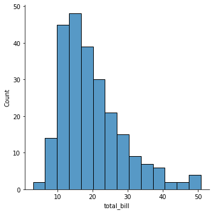
    


C'est la fonction `boxplot()` qui nous permet de réaliser une boîte à moustache (soit verticale en mettant la variable en `y`, soit horizontale en la mettant en `x`).


```python
seaborn.boxplot(data = tips, y = "total_bill")
```


    <AxesSubplot:ylabel='total_bill'>


    
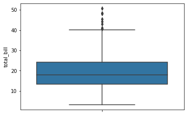
    


```python
seaborn.boxplot(data = tips, x = "total_bill")
```


    <AxesSubplot:xlabel='total_bill'>


    

    


Une autre représentation possible est obtenue avec la fonction `pointplot()`, qui représente la moyenne et l'écarte-type, avec le choix entre vertical (y) ou horizontal (x).


```python
seaborn.pointplot(data = tips, y = "total_bill")
```


    <AxesSubplot:ylabel='total_bill'>


    
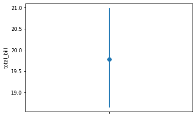
    


```python
seaborn.pointplot(data = tips, x = "total_bill")
```


    <AxesSubplot:xlabel='total_bill'>


    
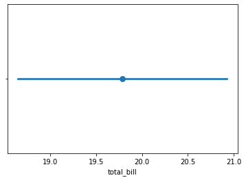
    


Un autre graphique possible est celui obtenu avec `violinplot()`, qui représente la densité d'une variable, toujours avec le choix vertical/horizontale (y/x).


```python
seaborn.violinplot(data = tips, y = "total_bill")
```


    <AxesSubplot:ylabel='total_bill'>


    

    


```python
seaborn.violinplot(data = tips, x = "total_bill")
```


    <AxesSubplot:xlabel='total_bill'>


    
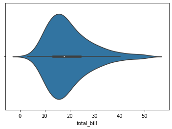
    


Enfin, il est possible de représenter toutes les valeurs sur un pseudo nuage de points. Avec `striplot()` dont l'option `jitter` a été activée, les points sont aléatoirement répartis sur l'axe des $x$  (si on utilise y - inversement sinon).


```python
seaborn.stripplot(data = tips, y = "total_bill", jitter = True)
```


    <AxesSubplot:ylabel='total_bill'>


    
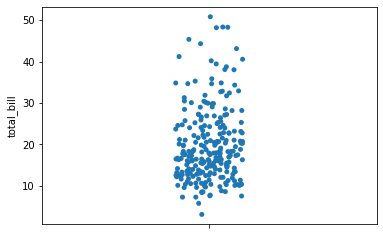
    


```python
seaborn.stripplot(data = tips, x = "total_bill", jitter = True)
```


    <AxesSubplot:xlabel='total_bill'>


    
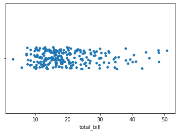
    


### Variable qualitative

Le diagramme en barres en effectifs est obtenu via la fonction `countplot()`. Il est soit horizontal (avec la variable en `x`), soit vertical (en `y`).


```python
seaborn.countplot(data = tips, x = "sex")
```


    <AxesSubplot:xlabel='sex', ylabel='count'>


    
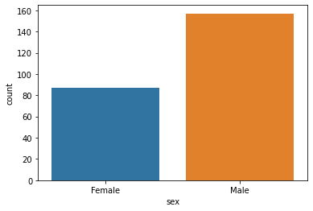
    


```python
seaborn.countplot(data = tips, y = "sex")
```


    <AxesSubplot:xlabel='count', ylabel='sex'>


    

    


Pour avoir la version en pourcentages (ou en proportions) de ce graphique, nous devons utiliser la fonction `barplot()`, sur la table de proportions calculée avant. Cette fonction réalise un calcul (moyenne par défaut) sur une variable (ici `freq`) en fonction des modalités d'une autre variable (`sex` ici donc).


```python
t = pandas.crosstab(tips.sex, "freq", normalize=True)
t = t.assign(sex = t.index, freq = 100 * t.freq)
seaborn.barplot(data = t, x = "sex", y = "freq")
```


    <AxesSubplot:xlabel='sex', ylabel='freq'>


    

    


Pour réaliser un diagramme en barres empilées, il faudra le créer soi-même. Nous ne verrons pas ici.

### Var quantitative - Var quantitative

Pour réaliser le nuage de points, on utilise la fonction `jointplot()`. Elle a l'avantage d'ajouter par défaut les histogrammes de chaque variable. Elle réalise par défaut le nuage de points simple (scatter). 


```python
seaborn.jointplot(data = tips, x = "total_bill", y = "tip")
```


    <seaborn.axisgrid.JointGrid at 0x13dd90e50>


    
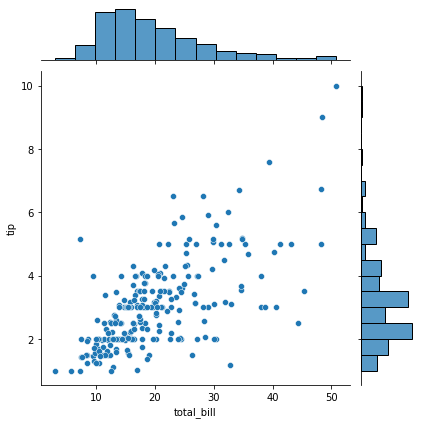
    


En choississant le type `reg` avec le paramètre `kind`, on obtient en plus l'ajustement linéaire de la variable en y par celle en x.


```python
seaborn.jointplot(data = tips, x = "total_bill", y = "tip", kind = "reg")
```


    <seaborn.axisgrid.JointGrid at 0x13de70580>


    
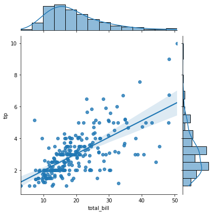
    


Si on souhaite ne pas avoir les distributions marginales, la fonction` regplot()` nous permet de réaliser le nuage de points avec ou sans ajustement (paramètre `fit_reg`).


```python
seaborn.regplot(data = tips, x = "total_bill", y = "tip")
```


    <AxesSubplot:xlabel='total_bill', ylabel='tip'>


    
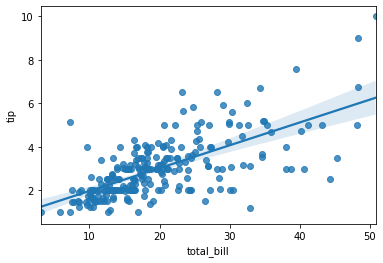
    


```python
seaborn.regplot(data = tips, x = "total_bill", y = "tip", fit_reg = False)
```


    <AxesSubplot:xlabel='total_bill', ylabel='tip'>


    

    


```python
seaborn.regplot(data = tips, x = "total_bill", y = "tip", scatter = False)
```


    <AxesSubplot:xlabel='total_bill', ylabel='tip'>


    
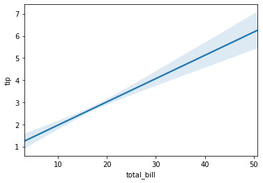
    


Il est possible d'obtenir directement tous les nuages de points 2 à 2, avec la fonction `pairplot()`. Le paramètre `vars` permet de sélectionner certaines variables. Par défaut, la fonction utilise toutes les variables numériques.


```python
seaborn.pairplot(data = tips, vars = ["total_bill", "tip", "size"])
```


    <seaborn.axisgrid.PairGrid at 0x13e0f5940>


    
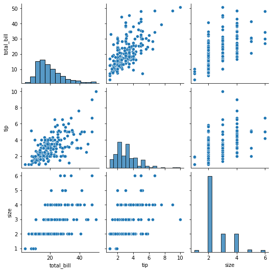
    


### Var qualitative - Var qualitative

Pour obtenir le diagramme en barres séparées (en effectifs), nous utilisons la fonction `countplot()` avec le paramètre `hue` pour indiquer la variable servant de *coloriage* aux barres.


```python
seaborn.countplot(data = tips, x = "sex", hue = "smoker")
```


    <AxesSubplot:xlabel='sex', ylabel='count'>


    

    


### Var quantitative - Var qualitative

Pour réaliser les boîtes à moustaches de la variable quantitative pour chaque modalité de la variable qualitative, on utilise la fonction `catplot()`.


```python
seaborn.catplot(data = tips, x = "sex", y = "total_bill", kind = "box")
```


    <seaborn.axisgrid.FacetGrid at 0x13e4d2190>


    
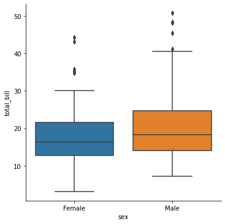
    


On peut aussi représenter la moyenne et l'écart-type à l'aide du graphique `pointplot` (qu'on réalise ici via `catplot()`).


```python
seaborn.catplot(data = tips, x = "sex", y = "total_bill", kind = "point", join = False)
```


    <seaborn.axisgrid.FacetGrid at 0x13e578550>


    
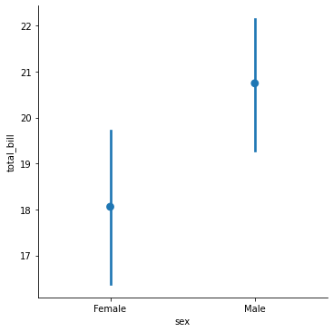
    


### Plusieurs variables quantitatives

Calcul de la corrélation ici pour chaque couple de variables.


```python
d = tips.filter(["total_bill", "tip", "size"]).corr()
d.round(2)
```


<div>
<style scoped>
    .dataframe tbody tr th:only-of-type {
        vertical-align: middle;
    }

    .dataframe tbody tr th {
        vertical-align: top;
    }

    .dataframe thead th {
        text-align: right;
    }
</style>
<table border="1" class="dataframe">
  <thead>
    <tr style="text-align: right;">
      <th></th>
      <th>total_bill</th>
      <th>tip</th>
      <th>size</th>
    </tr>
  </thead>
  <tbody>
    <tr>
      <th>total_bill</th>
      <td>1.00</td>
      <td>0.68</td>
      <td>0.60</td>
    </tr>
    <tr>
      <th>tip</th>
      <td>0.68</td>
      <td>1.00</td>
      <td>0.49</td>
    </tr>
    <tr>
      <th>size</th>
      <td>0.60</td>
      <td>0.49</td>
      <td>1.00</td>
    </tr>
  </tbody>
</table>
</div>


```python
d.style.background_gradient(cmap = "Blues")
```


<style  type="text/css" >
#T_24944_row0_col0,#T_24944_row1_col1,#T_24944_row2_col2{
            background-color:  #08306b;
            color:  #f1f1f1;
        }#T_24944_row0_col1{
            background-color:  #a1cbe2;
            color:  #000000;
        }#T_24944_row0_col2{
            background-color:  #cde0f1;
            color:  #000000;
        }#T_24944_row1_col0{
            background-color:  #d1e2f3;
            color:  #000000;
        }#T_24944_row1_col2,#T_24944_row2_col0,#T_24944_row2_col1{
            background-color:  #f7fbff;
            color:  #000000;
        }</style><table id="T_24944_" ><thead>    <tr>        <th class="blank level0" ></th>        <th class="col_heading level0 col0" >total_bill</th>        <th class="col_heading level0 col1" >tip</th>        <th class="col_heading level0 col2" >size</th>    </tr></thead><tbody>
                <tr>
                        <th id="T_24944_level0_row0" class="row_heading level0 row0" >total_bill</th>
                        <td id="T_24944_row0_col0" class="data row0 col0" >1.000000</td>
                        <td id="T_24944_row0_col1" class="data row0 col1" >0.675734</td>
                        <td id="T_24944_row0_col2" class="data row0 col2" >0.598315</td>
            </tr>
            <tr>
                        <th id="T_24944_level0_row1" class="row_heading level0 row1" >tip</th>
                        <td id="T_24944_row1_col0" class="data row1 col0" >0.675734</td>
                        <td id="T_24944_row1_col1" class="data row1 col1" >1.000000</td>
                        <td id="T_24944_row1_col2" class="data row1 col2" >0.489299</td>
            </tr>
            <tr>
                        <th id="T_24944_level0_row2" class="row_heading level0 row2" >size</th>
                        <td id="T_24944_row2_col0" class="data row2 col0" >0.598315</td>
                        <td id="T_24944_row2_col1" class="data row2 col1" >0.489299</td>
                        <td id="T_24944_row2_col2" class="data row2 col2" >1.000000</td>
            </tr>
    </tbody></table>


```python
seaborn.heatmap(d, annot = True, cmap = "Blues")
```


    <AxesSubplot:>


    
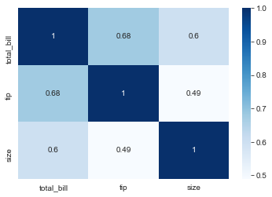
    


### Compléments

Il est bien évidemment possible de personnaliser le graphique de différentes façons, dont certains sont présentées ci-dessous. On accède aux fonctions de personnalisation soit via des paramètres de la fonction, soit via l'objet renvoyé par la fonction utilisée pour créer le graphique, soit via le module directement. Dans ce cas, ce sont des changements qui affecteront aussi les graphiques futurs.

- `suptitle` dans `fig` : titre global
- `set_axis_labels` : titre des axes
- `palette` : choix d'une palette de couleurs
- `size` et `aspect` : hauteur et ratio entre hauteur et largeur, pour chaque facette (une seule ici)


```python
seaborn.set_style("white")
p = seaborn.catplot(data = tips, x = "size", y = "tip", hue = "sex", 
                    kind = "box", 
                    palette = "Set2", height = 4, aspect = 2)
p.fig.suptitle("Taille et pourboire en fonction du sexe")
p.set_axis_labels("Nombre de convives", "Pourboire")
```


    <seaborn.axisgrid.FacetGrid at 0x13e68deb0>


    

    


## Données Velib

Nous allons travailler sur des données Velib en temps réel, qui sont disponibles sur [cette page](https://opendata.paris.fr/explore/dataset/velib-disponibilite-en-temps-reel/).

Pour cela, nous avons besoin du module `requests`, tel qu'utilisé ci-dessous.


```python
import requests

url = "https://opendata.paris.fr/api/records/1.0/search/"
par = dict(
    dataset = "velib-disponibilite-en-temps-reel"
)
r = requests.get(url = url, params = par)
r.json()

```


    {'nhits': 1433,
     'parameters': {'dataset': 'velib-disponibilite-en-temps-reel',
      'rows': 10,
      'start': 0,
      'format': 'json',
      'timezone': 'UTC'},
     'records': [{'datasetid': 'velib-disponibilite-en-temps-reel',
       'recordid': '9e5fb5391f2cb3b6255864e861a9121d5e1d148b',
       'fields': {'name': 'Toudouze - Clauzel',
        'stationcode': '9020',
        'ebike': 1,
        'mechanical': 0,
        'coordonnees_geo': [48.87929591733507, 2.3373600840568547],
        'duedate': '2022-04-04T08:14:51+00:00',
        'numbikesavailable': 1,
        'numdocksavailable': 20,
        'capacity': 21,
        'is_renting': 'OUI',
        'is_installed': 'OUI',
        'nom_arrondissement_communes': 'Paris',
        'is_returning': 'OUI'},
       'geometry': {'type': 'Point',
        'coordinates': [2.3373600840568547, 48.87929591733507]},
       'record_timestamp': '2022-04-04T08:33:00.394Z'},
      {'datasetid': 'velib-disponibilite-en-temps-reel',
       'recordid': 'e1d8a65c150421e6c1e53a614a4c12bc6154fa3c',
       'fields': {'name': 'Harpe - Saint-Germain',
        'stationcode': '5001',
        'ebike': 4,
        'mechanical': 20,
        'coordonnees_geo': [48.85151881501689, 2.343670316040516],
        'duedate': '2022-04-04T08:12:37+00:00',
        'numbikesavailable': 24,
        'numdocksavailable': 20,
        'capacity': 45,
        'is_renting': 'OUI',
        'is_installed': 'OUI',
        'nom_arrondissement_communes': 'Paris',
        'is_returning': 'OUI'},
       'geometry': {'type': 'Point',
        'coordinates': [2.343670316040516, 48.85151881501689]},
       'record_timestamp': '2022-04-04T08:33:00.394Z'},
      {'datasetid': 'velib-disponibilite-en-temps-reel',
       'recordid': '53d0d29efb6f835459ecb5cfe798a183f59cc781',
       'fields': {'name': 'Jourdan - Stade Charléty',
        'stationcode': '14014',
        'ebike': 3,
        'mechanical': 1,
        'coordonnees_geo': [48.819428333369, 2.3433353751898],
        'duedate': '2022-04-04T08:12:56+00:00',
        'numbikesavailable': 4,
        'numdocksavailable': 56,
        'capacity': 60,
        'is_renting': 'OUI',
        'is_installed': 'OUI',
        'nom_arrondissement_communes': 'Paris',
        'is_returning': 'OUI'},
       'geometry': {'type': 'Point',
        'coordinates': [2.3433353751898, 48.819428333369]},
       'record_timestamp': '2022-04-04T08:33:00.394Z'},
      {'datasetid': 'velib-disponibilite-en-temps-reel',
       'recordid': 'e468cd42d538af792c18a6aa9b6a363634c1f5d0',
       'fields': {'name': 'Alibert - Jemmapes',
        'stationcode': '10013',
        'ebike': 2,
        'mechanical': 4,
        'coordonnees_geo': [48.8710440519842, 2.366104461987773],
        'duedate': '2022-04-04T08:13:17+00:00',
        'numbikesavailable': 6,
        'numdocksavailable': 51,
        'capacity': 60,
        'is_renting': 'OUI',
        'is_installed': 'OUI',
        'nom_arrondissement_communes': 'Paris',
        'is_returning': 'OUI'},
       'geometry': {'type': 'Point',
        'coordinates': [2.366104461987773, 48.8710440519842]},
       'record_timestamp': '2022-04-04T08:33:00.394Z'},
      {'datasetid': 'velib-disponibilite-en-temps-reel',
       'recordid': '34ad2ecbd88e589c1ba5526e59d5def04ed6cd64',
       'fields': {'name': 'Cassini - Denfert-Rochereau',
        'stationcode': '14111',
        'ebike': 5,
        'mechanical': 4,
        'coordonnees_geo': [48.83752583906732, 2.336035408079624],
        'duedate': '2022-04-04T08:14:47+00:00',
        'numbikesavailable': 9,
        'numdocksavailable': 10,
        'capacity': 25,
        'is_renting': 'OUI',
        'is_installed': 'OUI',
        'nom_arrondissement_communes': 'Paris',
        'is_returning': 'OUI'},
       'geometry': {'type': 'Point',
        'coordinates': [2.336035408079624, 48.83752583906732]},
       'record_timestamp': '2022-04-04T08:33:00.394Z'},
      {'datasetid': 'velib-disponibilite-en-temps-reel',
       'recordid': 'e034035ff62b4fe50802f5ae0f01e443235dc9dd',
       'fields': {'name': 'André Karman - République',
        'stationcode': '33006',
        'ebike': 4,
        'mechanical': 1,
        'coordonnees_geo': [48.91039875761846, 2.3851355910301213],
        'duedate': '2022-04-04T08:12:00+00:00',
        'numbikesavailable': 5,
        'numdocksavailable': 24,
        'capacity': 31,
        'is_renting': 'OUI',
        'is_installed': 'OUI',
        'nom_arrondissement_communes': 'Aubervilliers',
        'is_returning': 'OUI'},
       'geometry': {'type': 'Point',
        'coordinates': [2.3851355910301213, 48.91039875761846]},
       'record_timestamp': '2022-04-04T08:33:00.394Z'},
      {'datasetid': 'velib-disponibilite-en-temps-reel',
       'recordid': '4f7bb4fbd79df0d4b2c5d70c87c61a0efd323fbd',
       'fields': {'name': 'Silly - Galliéni',
        'stationcode': '21010',
        'ebike': 2,
        'mechanical': 4,
        'coordonnees_geo': [48.835583838705936, 2.2325500845909123],
        'duedate': '2022-04-04T08:15:00+00:00',
        'numbikesavailable': 6,
        'numdocksavailable': 19,
        'capacity': 25,
        'is_renting': 'OUI',
        'is_installed': 'OUI',
        'nom_arrondissement_communes': 'Boulogne-Billancourt',
        'is_returning': 'OUI'},
       'geometry': {'type': 'Point',
        'coordinates': [2.2325500845909123, 48.835583838705936]},
       'record_timestamp': '2022-04-04T08:33:00.394Z'},
      {'datasetid': 'velib-disponibilite-en-temps-reel',
       'recordid': '8321817fc31442e93e8146e1669bf57e7fb4033d',
       'fields': {'name': 'Place Nelson Mandela',
        'stationcode': '25006',
        'ebike': 2,
        'mechanical': 0,
        'coordonnees_geo': [48.862090937689715, 2.196576297283173],
        'duedate': '2022-04-04T08:08:40+00:00',
        'numbikesavailable': 2,
        'numdocksavailable': 20,
        'capacity': 22,
        'is_renting': 'OUI',
        'is_installed': 'OUI',
        'nom_arrondissement_communes': 'Rueil-Malmaison',
        'is_returning': 'OUI'},
       'geometry': {'type': 'Point',
        'coordinates': [2.196576297283173, 48.862090937689715]},
       'record_timestamp': '2022-04-04T08:33:00.394Z'},
      {'datasetid': 'velib-disponibilite-en-temps-reel',
       'recordid': '3fc7c9da8a4adf32eaf340ff0f9507cce5a104fe',
       'fields': {'name': 'Grande Armée - Brunel',
        'stationcode': '17038',
        'ebike': 9,
        'mechanical': 3,
        'coordonnees_geo': [48.876116, 2.288124],
        'duedate': '2022-04-04T08:14:21+00:00',
        'numbikesavailable': 12,
        'numdocksavailable': 37,
        'capacity': 62,
        'is_renting': 'OUI',
        'is_installed': 'OUI',
        'nom_arrondissement_communes': 'Paris',
        'is_returning': 'OUI'},
       'geometry': {'type': 'Point', 'coordinates': [2.288124, 48.876116]},
       'record_timestamp': '2022-04-04T08:33:00.394Z'},
      {'datasetid': 'velib-disponibilite-en-temps-reel',
       'recordid': 'e4a13c52658fbd533474c7b7ad3bdb831b83fc7b',
       'fields': {'name': 'Vaneau - Sèvres',
        'stationcode': '7002',
        'ebike': 3,
        'mechanical': 6,
        'coordonnees_geo': [48.84856323305935, 2.3204218259345537],
        'duedate': '2022-04-04T08:14:11+00:00',
        'numbikesavailable': 9,
        'numdocksavailable': 24,
        'capacity': 35,
        'is_renting': 'OUI',
        'is_installed': 'OUI',
        'nom_arrondissement_communes': 'Paris',
        'is_returning': 'OUI'},
       'geometry': {'type': 'Point',
        'coordinates': [2.3204218259345537, 48.84856323305935]},
       'record_timestamp': '2022-04-04T08:33:00.394Z'}]}


Dans ce résultat, nous voyons qu'il y a 1433 enregistrements à récupérer (`nhits`), et que nous en avons récupérer ici uniquement 10 (`parameters.rows`). Pour avoir tous les résultats, on doit faire comme ci-dessous


```python
par = dict(
    dataset = "velib-disponibilite-en-temps-reel",
    rows = 1433
)
r_tous = requests.get(url = url, params = par)
r_tous.json()
```


    {'nhits': 1433,
     'parameters': {'dataset': 'velib-disponibilite-en-temps-reel',
      'rows': 1433,
      'start': 0,
      'format': 'json',
      'timezone': 'UTC'},
     'records': [{'datasetid': 'velib-disponibilite-en-temps-reel',
       'recordid': 'd500e8cc84be0d124023b9ccc6b196c0c607b4f5',
       'fields': {'name': 'Toudouze - Clauzel',
        'stationcode': '9020',
        'ebike': 1,
        'mechanical': 0,
        'coordonnees_geo': [48.87929591733507, 2.3373600840568547],
        'duedate': '2022-04-04T08:09:20+00:00',
        'numbikesavailable': 1,
        'numdocksavailable': 20,
        'capacity': 21,
        'is_renting': 'OUI',
        'is_installed': 'OUI',
        'nom_arrondissement_communes': 'Paris',
        'is_returning': 'OUI'},
       'geometry': {'type': 'Point',
        'coordinates': [2.3373600840568547, 48.87929591733507]},
       'record_timestamp': '2022-04-04T08:34:00.491Z'},
      {'datasetid': 'velib-disponibilite-en-temps-reel',
       'recordid': 'e1d8a65c150421e6c1e53a614a4c12bc6154fa3c',
       'fields': {'name': 'Harpe - Saint-Germain',
        'stationcode': '5001',
        'ebike': 4,
        'mechanical': 20,
        'coordonnees_geo': [48.85151881501689, 2.343670316040516],
        'duedate': '2022-04-04T08:12:37+00:00',
        'numbikesavailable': 24,
        'numdocksavailable': 20,
        'capacity': 45,
        'is_renting': 'OUI',
        'is_installed': 'OUI',
        'nom_arrondissement_communes': 'Paris',
        'is_returning': 'OUI'},
       'geometry': {'type': 'Point',
        'coordinates': [2.343670316040516, 48.85151881501689]},
       'record_timestamp': '2022-04-04T08:34:00.491Z'},
      {'datasetid': 'velib-disponibilite-en-temps-reel',
       'recordid': '53d0d29efb6f835459ecb5cfe798a183f59cc781',
       'fields': {'name': 'Jourdan - Stade Charléty',
        'stationcode': '14014',
        'ebike': 3,
        'mechanical': 1,
        'coordonnees_geo': [48.819428333369, 2.3433353751898],
        'duedate': '2022-04-04T08:12:56+00:00',
        'numbikesavailable': 4,
        'numdocksavailable': 56,
        'capacity': 60,
        'is_renting': 'OUI',
        'is_installed': 'OUI',
        'nom_arrondissement_communes': 'Paris',
        'is_returning': 'OUI'},
       'geometry': {'type': 'Point',
        'coordinates': [2.3433353751898, 48.819428333369]},
       'record_timestamp': '2022-04-04T08:34:00.491Z'},
      {'datasetid': 'velib-disponibilite-en-temps-reel',
       'recordid': 'e468cd42d538af792c18a6aa9b6a363634c1f5d0',
       'fields': {'name': 'Alibert - Jemmapes',
        'stationcode': '10013',
        'ebike': 2,
        'mechanical': 4,
        'coordonnees_geo': [48.8710440519842, 2.366104461987773],
        'duedate': '2022-04-04T08:13:17+00:00',
        'numbikesavailable': 6,
        'numdocksavailable': 51,
        'capacity': 60,
        'is_renting': 'OUI',
        'is_installed': 'OUI',
        'nom_arrondissement_communes': 'Paris',
        'is_returning': 'OUI'},
       'geometry': {'type': 'Point',
        'coordinates': [2.366104461987773, 48.8710440519842]},
       'record_timestamp': '2022-04-04T08:34:00.491Z'},
      {'datasetid': 'velib-disponibilite-en-temps-reel',
       'recordid': '5cba2cc115335751f9899e3865ad28957fa7a640',
       'fields': {'name': 'Messine - Place Du Pérou',
        'stationcode': '8026',
        'ebike': 3,
        'mechanical': 3,
        'coordonnees_geo': [48.875448033960744, 2.315508019010038],
        'duedate': '2022-04-04T08:13:41+00:00',
        'numbikesavailable': 6,
        'numdocksavailable': 3,
        'capacity': 12,
        'is_renting': 'OUI',
        'is_installed': 'OUI',
        'nom_arrondissement_communes': 'Paris',
        'is_returning': 'OUI'},
       'geometry': {'type': 'Point',
        'coordinates': [2.315508019010038, 48.875448033960744]},
       'record_timestamp': '2022-04-04T08:34:00.491Z'},
      {'datasetid': 'velib-disponibilite-en-temps-reel',
       'recordid': 'ff381b3cdd756898ba0ea627ffbb1af3c7e1cc73',
       'fields': {'name': 'Cassini - Denfert-Rochereau',
        'stationcode': '14111',
        'ebike': 5,
        'mechanical': 4,
        'coordonnees_geo': [48.83752583906732, 2.336035408079624],
        'duedate': '2022-04-04T08:10:05+00:00',
        'numbikesavailable': 9,
        'numdocksavailable': 10,
        'capacity': 25,
        'is_renting': 'OUI',
        'is_installed': 'OUI',
        'nom_arrondissement_communes': 'Paris',
        'is_returning': 'OUI'},
       'geometry': {'type': 'Point',
        'coordinates': [2.336035408079624, 48.83752583906732]},
       'record_timestamp': '2022-04-04T08:34:00.491Z'},
      {'datasetid': 'velib-disponibilite-en-temps-reel',
       'recordid': '21a5dde7eaf0b3ca2cc407a87b83362cda2c1f37',
       'fields': {'name': 'Saint-Sulpice',
        'stationcode': '6003',
        'ebike': 5,
        'mechanical': 14,
        'coordonnees_geo': [48.85165383178419, 2.3308077827095985],
        'duedate': '2022-04-04T08:11:54+00:00',
        'numbikesavailable': 19,
        'numdocksavailable': 1,
        'capacity': 21,
        'is_renting': 'OUI',
        'is_installed': 'OUI',
        'nom_arrondissement_communes': 'Paris',
        'is_returning': 'OUI'},
       'geometry': {'type': 'Point',
        'coordinates': [2.3308077827095985, 48.85165383178419]},
       'record_timestamp': '2022-04-04T08:34:00.491Z'},
      {'datasetid': 'velib-disponibilite-en-temps-reel',
       'recordid': 'e034035ff62b4fe50802f5ae0f01e443235dc9dd',
       'fields': {'name': 'André Karman - République',
        'stationcode': '33006',
        'ebike': 4,
        'mechanical': 1,
        'coordonnees_geo': [48.91039875761846, 2.3851355910301213],
        'duedate': '2022-04-04T08:12:00+00:00',
        'numbikesavailable': 5,
        'numdocksavailable': 24,
        'capacity': 31,
        'is_renting': 'OUI',
        'is_installed': 'OUI',
        'nom_arrondissement_communes': 'Aubervilliers',
        'is_returning': 'OUI'},
       'geometry': {'type': 'Point',
        'coordinates': [2.3851355910301213, 48.91039875761846]},
       'record_timestamp': '2022-04-04T08:34:00.491Z'},
      {'datasetid': 'velib-disponibilite-en-temps-reel',
       'recordid': 'cbbdc9ae78a91ef4ebf7280871278927ddb19467',
       'fields': {'name': 'Bois de Vincennes - Gare',
        'stationcode': '41301',
        'ebike': 10,
        'mechanical': 10,
        'coordonnees_geo': [48.836022242886884, 2.4708339950830287],
        'duedate': '2022-04-04T08:07:31+00:00',
        'numbikesavailable': 20,
        'numdocksavailable': 27,
        'capacity': 50,
        'is_renting': 'OUI',
        'is_installed': 'OUI',
        'nom_arrondissement_communes': 'Nogent-sur-Marne',
        'is_returning': 'OUI'},
       'geometry': {'type': 'Point',
        'coordinates': [2.4708339950830287, 48.836022242886884]},
       'record_timestamp': '2022-04-04T08:34:00.491Z'},
      {'datasetid': 'velib-disponibilite-en-temps-reel',
       'recordid': '8321817fc31442e93e8146e1669bf57e7fb4033d',
       'fields': {'name': 'Place Nelson Mandela',
        'stationcode': '25006',
        'ebike': 2,
        'mechanical': 0,
        'coordonnees_geo': [48.862090937689715, 2.196576297283173],
        'duedate': '2022-04-04T08:08:40+00:00',
        'numbikesavailable': 2,
        'numdocksavailable': 20,
        'capacity': 22,
        'is_renting': 'OUI',
        'is_installed': 'OUI',
        'nom_arrondissement_communes': 'Rueil-Malmaison',
        'is_returning': 'OUI'},
       'geometry': {'type': 'Point',
        'coordinates': [2.196576297283173, 48.862090937689715]},
       'record_timestamp': '2022-04-04T08:34:00.491Z'},
      {'datasetid': 'velib-disponibilite-en-temps-reel',
       'recordid': '493b03d4b88e6050f0bbe64c89a6143c3e733684',
       'fields': {'name': 'Guersant - Gouvion-Saint-Cyr',
        'stationcode': '17041',
        'ebike': 4,
        'mechanical': 2,
        'coordonnees_geo': [48.88287775178599, 2.287667370814871],
        'duedate': '2022-04-04T08:09:02+00:00',
        'numbikesavailable': 6,
        'numdocksavailable': 29,
        'capacity': 36,
        'is_renting': 'OUI',
        'is_installed': 'OUI',
        'nom_arrondissement_communes': 'Paris',
        'is_returning': 'OUI'},
       'geometry': {'type': 'Point',
        'coordinates': [2.287667370814871, 48.88287775178599]},
       'record_timestamp': '2022-04-04T08:34:00.491Z'},
      {'datasetid': 'velib-disponibilite-en-temps-reel',
       'recordid': 'f413e4e9cd4a2fc06dfccc73f7a23d285ceaddb2',
       'fields': {'name': 'Square Boucicaut',
        'stationcode': '7003',
        'ebike': 16,
        'mechanical': 36,
        'coordonnees_geo': [48.851296433665276, 2.325061820447445],
        'duedate': '2022-04-04T08:12:49+00:00',
        'numbikesavailable': 52,
        'numdocksavailable': 7,
        'capacity': 60,
        'is_renting': 'OUI',
        'is_installed': 'OUI',
        'nom_arrondissement_communes': 'Paris',
        'is_returning': 'OUI'},
       'geometry': {'type': 'Point',
        'coordinates': [2.325061820447445, 48.851296433665276]},
       'record_timestamp': '2022-04-04T08:34:00.491Z'},
      {'datasetid': 'velib-disponibilite-en-temps-reel',
       'recordid': 'cda5445316e744f0baafb38ac5e6b356b4c39553',
       'fields': {'name': 'Invalides - Duroc',
        'stationcode': '7001',
        'ebike': 6,
        'mechanical': 2,
        'coordonnees_geo': [48.8477924732952, 2.3161920905113225],
        'duedate': '2022-04-04T08:13:21+00:00',
        'numbikesavailable': 8,
        'numdocksavailable': 21,
        'capacity': 29,
        'is_renting': 'OUI',
        'is_installed': 'OUI',
        'nom_arrondissement_communes': 'Paris',
        'is_returning': 'OUI'},
       'geometry': {'type': 'Point',
        'coordinates': [2.3161920905113225, 48.8477924732952]},
       'record_timestamp': '2022-04-04T08:34:00.491Z'},
      {'datasetid': 'velib-disponibilite-en-temps-reel',
       'recordid': 'a268dc67624d9da7d44106528631f260cc65bdf4',
       'fields': {'name': 'Thouin - Cardinal Lemoine',
        'stationcode': '5016',
        'ebike': 1,
        'mechanical': 3,
        'coordonnees_geo': [48.84504716661511, 2.3494647851273465],
        'duedate': '2022-04-04T08:13:53+00:00',
        'numbikesavailable': 4,
        'numdocksavailable': 13,
        'capacity': 17,
        'is_renting': 'OUI',
        'is_installed': 'OUI',
        'nom_arrondissement_communes': 'Paris',
        'is_returning': 'OUI'},
       'geometry': {'type': 'Point',
        'coordinates': [2.3494647851273465, 48.84504716661511]},
       'record_timestamp': '2022-04-04T08:34:00.491Z'},
      {'datasetid': 'velib-disponibilite-en-temps-reel',
       'recordid': 'c9db4d11748c34aefe336dbd80074f5244b7f6b0',
       'fields': {'name': 'Froment - Bréguet',
        'stationcode': '11025',
        'ebike': 0,
        'mechanical': 8,
        'coordonnees_geo': [48.8570414504784, 2.37289470306807],
        'duedate': '2022-04-04T08:11:41+00:00',
        'numbikesavailable': 8,
        'numdocksavailable': 31,
        'capacity': 43,
        'is_renting': 'OUI',
        'is_installed': 'OUI',
        'nom_arrondissement_communes': 'Paris',
        'is_returning': 'OUI'},
       'geometry': {'type': 'Point',
        'coordinates': [2.37289470306807, 48.8570414504784]},
       'record_timestamp': '2022-04-04T08:34:00.491Z'},
      {'datasetid': 'velib-disponibilite-en-temps-reel',
       'recordid': 'b46a2d519df28a23ea578ab85671e7ea74901355',
       'fields': {'name': 'Chazelles - Courcelles',
        'stationcode': '17025',
        'ebike': 15,
        'mechanical': 1,
        'coordonnees_geo': [48.879406604954, 2.3034455627202988],
        'duedate': '2022-04-04T08:11:57+00:00',
        'numbikesavailable': 16,
        'numdocksavailable': 19,
        'capacity': 35,
        'is_renting': 'OUI',
        'is_installed': 'OUI',
        'nom_arrondissement_communes': 'Paris',
        'is_returning': 'OUI'},
       'geometry': {'type': 'Point',
        'coordinates': [2.3034455627202988, 48.879406604954]},
       'record_timestamp': '2022-04-04T08:34:00.491Z'},
      {'datasetid': 'velib-disponibilite-en-temps-reel',
       'recordid': '7cf27ad1755b50ca88f98702734e727b253ffe83',
       'fields': {'name': 'Croulebarde - Corvisart',
        'stationcode': '13101',
        'ebike': 3,
        'mechanical': 7,
        'coordonnees_geo': [48.830981659316855, 2.3481646925210953],
        'duedate': '2022-04-04T08:12:53+00:00',
        'numbikesavailable': 10,
        'numdocksavailable': 22,
        'capacity': 34,
        'is_renting': 'OUI',
        'is_installed': 'OUI',
        'nom_arrondissement_communes': 'Paris',
        'is_returning': 'OUI'},
       'geometry': {'type': 'Point',
        'coordinates': [2.3481646925210953, 48.830981659316855]},
       'record_timestamp': '2022-04-04T08:34:00.491Z'},
      {'datasetid': 'velib-disponibilite-en-temps-reel',
       'recordid': '10ad625e9292f3ce54a9b8a3e432da03ce2330ab',
       'fields': {'name': 'Romainville - Vaillant-Couturier',
        'stationcode': '31024',
        'ebike': 1,
        'mechanical': 3,
        'coordonnees_geo': [48.86785, 2.446748],
        'duedate': '2022-04-04T08:09:15+00:00',
        'numbikesavailable': 4,
        'numdocksavailable': 34,
        'capacity': 38,
        'is_renting': 'OUI',
        'is_installed': 'OUI',
        'nom_arrondissement_communes': 'Montreuil',
        'is_returning': 'OUI'},
       'geometry': {'type': 'Point', 'coordinates': [2.446748, 48.86785]},
       'record_timestamp': '2022-04-04T08:34:00.491Z'},
      {'datasetid': 'velib-disponibilite-en-temps-reel',
       'recordid': '12ff3afc75904711032061d599adbc484a77085a',
       'fields': {'name': 'Liberté - Vert-de-Maisons',
        'stationcode': '47007',
        'ebike': 2,
        'mechanical': 14,
        'coordonnees_geo': [48.79014780960843, 2.43286281824112],
        'duedate': '2022-04-04T08:12:29+00:00',
        'numbikesavailable': 16,
        'numdocksavailable': 4,
        'capacity': 20,
        'is_renting': 'OUI',
        'is_installed': 'OUI',
        'nom_arrondissement_communes': 'Maisons-Alfort',
        'is_returning': 'OUI'},
       'geometry': {'type': 'Point',
        'coordinates': [2.43286281824112, 48.79014780960843]},
       'record_timestamp': '2022-04-04T08:34:00.491Z'},
      {'datasetid': 'velib-disponibilite-en-temps-reel',
       'recordid': '9f42128b954687e60f3c19d9517d8c0a688c56ea',
       'fields': {'name': 'Cambrai - Benjamin Constant',
        'stationcode': '19033',
        'ebike': 2,
        'mechanical': 6,
        'coordonnees_geo': [48.89594736851349, 2.381133802246315],
        'duedate': '2022-04-04T08:04:11+00:00',
        'numbikesavailable': 8,
        'numdocksavailable': 34,
        'capacity': 43,
        'is_renting': 'OUI',
        'is_installed': 'OUI',
        'nom_arrondissement_communes': 'Paris',
        'is_returning': 'OUI'},
       'geometry': {'type': 'Point',
        'coordinates': [2.381133802246315, 48.89594736851349]},
       'record_timestamp': '2022-04-04T08:34:00.491Z'},
      {'datasetid': 'velib-disponibilite-en-temps-reel',
       'recordid': '95a824dd819219b6dc403ed0280c425ec34acffc',
       'fields': {'name': 'Ramponeau - Belleville',
        'stationcode': '20143',
        'ebike': 1,
        'mechanical': 2,
        'coordonnees_geo': [48.871031137596006, 2.3790568521139748],
        'duedate': '2022-04-04T08:11:25+00:00',
        'numbikesavailable': 3,
        'numdocksavailable': 41,
        'capacity': 44,
        'is_renting': 'OUI',
        'is_installed': 'OUI',
        'nom_arrondissement_communes': 'Paris',
        'is_returning': 'OUI'},
       'geometry': {'type': 'Point',
        'coordinates': [2.3790568521139748, 48.871031137596006]},
       'record_timestamp': '2022-04-04T08:34:00.491Z'},
      {'datasetid': 'velib-disponibilite-en-temps-reel',
       'recordid': '51ab9f9d23debd4f6c4847d7f3a9cf3b119e1c60',
       'fields': {'name': 'Lagny - Victor Basch',
        'stationcode': '43002',
        'ebike': 10,
        'mechanical': 13,
        'coordonnees_geo': [48.84884147189881, 2.426325418925233],
        'duedate': '2022-04-04T08:13:28+00:00',
        'numbikesavailable': 23,
        'numdocksavailable': 2,
        'capacity': 26,
        'is_renting': 'OUI',
        'is_installed': 'OUI',
        'nom_arrondissement_communes': 'Vincennes',
        'is_returning': 'OUI'},
       'geometry': {'type': 'Point',
        'coordinates': [2.426325418925233, 48.84884147189881]},
       'record_timestamp': '2022-04-04T08:34:00.491Z'},
      {'datasetid': 'velib-disponibilite-en-temps-reel',
       'recordid': '21ba2843c6dc13fa2585bbe367df38d9d83b874d',
       'fields': {'name': 'Louis Lejeune - Barbès',
        'stationcode': '21216',
        'ebike': 1,
        'mechanical': 2,
        'coordonnees_geo': [48.81807418981508, 2.3267009854316716],
        'duedate': '2022-04-04T08:13:53+00:00',
        'numbikesavailable': 3,
        'numdocksavailable': 20,
        'capacity': 25,
        'is_renting': 'OUI',
        'is_installed': 'OUI',
        'nom_arrondissement_communes': 'Montrouge',
        'is_returning': 'OUI'},
       'geometry': {'type': 'Point',
        'coordinates': [2.3267009854316716, 48.81807418981508]},
       'record_timestamp': '2022-04-04T08:34:00.491Z'},
      {'datasetid': 'velib-disponibilite-en-temps-reel',
       'recordid': 'e78739467bdb46866d195cf141b62ad48bf7e12c',
       'fields': {'name': 'Général Martial Valin - Pont du Garigliano',
        'stationcode': '15068',
        'ebike': 2,
        'mechanical': 10,
        'coordonnees_geo': [48.83823094269141, 2.270506024360657],
        'duedate': '2022-04-04T08:13:28+00:00',
        'numbikesavailable': 12,
        'numdocksavailable': 4,
        'capacity': 16,
        'is_renting': 'OUI',
        'is_installed': 'OUI',
        'nom_arrondissement_communes': 'Paris',
        'is_returning': 'OUI'},
       'geometry': {'type': 'Point',
        'coordinates': [2.270506024360657, 48.83823094269141]},
       'record_timestamp': '2022-04-04T08:34:00.491Z'},
      {'datasetid': 'velib-disponibilite-en-temps-reel',
       'recordid': '97785aed09c88bd6cc34759d09ea699c009a5117',
       'fields': {'name': 'Rond-point du Dr Albert Schweitzer',
        'stationcode': '22207',
        'ebike': 2,
        'mechanical': 7,
        'coordonnees_geo': [48.78980918988166, 2.3143940046429634],
        'duedate': '2022-04-04T08:09:52+00:00',
        'numbikesavailable': 9,
        'numdocksavailable': 13,
        'capacity': 22,
        'is_renting': 'OUI',
        'is_installed': 'OUI',
        'nom_arrondissement_communes': 'Bagneux',
        'is_returning': 'OUI'},
       'geometry': {'type': 'Point',
        'coordinates': [2.3143940046429634, 48.78980918988166]},
       'record_timestamp': '2022-04-04T08:34:00.491Z'},
      {'datasetid': 'velib-disponibilite-en-temps-reel',
       'recordid': '89c41aa52cecdb81ea88135e0d56354278b9fb7d',
       'fields': {'name': 'Raspail - Varenne',
        'stationcode': '7004',
        'ebike': 7,
        'mechanical': 11,
        'coordonnees_geo': [48.85314781654488, 2.3263905197381973],
        'duedate': '2022-04-04T08:13:42+00:00',
        'numbikesavailable': 18,
        'numdocksavailable': 0,
        'capacity': 18,
        'is_renting': 'OUI',
        'is_installed': 'OUI',
        'nom_arrondissement_communes': 'Paris',
        'is_returning': 'OUI'},
       'geometry': {'type': 'Point',
        'coordinates': [2.3263905197381973, 48.85314781654488]},
       'record_timestamp': '2022-04-04T08:34:00.491Z'},
      {'datasetid': 'velib-disponibilite-en-temps-reel',
       'recordid': '146c5b75589576ff0c12030f4a4ea512a9dc4ebd',
       'fields': {'name': 'Vaugirard - Monsieur le Prince',
        'stationcode': '6029',
        'ebike': 17,
        'mechanical': 4,
        'coordonnees_geo': [48.848951441614176, 2.3411329463124275],
        'duedate': '2022-04-04T08:13:09+00:00',
        'numbikesavailable': 21,
        'numdocksavailable': 4,
        'capacity': 26,
        'is_renting': 'OUI',
        'is_installed': 'OUI',
        'nom_arrondissement_communes': 'Paris',
        'is_returning': 'OUI'},
       'geometry': {'type': 'Point',
        'coordinates': [2.3411329463124275, 48.848951441614176]},
       'record_timestamp': '2022-04-04T08:34:00.491Z'},
      {'datasetid': 'velib-disponibilite-en-temps-reel',
       'recordid': '99d11bb59df6c108b67063c1b959f862fce2f5ea',
       'fields': {'name': 'Serrurier',
        'stationcode': '19027',
        'ebike': 0,
        'mechanical': 1,
        'coordonnees_geo': [48.8804934032465, 2.39806417375803],
        'duedate': '2022-04-04T08:11:20+00:00',
        'numbikesavailable': 1,
        'numdocksavailable': 16,
        'capacity': 18,
        'is_renting': 'OUI',
        'is_installed': 'OUI',
        'nom_arrondissement_communes': 'Paris',
        'is_returning': 'OUI'},
       'geometry': {'type': 'Point',
        'coordinates': [2.39806417375803, 48.8804934032465]},
       'record_timestamp': '2022-04-04T08:34:00.491Z'},
      {'datasetid': 'velib-disponibilite-en-temps-reel',
       'recordid': '9962b32fb491081e0a95dde43f38941a48c92bde',
       'fields': {'name': 'Raspail Barbès',
        'stationcode': '31028',
        'ebike': 1,
        'mechanical': 8,
        'coordonnees_geo': [48.8529945, 2.4247387],
        'duedate': '2022-04-04T08:09:45+00:00',
        'numbikesavailable': 9,
        'numdocksavailable': 18,
        'capacity': 28,
        'is_renting': 'OUI',
        'is_installed': 'OUI',
        'nom_arrondissement_communes': 'Montreuil',
        'is_returning': 'OUI'},
       'geometry': {'type': 'Point', 'coordinates': [2.4247387, 48.8529945]},
       'record_timestamp': '2022-04-04T08:34:00.491Z'},
      {'datasetid': 'velib-disponibilite-en-temps-reel',
       'recordid': '8bbe997cf51330b79afd86ddf20e52aacf50f7e3',
       'fields': {'name': 'Michel-Ange - Parent de Rosan',
        'stationcode': '16118',
        'ebike': 0,
        'mechanical': 2,
        'coordonnees_geo': [48.840579923690115, 2.2584119439125065],
        'duedate': '2022-04-04T08:08:30+00:00',
        'numbikesavailable': 2,
        'numdocksavailable': 23,
        'capacity': 26,
        'is_renting': 'OUI',
        'is_installed': 'OUI',
        'nom_arrondissement_communes': 'Paris',
        'is_returning': 'OUI'},
       'geometry': {'type': 'Point',
        'coordinates': [2.2584119439125065, 48.840579923690115]},
       'record_timestamp': '2022-04-04T08:34:00.491Z'},
      {'datasetid': 'velib-disponibilite-en-temps-reel',
       'recordid': 'fed482bb4d5fd7d4192464b37246afd2bf4b3899',
       'fields': {'name': 'Caire - Dussoubs',
        'stationcode': '2017',
        'ebike': 5,
        'mechanical': 5,
        'coordonnees_geo': [48.86785342111862, 2.349364310503006],
        'duedate': '2022-04-04T08:12:15+00:00',
        'numbikesavailable': 10,
        'numdocksavailable': 30,
        'capacity': 40,
        'is_renting': 'OUI',
        'is_installed': 'OUI',
        'nom_arrondissement_communes': 'Paris',
        'is_returning': 'OUI'},
       'geometry': {'type': 'Point',
        'coordinates': [2.349364310503006, 48.86785342111862]},
       'record_timestamp': '2022-04-04T08:34:00.491Z'},
      {'datasetid': 'velib-disponibilite-en-temps-reel',
       'recordid': '38b5eb075713758d5df606f3b539e1f5149abc07',
       'fields': {'name': 'Artois - Berri',
        'stationcode': '8103',
        'ebike': 13,
        'mechanical': 8,
        'coordonnees_geo': [48.87393521240818, 2.3064258322119713],
        'duedate': '2022-04-04T08:13:12+00:00',
        'numbikesavailable': 21,
        'numdocksavailable': 1,
        'capacity': 23,
        'is_renting': 'OUI',
        'is_installed': 'OUI',
        'nom_arrondissement_communes': 'Paris',
        'is_returning': 'OUI'},
       'geometry': {'type': 'Point',
        'coordinates': [2.3064258322119713, 48.87393521240818]},
       'record_timestamp': '2022-04-04T08:34:00.491Z'},
      {'datasetid': 'velib-disponibilite-en-temps-reel',
       'recordid': 'b18c3aade07cfa4e4685570c404fd619eef93c2b',
       'fields': {'name': 'Marceau - Chaillot',
        'stationcode': '8048',
        'ebike': 14,
        'mechanical': 7,
        'coordonnees_geo': [48.86883394989261, 2.2989967837929726],
        'duedate': '2022-04-04T08:11:21+00:00',
        'numbikesavailable': 21,
        'numdocksavailable': 0,
        'capacity': 21,
        'is_renting': 'OUI',
        'is_installed': 'OUI',
        'nom_arrondissement_communes': 'Paris',
        'is_returning': 'OUI'},
       'geometry': {'type': 'Point',
        'coordinates': [2.2989967837929726, 48.86883394989261]},
       'record_timestamp': '2022-04-04T08:34:00.491Z'},
      {'datasetid': 'velib-disponibilite-en-temps-reel',
       'recordid': '647a06af584400481c91f76135d54c7ef6a572ad',
       'fields': {'name': 'Liard - Amiral Mouchez',
        'stationcode': '14013',
        'ebike': 0,
        'mechanical': 0,
        'coordonnees_geo': [48.8214169, 2.342167],
        'duedate': '2022-04-04T08:10:51+00:00',
        'numbikesavailable': 0,
        'numdocksavailable': 14,
        'capacity': 14,
        'is_renting': 'OUI',
        'is_installed': 'OUI',
        'nom_arrondissement_communes': 'Paris',
        'is_returning': 'OUI'},
       'geometry': {'type': 'Point', 'coordinates': [2.342167, 48.8214169]},
       'record_timestamp': '2022-04-04T08:34:00.491Z'},
      {'datasetid': 'velib-disponibilite-en-temps-reel',
       'recordid': '7482a2320c9480c213ea8a6d6702469ac3d73a53',
       'fields': {'name': 'Youri Gagarine - Karl Marx',
        'stationcode': '48003',
        'ebike': 1,
        'mechanical': 1,
        'coordonnees_geo': [48.78448485079149, 2.35908430069685],
        'duedate': '2022-04-04T08:12:44+00:00',
        'numbikesavailable': 2,
        'numdocksavailable': 20,
        'capacity': 22,
        'is_renting': 'OUI',
        'is_installed': 'OUI',
        'nom_arrondissement_communes': 'Villejuif',
        'is_returning': 'OUI'},
       'geometry': {'type': 'Point',
        'coordinates': [2.35908430069685, 48.78448485079149]},
       'record_timestamp': '2022-04-04T08:34:00.491Z'},
      {'datasetid': 'velib-disponibilite-en-temps-reel',
       'recordid': 'ecdfbd3621ce3a6a467c1a3cb3709dc325789a1d',
       'fields': {'name': 'Ney - Porte de Clignancourt',
        'stationcode': '18134',
        'ebike': 0,
        'mechanical': 2,
        'coordonnees_geo': [48.8978867, 2.3458001],
        'duedate': '2022-04-04T08:09:21+00:00',
        'numbikesavailable': 2,
        'numdocksavailable': 23,
        'capacity': 25,
        'is_renting': 'OUI',
        'is_installed': 'OUI',
        'nom_arrondissement_communes': 'Paris',
        'is_returning': 'OUI'},
       'geometry': {'type': 'Point', 'coordinates': [2.3458001, 48.8978867]},
       'record_timestamp': '2022-04-04T08:34:00.491Z'},
      {'datasetid': 'velib-disponibilite-en-temps-reel',
       'recordid': '03323659aacb1a6293949084469a08638d5a3e3c',
       'fields': {'name': 'Place Jean-Spire-Lemaître',
        'stationcode': '43009',
        'ebike': 1,
        'mechanical': 1,
        'coordonnees_geo': [48.8468428626593, 2.452062070369721],
        'duedate': '2022-04-04T08:12:32+00:00',
        'numbikesavailable': 2,
        'numdocksavailable': 48,
        'capacity': 50,
        'is_renting': 'OUI',
        'is_installed': 'OUI',
        'nom_arrondissement_communes': 'Vincennes',
        'is_returning': 'OUI'},
       'geometry': {'type': 'Point',
        'coordinates': [2.452062070369721, 48.8468428626593]},
       'record_timestamp': '2022-04-04T08:34:00.491Z'},
      {'datasetid': 'velib-disponibilite-en-temps-reel',
       'recordid': 'eb186e9ae1589b6b476c65a4fc24771d399e5778',
       'fields': {'name': 'Bellefond - Poissonnière',
        'stationcode': '9001',
        'ebike': 0,
        'mechanical': 0,
        'coordonnees_geo': [48.87759897050706, 2.348463758826256],
        'duedate': '2022-04-04T08:10:51+00:00',
        'numbikesavailable': 0,
        'numdocksavailable': 16,
        'capacity': 17,
        'is_renting': 'OUI',
        'is_installed': 'OUI',
        'nom_arrondissement_communes': 'Paris',
        'is_returning': 'OUI'},
       'geometry': {'type': 'Point',
        'coordinates': [2.348463758826256, 48.87759897050706]},
       'record_timestamp': '2022-04-04T08:34:00.491Z'},
      {'datasetid': 'velib-disponibilite-en-temps-reel',
       'recordid': 'b76701cda7b493704ebb52657a5daa5854df11b8',
       'fields': {'name': 'Jean Oestreicher - Porte de Champerret',
        'stationcode': '17032',
        'ebike': 1,
        'mechanical': 3,
        'coordonnees_geo': [48.88655580065981, 2.288640439510346],
        'duedate': '2022-04-04T08:12:19+00:00',
        'numbikesavailable': 4,
        'numdocksavailable': 17,
        'capacity': 21,
        'is_renting': 'OUI',
        'is_installed': 'OUI',
        'nom_arrondissement_communes': 'Paris',
        'is_returning': 'OUI'},
       'geometry': {'type': 'Point',
        'coordinates': [2.288640439510346, 48.88655580065981]},
       'record_timestamp': '2022-04-04T08:34:00.491Z'},
      {'datasetid': 'velib-disponibilite-en-temps-reel',
       'recordid': '9c9128d838e4a59422283e380b28fdc176b633ab',
       'fields': {'name': 'Square Louis XVI',
        'stationcode': '8016',
        'ebike': 13,
        'mechanical': 15,
        'coordonnees_geo': [48.87320440102894, 2.323658830743138],
        'duedate': '2022-04-04T08:13:37+00:00',
        'numbikesavailable': 28,
        'numdocksavailable': 0,
        'capacity': 29,
        'is_renting': 'OUI',
        'is_installed': 'OUI',
        'nom_arrondissement_communes': 'Paris',
        'is_returning': 'OUI'},
       'geometry': {'type': 'Point',
        'coordinates': [2.323658830743138, 48.87320440102894]},
       'record_timestamp': '2022-04-04T08:34:00.491Z'},
      {'datasetid': 'velib-disponibilite-en-temps-reel',
       'recordid': 'dfe88a817f851666f8e8e593c4c00530e109ac5c',
       'fields': {'name': 'Alexandre Parodi - Quai de Valmy',
        'stationcode': '10162',
        'ebike': 1,
        'mechanical': 1,
        'coordonnees_geo': [48.87935941942529, 2.366596162319184],
        'duedate': '2022-04-04T08:10:37+00:00',
        'numbikesavailable': 2,
        'numdocksavailable': 21,
        'capacity': 24,
        'is_renting': 'OUI',
        'is_installed': 'OUI',
        'nom_arrondissement_communes': 'Paris',
        'is_returning': 'OUI'},
       'geometry': {'type': 'Point',
        'coordinates': [2.366596162319184, 48.87935941942529]},
       'record_timestamp': '2022-04-04T08:34:00.491Z'},
      {'datasetid': 'velib-disponibilite-en-temps-reel',
       'recordid': 'cfd7a2e9cd46e523044e32421bcf26368345a517',
       'fields': {'name': 'Granges aux Belles',
        'stationcode': '10115',
        'ebike': 0,
        'mechanical': 0,
        'coordonnees_geo': [48.8761373390584, 2.3680844979417],
        'duedate': '2022-04-04T08:04:45+00:00',
        'numbikesavailable': 0,
        'numdocksavailable': 26,
        'capacity': 27,
        'is_renting': 'OUI',
        'is_installed': 'OUI',
        'nom_arrondissement_communes': 'Paris',
        'is_returning': 'OUI'},
       'geometry': {'type': 'Point',
        'coordinates': [2.3680844979417, 48.8761373390584]},
       'record_timestamp': '2022-04-04T08:34:00.491Z'},
      {'datasetid': 'velib-disponibilite-en-temps-reel',
       'recordid': '8693f44cce8a687fbafec9958f8f9ecc7286bf40',
       'fields': {'name': 'Dunkerque - Rocroy',
        'stationcode': '10029',
        'ebike': 0,
        'mechanical': 0,
        'coordonnees_geo': [48.880726, 2.351464],
        'duedate': '2022-04-04T08:06:13+00:00',
        'numbikesavailable': 0,
        'numdocksavailable': 24,
        'capacity': 24,
        'is_renting': 'OUI',
        'is_installed': 'OUI',
        'nom_arrondissement_communes': 'Paris',
        'is_returning': 'OUI'},
       'geometry': {'type': 'Point', 'coordinates': [2.351464, 48.880726]},
       'record_timestamp': '2022-04-04T08:34:00.491Z'},
      {'datasetid': 'velib-disponibilite-en-temps-reel',
       'recordid': '1efc7cbee25e6b95b29f750d36bf730f7ab88615',
       'fields': {'name': 'Regnault - Patay',
        'stationcode': '13118',
        'ebike': 4,
        'mechanical': 22,
        'coordonnees_geo': [48.82435782216384, 2.377065159380436],
        'duedate': '2022-04-04T08:12:08+00:00',
        'numbikesavailable': 26,
        'numdocksavailable': 36,
        'capacity': 63,
        'is_renting': 'OUI',
        'is_installed': 'OUI',
        'nom_arrondissement_communes': 'Paris',
        'is_returning': 'OUI'},
       'geometry': {'type': 'Point',
        'coordinates': [2.377065159380436, 48.82435782216384]},
       'record_timestamp': '2022-04-04T08:34:00.491Z'},
      {'datasetid': 'velib-disponibilite-en-temps-reel',
       'recordid': '973e5cc57fa3dd33c1aaa378de15b1128ca98006',
       'fields': {'name': 'Gay Lussac - Saint-Jacques',
        'stationcode': '5005',
        'ebike': 10,
        'mechanical': 2,
        'coordonnees_geo': [48.844730256132095, 2.341923944866407],
        'duedate': '2022-04-04T08:13:34+00:00',
        'numbikesavailable': 12,
        'numdocksavailable': 11,
        'capacity': 24,
        'is_renting': 'OUI',
        'is_installed': 'OUI',
        'nom_arrondissement_communes': 'Paris',
        'is_returning': 'OUI'},
       'geometry': {'type': 'Point',
        'coordinates': [2.341923944866407, 48.844730256132095]},
       'record_timestamp': '2022-04-04T08:34:00.491Z'},
      {'datasetid': 'velib-disponibilite-en-temps-reel',
       'recordid': '281d32e4f870167e5545e3809e4be3863b7ff83e',
       'fields': {'name': 'Gabriel Lamé',
        'stationcode': '12031',
        'ebike': 5,
        'mechanical': 2,
        'coordonnees_geo': [48.8351212784276, 2.385534569621086],
        'duedate': '2022-04-04T08:10:12+00:00',
        'numbikesavailable': 7,
        'numdocksavailable': 28,
        'capacity': 36,
        'is_renting': 'OUI',
        'is_installed': 'OUI',
        'nom_arrondissement_communes': 'Paris',
        'is_returning': 'OUI'},
       'geometry': {'type': 'Point',
        'coordinates': [2.385534569621086, 48.8351212784276]},
       'record_timestamp': '2022-04-04T08:34:00.491Z'},
      {'datasetid': 'velib-disponibilite-en-temps-reel',
       'recordid': '383e063074db162b28473f68182e918f351d5dac',
       'fields': {'name': 'Abbeville - Faubourg Poissonnière',
        'stationcode': '9002',
        'ebike': 0,
        'mechanical': 0,
        'coordonnees_geo': [48.879223, 2.349147],
        'duedate': '2022-04-04T08:13:53+00:00',
        'numbikesavailable': 0,
        'numdocksavailable': 14,
        'capacity': 14,
        'is_renting': 'OUI',
        'is_installed': 'OUI',
        'nom_arrondissement_communes': 'Paris',
        'is_returning': 'OUI'},
       'geometry': {'type': 'Point', 'coordinates': [2.349147, 48.879223]},
       'record_timestamp': '2022-04-04T08:34:00.491Z'},
      {'datasetid': 'velib-disponibilite-en-temps-reel',
       'recordid': '4601809a04d0d61cadf707454769bdf2e2313e4d',
       'fields': {'name': 'Boudreau - Auber',
        'stationcode': '9106',
        'ebike': 6,
        'mechanical': 7,
        'coordonnees_geo': [48.87219, 2.329423],
        'duedate': '2022-04-04T08:08:37+00:00',
        'numbikesavailable': 13,
        'numdocksavailable': 1,
        'capacity': 14,
        'is_renting': 'OUI',
        'is_installed': 'OUI',
        'nom_arrondissement_communes': 'Paris',
        'is_returning': 'OUI'},
       'geometry': {'type': 'Point', 'coordinates': [2.329423, 48.87219]},
       'record_timestamp': '2022-04-04T08:34:00.491Z'},
      {'datasetid': 'velib-disponibilite-en-temps-reel',
       'recordid': '6e6dc2be9efeb91251e3cf798be84b9949fa0b89',
       'fields': {'name': 'Gare Saint-Lazare - Isly',
        'stationcode': '8009',
        'ebike': 10,
        'mechanical': 2,
        'coordonnees_geo': [48.874777677621296, 2.326515804784655],
        'duedate': '2022-04-04T08:13:51+00:00',
        'numbikesavailable': 12,
        'numdocksavailable': 11,
        'capacity': 27,
        'is_renting': 'OUI',
        'is_installed': 'OUI',
        'nom_arrondissement_communes': 'Paris',
        'is_returning': 'OUI'},
       'geometry': {'type': 'Point',
        'coordinates': [2.326515804784655, 48.874777677621296]},
       'record_timestamp': '2022-04-04T08:34:00.491Z'},
      {'datasetid': 'velib-disponibilite-en-temps-reel',
       'recordid': 'd0e60ca371c2af6ba991ecb97d1ac24c009b1dd9',
       'fields': {'name': 'Porte Pouchet-Bessières',
        'stationcode': '17008',
        'ebike': 2,
        'mechanical': 2,
        'coordonnees_geo': [48.8978765, 2.3230632],
        'duedate': '2022-04-04T08:06:36+00:00',
        'numbikesavailable': 4,
        'numdocksavailable': 18,
        'capacity': 23,
        'is_renting': 'OUI',
        'is_installed': 'OUI',
        'nom_arrondissement_communes': 'Paris',
        'is_returning': 'OUI'},
       'geometry': {'type': 'Point', 'coordinates': [2.3230632, 48.8978765]},
       'record_timestamp': '2022-04-04T08:34:00.491Z'},
      {'datasetid': 'velib-disponibilite-en-temps-reel',
       'recordid': 'fb9290d6d874149eb198be00d64a28d3ad546a7b',
       'fields': {'name': 'Vigée-Lebrun - Anselme Payen',
        'stationcode': '15112',
        'ebike': 1,
        'mechanical': 1,
        'coordonnees_geo': [48.838683941628375, 2.3110422492027287],
        'duedate': '2022-04-04T08:10:31+00:00',
        'numbikesavailable': 2,
        'numdocksavailable': 21,
        'capacity': 24,
        'is_renting': 'OUI',
        'is_installed': 'OUI',
        'nom_arrondissement_communes': 'Paris',
        'is_returning': 'OUI'},
       'geometry': {'type': 'Point',
        'coordinates': [2.3110422492027287, 48.838683941628375]},
       'record_timestamp': '2022-04-04T08:34:00.491Z'},
      {'datasetid': 'velib-disponibilite-en-temps-reel',
       'recordid': '46764ae59e48ffface7eb14d3c1368b5a549b585',
       'fields': {'name': 'Octave Gréard - Tour Eiffel',
        'stationcode': '7025',
        'ebike': 6,
        'mechanical': 22,
        'coordonnees_geo': [48.856502977695634, 2.293178754328878],
        'duedate': '2022-04-04T08:13:19+00:00',
        'numbikesavailable': 28,
        'numdocksavailable': 2,
        'capacity': 33,
        'is_renting': 'OUI',
        'is_installed': 'OUI',
        'nom_arrondissement_communes': 'Paris',
        'is_returning': 'OUI'},
       'geometry': {'type': 'Point',
        'coordinates': [2.293178754328878, 48.856502977695634]},
       'record_timestamp': '2022-04-04T08:34:00.491Z'},
      {'datasetid': 'velib-disponibilite-en-temps-reel',
       'recordid': 'fc8ede613a06979f5848012ef8a3706490f6ff75',
       'fields': {'name': 'Château - République',
        'stationcode': '31706',
        'ebike': 4,
        'mechanical': 1,
        'coordonnees_geo': [48.8629238005955, 2.415503561496735],
        'duedate': '2022-04-04T08:07:45+00:00',
        'numbikesavailable': 5,
        'numdocksavailable': 20,
        'capacity': 26,
        'is_renting': 'OUI',
        'is_installed': 'OUI',
        'nom_arrondissement_communes': 'Bagnolet',
        'is_returning': 'OUI'},
       'geometry': {'type': 'Point',
        'coordinates': [2.415503561496735, 48.8629238005955]},
       'record_timestamp': '2022-04-04T08:34:00.491Z'},
      {'datasetid': 'velib-disponibilite-en-temps-reel',
       'recordid': 'a03df8370b12a32578a251e65566c4933b3d76ae',
       'fields': {'name': 'Henri Barbusse - Stalingrad',
        'stationcode': '22409',
        'ebike': 2,
        'mechanical': 0,
        'coordonnees_geo': [48.814183748660554, 2.2872862592339516],
        'duedate': '2022-04-04T08:09:04+00:00',
        'numbikesavailable': 2,
        'numdocksavailable': 14,
        'capacity': 16,
        'is_renting': 'OUI',
        'is_installed': 'OUI',
        'nom_arrondissement_communes': 'Malakoff',
        'is_returning': 'OUI'},
       'geometry': {'type': 'Point',
        'coordinates': [2.2872862592339516, 48.814183748660554]},
       'record_timestamp': '2022-04-04T08:34:00.491Z'},
      {'datasetid': 'velib-disponibilite-en-temps-reel',
       'recordid': '601041c5b6ccbedf67118f3b713b2cce919d6fed',
       'fields': {'name': 'Mairie du 17ème',
        'stationcode': '17012',
        'ebike': 0,
        'mechanical': 0,
        'coordonnees_geo': [48.88416184871573, 2.322079431103719],
        'duedate': '2022-04-04T08:11:31+00:00',
        'numbikesavailable': 0,
        'numdocksavailable': 23,
        'capacity': 24,
        'is_renting': 'OUI',
        'is_installed': 'OUI',
        'nom_arrondissement_communes': 'Paris',
        'is_returning': 'OUI'},
       'geometry': {'type': 'Point',
        'coordinates': [2.322079431103719, 48.88416184871573]},
       'record_timestamp': '2022-04-04T08:34:00.491Z'},
      {'datasetid': 'velib-disponibilite-en-temps-reel',
       'recordid': '2d6fa878a5235abd8a6b232d31321f6253fadfca',
       'fields': {'name': 'Argenteuil - Voltaire',
        'stationcode': '26003',
        'ebike': 3,
        'mechanical': 3,
        'coordonnees_geo': [48.91864865955558, 2.2814112156629562],
        'duedate': '2022-04-04T08:06:44+00:00',
        'numbikesavailable': 6,
        'numdocksavailable': 10,
        'capacity': 16,
        'is_renting': 'OUI',
        'is_installed': 'OUI',
        'nom_arrondissement_communes': 'Asnières-sur-Seine',
        'is_returning': 'OUI'},
       'geometry': {'type': 'Point',
        'coordinates': [2.2814112156629562, 48.91864865955558]},
       'record_timestamp': '2022-04-04T08:34:00.491Z'},
      {'datasetid': 'velib-disponibilite-en-temps-reel',
       'recordid': 'c85584fc82a1b284a8df966b300adbc45e4124cd',
       'fields': {'name': 'Legendre - Clichy',
        'stationcode': '17004',
        'ebike': 2,
        'mechanical': 0,
        'coordonnees_geo': [48.88896161855884, 2.322528975094376],
        'duedate': '2022-04-04T08:10:27+00:00',
        'numbikesavailable': 2,
        'numdocksavailable': 38,
        'capacity': 40,
        'is_renting': 'OUI',
        'is_installed': 'OUI',
        'nom_arrondissement_communes': 'Paris',
        'is_returning': 'OUI'},
       'geometry': {'type': 'Point',
        'coordinates': [2.322528975094376, 48.88896161855884]},
       'record_timestamp': '2022-04-04T08:34:00.491Z'},
      {'datasetid': 'velib-disponibilite-en-temps-reel',
       'recordid': 'e755c38848db8e0f0145f89ce1258338c75c04be',
       'fields': {'name': 'Chartres - La Charbonnière',
        'stationcode': '18107',
        'ebike': 0,
        'mechanical': 0,
        'coordonnees_geo': [48.8847601, 2.3534657],
        'duedate': '2022-04-04T08:13:03+00:00',
        'numbikesavailable': 0,
        'numdocksavailable': 32,
        'capacity': 34,
        'is_renting': 'OUI',
        'is_installed': 'OUI',
        'nom_arrondissement_communes': 'Paris',
        'is_returning': 'OUI'},
       'geometry': {'type': 'Point', 'coordinates': [2.3534657, 48.8847601]},
       'record_timestamp': '2022-04-04T08:34:00.491Z'},
      {'datasetid': 'velib-disponibilite-en-temps-reel',
       'recordid': '164742ba950206cbf6cd2c8103d87ca3c1aa4c41',
       'fields': {'name': 'Gare de Lyon - Place Louis Armand',
        'stationcode': '12151',
        'ebike': 2,
        'mechanical': 13,
        'coordonnees_geo': [48.8455150897939, 2.3726498446286],
        'duedate': '2022-04-04T08:13:43+00:00',
        'numbikesavailable': 15,
        'numdocksavailable': 43,
        'capacity': 60,
        'is_renting': 'OUI',
        'is_installed': 'OUI',
        'nom_arrondissement_communes': 'Paris',
        'is_returning': 'OUI'},
       'geometry': {'type': 'Point',
        'coordinates': [2.3726498446286, 48.8455150897939]},
       'record_timestamp': '2022-04-04T08:34:00.491Z'},
      {'datasetid': 'velib-disponibilite-en-temps-reel',
       'recordid': 'a9e47bc0085c82abe7a71bdeb10afcb8140773d8',
       'fields': {'name': 'Pesaro - Préfecture',
        'stationcode': '92007',
        'ebike': 14,
        'mechanical': 2,
        'coordonnees_geo': [48.89577046284005, 2.223908342421055],
        'duedate': '2022-04-04T08:11:57+00:00',
        'numbikesavailable': 16,
        'numdocksavailable': 3,
        'capacity': 22,
        'is_renting': 'OUI',
        'is_installed': 'OUI',
        'nom_arrondissement_communes': 'Nanterre',
        'is_returning': 'OUI'},
       'geometry': {'type': 'Point',
        'coordinates': [2.223908342421055, 48.89577046284005]},
       'record_timestamp': '2022-04-04T08:34:00.491Z'},
      {'datasetid': 'velib-disponibilite-en-temps-reel',
       'recordid': '9e752b6786a68a8232846ae16112bf8748fc858a',
       'fields': {'name': 'Rossini - Laffitte',
        'stationcode': '9022',
        'ebike': 18,
        'mechanical': 10,
        'coordonnees_geo': [48.87334627510507, 2.337980867701675],
        'duedate': '2022-04-04T08:13:48+00:00',
        'numbikesavailable': 28,
        'numdocksavailable': 3,
        'capacity': 33,
        'is_renting': 'OUI',
        'is_installed': 'OUI',
        'nom_arrondissement_communes': 'Paris',
        'is_returning': 'OUI'},
       'geometry': {'type': 'Point',
        'coordinates': [2.337980867701675, 48.87334627510507]},
       'record_timestamp': '2022-04-04T08:34:00.491Z'},
      {'datasetid': 'velib-disponibilite-en-temps-reel',
       'recordid': '0060f3e982f3c2a80ca72ba2e1fbc9a6829ecbf4',
       'fields': {'name': 'Ranelagh - Mozart',
        'stationcode': '16026',
        'ebike': 3,
        'mechanical': 1,
        'coordonnees_geo': [48.8554439, 2.2704418],
        'duedate': '2022-04-04T08:05:56+00:00',
        'numbikesavailable': 4,
        'numdocksavailable': 18,
        'capacity': 23,
        'is_renting': 'OUI',
        'is_installed': 'OUI',
        'nom_arrondissement_communes': 'Paris',
        'is_returning': 'OUI'},
       'geometry': {'type': 'Point', 'coordinates': [2.2704418, 48.8554439]},
       'record_timestamp': '2022-04-04T08:34:00.491Z'},
      {'datasetid': 'velib-disponibilite-en-temps-reel',
       'recordid': 'acc03cbe43e4d3c0b3a4274762602d12c10fa1c0',
       'fields': {'name': 'Moncey - Blanche',
        'stationcode': '9028',
        'ebike': 0,
        'mechanical': 0,
        'coordonnees_geo': [48.88006587474148, 2.3310810327529907],
        'duedate': '2022-04-04T08:05:39+00:00',
        'numbikesavailable': 0,
        'numdocksavailable': 17,
        'capacity': 17,
        'is_renting': 'OUI',
        'is_installed': 'OUI',
        'nom_arrondissement_communes': 'Paris',
        'is_returning': 'OUI'},
       'geometry': {'type': 'Point',
        'coordinates': [2.3310810327529907, 48.88006587474148]},
       'record_timestamp': '2022-04-04T08:34:00.491Z'},
      {'datasetid': 'velib-disponibilite-en-temps-reel',
       'recordid': '04a0017515a0f48414ec7ee2902917e6307e7aee',
       'fields': {'name': 'Gare du Nord - Hôpital Lariboisière',
        'stationcode': '10107',
        'ebike': 0,
        'mechanical': 0,
        'coordonnees_geo': [48.881949, 2.352339],
        'duedate': '2022-04-04T08:11:15+00:00',
        'numbikesavailable': 0,
        'numdocksavailable': 47,
        'capacity': 49,
        'is_renting': 'OUI',
        'is_installed': 'OUI',
        'nom_arrondissement_communes': 'Paris',
        'is_returning': 'OUI'},
       'geometry': {'type': 'Point', 'coordinates': [2.352339, 48.881949]},
       'record_timestamp': '2022-04-04T08:34:00.491Z'},
      {'datasetid': 'velib-disponibilite-en-temps-reel',
       'recordid': '03c0fd9c610419795a6a759b51008077c2998079',
       'fields': {'name': 'Roquette - Thiéré',
        'stationcode': '11002',
        'ebike': 4,
        'mechanical': 1,
        'coordonnees_geo': [48.85507930579506, 2.3733686318721463],
        'duedate': '2022-04-04T08:07:36+00:00',
        'numbikesavailable': 5,
        'numdocksavailable': 18,
        'capacity': 23,
        'is_renting': 'OUI',
        'is_installed': 'OUI',
        'nom_arrondissement_communes': 'Paris',
        'is_returning': 'OUI'},
       'geometry': {'type': 'Point',
        'coordinates': [2.3733686318721463, 48.85507930579506]},
       'record_timestamp': '2022-04-04T08:34:00.491Z'},
      {'datasetid': 'velib-disponibilite-en-temps-reel',
       'recordid': '0d540da772eb6ef5c7b7f48e613d135836eb1f2a',
       'fields': {'name': 'Amelot - Saint-Sébastien',
        'stationcode': '11047',
        'ebike': 4,
        'mechanical': 10,
        'coordonnees_geo': [48.86114216276092, 2.367799618107727],
        'duedate': '2022-04-04T08:13:42+00:00',
        'numbikesavailable': 14,
        'numdocksavailable': 16,
        'capacity': 30,
        'is_renting': 'OUI',
        'is_installed': 'OUI',
        'nom_arrondissement_communes': 'Paris',
        'is_returning': 'OUI'},
       'geometry': {'type': 'Point',
        'coordinates': [2.367799618107727, 48.86114216276092]},
       'record_timestamp': '2022-04-04T08:34:00.491Z'},
      {'datasetid': 'velib-disponibilite-en-temps-reel',
       'recordid': '47f4cad10340ab2bc9bca329dd2c77ae2d0ffdca',
       'fields': {'name': 'Berri - Haussmann',
        'stationcode': '8034',
        'ebike': 17,
        'mechanical': 16,
        'coordonnees_geo': [48.874746047357135, 2.3082953318953514],
        'duedate': '2022-04-04T08:12:51+00:00',
        'numbikesavailable': 33,
        'numdocksavailable': 0,
        'capacity': 35,
        'is_renting': 'OUI',
        'is_installed': 'OUI',
        'nom_arrondissement_communes': 'Paris',
        'is_returning': 'OUI'},
       'geometry': {'type': 'Point',
        'coordinates': [2.3082953318953514, 48.874746047357135]},
       'record_timestamp': '2022-04-04T08:34:00.491Z'},
      {'datasetid': 'velib-disponibilite-en-temps-reel',
       'recordid': '87d3b04129c003aeec5512075c0d300de613d2cd',
       'fields': {'name': 'Delphine Seyrig - Général Leclerc',
        'stationcode': '19043',
        'ebike': 3,
        'mechanical': 6,
        'coordonnees_geo': [48.893923963057865, 2.39790290594101],
        'duedate': '2022-04-04T08:13:52+00:00',
        'numbikesavailable': 9,
        'numdocksavailable': 43,
        'capacity': 53,
        'is_renting': 'OUI',
        'is_installed': 'OUI',
        'nom_arrondissement_communes': 'Pantin',
        'is_returning': 'OUI'},
       'geometry': {'type': 'Point',
        'coordinates': [2.39790290594101, 48.893923963057865]},
       'record_timestamp': '2022-04-04T08:34:00.491Z'},
      {'datasetid': 'velib-disponibilite-en-temps-reel',
       'recordid': '441b40ba5814a6ecbdc5253adb9891d8caf1bccf',
       'fields': {'name': 'Panthéon - Valette',
        'stationcode': '5032',
        'ebike': 32,
        'mechanical': 5,
        'coordonnees_geo': [48.84702057165222, 2.3464982619671075],
        'duedate': '2022-04-04T08:10:58+00:00',
        'numbikesavailable': 37,
        'numdocksavailable': 2,
        'capacity': 39,
        'is_renting': 'OUI',
        'is_installed': 'OUI',
        'nom_arrondissement_communes': 'Paris',
        'is_returning': 'OUI'},
       'geometry': {'type': 'Point',
        'coordinates': [2.3464982619671075, 48.84702057165222]},
       'record_timestamp': '2022-04-04T08:34:00.491Z'},
      {'datasetid': 'velib-disponibilite-en-temps-reel',
       'recordid': '2a7cc45cdae1c9d370ec1cdfc4b00cfde208f1f2',
       'fields': {'name': 'Cimetière de Montrouge',
        'stationcode': '14020',
        'ebike': 1,
        'mechanical': 0,
        'coordonnees_geo': [48.822009, 2.322188699],
        'duedate': '2022-04-04T08:13:22+00:00',
        'numbikesavailable': 1,
        'numdocksavailable': 56,
        'capacity': 58,
        'is_renting': 'OUI',
        'is_installed': 'OUI',
        'nom_arrondissement_communes': 'Paris',
        'is_returning': 'OUI'},
       'geometry': {'type': 'Point', 'coordinates': [2.322188699, 48.822009]},
       'record_timestamp': '2022-04-04T08:34:00.491Z'},
      {'datasetid': 'velib-disponibilite-en-temps-reel',
       'recordid': 'fa7c75bb7895523d8ff02d630589d32d40b191e6',
       'fields': {'name': 'Pyrénées - Emmery',
        'stationcode': '20042',
        'ebike': 1,
        'mechanical': 0,
        'coordonnees_geo': [48.872010281270974, 2.392039597034455],
        'duedate': '2022-04-04T08:13:33+00:00',
        'numbikesavailable': 1,
        'numdocksavailable': 39,
        'capacity': 40,
        'is_renting': 'OUI',
        'is_installed': 'OUI',
        'nom_arrondissement_communes': 'Paris',
        'is_returning': 'OUI'},
       'geometry': {'type': 'Point',
        'coordinates': [2.392039597034455, 48.872010281270974]},
       'record_timestamp': '2022-04-04T08:34:00.491Z'},
      {'datasetid': 'velib-disponibilite-en-temps-reel',
       'recordid': '4b6afd86085c817a3f07d1fa0e87e499ff1ac022',
       'fields': {'name': 'Desaix - Edgar Faure',
        'stationcode': '15067',
        'ebike': 5,
        'mechanical': 7,
        'coordonnees_geo': [48.852804604940296, 2.293077029857222],
        'duedate': '2022-04-04T08:13:05+00:00',
        'numbikesavailable': 12,
        'numdocksavailable': 0,
        'capacity': 12,
        'is_renting': 'OUI',
        'is_installed': 'OUI',
        'nom_arrondissement_communes': 'Paris',
        'is_returning': 'OUI'},
       'geometry': {'type': 'Point',
        'coordinates': [2.293077029857222, 48.852804604940296]},
       'record_timestamp': '2022-04-04T08:34:00.491Z'},
      {'datasetid': 'velib-disponibilite-en-temps-reel',
       'recordid': '6e3e98f7096c61be4551b0231eae66c03e76efe0',
       'fields': {'name': 'Gare RER - Canadiens',
        'stationcode': '43401',
        'ebike': 10,
        'mechanical': 10,
        'coordonnees_geo': [48.81995307955795, 2.464176752459464],
        'duedate': '2022-04-04T08:12:49+00:00',
        'numbikesavailable': 20,
        'numdocksavailable': 25,
        'capacity': 45,
        'is_renting': 'OUI',
        'is_installed': 'OUI',
        'nom_arrondissement_communes': 'Joinville-le-Pont',
        'is_returning': 'OUI'},
       'geometry': {'type': 'Point',
        'coordinates': [2.464176752459464, 48.81995307955795]},
       'record_timestamp': '2022-04-04T08:34:00.491Z'},
      {'datasetid': 'velib-disponibilite-en-temps-reel',
       'recordid': '71a2e20b17c60a8281c2e82fa0bd48a9dcd44dee',
       'fields': {'name': 'Notre-Dame-des-Champs - Stanislas',
        'stationcode': '6006',
        'ebike': 10,
        'mechanical': 7,
        'coordonnees_geo': [48.84479928858768, 2.329337755887181],
        'duedate': '2022-04-04T08:12:26+00:00',
        'numbikesavailable': 17,
        'numdocksavailable': 1,
        'capacity': 19,
        'is_renting': 'OUI',
        'is_installed': 'OUI',
        'nom_arrondissement_communes': 'Paris',
        'is_returning': 'OUI'},
       'geometry': {'type': 'Point',
        'coordinates': [2.329337755887181, 48.84479928858768]},
       'record_timestamp': '2022-04-04T08:34:00.491Z'},
      {'datasetid': 'velib-disponibilite-en-temps-reel',
       'recordid': '923d4450d438bfb56e44a060139d08b3a2b2ebab',
       'fields': {'name': 'Pyramide - Ecole du Breuil',
        'stationcode': '12128',
        'ebike': 13,
        'mechanical': 18,
        'coordonnees_geo': [48.82237977153955, 2.4586871266365056],
        'duedate': '2022-04-04T08:11:59+00:00',
        'numbikesavailable': 31,
        'numdocksavailable': 3,
        'capacity': 34,
        'is_renting': 'OUI',
        'is_installed': 'OUI',
        'nom_arrondissement_communes': 'Paris',
        'is_returning': 'OUI'},
       'geometry': {'type': 'Point',
        'coordinates': [2.4586871266365056, 48.82237977153955]},
       'record_timestamp': '2022-04-04T08:34:00.491Z'},
      {'datasetid': 'velib-disponibilite-en-temps-reel',
       'recordid': '33d0e5a0d4604b8ebb7e07dadf098786ca1237b4',
       'fields': {'name': 'Mairie de Montreuil',
        'stationcode': '31022',
        'ebike': 0,
        'mechanical': 24,
        'coordonnees_geo': [48.86131452758348, 2.440614402294159],
        'duedate': '2022-04-04T08:12:03+00:00',
        'numbikesavailable': 24,
        'numdocksavailable': 28,
        'capacity': 52,
        'is_renting': 'OUI',
        'is_installed': 'OUI',
        'nom_arrondissement_communes': 'Montreuil',
        'is_returning': 'OUI'},
       'geometry': {'type': 'Point',
        'coordinates': [2.440614402294159, 48.86131452758348]},
       'record_timestamp': '2022-04-04T08:34:00.491Z'},
      {'datasetid': 'velib-disponibilite-en-temps-reel',
       'recordid': 'a50243fc257604dd4fa9998e68783f5ce82eb345',
       'fields': {'name': 'Square Simon Bolivar',
        'stationcode': '19101',
        'ebike': 1,
        'mechanical': 1,
        'coordonnees_geo': [48.8750898883217, 2.3826304078102116],
        'duedate': '2022-04-04T08:10:54+00:00',
        'numbikesavailable': 2,
        'numdocksavailable': 22,
        'capacity': 24,
        'is_renting': 'OUI',
        'is_installed': 'OUI',
        'nom_arrondissement_communes': 'Paris',
        'is_returning': 'OUI'},
       'geometry': {'type': 'Point',
        'coordinates': [2.3826304078102116, 48.8750898883217]},
       'record_timestamp': '2022-04-04T08:34:00.491Z'},
      {'datasetid': 'velib-disponibilite-en-temps-reel',
       'recordid': '10af159115239b66bdb770aabbc420b71a59e783',
       'fields': {'name': 'Richard Lenoir - Republique',
        'stationcode': '11113',
        'ebike': 3,
        'mechanical': 2,
        'coordonnees_geo': [48.8667175, 2.3692541],
        'duedate': '2022-04-04T08:12:29+00:00',
        'numbikesavailable': 5,
        'numdocksavailable': 50,
        'capacity': 58,
        'is_renting': 'OUI',
        'is_installed': 'OUI',
        'nom_arrondissement_communes': 'Paris',
        'is_returning': 'OUI'},
       'geometry': {'type': 'Point', 'coordinates': [2.3692541, 48.8667175]},
       'record_timestamp': '2022-04-04T08:34:00.491Z'},
      {'datasetid': 'velib-disponibilite-en-temps-reel',
       'recordid': 'abe874d41f1133650e0ac047457851fcaec3337c',
       'fields': {'name': 'Charles de Gaulle - Beauté',
        'stationcode': '41302',
        'ebike': 4,
        'mechanical': 0,
        'coordonnees_geo': [48.83649602312711, 2.479562651149885],
        'duedate': '2022-04-04T08:10:59+00:00',
        'numbikesavailable': 4,
        'numdocksavailable': 45,
        'capacity': 49,
        'is_renting': 'OUI',
        'is_installed': 'OUI',
        'nom_arrondissement_communes': 'Nogent-sur-Marne',
        'is_returning': 'OUI'},
       'geometry': {'type': 'Point',
        'coordinates': [2.479562651149885, 48.83649602312711]},
       'record_timestamp': '2022-04-04T08:34:00.491Z'},
      {'datasetid': 'velib-disponibilite-en-temps-reel',
       'recordid': 'a5ff72c434537306761e25cc17babcfe1fd7d019',
       'fields': {'name': 'Marne - Germain Dardan',
        'stationcode': '21212',
        'ebike': 2,
        'mechanical': 1,
        'coordonnees_geo': [48.81154270401601, 2.303070724010468],
        'duedate': '2022-04-04T08:12:14+00:00',
        'numbikesavailable': 3,
        'numdocksavailable': 19,
        'capacity': 22,
        'is_renting': 'OUI',
        'is_installed': 'OUI',
        'nom_arrondissement_communes': 'Montrouge',
        'is_returning': 'OUI'},
       'geometry': {'type': 'Point',
        'coordinates': [2.303070724010468, 48.81154270401601]},
       'record_timestamp': '2022-04-04T08:34:00.491Z'},
      {'datasetid': 'velib-disponibilite-en-temps-reel',
       'recordid': 'c8ebe41d0a1e830cb98dddd13098ff3620a67b76',
       'fields': {'name': 'Jourdain - Place des Grandes Rigoles',
        'stationcode': '20112',
        'ebike': 0,
        'mechanical': 0,
        'coordonnees_geo': [48.87403113727167, 2.38959476351738],
        'duedate': '2022-04-04T08:13:37+00:00',
        'numbikesavailable': 0,
        'numdocksavailable': 21,
        'capacity': 22,
        'is_renting': 'OUI',
        'is_installed': 'OUI',
        'nom_arrondissement_communes': 'Paris',
        'is_returning': 'OUI'},
       'geometry': {'type': 'Point',
        'coordinates': [2.38959476351738, 48.87403113727167]},
       'record_timestamp': '2022-04-04T08:34:00.491Z'},
      {'datasetid': 'velib-disponibilite-en-temps-reel',
       'recordid': '483e67fc7380b72a3f311fa4fe6d3ea7641243b0',
       'fields': {'name': 'Grands Moulins de Pantin',
        'stationcode': '19044',
        'ebike': 4,
        'mechanical': 5,
        'coordonnees_geo': [48.89738369720229, 2.3959985375404362],
        'duedate': '2022-04-04T08:12:38+00:00',
        'numbikesavailable': 9,
        'numdocksavailable': 41,
        'capacity': 50,
        'is_renting': 'OUI',
        'is_installed': 'OUI',
        'nom_arrondissement_communes': 'Paris',
        'is_returning': 'OUI'},
       'geometry': {'type': 'Point',
        'coordinates': [2.3959985375404362, 48.89738369720229]},
       'record_timestamp': '2022-04-04T08:34:00.491Z'},
      {'datasetid': 'velib-disponibilite-en-temps-reel',
       'recordid': '21996e5b814833141e0f4707434c7db26b077b88',
       'fields': {'name': 'Fontenay - Libération',
        'stationcode': '43008',
        'ebike': 2,
        'mechanical': 0,
        'coordonnees_geo': [48.84780306364685, 2.445141971111298],
        'duedate': '2022-04-04T08:11:30+00:00',
        'numbikesavailable': 2,
        'numdocksavailable': 23,
        'capacity': 25,
        'is_renting': 'OUI',
        'is_installed': 'OUI',
        'nom_arrondissement_communes': 'Vincennes',
        'is_returning': 'OUI'},
       'geometry': {'type': 'Point',
        'coordinates': [2.445141971111298, 48.84780306364685]},
       'record_timestamp': '2022-04-04T08:34:00.491Z'},
      {'datasetid': 'velib-disponibilite-en-temps-reel',
       'recordid': '133ce20ca4342d2fcda0aa66a1b919b3ce243670',
       'fields': {'name': 'Gabriel Péri - Francisco Ferrer',
        'stationcode': '33102',
        'ebike': 1,
        'mechanical': 0,
        'coordonnees_geo': [48.88633710236977, 2.407338917255402],
        'duedate': '2022-04-04T08:07:54+00:00',
        'numbikesavailable': 1,
        'numdocksavailable': 15,
        'capacity': 18,
        'is_renting': 'OUI',
        'is_installed': 'OUI',
        'nom_arrondissement_communes': 'Le Pré-Saint-Gervais',
        'is_returning': 'OUI'},
       'geometry': {'type': 'Point',
        'coordinates': [2.407338917255402, 48.88633710236977]},
       'record_timestamp': '2022-04-04T08:34:00.491Z'},
      {'datasetid': 'velib-disponibilite-en-temps-reel',
       'recordid': 'f8ed895879d294e0fde64cb61408918011249492',
       'fields': {'name': 'Pajol - Place Herbert',
        'stationcode': '18011',
        'ebike': 3,
        'mechanical': 0,
        'coordonnees_geo': [48.8927825, 2.3635598],
        'duedate': '2022-04-04T08:08:47+00:00',
        'numbikesavailable': 3,
        'numdocksavailable': 36,
        'capacity': 39,
        'is_renting': 'OUI',
        'is_installed': 'OUI',
        'nom_arrondissement_communes': 'Paris',
        'is_returning': 'OUI'},
       'geometry': {'type': 'Point', 'coordinates': [2.3635598, 48.8927825]},
       'record_timestamp': '2022-04-04T08:34:00.491Z'},
      {'datasetid': 'velib-disponibilite-en-temps-reel',
       'recordid': '93573f6b2648ce8fbad1e3774b13cc8724e47a92',
       'fields': {'name': 'Jean Marin Naudin - Stalingrad',
        'stationcode': '22202',
        'ebike': 4,
        'mechanical': 0,
        'coordonnees_geo': [48.805713897355375, 2.320202328264713],
        'duedate': '2022-04-04T08:11:17+00:00',
        'numbikesavailable': 4,
        'numdocksavailable': 23,
        'capacity': 30,
        'is_renting': 'OUI',
        'is_installed': 'OUI',
        'nom_arrondissement_communes': 'Bagneux',
        'is_returning': 'OUI'},
       'geometry': {'type': 'Point',
        'coordinates': [2.320202328264713, 48.805713897355375]},
       'record_timestamp': '2022-04-04T08:34:00.491Z'},
      {'datasetid': 'velib-disponibilite-en-temps-reel',
       'recordid': '3269dfd07b62c43dc359b92a521ffafd963d7df1',
       'fields': {'name': 'Carducci - Place Hannah Arendt',
        'stationcode': '19120',
        'ebike': 0,
        'mechanical': 1,
        'coordonnees_geo': [48.877436681515796, 2.3860743641853337],
        'duedate': '2022-04-04T08:13:49+00:00',
        'numbikesavailable': 1,
        'numdocksavailable': 26,
        'capacity': 27,
        'is_renting': 'OUI',
        'is_installed': 'OUI',
        'nom_arrondissement_communes': 'Paris',
        'is_returning': 'OUI'},
       'geometry': {'type': 'Point',
        'coordinates': [2.3860743641853337, 48.877436681515796]},
       'record_timestamp': '2022-04-04T08:34:00.491Z'},
      {'datasetid': 'velib-disponibilite-en-temps-reel',
       'recordid': '618ea9ef5f1549752716cc668c06c85fa54107f8',
       'fields': {'name': 'Saint-Jacques - Val de Grâce',
        'stationcode': '5004',
        'ebike': 7,
        'mechanical': 10,
        'coordonnees_geo': [48.8417514, 2.3413893],
        'duedate': '2022-04-04T08:13:19+00:00',
        'numbikesavailable': 17,
        'numdocksavailable': 1,
        'capacity': 20,
        'is_renting': 'OUI',
        'is_installed': 'OUI',
        'nom_arrondissement_communes': 'Paris',
        'is_returning': 'OUI'},
       'geometry': {'type': 'Point', 'coordinates': [2.3413893, 48.8417514]},
       'record_timestamp': '2022-04-04T08:34:00.491Z'},
      {'datasetid': 'velib-disponibilite-en-temps-reel',
       'recordid': 'ece20f855be0bede3dc610f70aca9e569f759360',
       'fields': {'name': 'Victor Hugo - Jeanne Jugan',
        'stationcode': '12114',
        'ebike': 2,
        'mechanical': 1,
        'coordonnees_geo': [48.843949064031825, 2.415081394834419],
        'duedate': '2022-04-04T08:09:02+00:00',
        'numbikesavailable': 3,
        'numdocksavailable': 24,
        'capacity': 28,
        'is_renting': 'OUI',
        'is_installed': 'OUI',
        'nom_arrondissement_communes': 'Paris',
        'is_returning': 'OUI'},
       'geometry': {'type': 'Point',
        'coordinates': [2.415081394834419, 48.843949064031825]},
       'record_timestamp': '2022-04-04T08:34:00.491Z'},
      {'datasetid': 'velib-disponibilite-en-temps-reel',
       'recordid': 'e0f0743ebb7344bb3b204b23a78a2fea22544858',
       'fields': {'name': 'Conservatoire de Musique',
        'stationcode': '46003',
        'ebike': 4,
        'mechanical': 12,
        'coordonnees_geo': [48.77093586667601, 2.4034014344215398],
        'duedate': '2022-04-04T08:13:42+00:00',
        'numbikesavailable': 16,
        'numdocksavailable': 9,
        'capacity': 25,
        'is_renting': 'OUI',
        'is_installed': 'OUI',
        'nom_arrondissement_communes': 'Choisy-le-Roi',
        'is_returning': 'OUI'},
       'geometry': {'type': 'Point',
        'coordinates': [2.4034014344215398, 48.77093586667601]},
       'record_timestamp': '2022-04-04T08:34:00.491Z'},
      {'datasetid': 'velib-disponibilite-en-temps-reel',
       'recordid': '685d28aff767c1283a268a9e1c4dd012c7e71d15',
       'fields': {'name': 'Cimetière de Fontenay-sous-Bois',
        'stationcode': '41209',
        'ebike': 4,
        'mechanical': 0,
        'coordonnees_geo': [48.84706173362218, 2.4787822365760808],
        'duedate': '2022-04-04T08:09:14+00:00',
        'numbikesavailable': 4,
        'numdocksavailable': 11,
        'capacity': 15,
        'is_renting': 'OUI',
        'is_installed': 'OUI',
        'nom_arrondissement_communes': 'Fontenay-sous-Bois',
        'is_returning': 'OUI'},
       'geometry': {'type': 'Point',
        'coordinates': [2.4787822365760808, 48.84706173362218]},
       'record_timestamp': '2022-04-04T08:34:00.491Z'},
      {'datasetid': 'velib-disponibilite-en-temps-reel',
       'recordid': '8edbac13eae28a95cd392d9be5d1bf129e8ad250',
       'fields': {'name': 'Mutualité',
        'stationcode': '5018',
        'ebike': 9,
        'mechanical': 26,
        'coordonnees_geo': [48.8482255727241, 2.350287325680256],
        'duedate': '2022-04-04T08:13:01+00:00',
        'numbikesavailable': 35,
        'numdocksavailable': 1,
        'capacity': 37,
        'is_renting': 'OUI',
        'is_installed': 'OUI',
        'nom_arrondissement_communes': 'Paris',
        'is_returning': 'OUI'},
       'geometry': {'type': 'Point',
        'coordinates': [2.350287325680256, 48.8482255727241]},
       'record_timestamp': '2022-04-04T08:34:00.491Z'},
      {'datasetid': 'velib-disponibilite-en-temps-reel',
       'recordid': '506516cfc3f6b975a0f71ae183778f821e989350',
       'fields': {'name': 'Rocher - Laborde',
        'stationcode': '8017',
        'ebike': 14,
        'mechanical': 15,
        'coordonnees_geo': [48.87590240712654, 2.322616316378116],
        'duedate': '2022-04-04T08:13:45+00:00',
        'numbikesavailable': 29,
        'numdocksavailable': 35,
        'capacity': 65,
        'is_renting': 'OUI',
        'is_installed': 'OUI',
        'nom_arrondissement_communes': 'Paris',
        'is_returning': 'OUI'},
       'geometry': {'type': 'Point',
        'coordinates': [2.322616316378116, 48.87590240712654]},
       'record_timestamp': '2022-04-04T08:34:00.491Z'},
      {'datasetid': 'velib-disponibilite-en-temps-reel',
       'recordid': 'a25c88945f22ccd17bbaf7cbf2b6787d8ba7f31f',
       'fields': {'name': 'Grenelle - Violet',
        'stationcode': '15106',
        'ebike': 6,
        'mechanical': 23,
        'coordonnees_geo': [48.84993035512154, 2.294612042605877],
        'duedate': '2022-04-04T08:13:53+00:00',
        'numbikesavailable': 29,
        'numdocksavailable': 3,
        'capacity': 35,
        'is_renting': 'OUI',
        'is_installed': 'OUI',
        'nom_arrondissement_communes': 'Paris',
        'is_returning': 'OUI'},
       'geometry': {'type': 'Point',
        'coordinates': [2.294612042605877, 48.84993035512154]},
       'record_timestamp': '2022-04-04T08:34:00.491Z'},
      {'datasetid': 'velib-disponibilite-en-temps-reel',
       'recordid': '79a931183c7e0c5603ecc627d67c04c47f38847a',
       'fields': {'name': 'Erasme - Ulm',
        'stationcode': '5124',
        'ebike': 13,
        'mechanical': 11,
        'coordonnees_geo': [48.84264375274712, 2.3445946723222733],
        'duedate': '2022-04-04T08:11:34+00:00',
        'numbikesavailable': 24,
        'numdocksavailable': 0,
        'capacity': 24,
        'is_renting': 'OUI',
        'is_installed': 'OUI',
        'nom_arrondissement_communes': 'Paris',
        'is_returning': 'OUI'},
       'geometry': {'type': 'Point',
        'coordinates': [2.3445946723222733, 48.84264375274712]},
       'record_timestamp': '2022-04-04T08:34:00.491Z'},
      {'datasetid': 'velib-disponibilite-en-temps-reel',
       'recordid': '1477ebdfc2a4cc7275cc8dd8a6891a225d99ec08',
       'fields': {'name': 'Jean Jaurès - Presles',
        'stationcode': '35002',
        'ebike': 3,
        'mechanical': 5,
        'coordonnees_geo': [48.90713441498779, 2.396005728053061],
        'duedate': '2022-04-04T08:12:59+00:00',
        'numbikesavailable': 8,
        'numdocksavailable': 22,
        'capacity': 30,
        'is_renting': 'OUI',
        'is_installed': 'OUI',
        'nom_arrondissement_communes': 'Pantin',
        'is_returning': 'OUI'},
       'geometry': {'type': 'Point',
        'coordinates': [2.396005728053061, 48.90713441498779]},
       'record_timestamp': '2022-04-04T08:34:00.491Z'},
      {'datasetid': 'velib-disponibilite-en-temps-reel',
       'recordid': 'de1db129da69f83392d7550c50b3f54303add7db',
       'fields': {'name': 'Edouard Tremblay - Julian Grimau',
        'stationcode': '44013',
        'ebike': 1,
        'mechanical': 1,
        'coordonnees_geo': [48.78138382511671, 2.3723508417606354],
        'duedate': '2022-04-04T08:08:03+00:00',
        'numbikesavailable': 2,
        'numdocksavailable': 28,
        'capacity': 30,
        'is_renting': 'OUI',
        'is_installed': 'OUI',
        'nom_arrondissement_communes': 'Vitry-sur-Seine',
        'is_returning': 'OUI'},
       'geometry': {'type': 'Point',
        'coordinates': [2.3723508417606354, 48.78138382511671]},
       'record_timestamp': '2022-04-04T08:34:00.491Z'},
      {'datasetid': 'velib-disponibilite-en-temps-reel',
       'recordid': 'da5cb0cac689523f954adad230df4c8fab1e44ec',
       'fields': {'name': 'Molière - République',
        'stationcode': '21209',
        'ebike': 3,
        'mechanical': 1,
        'coordonnees_geo': [48.81111581390707, 2.3145738624448158],
        'duedate': '2022-04-04T08:04:29+00:00',
        'numbikesavailable': 4,
        'numdocksavailable': 25,
        'capacity': 30,
        'is_renting': 'OUI',
        'is_installed': 'OUI',
        'nom_arrondissement_communes': 'Montrouge',
        'is_returning': 'OUI'},
       'geometry': {'type': 'Point',
        'coordinates': [2.3145738624448158, 48.81111581390707]},
       'record_timestamp': '2022-04-04T08:34:00.491Z'},
      {'datasetid': 'velib-disponibilite-en-temps-reel',
       'recordid': 'ba7f51e2299157333ecbfa948fcf41ac0b0d17ff',
       'fields': {'name': 'Marcadet - Barbès',
        'stationcode': '18022',
        'ebike': 1,
        'mechanical': 0,
        'coordonnees_geo': [48.89045112096476, 2.349057392968696],
        'duedate': '2022-04-04T08:09:35+00:00',
        'numbikesavailable': 1,
        'numdocksavailable': 34,
        'capacity': 37,
        'is_renting': 'OUI',
        'is_installed': 'OUI',
        'nom_arrondissement_communes': 'Paris',
        'is_returning': 'OUI'},
       'geometry': {'type': 'Point',
        'coordinates': [2.349057392968696, 48.89045112096476]},
       'record_timestamp': '2022-04-04T08:34:00.491Z'},
      {'datasetid': 'velib-disponibilite-en-temps-reel',
       'recordid': 'c5c16b345c3b1b7ab8b4b4ffeaea966be6839a5f',
       'fields': {'name': 'Hoche - Jean Lolive',
        'stationcode': '35010',
        'ebike': 3,
        'mechanical': 0,
        'coordonnees_geo': [48.89110239200789, 2.402843534946442],
        'duedate': '2022-04-04T08:13:54+00:00',
        'numbikesavailable': 3,
        'numdocksavailable': 19,
        'capacity': 24,
        'is_renting': 'OUI',
        'is_installed': 'OUI',
        'nom_arrondissement_communes': 'Pantin',
        'is_returning': 'OUI'},
       'geometry': {'type': 'Point',
        'coordinates': [2.402843534946442, 48.89110239200789]},
       'record_timestamp': '2022-04-04T08:34:00.491Z'},
      {'datasetid': 'velib-disponibilite-en-temps-reel',
       'recordid': '3c4618f37f43863b82506bd38e7e53cc9de6330e',
       'fields': {'name': 'Hôtel de Ville de Boulogne Billancourt',
        'stationcode': '21005',
        'ebike': 7,
        'mechanical': 3,
        'coordonnees_geo': [48.83495885166784, 2.2416803240776066],
        'duedate': '2022-04-04T08:11:13+00:00',
        'numbikesavailable': 10,
        'numdocksavailable': 15,
        'capacity': 26,
        'is_renting': 'OUI',
        'is_installed': 'OUI',
        'nom_arrondissement_communes': 'Boulogne-Billancourt',
        'is_returning': 'OUI'},
       'geometry': {'type': 'Point',
        'coordinates': [2.2416803240776066, 48.83495885166784]},
       'record_timestamp': '2022-04-04T08:34:00.491Z'},
      {'datasetid': 'velib-disponibilite-en-temps-reel',
       'recordid': 'b84c05c8791bdaed28a566fb0c2799b835517399',
       'fields': {'name': 'David Weill - Parc Montsouris',
        'stationcode': '14124',
        'ebike': 1,
        'mechanical': 0,
        'coordonnees_geo': [48.821092374256104, 2.333725690841675],
        'duedate': '2022-04-04T08:11:53+00:00',
        'numbikesavailable': 1,
        'numdocksavailable': 20,
        'capacity': 22,
        'is_renting': 'OUI',
        'is_installed': 'OUI',
        'nom_arrondissement_communes': 'Paris',
        'is_returning': 'OUI'},
       'geometry': {'type': 'Point',
        'coordinates': [2.333725690841675, 48.821092374256104]},
       'record_timestamp': '2022-04-04T08:34:00.491Z'},
      {'datasetid': 'velib-disponibilite-en-temps-reel',
       'recordid': 'ad23e95acbae74c2788e9a82099503788cab1c7a',
       'fields': {'name': 'Saint Lambert - Blomet',
        'stationcode': '15133',
        'ebike': 1,
        'mechanical': 2,
        'coordonnees_geo': [48.83659148147257, 2.2930556908249855],
        'duedate': '2022-04-04T08:10:58+00:00',
        'numbikesavailable': 3,
        'numdocksavailable': 21,
        'capacity': 27,
        'is_renting': 'OUI',
        'is_installed': 'OUI',
        'nom_arrondissement_communes': 'Paris',
        'is_returning': 'OUI'},
       'geometry': {'type': 'Point',
        'coordinates': [2.2930556908249855, 48.83659148147257]},
       'record_timestamp': '2022-04-04T08:34:00.491Z'},
      {'datasetid': 'velib-disponibilite-en-temps-reel',
       'recordid': '08c422c691b2cfa0681e3ba02aec7a422976daa5',
       'fields': {'name': 'Enghien - Faubourg Poissonnière',
        'stationcode': '10042',
        'ebike': 0,
        'mechanical': 0,
        'coordonnees_geo': [48.87242006305313, 2.348395236282807],
        'duedate': '2021-02-21T20:15:22+00:00',
        'numbikesavailable': 0,
        'numdocksavailable': 16,
        'capacity': 16,
        'is_renting': 'NON',
        'is_installed': 'OUI',
        'nom_arrondissement_communes': 'Paris',
        'is_returning': 'NON'},
       'geometry': {'type': 'Point',
        'coordinates': [2.348395236282807, 48.87242006305313]},
       'record_timestamp': '2022-04-04T08:34:00.491Z'},
      {'datasetid': 'velib-disponibilite-en-temps-reel',
       'recordid': '54b3d50212f52d1a29f307393e496f9868277b67',
       'fields': {'name': 'François Debergue - Croix de Chavaux',
        'stationcode': '31008',
        'ebike': 1,
        'mechanical': 16,
        'coordonnees_geo': [48.857421708072074, 2.437578141689301],
        'duedate': '2022-04-04T08:12:23+00:00',
        'numbikesavailable': 17,
        'numdocksavailable': 40,
        'capacity': 57,
        'is_renting': 'OUI',
        'is_installed': 'OUI',
        'nom_arrondissement_communes': 'Montreuil',
        'is_returning': 'OUI'},
       'geometry': {'type': 'Point',
        'coordinates': [2.437578141689301, 48.857421708072074]},
       'record_timestamp': '2022-04-04T08:34:00.491Z'},
      {'datasetid': 'velib-disponibilite-en-temps-reel',
       'recordid': 'd0875b4d5aa9a51e552427e8338923cb8fce6af0',
       'fields': {'name': 'Lakanal - Commerce',
        'stationcode': '15034',
        'ebike': 2,
        'mechanical': 35,
        'coordonnees_geo': [48.84442462786544, 2.294059172272682],
        'duedate': '2022-04-04T08:13:53+00:00',
        'numbikesavailable': 37,
        'numdocksavailable': 11,
        'capacity': 53,
        'is_renting': 'OUI',
        'is_installed': 'OUI',
        'nom_arrondissement_communes': 'Paris',
        'is_returning': 'OUI'},
       'geometry': {'type': 'Point',
        'coordinates': [2.294059172272682, 48.84442462786544]},
       'record_timestamp': '2022-04-04T08:34:00.491Z'},
      {'datasetid': 'velib-disponibilite-en-temps-reel',
       'recordid': '78c9a16c8ec5a3c0c7ebed556dd6d30ce4bdbb29',
       'fields': {'name': 'Carnot - Pâquerettes',
        'stationcode': '41404',
        'ebike': 3,
        'mechanical': 18,
        'coordonnees_geo': [48.79592939432515, 2.4261841177940373],
        'duedate': '2022-04-04T08:09:18+00:00',
        'numbikesavailable': 21,
        'numdocksavailable': 5,
        'capacity': 26,
        'is_renting': 'OUI',
        'is_installed': 'OUI',
        'nom_arrondissement_communes': 'Alfortville',
        'is_returning': 'OUI'},
       'geometry': {'type': 'Point',
        'coordinates': [2.4261841177940373, 48.79592939432515]},
       'record_timestamp': '2022-04-04T08:34:00.491Z'},
      {'datasetid': 'velib-disponibilite-en-temps-reel',
       'recordid': '2b25528cdea65aa3fd8fad8030df86c999d9bbf1',
       'fields': {'name': 'Tertres - Fontaine',
        'stationcode': '22203',
        'ebike': 1,
        'mechanical': 0,
        'coordonnees_geo': [48.787553654715644, 2.306235730648041],
        'duedate': '2022-04-04T08:05:57+00:00',
        'numbikesavailable': 1,
        'numdocksavailable': 27,
        'capacity': 28,
        'is_renting': 'OUI',
        'is_installed': 'OUI',
        'nom_arrondissement_communes': 'Bagneux',
        'is_returning': 'OUI'},
       'geometry': {'type': 'Point',
        'coordinates': [2.306235730648041, 48.787553654715644]},
       'record_timestamp': '2022-04-04T08:34:00.491Z'},
      {'datasetid': 'velib-disponibilite-en-temps-reel',
       'recordid': '1cd6eda4173a9270fed9dbe62f28668d339d18af',
       'fields': {'name': 'Karl Marx.',
        'stationcode': '48010',
        'ebike': 1,
        'mechanical': 4,
        'coordonnees_geo': [48.784527937293184, 2.3646667979455587],
        'duedate': '2022-04-04T08:06:48+00:00',
        'numbikesavailable': 5,
        'numdocksavailable': 10,
        'capacity': 16,
        'is_renting': 'OUI',
        'is_installed': 'OUI',
        'nom_arrondissement_communes': 'Villejuif',
        'is_returning': 'OUI'},
       'geometry': {'type': 'Point',
        'coordinates': [2.3646667979455587, 48.784527937293184]},
       'record_timestamp': '2022-04-04T08:34:00.491Z'},
      {'datasetid': 'velib-disponibilite-en-temps-reel',
       'recordid': '682f10646191cbb6e67c5a7485693088c220e6eb',
       'fields': {'name': 'Oberkampf - République',
        'stationcode': '11030',
        'ebike': 1,
        'mechanical': 0,
        'coordonnees_geo': [48.865316087070475, 2.3761147849099955],
        'duedate': '2022-04-04T08:12:01+00:00',
        'numbikesavailable': 1,
        'numdocksavailable': 23,
        'capacity': 24,
        'is_renting': 'OUI',
        'is_installed': 'OUI',
        'nom_arrondissement_communes': 'Paris',
        'is_returning': 'OUI'},
       'geometry': {'type': 'Point',
        'coordinates': [2.3761147849099955, 48.865316087070475]},
       'record_timestamp': '2022-04-04T08:34:00.491Z'},
      {'datasetid': 'velib-disponibilite-en-temps-reel',
       'recordid': 'bd3d8b028fa63ce64d0e210a7138aa2882184a3a',
       'fields': {'name': 'Cossonnerie - Sébastopol',
        'stationcode': '1119',
        'ebike': 6,
        'mechanical': 16,
        'coordonnees_geo': [48.86132665908402, 2.349419631063938],
        'duedate': '2022-04-04T08:13:55+00:00',
        'numbikesavailable': 22,
        'numdocksavailable': 2,
        'capacity': 24,
        'is_renting': 'OUI',
        'is_installed': 'OUI',
        'nom_arrondissement_communes': 'Paris',
        'is_returning': 'OUI'},
       'geometry': {'type': 'Point',
        'coordinates': [2.349419631063938, 48.86132665908402]},
       'record_timestamp': '2022-04-04T08:34:00.491Z'},
      {'datasetid': 'velib-disponibilite-en-temps-reel',
       'recordid': '851db26b4fa7e31d0106d0c5be0d7d505f3a538c',
       'fields': {'name': 'Noisy le Sec - Jean-Baptiste Clément',
        'stationcode': '31708',
        'ebike': 0,
        'mechanical': 0,
        'coordonnees_geo': [48.87451538963655, 2.415283620357514],
        'duedate': '2022-04-04T08:05:23+00:00',
        'numbikesavailable': 0,
        'numdocksavailable': 22,
        'capacity': 22,
        'is_renting': 'OUI',
        'is_installed': 'OUI',
        'nom_arrondissement_communes': 'Bagnolet',
        'is_returning': 'OUI'},
       'geometry': {'type': 'Point',
        'coordinates': [2.415283620357514, 48.87451538963655]},
       'record_timestamp': '2022-04-04T08:34:00.491Z'},
      {'datasetid': 'velib-disponibilite-en-temps-reel',
       'recordid': '20bd63185e33f828cccddfed6e5dc63b39775b64',
       'fields': {'name': 'Henri Ste-Claire Déville - Paul Héroult',
        'stationcode': '25003',
        'ebike': 8,
        'mechanical': 12,
        'coordonnees_geo': [48.892663, 2.172411],
        'duedate': '2022-04-04T08:13:46+00:00',
        'numbikesavailable': 20,
        'numdocksavailable': 4,
        'capacity': 24,
        'is_renting': 'OUI',
        'is_installed': 'OUI',
        'nom_arrondissement_communes': 'Rueil-Malmaison',
        'is_returning': 'OUI'},
       'geometry': {'type': 'Point', 'coordinates': [2.172411, 48.892663]},
       'record_timestamp': '2022-04-04T08:34:00.491Z'},
      {'datasetid': 'velib-disponibilite-en-temps-reel',
       'recordid': 'cb5f33a4e8dbf1896cfadcf7ea0daebf358b9dad',
       'fields': {'name': 'Louis Lumière - Porte de Bagnolet',
        'stationcode': '20115',
        'ebike': 0,
        'mechanical': 0,
        'coordonnees_geo': [48.86431136000005, 2.4105210229754443],
        'duedate': '2022-04-04T08:13:55+00:00',
        'numbikesavailable': 0,
        'numdocksavailable': 20,
        'capacity': 20,
        'is_renting': 'OUI',
        'is_installed': 'OUI',
        'nom_arrondissement_communes': 'Paris',
        'is_returning': 'OUI'},
       'geometry': {'type': 'Point',
        'coordinates': [2.4105210229754443, 48.86431136000005]},
       'record_timestamp': '2022-04-04T08:34:00.491Z'},
      {'datasetid': 'velib-disponibilite-en-temps-reel',
       'recordid': '8728cea83972f4eb355b16593df1833314300055',
       'fields': {'name': 'Paris - Emile Zola',
        'stationcode': '31003',
        'ebike': 6,
        'mechanical': 9,
        'coordonnees_geo': [48.854898095789295, 2.4186685681343083],
        'duedate': '2022-04-04T08:11:55+00:00',
        'numbikesavailable': 15,
        'numdocksavailable': 14,
        'capacity': 30,
        'is_renting': 'OUI',
        'is_installed': 'OUI',
        'nom_arrondissement_communes': 'Montreuil',
        'is_returning': 'OUI'},
       'geometry': {'type': 'Point',
        'coordinates': [2.4186685681343083, 48.854898095789295]},
       'record_timestamp': '2022-04-04T08:34:00.491Z'},
      {'datasetid': 'velib-disponibilite-en-temps-reel',
       'recordid': '3ff6160404b5391cad47cad28396cc548a828d12',
       'fields': {'name': 'Victor Hugo - Galliéni',
        'stationcode': '21008',
        'ebike': 1,
        'mechanical': 3,
        'coordonnees_geo': [48.83802015441127, 2.2460845112800603],
        'duedate': '2022-04-04T08:10:35+00:00',
        'numbikesavailable': 4,
        'numdocksavailable': 30,
        'capacity': 34,
        'is_renting': 'OUI',
        'is_installed': 'OUI',
        'nom_arrondissement_communes': 'Boulogne-Billancourt',
        'is_returning': 'OUI'},
       'geometry': {'type': 'Point',
        'coordinates': [2.2460845112800603, 48.83802015441127]},
       'record_timestamp': '2022-04-04T08:34:00.491Z'},
      {'datasetid': 'velib-disponibilite-en-temps-reel',
       'recordid': '7bf69c4017023956a22f9bbc1703cf86808fe773',
       'fields': {'name': 'Legendre - Dulong',
        'stationcode': '17013',
        'ebike': 0,
        'mechanical': 0,
        'coordonnees_geo': [48.885325169402904, 2.316423766314984],
        'duedate': '2022-04-04T08:06:20+00:00',
        'numbikesavailable': 0,
        'numdocksavailable': 23,
        'capacity': 23,
        'is_renting': 'OUI',
        'is_installed': 'OUI',
        'nom_arrondissement_communes': 'Paris',
        'is_returning': 'OUI'},
       'geometry': {'type': 'Point',
        'coordinates': [2.316423766314984, 48.885325169402904]},
       'record_timestamp': '2022-04-04T08:34:00.491Z'},
      {'datasetid': 'velib-disponibilite-en-temps-reel',
       'recordid': '92977dd72dcbaff11fea6fd8ac977adba3ce1e9b',
       'fields': {'name': 'Quai Panhard et Levassor',
        'stationcode': '13050',
        'ebike': 17,
        'mechanical': 37,
        'coordonnees_geo': [48.82837482809675, 2.384273745805574],
        'duedate': '2022-04-04T08:12:59+00:00',
        'numbikesavailable': 54,
        'numdocksavailable': 2,
        'capacity': 57,
        'is_renting': 'OUI',
        'is_installed': 'OUI',
        'nom_arrondissement_communes': 'Paris',
        'is_returning': 'OUI'},
       'geometry': {'type': 'Point',
        'coordinates': [2.384273745805574, 48.82837482809675]},
       'record_timestamp': '2022-04-04T08:34:00.491Z'},
      {'datasetid': 'velib-disponibilite-en-temps-reel',
       'recordid': '6f37d85863b21ec0c9842f934aae5ab6d7f3da6c',
       'fields': {'name': 'Square du Théâtre du Garde-Chasse',
        'stationcode': '32604',
        'ebike': 0,
        'mechanical': 1,
        'coordonnees_geo': [48.881287375060616, 2.420119643211365],
        'duedate': '2022-04-04T08:12:06+00:00',
        'numbikesavailable': 1,
        'numdocksavailable': 48,
        'capacity': 50,
        'is_renting': 'OUI',
        'is_installed': 'OUI',
        'nom_arrondissement_communes': 'Les Lilas',
        'is_returning': 'OUI'},
       'geometry': {'type': 'Point',
        'coordinates': [2.420119643211365, 48.881287375060616]},
       'record_timestamp': '2022-04-04T08:34:00.491Z'},
      {'datasetid': 'velib-disponibilite-en-temps-reel',
       'recordid': 'a1f189e8bbaaa4efc2c4e6ef77c62ef7c1c7e5b1',
       'fields': {'name': 'Hoche - Tilsitt',
        'stationcode': '8057',
        'ebike': 8,
        'mechanical': 3,
        'coordonnees_geo': [48.87483645783703, 2.297132313251496],
        'duedate': '2022-04-04T08:09:14+00:00',
        'numbikesavailable': 11,
        'numdocksavailable': 22,
        'capacity': 33,
        'is_renting': 'OUI',
        'is_installed': 'OUI',
        'nom_arrondissement_communes': 'Paris',
        'is_returning': 'OUI'},
       'geometry': {'type': 'Point',
        'coordinates': [2.297132313251496, 48.87483645783703]},
       'record_timestamp': '2022-04-04T08:34:00.491Z'},
      {'datasetid': 'velib-disponibilite-en-temps-reel',
       'recordid': '0cf1b6480fff23a3a4cd572eb4db68bb17249c62',
       'fields': {'name': 'Joseph Liouville - Croix Nivert',
        'stationcode': '15021',
        'ebike': 5,
        'mechanical': 27,
        'coordonnees_geo': [48.844835471244416, 2.297508493065834],
        'duedate': '2022-04-04T08:08:52+00:00',
        'numbikesavailable': 32,
        'numdocksavailable': 30,
        'capacity': 64,
        'is_renting': 'OUI',
        'is_installed': 'OUI',
        'nom_arrondissement_communes': 'Paris',
        'is_returning': 'OUI'},
       'geometry': {'type': 'Point',
        'coordinates': [2.297508493065834, 48.844835471244416]},
       'record_timestamp': '2022-04-04T08:34:00.491Z'},
      {'datasetid': 'velib-disponibilite-en-temps-reel',
       'recordid': '8f8f87373e766c4fc25a91034b86b8a1ddc9b798',
       'fields': {'name': 'Estrapade - Ulm',
        'stationcode': '5012',
        'ebike': 9,
        'mechanical': 4,
        'coordonnees_geo': [48.84512772828039, 2.3454568170361734],
        'duedate': '2022-04-04T08:13:48+00:00',
        'numbikesavailable': 13,
        'numdocksavailable': 2,
        'capacity': 16,
        'is_renting': 'OUI',
        'is_installed': 'OUI',
        'nom_arrondissement_communes': 'Paris',
        'is_returning': 'OUI'},
       'geometry': {'type': 'Point',
        'coordinates': [2.3454568170361734, 48.84512772828039]},
       'record_timestamp': '2022-04-04T08:34:00.491Z'},
      {'datasetid': 'velib-disponibilite-en-temps-reel',
       'recordid': '59dfdaf2deb3bb93a25b038af162e74e326151a9',
       'fields': {'name': 'Parmentier - République',
        'stationcode': '11105',
        'ebike': 1,
        'mechanical': 1,
        'coordonnees_geo': [48.8644954, 2.3750124],
        'duedate': '2022-04-04T08:12:02+00:00',
        'numbikesavailable': 2,
        'numdocksavailable': 47,
        'capacity': 50,
        'is_renting': 'OUI',
        'is_installed': 'OUI',
        'nom_arrondissement_communes': 'Paris',
        'is_returning': 'OUI'},
       'geometry': {'type': 'Point', 'coordinates': [2.3750124, 48.8644954]},
       'record_timestamp': '2022-04-04T08:34:00.491Z'},
      {'datasetid': 'velib-disponibilite-en-temps-reel',
       'recordid': '975fae539717183456647ccdafcf1449486412c3',
       'fields': {'name': 'Larmeroux - Baudelaire',
        'stationcode': '21701',
        'ebike': 2,
        'mechanical': 0,
        'coordonnees_geo': [48.816939911291605, 2.280989480484553],
        'duedate': '2022-04-04T08:12:55+00:00',
        'numbikesavailable': 2,
        'numdocksavailable': 27,
        'capacity': 29,
        'is_renting': 'OUI',
        'is_installed': 'OUI',
        'nom_arrondissement_communes': 'Vanves',
        'is_returning': 'OUI'},
       'geometry': {'type': 'Point',
        'coordinates': [2.280989480484553, 48.816939911291605]},
       'record_timestamp': '2022-04-04T08:34:00.491Z'},
      {'datasetid': 'velib-disponibilite-en-temps-reel',
       'recordid': '121b6ec43b2eccc5462ba2156a59ce1e0b4312b6',
       'fields': {'name': 'Jean-François Lépine - Stephenson',
        'stationcode': '18009',
        'ebike': 1,
        'mechanical': 0,
        'coordonnees_geo': [48.88611466796807, 2.356855627529275],
        'duedate': '2022-04-04T08:07:25+00:00',
        'numbikesavailable': 1,
        'numdocksavailable': 20,
        'capacity': 22,
        'is_renting': 'OUI',
        'is_installed': 'OUI',
        'nom_arrondissement_communes': 'Paris',
        'is_returning': 'OUI'},
       'geometry': {'type': 'Point',
        'coordinates': [2.356855627529275, 48.88611466796807]},
       'record_timestamp': '2022-04-04T08:34:00.491Z'},
      {'datasetid': 'velib-disponibilite-en-temps-reel',
       'recordid': '1332d6adf305defad41b018166e94dda09143d90',
       'fields': {'name': 'Molitor - Chardon-Lagache',
        'stationcode': '16038',
        'ebike': 2,
        'mechanical': 6,
        'coordonnees_geo': [48.84520880183234, 2.2656840831041336],
        'duedate': '2022-04-04T08:12:55+00:00',
        'numbikesavailable': 8,
        'numdocksavailable': 25,
        'capacity': 34,
        'is_renting': 'OUI',
        'is_installed': 'OUI',
        'nom_arrondissement_communes': 'Paris',
        'is_returning': 'OUI'},
       'geometry': {'type': 'Point',
        'coordinates': [2.2656840831041336, 48.84520880183234]},
       'record_timestamp': '2022-04-04T08:34:00.491Z'},
      {'datasetid': 'velib-disponibilite-en-temps-reel',
       'recordid': 'efba980ac6e8b9bb1b7932fdaead5922d2eb1b98',
       'fields': {'name': 'Général De Gaulle - Alouette',
        'stationcode': '41601',
        'ebike': 2,
        'mechanical': 2,
        'coordonnees_geo': [48.839109, 2.4175664],
        'duedate': '2022-04-04T08:11:18+00:00',
        'numbikesavailable': 4,
        'numdocksavailable': 20,
        'capacity': 26,
        'is_renting': 'OUI',
        'is_installed': 'OUI',
        'nom_arrondissement_communes': 'Saint-Mandé',
        'is_returning': 'OUI'},
       'geometry': {'type': 'Point', 'coordinates': [2.4175664, 48.839109]},
       'record_timestamp': '2022-04-04T08:34:00.491Z'},
      {'datasetid': 'velib-disponibilite-en-temps-reel',
       'recordid': '9d4ee47aaceade660f1acbce5b9f844f51dc6a10',
       'fields': {'name': 'Abbé Carton - Plantes',
        'stationcode': '14110',
        'ebike': 1,
        'mechanical': 1,
        'coordonnees_geo': [48.827673823165846, 2.320918142795563],
        'duedate': '2022-04-04T08:06:37+00:00',
        'numbikesavailable': 2,
        'numdocksavailable': 23,
        'capacity': 25,
        'is_renting': 'OUI',
        'is_installed': 'OUI',
        'nom_arrondissement_communes': 'Paris',
        'is_returning': 'OUI'},
       'geometry': {'type': 'Point',
        'coordinates': [2.320918142795563, 48.827673823165846]},
       'record_timestamp': '2022-04-04T08:34:00.491Z'},
      {'datasetid': 'velib-disponibilite-en-temps-reel',
       'recordid': '46d5e1219f23621e4baeb261460d93c631b13cdc',
       'fields': {'name': 'Gare RER de Vincennes',
        'stationcode': '43005',
        'ebike': 21,
        'mechanical': 4,
        'coordonnees_geo': [48.847563015126106, 2.433383166790009],
        'duedate': '2022-04-04T08:12:08+00:00',
        'numbikesavailable': 25,
        'numdocksavailable': 23,
        'capacity': 51,
        'is_renting': 'OUI',
        'is_installed': 'OUI',
        'nom_arrondissement_communes': 'Vincennes',
        'is_returning': 'OUI'},
       'geometry': {'type': 'Point',
        'coordinates': [2.433383166790009, 48.847563015126106]},
       'record_timestamp': '2022-04-04T08:34:00.491Z'},
      {'datasetid': 'velib-disponibilite-en-temps-reel',
       'recordid': '61d1aa03cb80cbb541f28502e47dfbed33d8a863',
       'fields': {'name': 'Théophile Gautier - François Millet',
        'stationcode': '16136',
        'ebike': 12,
        'mechanical': 7,
        'coordonnees_geo': [48.85034821320644, 2.273029983043671],
        'duedate': '2022-04-04T08:11:50+00:00',
        'numbikesavailable': 19,
        'numdocksavailable': 10,
        'capacity': 30,
        'is_renting': 'OUI',
        'is_installed': 'OUI',
        'nom_arrondissement_communes': 'Paris',
        'is_returning': 'OUI'},
       'geometry': {'type': 'Point',
        'coordinates': [2.273029983043671, 48.85034821320644]},
       'record_timestamp': '2022-04-04T08:34:00.491Z'},
      {'datasetid': 'velib-disponibilite-en-temps-reel',
       'recordid': 'fe4e95089eaaa7862cbfffeb7da0d73eacdd8c50',
       'fields': {'name': 'Mairie du 11ème',
        'stationcode': '11024',
        'ebike': 3,
        'mechanical': 0,
        'coordonnees_geo': [48.858925, 2.3789759],
        'duedate': '2022-04-04T08:11:09+00:00',
        'numbikesavailable': 3,
        'numdocksavailable': 47,
        'capacity': 51,
        'is_renting': 'OUI',
        'is_installed': 'OUI',
        'nom_arrondissement_communes': 'Paris',
        'is_returning': 'OUI'},
       'geometry': {'type': 'Point', 'coordinates': [2.3789759, 48.858925]},
       'record_timestamp': '2022-04-04T08:34:00.491Z'},
      {'datasetid': 'velib-disponibilite-en-temps-reel',
       'recordid': '20d0fa9f0613a1b65284ec50bf5598596f6c51a9',
       'fields': {'name': 'Lieutenant Chauré - Etienne Marey',
        'stationcode': '20134',
        'ebike': 0,
        'mechanical': 0,
        'coordonnees_geo': [48.86746195408435, 2.405970990657807],
        'duedate': '2022-04-04T08:04:56+00:00',
        'numbikesavailable': 0,
        'numdocksavailable': 19,
        'capacity': 20,
        'is_renting': 'OUI',
        'is_installed': 'OUI',
        'nom_arrondissement_communes': 'Paris',
        'is_returning': 'OUI'},
       'geometry': {'type': 'Point',
        'coordinates': [2.405970990657807, 48.86746195408435]},
       'record_timestamp': '2022-04-04T08:34:00.491Z'},
      {'datasetid': 'velib-disponibilite-en-temps-reel',
       'recordid': '0016a8ab65f2a8b557e2b7c99d821304e739b988',
       'fields': {'name': 'Charles de Gaulle - Sablonville',
        'stationcode': '22016',
        'ebike': 7,
        'mechanical': 2,
        'coordonnees_geo': [48.87991924860035, 2.2763770446181297],
        'duedate': '2022-04-04T08:08:34+00:00',
        'numbikesavailable': 9,
        'numdocksavailable': 16,
        'capacity': 26,
        'is_renting': 'OUI',
        'is_installed': 'OUI',
        'nom_arrondissement_communes': 'Neuilly-sur-Seine',
        'is_returning': 'OUI'},
       'geometry': {'type': 'Point',
        'coordinates': [2.2763770446181297, 48.87991924860035]},
       'record_timestamp': '2022-04-04T08:34:00.491Z'},
      {'datasetid': 'velib-disponibilite-en-temps-reel',
       'recordid': 'a58a7c168dd381a1cf2d97dc4cc6c66d6fc4fa09',
       'fields': {'name': 'Auguste Cain - Jean Moulin',
        'stationcode': '14136',
        'ebike': 1,
        'mechanical': 0,
        'coordonnees_geo': [48.82577028927573, 2.3210415244102482],
        'duedate': '2022-04-04T08:08:15+00:00',
        'numbikesavailable': 1,
        'numdocksavailable': 39,
        'capacity': 40,
        'is_renting': 'OUI',
        'is_installed': 'OUI',
        'nom_arrondissement_communes': 'Paris',
        'is_returning': 'OUI'},
       'geometry': {'type': 'Point',
        'coordinates': [2.3210415244102482, 48.82577028927573]},
       'record_timestamp': '2022-04-04T08:34:00.491Z'},
      {'datasetid': 'velib-disponibilite-en-temps-reel',
       'recordid': 'eb0cc6b178221d2a92a6e2d4e41be39ae2aa4034',
       'fields': {'name': 'Chemin Vert - Fraternité',
        'stationcode': '32302',
        'ebike': 1,
        'mechanical': 0,
        'coordonnees_geo': [48.877141208359035, 2.4461565166711807],
        'duedate': '2022-04-04T08:08:04+00:00',
        'numbikesavailable': 1,
        'numdocksavailable': 19,
        'capacity': 20,
        'is_renting': 'OUI',
        'is_installed': 'OUI',
        'nom_arrondissement_communes': 'Romainville',
        'is_returning': 'OUI'},
       'geometry': {'type': 'Point',
        'coordinates': [2.4461565166711807, 48.877141208359035]},
       'record_timestamp': '2022-04-04T08:34:00.491Z'},
      {'datasetid': 'velib-disponibilite-en-temps-reel',
       'recordid': 'eda18357f6bd20cf7eb4fd4da3ad2262126d0171',
       'fields': {'name': 'Parmentier - Abel Rabaud',
        'stationcode': '11035',
        'ebike': 1,
        'mechanical': 1,
        'coordonnees_geo': [48.86921273836114, 2.371688821240712],
        'duedate': '2022-04-04T08:09:18+00:00',
        'numbikesavailable': 2,
        'numdocksavailable': 49,
        'capacity': 52,
        'is_renting': 'OUI',
        'is_installed': 'OUI',
        'nom_arrondissement_communes': 'Paris',
        'is_returning': 'OUI'},
       'geometry': {'type': 'Point',
        'coordinates': [2.371688821240712, 48.86921273836114]},
       'record_timestamp': '2022-04-04T08:34:00.491Z'},
      {'datasetid': 'velib-disponibilite-en-temps-reel',
       'recordid': '2445bdb0c5711f3ba9ee44b150462b1f2151b797',
       'fields': {'name': 'Parc Georges Brassens - Brancion',
        'stationcode': '15046',
        'ebike': 1,
        'mechanical': 0,
        'coordonnees_geo': [48.83227829269761, 2.3022570088505745],
        'duedate': '2022-04-04T08:06:29+00:00',
        'numbikesavailable': 1,
        'numdocksavailable': 28,
        'capacity': 29,
        'is_renting': 'OUI',
        'is_installed': 'OUI',
        'nom_arrondissement_communes': 'Paris',
        'is_returning': 'OUI'},
       'geometry': {'type': 'Point',
        'coordinates': [2.3022570088505745, 48.83227829269761]},
       'record_timestamp': '2022-04-04T08:34:00.491Z'},
      {'datasetid': 'velib-disponibilite-en-temps-reel',
       'recordid': '79111a26187a078c916f8edc3ff3e4b2585f3a9f',
       'fields': {'name': 'Pierret - Madrid',
        'stationcode': '22006',
        'ebike': 6,
        'mechanical': 4,
        'coordonnees_geo': [48.882976576876565, 2.260125767248034],
        'duedate': '2022-04-04T08:13:50+00:00',
        'numbikesavailable': 10,
        'numdocksavailable': 18,
        'capacity': 28,
        'is_renting': 'OUI',
        'is_installed': 'OUI',
        'nom_arrondissement_communes': 'Neuilly-sur-Seine',
        'is_returning': 'OUI'},
       'geometry': {'type': 'Point',
        'coordinates': [2.260125767248034, 48.882976576876565]},
       'record_timestamp': '2022-04-04T08:34:00.491Z'},
      {'datasetid': 'velib-disponibilite-en-temps-reel',
       'recordid': '81b72cb1134dcb95158b37f6be987ebe955a5b33',
       'fields': {'name': 'Reims - Raymond Pitet',
        'stationcode': '17028',
        'ebike': 1,
        'mechanical': 13,
        'coordonnees_geo': [48.8888, 2.296319],
        'duedate': '2022-04-04T08:11:39+00:00',
        'numbikesavailable': 14,
        'numdocksavailable': 22,
        'capacity': 37,
        'is_renting': 'OUI',
        'is_installed': 'OUI',
        'nom_arrondissement_communes': 'Paris',
        'is_returning': 'OUI'},
       'geometry': {'type': 'Point', 'coordinates': [2.296319, 48.8888]},
       'record_timestamp': '2022-04-04T08:34:00.491Z'},
      {'datasetid': 'velib-disponibilite-en-temps-reel',
       'recordid': '566c8eb799db82831534daaa1c2c9d4b4af4eda2',
       'fields': {'name': 'Saint-Vincent - Verdun',
        'stationcode': '21301',
        'ebike': 2,
        'mechanical': 19,
        'coordonnees_geo': [48.819211549234495, 2.254007756710053],
        'duedate': '2022-04-04T08:11:17+00:00',
        'numbikesavailable': 21,
        'numdocksavailable': 12,
        'capacity': 34,
        'is_renting': 'OUI',
        'is_installed': 'OUI',
        'nom_arrondissement_communes': 'Issy-les-Moulineaux',
        'is_returning': 'OUI'},
       'geometry': {'type': 'Point',
        'coordinates': [2.254007756710053, 48.819211549234495]},
       'record_timestamp': '2022-04-04T08:34:00.491Z'},
      {'datasetid': 'velib-disponibilite-en-temps-reel',
       'recordid': 'a4fbb4135238ac47988708c4f400b5d621f778a5',
       'fields': {'name': 'Seine - Flandre',
        'stationcode': '19029',
        'ebike': 0,
        'mechanical': 0,
        'coordonnees_geo': [48.886785741479684, 2.3746193200349808],
        'duedate': '2022-04-04T08:13:21+00:00',
        'numbikesavailable': 0,
        'numdocksavailable': 19,
        'capacity': 19,
        'is_renting': 'OUI',
        'is_installed': 'OUI',
        'nom_arrondissement_communes': 'Paris',
        'is_returning': 'OUI'},
       'geometry': {'type': 'Point',
        'coordinates': [2.3746193200349808, 48.886785741479684]},
       'record_timestamp': '2022-04-04T08:34:00.491Z'},
      {'datasetid': 'velib-disponibilite-en-temps-reel',
       'recordid': 'ac2ec52b909109d77029a0f386aa8b2879b2824a',
       'fields': {'name': 'Grand Prieuré - Crussol',
        'stationcode': '11042',
        'ebike': 0,
        'mechanical': 2,
        'coordonnees_geo': [48.86466062793517, 2.369226553182906],
        'duedate': '2022-04-04T08:12:11+00:00',
        'numbikesavailable': 2,
        'numdocksavailable': 43,
        'capacity': 49,
        'is_renting': 'OUI',
        'is_installed': 'OUI',
        'nom_arrondissement_communes': 'Paris',
        'is_returning': 'OUI'},
       'geometry': {'type': 'Point',
        'coordinates': [2.369226553182906, 48.86466062793517]},
       'record_timestamp': '2022-04-04T08:34:00.491Z'},
      {'datasetid': 'velib-disponibilite-en-temps-reel',
       'recordid': 'cbc2c832ec9d816f4bc9caca5a1bc7c1e1a1aedb',
       'fields': {'name': 'Hautpoul - Jean Jaurès',
        'stationcode': '19016',
        'ebike': 1,
        'mechanical': 0,
        'coordonnees_geo': [48.88639367943585, 2.386541454435452],
        'duedate': '2022-04-04T08:13:06+00:00',
        'numbikesavailable': 1,
        'numdocksavailable': 31,
        'capacity': 33,
        'is_renting': 'OUI',
        'is_installed': 'OUI',
        'nom_arrondissement_communes': 'Paris',
        'is_returning': 'OUI'},
       'geometry': {'type': 'Point',
        'coordinates': [2.386541454435452, 48.88639367943585]},
       'record_timestamp': '2022-04-04T08:34:00.491Z'},
      {'datasetid': 'velib-disponibilite-en-temps-reel',
       'recordid': 'c09fae427efdd970ebdb9235f411e92af364e460',
       'fields': {'name': "Square d'Anvers",
        'stationcode': '9005',
        'ebike': 0,
        'mechanical': 0,
        'coordonnees_geo': [48.882633484310816, 2.344884406212207],
        'duedate': '2022-04-04T08:09:44+00:00',
        'numbikesavailable': 0,
        'numdocksavailable': 33,
        'capacity': 33,
        'is_renting': 'OUI',
        'is_installed': 'OUI',
        'nom_arrondissement_communes': 'Paris',
        'is_returning': 'OUI'},
       'geometry': {'type': 'Point',
        'coordinates': [2.344884406212207, 48.882633484310816]},
       'record_timestamp': '2022-04-04T08:34:00.491Z'},
      {'datasetid': 'velib-disponibilite-en-temps-reel',
       'recordid': 'c33a46b382cf94d4652a054ad2f6e6cb762df1da',
       'fields': {'name': 'Volontaire - Lecourbe',
        'stationcode': '15013',
        'ebike': 1,
        'mechanical': 4,
        'coordonnees_geo': [48.8435137879902, 2.3065522313117985],
        'duedate': '2022-04-04T08:13:47+00:00',
        'numbikesavailable': 5,
        'numdocksavailable': 25,
        'capacity': 31,
        'is_renting': 'OUI',
        'is_installed': 'OUI',
        'nom_arrondissement_communes': 'Paris',
        'is_returning': 'OUI'},
       'geometry': {'type': 'Point',
        'coordinates': [2.3065522313117985, 48.8435137879902]},
       'record_timestamp': '2022-04-04T08:34:00.491Z'},
      {'datasetid': 'velib-disponibilite-en-temps-reel',
       'recordid': '0e6988829b7cf1a399ba40e96fc8b54e0716ae0f',
       'fields': {'name': 'Victoria - Place du Chatelet',
        'stationcode': '1002',
        'ebike': 4,
        'mechanical': 12,
        'coordonnees_geo': [48.85799259152685, 2.3469167947769165],
        'duedate': '2022-04-04T08:12:37+00:00',
        'numbikesavailable': 16,
        'numdocksavailable': 4,
        'capacity': 22,
        'is_renting': 'OUI',
        'is_installed': 'OUI',
        'nom_arrondissement_communes': 'Paris',
        'is_returning': 'OUI'},
       'geometry': {'type': 'Point',
        'coordinates': [2.3469167947769165, 48.85799259152685]},
       'record_timestamp': '2022-04-04T08:34:00.491Z'},
      {'datasetid': 'velib-disponibilite-en-temps-reel',
       'recordid': 'd86816af30cba946a026ec52ce994f11595f7ad2',
       'fields': {'name': 'Charonne - Faubourg Saint-Antoine',
        'stationcode': '11004',
        'ebike': 10,
        'mechanical': 15,
        'coordonnees_geo': [48.85219190969573, 2.3740932717919354],
        'duedate': '2022-04-04T08:13:55+00:00',
        'numbikesavailable': 25,
        'numdocksavailable': 8,
        'capacity': 34,
        'is_renting': 'OUI',
        'is_installed': 'OUI',
        'nom_arrondissement_communes': 'Paris',
        'is_returning': 'OUI'},
       'geometry': {'type': 'Point',
        'coordinates': [2.3740932717919354, 48.85219190969573]},
       'record_timestamp': '2022-04-04T08:34:00.491Z'},
      {'datasetid': 'velib-disponibilite-en-temps-reel',
       'recordid': '7dcd0464d110f0319e25af3e48a4aea156cbb64c',
       'fields': {'name': 'Boyer - Ménilmontant',
        'stationcode': '20121',
        'ebike': 0,
        'mechanical': 0,
        'coordonnees_geo': [48.86889516267913, 2.3919824145634565],
        'duedate': '2022-04-04T08:13:00+00:00',
        'numbikesavailable': 0,
        'numdocksavailable': 17,
        'capacity': 19,
        'is_renting': 'OUI',
        'is_installed': 'OUI',
        'nom_arrondissement_communes': 'Paris',
        'is_returning': 'OUI'},
       'geometry': {'type': 'Point',
        'coordinates': [2.3919824145634565, 48.86889516267913]},
       'record_timestamp': '2022-04-04T08:34:00.491Z'},
      {'datasetid': 'velib-disponibilite-en-temps-reel',
       'recordid': '5365906a1e04c8ea9dec722ae6334457ce54e07d',
       'fields': {'name': 'Place Jean Ferrat',
        'stationcode': '42015',
        'ebike': 2,
        'mechanical': 2,
        'coordonnees_geo': [48.8184945213025, 2.3744174838066106],
        'duedate': '2022-04-04T08:09:09+00:00',
        'numbikesavailable': 4,
        'numdocksavailable': 21,
        'capacity': 25,
        'is_renting': 'OUI',
        'is_installed': 'OUI',
        'nom_arrondissement_communes': 'Ivry-sur-Seine',
        'is_returning': 'OUI'},
       'geometry': {'type': 'Point',
        'coordinates': [2.3744174838066106, 48.8184945213025]},
       'record_timestamp': '2022-04-04T08:34:00.491Z'},
      {'datasetid': 'velib-disponibilite-en-temps-reel',
       'recordid': 'c3c822b43b0bad44b5cf50c160865de5d043fb5a',
       'fields': {'name': 'Place Amédée Gordini - Lefebvre',
        'stationcode': '15201',
        'ebike': 3,
        'mechanical': 0,
        'coordonnees_geo': [48.83061737745046, 2.2920634208276174],
        'duedate': '2022-04-04T08:07:19+00:00',
        'numbikesavailable': 3,
        'numdocksavailable': 34,
        'capacity': 38,
        'is_renting': 'OUI',
        'is_installed': 'OUI',
        'nom_arrondissement_communes': 'Paris',
        'is_returning': 'OUI'},
       'geometry': {'type': 'Point',
        'coordinates': [2.2920634208276174, 48.83061737745046]},
       'record_timestamp': '2022-04-04T08:34:00.491Z'},
      {'datasetid': 'velib-disponibilite-en-temps-reel',
       'recordid': 'ea245ca80c7f3b63ccefef63a471fac0cf0d869d',
       'fields': {'name': 'Saint-Jacques - Soufflot',
        'stationcode': '5006',
        'ebike': 15,
        'mechanical': 3,
        'coordonnees_geo': [48.8465255, 2.343099],
        'duedate': '2022-04-04T08:13:02+00:00',
        'numbikesavailable': 18,
        'numdocksavailable': 0,
        'capacity': 19,
        'is_renting': 'OUI',
        'is_installed': 'OUI',
        'nom_arrondissement_communes': 'Paris',
        'is_returning': 'OUI'},
       'geometry': {'type': 'Point', 'coordinates': [2.343099, 48.8465255]},
       'record_timestamp': '2022-04-04T08:34:00.491Z'},
      {'datasetid': 'velib-disponibilite-en-temps-reel',
       'recordid': '12fe9033414dc90bcd0eeff0873acc753aad9041',
       'fields': {'name': 'Marignan - Champs-Elysées',
        'stationcode': '8013',
        'ebike': 12,
        'mechanical': 22,
        'coordonnees_geo': [48.869495661232406, 2.306613813900307],
        'duedate': '2022-04-04T08:12:50+00:00',
        'numbikesavailable': 34,
        'numdocksavailable': 1,
        'capacity': 35,
        'is_renting': 'OUI',
        'is_installed': 'OUI',
        'nom_arrondissement_communes': 'Paris',
        'is_returning': 'OUI'},
       'geometry': {'type': 'Point',
        'coordinates': [2.306613813900307, 48.869495661232406]},
       'record_timestamp': '2022-04-04T08:34:00.491Z'},
      {'datasetid': 'velib-disponibilite-en-temps-reel',
       'recordid': 'f3465cf245f30a69f907bc8ec3e76dd13bb727d4',
       'fields': {'name': 'Hôpital Bégin',
        'stationcode': '43003',
        'ebike': 9,
        'mechanical': 8,
        'coordonnees_geo': [48.84571672113014, 2.4272462725639348],
        'duedate': '2022-04-04T08:13:42+00:00',
        'numbikesavailable': 17,
        'numdocksavailable': 9,
        'capacity': 26,
        'is_renting': 'OUI',
        'is_installed': 'OUI',
        'nom_arrondissement_communes': 'Vincennes',
        'is_returning': 'OUI'},
       'geometry': {'type': 'Point',
        'coordinates': [2.4272462725639348, 48.84571672113014]},
       'record_timestamp': '2022-04-04T08:34:00.491Z'},
      {'datasetid': 'velib-disponibilite-en-temps-reel',
       'recordid': 'ffb6d119228966657116b0b78e01d350f103cc96',
       'fields': {'name': 'Charenton - Diderot',
        'stationcode': '12009',
        'ebike': 2,
        'mechanical': 8,
        'coordonnees_geo': [48.84617146118711, 2.3793068155646324],
        'duedate': '2022-04-04T08:13:55+00:00',
        'numbikesavailable': 10,
        'numdocksavailable': 7,
        'capacity': 18,
        'is_renting': 'OUI',
        'is_installed': 'OUI',
        'nom_arrondissement_communes': 'Paris',
        'is_returning': 'OUI'},
       'geometry': {'type': 'Point',
        'coordinates': [2.3793068155646324, 48.84617146118711]},
       'record_timestamp': '2022-04-04T08:34:00.491Z'},
      {'datasetid': 'velib-disponibilite-en-temps-reel',
       'recordid': '07b2ad08c361a5beb81ce15b051ccca59b11b5b8',
       'fields': {'name': 'Jules Ferry - Faubourg du Temple Paris',
        'stationcode': '11036',
        'ebike': 2,
        'mechanical': 1,
        'coordonnees_geo': [48.868397, 2.3678933],
        'duedate': '2022-04-04T08:13:39+00:00',
        'numbikesavailable': 3,
        'numdocksavailable': 52,
        'capacity': 58,
        'is_renting': 'OUI',
        'is_installed': 'OUI',
        'nom_arrondissement_communes': 'Paris',
        'is_returning': 'OUI'},
       'geometry': {'type': 'Point', 'coordinates': [2.3678933, 48.868397]},
       'record_timestamp': '2022-04-04T08:34:00.491Z'},
      {'datasetid': 'velib-disponibilite-en-temps-reel',
       'recordid': '3604b5be5cbda48543c7e714043b44713bdde1e7',
       'fields': {'name': 'Boulard - Daguerre',
        'stationcode': '14036',
        'ebike': 0,
        'mechanical': 1,
        'coordonnees_geo': [48.83446472680611, 2.3293386027216907],
        'duedate': '2022-04-04T08:12:33+00:00',
        'numbikesavailable': 1,
        'numdocksavailable': 43,
        'capacity': 45,
        'is_renting': 'OUI',
        'is_installed': 'OUI',
        'nom_arrondissement_communes': 'Paris',
        'is_returning': 'OUI'},
       'geometry': {'type': 'Point',
        'coordinates': [2.3293386027216907, 48.83446472680611]},
       'record_timestamp': '2022-04-04T08:34:00.491Z'},
      {'datasetid': 'velib-disponibilite-en-temps-reel',
       'recordid': '97edfc024304499fc0279ce79b7bbae121e999d4',
       'fields': {'name': 'Tristan Tzara -  Tchaïkovski',
        'stationcode': '18201',
        'ebike': 1,
        'mechanical': 0,
        'coordonnees_geo': [48.89490221746837, 2.3648490384221077],
        'duedate': '2022-04-04T08:07:40+00:00',
        'numbikesavailable': 1,
        'numdocksavailable': 31,
        'capacity': 33,
        'is_renting': 'OUI',
        'is_installed': 'OUI',
        'nom_arrondissement_communes': 'Paris',
        'is_returning': 'OUI'},
       'geometry': {'type': 'Point',
        'coordinates': [2.3648490384221077, 48.89490221746837]},
       'record_timestamp': '2022-04-04T08:34:00.491Z'},
      {'datasetid': 'velib-disponibilite-en-temps-reel',
       'recordid': 'fc22e606ef4bf3588a49e06ae356172d9e54baa5',
       'fields': {'name': 'Anatole France - Louise Michel',
        'stationcode': '23009',
        'ebike': 1,
        'mechanical': 2,
        'coordonnees_geo': [48.88873214926474, 2.2881576418876652],
        'duedate': '2022-04-04T08:11:12+00:00',
        'numbikesavailable': 3,
        'numdocksavailable': 47,
        'capacity': 50,
        'is_renting': 'OUI',
        'is_installed': 'OUI',
        'nom_arrondissement_communes': 'Levallois-Perret',
        'is_returning': 'OUI'},
       'geometry': {'type': 'Point',
        'coordinates': [2.2881576418876652, 48.88873214926474]},
       'record_timestamp': '2022-04-04T08:34:00.491Z'},
      {'datasetid': 'velib-disponibilite-en-temps-reel',
       'recordid': '66a9f289803964f5fd94180079bc66d492ebfc6c',
       'fields': {'name': 'Bienfaisance - Place de Narvik',
        'stationcode': '8035',
        'ebike': 17,
        'mechanical': 18,
        'coordonnees_geo': [48.87660163459077, 2.3129771277308464],
        'duedate': '2022-04-04T08:11:12+00:00',
        'numbikesavailable': 35,
        'numdocksavailable': 0,
        'capacity': 36,
        'is_renting': 'OUI',
        'is_installed': 'OUI',
        'nom_arrondissement_communes': 'Paris',
        'is_returning': 'OUI'},
       'geometry': {'type': 'Point',
        'coordinates': [2.3129771277308464, 48.87660163459077]},
       'record_timestamp': '2022-04-04T08:34:00.491Z'},
      {'datasetid': 'velib-disponibilite-en-temps-reel',
       'recordid': '3eace38e09629bca3cc11efd6f803bcd7ac5f6d0',
       'fields': {'name': 'Guynemer - Séverine',
        'stationcode': '21313',
        'ebike': 7,
        'mechanical': 17,
        'coordonnees_geo': [48.83091743371036, 2.2790706530213356],
        'duedate': '2022-04-04T08:13:32+00:00',
        'numbikesavailable': 24,
        'numdocksavailable': 0,
        'capacity': 26,
        'is_renting': 'OUI',
        'is_installed': 'OUI',
        'nom_arrondissement_communes': 'Issy-les-Moulineaux',
        'is_returning': 'OUI'},
       'geometry': {'type': 'Point',
        'coordinates': [2.2790706530213356, 48.83091743371036]},
       'record_timestamp': '2022-04-04T08:34:00.491Z'},
      {'datasetid': 'velib-disponibilite-en-temps-reel',
       'recordid': '5f3c9cebc20111b9ad9e3db95c4316216a07c741',
       'fields': {'name': 'Richard Wallace - Place du 8 Mai 1945',
        'stationcode': '28001',
        'ebike': 1,
        'mechanical': 4,
        'coordonnees_geo': [48.87866794788021, 2.2420343756675725],
        'duedate': '2022-04-04T08:10:01+00:00',
        'numbikesavailable': 5,
        'numdocksavailable': 25,
        'capacity': 30,
        'is_renting': 'OUI',
        'is_installed': 'OUI',
        'nom_arrondissement_communes': 'Puteaux',
        'is_returning': 'OUI'},
       'geometry': {'type': 'Point',
        'coordinates': [2.2420343756675725, 48.87866794788021]},
       'record_timestamp': '2022-04-04T08:34:00.491Z'},
      {'datasetid': 'velib-disponibilite-en-temps-reel',
       'recordid': '7f4ee02590d94f861284dcfda8897c5a2a86765b',
       'fields': {'name': 'Square Gilbert Thomain',
        'stationcode': '26007',
        'ebike': 14,
        'mechanical': 1,
        'coordonnees_geo': [48.90717373809284, 2.2695400938391685],
        'duedate': '2022-04-04T08:13:48+00:00',
        'numbikesavailable': 15,
        'numdocksavailable': 5,
        'capacity': 20,
        'is_renting': 'OUI',
        'is_installed': 'OUI',
        'nom_arrondissement_communes': 'Asnières-sur-Seine',
        'is_returning': 'OUI'},
       'geometry': {'type': 'Point',
        'coordinates': [2.2695400938391685, 48.90717373809284]},
       'record_timestamp': '2022-04-04T08:34:00.491Z'},
      {'datasetid': 'velib-disponibilite-en-temps-reel',
       'recordid': 'aa56fdb35992bde0813534365a001e87f64bbb52',
       'fields': {'name': 'Faustin Hélie - Desbordes-Valmore',
        'stationcode': '16111',
        'ebike': 1,
        'mechanical': 10,
        'coordonnees_geo': [48.859403, 2.276522],
        'duedate': '2022-04-04T08:05:53+00:00',
        'numbikesavailable': 11,
        'numdocksavailable': 21,
        'capacity': 33,
        'is_renting': 'OUI',
        'is_installed': 'OUI',
        'nom_arrondissement_communes': 'Paris',
        'is_returning': 'OUI'},
       'geometry': {'type': 'Point', 'coordinates': [2.276522, 48.859403]},
       'record_timestamp': '2022-04-04T08:34:00.491Z'},
      {'datasetid': 'velib-disponibilite-en-temps-reel',
       'recordid': 'f399957025e6957c5fab7f310703bdc94b91cf34',
       'fields': {'name': 'Flandre - Riquet',
        'stationcode': '19005',
        'ebike': 0,
        'mechanical': 0,
        'coordonnees_geo': [48.888013281448, 2.3737595955229],
        'duedate': '2022-04-04T08:13:30+00:00',
        'numbikesavailable': 0,
        'numdocksavailable': 21,
        'capacity': 21,
        'is_renting': 'OUI',
        'is_installed': 'OUI',
        'nom_arrondissement_communes': 'Paris',
        'is_returning': 'OUI'},
       'geometry': {'type': 'Point',
        'coordinates': [2.3737595955229, 48.888013281448]},
       'record_timestamp': '2022-04-04T08:34:00.491Z'},
      {'datasetid': 'velib-disponibilite-en-temps-reel',
       'recordid': '28068a66c454f6054a97845f78843b458db0689c',
       'fields': {'name': 'Montreuil - Gonnet',
        'stationcode': '11115',
        'ebike': 0,
        'mechanical': 2,
        'coordonnees_geo': [48.85050056492107, 2.389085628786445],
        'duedate': '2022-04-04T08:08:55+00:00',
        'numbikesavailable': 2,
        'numdocksavailable': 22,
        'capacity': 24,
        'is_renting': 'OUI',
        'is_installed': 'OUI',
        'nom_arrondissement_communes': 'Paris',
        'is_returning': 'OUI'},
       'geometry': {'type': 'Point',
        'coordinates': [2.389085628786445, 48.85050056492107]},
       'record_timestamp': '2022-04-04T08:34:00.491Z'},
      {'datasetid': 'velib-disponibilite-en-temps-reel',
       'recordid': '958b4837d776fd845380777604b1cabae9db2fd9',
       'fields': {'name': 'Dupleix - du Guesclin',
        'stationcode': '15025',
        'ebike': 6,
        'mechanical': 13,
        'coordonnees_geo': [48.85147910413369, 2.296709530055523],
        'duedate': '2022-04-04T08:11:07+00:00',
        'numbikesavailable': 19,
        'numdocksavailable': 26,
        'capacity': 47,
        'is_renting': 'OUI',
        'is_installed': 'OUI',
        'nom_arrondissement_communes': 'Paris',
        'is_returning': 'OUI'},
       'geometry': {'type': 'Point',
        'coordinates': [2.296709530055523, 48.85147910413369]},
       'record_timestamp': '2022-04-04T08:34:00.491Z'},
      {'datasetid': 'velib-disponibilite-en-temps-reel',
       'recordid': 'adf75dea960bf1e0916290b310bed12602a2f2f5',
       'fields': {'name': 'Porte de Vincennes',
        'stationcode': '12115',
        'ebike': 1,
        'mechanical': 1,
        'coordonnees_geo': [48.846454, 2.415514],
        'duedate': '2022-04-04T08:09:32+00:00',
        'numbikesavailable': 2,
        'numdocksavailable': 30,
        'capacity': 33,
        'is_renting': 'OUI',
        'is_installed': 'OUI',
        'nom_arrondissement_communes': 'Paris',
        'is_returning': 'OUI'},
       'geometry': {'type': 'Point', 'coordinates': [2.415514, 48.846454]},
       'record_timestamp': '2022-04-04T08:34:00.491Z'},
      {'datasetid': 'velib-disponibilite-en-temps-reel',
       'recordid': '57e18daf5c65c4dd4b0cf11d57a5985a60aa8860',
       'fields': {'name': 'Pasteur - Gambetta',
        'stationcode': '41606',
        'ebike': 8,
        'mechanical': 7,
        'coordonnees_geo': [48.84572797384512, 2.4236011505126953],
        'duedate': '2022-04-04T08:12:25+00:00',
        'numbikesavailable': 15,
        'numdocksavailable': 4,
        'capacity': 19,
        'is_renting': 'OUI',
        'is_installed': 'OUI',
        'nom_arrondissement_communes': 'Saint-Mandé',
        'is_returning': 'OUI'},
       'geometry': {'type': 'Point',
        'coordinates': [2.4236011505126953, 48.84572797384512]},
       'record_timestamp': '2022-04-04T08:34:00.491Z'},
      {'datasetid': 'velib-disponibilite-en-temps-reel',
       'recordid': '06f1174a46e5ae27aa49469624177e2c675b9293',
       'fields': {'name': 'Fragonard - Porte de Clichy',
        'stationcode': '17011',
        'ebike': 5,
        'mechanical': 31,
        'coordonnees_geo': [48.89415563341899, 2.314389310777188],
        'duedate': '2022-04-04T08:13:50+00:00',
        'numbikesavailable': 36,
        'numdocksavailable': 20,
        'capacity': 56,
        'is_renting': 'OUI',
        'is_installed': 'OUI',
        'nom_arrondissement_communes': 'Paris',
        'is_returning': 'OUI'},
       'geometry': {'type': 'Point',
        'coordinates': [2.314389310777188, 48.89415563341899]},
       'record_timestamp': '2022-04-04T08:34:00.491Z'},
      {'datasetid': 'velib-disponibilite-en-temps-reel',
       'recordid': '3c9ebb40f09af008a4825ff39baf576e5fd827b3',
       'fields': {'name': 'Place de Verdun',
        'stationcode': '43402',
        'ebike': 1,
        'mechanical': 36,
        'coordonnees_geo': [48.8202823, 2.473775],
        'duedate': '2022-04-04T08:12:13+00:00',
        'numbikesavailable': 37,
        'numdocksavailable': 3,
        'capacity': 40,
        'is_renting': 'OUI',
        'is_installed': 'OUI',
        'nom_arrondissement_communes': 'Joinville-le-Pont',
        'is_returning': 'OUI'},
       'geometry': {'type': 'Point', 'coordinates': [2.473775, 48.8202823]},
       'record_timestamp': '2022-04-04T08:34:00.491Z'},
      {'datasetid': 'velib-disponibilite-en-temps-reel',
       'recordid': '625d1dd9163410d66133dff53cf12b9385aec697',
       'fields': {'name': 'Edouard Poisson - Victor Hugo',
        'stationcode': '33018',
        'ebike': 3,
        'mechanical': 0,
        'coordonnees_geo': [48.91118557052621, 2.379864752692811],
        'duedate': '2022-04-04T08:11:38+00:00',
        'numbikesavailable': 3,
        'numdocksavailable': 26,
        'capacity': 30,
        'is_renting': 'OUI',
        'is_installed': 'OUI',
        'nom_arrondissement_communes': 'Aubervilliers',
        'is_returning': 'OUI'},
       'geometry': {'type': 'Point',
        'coordinates': [2.379864752692811, 48.91118557052621]},
       'record_timestamp': '2022-04-04T08:34:00.491Z'},
      {'datasetid': 'velib-disponibilite-en-temps-reel',
       'recordid': '69848e3fa57f5fa974279c6a128371bb26e8279b',
       'fields': {'name': 'Parmentier - Hôpital Saint-Louis',
        'stationcode': '10113',
        'ebike': 0,
        'mechanical': 2,
        'coordonnees_geo': [48.87137987425661, 2.369896383666685],
        'duedate': '2022-04-04T08:09:26+00:00',
        'numbikesavailable': 2,
        'numdocksavailable': 39,
        'capacity': 43,
        'is_renting': 'OUI',
        'is_installed': 'OUI',
        'nom_arrondissement_communes': 'Paris',
        'is_returning': 'OUI'},
       'geometry': {'type': 'Point',
        'coordinates': [2.369896383666685, 48.87137987425661]},
       'record_timestamp': '2022-04-04T08:34:00.491Z'},
      {'datasetid': 'velib-disponibilite-en-temps-reel',
       'recordid': 'acb71318a7ed27f8626de4e2f7279eb470a87819',
       'fields': {'name': 'Gare de Courbevoie',
        'stationcode': '24002',
        'ebike': 1,
        'mechanical': 1,
        'coordonnees_geo': [48.8993867, 2.2506506],
        'duedate': '2022-04-04T08:10:04+00:00',
        'numbikesavailable': 2,
        'numdocksavailable': 31,
        'capacity': 36,
        'is_renting': 'OUI',
        'is_installed': 'OUI',
        'nom_arrondissement_communes': 'Courbevoie',
        'is_returning': 'OUI'},
       'geometry': {'type': 'Point', 'coordinates': [2.2506506, 48.8993867]},
       'record_timestamp': '2022-04-04T08:34:00.491Z'},
      {'datasetid': 'velib-disponibilite-en-temps-reel',
       'recordid': '2b8010bb06527ad627946bc00e1b276919ab8d7a',
       'fields': {'name': 'Gare Montparnasse - René Mouchotte',
        'stationcode': '14117',
        'ebike': 0,
        'mechanical': 0,
        'coordonnees_geo': [48.83920384329242, 2.320883944630623],
        'duedate': '2022-04-04T08:09:17+00:00',
        'numbikesavailable': 0,
        'numdocksavailable': 37,
        'capacity': 39,
        'is_renting': 'OUI',
        'is_installed': 'OUI',
        'nom_arrondissement_communes': 'Paris',
        'is_returning': 'OUI'},
       'geometry': {'type': 'Point',
        'coordinates': [2.320883944630623, 48.83920384329242]},
       'record_timestamp': '2022-04-04T08:34:00.491Z'},
      {'datasetid': 'velib-disponibilite-en-temps-reel',
       'recordid': 'ce2de7762ef319160666c1784c6c34cb682d1f8f',
       'fields': {'name': 'Clignancourt - Sofia',
        'stationcode': '18141',
        'ebike': 0,
        'mechanical': 0,
        'coordonnees_geo': [48.88511992309783, 2.34719488842051],
        'duedate': '2022-04-04T08:12:18+00:00',
        'numbikesavailable': 0,
        'numdocksavailable': 19,
        'capacity': 19,
        'is_renting': 'OUI',
        'is_installed': 'OUI',
        'nom_arrondissement_communes': 'Paris',
        'is_returning': 'OUI'},
       'geometry': {'type': 'Point',
        'coordinates': [2.34719488842051, 48.88511992309783]},
       'record_timestamp': '2022-04-04T08:34:00.491Z'},
      {'datasetid': 'velib-disponibilite-en-temps-reel',
       'recordid': '35e3ac3a733d993f992aba445af20d0d2513b85e',
       'fields': {'name': 'Bayen - Pereire',
        'stationcode': '17037',
        'ebike': 0,
        'mechanical': 5,
        'coordonnees_geo': [48.881804409079656, 2.2921088710427284],
        'duedate': '2022-04-04T08:10:36+00:00',
        'numbikesavailable': 5,
        'numdocksavailable': 16,
        'capacity': 22,
        'is_renting': 'OUI',
        'is_installed': 'OUI',
        'nom_arrondissement_communes': 'Paris',
        'is_returning': 'OUI'},
       'geometry': {'type': 'Point',
        'coordinates': [2.2921088710427284, 48.881804409079656]},
       'record_timestamp': '2022-04-04T08:34:00.491Z'},
      {'datasetid': 'velib-disponibilite-en-temps-reel',
       'recordid': 'c512eee17eef8c1cfe3758d6bb29f5993174959f',
       'fields': {'name': 'Alexandre Dumas - Voltaire',
        'stationcode': '11102',
        'ebike': 5,
        'mechanical': 1,
        'coordonnees_geo': [48.85288867036487, 2.389147640809553],
        'duedate': '2022-04-04T08:09:40+00:00',
        'numbikesavailable': 6,
        'numdocksavailable': 51,
        'capacity': 59,
        'is_renting': 'OUI',
        'is_installed': 'OUI',
        'nom_arrondissement_communes': 'Paris',
        'is_returning': 'OUI'},
       'geometry': {'type': 'Point',
        'coordinates': [2.389147640809553, 48.85288867036487]},
       'record_timestamp': '2022-04-04T08:34:00.491Z'},
      {'datasetid': 'velib-disponibilite-en-temps-reel',
       'recordid': 'a1d8e3b2634c62abba20e40e9ac9f76cf68dd7c3',
       'fields': {'name': 'Route de Sèvres - Porte de Bagatelle',
        'stationcode': '16124',
        'ebike': 2,
        'mechanical': 52,
        'coordonnees_geo': [48.87525984132485, 2.249415814876557],
        'duedate': '2022-04-04T08:13:52+00:00',
        'numbikesavailable': 54,
        'numdocksavailable': 11,
        'capacity': 66,
        'is_renting': 'OUI',
        'is_installed': 'OUI',
        'nom_arrondissement_communes': 'Paris',
        'is_returning': 'OUI'},
       'geometry': {'type': 'Point',
        'coordinates': [2.249415814876557, 48.87525984132485]},
       'record_timestamp': '2022-04-04T08:34:00.491Z'},
      {'datasetid': 'velib-disponibilite-en-temps-reel',
       'recordid': '4067eafee7379a913fd00102d733d1f4fffca5e3',
       'fields': {'name': 'Bordier - Félix Faure',
        'stationcode': '33003',
        'ebike': 3,
        'mechanical': 2,
        'coordonnees_geo': [48.90390751882016, 2.3830059170722966],
        'duedate': '2022-04-04T08:12:56+00:00',
        'numbikesavailable': 5,
        'numdocksavailable': 43,
        'capacity': 48,
        'is_renting': 'OUI',
        'is_installed': 'OUI',
        'nom_arrondissement_communes': 'Aubervilliers',
        'is_returning': 'OUI'},
       'geometry': {'type': 'Point',
        'coordinates': [2.3830059170722966, 48.90390751882016]},
       'record_timestamp': '2022-04-04T08:34:00.491Z'},
      {'datasetid': 'velib-disponibilite-en-temps-reel',
       'recordid': '16bec9f8f7addad0579f7e262ac71d1d52332d18',
       'fields': {'name': 'Félix Faure - Sadi Carnot',
        'stationcode': '33009',
        'ebike': 2,
        'mechanical': 8,
        'coordonnees_geo': [48.90812110228388, 2.378623187541962],
        'duedate': '2022-04-04T08:09:59+00:00',
        'numbikesavailable': 10,
        'numdocksavailable': 23,
        'capacity': 33,
        'is_renting': 'OUI',
        'is_installed': 'OUI',
        'nom_arrondissement_communes': 'Aubervilliers',
        'is_returning': 'OUI'},
       'geometry': {'type': 'Point',
        'coordinates': [2.378623187541962, 48.90812110228388]},
       'record_timestamp': '2022-04-04T08:34:00.491Z'},
      {'datasetid': 'velib-disponibilite-en-temps-reel',
       'recordid': 'bdcf9b56495476e498649f672b3a65696cdf0477',
       'fields': {'name': 'Jussieu - Fossés Saint-Bernard',
        'stationcode': '5021',
        'ebike': 3,
        'mechanical': 35,
        'coordonnees_geo': [48.84718551002347, 2.3534858599305153],
        'duedate': '2022-04-04T08:13:49+00:00',
        'numbikesavailable': 38,
        'numdocksavailable': 0,
        'capacity': 39,
        'is_renting': 'OUI',
        'is_installed': 'OUI',
        'nom_arrondissement_communes': 'Paris',
        'is_returning': 'OUI'},
       'geometry': {'type': 'Point',
        'coordinates': [2.3534858599305153, 48.84718551002347]},
       'record_timestamp': '2022-04-04T08:34:00.491Z'},
      {'datasetid': 'velib-disponibilite-en-temps-reel',
       'recordid': '9f2764f86f859b2cf32ca674f9f8b369ce9d4c70',
       'fields': {'name': '18 juin 1940 - Buzenval',
        'stationcode': '25005',
        'ebike': 4,
        'mechanical': 3,
        'coordonnees_geo': [48.868807, 2.185428],
        'duedate': '2022-04-04T08:13:32+00:00',
        'numbikesavailable': 7,
        'numdocksavailable': 18,
        'capacity': 25,
        'is_renting': 'OUI',
        'is_installed': 'OUI',
        'nom_arrondissement_communes': 'Rueil-Malmaison',
        'is_returning': 'OUI'},
       'geometry': {'type': 'Point', 'coordinates': [2.185428, 48.868807]},
       'record_timestamp': '2022-04-04T08:34:00.491Z'},
      {'datasetid': 'velib-disponibilite-en-temps-reel',
       'recordid': 'db43fb23b3d0bf688171af960606467e09e5baf3',
       'fields': {'name': 'Porte de la Villette',
        'stationcode': '19115',
        'ebike': 0,
        'mechanical': 2,
        'coordonnees_geo': [48.89835196548483, 2.386150136590004],
        'duedate': '2022-04-04T08:09:14+00:00',
        'numbikesavailable': 2,
        'numdocksavailable': 25,
        'capacity': 27,
        'is_renting': 'OUI',
        'is_installed': 'OUI',
        'nom_arrondissement_communes': 'Paris',
        'is_returning': 'OUI'},
       'geometry': {'type': 'Point',
        'coordinates': [2.386150136590004, 48.89835196548483]},
       'record_timestamp': '2022-04-04T08:34:00.491Z'},
      {'datasetid': 'velib-disponibilite-en-temps-reel',
       'recordid': 'd64ac25b04594d613ed6a9a3fe15695ec92b6b47',
       'fields': {'name': 'Place aux Étoiles',
        'stationcode': '32010',
        'ebike': 11,
        'mechanical': 7,
        'coordonnees_geo': [48.91835629408464, 2.3523425683379173],
        'duedate': '2022-04-04T08:13:49+00:00',
        'numbikesavailable': 18,
        'numdocksavailable': 22,
        'capacity': 40,
        'is_renting': 'OUI',
        'is_installed': 'OUI',
        'nom_arrondissement_communes': 'Saint-Denis',
        'is_returning': 'OUI'},
       'geometry': {'type': 'Point',
        'coordinates': [2.3523425683379173, 48.91835629408464]},
       'record_timestamp': '2022-04-04T08:34:00.491Z'},
      {'datasetid': 'velib-disponibilite-en-temps-reel',
       'recordid': '3d60dda14f241190b7b7fb65cbb2ecc09c8b07dd',
       'fields': {'name': 'Square Cambronne',
        'stationcode': '15010',
        'ebike': 7,
        'mechanical': 45,
        'coordonnees_geo': [48.847566545259745, 2.3025691509246826],
        'duedate': '2022-04-04T08:13:04+00:00',
        'numbikesavailable': 52,
        'numdocksavailable': 6,
        'capacity': 59,
        'is_renting': 'OUI',
        'is_installed': 'OUI',
        'nom_arrondissement_communes': 'Paris',
        'is_returning': 'OUI'},
       'geometry': {'type': 'Point',
        'coordinates': [2.3025691509246826, 48.847566545259745]},
       'record_timestamp': '2022-04-04T08:34:00.491Z'},
      {'datasetid': 'velib-disponibilite-en-temps-reel',
       'recordid': '04baedf08282dbb016cd54809b2f1b385ebe6327',
       'fields': {'name': 'Commandant Rivière',
        'stationcode': '8033',
        'ebike': 11,
        'mechanical': 12,
        'coordonnees_geo': [48.872933, 2.309796],
        'duedate': '2022-04-04T08:13:37+00:00',
        'numbikesavailable': 23,
        'numdocksavailable': 4,
        'capacity': 27,
        'is_renting': 'OUI',
        'is_installed': 'OUI',
        'nom_arrondissement_communes': 'Paris',
        'is_returning': 'OUI'},
       'geometry': {'type': 'Point', 'coordinates': [2.309796, 48.872933]},
       'record_timestamp': '2022-04-04T08:34:00.491Z'},
      {'datasetid': 'velib-disponibilite-en-temps-reel',
       'recordid': '9475042380e7fa473e74401fa288c5dda97b8495',
       'fields': {'name': 'Dugommier',
        'stationcode': '12029',
        'ebike': 2,
        'mechanical': 0,
        'coordonnees_geo': [48.8388110488154, 2.38965779542923],
        'duedate': '2022-04-04T08:11:06+00:00',
        'numbikesavailable': 2,
        'numdocksavailable': 50,
        'capacity': 55,
        'is_renting': 'OUI',
        'is_installed': 'OUI',
        'nom_arrondissement_communes': 'Paris',
        'is_returning': 'OUI'},
       'geometry': {'type': 'Point',
        'coordinates': [2.38965779542923, 48.8388110488154]},
       'record_timestamp': '2022-04-04T08:34:00.491Z'},
      {'datasetid': 'velib-disponibilite-en-temps-reel',
       'recordid': '26de053b24fe0205bf949361661aa5df08522af1',
       'fields': {'name': 'Claude Bernard - Arbalète',
        'stationcode': '5114',
        'ebike': 5,
        'mechanical': 9,
        'coordonnees_geo': [48.83976676978202, 2.347510904073715],
        'duedate': '2022-04-04T08:13:33+00:00',
        'numbikesavailable': 14,
        'numdocksavailable': 2,
        'capacity': 17,
        'is_renting': 'OUI',
        'is_installed': 'OUI',
        'nom_arrondissement_communes': 'Paris',
        'is_returning': 'OUI'},
       'geometry': {'type': 'Point',
        'coordinates': [2.347510904073715, 48.83976676978202]},
       'record_timestamp': '2022-04-04T08:34:00.491Z'},
      {'datasetid': 'velib-disponibilite-en-temps-reel',
       'recordid': 'e6cda25b99198a4c892bc53a7f0abcb774a6de49',
       'fields': {'name': 'Square des Saint-Simoniens',
        'stationcode': '20119',
        'ebike': 0,
        'mechanical': 0,
        'coordonnees_geo': [48.8701796, 2.3967273],
        'duedate': '2022-04-04T08:04:27+00:00',
        'numbikesavailable': 0,
        'numdocksavailable': 25,
        'capacity': 25,
        'is_renting': 'OUI',
        'is_installed': 'OUI',
        'nom_arrondissement_communes': 'Paris',
        'is_returning': 'OUI'},
       'geometry': {'type': 'Point', 'coordinates': [2.3967273, 48.8701796]},
       'record_timestamp': '2022-04-04T08:34:00.491Z'},
      {'datasetid': 'velib-disponibilite-en-temps-reel',
       'recordid': 'c3483644977d82b2cafe2e52c09beb54bedc5019',
       'fields': {'name': 'Gare de Clamart',
        'stationcode': '21403',
        'ebike': 1,
        'mechanical': 0,
        'coordonnees_geo': [48.81383535598703, 2.272278964519501],
        'duedate': '2022-04-04T08:12:52+00:00',
        'numbikesavailable': 1,
        'numdocksavailable': 12,
        'capacity': 14,
        'is_renting': 'OUI',
        'is_installed': 'OUI',
        'nom_arrondissement_communes': 'Clamart',
        'is_returning': 'OUI'},
       'geometry': {'type': 'Point',
        'coordinates': [2.272278964519501, 48.81383535598703]},
       'record_timestamp': '2022-04-04T08:34:00.491Z'},
      {'datasetid': 'velib-disponibilite-en-temps-reel',
       'recordid': '33e93577ea6966a300bddf788f1aba1a56fb2eff',
       'fields': {'name': 'Charenton - Wattignies',
        'stationcode': '12030',
        'ebike': 0,
        'mechanical': 0,
        'coordonnees_geo': [48.83667579640627, 2.391795855555629],
        'duedate': '2022-04-04T08:13:29+00:00',
        'numbikesavailable': 0,
        'numdocksavailable': 30,
        'capacity': 33,
        'is_renting': 'OUI',
        'is_installed': 'OUI',
        'nom_arrondissement_communes': 'Paris',
        'is_returning': 'OUI'},
       'geometry': {'type': 'Point',
        'coordinates': [2.391795855555629, 48.83667579640627]},
       'record_timestamp': '2022-04-04T08:34:00.491Z'},
      {'datasetid': 'velib-disponibilite-en-temps-reel',
       'recordid': 'c6175614685686b7ce27c7525abb9d157edaf6fd',
       'fields': {'name': 'Ménilmontant - Pelleport',
        'stationcode': '20036',
        'ebike': 0,
        'mechanical': 0,
        'coordonnees_geo': [48.87068263384462, 2.398959602331646],
        'duedate': '2022-04-04T08:06:20+00:00',
        'numbikesavailable': 0,
        'numdocksavailable': 19,
        'capacity': 19,
        'is_renting': 'OUI',
        'is_installed': 'OUI',
        'nom_arrondissement_communes': 'Paris',
        'is_returning': 'OUI'},
       'geometry': {'type': 'Point',
        'coordinates': [2.398959602331646, 48.87068263384462]},
       'record_timestamp': '2022-04-04T08:34:00.491Z'},
      {'datasetid': 'velib-disponibilite-en-temps-reel',
       'recordid': '424110e8922682621f837cc594dc3afd64b7d651',
       'fields': {'name': 'Chanzy - Sud-Est',
        'stationcode': '92003',
        'ebike': 7,
        'mechanical': 0,
        'coordonnees_geo': [48.888912037698766, 2.195632159709931],
        'duedate': '2022-04-04T08:13:03+00:00',
        'numbikesavailable': 7,
        'numdocksavailable': 18,
        'capacity': 25,
        'is_renting': 'OUI',
        'is_installed': 'OUI',
        'nom_arrondissement_communes': 'Nanterre',
        'is_returning': 'OUI'},
       'geometry': {'type': 'Point',
        'coordinates': [2.195632159709931, 48.888912037698766]},
       'record_timestamp': '2022-04-04T08:34:00.491Z'},
      {'datasetid': 'velib-disponibilite-en-temps-reel',
       'recordid': '5ea1a2d206cd7dc1607d0285b2390d38524015d1',
       'fields': {'name': "Gare d'Austerlitz",
        'stationcode': '13014',
        'ebike': 2,
        'mechanical': 4,
        'coordonnees_geo': [48.842524, 2.364044],
        'duedate': '2022-04-04T08:12:23+00:00',
        'numbikesavailable': 6,
        'numdocksavailable': 8,
        'capacity': 14,
        'is_renting': 'OUI',
        'is_installed': 'OUI',
        'nom_arrondissement_communes': 'Paris',
        'is_returning': 'OUI'},
       'geometry': {'type': 'Point', 'coordinates': [2.364044, 48.842524]},
       'record_timestamp': '2022-04-04T08:34:00.491Z'},
      {'datasetid': 'velib-disponibilite-en-temps-reel',
       'recordid': 'a35c306769b0d4d25b7cd77218e736f744df932a',
       'fields': {'name': 'Parc Pierre Lagravère',
        'stationcode': '27002',
        'ebike': 4,
        'mechanical': 20,
        'coordonnees_geo': [48.92650488131725, 2.239069678491417],
        'duedate': '2022-04-04T08:11:20+00:00',
        'numbikesavailable': 24,
        'numdocksavailable': 6,
        'capacity': 30,
        'is_renting': 'OUI',
        'is_installed': 'OUI',
        'nom_arrondissement_communes': 'Colombes',
        'is_returning': 'OUI'},
       'geometry': {'type': 'Point',
        'coordinates': [2.239069678491417, 48.92650488131725]},
       'record_timestamp': '2022-04-04T08:34:00.491Z'},
      {'datasetid': 'velib-disponibilite-en-temps-reel',
       'recordid': '1a320506365a57443702ae4cc6605da9cfde3c5d',
       'fields': {'name': 'Guichet - Jean Jaurès',
        'stationcode': '21109',
        'ebike': 2,
        'mechanical': 9,
        'coordonnees_geo': [48.905169868129036, 2.3023840785026555],
        'duedate': '2022-04-04T08:12:59+00:00',
        'numbikesavailable': 11,
        'numdocksavailable': 16,
        'capacity': 28,
        'is_renting': 'OUI',
        'is_installed': 'OUI',
        'nom_arrondissement_communes': 'Clichy',
        'is_returning': 'OUI'},
       'geometry': {'type': 'Point',
        'coordinates': [2.3023840785026555, 48.905169868129036]},
       'record_timestamp': '2022-04-04T08:34:00.491Z'},
      {'datasetid': 'velib-disponibilite-en-temps-reel',
       'recordid': '18a587af22f578ad3c31ce2077424e62391fc108',
       'fields': {'name': 'Verdun - Place Henri IV',
        'stationcode': '21502',
        'ebike': 7,
        'mechanical': 9,
        'coordonnees_geo': [48.870797375639214, 2.2277003154158592],
        'duedate': '2022-04-04T08:13:51+00:00',
        'numbikesavailable': 16,
        'numdocksavailable': 10,
        'capacity': 26,
        'is_renting': 'OUI',
        'is_installed': 'OUI',
        'nom_arrondissement_communes': 'Suresnes',
        'is_returning': 'OUI'},
       'geometry': {'type': 'Point',
        'coordinates': [2.2277003154158592, 48.870797375639214]},
       'record_timestamp': '2022-04-04T08:34:00.491Z'},
      {'datasetid': 'velib-disponibilite-en-temps-reel',
       'recordid': 'e5e848d626061c1a534f59c6549d0e916f72c504',
       'fields': {'name': 'Gravelle - Route du Bac',
        'stationcode': '12126',
        'ebike': 4,
        'mechanical': 0,
        'coordonnees_geo': [48.824407, 2.418455],
        'duedate': '2022-04-04T08:10:15+00:00',
        'numbikesavailable': 4,
        'numdocksavailable': 46,
        'capacity': 51,
        'is_renting': 'OUI',
        'is_installed': 'OUI',
        'nom_arrondissement_communes': 'Paris',
        'is_returning': 'OUI'},
       'geometry': {'type': 'Point', 'coordinates': [2.418455, 48.824407]},
       'record_timestamp': '2022-04-04T08:34:00.491Z'},
      {'datasetid': 'velib-disponibilite-en-temps-reel',
       'recordid': '9e2441e44421ab2df81cd6ac30c1c3c9f8c8acce',
       'fields': {'name': 'Place Léon Gambetta',
        'stationcode': '42023',
        'ebike': 4,
        'mechanical': 13,
        'coordonnees_geo': [48.81461250235386, 2.4029293656349187],
        'duedate': '2022-04-04T08:09:52+00:00',
        'numbikesavailable': 17,
        'numdocksavailable': 8,
        'capacity': 26,
        'is_renting': 'OUI',
        'is_installed': 'OUI',
        'nom_arrondissement_communes': 'Ivry-sur-Seine',
        'is_returning': 'OUI'},
       'geometry': {'type': 'Point',
        'coordinates': [2.4029293656349187, 48.81461250235386]},
       'record_timestamp': '2022-04-04T08:34:00.491Z'},
      {'datasetid': 'velib-disponibilite-en-temps-reel',
       'recordid': 'b24fede26cf475d5295213f2f39d677e8666f40b',
       'fields': {'name': 'Anatole France - Jean Lolive',
        'stationcode': '35019',
        'ebike': 3,
        'mechanical': 2,
        'coordonnees_geo': [48.8949922, 2.4253764],
        'duedate': '2022-04-04T08:13:23+00:00',
        'numbikesavailable': 5,
        'numdocksavailable': 21,
        'capacity': 28,
        'is_renting': 'OUI',
        'is_installed': 'OUI',
        'nom_arrondissement_communes': 'Pantin',
        'is_returning': 'OUI'},
       'geometry': {'type': 'Point', 'coordinates': [2.4253764, 48.8949922]},
       'record_timestamp': '2022-04-04T08:34:00.491Z'},
      {'datasetid': 'velib-disponibilite-en-temps-reel',
       'recordid': '5e9becac0e03aa6cf660efa9d07f3505239f0eda',
       'fields': {'name': 'Boyer-Barret - Raymond Losserand',
        'stationcode': '14104',
        'ebike': 1,
        'mechanical': 0,
        'coordonnees_geo': [48.83329880233322, 2.3173383995890617],
        'duedate': '2022-04-04T08:09:57+00:00',
        'numbikesavailable': 1,
        'numdocksavailable': 21,
        'capacity': 23,
        'is_renting': 'OUI',
        'is_installed': 'OUI',
        'nom_arrondissement_communes': 'Paris',
        'is_returning': 'OUI'},
       'geometry': {'type': 'Point',
        'coordinates': [2.3173383995890617, 48.83329880233322]},
       'record_timestamp': '2022-04-04T08:34:00.491Z'},
      {'datasetid': 'velib-disponibilite-en-temps-reel',
       'recordid': '21d874235bf321364caf5aed2994e9a5ca543323',
       'fields': {'name': 'Piat - Parc de Belleville',
        'stationcode': '20113',
        'ebike': 2,
        'mechanical': 0,
        'coordonnees_geo': [48.87195626635528, 2.384981390278095],
        'duedate': '2022-04-04T08:05:28+00:00',
        'numbikesavailable': 2,
        'numdocksavailable': 19,
        'capacity': 21,
        'is_renting': 'OUI',
        'is_installed': 'OUI',
        'nom_arrondissement_communes': 'Paris',
        'is_returning': 'OUI'},
       'geometry': {'type': 'Point',
        'coordinates': [2.384981390278095, 48.87195626635528]},
       'record_timestamp': '2022-04-04T08:34:00.491Z'},
      {'datasetid': 'velib-disponibilite-en-temps-reel',
       'recordid': '82a92b0699f20f1762cdd3f5f64774287b4f43f8',
       'fields': {'name': 'Gare de Bercy',
        'stationcode': '12024',
        'ebike': 2,
        'mechanical': 2,
        'coordonnees_geo': [48.839794573906, 2.3826066032052],
        'duedate': '2022-04-04T08:10:51+00:00',
        'numbikesavailable': 4,
        'numdocksavailable': 31,
        'capacity': 35,
        'is_renting': 'OUI',
        'is_installed': 'OUI',
        'nom_arrondissement_communes': 'Paris',
        'is_returning': 'OUI'},
       'geometry': {'type': 'Point',
        'coordinates': [2.3826066032052, 48.839794573906]},
       'record_timestamp': '2022-04-04T08:34:00.491Z'},
      {'datasetid': 'velib-disponibilite-en-temps-reel',
       'recordid': '8f38f267f49a95aefc186678fd40c092337ae660',
       'fields': {'name': 'Lagny - Joffre',
        'stationcode': '41604',
        'ebike': 11,
        'mechanical': 19,
        'coordonnees_geo': [48.84930687084088, 2.417949736118317],
        'duedate': '2022-04-04T08:13:30+00:00',
        'numbikesavailable': 30,
        'numdocksavailable': 1,
        'capacity': 31,
        'is_renting': 'OUI',
        'is_installed': 'OUI',
        'nom_arrondissement_communes': 'Saint-Mandé',
        'is_returning': 'OUI'},
       'geometry': {'type': 'Point',
        'coordinates': [2.417949736118317, 48.84930687084088]},
       'record_timestamp': '2022-04-04T08:34:00.491Z'},
      {'datasetid': 'velib-disponibilite-en-temps-reel',
       'recordid': '4ab8691f2ab88994d7ce54c8581a7479c153d6be',
       'fields': {'name': 'Parc Monceau',
        'stationcode': '17018',
        'ebike': 6,
        'mechanical': 8,
        'coordonnees_geo': [48.88107791412864, 2.3095492646098137],
        'duedate': '2022-04-04T08:12:51+00:00',
        'numbikesavailable': 14,
        'numdocksavailable': 4,
        'capacity': 18,
        'is_renting': 'OUI',
        'is_installed': 'OUI',
        'nom_arrondissement_communes': 'Paris',
        'is_returning': 'OUI'},
       'geometry': {'type': 'Point',
        'coordinates': [2.3095492646098137, 48.88107791412864]},
       'record_timestamp': '2022-04-04T08:34:00.491Z'},
      {'datasetid': 'velib-disponibilite-en-temps-reel',
       'recordid': '8ffc699dff122d506d39371fd73a27ac07e533a5',
       'fields': {'name': 'Pierre et Marie Curie - Julien Grimau',
        'stationcode': '31702',
        'ebike': 1,
        'mechanical': 7,
        'coordonnees_geo': [48.870714014863225, 2.424097023904324],
        'duedate': '2022-04-04T08:07:05+00:00',
        'numbikesavailable': 8,
        'numdocksavailable': 10,
        'capacity': 18,
        'is_renting': 'OUI',
        'is_installed': 'OUI',
        'nom_arrondissement_communes': 'Bagnolet',
        'is_returning': 'OUI'},
       'geometry': {'type': 'Point',
        'coordinates': [2.424097023904324, 48.870714014863225]},
       'record_timestamp': '2022-04-04T08:34:00.491Z'},
      {'datasetid': 'velib-disponibilite-en-temps-reel',
       'recordid': '5584d24a273207b94c36da01f830c1d7d17e8b6e',
       'fields': {'name': 'Tardieu - Chappe',
        'stationcode': '18005',
        'ebike': 0,
        'mechanical': 1,
        'coordonnees_geo': [48.88414675978186, 2.3418454080820084],
        'duedate': '2022-04-04T08:13:47+00:00',
        'numbikesavailable': 1,
        'numdocksavailable': 15,
        'capacity': 18,
        'is_renting': 'OUI',
        'is_installed': 'OUI',
        'nom_arrondissement_communes': 'Paris',
        'is_returning': 'OUI'},
       'geometry': {'type': 'Point',
        'coordinates': [2.3418454080820084, 48.88414675978186]},
       'record_timestamp': '2022-04-04T08:34:00.491Z'},
      {'datasetid': 'velib-disponibilite-en-temps-reel',
       'recordid': 'dd1abacfd983d36fcd1aca1a942c9ced4c63a4a2',
       'fields': {'name': 'Henri Chevreau - Couronnes',
        'stationcode': '20136',
        'ebike': 0,
        'mechanical': 0,
        'coordonnees_geo': [48.87033205312931, 2.388777695596218],
        'duedate': '2022-04-04T08:09:43+00:00',
        'numbikesavailable': 0,
        'numdocksavailable': 27,
        'capacity': 27,
        'is_renting': 'OUI',
        'is_installed': 'OUI',
        'nom_arrondissement_communes': 'Paris',
        'is_returning': 'OUI'},
       'geometry': {'type': 'Point',
        'coordinates': [2.388777695596218, 48.87033205312931]},
       'record_timestamp': '2022-04-04T08:34:00.491Z'},
      {'datasetid': 'velib-disponibilite-en-temps-reel',
       'recordid': 'b06c17566f78fbd4d24a8681fb7d196e7f8ae7f3',
       'fields': {'name': 'Pascal - Claude Bernard',
        'stationcode': '5026',
        'ebike': 2,
        'mechanical': 14,
        'coordonnees_geo': [48.839061952159746, 2.3499782010912895],
        'duedate': '2022-04-04T08:13:30+00:00',
        'numbikesavailable': 16,
        'numdocksavailable': 32,
        'capacity': 49,
        'is_renting': 'OUI',
        'is_installed': 'OUI',
        'nom_arrondissement_communes': 'Paris',
        'is_returning': 'OUI'},
       'geometry': {'type': 'Point',
        'coordinates': [2.3499782010912895, 48.839061952159746]},
       'record_timestamp': '2022-04-04T08:34:00.491Z'},
      {'datasetid': 'velib-disponibilite-en-temps-reel',
       'recordid': '8974221d9f523fc209992c377e361dad781692d1',
       'fields': {'name': 'Vignerons - Minimes',
        'stationcode': '43006',
        'ebike': 9,
        'mechanical': 19,
        'coordonnees_geo': [48.841486, 2.430793],
        'duedate': '2022-04-04T08:13:31+00:00',
        'numbikesavailable': 28,
        'numdocksavailable': 1,
        'capacity': 29,
        'is_renting': 'OUI',
        'is_installed': 'OUI',
        'nom_arrondissement_communes': 'Vincennes',
        'is_returning': 'OUI'},
       'geometry': {'type': 'Point', 'coordinates': [2.430793, 48.841486]},
       'record_timestamp': '2022-04-04T08:34:00.491Z'},
      {'datasetid': 'velib-disponibilite-en-temps-reel',
       'recordid': '11f64fb12d1e36069594d95c38e1dd427eaf3651',
       'fields': {'name': "Gare d'Austerlitz - Quai Saint-Bernard",
        'stationcode': '13104',
        'ebike': 0,
        'mechanical': 0,
        'coordonnees_geo': [48.84369030864, 2.3657163977623],
        'duedate': '2022-01-18T21:07:57+00:00',
        'numbikesavailable': 0,
        'numdocksavailable': 27,
        'capacity': 27,
        'is_renting': 'NON',
        'is_installed': 'OUI',
        'nom_arrondissement_communes': 'Paris',
        'is_returning': 'NON'},
       'geometry': {'type': 'Point',
        'coordinates': [2.3657163977623, 48.84369030864]},
       'record_timestamp': '2022-04-04T08:34:00.491Z'},
      {'datasetid': 'velib-disponibilite-en-temps-reel',
       'recordid': '6e62f8168ede5af72b1026956280ffec7afd153c',
       'fields': {'name': "Porte d'Orléans",
        'stationcode': '14018',
        'ebike': 0,
        'mechanical': 2,
        'coordonnees_geo': [48.8227639, 2.3249313],
        'duedate': '2022-04-04T08:13:47+00:00',
        'numbikesavailable': 2,
        'numdocksavailable': 45,
        'capacity': 48,
        'is_renting': 'OUI',
        'is_installed': 'OUI',
        'nom_arrondissement_communes': 'Paris',
        'is_returning': 'OUI'},
       'geometry': {'type': 'Point', 'coordinates': [2.3249313, 48.8227639]},
       'record_timestamp': '2022-04-04T08:34:00.491Z'},
      {'datasetid': 'velib-disponibilite-en-temps-reel',
       'recordid': '86b6346985710b9ec73aaa87198c437b12c98c0d',
       'fields': {'name': 'Pierre Grenier - Pont de Billancourt',
        'stationcode': '21013',
        'ebike': 1,
        'mechanical': 2,
        'coordonnees_geo': [48.8258020742942, 2.2487989068031315],
        'duedate': '2022-04-04T08:13:24+00:00',
        'numbikesavailable': 3,
        'numdocksavailable': 17,
        'capacity': 21,
        'is_renting': 'OUI',
        'is_installed': 'OUI',
        'nom_arrondissement_communes': 'Boulogne-Billancourt',
        'is_returning': 'OUI'},
       'geometry': {'type': 'Point',
        'coordinates': [2.2487989068031315, 48.8258020742942]},
       'record_timestamp': '2022-04-04T08:34:00.491Z'},
      {'datasetid': 'velib-disponibilite-en-temps-reel',
       'recordid': '269654de76b8d59a455e5944c992808a8a752568',
       'fields': {'name': 'Bineau - Louise Michel',
        'stationcode': '23011',
        'ebike': 5,
        'mechanical': 2,
        'coordonnees_geo': [48.88666162206972, 2.2843274474143986],
        'duedate': '2022-04-04T08:12:01+00:00',
        'numbikesavailable': 7,
        'numdocksavailable': 16,
        'capacity': 25,
        'is_renting': 'OUI',
        'is_installed': 'OUI',
        'nom_arrondissement_communes': 'Levallois-Perret',
        'is_returning': 'OUI'},
       'geometry': {'type': 'Point',
        'coordinates': [2.2843274474143986, 48.88666162206972]},
       'record_timestamp': '2022-04-04T08:34:00.491Z'},
      {'datasetid': 'velib-disponibilite-en-temps-reel',
       'recordid': '8daecb75be83c0e68b3f821f4bdc76ab2aca2be1',
       'fields': {'name': 'Professeur René Leriche - Général Leclerc',
        'stationcode': '21111',
        'ebike': 8,
        'mechanical': 32,
        'coordonnees_geo': [48.90782845483013, 2.307887971401215],
        'duedate': '2022-04-04T08:13:19+00:00',
        'numbikesavailable': 40,
        'numdocksavailable': 9,
        'capacity': 50,
        'is_renting': 'OUI',
        'is_installed': 'OUI',
        'nom_arrondissement_communes': 'Clichy',
        'is_returning': 'OUI'},
       'geometry': {'type': 'Point',
        'coordinates': [2.307887971401215, 48.90782845483013]},
       'record_timestamp': '2022-04-04T08:34:00.491Z'},
      {'datasetid': 'velib-disponibilite-en-temps-reel',
       'recordid': 'c169b96dfdfe52f6351ab674f7b3a69ea61fd960',
       'fields': {'name': 'Bara - Henri Farman',
        'stationcode': '21308',
        'ebike': 9,
        'mechanical': 26,
        'coordonnees_geo': [48.833218027457846, 2.2677567601203923],
        'duedate': '2022-04-04T08:12:47+00:00',
        'numbikesavailable': 35,
        'numdocksavailable': 1,
        'capacity': 36,
        'is_renting': 'OUI',
        'is_installed': 'OUI',
        'nom_arrondissement_communes': 'Issy-les-Moulineaux',
        'is_returning': 'OUI'},
       'geometry': {'type': 'Point',
        'coordinates': [2.2677567601203923, 48.833218027457846]},
       'record_timestamp': '2022-04-04T08:34:00.491Z'},
      {'datasetid': 'velib-disponibilite-en-temps-reel',
       'recordid': 'b2b88ebb1f12fc3ad97b7d62b66e6a9e19d6637f',
       'fields': {'name': 'Quai Voltaire',
        'stationcode': '7006',
        'ebike': 5,
        'mechanical': 24,
        'coordonnees_geo': [48.85894298617901, 2.331418204714572],
        'duedate': '2022-04-04T08:09:06+00:00',
        'numbikesavailable': 29,
        'numdocksavailable': 0,
        'capacity': 32,
        'is_renting': 'OUI',
        'is_installed': 'OUI',
        'nom_arrondissement_communes': 'Paris',
        'is_returning': 'OUI'},
       'geometry': {'type': 'Point',
        'coordinates': [2.331418204714572, 48.85894298617901]},
       'record_timestamp': '2022-04-04T08:34:00.491Z'},
      {'datasetid': 'velib-disponibilite-en-temps-reel',
       'recordid': '61451b792fef1fc71f358bb2b6e01f04020927bf',
       'fields': {'name': 'Ledru-Rollin - Charonne',
        'stationcode': '11114',
        'ebike': 2,
        'mechanical': 5,
        'coordonnees_geo': [48.85345855607243, 2.3772463581947094],
        'duedate': '2022-04-04T08:13:17+00:00',
        'numbikesavailable': 7,
        'numdocksavailable': 21,
        'capacity': 32,
        'is_renting': 'OUI',
        'is_installed': 'OUI',
        'nom_arrondissement_communes': 'Paris',
        'is_returning': 'OUI'},
       'geometry': {'type': 'Point',
        'coordinates': [2.3772463581947094, 48.85345855607243]},
       'record_timestamp': '2022-04-04T08:34:00.491Z'},
      {'datasetid': 'velib-disponibilite-en-temps-reel',
       'recordid': '609cbbab5c614c02778c4b223d8a67dab9031653',
       'fields': {'name': 'Parc de Belleville - Julien Lacroix',
        'stationcode': '20040',
        'ebike': 0,
        'mechanical': 0,
        'coordonnees_geo': [48.8703459, 2.3842214],
        'duedate': '2022-04-04T08:06:08+00:00',
        'numbikesavailable': 0,
        'numdocksavailable': 25,
        'capacity': 26,
        'is_renting': 'OUI',
        'is_installed': 'OUI',
        'nom_arrondissement_communes': 'Paris',
        'is_returning': 'OUI'},
       'geometry': {'type': 'Point', 'coordinates': [2.3842214, 48.8703459]},
       'record_timestamp': '2022-04-04T08:34:00.491Z'},
      {'datasetid': 'velib-disponibilite-en-temps-reel',
       'recordid': '0df01a782cd1420a06bdd44bc37c670ab62741f4',
       'fields': {'name': 'Pierre Larousse - Raymond Losserand',
        'stationcode': '14139',
        'ebike': 3,
        'mechanical': 0,
        'coordonnees_geo': [48.83059564231877, 2.3119183257222176],
        'duedate': '2022-04-04T08:11:12+00:00',
        'numbikesavailable': 3,
        'numdocksavailable': 25,
        'capacity': 30,
        'is_renting': 'OUI',
        'is_installed': 'OUI',
        'nom_arrondissement_communes': 'Paris',
        'is_returning': 'OUI'},
       'geometry': {'type': 'Point',
        'coordinates': [2.3119183257222176, 48.83059564231877]},
       'record_timestamp': '2022-04-04T08:34:00.491Z'},
      {'datasetid': 'velib-disponibilite-en-temps-reel',
       'recordid': 'dab6605b107ad5913a92b478850f98e663e7b30b',
       'fields': {'name': 'Pitié-Salpêtrière',
        'stationcode': '13102',
        'ebike': 20,
        'mechanical': 20,
        'coordonnees_geo': [48.83748810318667, 2.365213818848133],
        'duedate': '2022-04-04T08:13:34+00:00',
        'numbikesavailable': 40,
        'numdocksavailable': 11,
        'capacity': 51,
        'is_renting': 'OUI',
        'is_installed': 'OUI',
        'nom_arrondissement_communes': 'Paris',
        'is_returning': 'OUI'},
       'geometry': {'type': 'Point',
        'coordinates': [2.365213818848133, 48.83748810318667]},
       'record_timestamp': '2022-04-04T08:34:00.491Z'},
      {'datasetid': 'velib-disponibilite-en-temps-reel',
       'recordid': '4fa112a27bde079c045b2e7d91439da4c4867fd7',
       'fields': {'name': 'Charles Delescluze',
        'stationcode': '11101',
        'ebike': 1,
        'mechanical': 15,
        'coordonnees_geo': [48.85242200848887, 2.380632497370243],
        'duedate': '2022-04-04T08:13:24+00:00',
        'numbikesavailable': 16,
        'numdocksavailable': 31,
        'capacity': 49,
        'is_renting': 'OUI',
        'is_installed': 'OUI',
        'nom_arrondissement_communes': 'Paris',
        'is_returning': 'OUI'},
       'geometry': {'type': 'Point',
        'coordinates': [2.380632497370243, 48.85242200848887]},
       'record_timestamp': '2022-04-04T08:34:00.491Z'},
      {'datasetid': 'velib-disponibilite-en-temps-reel',
       'recordid': '8a0ac6837fb087ae5bce6e5a4c8f80da9cb3a2bd',
       'fields': {'name': 'Vasco de Gama',
        'stationcode': '15055',
        'ebike': 8,
        'mechanical': 31,
        'coordonnees_geo': [48.83671783466264, 2.283664085650799],
        'duedate': '2022-04-04T08:12:46+00:00',
        'numbikesavailable': 39,
        'numdocksavailable': 14,
        'capacity': 54,
        'is_renting': 'OUI',
        'is_installed': 'OUI',
        'nom_arrondissement_communes': 'Paris',
        'is_returning': 'OUI'},
       'geometry': {'type': 'Point',
        'coordinates': [2.283664085650799, 48.83671783466264]},
       'record_timestamp': '2022-04-04T08:34:00.491Z'},
      {'datasetid': 'velib-disponibilite-en-temps-reel',
       'recordid': '7ed3ae2b3a041f26fd134532743001516879e477',
       'fields': {'name': 'Lucien Sampaix - Récollets',
        'stationcode': '10015',
        'ebike': 2,
        'mechanical': 1,
        'coordonnees_geo': [48.874330377560476, 2.3621229082345963],
        'duedate': '2022-04-04T08:11:32+00:00',
        'numbikesavailable': 3,
        'numdocksavailable': 42,
        'capacity': 46,
        'is_renting': 'OUI',
        'is_installed': 'OUI',
        'nom_arrondissement_communes': 'Paris',
        'is_returning': 'OUI'},
       'geometry': {'type': 'Point',
        'coordinates': [2.3621229082345963, 48.874330377560476]},
       'record_timestamp': '2022-04-04T08:34:00.491Z'},
      {'datasetid': 'velib-disponibilite-en-temps-reel',
       'recordid': '76a13ba24e8d5395496f6487fb076cf47b6f3a51',
       'fields': {'name': 'Lauriston - Copernic',
        'stationcode': '16006',
        'ebike': 3,
        'mechanical': 1,
        'coordonnees_geo': [48.86926, 2.289918],
        'duedate': '2022-04-04T08:06:11+00:00',
        'numbikesavailable': 4,
        'numdocksavailable': 15,
        'capacity': 19,
        'is_renting': 'OUI',
        'is_installed': 'OUI',
        'nom_arrondissement_communes': 'Paris',
        'is_returning': 'OUI'},
       'geometry': {'type': 'Point', 'coordinates': [2.289918, 48.86926]},
       'record_timestamp': '2022-04-04T08:34:00.491Z'},
      {'datasetid': 'velib-disponibilite-en-temps-reel',
       'recordid': 'afb022c8368ce5d7d596c8eaa5dd9addb0dec48f',
       'fields': {'name': 'Capitaine Glarner - Gabriel Péri',
        'stationcode': '34002',
        'ebike': 0,
        'mechanical': 17,
        'coordonnees_geo': [48.902449900418745, 2.3304807533425724],
        'duedate': '2022-04-04T08:11:16+00:00',
        'numbikesavailable': 17,
        'numdocksavailable': 7,
        'capacity': 27,
        'is_renting': 'OUI',
        'is_installed': 'OUI',
        'nom_arrondissement_communes': 'Saint-Ouen-sur-Seine',
        'is_returning': 'OUI'},
       'geometry': {'type': 'Point',
        'coordinates': [2.3304807533425724, 48.902449900418745]},
       'record_timestamp': '2022-04-04T08:34:00.491Z'},
      {'datasetid': 'velib-disponibilite-en-temps-reel',
       'recordid': '2f9fc99e582e0690a9dbe005ae326d34e22ccc42',
       'fields': {'name': 'Saint-François-Xavier',
        'stationcode': '7014',
        'ebike': 11,
        'mechanical': 29,
        'coordonnees_geo': [48.851544847689894, 2.3146149516105656],
        'duedate': '2022-04-04T08:13:53+00:00',
        'numbikesavailable': 40,
        'numdocksavailable': 0,
        'capacity': 42,
        'is_renting': 'OUI',
        'is_installed': 'OUI',
        'nom_arrondissement_communes': 'Paris',
        'is_returning': 'OUI'},
       'geometry': {'type': 'Point',
        'coordinates': [2.3146149516105656, 48.851544847689894]},
       'record_timestamp': '2022-04-04T08:34:00.491Z'},
      {'datasetid': 'velib-disponibilite-en-temps-reel',
       'recordid': 'a363981537860d253d72073efb5c1c629054dbd4',
       'fields': {'name': 'Charenton - Place du Col Bourgoin',
        'stationcode': '12011',
        'ebike': 7,
        'mechanical': 25,
        'coordonnees_geo': [48.84486731955409, 2.382578935054453],
        'duedate': '2022-04-04T08:13:50+00:00',
        'numbikesavailable': 32,
        'numdocksavailable': 3,
        'capacity': 35,
        'is_renting': 'OUI',
        'is_installed': 'OUI',
        'nom_arrondissement_communes': 'Paris',
        'is_returning': 'OUI'},
       'geometry': {'type': 'Point',
        'coordinates': [2.382578935054453, 48.84486731955409]},
       'record_timestamp': '2022-04-04T08:34:00.491Z'},
      {'datasetid': 'velib-disponibilite-en-temps-reel',
       'recordid': '038b5e0273c3b08ba376ef1e90715211741dec7d',
       'fields': {'name': 'Edouard Vaillant - Paul-Adolphe Souriau',
        'stationcode': '21019',
        'ebike': 15,
        'mechanical': 9,
        'coordonnees_geo': [48.83484585882868, 2.2479459643363957],
        'duedate': '2022-04-04T08:12:13+00:00',
        'numbikesavailable': 24,
        'numdocksavailable': 0,
        'capacity': 28,
        'is_renting': 'OUI',
        'is_installed': 'OUI',
        'nom_arrondissement_communes': 'Boulogne-Billancourt',
        'is_returning': 'OUI'},
       'geometry': {'type': 'Point',
        'coordinates': [2.2479459643363957, 48.83484585882868]},
       'record_timestamp': '2022-04-04T08:34:00.491Z'},
      {'datasetid': 'velib-disponibilite-en-temps-reel',
       'recordid': '958677759a50bfbac7896fa5233fcaecf935c4ec',
       'fields': {'name': 'Michelet - Assas',
        'stationcode': '6018',
        'ebike': 7,
        'mechanical': 10,
        'coordonnees_geo': [48.84274150283194, 2.335021197795868],
        'duedate': '2022-04-04T08:09:55+00:00',
        'numbikesavailable': 17,
        'numdocksavailable': 1,
        'capacity': 18,
        'is_renting': 'OUI',
        'is_installed': 'OUI',
        'nom_arrondissement_communes': 'Paris',
        'is_returning': 'OUI'},
       'geometry': {'type': 'Point',
        'coordinates': [2.335021197795868, 48.84274150283194]},
       'record_timestamp': '2022-04-04T08:34:00.491Z'},
      {'datasetid': 'velib-disponibilite-en-temps-reel',
       'recordid': 'f465ef66d52986cdb8a68cae823453b272d69387',
       'fields': {'name': 'Porte Dorée',
        'stationcode': '12032',
        'ebike': 3,
        'mechanical': 4,
        'coordonnees_geo': [48.8354337, 2.4077132],
        'duedate': '2022-04-04T08:13:37+00:00',
        'numbikesavailable': 7,
        'numdocksavailable': 25,
        'capacity': 36,
        'is_renting': 'OUI',
        'is_installed': 'OUI',
        'nom_arrondissement_communes': 'Paris',
        'is_returning': 'OUI'},
       'geometry': {'type': 'Point', 'coordinates': [2.4077132, 48.8354337]},
       'record_timestamp': '2022-04-04T08:34:00.491Z'},
      {'datasetid': 'velib-disponibilite-en-temps-reel',
       'recordid': '5adc02f49f23b521f58d103f37614eebdaa4b53b',
       'fields': {'name': 'Haxo - Surmelin',
        'stationcode': '20109',
        'ebike': 0,
        'mechanical': 0,
        'coordonnees_geo': [48.8694370761222, 2.40539657537972],
        'duedate': '2022-04-04T08:07:24+00:00',
        'numbikesavailable': 0,
        'numdocksavailable': 20,
        'capacity': 21,
        'is_renting': 'OUI',
        'is_installed': 'OUI',
        'nom_arrondissement_communes': 'Paris',
        'is_returning': 'OUI'},
       'geometry': {'type': 'Point',
        'coordinates': [2.40539657537972, 48.8694370761222]},
       'record_timestamp': '2022-04-04T08:34:00.491Z'},
      {'datasetid': 'velib-disponibilite-en-temps-reel',
       'recordid': '807b849a270c4f1e8548087df276325c640e0694',
       'fields': {'name': 'Place Alphonse Deville',
        'stationcode': '6107',
        'ebike': 7,
        'mechanical': 14,
        'coordonnees_geo': [48.85018826266191, 2.3275961726903915],
        'duedate': '2022-04-04T08:06:02+00:00',
        'numbikesavailable': 21,
        'numdocksavailable': 1,
        'capacity': 23,
        'is_renting': 'OUI',
        'is_installed': 'OUI',
        'nom_arrondissement_communes': 'Paris',
        'is_returning': 'OUI'},
       'geometry': {'type': 'Point',
        'coordinates': [2.3275961726903915, 48.85018826266191]},
       'record_timestamp': '2022-04-04T08:34:00.491Z'},
      {'datasetid': 'velib-disponibilite-en-temps-reel',
       'recordid': '0da81e455676a81c547399aeee37062cce196d4c',
       'fields': {'name': 'Mézières - Rennes',
        'stationcode': '6103',
        'ebike': 6,
        'mechanical': 12,
        'coordonnees_geo': [48.85023459321703, 2.3303819820284843],
        'duedate': '2022-04-04T08:11:43+00:00',
        'numbikesavailable': 18,
        'numdocksavailable': 36,
        'capacity': 55,
        'is_renting': 'OUI',
        'is_installed': 'OUI',
        'nom_arrondissement_communes': 'Paris',
        'is_returning': 'OUI'},
       'geometry': {'type': 'Point',
        'coordinates': [2.3303819820284843, 48.85023459321703]},
       'record_timestamp': '2022-04-04T08:34:00.491Z'},
      {'datasetid': 'velib-disponibilite-en-temps-reel',
       'recordid': '2e9205db5804a134573aeaeb4f792d5e7d7ac543',
       'fields': {'name': 'Place Adolphe Cherioux - Vaugirard',
        'stationcode': '15038',
        'ebike': 4,
        'mechanical': 0,
        'coordonnees_geo': [48.83959442800459, 2.3010657727718353],
        'duedate': '2022-04-04T08:13:40+00:00',
        'numbikesavailable': 4,
        'numdocksavailable': 57,
        'capacity': 63,
        'is_renting': 'OUI',
        'is_installed': 'OUI',
        'nom_arrondissement_communes': 'Paris',
        'is_returning': 'OUI'},
       'geometry': {'type': 'Point',
        'coordinates': [2.3010657727718353, 48.83959442800459]},
       'record_timestamp': '2022-04-04T08:34:00.491Z'},
      {'datasetid': 'velib-disponibilite-en-temps-reel',
       'recordid': 'c785e822e1ad369dbac4c20286c7eb52909a139a',
       'fields': {'name': 'Vincennes - Douy-Delcupe',
        'stationcode': '31019',
        'ebike': 1,
        'mechanical': 4,
        'coordonnees_geo': [48.85493692155721, 2.436049282550812],
        'duedate': '2022-04-04T08:06:46+00:00',
        'numbikesavailable': 5,
        'numdocksavailable': 33,
        'capacity': 38,
        'is_renting': 'OUI',
        'is_installed': 'OUI',
        'nom_arrondissement_communes': 'Montreuil',
        'is_returning': 'OUI'},
       'geometry': {'type': 'Point',
        'coordinates': [2.436049282550812, 48.85493692155721]},
       'record_timestamp': '2022-04-04T08:34:00.491Z'},
      {'datasetid': 'velib-disponibilite-en-temps-reel',
       'recordid': '065ba15e2d764efd5797ffc06476ab09f761bf58',
       'fields': {'name': 'Place du Cornillon - Stade de France',
        'stationcode': '32014',
        'ebike': 11,
        'mechanical': 9,
        'coordonnees_geo': [48.92540695835961, 2.3644426837563515],
        'duedate': '2022-04-04T08:11:53+00:00',
        'numbikesavailable': 20,
        'numdocksavailable': 15,
        'capacity': 35,
        'is_renting': 'OUI',
        'is_installed': 'OUI',
        'nom_arrondissement_communes': 'Saint-Denis',
        'is_returning': 'OUI'},
       'geometry': {'type': 'Point',
        'coordinates': [2.3644426837563515, 48.92540695835961]},
       'record_timestamp': '2022-04-04T08:34:00.491Z'},
      {'datasetid': 'velib-disponibilite-en-temps-reel',
       'recordid': '049076f82b0a2f69d301a891fe1bd1c4b3e69c3c',
       'fields': {'name': 'Porte de Clignancourt.',
        'stationcode': '18032',
        'ebike': 1,
        'mechanical': 1,
        'coordonnees_geo': [48.897488, 2.343996],
        'duedate': '2022-04-04T08:12:42+00:00',
        'numbikesavailable': 2,
        'numdocksavailable': 53,
        'capacity': 56,
        'is_renting': 'OUI',
        'is_installed': 'OUI',
        'nom_arrondissement_communes': 'Paris',
        'is_returning': 'OUI'},
       'geometry': {'type': 'Point', 'coordinates': [2.343996, 48.897488]},
       'record_timestamp': '2022-04-04T08:34:00.491Z'},
      {'datasetid': 'velib-disponibilite-en-temps-reel',
       'recordid': '71ce968b5da5e13ce8297f05bbc72706ddfa5f5a',
       'fields': {'name': 'Génie - Mozart',
        'stationcode': '44012',
        'ebike': 1,
        'mechanical': 0,
        'coordonnees_geo': [48.794902381218904, 2.3734183609485626],
        'duedate': '2022-04-04T08:11:02+00:00',
        'numbikesavailable': 1,
        'numdocksavailable': 17,
        'capacity': 19,
        'is_renting': 'OUI',
        'is_installed': 'OUI',
        'nom_arrondissement_communes': 'Vitry-sur-Seine',
        'is_returning': 'OUI'},
       'geometry': {'type': 'Point',
        'coordinates': [2.3734183609485626, 48.794902381218904]},
       'record_timestamp': '2022-04-04T08:34:00.491Z'},
      {'datasetid': 'velib-disponibilite-en-temps-reel',
       'recordid': '173fcef46ed2558153c11456233b7e58ae1b9485',
       'fields': {'name': 'Place du Maréchal Juin - Péreire',
        'stationcode': '17027',
        'ebike': 1,
        'mechanical': 3,
        'coordonnees_geo': [48.885263, 2.298286],
        'duedate': '2022-04-04T08:10:58+00:00',
        'numbikesavailable': 4,
        'numdocksavailable': 41,
        'capacity': 46,
        'is_renting': 'OUI',
        'is_installed': 'OUI',
        'nom_arrondissement_communes': 'Paris',
        'is_returning': 'OUI'},
       'geometry': {'type': 'Point', 'coordinates': [2.298286, 48.885263]},
       'record_timestamp': '2022-04-04T08:34:00.491Z'},
      {'datasetid': 'velib-disponibilite-en-temps-reel',
       'recordid': 'd27d69abc6ebebe79857e1858fa9a77a39d2f054',
       'fields': {'name': 'Belfort - Voltaire',
        'stationcode': '11020',
        'ebike': 2,
        'mechanical': 2,
        'coordonnees_geo': [48.8563358, 2.3829901],
        'duedate': '2022-04-04T08:05:23+00:00',
        'numbikesavailable': 4,
        'numdocksavailable': 35,
        'capacity': 39,
        'is_renting': 'OUI',
        'is_installed': 'OUI',
        'nom_arrondissement_communes': 'Paris',
        'is_returning': 'OUI'},
       'geometry': {'type': 'Point', 'coordinates': [2.3829901, 48.8563358]},
       'record_timestamp': '2022-04-04T08:34:00.491Z'},
      {'datasetid': 'velib-disponibilite-en-temps-reel',
       'recordid': '22009988e15e013a8aa30792df0bc4b217ae98d0',
       'fields': {'name': 'Milton - Manuel',
        'stationcode': '9115',
        'ebike': 1,
        'mechanical': 0,
        'coordonnees_geo': [48.878249, 2.341181],
        'duedate': '2022-04-04T08:12:05+00:00',
        'numbikesavailable': 1,
        'numdocksavailable': 21,
        'capacity': 22,
        'is_renting': 'OUI',
        'is_installed': 'OUI',
        'nom_arrondissement_communes': 'Paris',
        'is_returning': 'OUI'},
       'geometry': {'type': 'Point', 'coordinates': [2.341181, 48.878249]},
       'record_timestamp': '2022-04-04T08:34:00.491Z'},
      {'datasetid': 'velib-disponibilite-en-temps-reel',
       'recordid': '8dae4b93f1382de0d9210e8058766b3238cf8b0c',
       'fields': {'name': 'Mahatma Gandhi',
        'stationcode': '16123',
        'ebike': 6,
        'mechanical': 1,
        'coordonnees_geo': [48.876356, 2.264205],
        'duedate': '2022-04-04T08:11:44+00:00',
        'numbikesavailable': 7,
        'numdocksavailable': 19,
        'capacity': 26,
        'is_renting': 'OUI',
        'is_installed': 'OUI',
        'nom_arrondissement_communes': 'Paris',
        'is_returning': 'OUI'},
       'geometry': {'type': 'Point', 'coordinates': [2.264205, 48.876356]},
       'record_timestamp': '2022-04-04T08:34:00.491Z'},
      {'datasetid': 'velib-disponibilite-en-temps-reel',
       'recordid': '9b791056420c8f66aa6918c5c7772bc1a08d6e35',
       'fields': {'name': "Eglise d'Auteuil",
        'stationcode': '16032',
        'ebike': 5,
        'mechanical': 3,
        'coordonnees_geo': [48.84749841771691, 2.26848387135299],
        'duedate': '2022-04-04T08:12:03+00:00',
        'numbikesavailable': 8,
        'numdocksavailable': 11,
        'capacity': 21,
        'is_renting': 'OUI',
        'is_installed': 'OUI',
        'nom_arrondissement_communes': 'Paris',
        'is_returning': 'OUI'},
       'geometry': {'type': 'Point',
        'coordinates': [2.26848387135299, 48.84749841771691]},
       'record_timestamp': '2022-04-04T08:34:00.491Z'},
      {'datasetid': 'velib-disponibilite-en-temps-reel',
       'recordid': '6fe5e0046351e4216779670ab110288b1c61ef98',
       'fields': {'name': 'Jean Jaurès - Jean Baptiste Clément',
        'stationcode': '21003',
        'ebike': 12,
        'mechanical': 1,
        'coordonnees_geo': [48.84576261454011, 2.2369650006294255],
        'duedate': '2022-04-04T08:12:41+00:00',
        'numbikesavailable': 13,
        'numdocksavailable': 10,
        'capacity': 24,
        'is_renting': 'OUI',
        'is_installed': 'OUI',
        'nom_arrondissement_communes': 'Boulogne-Billancourt',
        'is_returning': 'OUI'},
       'geometry': {'type': 'Point',
        'coordinates': [2.2369650006294255, 48.84576261454011]},
       'record_timestamp': '2022-04-04T08:34:00.491Z'},
      {'datasetid': 'velib-disponibilite-en-temps-reel',
       'recordid': '033960ee54c415123a8e66fe9d62697397f6eea3',
       'fields': {'name': 'Mairie du 18ème',
        'stationcode': '18025',
        'ebike': 0,
        'mechanical': 0,
        'coordonnees_geo': [48.892939296937605, 2.3445510864257812],
        'duedate': '2022-04-04T08:13:47+00:00',
        'numbikesavailable': 0,
        'numdocksavailable': 38,
        'capacity': 40,
        'is_renting': 'OUI',
        'is_installed': 'OUI',
        'nom_arrondissement_communes': 'Paris',
        'is_returning': 'OUI'},
       'geometry': {'type': 'Point',
        'coordinates': [2.3445510864257812, 48.892939296937605]},
       'record_timestamp': '2022-04-04T08:34:00.491Z'},
      {'datasetid': 'velib-disponibilite-en-temps-reel',
       'recordid': 'b421ab347a160448ba76819c92c8402320b67ba6',
       'fields': {'name': 'Porte de Ménilmontant',
        'stationcode': '20027',
        'ebike': 0,
        'mechanical': 0,
        'coordonnees_geo': [48.8691543609174, 2.40932246879487],
        'duedate': '2022-04-04T08:10:25+00:00',
        'numbikesavailable': 0,
        'numdocksavailable': 15,
        'capacity': 15,
        'is_renting': 'OUI',
        'is_installed': 'OUI',
        'nom_arrondissement_communes': 'Paris',
        'is_returning': 'OUI'},
       'geometry': {'type': 'Point',
        'coordinates': [2.40932246879487, 48.8691543609174]},
       'record_timestamp': '2022-04-04T08:34:00.491Z'},
      {'datasetid': 'velib-disponibilite-en-temps-reel',
       'recordid': '4665e979b39f2aaeda8b2d2e5d5653016078d491',
       'fields': {'name': 'Lourmel - Marie Skobtsov',
        'stationcode': '15108',
        'ebike': 1,
        'mechanical': 1,
        'coordonnees_geo': [48.844974, 2.287283],
        'duedate': '2022-04-04T08:10:32+00:00',
        'numbikesavailable': 2,
        'numdocksavailable': 19,
        'capacity': 22,
        'is_renting': 'OUI',
        'is_installed': 'OUI',
        'nom_arrondissement_communes': 'Paris',
        'is_returning': 'OUI'},
       'geometry': {'type': 'Point', 'coordinates': [2.287283, 48.844974]},
       'record_timestamp': '2022-04-04T08:34:00.491Z'},
      {'datasetid': 'velib-disponibilite-en-temps-reel',
       'recordid': 'b85204e712b85cb9e4762806e544232830e8dfd3',
       'fields': {'name': 'Belleville - Télégraphe',
        'stationcode': '19040',
        'ebike': 2,
        'mechanical': 0,
        'coordonnees_geo': [48.8756045, 2.3995549],
        'duedate': '2022-04-04T08:12:31+00:00',
        'numbikesavailable': 2,
        'numdocksavailable': 39,
        'capacity': 41,
        'is_renting': 'OUI',
        'is_installed': 'OUI',
        'nom_arrondissement_communes': 'Paris',
        'is_returning': 'OUI'},
       'geometry': {'type': 'Point', 'coordinates': [2.3995549, 48.8756045]},
       'record_timestamp': '2022-04-04T08:34:00.491Z'},
      {'datasetid': 'velib-disponibilite-en-temps-reel',
       'recordid': '002e99df5ada0b1146f78de8a60703e1c8a6b059',
       'fields': {'name': 'Courcelles - Pierre Demours',
        'stationcode': '17047',
        'ebike': 0,
        'mechanical': 1,
        'coordonnees_geo': [48.883769733273496, 2.29858466343129],
        'duedate': '2022-04-04T08:11:18+00:00',
        'numbikesavailable': 1,
        'numdocksavailable': 25,
        'capacity': 26,
        'is_renting': 'OUI',
        'is_installed': 'OUI',
        'nom_arrondissement_communes': 'Paris',
        'is_returning': 'OUI'},
       'geometry': {'type': 'Point',
        'coordinates': [2.29858466343129, 48.883769733273496]},
       'record_timestamp': '2022-04-04T08:34:00.491Z'},
      {'datasetid': 'velib-disponibilite-en-temps-reel',
       'recordid': 'c485b8ec6de8ea8ee95733b6f948b4d4c9c2a3a6',
       'fields': {'name': "Chabrol - d'Hauteville",
        'stationcode': '10020',
        'ebike': 4,
        'mechanical': 1,
        'coordonnees_geo': [48.87701838803332, 2.3513179644942284],
        'duedate': '2022-04-04T08:08:51+00:00',
        'numbikesavailable': 5,
        'numdocksavailable': 3,
        'capacity': 11,
        'is_renting': 'OUI',
        'is_installed': 'OUI',
        'nom_arrondissement_communes': 'Paris',
        'is_returning': 'OUI'},
       'geometry': {'type': 'Point',
        'coordinates': [2.3513179644942284, 48.87701838803332]},
       'record_timestamp': '2022-04-04T08:34:00.491Z'},
      {'datasetid': 'velib-disponibilite-en-temps-reel',
       'recordid': 'b1b4ec76d7aa3aeae5c108e16bd9ad2125523150',
       'fields': {'name': 'Université Paris Dauphine',
        'stationcode': '16004',
        'ebike': 0,
        'mechanical': 0,
        'coordonnees_geo': [48.870707839985386, 2.2748656198382378],
        'duedate': '2021-02-11T09:14:41+00:00',
        'numbikesavailable': 0,
        'numdocksavailable': 0,
        'capacity': 0,
        'is_renting': 'NON',
        'is_installed': 'OUI',
        'nom_arrondissement_communes': 'Paris',
        'is_returning': 'NON'},
       'geometry': {'type': 'Point',
        'coordinates': [2.2748656198382378, 48.870707839985386]},
       'record_timestamp': '2022-04-04T08:34:00.491Z'},
      {'datasetid': 'velib-disponibilite-en-temps-reel',
       'recordid': 'ead44e436063fa423888b96a272b9e4c3c4958a3',
       'fields': {'name': 'Pajol - Riquet',
        'stationcode': '18109',
        'ebike': 1,
        'mechanical': 0,
        'coordonnees_geo': [48.88960028134536, 2.3628534749150276],
        'duedate': '2022-04-04T08:09:47+00:00',
        'numbikesavailable': 1,
        'numdocksavailable': 44,
        'capacity': 47,
        'is_renting': 'OUI',
        'is_installed': 'OUI',
        'nom_arrondissement_communes': 'Paris',
        'is_returning': 'OUI'},
       'geometry': {'type': 'Point',
        'coordinates': [2.3628534749150276, 48.88960028134536]},
       'record_timestamp': '2022-04-04T08:34:00.491Z'},
      {'datasetid': 'velib-disponibilite-en-temps-reel',
       'recordid': '22aa7e78a8baba0ddc32a1d6339da4deceeb4d0f',
       'fields': {'name': 'Emile Blemont - Poteau',
        'stationcode': '18029',
        'ebike': 1,
        'mechanical': 0,
        'coordonnees_geo': [48.8943782, 2.3415122],
        'duedate': '2022-04-04T08:12:27+00:00',
        'numbikesavailable': 1,
        'numdocksavailable': 37,
        'capacity': 39,
        'is_renting': 'OUI',
        'is_installed': 'OUI',
        'nom_arrondissement_communes': 'Paris',
        'is_returning': 'OUI'},
       'geometry': {'type': 'Point', 'coordinates': [2.3415122, 48.8943782]},
       'record_timestamp': '2022-04-04T08:34:00.491Z'},
      {'datasetid': 'velib-disponibilite-en-temps-reel',
       'recordid': '10353de78763e32e0fb1bce13b908d2a21994acc',
       'fields': {'name': "Square du Carrefour de l'Insurrection",
        'stationcode': '21703',
        'ebike': 1,
        'mechanical': 0,
        'coordonnees_geo': [48.820864559770676, 2.291113436222077],
        'duedate': '2022-04-04T08:10:40+00:00',
        'numbikesavailable': 1,
        'numdocksavailable': 21,
        'capacity': 23,
        'is_renting': 'OUI',
        'is_installed': 'OUI',
        'nom_arrondissement_communes': 'Vanves',
        'is_returning': 'OUI'},
       'geometry': {'type': 'Point',
        'coordinates': [2.291113436222077, 48.820864559770676]},
       'record_timestamp': '2022-04-04T08:34:00.491Z'},
      {'datasetid': 'velib-disponibilite-en-temps-reel',
       'recordid': 'c0540f919f339bc2dfced829d1a826c71e889f83',
       'fields': {'name': 'François Ponsard - La Muette',
        'stationcode': '16021',
        'ebike': 2,
        'mechanical': 0,
        'coordonnees_geo': [48.8583666, 2.2744515],
        'duedate': '2022-04-04T08:13:06+00:00',
        'numbikesavailable': 2,
        'numdocksavailable': 21,
        'capacity': 23,
        'is_renting': 'OUI',
        'is_installed': 'OUI',
        'nom_arrondissement_communes': 'Paris',
        'is_returning': 'OUI'},
       'geometry': {'type': 'Point', 'coordinates': [2.2744515, 48.8583666]},
       'record_timestamp': '2022-04-04T08:34:00.491Z'},
      {'datasetid': 'velib-disponibilite-en-temps-reel',
       'recordid': '0e656b7e1156e623f40ca0dd8374939c6ce16870',
       'fields': {'name': 'Assas - Vaugirard',
        'stationcode': '6030',
        'ebike': 16,
        'mechanical': 15,
        'coordonnees_geo': [48.848274111397586, 2.3292413726449013],
        'duedate': '2022-04-04T08:12:54+00:00',
        'numbikesavailable': 31,
        'numdocksavailable': 2,
        'capacity': 35,
        'is_renting': 'OUI',
        'is_installed': 'OUI',
        'nom_arrondissement_communes': 'Paris',
        'is_returning': 'OUI'},
       'geometry': {'type': 'Point',
        'coordinates': [2.3292413726449013, 48.848274111397586]},
       'record_timestamp': '2022-04-04T08:34:00.491Z'},
      {'datasetid': 'velib-disponibilite-en-temps-reel',
       'recordid': '8305768fd47264bd670159eb1d2551099d0f2a0a',
       'fields': {'name': 'Toffier Decaux - Cartier Bresson',
        'stationcode': '35017',
        'ebike': 1,
        'mechanical': 1,
        'coordonnees_geo': [48.90165072551549, 2.4017545580863957],
        'duedate': '2022-04-04T08:13:14+00:00',
        'numbikesavailable': 2,
        'numdocksavailable': 4,
        'capacity': 7,
        'is_renting': 'OUI',
        'is_installed': 'OUI',
        'nom_arrondissement_communes': 'Pantin',
        'is_returning': 'OUI'},
       'geometry': {'type': 'Point',
        'coordinates': [2.4017545580863957, 48.90165072551549]},
       'record_timestamp': '2022-04-04T08:34:00.491Z'},
      {'datasetid': 'velib-disponibilite-en-temps-reel',
       'recordid': 'f09ebb717725f7bc7915152954735633092629df',
       'fields': {'name': 'Gabrielle Josserand - Edouard Vaillant',
        'stationcode': '35003',
        'ebike': 1,
        'mechanical': 5,
        'coordonnees_geo': [48.90271566255436, 2.3933270573616032],
        'duedate': '2022-04-04T08:13:38+00:00',
        'numbikesavailable': 6,
        'numdocksavailable': 19,
        'capacity': 25,
        'is_renting': 'OUI',
        'is_installed': 'OUI',
        'nom_arrondissement_communes': 'Pantin',
        'is_returning': 'OUI'},
       'geometry': {'type': 'Point',
        'coordinates': [2.3933270573616032, 48.90271566255436]},
       'record_timestamp': '2022-04-04T08:34:00.491Z'},
      {'datasetid': 'velib-disponibilite-en-temps-reel',
       'recordid': '06e271a2634397f84bb6e0634bb4e542cd9ce4fe',
       'fields': {'name': 'Ecole Vétérinaire',
        'stationcode': '47005',
        'ebike': 2,
        'mechanical': 27,
        'coordonnees_geo': [48.81488859822486, 2.4224362157778994],
        'duedate': '2022-04-04T08:12:25+00:00',
        'numbikesavailable': 29,
        'numdocksavailable': 3,
        'capacity': 36,
        'is_renting': 'OUI',
        'is_installed': 'OUI',
        'nom_arrondissement_communes': 'Maisons-Alfort',
        'is_returning': 'OUI'},
       'geometry': {'type': 'Point',
        'coordinates': [2.4224362157778994, 48.81488859822486]},
       'record_timestamp': '2022-04-04T08:34:00.491Z'},
      {'datasetid': 'velib-disponibilite-en-temps-reel',
       'recordid': '39fd9d93449ca44a1078006798bc7e66f7a1b951',
       'fields': {'name': 'Ledru-Rollin - Place du Père Chaillet',
        'stationcode': '11006',
        'ebike': 2,
        'mechanical': 1,
        'coordonnees_geo': [48.856433706943704, 2.379020587761426],
        'duedate': '2022-04-04T08:11:44+00:00',
        'numbikesavailable': 3,
        'numdocksavailable': 32,
        'capacity': 37,
        'is_renting': 'OUI',
        'is_installed': 'OUI',
        'nom_arrondissement_communes': 'Paris',
        'is_returning': 'OUI'},
       'geometry': {'type': 'Point',
        'coordinates': [2.379020587761426, 48.856433706943704]},
       'record_timestamp': '2022-04-04T08:34:00.491Z'},
      {'datasetid': 'velib-disponibilite-en-temps-reel',
       'recordid': 'cd5653212c8794fa384e75f68b749da03736c3b4',
       'fields': {'name': 'Bassano -  Iéna',
        'stationcode': '16015',
        'ebike': 13,
        'mechanical': 1,
        'coordonnees_geo': [48.868144510482075, 2.296149600985935],
        'duedate': '2022-04-04T08:09:57+00:00',
        'numbikesavailable': 14,
        'numdocksavailable': 1,
        'capacity': 15,
        'is_renting': 'OUI',
        'is_installed': 'OUI',
        'nom_arrondissement_communes': 'Paris',
        'is_returning': 'OUI'},
       'geometry': {'type': 'Point',
        'coordinates': [2.296149600985935, 48.868144510482075]},
       'record_timestamp': '2022-04-04T08:34:00.491Z'},
      {'datasetid': 'velib-disponibilite-en-temps-reel',
       'recordid': 'c4cf606237b0251eec6aae012f3c0d723e442816',
       'fields': {'name': 'Diderot - Pierre Bourdan',
        'stationcode': '12107',
        'ebike': 4,
        'mechanical': 5,
        'coordonnees_geo': [48.84764862079675, 2.3902582749724393],
        'duedate': '2022-04-04T08:11:36+00:00',
        'numbikesavailable': 9,
        'numdocksavailable': 10,
        'capacity': 21,
        'is_renting': 'OUI',
        'is_installed': 'OUI',
        'nom_arrondissement_communes': 'Paris',
        'is_returning': 'OUI'},
       'geometry': {'type': 'Point',
        'coordinates': [2.3902582749724393, 48.84764862079675]},
       'record_timestamp': '2022-04-04T08:34:00.491Z'},
      {'datasetid': 'velib-disponibilite-en-temps-reel',
       'recordid': '083ac35bee139a0dc0243a93bd89c26a56f82c83',
       'fields': {'name': 'Méchain - Faubourg Saint-Jacques',
        'stationcode': '14112',
        'ebike': 8,
        'mechanical': 4,
        'coordonnees_geo': [48.83586772099485, 2.33798034198275],
        'duedate': '2022-04-04T08:11:21+00:00',
        'numbikesavailable': 12,
        'numdocksavailable': 3,
        'capacity': 16,
        'is_renting': 'OUI',
        'is_installed': 'OUI',
        'nom_arrondissement_communes': 'Paris',
        'is_returning': 'OUI'},
       'geometry': {'type': 'Point',
        'coordinates': [2.33798034198275, 48.83586772099485]},
       'record_timestamp': '2022-04-04T08:34:00.491Z'},
      {'datasetid': 'velib-disponibilite-en-temps-reel',
       'recordid': 'd8443639f5583dfe02c699a7875ce175749a6f2d',
       'fields': {'name': 'Stade Auguste Delaune',
        'stationcode': '47004',
        'ebike': 8,
        'mechanical': 10,
        'coordonnees_geo': [48.80896378683884, 2.4345204234123234],
        'duedate': '2022-04-04T08:06:14+00:00',
        'numbikesavailable': 18,
        'numdocksavailable': 2,
        'capacity': 21,
        'is_renting': 'OUI',
        'is_installed': 'OUI',
        'nom_arrondissement_communes': 'Maisons-Alfort',
        'is_returning': 'OUI'},
       'geometry': {'type': 'Point',
        'coordinates': [2.4345204234123234, 48.80896378683884]},
       'record_timestamp': '2022-04-04T08:34:00.491Z'},
      {'datasetid': 'velib-disponibilite-en-temps-reel',
       'recordid': 'f6f1cc14c53ede3e5eb7c08ea7a3a1fec6b731f1',
       'fields': {'name': 'Jean-Baptiste Pigalle - La Bruyere',
        'stationcode': '9026',
        'ebike': 1,
        'mechanical': 1,
        'coordonnees_geo': [48.87939826447722, 2.333709173337285],
        'duedate': '2022-04-04T08:13:51+00:00',
        'numbikesavailable': 2,
        'numdocksavailable': 14,
        'capacity': 17,
        'is_renting': 'OUI',
        'is_installed': 'OUI',
        'nom_arrondissement_communes': 'Paris',
        'is_returning': 'OUI'},
       'geometry': {'type': 'Point',
        'coordinates': [2.333709173337285, 48.87939826447722]},
       'record_timestamp': '2022-04-04T08:34:00.491Z'},
      {'datasetid': 'velib-disponibilite-en-temps-reel',
       'recordid': '66d354c7ef5f164b4e9bff5b4def18f489d8fa58',
       'fields': {'name': 'Belliard - Damrémont',
        'stationcode': '18033',
        'ebike': 1,
        'mechanical': 0,
        'coordonnees_geo': [48.89669238777841, 2.338023450388167],
        'duedate': '2022-04-04T08:10:12+00:00',
        'numbikesavailable': 1,
        'numdocksavailable': 32,
        'capacity': 34,
        'is_renting': 'OUI',
        'is_installed': 'OUI',
        'nom_arrondissement_communes': 'Paris',
        'is_returning': 'OUI'},
       'geometry': {'type': 'Point',
        'coordinates': [2.338023450388167, 48.89669238777841]},
       'record_timestamp': '2022-04-04T08:34:00.491Z'},
      {'datasetid': 'velib-disponibilite-en-temps-reel',
       'recordid': 'a65facacf29da74c4cb21ec935dfa26c1306faea',
       'fields': {'name': 'Route de la Muette - Porte de Neuilly',
        'stationcode': '16122',
        'ebike': 4,
        'mechanical': 10,
        'coordonnees_geo': [48.8798926, 2.2587671],
        'duedate': '2022-04-04T08:04:32+00:00',
        'numbikesavailable': 14,
        'numdocksavailable': 31,
        'capacity': 50,
        'is_renting': 'OUI',
        'is_installed': 'OUI',
        'nom_arrondissement_communes': 'Paris',
        'is_returning': 'OUI'},
       'geometry': {'type': 'Point', 'coordinates': [2.2587671, 48.8798926]},
       'record_timestamp': '2022-04-04T08:34:00.491Z'},
      {'datasetid': 'velib-disponibilite-en-temps-reel',
       'recordid': '1e26683c2040763148b764a543d2f69ef9988113',
       'fields': {'name': 'Kléber - Gouverneur Général Eboué',
        'stationcode': '21310',
        'ebike': 3,
        'mechanical': 17,
        'coordonnees_geo': [48.826885843069796, 2.2723413258790965],
        'duedate': '2022-04-04T08:13:25+00:00',
        'numbikesavailable': 20,
        'numdocksavailable': 3,
        'capacity': 24,
        'is_renting': 'OUI',
        'is_installed': 'OUI',
        'nom_arrondissement_communes': 'Issy-les-Moulineaux',
        'is_returning': 'OUI'},
       'geometry': {'type': 'Point',
        'coordinates': [2.2723413258790965, 48.826885843069796]},
       'record_timestamp': '2022-04-04T08:34:00.491Z'},
      {'datasetid': 'velib-disponibilite-en-temps-reel',
       'recordid': 'a5dc8ad42a5e2ea2250958a4efd6974cac353385',
       'fields': {'name': 'Président Wilson - Jean Jaures',
        'stationcode': '23007',
        'ebike': 1,
        'mechanical': 3,
        'coordonnees_geo': [48.89034054052266, 2.2920683026313786],
        'duedate': '2022-04-04T08:09:42+00:00',
        'numbikesavailable': 4,
        'numdocksavailable': 23,
        'capacity': 27,
        'is_renting': 'OUI',
        'is_installed': 'OUI',
        'nom_arrondissement_communes': 'Levallois-Perret',
        'is_returning': 'OUI'},
       'geometry': {'type': 'Point',
        'coordinates': [2.2920683026313786, 48.89034054052266]},
       'record_timestamp': '2022-04-04T08:34:00.491Z'},
      {'datasetid': 'velib-disponibilite-en-temps-reel',
       'recordid': '301b69a48b761e6db64b0452577419288c8db858',
       'fields': {'name': 'Pyrénées - Maraîchers',
        'stationcode': '20016',
        'ebike': 0,
        'mechanical': 0,
        'coordonnees_geo': [48.85714001395299, 2.4043509364128113],
        'duedate': '2022-04-04T08:13:34+00:00',
        'numbikesavailable': 0,
        'numdocksavailable': 19,
        'capacity': 19,
        'is_renting': 'OUI',
        'is_installed': 'OUI',
        'nom_arrondissement_communes': 'Paris',
        'is_returning': 'OUI'},
       'geometry': {'type': 'Point',
        'coordinates': [2.4043509364128113, 48.85714001395299]},
       'record_timestamp': '2022-04-04T08:34:00.491Z'},
      {'datasetid': 'velib-disponibilite-en-temps-reel',
       'recordid': '4d211f137e0a7859509165e1fd316ca1e132a40a',
       'fields': {'name': 'Gare RER de Saint-Denis',
        'stationcode': '32015',
        'ebike': 3,
        'mechanical': 1,
        'coordonnees_geo': [48.93554324248177, 2.3471488058567047],
        'duedate': '2022-04-04T08:10:55+00:00',
        'numbikesavailable': 4,
        'numdocksavailable': 34,
        'capacity': 40,
        'is_renting': 'OUI',
        'is_installed': 'OUI',
        'nom_arrondissement_communes': 'Saint-Denis',
        'is_returning': 'OUI'},
       'geometry': {'type': 'Point',
        'coordinates': [2.3471488058567047, 48.93554324248177]},
       'record_timestamp': '2022-04-04T08:34:00.491Z'},
      {'datasetid': 'velib-disponibilite-en-temps-reel',
       'recordid': '89b71bb1be6a6189ce9589a48020a3be48bc3faf',
       'fields': {'name': 'Place de Passy',
        'stationcode': '16043',
        'ebike': 8,
        'mechanical': 1,
        'coordonnees_geo': [48.85780291711202, 2.277500546942199],
        'duedate': '2022-04-04T08:12:16+00:00',
        'numbikesavailable': 9,
        'numdocksavailable': 5,
        'capacity': 15,
        'is_renting': 'OUI',
        'is_installed': 'OUI',
        'nom_arrondissement_communes': 'Paris',
        'is_returning': 'OUI'},
       'geometry': {'type': 'Point',
        'coordinates': [2.277500546942199, 48.85780291711202]},
       'record_timestamp': '2022-04-04T08:34:00.491Z'},
      {'datasetid': 'velib-disponibilite-en-temps-reel',
       'recordid': 'fe0d194c6c58c14dba1b938ca607bfb711fd7fee',
       'fields': {'name': 'Clichy - Place Blanche',
        'stationcode': '18043',
        'ebike': 4,
        'mechanical': 2,
        'coordonnees_geo': [48.883601088297006, 2.333223782479763],
        'duedate': '2022-04-04T08:10:56+00:00',
        'numbikesavailable': 6,
        'numdocksavailable': 12,
        'capacity': 20,
        'is_renting': 'OUI',
        'is_installed': 'OUI',
        'nom_arrondissement_communes': 'Paris',
        'is_returning': 'OUI'},
       'geometry': {'type': 'Point',
        'coordinates': [2.333223782479763, 48.883601088297006]},
       'record_timestamp': '2022-04-04T08:34:00.491Z'},
      {'datasetid': 'velib-disponibilite-en-temps-reel',
       'recordid': '4a19c7770daaf1ba783c098b66c6f789bb340150',
       'fields': {'name': 'Pont Neuf - Rivoli',
        'stationcode': '1117',
        'ebike': 7,
        'mechanical': 16,
        'coordonnees_geo': [48.860089892617, 2.344057559967],
        'duedate': '2022-04-04T08:11:48+00:00',
        'numbikesavailable': 23,
        'numdocksavailable': 2,
        'capacity': 27,
        'is_renting': 'OUI',
        'is_installed': 'OUI',
        'nom_arrondissement_communes': 'Paris',
        'is_returning': 'OUI'},
       'geometry': {'type': 'Point',
        'coordinates': [2.344057559967, 48.860089892617]},
       'record_timestamp': '2022-04-04T08:34:00.491Z'},
      {'datasetid': 'velib-disponibilite-en-temps-reel',
       'recordid': '8239ce0e939f1886ddbce4f02565c166040783c2',
       'fields': {'name': 'Mozart - Jasmin',
        'stationcode': '16027',
        'ebike': 1,
        'mechanical': 6,
        'coordonnees_geo': [48.85286124871689, 2.268483570651513],
        'duedate': '2022-04-04T08:09:35+00:00',
        'numbikesavailable': 7,
        'numdocksavailable': 54,
        'capacity': 62,
        'is_renting': 'OUI',
        'is_installed': 'OUI',
        'nom_arrondissement_communes': 'Paris',
        'is_returning': 'OUI'},
       'geometry': {'type': 'Point',
        'coordinates': [2.268483570651513, 48.85286124871689]},
       'record_timestamp': '2022-04-04T08:34:00.491Z'},
      {'datasetid': 'velib-disponibilite-en-temps-reel',
       'recordid': '3f62bb12b9ad715196fcc00bf70aca87e0c2c381',
       'fields': {'name': 'Wilson - Landy',
        'stationcode': '32004',
        'ebike': 5,
        'mechanical': 8,
        'coordonnees_geo': [48.91516726221354, 2.357633225619793],
        'duedate': '2022-04-04T08:13:19+00:00',
        'numbikesavailable': 13,
        'numdocksavailable': 26,
        'capacity': 40,
        'is_renting': 'OUI',
        'is_installed': 'OUI',
        'nom_arrondissement_communes': 'Saint-Denis',
        'is_returning': 'OUI'},
       'geometry': {'type': 'Point',
        'coordinates': [2.357633225619793, 48.91516726221354]},
       'record_timestamp': '2022-04-04T08:34:00.491Z'},
      {'datasetid': 'velib-disponibilite-en-temps-reel',
       'recordid': '3ffde8ac9f25b59100e1b6d0a4f7e90859739bcd',
       'fields': {'name': 'Lallier - Trudaine',
        'stationcode': '9017',
        'ebike': 1,
        'mechanical': 1,
        'coordonnees_geo': [48.88109246617963, 2.3408224806189537],
        'duedate': '2022-04-04T08:07:19+00:00',
        'numbikesavailable': 2,
        'numdocksavailable': 27,
        'capacity': 29,
        'is_renting': 'OUI',
        'is_installed': 'OUI',
        'nom_arrondissement_communes': 'Paris',
        'is_returning': 'OUI'},
       'geometry': {'type': 'Point',
        'coordinates': [2.3408224806189537, 48.88109246617963]},
       'record_timestamp': '2022-04-04T08:34:00.491Z'},
      {'datasetid': 'velib-disponibilite-en-temps-reel',
       'recordid': '5acb7a2c050d58ad626776053a58e3f7c7e03a97',
       'fields': {'name': 'Square Léon',
        'stationcode': '18008',
        'ebike': 0,
        'mechanical': 0,
        'coordonnees_geo': [48.88667396788626, 2.353205569088459],
        'duedate': '2022-04-04T08:08:17+00:00',
        'numbikesavailable': 0,
        'numdocksavailable': 33,
        'capacity': 33,
        'is_renting': 'OUI',
        'is_installed': 'OUI',
        'nom_arrondissement_communes': 'Paris',
        'is_returning': 'OUI'},
       'geometry': {'type': 'Point',
        'coordinates': [2.353205569088459, 48.88667396788626]},
       'record_timestamp': '2022-04-04T08:34:00.491Z'},
      {'datasetid': 'velib-disponibilite-en-temps-reel',
       'recordid': '924b26e6a220b5e52a325228804b345c7c44dfc5',
       'fields': {'name': 'Proudhon - Président Wilson',
        'stationcode': '32001',
        'ebike': 2,
        'mechanical': 11,
        'coordonnees_geo': [48.90644276349534, 2.3584905266761784],
        'duedate': '2022-04-04T08:12:34+00:00',
        'numbikesavailable': 13,
        'numdocksavailable': 17,
        'capacity': 30,
        'is_renting': 'OUI',
        'is_installed': 'OUI',
        'nom_arrondissement_communes': 'Saint-Denis',
        'is_returning': 'OUI'},
       'geometry': {'type': 'Point',
        'coordinates': [2.3584905266761784, 48.90644276349534]},
       'record_timestamp': '2022-04-04T08:34:00.491Z'},
      {'datasetid': 'velib-disponibilite-en-temps-reel',
       'recordid': 'c581f656aeb3aff8f224cd85ff6c9ed3b38cd9f9',
       'fields': {'name': 'Eugène Reisz - Davout',
        'stationcode': '20201',
        'ebike': 1,
        'mechanical': 2,
        'coordonnees_geo': [48.85631874632638, 2.410396970808506],
        'duedate': '2022-04-04T08:11:15+00:00',
        'numbikesavailable': 3,
        'numdocksavailable': 16,
        'capacity': 20,
        'is_renting': 'OUI',
        'is_installed': 'OUI',
        'nom_arrondissement_communes': 'Paris',
        'is_returning': 'OUI'},
       'geometry': {'type': 'Point',
        'coordinates': [2.410396970808506, 48.85631874632638]},
       'record_timestamp': '2022-04-04T08:34:00.491Z'},
      {'datasetid': 'velib-disponibilite-en-temps-reel',
       'recordid': '1d6506236e96e84c7f8069fa69a79b08a01357b3',
       'fields': {'name': 'Chernoviz - Raynouard',
        'stationcode': '16112',
        'ebike': 1,
        'mechanical': 0,
        'coordonnees_geo': [48.8569864146289, 2.282173218142987],
        'duedate': '2022-04-04T08:11:17+00:00',
        'numbikesavailable': 1,
        'numdocksavailable': 36,
        'capacity': 37,
        'is_renting': 'OUI',
        'is_installed': 'OUI',
        'nom_arrondissement_communes': 'Paris',
        'is_returning': 'OUI'},
       'geometry': {'type': 'Point',
        'coordinates': [2.282173218142987, 48.8569864146289]},
       'record_timestamp': '2022-04-04T08:34:00.491Z'},
      {'datasetid': 'velib-disponibilite-en-temps-reel',
       'recordid': '4ac2075e19af6790787270402f7f0090db5ad8d0',
       'fields': {'name': 'Mont Valérien - Michel Salles',
        'stationcode': '22102',
        'ebike': 4,
        'mechanical': 3,
        'coordonnees_geo': [48.8561915, 2.2152966],
        'duedate': '2022-04-04T08:12:26+00:00',
        'numbikesavailable': 7,
        'numdocksavailable': 14,
        'capacity': 24,
        'is_renting': 'OUI',
        'is_installed': 'OUI',
        'nom_arrondissement_communes': 'Saint-Cloud',
        'is_returning': 'OUI'},
       'geometry': {'type': 'Point', 'coordinates': [2.2152966, 48.8561915]},
       'record_timestamp': '2022-04-04T08:34:00.491Z'},
      {'datasetid': 'velib-disponibilite-en-temps-reel',
       'recordid': 'b037f0efc491f56825c9782b66a56f0b942e348b',
       'fields': {'name': 'Traversière - Ledru-Rollin',
        'stationcode': '12004',
        'ebike': 2,
        'mechanical': 15,
        'coordonnees_geo': [48.850735824128805, 2.375870111706245],
        'duedate': '2022-04-04T08:13:06+00:00',
        'numbikesavailable': 17,
        'numdocksavailable': 16,
        'capacity': 34,
        'is_renting': 'OUI',
        'is_installed': 'OUI',
        'nom_arrondissement_communes': 'Paris',
        'is_returning': 'OUI'},
       'geometry': {'type': 'Point',
        'coordinates': [2.375870111706245, 48.850735824128805]},
       'record_timestamp': '2022-04-04T08:34:00.491Z'},
      {'datasetid': 'velib-disponibilite-en-temps-reel',
       'recordid': '2bf70a52be23c44d33dab9ca0ecff1250e5c5d10',
       'fields': {'name': 'Gare Montparnasse - Vaugirard',
        'stationcode': '15003',
        'ebike': 0,
        'mechanical': 0,
        'coordonnees_geo': [48.8418071798797, 2.31951002690117],
        'duedate': '2022-04-04T08:13:27+00:00',
        'numbikesavailable': 0,
        'numdocksavailable': 64,
        'capacity': 66,
        'is_renting': 'OUI',
        'is_installed': 'OUI',
        'nom_arrondissement_communes': 'Paris',
        'is_returning': 'OUI'},
       'geometry': {'type': 'Point',
        'coordinates': [2.31951002690117, 48.8418071798797]},
       'record_timestamp': '2022-04-04T08:34:00.491Z'},
      {'datasetid': 'velib-disponibilite-en-temps-reel',
       'recordid': '160716fb73504827736522e831275742f26c519a',
       'fields': {'name': 'Neuve Saint-Pierre - Beautreillis',
        'stationcode': '4110',
        'ebike': 4,
        'mechanical': 4,
        'coordonnees_geo': [48.85355351439652, 2.3639122769236565],
        'duedate': '2022-04-04T08:13:10+00:00',
        'numbikesavailable': 8,
        'numdocksavailable': 11,
        'capacity': 20,
        'is_renting': 'OUI',
        'is_installed': 'OUI',
        'nom_arrondissement_communes': 'Paris',
        'is_returning': 'OUI'},
       'geometry': {'type': 'Point',
        'coordinates': [2.3639122769236565, 48.85355351439652]},
       'record_timestamp': '2022-04-04T08:34:00.491Z'},
      {'datasetid': 'velib-disponibilite-en-temps-reel',
       'recordid': '66da1ab86c075f1f21b89bbd25f09f7c7c563f4c',
       'fields': {'name': 'Sabot - Rennes',
        'stationcode': '6032',
        'ebike': 4,
        'mechanical': 4,
        'coordonnees_geo': [48.852575112948415, 2.331552766263485],
        'duedate': '2022-04-04T08:11:53+00:00',
        'numbikesavailable': 8,
        'numdocksavailable': 16,
        'capacity': 26,
        'is_renting': 'OUI',
        'is_installed': 'OUI',
        'nom_arrondissement_communes': 'Paris',
        'is_returning': 'OUI'},
       'geometry': {'type': 'Point',
        'coordinates': [2.331552766263485, 48.852575112948415]},
       'record_timestamp': '2022-04-04T08:34:00.491Z'},
      {'datasetid': 'velib-disponibilite-en-temps-reel',
       'recordid': '6a4cc3fc92b1656c517f2fbc8f27de7659697e6c',
       'fields': {'name': 'Petit Palais',
        'stationcode': '8001',
        'ebike': 10,
        'mechanical': 17,
        'coordonnees_geo': [48.8667692, 2.3157655],
        'duedate': '2022-04-04T08:13:48+00:00',
        'numbikesavailable': 27,
        'numdocksavailable': 15,
        'capacity': 43,
        'is_renting': 'OUI',
        'is_installed': 'OUI',
        'nom_arrondissement_communes': 'Paris',
        'is_returning': 'OUI'},
       'geometry': {'type': 'Point', 'coordinates': [2.3157655, 48.8667692]},
       'record_timestamp': '2022-04-04T08:34:00.491Z'},
      {'datasetid': 'velib-disponibilite-en-temps-reel',
       'recordid': 'a022eeb853442fe92959832b174da1f2c003b00b',
       'fields': {'name': 'Ménilmontant - Père Lachaise',
        'stationcode': '20030',
        'ebike': 2,
        'mechanical': 0,
        'coordonnees_geo': [48.86328729150227, 2.3869940266013145],
        'duedate': '2022-04-04T08:08:20+00:00',
        'numbikesavailable': 2,
        'numdocksavailable': 52,
        'capacity': 56,
        'is_renting': 'OUI',
        'is_installed': 'OUI',
        'nom_arrondissement_communes': 'Paris',
        'is_returning': 'OUI'},
       'geometry': {'type': 'Point',
        'coordinates': [2.3869940266013145, 48.86328729150227]},
       'record_timestamp': '2022-04-04T08:34:00.491Z'},
      {'datasetid': 'velib-disponibilite-en-temps-reel',
       'recordid': '87e1bfb504d629cd60237a52317ee16357c5d67b',
       'fields': {'name': 'Place du Moulin de Javel',
        'stationcode': '15058',
        'ebike': 21,
        'mechanical': 23,
        'coordonnees_geo': [48.84021670922037, 2.2716060653328896],
        'duedate': '2022-04-04T08:13:21+00:00',
        'numbikesavailable': 44,
        'numdocksavailable': 1,
        'capacity': 45,
        'is_renting': 'OUI',
        'is_installed': 'OUI',
        'nom_arrondissement_communes': 'Paris',
        'is_returning': 'OUI'},
       'geometry': {'type': 'Point',
        'coordinates': [2.2716060653328896, 48.84021670922037]},
       'record_timestamp': '2022-04-04T08:34:00.491Z'},
      {'datasetid': 'velib-disponibilite-en-temps-reel',
       'recordid': '373b1c6d6b83bd059f0491792cfb9bb8210c75ee',
       'fields': {'name': 'Parc de Choisy',
        'stationcode': '13122',
        'ebike': 0,
        'mechanical': 1,
        'coordonnees_geo': [48.828156251574946, 2.358513532903332],
        'duedate': '2022-01-06T15:54:17+00:00',
        'numbikesavailable': 1,
        'numdocksavailable': 24,
        'capacity': 25,
        'is_renting': 'NON',
        'is_installed': 'OUI',
        'nom_arrondissement_communes': 'Paris',
        'is_returning': 'NON'},
       'geometry': {'type': 'Point',
        'coordinates': [2.358513532903332, 48.828156251574946]},
       'record_timestamp': '2022-04-04T08:34:00.491Z'},
      {'datasetid': 'velib-disponibilite-en-temps-reel',
       'recordid': '70f49d2d2322ca28856f0ab27b8846f3e8220748',
       'fields': {'name': 'Aqueduc - Villette',
        'stationcode': '10036',
        'ebike': 0,
        'mechanical': 0,
        'coordonnees_geo': [48.883886063895, 2.367198803315],
        'duedate': '2022-04-04T08:06:24+00:00',
        'numbikesavailable': 0,
        'numdocksavailable': 27,
        'capacity': 28,
        'is_renting': 'OUI',
        'is_installed': 'OUI',
        'nom_arrondissement_communes': 'Paris',
        'is_returning': 'OUI'},
       'geometry': {'type': 'Point',
        'coordinates': [2.367198803315, 48.883886063895]},
       'record_timestamp': '2022-04-04T08:34:00.491Z'},
      {'datasetid': 'velib-disponibilite-en-temps-reel',
       'recordid': 'e405edfa1e7b345de07a179a9d08a48157956841',
       'fields': {'name': 'Borrégo - Gambetta',
        'stationcode': '20137',
        'ebike': 0,
        'mechanical': 0,
        'coordonnees_geo': [48.87330497045532, 2.4014145880937576],
        'duedate': '2022-04-04T08:10:34+00:00',
        'numbikesavailable': 0,
        'numdocksavailable': 24,
        'capacity': 25,
        'is_renting': 'OUI',
        'is_installed': 'OUI',
        'nom_arrondissement_communes': 'Paris',
        'is_returning': 'OUI'},
       'geometry': {'type': 'Point',
        'coordinates': [2.4014145880937576, 48.87330497045532]},
       'record_timestamp': '2022-04-04T08:34:00.491Z'},
      {'datasetid': 'velib-disponibilite-en-temps-reel',
       'recordid': '92175b80dd7c30652bfa6dfcadf6650e16860c58',
       'fields': {'name': 'Manin - Simon Bolivar',
        'stationcode': '19023',
        'ebike': 0,
        'mechanical': 0,
        'coordonnees_geo': [48.87649965412676, 2.379407362599104],
        'duedate': '2022-04-04T08:07:53+00:00',
        'numbikesavailable': 0,
        'numdocksavailable': 25,
        'capacity': 26,
        'is_renting': 'OUI',
        'is_installed': 'OUI',
        'nom_arrondissement_communes': 'Paris',
        'is_returning': 'OUI'},
       'geometry': {'type': 'Point',
        'coordinates': [2.379407362599104, 48.87649965412676]},
       'record_timestamp': '2022-04-04T08:34:00.491Z'},
      {'datasetid': 'velib-disponibilite-en-temps-reel',
       'recordid': 'd294dd77289647d07ef42226a8c9d8b7ec1f2590',
       'fields': {'name': 'François 1er - Montaigne',
        'stationcode': '8038',
        'ebike': 15,
        'mechanical': 14,
        'coordonnees_geo': [48.866887649978096, 2.306675575720671],
        'duedate': '2022-04-04T08:08:45+00:00',
        'numbikesavailable': 29,
        'numdocksavailable': 0,
        'capacity': 29,
        'is_renting': 'OUI',
        'is_installed': 'OUI',
        'nom_arrondissement_communes': 'Paris',
        'is_returning': 'OUI'},
       'geometry': {'type': 'Point',
        'coordinates': [2.306675575720671, 48.866887649978096]},
       'record_timestamp': '2022-04-04T08:34:00.491Z'},
      {'datasetid': 'velib-disponibilite-en-temps-reel',
       'recordid': 'ab76d7b56326874209bb3a202db0cd4cf760fe93',
       'fields': {'name': 'Hôtel de Ville de Champigny sur Marne',
        'stationcode': '45001',
        'ebike': 6,
        'mechanical': 14,
        'coordonnees_geo': [48.813810628405, 2.5096759200096],
        'duedate': '2022-04-04T08:13:21+00:00',
        'numbikesavailable': 20,
        'numdocksavailable': 1,
        'capacity': 21,
        'is_renting': 'OUI',
        'is_installed': 'OUI',
        'nom_arrondissement_communes': 'Champigny-sur-Marne',
        'is_returning': 'OUI'},
       'geometry': {'type': 'Point',
        'coordinates': [2.5096759200096, 48.813810628405]},
       'record_timestamp': '2022-04-04T08:34:00.491Z'},
      {'datasetid': 'velib-disponibilite-en-temps-reel',
       'recordid': 'd2cbb0e10f8077f642db1d4671c82fff9b9a08a5',
       'fields': {'name': "Porte d'Ivry",
        'stationcode': '13041',
        'ebike': 1,
        'mechanical': 2,
        'coordonnees_geo': [48.82176874759649, 2.3688706755638127],
        'duedate': '2022-04-04T08:11:20+00:00',
        'numbikesavailable': 3,
        'numdocksavailable': 46,
        'capacity': 50,
        'is_renting': 'OUI',
        'is_installed': 'OUI',
        'nom_arrondissement_communes': 'Paris',
        'is_returning': 'OUI'},
       'geometry': {'type': 'Point',
        'coordinates': [2.3688706755638127, 48.82176874759649]},
       'record_timestamp': '2022-04-04T08:34:00.491Z'},
      {'datasetid': 'velib-disponibilite-en-temps-reel',
       'recordid': '67545b3a8cec6eab0cd75afa29eafa389a844797',
       'fields': {'name': 'Faubourg Poissonniere - Delta',
        'stationcode': '9118',
        'ebike': 0,
        'mechanical': 0,
        'coordonnees_geo': [48.882555807626765, 2.3497482016682625],
        'duedate': '2022-04-04T08:11:44+00:00',
        'numbikesavailable': 0,
        'numdocksavailable': 35,
        'capacity': 36,
        'is_renting': 'OUI',
        'is_installed': 'OUI',
        'nom_arrondissement_communes': 'Paris',
        'is_returning': 'OUI'},
       'geometry': {'type': 'Point',
        'coordinates': [2.3497482016682625, 48.882555807626765]},
       'record_timestamp': '2022-04-04T08:34:00.491Z'},
      {'datasetid': 'velib-disponibilite-en-temps-reel',
       'recordid': 'f35aec658459d6329b701ebf49712761503a4386',
       'fields': {'name': 'Vieille du Temple - Francs Bourgeois',
        'stationcode': '4013',
        'ebike': 4,
        'mechanical': 11,
        'coordonnees_geo': [48.858256413365815, 2.35821794718504],
        'duedate': '2022-04-04T08:11:58+00:00',
        'numbikesavailable': 15,
        'numdocksavailable': 11,
        'capacity': 29,
        'is_renting': 'OUI',
        'is_installed': 'OUI',
        'nom_arrondissement_communes': 'Paris',
        'is_returning': 'OUI'},
       'geometry': {'type': 'Point',
        'coordinates': [2.35821794718504, 48.858256413365815]},
       'record_timestamp': '2022-04-04T08:34:00.491Z'},
      {'datasetid': 'velib-disponibilite-en-temps-reel',
       'recordid': '43d5b0aec8a7cbccfc8bdf425c3587c3f25d75e9',
       'fields': {'name': 'Gare du Nord - Demarquay',
        'stationcode': '10163',
        'ebike': 1,
        'mechanical': 1,
        'coordonnees_geo': [48.881154, 2.358411],
        'duedate': '2022-04-04T08:06:55+00:00',
        'numbikesavailable': 2,
        'numdocksavailable': 28,
        'capacity': 30,
        'is_renting': 'OUI',
        'is_installed': 'OUI',
        'nom_arrondissement_communes': 'Paris',
        'is_returning': 'OUI'},
       'geometry': {'type': 'Point', 'coordinates': [2.358411, 48.881154]},
       'record_timestamp': '2022-04-04T08:34:00.491Z'},
      {'datasetid': 'velib-disponibilite-en-temps-reel',
       'recordid': 'e3b1964d5fcee522fe65e1c71f398ce18af347c2',
       'fields': {'name': 'Place François Mitterand',
        'stationcode': '31023',
        'ebike': 0,
        'mechanical': 8,
        'coordonnees_geo': [48.86492782016328, 2.442958317697048],
        'duedate': '2022-04-04T08:12:09+00:00',
        'numbikesavailable': 8,
        'numdocksavailable': 25,
        'capacity': 34,
        'is_renting': 'OUI',
        'is_installed': 'OUI',
        'nom_arrondissement_communes': 'Montreuil',
        'is_returning': 'OUI'},
       'geometry': {'type': 'Point',
        'coordinates': [2.442958317697048, 48.86492782016328]},
       'record_timestamp': '2022-04-04T08:34:00.491Z'},
      {'datasetid': 'velib-disponibilite-en-temps-reel',
       'recordid': '7e06b5f4864fca351139535e02cbe97556e1af74',
       'fields': {'name': 'Greneta - Sebastopol',
        'stationcode': '2001',
        'ebike': 3,
        'mechanical': 15,
        'coordonnees_geo': [48.865242333228, 2.3516669869423],
        'duedate': '2022-04-04T08:08:35+00:00',
        'numbikesavailable': 18,
        'numdocksavailable': 14,
        'capacity': 32,
        'is_renting': 'OUI',
        'is_installed': 'OUI',
        'nom_arrondissement_communes': 'Paris',
        'is_returning': 'OUI'},
       'geometry': {'type': 'Point',
        'coordinates': [2.3516669869423, 48.865242333228]},
       'record_timestamp': '2022-04-04T08:34:00.491Z'},
      {'datasetid': 'velib-disponibilite-en-temps-reel',
       'recordid': '0cec9f7d46436d0b0a7611d78d083e09bd685e12',
       'fields': {'name': 'Place Pigalle',
        'stationcode': '18042',
        'ebike': 2,
        'mechanical': 0,
        'coordonnees_geo': [48.8827555, 2.3361566],
        'duedate': '2022-04-04T08:08:18+00:00',
        'numbikesavailable': 2,
        'numdocksavailable': 18,
        'capacity': 21,
        'is_renting': 'OUI',
        'is_installed': 'OUI',
        'nom_arrondissement_communes': 'Paris',
        'is_returning': 'OUI'},
       'geometry': {'type': 'Point', 'coordinates': [2.3361566, 48.8827555]},
       'record_timestamp': '2022-04-04T08:34:00.491Z'},
      {'datasetid': 'velib-disponibilite-en-temps-reel',
       'recordid': 'a747c80193ebc3a75965f471666995777bec64b5',
       'fields': {'name': 'Raspail - Chomel',
        'stationcode': '7101',
        'ebike': 27,
        'mechanical': 20,
        'coordonnees_geo': [48.852233164303094, 2.3266580700874333],
        'duedate': '2022-04-04T08:13:45+00:00',
        'numbikesavailable': 47,
        'numdocksavailable': 1,
        'capacity': 49,
        'is_renting': 'OUI',
        'is_installed': 'OUI',
        'nom_arrondissement_communes': 'Paris',
        'is_returning': 'OUI'},
       'geometry': {'type': 'Point',
        'coordinates': [2.3266580700874333, 48.852233164303094]},
       'record_timestamp': '2022-04-04T08:34:00.491Z'},
      {'datasetid': 'velib-disponibilite-en-temps-reel',
       'recordid': '569d7aa9165d0e245690404445664928c76a34a0',
       'fields': {'name': "Reims - Porte d'Asnières",
        'stationcode': '17116',
        'ebike': 1,
        'mechanical': 4,
        'coordonnees_geo': [48.891834448210986, 2.300144659954865],
        'duedate': '2022-04-04T08:11:43+00:00',
        'numbikesavailable': 5,
        'numdocksavailable': 21,
        'capacity': 26,
        'is_renting': 'OUI',
        'is_installed': 'OUI',
        'nom_arrondissement_communes': 'Paris',
        'is_returning': 'OUI'},
       'geometry': {'type': 'Point',
        'coordinates': [2.300144659954865, 48.891834448210986]},
       'record_timestamp': '2022-04-04T08:34:00.491Z'},
      {'datasetid': 'velib-disponibilite-en-temps-reel',
       'recordid': 'e454dc7b168b9541b1e35bfa3ad8061a74b85a3a',
       'fields': {'name': 'Damrémont - Caulaincourt',
        'stationcode': '18001',
        'ebike': 6,
        'mechanical': 5,
        'coordonnees_geo': [48.88714509078738, 2.3325880989432335],
        'duedate': '2022-04-04T08:10:43+00:00',
        'numbikesavailable': 11,
        'numdocksavailable': 7,
        'capacity': 18,
        'is_renting': 'OUI',
        'is_installed': 'OUI',
        'nom_arrondissement_communes': 'Paris',
        'is_returning': 'OUI'},
       'geometry': {'type': 'Point',
        'coordinates': [2.3325880989432335, 48.88714509078738]},
       'record_timestamp': '2022-04-04T08:34:00.491Z'},
      {'datasetid': 'velib-disponibilite-en-temps-reel',
       'recordid': 'd6e20c04f85438a9467601c262ac47dec5720aea',
       'fields': {'name': 'Brochant - Square des Batignolles',
        'stationcode': '17016',
        'ebike': 0,
        'mechanical': 1,
        'coordonnees_geo': [48.88818698581028, 2.316861143151153],
        'duedate': '2022-04-04T08:09:36+00:00',
        'numbikesavailable': 1,
        'numdocksavailable': 30,
        'capacity': 31,
        'is_renting': 'OUI',
        'is_installed': 'OUI',
        'nom_arrondissement_communes': 'Paris',
        'is_returning': 'OUI'},
       'geometry': {'type': 'Point',
        'coordinates': [2.316861143151153, 48.88818698581028]},
       'record_timestamp': '2022-04-04T08:34:00.491Z'},
      {'datasetid': 'velib-disponibilite-en-temps-reel',
       'recordid': 'b9d62d8256f3da99d0c50299558f37f99d2a1a02',
       'fields': {'name': 'Square Raymond Souplex',
        'stationcode': '18019',
        'ebike': 2,
        'mechanical': 0,
        'coordonnees_geo': [48.89183721478911, 2.335426103165901],
        'duedate': '2022-04-04T08:13:27+00:00',
        'numbikesavailable': 2,
        'numdocksavailable': 50,
        'capacity': 52,
        'is_renting': 'OUI',
        'is_installed': 'OUI',
        'nom_arrondissement_communes': 'Paris',
        'is_returning': 'OUI'},
       'geometry': {'type': 'Point',
        'coordinates': [2.335426103165901, 48.89183721478911]},
       'record_timestamp': '2022-04-04T08:34:00.491Z'},
      {'datasetid': 'velib-disponibilite-en-temps-reel',
       'recordid': 'b728c0cd8eea0191adb6d7f8612d2c63682a48b0',
       'fields': {'name': 'Rougemont - Poissonnière',
        'stationcode': '9012',
        'ebike': 13,
        'mechanical': 17,
        'coordonnees_geo': [48.871611569354755, 2.345873080193996],
        'duedate': '2022-04-04T08:13:26+00:00',
        'numbikesavailable': 30,
        'numdocksavailable': 0,
        'capacity': 30,
        'is_renting': 'OUI',
        'is_installed': 'OUI',
        'nom_arrondissement_communes': 'Paris',
        'is_returning': 'OUI'},
       'geometry': {'type': 'Point',
        'coordinates': [2.345873080193996, 48.871611569354755]},
       'record_timestamp': '2022-04-04T08:34:00.491Z'},
      {'datasetid': 'velib-disponibilite-en-temps-reel',
       'recordid': 'a1d2ae17004f722c630269541ee02e2c34a45c3f',
       'fields': {'name': 'Place des Larris',
        'stationcode': '41206',
        'ebike': 4,
        'mechanical': 0,
        'coordonnees_geo': [48.8568363, 2.4780236],
        'duedate': '2022-04-04T08:08:32+00:00',
        'numbikesavailable': 4,
        'numdocksavailable': 28,
        'capacity': 34,
        'is_renting': 'OUI',
        'is_installed': 'OUI',
        'nom_arrondissement_communes': 'Fontenay-sous-Bois',
        'is_returning': 'OUI'},
       'geometry': {'type': 'Point', 'coordinates': [2.4780236, 48.8568363]},
       'record_timestamp': '2022-04-04T08:34:00.491Z'},
      {'datasetid': 'velib-disponibilite-en-temps-reel',
       'recordid': '25da216130baf43b1f2127bbc49aa08257f691b5',
       'fields': {'name': 'Vistule - Choisy',
        'stationcode': '13113',
        'ebike': 3,
        'mechanical': 1,
        'coordonnees_geo': [48.82365543660611, 2.3615723848342896],
        'duedate': '2022-04-04T08:13:34+00:00',
        'numbikesavailable': 4,
        'numdocksavailable': 29,
        'capacity': 33,
        'is_renting': 'OUI',
        'is_installed': 'OUI',
        'nom_arrondissement_communes': 'Paris',
        'is_returning': 'OUI'},
       'geometry': {'type': 'Point',
        'coordinates': [2.3615723848342896, 48.82365543660611]},
       'record_timestamp': '2022-04-04T08:34:00.491Z'},
      {'datasetid': 'velib-disponibilite-en-temps-reel',
       'recordid': '3ac21b9f5f02c04478a18db65b292f6b1710d0cf',
       'fields': {'name': 'Nationale - Marcel Duchamp',
        'stationcode': '13114',
        'ebike': 3,
        'mechanical': 1,
        'coordonnees_geo': [48.82463749337136, 2.3678014799952507],
        'duedate': '2022-04-04T08:13:35+00:00',
        'numbikesavailable': 4,
        'numdocksavailable': 19,
        'capacity': 23,
        'is_renting': 'OUI',
        'is_installed': 'OUI',
        'nom_arrondissement_communes': 'Paris',
        'is_returning': 'OUI'},
       'geometry': {'type': 'Point',
        'coordinates': [2.3678014799952507, 48.82463749337136]},
       'record_timestamp': '2022-04-04T08:34:00.491Z'},
      {'datasetid': 'velib-disponibilite-en-temps-reel',
       'recordid': 'b240d7f6892096314c1222c5b8e6e705755c44cc',
       'fields': {'name': 'Square Desnouettes',
        'stationcode': '15061',
        'ebike': 6,
        'mechanical': 13,
        'coordonnees_geo': [48.83476837934194, 2.284142297394666],
        'duedate': '2022-04-04T08:08:21+00:00',
        'numbikesavailable': 19,
        'numdocksavailable': 2,
        'capacity': 22,
        'is_renting': 'OUI',
        'is_installed': 'OUI',
        'nom_arrondissement_communes': 'Paris',
        'is_returning': 'OUI'},
       'geometry': {'type': 'Point',
        'coordinates': [2.284142297394666, 48.83476837934194]},
       'record_timestamp': '2022-04-04T08:34:00.491Z'},
      {'datasetid': 'velib-disponibilite-en-temps-reel',
       'recordid': 'eb5e9173c544cdb6efd86be2bb4ffe3079cca7f9',
       'fields': {'name': 'Saint-Blaise - Mouraud',
        'stationcode': '20017',
        'ebike': 0,
        'mechanical': 0,
        'coordonnees_geo': [48.85696177597818, 2.40869477391243],
        'duedate': '2022-04-04T08:12:42+00:00',
        'numbikesavailable': 0,
        'numdocksavailable': 27,
        'capacity': 27,
        'is_renting': 'OUI',
        'is_installed': 'OUI',
        'nom_arrondissement_communes': 'Paris',
        'is_returning': 'OUI'},
       'geometry': {'type': 'Point',
        'coordinates': [2.40869477391243, 48.85696177597818]},
       'record_timestamp': '2022-04-04T08:34:00.491Z'},
      {'datasetid': 'velib-disponibilite-en-temps-reel',
       'recordid': '5b0fb10407f2573d3f584825881a5ceeabe496d2',
       'fields': {'name': 'Hôtel de Ville de Levallois Perret',
        'stationcode': '23008',
        'ebike': 1,
        'mechanical': 6,
        'coordonnees_geo': [48.89314451997415, 2.2888818383216862],
        'duedate': '2022-04-04T08:12:52+00:00',
        'numbikesavailable': 7,
        'numdocksavailable': 19,
        'capacity': 26,
        'is_renting': 'OUI',
        'is_installed': 'OUI',
        'nom_arrondissement_communes': 'Levallois-Perret',
        'is_returning': 'OUI'},
       'geometry': {'type': 'Point',
        'coordinates': [2.2888818383216862, 48.89314451997415]},
       'record_timestamp': '2022-04-04T08:34:00.491Z'},
      {'datasetid': 'velib-disponibilite-en-temps-reel',
       'recordid': 'bbb9ee0c0d18eb44c3fa5221182a84fdd3b8fa71',
       'fields': {'name': 'Thérèse - Opéra',
        'stationcode': '1016',
        'ebike': 11,
        'mechanical': 13,
        'coordonnees_geo': [48.86648351450895, 2.334433421223788],
        'duedate': '2022-04-04T08:13:39+00:00',
        'numbikesavailable': 24,
        'numdocksavailable': 0,
        'capacity': 25,
        'is_renting': 'OUI',
        'is_installed': 'OUI',
        'nom_arrondissement_communes': 'Paris',
        'is_returning': 'OUI'},
       'geometry': {'type': 'Point',
        'coordinates': [2.334433421223788, 48.86648351450895]},
       'record_timestamp': '2022-04-04T08:34:00.491Z'},
      {'datasetid': 'velib-disponibilite-en-temps-reel',
       'recordid': 'e431fd351704c9b0aef62a90a6ebdcb4de448ad1',
       'fields': {'name': 'Roquépine - Malesherbes',
        'stationcode': '8015',
        'ebike': 11,
        'mechanical': 23,
        'coordonnees_geo': [48.87345073390807, 2.320404499769211],
        'duedate': '2022-04-04T08:13:01+00:00',
        'numbikesavailable': 34,
        'numdocksavailable': 1,
        'capacity': 37,
        'is_renting': 'OUI',
        'is_installed': 'OUI',
        'nom_arrondissement_communes': 'Paris',
        'is_returning': 'OUI'},
       'geometry': {'type': 'Point',
        'coordinates': [2.320404499769211, 48.87345073390807]},
       'record_timestamp': '2022-04-04T08:34:00.491Z'},
      {'datasetid': 'velib-disponibilite-en-temps-reel',
       'recordid': 'e01d88929eab3b9487d292450ad33083efbc592a',
       'fields': {'name': 'Paul Doumer - La Tour',
        'stationcode': '16016',
        'ebike': 1,
        'mechanical': 4,
        'coordonnees_geo': [48.860116109626574, 2.280840481911055],
        'duedate': '2022-04-04T08:08:14+00:00',
        'numbikesavailable': 5,
        'numdocksavailable': 28,
        'capacity': 34,
        'is_renting': 'OUI',
        'is_installed': 'OUI',
        'nom_arrondissement_communes': 'Paris',
        'is_returning': 'OUI'},
       'geometry': {'type': 'Point',
        'coordinates': [2.280840481911055, 48.860116109626574]},
       'record_timestamp': '2022-04-04T08:34:00.491Z'},
      {'datasetid': 'velib-disponibilite-en-temps-reel',
       'recordid': '16197efe20b2336f8f86c1fb42c6e88ba71c740c',
       'fields': {'name': 'Place de Finlande',
        'stationcode': '7026',
        'ebike': 7,
        'mechanical': 17,
        'coordonnees_geo': [48.86240833596654, 2.311362437903881],
        'duedate': '2022-04-04T08:08:06+00:00',
        'numbikesavailable': 24,
        'numdocksavailable': 0,
        'capacity': 25,
        'is_renting': 'OUI',
        'is_installed': 'OUI',
        'nom_arrondissement_communes': 'Paris',
        'is_returning': 'OUI'},
       'geometry': {'type': 'Point',
        'coordinates': [2.311362437903881, 48.86240833596654]},
       'record_timestamp': '2022-04-04T08:34:00.491Z'},
      {'datasetid': 'velib-disponibilite-en-temps-reel',
       'recordid': '1f5764aa1ab915fcecb15c196532eca26b857858',
       'fields': {'name': 'Pont de Lodi - Dauphine',
        'stationcode': '6014',
        'ebike': 7,
        'mechanical': 8,
        'coordonnees_geo': [48.855296898603285, 2.339947307565249],
        'duedate': '2022-04-04T08:12:42+00:00',
        'numbikesavailable': 15,
        'numdocksavailable': 7,
        'capacity': 23,
        'is_renting': 'OUI',
        'is_installed': 'OUI',
        'nom_arrondissement_communes': 'Paris',
        'is_returning': 'OUI'},
       'geometry': {'type': 'Point',
        'coordinates': [2.339947307565249, 48.855296898603285]},
       'record_timestamp': '2022-04-04T08:34:00.491Z'},
      {'datasetid': 'velib-disponibilite-en-temps-reel',
       'recordid': '26b6a8c4eae68f2b2969df0bd327ee14148e880e',
       'fields': {'name': 'Bercy.',
        'stationcode': '12108',
        'ebike': 11,
        'mechanical': 50,
        'coordonnees_geo': [48.839966914994, 2.3788625746965],
        'duedate': '2022-04-04T08:13:55+00:00',
        'numbikesavailable': 61,
        'numdocksavailable': 0,
        'capacity': 66,
        'is_renting': 'OUI',
        'is_installed': 'OUI',
        'nom_arrondissement_communes': 'Paris',
        'is_returning': 'OUI'},
       'geometry': {'type': 'Point',
        'coordinates': [2.3788625746965, 48.839966914994]},
       'record_timestamp': '2022-04-04T08:34:00.491Z'},
      {'datasetid': 'velib-disponibilite-en-temps-reel',
       'recordid': 'f56d4f6988202f86e9e0f0dfcffaf483aa123df6',
       'fields': {'name': 'Gambetta - Michelet',
        'stationcode': '31018',
        'ebike': 2,
        'mechanical': 5,
        'coordonnees_geo': [48.85273792380526, 2.429966032505036],
        'duedate': '2022-04-04T08:11:38+00:00',
        'numbikesavailable': 7,
        'numdocksavailable': 26,
        'capacity': 33,
        'is_renting': 'OUI',
        'is_installed': 'OUI',
        'nom_arrondissement_communes': 'Montreuil',
        'is_returning': 'OUI'},
       'geometry': {'type': 'Point',
        'coordinates': [2.429966032505036, 48.85273792380526]},
       'record_timestamp': '2022-04-04T08:34:00.491Z'},
      {'datasetid': 'velib-disponibilite-en-temps-reel',
       'recordid': '692659a471770bdf51fcddfe700950812dfdcfc4',
       'fields': {'name': 'Les Juilliottes',
        'stationcode': '47002',
        'ebike': 6,
        'mechanical': 4,
        'coordonnees_geo': [48.8043072, 2.4437362],
        'duedate': '2022-04-04T08:12:40+00:00',
        'numbikesavailable': 10,
        'numdocksavailable': 11,
        'capacity': 21,
        'is_renting': 'OUI',
        'is_installed': 'OUI',
        'nom_arrondissement_communes': 'Maisons-Alfort',
        'is_returning': 'OUI'},
       'geometry': {'type': 'Point', 'coordinates': [2.4437362, 48.8043072]},
       'record_timestamp': '2022-04-04T08:34:00.491Z'},
      {'datasetid': 'velib-disponibilite-en-temps-reel',
       'recordid': '7430724656313d745063e439465f9aa68ee8215b',
       'fields': {'name': 'Jeûneurs - Mulhouse',
        'stationcode': '2110',
        'ebike': 17,
        'mechanical': 7,
        'coordonnees_geo': [48.868997, 2.346925],
        'duedate': '2022-04-04T08:12:43+00:00',
        'numbikesavailable': 24,
        'numdocksavailable': 4,
        'capacity': 28,
        'is_renting': 'OUI',
        'is_installed': 'OUI',
        'nom_arrondissement_communes': 'Paris',
        'is_returning': 'OUI'},
       'geometry': {'type': 'Point', 'coordinates': [2.346925, 48.868997]},
       'record_timestamp': '2022-04-04T08:34:00.491Z'},
      {'datasetid': 'velib-disponibilite-en-temps-reel',
       'recordid': 'b6f0496966aa08daa3e0c9f2ee7eeceb87fce84e',
       'fields': {'name': 'François 1er - Lincoln',
        'stationcode': '8105',
        'ebike': 18,
        'mechanical': 10,
        'coordonnees_geo': [48.86951797934417, 2.302426218841562],
        'duedate': '2022-04-04T08:13:02+00:00',
        'numbikesavailable': 28,
        'numdocksavailable': 3,
        'capacity': 31,
        'is_renting': 'OUI',
        'is_installed': 'OUI',
        'nom_arrondissement_communes': 'Paris',
        'is_returning': 'OUI'},
       'geometry': {'type': 'Point',
        'coordinates': [2.302426218841562, 48.86951797934417]},
       'record_timestamp': '2022-04-04T08:34:00.491Z'},
      {'datasetid': 'velib-disponibilite-en-temps-reel',
       'recordid': 'fe0ed020a7da9d20800c98a6eaf94a83df66894f',
       'fields': {'name': 'Faidherbe - Dahomey',
        'stationcode': '11107',
        'ebike': 6,
        'mechanical': 20,
        'coordonnees_geo': [48.851358329771806, 2.383823134795429],
        'duedate': '2022-04-04T08:13:37+00:00',
        'numbikesavailable': 26,
        'numdocksavailable': 14,
        'capacity': 44,
        'is_renting': 'OUI',
        'is_installed': 'OUI',
        'nom_arrondissement_communes': 'Paris',
        'is_returning': 'OUI'},
       'geometry': {'type': 'Point',
        'coordinates': [2.383823134795429, 48.851358329771806]},
       'record_timestamp': '2022-04-04T08:34:00.491Z'},
      {'datasetid': 'velib-disponibilite-en-temps-reel',
       'recordid': 'f9c7bac97f401e0275e70d5070244c4c392b3235',
       'fields': {'name': 'Bleue - Trévise',
        'stationcode': '9113',
        'ebike': 8,
        'mechanical': 3,
        'coordonnees_geo': [48.87578906564573, 2.347289621829987],
        'duedate': '2022-04-04T08:13:54+00:00',
        'numbikesavailable': 11,
        'numdocksavailable': 18,
        'capacity': 30,
        'is_renting': 'OUI',
        'is_installed': 'OUI',
        'nom_arrondissement_communes': 'Paris',
        'is_returning': 'OUI'},
       'geometry': {'type': 'Point',
        'coordinates': [2.347289621829987, 48.87578906564573]},
       'record_timestamp': '2022-04-04T08:34:00.491Z'},
      {'datasetid': 'velib-disponibilite-en-temps-reel',
       'recordid': '5dd514d3ec838d6fca0b6fb93c207fb8ef84b8bb',
       'fields': {'name': 'Mornay - Sully',
        'stationcode': '4109',
        'ebike': 2,
        'mechanical': 4,
        'coordonnees_geo': [48.84970399548416, 2.364460788667202],
        'duedate': '2022-04-04T08:13:12+00:00',
        'numbikesavailable': 6,
        'numdocksavailable': 8,
        'capacity': 15,
        'is_renting': 'OUI',
        'is_installed': 'OUI',
        'nom_arrondissement_communes': 'Paris',
        'is_returning': 'OUI'},
       'geometry': {'type': 'Point',
        'coordinates': [2.364460788667202, 48.84970399548416]},
       'record_timestamp': '2022-04-04T08:34:00.491Z'},
      {'datasetid': 'velib-disponibilite-en-temps-reel',
       'recordid': 'b2bb2f845aa9e6227def8b61045e51b8e1030c89',
       'fields': {'name': 'Porte Saint-Martin',
        'stationcode': '3101',
        'ebike': 0,
        'mechanical': 3,
        'coordonnees_geo': [48.86860172112996, 2.35570102930069],
        'duedate': '2022-04-04T08:13:51+00:00',
        'numbikesavailable': 3,
        'numdocksavailable': 32,
        'capacity': 35,
        'is_renting': 'OUI',
        'is_installed': 'OUI',
        'nom_arrondissement_communes': 'Paris',
        'is_returning': 'OUI'},
       'geometry': {'type': 'Point',
        'coordinates': [2.35570102930069, 48.86860172112996]},
       'record_timestamp': '2022-04-04T08:34:00.491Z'},
      {'datasetid': 'velib-disponibilite-en-temps-reel',
       'recordid': '34b9bfe9f25c82701d24c799aa1e145313e94705',
       'fields': {'name': 'Georges V - François 1er',
        'stationcode': '8049',
        'ebike': 15,
        'mechanical': 7,
        'coordonnees_geo': [48.87034, 2.30082],
        'duedate': '2022-04-04T08:12:29+00:00',
        'numbikesavailable': 22,
        'numdocksavailable': 0,
        'capacity': 22,
        'is_renting': 'OUI',
        'is_installed': 'OUI',
        'nom_arrondissement_communes': 'Paris',
        'is_returning': 'OUI'},
       'geometry': {'type': 'Point', 'coordinates': [2.30082, 48.87034]},
       'record_timestamp': '2022-04-04T08:34:00.491Z'},
      {'datasetid': 'velib-disponibilite-en-temps-reel',
       'recordid': 'a1eb6ad63fec0336c93ebf8953fcf7fec50fe342',
       'fields': {'name': 'Bachaumont - Montmartre',
        'stationcode': '2101',
        'ebike': 5,
        'mechanical': 12,
        'coordonnees_geo': [48.86617395079137, 2.3449775576591496],
        'duedate': '2022-04-04T08:13:05+00:00',
        'numbikesavailable': 17,
        'numdocksavailable': 16,
        'capacity': 33,
        'is_renting': 'OUI',
        'is_installed': 'OUI',
        'nom_arrondissement_communes': 'Paris',
        'is_returning': 'OUI'},
       'geometry': {'type': 'Point',
        'coordinates': [2.3449775576591496, 48.86617395079137]},
       'record_timestamp': '2022-04-04T08:34:00.491Z'},
      {'datasetid': 'velib-disponibilite-en-temps-reel',
       'recordid': '73f0614531a9962a80b8550b04342be3def7d74d',
       'fields': {'name': 'Place Tony de Graaff',
        'stationcode': '21952',
        'ebike': 0,
        'mechanical': 10,
        'coordonnees_geo': [48.8181645, 2.2458109],
        'duedate': '2022-04-04T08:13:39+00:00',
        'numbikesavailable': 10,
        'numdocksavailable': 31,
        'capacity': 42,
        'is_renting': 'OUI',
        'is_installed': 'OUI',
        'nom_arrondissement_communes': 'Meudon',
        'is_returning': 'OUI'},
       'geometry': {'type': 'Point', 'coordinates': [2.2458109, 48.8181645]},
       'record_timestamp': '2022-04-04T08:34:00.491Z'},
      {'datasetid': 'velib-disponibilite-en-temps-reel',
       'recordid': '45f8cb203ccada290d37b358a2ca5b2d4beea1d0',
       'fields': {'name': 'Place du Canada',
        'stationcode': '8029',
        'ebike': 18,
        'mechanical': 21,
        'coordonnees_geo': [48.865346269362675, 2.310193787964762],
        'duedate': '2022-04-04T08:12:42+00:00',
        'numbikesavailable': 39,
        'numdocksavailable': 0,
        'capacity': 39,
        'is_renting': 'OUI',
        'is_installed': 'OUI',
        'nom_arrondissement_communes': 'Paris',
        'is_returning': 'OUI'},
       'geometry': {'type': 'Point',
        'coordinates': [2.310193787964762, 48.865346269362675]},
       'record_timestamp': '2022-04-04T08:34:00.491Z'},
      {'datasetid': 'velib-disponibilite-en-temps-reel',
       'recordid': 'b5472b8c117f9eba1a20c3526108d4fe701c3643',
       'fields': {'name': 'Mairie du 19ème',
        'stationcode': '19021',
        'ebike': 0,
        'mechanical': 0,
        'coordonnees_geo': [48.88256264247959, 2.3812624812126164],
        'duedate': '2022-04-04T08:06:47+00:00',
        'numbikesavailable': 0,
        'numdocksavailable': 27,
        'capacity': 27,
        'is_renting': 'OUI',
        'is_installed': 'OUI',
        'nom_arrondissement_communes': 'Paris',
        'is_returning': 'OUI'},
       'geometry': {'type': 'Point',
        'coordinates': [2.3812624812126164, 48.88256264247959]},
       'record_timestamp': '2022-04-04T08:34:00.491Z'},
      {'datasetid': 'velib-disponibilite-en-temps-reel',
       'recordid': 'cdbf24b15dcdcf87b64287adf1d9b9dc8590a099',
       'fields': {'name': 'Jardin Marguerite Long',
        'stationcode': '17104',
        'ebike': 5,
        'mechanical': 2,
        'coordonnees_geo': [48.8816985773914, 2.2836575657129288],
        'duedate': '2022-04-04T08:13:29+00:00',
        'numbikesavailable': 7,
        'numdocksavailable': 15,
        'capacity': 22,
        'is_renting': 'OUI',
        'is_installed': 'OUI',
        'nom_arrondissement_communes': 'Paris',
        'is_returning': 'OUI'},
       'geometry': {'type': 'Point',
        'coordinates': [2.2836575657129288, 48.8816985773914]},
       'record_timestamp': '2022-04-04T08:34:00.491Z'},
      {'datasetid': 'velib-disponibilite-en-temps-reel',
       'recordid': 'aea5491092e7f724d665afbb97ebb8de485510e9',
       'fields': {'name': 'Melun - Jean Jaurès',
        'stationcode': '19030',
        'ebike': 0,
        'mechanical': 0,
        'coordonnees_geo': [48.8837796723475, 2.376477420330048],
        'duedate': '2022-04-04T08:07:30+00:00',
        'numbikesavailable': 0,
        'numdocksavailable': 28,
        'capacity': 28,
        'is_renting': 'OUI',
        'is_installed': 'OUI',
        'nom_arrondissement_communes': 'Paris',
        'is_returning': 'OUI'},
       'geometry': {'type': 'Point',
        'coordinates': [2.376477420330048, 48.8837796723475]},
       'record_timestamp': '2022-04-04T08:34:00.491Z'},
      {'datasetid': 'velib-disponibilite-en-temps-reel',
       'recordid': 'fa002b22c00c780b760b4a64c8c6275e90374c54',
       'fields': {'name': 'Jean Jaurès - Reine',
        'stationcode': '21004',
        'ebike': 2,
        'mechanical': 5,
        'coordonnees_geo': [48.84009622558849, 2.239872515201569],
        'duedate': '2022-04-04T08:13:47+00:00',
        'numbikesavailable': 7,
        'numdocksavailable': 23,
        'capacity': 31,
        'is_renting': 'OUI',
        'is_installed': 'OUI',
        'nom_arrondissement_communes': 'Boulogne-Billancourt',
        'is_returning': 'OUI'},
       'geometry': {'type': 'Point',
        'coordinates': [2.239872515201569, 48.84009622558849]},
       'record_timestamp': '2022-04-04T08:34:00.491Z'},
      {'datasetid': 'velib-disponibilite-en-temps-reel',
       'recordid': 'ee3cb586d5d11f0efad32b5c3dd50efebc3e48d3',
       'fields': {'name': "Place de l'Eglise - Pantin",
        'stationcode': '35008',
        'ebike': 2,
        'mechanical': 0,
        'coordonnees_geo': [48.892809461520265, 2.4124351143836975],
        'duedate': '2022-04-04T08:11:59+00:00',
        'numbikesavailable': 2,
        'numdocksavailable': 26,
        'capacity': 30,
        'is_renting': 'OUI',
        'is_installed': 'OUI',
        'nom_arrondissement_communes': 'Pantin',
        'is_returning': 'OUI'},
       'geometry': {'type': 'Point',
        'coordinates': [2.4124351143836975, 48.892809461520265]},
       'record_timestamp': '2022-04-04T08:34:00.491Z'},
      {'datasetid': 'velib-disponibilite-en-temps-reel',
       'recordid': '6813a18c8a7c8e0bffe8330bb368a03d404142e9',
       'fields': {'name': 'Butte aux Cailles - Esperance',
        'stationcode': '13022',
        'ebike': 1,
        'mechanical': 5,
        'coordonnees_geo': [48.82758774190948, 2.3492151126265526],
        'duedate': '2022-04-04T08:13:10+00:00',
        'numbikesavailable': 6,
        'numdocksavailable': 25,
        'capacity': 36,
        'is_renting': 'OUI',
        'is_installed': 'OUI',
        'nom_arrondissement_communes': 'Paris',
        'is_returning': 'OUI'},
       'geometry': {'type': 'Point',
        'coordinates': [2.3492151126265526, 48.82758774190948]},
       'record_timestamp': '2022-04-04T08:34:00.491Z'},
      {'datasetid': 'velib-disponibilite-en-temps-reel',
       'recordid': '0c499aaf9f9d45c7ed9443b835ada0367d092ed0',
       'fields': {'name': 'Louis Ganne - Davout',
        'stationcode': '20045',
        'ebike': 1,
        'mechanical': 1,
        'coordonnees_geo': [48.86338720692607, 2.409725748002529],
        'duedate': '2022-04-04T08:12:15+00:00',
        'numbikesavailable': 2,
        'numdocksavailable': 27,
        'capacity': 30,
        'is_renting': 'OUI',
        'is_installed': 'OUI',
        'nom_arrondissement_communes': 'Paris',
        'is_returning': 'OUI'},
       'geometry': {'type': 'Point',
        'coordinates': [2.409725748002529, 48.86338720692607]},
       'record_timestamp': '2022-04-04T08:34:00.491Z'},
      {'datasetid': 'velib-disponibilite-en-temps-reel',
       'recordid': 'ca053bf931a4edbf985955ce42259f5aa18eac71',
       'fields': {'name': 'Roquette - Folie Regnault',
        'stationcode': '11110',
        'ebike': 0,
        'mechanical': 1,
        'coordonnees_geo': [48.859246959155485, 2.386553623578705],
        'duedate': '2022-04-04T08:13:18+00:00',
        'numbikesavailable': 1,
        'numdocksavailable': 49,
        'capacity': 52,
        'is_renting': 'OUI',
        'is_installed': 'OUI',
        'nom_arrondissement_communes': 'Paris',
        'is_returning': 'OUI'},
       'geometry': {'type': 'Point',
        'coordinates': [2.386553623578705, 48.859246959155485]},
       'record_timestamp': '2022-04-04T08:34:00.491Z'},
      {'datasetid': 'velib-disponibilite-en-temps-reel',
       'recordid': '52cb40b2cf02295a947c40460ac5a61206da1f5a',
       'fields': {'name': 'Vignes - Boulainvilliers',
        'stationcode': '16031',
        'ebike': 1,
        'mechanical': 2,
        'coordonnees_geo': [48.856399483950504, 2.275240458548069],
        'duedate': '2022-04-04T08:10:04+00:00',
        'numbikesavailable': 3,
        'numdocksavailable': 17,
        'capacity': 21,
        'is_renting': 'OUI',
        'is_installed': 'OUI',
        'nom_arrondissement_communes': 'Paris',
        'is_returning': 'OUI'},
       'geometry': {'type': 'Point',
        'coordinates': [2.275240458548069, 48.856399483950504]},
       'record_timestamp': '2022-04-04T08:34:00.491Z'},
      {'datasetid': 'velib-disponibilite-en-temps-reel',
       'recordid': '9475c38e17c7da668f4bae5285c1839b1c0ff331',
       'fields': {'name': 'Matignon - Faubourg Saint-Honoré',
        'stationcode': '8032',
        'ebike': 16,
        'mechanical': 20,
        'coordonnees_geo': [48.87147859116726, 2.313977926969528],
        'duedate': '2022-04-04T08:11:51+00:00',
        'numbikesavailable': 36,
        'numdocksavailable': 0,
        'capacity': 36,
        'is_renting': 'OUI',
        'is_installed': 'OUI',
        'nom_arrondissement_communes': 'Paris',
        'is_returning': 'OUI'},
       'geometry': {'type': 'Point',
        'coordinates': [2.313977926969528, 48.87147859116726]},
       'record_timestamp': '2022-04-04T08:34:00.491Z'},
      {'datasetid': 'velib-disponibilite-en-temps-reel',
       'recordid': 'cabfda8a7eb2305c52fe3c30aa7439afdc3f5f4f',
       'fields': {'name': 'Charles de Gaulle - Plateau de Vanves',
        'stationcode': '22401',
        'ebike': 4,
        'mechanical': 0,
        'coordonnees_geo': [48.82233088973263, 2.298571803412886],
        'duedate': '2022-04-04T08:09:04+00:00',
        'numbikesavailable': 4,
        'numdocksavailable': 27,
        'capacity': 33,
        'is_renting': 'OUI',
        'is_installed': 'OUI',
        'nom_arrondissement_communes': 'Malakoff',
        'is_returning': 'OUI'},
       'geometry': {'type': 'Point',
        'coordinates': [2.298571803412886, 48.82233088973263]},
       'record_timestamp': '2022-04-04T08:34:00.491Z'},
      {'datasetid': 'velib-disponibilite-en-temps-reel',
       'recordid': '9a623678a8369ae65ad7bbed82202d9f6f72893a',
       'fields': {'name': 'René Coty - Parc Montsouris',
        'stationcode': '14016',
        'ebike': 1,
        'mechanical': 0,
        'coordonnees_geo': [48.82479134498032, 2.336124926805496],
        'duedate': '2022-04-04T08:12:27+00:00',
        'numbikesavailable': 1,
        'numdocksavailable': 52,
        'capacity': 55,
        'is_renting': 'OUI',
        'is_installed': 'OUI',
        'nom_arrondissement_communes': 'Paris',
        'is_returning': 'OUI'},
       'geometry': {'type': 'Point',
        'coordinates': [2.336124926805496, 48.82479134498032]},
       'record_timestamp': '2022-04-04T08:34:00.491Z'},
      {'datasetid': 'velib-disponibilite-en-temps-reel',
       'recordid': '52e5d27d8d8f9f44a064ffaae752711111763a7c',
       'fields': {'name': 'François Truffaut - Saint Emilion',
        'stationcode': '12033',
        'ebike': 2,
        'mechanical': 45,
        'coordonnees_geo': [48.83372354344807, 2.386601903271428],
        'duedate': '2022-04-04T08:12:33+00:00',
        'numbikesavailable': 47,
        'numdocksavailable': 19,
        'capacity': 66,
        'is_renting': 'OUI',
        'is_installed': 'OUI',
        'nom_arrondissement_communes': 'Paris',
        'is_returning': 'OUI'},
       'geometry': {'type': 'Point',
        'coordinates': [2.386601903271428, 48.83372354344807]},
       'record_timestamp': '2022-04-04T08:34:00.491Z'},
      {'datasetid': 'velib-disponibilite-en-temps-reel',
       'recordid': '340500950da2c7ce2775db7928e6e1c155984573',
       'fields': {'name': 'Lac Daumesnil - Saint-Maurice',
        'stationcode': '12120',
        'ebike': 7,
        'mechanical': 11,
        'coordonnees_geo': [48.82774555743318, 2.4183654785156246],
        'duedate': '2022-04-04T08:12:15+00:00',
        'numbikesavailable': 18,
        'numdocksavailable': 31,
        'capacity': 50,
        'is_renting': 'OUI',
        'is_installed': 'OUI',
        'nom_arrondissement_communes': 'Paris',
        'is_returning': 'OUI'},
       'geometry': {'type': 'Point',
        'coordinates': [2.4183654785156246, 48.82774555743318]},
       'record_timestamp': '2022-04-04T08:34:00.491Z'},
      {'datasetid': 'velib-disponibilite-en-temps-reel',
       'recordid': '3d7489c1935b20e8fb3072bab93bb1b0e6d8bbef',
       'fields': {'name': 'Madeleine Michelis - Roule',
        'stationcode': '22012',
        'ebike': 13,
        'mechanical': 3,
        'coordonnees_geo': [48.88260431301364, 2.2773634269833565],
        'duedate': '2022-04-04T08:13:10+00:00',
        'numbikesavailable': 16,
        'numdocksavailable': 6,
        'capacity': 25,
        'is_renting': 'OUI',
        'is_installed': 'OUI',
        'nom_arrondissement_communes': 'Neuilly-sur-Seine',
        'is_returning': 'OUI'},
       'geometry': {'type': 'Point',
        'coordinates': [2.2773634269833565, 48.88260431301364]},
       'record_timestamp': '2022-04-04T08:34:00.491Z'},
      {'datasetid': 'velib-disponibilite-en-temps-reel',
       'recordid': 'd408b2351278a9667274843f35cf3133b1491974',
       'fields': {'name': 'Jessaint - Marx Dormoy',
        'stationcode': '18142',
        'ebike': 0,
        'mechanical': 0,
        'coordonnees_geo': [48.88484543106364, 2.358930408954621],
        'duedate': '2022-04-04T08:06:54+00:00',
        'numbikesavailable': 0,
        'numdocksavailable': 29,
        'capacity': 30,
        'is_renting': 'OUI',
        'is_installed': 'OUI',
        'nom_arrondissement_communes': 'Paris',
        'is_returning': 'OUI'},
       'geometry': {'type': 'Point',
        'coordinates': [2.358930408954621, 48.88484543106364]},
       'record_timestamp': '2022-04-04T08:34:00.491Z'},
      {'datasetid': 'velib-disponibilite-en-temps-reel',
       'recordid': 'e6c7d9e7b64c5c92eca5ec3219e303c8c57612dd',
       'fields': {'name': 'René Binet - Porte de Montmartre',
        'stationcode': '18035',
        'ebike': 1,
        'mechanical': 1,
        'coordonnees_geo': [48.89905109950848, 2.3365534096956253],
        'duedate': '2022-04-04T08:10:11+00:00',
        'numbikesavailable': 2,
        'numdocksavailable': 35,
        'capacity': 37,
        'is_renting': 'OUI',
        'is_installed': 'OUI',
        'nom_arrondissement_communes': 'Paris',
        'is_returning': 'OUI'},
       'geometry': {'type': 'Point',
        'coordinates': [2.3365534096956253, 48.89905109950848]},
       'record_timestamp': '2022-04-04T08:34:00.491Z'},
      {'datasetid': 'velib-disponibilite-en-temps-reel',
       'recordid': 'ad22b82f7001dd628129240f0abc4ed902ad8418',
       'fields': {'name': 'Moulin de la Pointe',
        'stationcode': '13110',
        'ebike': 1,
        'mechanical': 0,
        'coordonnees_geo': [48.82092946051445, 2.3563179373741145],
        'duedate': '2022-04-04T08:04:12+00:00',
        'numbikesavailable': 1,
        'numdocksavailable': 21,
        'capacity': 22,
        'is_renting': 'OUI',
        'is_installed': 'OUI',
        'nom_arrondissement_communes': 'Paris',
        'is_returning': 'OUI'},
       'geometry': {'type': 'Point',
        'coordinates': [2.3563179373741145, 48.82092946051445]},
       'record_timestamp': '2022-04-04T08:34:00.491Z'},
      {'datasetid': 'velib-disponibilite-en-temps-reel',
       'recordid': 'fc8138be192883dea0ffff5b402926e831d6aa46',
       'fields': {'name': 'Suffren - Pérignon',
        'stationcode': '15009',
        'ebike': 8,
        'mechanical': 31,
        'coordonnees_geo': [48.84717561492764, 2.307052147596786],
        'duedate': '2022-04-04T08:10:27+00:00',
        'numbikesavailable': 39,
        'numdocksavailable': 4,
        'capacity': 46,
        'is_renting': 'OUI',
        'is_installed': 'OUI',
        'nom_arrondissement_communes': 'Paris',
        'is_returning': 'OUI'},
       'geometry': {'type': 'Point',
        'coordinates': [2.307052147596786, 48.84717561492764]},
       'record_timestamp': '2022-04-04T08:34:00.491Z'},
      {'datasetid': 'velib-disponibilite-en-temps-reel',
       'recordid': '84437a93122458b76307d18dcb7e520ec5b4fb22',
       'fields': {'name': 'Saint-Fargeau - Mortier',
        'stationcode': '20117',
        'ebike': 0,
        'mechanical': 0,
        'coordonnees_geo': [48.87266656122256, 2.407912909984589],
        'duedate': '2022-04-04T08:04:43+00:00',
        'numbikesavailable': 0,
        'numdocksavailable': 33,
        'capacity': 33,
        'is_renting': 'OUI',
        'is_installed': 'OUI',
        'nom_arrondissement_communes': 'Paris',
        'is_returning': 'OUI'},
       'geometry': {'type': 'Point',
        'coordinates': [2.407912909984589, 48.87266656122256]},
       'record_timestamp': '2022-04-04T08:34:00.491Z'},
      {'datasetid': 'velib-disponibilite-en-temps-reel',
       'recordid': '22c8e60b4ad7b1260f7c706783f369c3d4ed9a61',
       'fields': {'name': 'République - Auguste Perret',
        'stationcode': '48009',
        'ebike': 1,
        'mechanical': 3,
        'coordonnees_geo': [48.78695280952244, 2.3518594354391094],
        'duedate': '2022-04-04T08:06:13+00:00',
        'numbikesavailable': 4,
        'numdocksavailable': 25,
        'capacity': 30,
        'is_renting': 'OUI',
        'is_installed': 'OUI',
        'nom_arrondissement_communes': 'Villejuif',
        'is_returning': 'OUI'},
       'geometry': {'type': 'Point',
        'coordinates': [2.3518594354391094, 48.78695280952244]},
       'record_timestamp': '2022-04-04T08:34:00.491Z'},
      {'datasetid': 'velib-disponibilite-en-temps-reel',
       'recordid': 'a9ab495e1cd683f4dee96e5a971766aa58447da9',
       'fields': {'name': 'Dareau - Broussais',
        'stationcode': '14125',
        'ebike': 0,
        'mechanical': 4,
        'coordonnees_geo': [48.8307758, 2.3361804],
        'duedate': '2022-04-04T08:13:10+00:00',
        'numbikesavailable': 4,
        'numdocksavailable': 20,
        'capacity': 24,
        'is_renting': 'OUI',
        'is_installed': 'OUI',
        'nom_arrondissement_communes': 'Paris',
        'is_returning': 'OUI'},
       'geometry': {'type': 'Point', 'coordinates': [2.3361804, 48.8307758]},
       'record_timestamp': '2022-04-04T08:34:00.491Z'},
      {'datasetid': 'velib-disponibilite-en-temps-reel',
       'recordid': '2ef44086c8a985b0eaf1e7c3b8abcd72ceac8b2f',
       'fields': {'name': 'Le Corbusier - Jean Jaurès',
        'stationcode': '21009',
        'ebike': 3,
        'mechanical': 5,
        'coordonnees_geo': [48.83780830557548, 2.2408381104469304],
        'duedate': '2022-04-04T08:13:52+00:00',
        'numbikesavailable': 8,
        'numdocksavailable': 36,
        'capacity': 46,
        'is_renting': 'OUI',
        'is_installed': 'OUI',
        'nom_arrondissement_communes': 'Boulogne-Billancourt',
        'is_returning': 'OUI'},
       'geometry': {'type': 'Point',
        'coordinates': [2.2408381104469304, 48.83780830557548]},
       'record_timestamp': '2022-04-04T08:34:00.491Z'},
      {'datasetid': 'velib-disponibilite-en-temps-reel',
       'recordid': '15deb155e074d5afeb06b5a2f32a7403fc55f3cf',
       'fields': {'name': 'Beaumarchais - Pas de la Mule',
        'stationcode': '4107',
        'ebike': 3,
        'mechanical': 5,
        'coordonnees_geo': [48.855580507049055, 2.368433367343057],
        'duedate': '2022-04-04T08:12:42+00:00',
        'numbikesavailable': 8,
        'numdocksavailable': 10,
        'capacity': 18,
        'is_renting': 'OUI',
        'is_installed': 'OUI',
        'nom_arrondissement_communes': 'Paris',
        'is_returning': 'OUI'},
       'geometry': {'type': 'Point',
        'coordinates': [2.368433367343057, 48.855580507049055]},
       'record_timestamp': '2022-04-04T08:34:00.491Z'},
      {'datasetid': 'velib-disponibilite-en-temps-reel',
       'recordid': '148730fa8ed06ef4f28b193bd521f1a5cd00e3ed',
       'fields': {'name': 'Jean Moulin - Paul Doumer',
        'stationcode': '31017',
        'ebike': 1,
        'mechanical': 0,
        'coordonnees_geo': [48.8622179854695, 2.45533436536789],
        'duedate': '2022-04-04T08:08:19+00:00',
        'numbikesavailable': 1,
        'numdocksavailable': 19,
        'capacity': 20,
        'is_renting': 'OUI',
        'is_installed': 'OUI',
        'nom_arrondissement_communes': 'Montreuil',
        'is_returning': 'OUI'},
       'geometry': {'type': 'Point',
        'coordinates': [2.45533436536789, 48.8622179854695]},
       'record_timestamp': '2022-04-04T08:34:00.491Z'},
      {'datasetid': 'velib-disponibilite-en-temps-reel',
       'recordid': '1ad7839f567e38ecebda67ea6fe2e2be887289f3',
       'fields': {'name': 'Jules Guesde - Alsace',
        'stationcode': '23006',
        'ebike': 8,
        'mechanical': 9,
        'coordonnees_geo': [48.89056627550627, 2.295077741146088],
        'duedate': '2022-04-04T08:11:35+00:00',
        'numbikesavailable': 17,
        'numdocksavailable': 7,
        'capacity': 25,
        'is_renting': 'OUI',
        'is_installed': 'OUI',
        'nom_arrondissement_communes': 'Levallois-Perret',
        'is_returning': 'OUI'},
       'geometry': {'type': 'Point',
        'coordinates': [2.295077741146088, 48.89056627550627]},
       'record_timestamp': '2022-04-04T08:34:00.491Z'},
      {'datasetid': 'velib-disponibilite-en-temps-reel',
       'recordid': '2a7d84456a12bcf6a6ba39720c1858530c99a71b',
       'fields': {'name': 'Véron - Lepic',
        'stationcode': '18114',
        'ebike': 0,
        'mechanical': 0,
        'coordonnees_geo': [48.88526123395252, 2.334559857845307],
        'duedate': '2022-04-04T08:08:13+00:00',
        'numbikesavailable': 0,
        'numdocksavailable': 23,
        'capacity': 23,
        'is_renting': 'OUI',
        'is_installed': 'OUI',
        'nom_arrondissement_communes': 'Paris',
        'is_returning': 'OUI'},
       'geometry': {'type': 'Point',
        'coordinates': [2.334559857845307, 48.88526123395252]},
       'record_timestamp': '2022-04-04T08:34:00.491Z'},
      {'datasetid': 'velib-disponibilite-en-temps-reel',
       'recordid': 'd092d37080092af3f80eb60b3f4573a28091e486',
       'fields': {'name': 'Gare de Nanterre Ville',
        'stationcode': '92005',
        'ebike': 5,
        'mechanical': 17,
        'coordonnees_geo': [48.8950295, 2.1957932],
        'duedate': '2022-04-04T08:13:52+00:00',
        'numbikesavailable': 22,
        'numdocksavailable': 20,
        'capacity': 43,
        'is_renting': 'OUI',
        'is_installed': 'OUI',
        'nom_arrondissement_communes': 'Nanterre',
        'is_returning': 'OUI'},
       'geometry': {'type': 'Point', 'coordinates': [2.1957932, 48.8950295]},
       'record_timestamp': '2022-04-04T08:34:00.491Z'},
      {'datasetid': 'velib-disponibilite-en-temps-reel',
       'recordid': '95c9e6104b97da796b8ff006ffa7ff6f5b84c061',
       'fields': {'name': 'Senard - Charles Blum',
        'stationcode': '22103',
        'ebike': 2,
        'mechanical': 0,
        'coordonnees_geo': [48.857315824799, 2.221091687679291],
        'duedate': '2022-04-04T08:08:21+00:00',
        'numbikesavailable': 2,
        'numdocksavailable': 22,
        'capacity': 24,
        'is_renting': 'OUI',
        'is_installed': 'OUI',
        'nom_arrondissement_communes': 'Saint-Cloud',
        'is_returning': 'OUI'},
       'geometry': {'type': 'Point',
        'coordinates': [2.221091687679291, 48.857315824799]},
       'record_timestamp': '2022-04-04T08:34:00.491Z'},
      {'datasetid': 'velib-disponibilite-en-temps-reel',
       'recordid': 'a7178fbab0203c0d0ab8c70b9545ec0f62c55928',
       'fields': {'name': 'Charles de Gaulle - Orléans',
        'stationcode': '22009',
        'ebike': 5,
        'mechanical': 19,
        'coordonnees_geo': [48.88092225101522, 2.271581590175629],
        'duedate': '2022-04-04T08:12:02+00:00',
        'numbikesavailable': 24,
        'numdocksavailable': 2,
        'capacity': 26,
        'is_renting': 'OUI',
        'is_installed': 'OUI',
        'nom_arrondissement_communes': 'Neuilly-sur-Seine',
        'is_returning': 'OUI'},
       'geometry': {'type': 'Point',
        'coordinates': [2.271581590175629, 48.88092225101522]},
       'record_timestamp': '2022-04-04T08:34:00.491Z'},
      {'datasetid': 'velib-disponibilite-en-temps-reel',
       'recordid': '849ccb548d3dbb3847114edb9a3d585b2b338732',
       'fields': {'name': 'Gergovie - Vercingétorix',
        'stationcode': '14128',
        'ebike': 0,
        'mechanical': 0,
        'coordonnees_geo': [48.83453413883994, 2.313154547426182],
        'duedate': '2022-04-04T08:04:20+00:00',
        'numbikesavailable': 0,
        'numdocksavailable': 29,
        'capacity': 29,
        'is_renting': 'OUI',
        'is_installed': 'OUI',
        'nom_arrondissement_communes': 'Paris',
        'is_returning': 'OUI'},
       'geometry': {'type': 'Point',
        'coordinates': [2.313154547426182, 48.83453413883994]},
       'record_timestamp': '2022-04-04T08:34:00.491Z'},
      {'datasetid': 'velib-disponibilite-en-temps-reel',
       'recordid': 'ce89719516b0a7cc1118315e34311fc14f00d3f7',
       'fields': {'name': 'Cours de Vincennes - Davout',
        'stationcode': '20047',
        'ebike': 3,
        'mechanical': 7,
        'coordonnees_geo': [48.847238029965595, 2.4107042336224986],
        'duedate': '2022-04-04T08:10:33+00:00',
        'numbikesavailable': 10,
        'numdocksavailable': 36,
        'capacity': 48,
        'is_renting': 'OUI',
        'is_installed': 'OUI',
        'nom_arrondissement_communes': 'Paris',
        'is_returning': 'OUI'},
       'geometry': {'type': 'Point',
        'coordinates': [2.4107042336224986, 48.847238029965595]},
       'record_timestamp': '2022-04-04T08:34:00.491Z'},
      {'datasetid': 'velib-disponibilite-en-temps-reel',
       'recordid': 'dc6efab9f72f6761a4e0b8c98c37258639470b2b',
       'fields': {'name': 'Demi-Lune - Aristide Briand',
        'stationcode': '31026',
        'ebike': 0,
        'mechanical': 0,
        'coordonnees_geo': [48.87626381919953, 2.4562818557024],
        'duedate': '2022-04-04T08:06:53+00:00',
        'numbikesavailable': 0,
        'numdocksavailable': 20,
        'capacity': 20,
        'is_renting': 'OUI',
        'is_installed': 'OUI',
        'nom_arrondissement_communes': 'Montreuil',
        'is_returning': 'OUI'},
       'geometry': {'type': 'Point',
        'coordinates': [2.4562818557024, 48.87626381919953]},
       'record_timestamp': '2022-04-04T08:34:00.491Z'},
      {'datasetid': 'velib-disponibilite-en-temps-reel',
       'recordid': '7dbbd0625ef0f16f395c71222202d45a9f043fe1',
       'fields': {'name': 'Guy Môquet - Saint-Ouen',
        'stationcode': '17001',
        'ebike': 1,
        'mechanical': 1,
        'coordonnees_geo': [48.892777719023975, 2.3270335793495183],
        'duedate': '2022-04-04T08:05:19+00:00',
        'numbikesavailable': 2,
        'numdocksavailable': 51,
        'capacity': 53,
        'is_renting': 'OUI',
        'is_installed': 'OUI',
        'nom_arrondissement_communes': 'Paris',
        'is_returning': 'OUI'},
       'geometry': {'type': 'Point',
        'coordinates': [2.3270335793495183, 48.892777719023975]},
       'record_timestamp': '2022-04-04T08:34:00.491Z'},
      {'datasetid': 'velib-disponibilite-en-temps-reel',
       'recordid': '638bac77578eee0892f110e796a05b9c847ec7fb',
       'fields': {'name': 'Station Paris Basketball - Stade Georges Carpentier',
        'stationcode': '13117',
        'ebike': 1,
        'mechanical': 0,
        'coordonnees_geo': [48.82048243838136, 2.366832196712494],
        'duedate': '2022-04-04T08:08:10+00:00',
        'numbikesavailable': 1,
        'numdocksavailable': 38,
        'capacity': 40,
        'is_renting': 'OUI',
        'is_installed': 'OUI',
        'nom_arrondissement_communes': 'Paris',
        'is_returning': 'OUI'},
       'geometry': {'type': 'Point',
        'coordinates': [2.366832196712494, 48.82048243838136]},
       'record_timestamp': '2022-04-04T08:34:00.491Z'},
      {'datasetid': 'velib-disponibilite-en-temps-reel',
       'recordid': '55c5da64f4d3db053fca1627489af1f64b62e829',
       'fields': {'name': 'Choron - Martyrs',
        'stationcode': '9016',
        'ebike': 0,
        'mechanical': 0,
        'coordonnees_geo': [48.877851443502536, 2.3396701365709305],
        'duedate': '2022-04-04T08:12:40+00:00',
        'numbikesavailable': 0,
        'numdocksavailable': 17,
        'capacity': 17,
        'is_renting': 'OUI',
        'is_installed': 'OUI',
        'nom_arrondissement_communes': 'Paris',
        'is_returning': 'OUI'},
       'geometry': {'type': 'Point',
        'coordinates': [2.3396701365709305, 48.877851443502536]},
       'record_timestamp': '2022-04-04T08:34:00.491Z'},
      {'datasetid': 'velib-disponibilite-en-temps-reel',
       'recordid': 'd5cfa08fda5aedca8fdef6626cb69f890ae103ef',
       'fields': {'name': 'Place du Président Salvador Allende',
        'stationcode': '35004',
        'ebike': 3,
        'mechanical': 0,
        'coordonnees_geo': [48.897307310356055, 2.40079153681279],
        'duedate': '2022-04-04T08:09:45+00:00',
        'numbikesavailable': 3,
        'numdocksavailable': 54,
        'capacity': 60,
        'is_renting': 'OUI',
        'is_installed': 'OUI',
        'nom_arrondissement_communes': 'Pantin',
        'is_returning': 'OUI'},
       'geometry': {'type': 'Point',
        'coordinates': [2.40079153681279, 48.897307310356055]},
       'record_timestamp': '2022-04-04T08:34:00.491Z'},
      {'datasetid': 'velib-disponibilite-en-temps-reel',
       'recordid': '28953b19fafe1aac0f5b7612eb9c5e16c4fbe2bb',
       'fields': {'name': 'Bastille - Quai de la Rapée',
        'stationcode': '12150',
        'ebike': 1,
        'mechanical': 4,
        'coordonnees_geo': [48.84682410855044, 2.366936467587948],
        'duedate': '2022-04-04T08:12:56+00:00',
        'numbikesavailable': 5,
        'numdocksavailable': 21,
        'capacity': 27,
        'is_renting': 'OUI',
        'is_installed': 'OUI',
        'nom_arrondissement_communes': 'Paris',
        'is_returning': 'OUI'},
       'geometry': {'type': 'Point',
        'coordinates': [2.366936467587948, 48.84682410855044]},
       'record_timestamp': '2022-04-04T08:34:00.491Z'},
      {'datasetid': 'velib-disponibilite-en-temps-reel',
       'recordid': '30faf57475395a742384f744079c3b3c1ccba460',
       'fields': {'name': 'Clapeyron - Moscou',
        'stationcode': '8011',
        'ebike': 2,
        'mechanical': 1,
        'coordonnees_geo': [48.88078819514121, 2.324815057218075],
        'duedate': '2022-04-04T08:12:49+00:00',
        'numbikesavailable': 3,
        'numdocksavailable': 11,
        'capacity': 15,
        'is_renting': 'OUI',
        'is_installed': 'OUI',
        'nom_arrondissement_communes': 'Paris',
        'is_returning': 'OUI'},
       'geometry': {'type': 'Point',
        'coordinates': [2.324815057218075, 48.88078819514121]},
       'record_timestamp': '2022-04-04T08:34:00.491Z'},
      {'datasetid': 'velib-disponibilite-en-temps-reel',
       'recordid': 'abba9a80b62b637d5303c197f313ef6474adb394',
       'fields': {'name': 'Paul Klee - Place Augusta Holmes',
        'stationcode': '13020',
        'ebike': 17,
        'mechanical': 23,
        'coordonnees_geo': [48.838946417408025, 2.3704235663952966],
        'duedate': '2022-04-04T08:11:57+00:00',
        'numbikesavailable': 40,
        'numdocksavailable': 2,
        'capacity': 43,
        'is_renting': 'OUI',
        'is_installed': 'OUI',
        'nom_arrondissement_communes': 'Paris',
        'is_returning': 'OUI'},
       'geometry': {'type': 'Point',
        'coordinates': [2.3704235663952966, 48.838946417408025]},
       'record_timestamp': '2022-04-04T08:34:00.491Z'},
      {'datasetid': 'velib-disponibilite-en-temps-reel',
       'recordid': 'a0c48e02217b63393c5d96ab4a806907e7bcf929',
       'fields': {'name': 'Jacquard - Ternaux',
        'stationcode': '11031',
        'ebike': 0,
        'mechanical': 4,
        'coordonnees_geo': [48.8646605, 2.373162],
        'duedate': '2022-04-04T08:12:43+00:00',
        'numbikesavailable': 4,
        'numdocksavailable': 33,
        'capacity': 39,
        'is_renting': 'OUI',
        'is_installed': 'OUI',
        'nom_arrondissement_communes': 'Paris',
        'is_returning': 'OUI'},
       'geometry': {'type': 'Point', 'coordinates': [2.373162, 48.8646605]},
       'record_timestamp': '2022-04-04T08:34:00.491Z'},
      {'datasetid': 'velib-disponibilite-en-temps-reel',
       'recordid': '2d915e04d2b55ae82506c22622c4213c7924f202',
       'fields': {'name': 'Alexander Fleming - Belvédère',
        'stationcode': '19124',
        'ebike': 0,
        'mechanical': 1,
        'coordonnees_geo': [48.88179064200294, 2.4030599377642674],
        'duedate': '2022-04-04T08:05:18+00:00',
        'numbikesavailable': 1,
        'numdocksavailable': 30,
        'capacity': 31,
        'is_renting': 'OUI',
        'is_installed': 'OUI',
        'nom_arrondissement_communes': 'Paris',
        'is_returning': 'OUI'},
       'geometry': {'type': 'Point',
        'coordinates': [2.4030599377642674, 48.88179064200294]},
       'record_timestamp': '2022-04-04T08:34:00.491Z'},
      {'datasetid': 'velib-disponibilite-en-temps-reel',
       'recordid': '1aea0aadc6b0fd001ef6fd1a5c589b2f0a056e5f',
       'fields': {'name': "Honoré d'Estienne d'Ovres - Grilles",
        'stationcode': '35011',
        'ebike': 1,
        'mechanical': 0,
        'coordonnees_geo': [48.89056394743836, 2.4064831843792427],
        'duedate': '2022-04-04T08:09:21+00:00',
        'numbikesavailable': 1,
        'numdocksavailable': 17,
        'capacity': 18,
        'is_renting': 'OUI',
        'is_installed': 'OUI',
        'nom_arrondissement_communes': 'Pantin',
        'is_returning': 'OUI'},
       'geometry': {'type': 'Point',
        'coordinates': [2.4064831843792427, 48.89056394743836]},
       'record_timestamp': '2022-04-04T08:34:00.491Z'},
      {'datasetid': 'velib-disponibilite-en-temps-reel',
       'recordid': '38a47f663bed0ddf87e8cd088dac25ff247aa81c',
       'fields': {'name': 'Place du Front Populaire - George Sand',
        'stationcode': '32021',
        'ebike': 25,
        'mechanical': 9,
        'coordonnees_geo': [48.90680713698062, 2.364541214992642],
        'duedate': '2022-04-04T08:13:53+00:00',
        'numbikesavailable': 34,
        'numdocksavailable': 0,
        'capacity': 35,
        'is_renting': 'OUI',
        'is_installed': 'OUI',
        'nom_arrondissement_communes': 'Saint-Denis',
        'is_returning': 'OUI'},
       'geometry': {'type': 'Point',
        'coordinates': [2.364541214992642, 48.90680713698062]},
       'record_timestamp': '2022-04-04T08:34:00.491Z'},
      {'datasetid': 'velib-disponibilite-en-temps-reel',
       'recordid': '55a95c3bdda6332ab37a239a56931f0f66254711',
       'fields': {'name': 'Charles de Gaulle - Louis-Philippe',
        'stationcode': '22010',
        'ebike': 0,
        'mechanical': 0,
        'coordonnees_geo': [48.88162131114395, 2.2712830090406526],
        'duedate': '2022-03-08T01:14:23+00:00',
        'numbikesavailable': 0,
        'numdocksavailable': 28,
        'capacity': 28,
        'is_renting': 'NON',
        'is_installed': 'OUI',
        'nom_arrondissement_communes': 'Neuilly-sur-Seine',
        'is_returning': 'NON'},
       'geometry': {'type': 'Point',
        'coordinates': [2.2712830090406526, 48.88162131114395]},
       'record_timestamp': '2022-04-04T08:34:00.491Z'},
      {'datasetid': 'velib-disponibilite-en-temps-reel',
       'recordid': '5a6cf7fb9cf260c0a24f239f73811f5cfffda40e',
       'fields': {'name': 'Place de la Montagne du Goulet',
        'stationcode': '15060',
        'ebike': 3,
        'mechanical': 17,
        'coordonnees_geo': [48.8443415, 2.2773844],
        'duedate': '2022-04-04T08:10:46+00:00',
        'numbikesavailable': 20,
        'numdocksavailable': 1,
        'capacity': 21,
        'is_renting': 'OUI',
        'is_installed': 'OUI',
        'nom_arrondissement_communes': 'Paris',
        'is_returning': 'OUI'},
       'geometry': {'type': 'Point', 'coordinates': [2.2773844, 48.8443415]},
       'record_timestamp': '2022-04-04T08:34:00.491Z'},
      {'datasetid': 'velib-disponibilite-en-temps-reel',
       'recordid': 'd2d5f8d89fa8dcddcc2b516db94111f904d7ec65',
       'fields': {'name': 'Charles Lecocq - Lecourbe',
        'stationcode': '15131',
        'ebike': 0,
        'mechanical': 0,
        'coordonnees_geo': [48.84044, 2.294867],
        'duedate': '2022-04-04T08:07:12+00:00',
        'numbikesavailable': 0,
        'numdocksavailable': 28,
        'capacity': 30,
        'is_renting': 'OUI',
        'is_installed': 'OUI',
        'nom_arrondissement_communes': 'Paris',
        'is_returning': 'OUI'},
       'geometry': {'type': 'Point', 'coordinates': [2.294867, 48.84044]},
       'record_timestamp': '2022-04-04T08:34:00.491Z'},
      {'datasetid': 'velib-disponibilite-en-temps-reel',
       'recordid': '49e644d2b28874f8e942885ec58ebb53cfe22897',
       'fields': {'name': "Place d'Italie - Vincent Auriol",
        'stationcode': '13010',
        'ebike': 4,
        'mechanical': 18,
        'coordonnees_geo': [48.83148187446674, 2.356755029231863],
        'duedate': '2022-04-04T08:11:04+00:00',
        'numbikesavailable': 22,
        'numdocksavailable': 16,
        'capacity': 40,
        'is_renting': 'OUI',
        'is_installed': 'OUI',
        'nom_arrondissement_communes': 'Paris',
        'is_returning': 'OUI'},
       'geometry': {'type': 'Point',
        'coordinates': [2.356755029231863, 48.83148187446674]},
       'record_timestamp': '2022-04-04T08:34:00.491Z'},
      {'datasetid': 'velib-disponibilite-en-temps-reel',
       'recordid': '4eeadff1a6fed9e3b82af4597a7e9761cd57b79e',
       'fields': {'name': 'Georges Bernanos - Port Royal',
        'stationcode': '5029',
        'ebike': 8,
        'mechanical': 1,
        'coordonnees_geo': [48.84014521347377, 2.3373574018478394],
        'duedate': '2022-04-04T08:13:44+00:00',
        'numbikesavailable': 9,
        'numdocksavailable': 21,
        'capacity': 30,
        'is_renting': 'OUI',
        'is_installed': 'OUI',
        'nom_arrondissement_communes': 'Paris',
        'is_returning': 'OUI'},
       'geometry': {'type': 'Point',
        'coordinates': [2.3373574018478394, 48.84014521347377]},
       'record_timestamp': '2022-04-04T08:34:00.491Z'},
      {'datasetid': 'velib-disponibilite-en-temps-reel',
       'recordid': '400ba6b3940710b2e23b2d40f0e4a53457f3e249',
       'fields': {'name': 'Athènes - Clichy',
        'stationcode': '9036',
        'ebike': 4,
        'mechanical': 0,
        'coordonnees_geo': [48.878113787876, 2.32956021945824],
        'duedate': '2022-04-04T08:12:41+00:00',
        'numbikesavailable': 4,
        'numdocksavailable': 16,
        'capacity': 20,
        'is_renting': 'OUI',
        'is_installed': 'OUI',
        'nom_arrondissement_communes': 'Paris',
        'is_returning': 'OUI'},
       'geometry': {'type': 'Point',
        'coordinates': [2.32956021945824, 48.878113787876]},
       'record_timestamp': '2022-04-04T08:34:00.491Z'},
      {'datasetid': 'velib-disponibilite-en-temps-reel',
       'recordid': '8ab19786706fcaced9194d0224a70da412d1a69b',
       'fields': {'name': 'Gare de Lyon - Van Gogh',
        'stationcode': '12006',
        'ebike': 11,
        'mechanical': 29,
        'coordonnees_geo': [48.843839785643, 2.3704450240357],
        'duedate': '2022-04-04T08:13:14+00:00',
        'numbikesavailable': 40,
        'numdocksavailable': 11,
        'capacity': 51,
        'is_renting': 'OUI',
        'is_installed': 'OUI',
        'nom_arrondissement_communes': 'Paris',
        'is_returning': 'OUI'},
       'geometry': {'type': 'Point',
        'coordinates': [2.3704450240357, 48.843839785643]},
       'record_timestamp': '2022-04-04T08:34:00.491Z'},
      {'datasetid': 'velib-disponibilite-en-temps-reel',
       'recordid': '5b54944646722e3e63287da8c17c49ec4a6bf335',
       'fields': {'name': 'Parc Suzanne Lenglen',
        'stationcode': '15125',
        'ebike': 14,
        'mechanical': 36,
        'coordonnees_geo': [48.833250690537874, 2.2765403240919113],
        'duedate': '2022-04-04T08:13:23+00:00',
        'numbikesavailable': 50,
        'numdocksavailable': 0,
        'capacity': 52,
        'is_renting': 'OUI',
        'is_installed': 'OUI',
        'nom_arrondissement_communes': 'Paris',
        'is_returning': 'OUI'},
       'geometry': {'type': 'Point',
        'coordinates': [2.2765403240919113, 48.833250690537874]},
       'record_timestamp': '2022-04-04T08:34:00.491Z'},
      {'datasetid': 'velib-disponibilite-en-temps-reel',
       'recordid': '7518a5e7c98de777d20e50d966c8aa288ad309e0',
       'fields': {'name': 'Gare du Nord - Place de Valenciennes',
        'stationcode': '10152',
        'ebike': 1,
        'mechanical': 0,
        'coordonnees_geo': [48.879089, 2.354235],
        'duedate': '2022-04-04T08:11:07+00:00',
        'numbikesavailable': 1,
        'numdocksavailable': 22,
        'capacity': 25,
        'is_renting': 'OUI',
        'is_installed': 'OUI',
        'nom_arrondissement_communes': 'Paris',
        'is_returning': 'OUI'},
       'geometry': {'type': 'Point', 'coordinates': [2.354235, 48.879089]},
       'record_timestamp': '2022-04-04T08:34:00.491Z'},
      {'datasetid': 'velib-disponibilite-en-temps-reel',
       'recordid': '8412a03e96c728ff061387eaad483ea5ba99304e',
       'fields': {'name': 'Auguste Blanqui - Glacière',
        'stationcode': '13515',
        'ebike': 4,
        'mechanical': 24,
        'coordonnees_geo': [48.831151602964354, 2.3438221961259837],
        'duedate': '2022-04-04T08:12:22+00:00',
        'numbikesavailable': 28,
        'numdocksavailable': 28,
        'capacity': 60,
        'is_renting': 'OUI',
        'is_installed': 'OUI',
        'nom_arrondissement_communes': 'Paris',
        'is_returning': 'OUI'},
       'geometry': {'type': 'Point',
        'coordinates': [2.3438221961259837, 48.831151602964354]},
       'record_timestamp': '2022-04-04T08:34:00.491Z'},
      {'datasetid': 'velib-disponibilite-en-temps-reel',
       'recordid': 'f5f101fc780b31370a26bbe65a68d4c8bf6b18a3',
       'fields': {'name': 'Neuilly - Petit',
        'stationcode': '21118',
        'ebike': 6,
        'mechanical': 7,
        'coordonnees_geo': [48.898965361341254, 2.29627937078476],
        'duedate': '2022-04-04T08:13:19+00:00',
        'numbikesavailable': 13,
        'numdocksavailable': 3,
        'capacity': 16,
        'is_renting': 'OUI',
        'is_installed': 'OUI',
        'nom_arrondissement_communes': 'Clichy',
        'is_returning': 'OUI'},
       'geometry': {'type': 'Point',
        'coordinates': [2.29627937078476, 48.898965361341254]},
       'record_timestamp': '2022-04-04T08:34:00.491Z'},
      {'datasetid': 'velib-disponibilite-en-temps-reel',
       'recordid': '038e17cecf3d849d567d79b919b4f7dcb7916b28',
       'fields': {'name': 'Pelée - Alphonse Baudin',
        'stationcode': '11103',
        'ebike': 2,
        'mechanical': 6,
        'coordonnees_geo': [48.8600265, 2.3710541],
        'duedate': '2022-04-04T08:10:40+00:00',
        'numbikesavailable': 8,
        'numdocksavailable': 30,
        'capacity': 38,
        'is_renting': 'OUI',
        'is_installed': 'OUI',
        'nom_arrondissement_communes': 'Paris',
        'is_returning': 'OUI'},
       'geometry': {'type': 'Point', 'coordinates': [2.3710541, 48.8600265]},
       'record_timestamp': '2022-04-04T08:34:00.491Z'},
      {'datasetid': 'velib-disponibilite-en-temps-reel',
       'recordid': 'ee3545791d0a39b68db0dbb0efd5bcf6b4907d0a',
       'fields': {'name': 'Gare du Nord - Denain',
        'stationcode': '10153',
        'ebike': 0,
        'mechanical': 1,
        'coordonnees_geo': [48.879595787608096, 2.3544725775718693],
        'duedate': '2022-04-04T08:11:07+00:00',
        'numbikesavailable': 1,
        'numdocksavailable': 19,
        'capacity': 20,
        'is_renting': 'OUI',
        'is_installed': 'OUI',
        'nom_arrondissement_communes': 'Paris',
        'is_returning': 'OUI'},
       'geometry': {'type': 'Point',
        'coordinates': [2.3544725775718693, 48.879595787608096]},
       'record_timestamp': '2022-04-04T08:34:00.491Z'},
      {'datasetid': 'velib-disponibilite-en-temps-reel',
       'recordid': 'a394566ac70e494217e6f46589d624c5e13af799',
       'fields': {'name': 'Joseph Sansboeuf - Saint Lazare',
        'stationcode': '8008',
        'ebike': 7,
        'mechanical': 8,
        'coordonnees_geo': [48.87531563065266, 2.3229019716382027],
        'duedate': '2022-04-04T08:13:44+00:00',
        'numbikesavailable': 15,
        'numdocksavailable': 2,
        'capacity': 18,
        'is_renting': 'OUI',
        'is_installed': 'OUI',
        'nom_arrondissement_communes': 'Paris',
        'is_returning': 'OUI'},
       'geometry': {'type': 'Point',
        'coordinates': [2.3229019716382027, 48.87531563065266]},
       'record_timestamp': '2022-04-04T08:34:00.491Z'},
      {'datasetid': 'velib-disponibilite-en-temps-reel',
       'recordid': 'e548421cfe56d7263430675110aae523cb78ac62',
       'fields': {'name': 'Place Jules Ferry',
        'stationcode': '21203',
        'ebike': 7,
        'mechanical': 2,
        'coordonnees_geo': [48.812107928414775, 2.325837314128876],
        'duedate': '2022-04-04T08:13:50+00:00',
        'numbikesavailable': 9,
        'numdocksavailable': 19,
        'capacity': 28,
        'is_renting': 'OUI',
        'is_installed': 'OUI',
        'nom_arrondissement_communes': 'Montrouge',
        'is_returning': 'OUI'},
       'geometry': {'type': 'Point',
        'coordinates': [2.325837314128876, 48.812107928414775]},
       'record_timestamp': '2022-04-04T08:34:00.491Z'},
      {'datasetid': 'velib-disponibilite-en-temps-reel',
       'recordid': '885d47f67cdc33f85904a283020b5a0b6304ef4c',
       'fields': {'name': "Gare de l'Est - Fidélité",
        'stationcode': '10017',
        'ebike': 2,
        'mechanical': 0,
        'coordonnees_geo': [48.874575, 2.356796],
        'duedate': '2022-04-04T08:12:23+00:00',
        'numbikesavailable': 2,
        'numdocksavailable': 12,
        'capacity': 15,
        'is_renting': 'OUI',
        'is_installed': 'OUI',
        'nom_arrondissement_communes': 'Paris',
        'is_returning': 'OUI'},
       'geometry': {'type': 'Point', 'coordinates': [2.356796, 48.874575]},
       'record_timestamp': '2022-04-04T08:34:00.491Z'},
      {'datasetid': 'velib-disponibilite-en-temps-reel',
       'recordid': 'a3fb1f8d93839a4673c6dfcf2874719eaa56e649',
       'fields': {'name': 'Wurtz - Tolbiac',
        'stationcode': '13048',
        'ebike': 0,
        'mechanical': 1,
        'coordonnees_geo': [48.82631195621006, 2.344585955142975],
        'duedate': '2022-04-04T08:12:28+00:00',
        'numbikesavailable': 1,
        'numdocksavailable': 25,
        'capacity': 28,
        'is_renting': 'OUI',
        'is_installed': 'OUI',
        'nom_arrondissement_communes': 'Paris',
        'is_returning': 'OUI'},
       'geometry': {'type': 'Point',
        'coordinates': [2.344585955142975, 48.82631195621006]},
       'record_timestamp': '2022-04-04T08:34:00.491Z'},
      {'datasetid': 'velib-disponibilite-en-temps-reel',
       'recordid': '6527f0b0060a36577a8ccd64a2b029f8a8e27a02',
       'fields': {'name': 'Marc Sangnier - Division Leclerc',
        'stationcode': '42304',
        'ebike': 5,
        'mechanical': 17,
        'coordonnees_geo': [48.78599652305309, 2.329955510795116],
        'duedate': '2022-04-04T08:11:01+00:00',
        'numbikesavailable': 22,
        'numdocksavailable': 2,
        'capacity': 24,
        'is_renting': 'OUI',
        'is_installed': 'OUI',
        'nom_arrondissement_communes': 'Cachan',
        'is_returning': 'OUI'},
       'geometry': {'type': 'Point',
        'coordinates': [2.329955510795116, 48.78599652305309]},
       'record_timestamp': '2022-04-04T08:34:00.491Z'},
      {'datasetid': 'velib-disponibilite-en-temps-reel',
       'recordid': 'fe6089a15d06d910fe1c698e5e4f965c60ba42ff',
       'fields': {'name': 'Pierre Levée - Fontaine Timbaud',
        'stationcode': '11109',
        'ebike': 3,
        'mechanical': 2,
        'coordonnees_geo': [48.86632723374305, 2.3711163550615306],
        'duedate': '2022-04-04T08:12:24+00:00',
        'numbikesavailable': 5,
        'numdocksavailable': 17,
        'capacity': 23,
        'is_renting': 'OUI',
        'is_installed': 'OUI',
        'nom_arrondissement_communes': 'Paris',
        'is_returning': 'OUI'},
       'geometry': {'type': 'Point',
        'coordinates': [2.3711163550615306, 48.86632723374305]},
       'record_timestamp': '2022-04-04T08:34:00.491Z'},
      {'datasetid': 'velib-disponibilite-en-temps-reel',
       'recordid': '172f29aceb0749909d4c14d297acec4a1910415f',
       'fields': {'name': 'Convention - Vaugirard',
        'stationcode': '15052',
        'ebike': 2,
        'mechanical': 0,
        'coordonnees_geo': [48.83767682233156, 2.295586926020252],
        'duedate': '2022-04-04T08:13:02+00:00',
        'numbikesavailable': 2,
        'numdocksavailable': 44,
        'capacity': 48,
        'is_renting': 'OUI',
        'is_installed': 'OUI',
        'nom_arrondissement_communes': 'Paris',
        'is_returning': 'OUI'},
       'geometry': {'type': 'Point',
        'coordinates': [2.295586926020252, 48.83767682233156]},
       'record_timestamp': '2022-04-04T08:34:00.491Z'},
      {'datasetid': 'velib-disponibilite-en-temps-reel',
       'recordid': 'da57a081437307476f7111539d7ea07327a9b7e0',
       'fields': {'name': 'Résistance - Hoche',
        'stationcode': '31021',
        'ebike': 0,
        'mechanical': 0,
        'coordonnees_geo': [48.864273423741956, 2.435784414410591],
        'duedate': '2022-04-04T08:06:59+00:00',
        'numbikesavailable': 0,
        'numdocksavailable': 29,
        'capacity': 29,
        'is_renting': 'OUI',
        'is_installed': 'OUI',
        'nom_arrondissement_communes': 'Montreuil',
        'is_returning': 'OUI'},
       'geometry': {'type': 'Point',
        'coordinates': [2.435784414410591, 48.864273423741956]},
       'record_timestamp': '2022-04-04T08:34:00.491Z'},
      {'datasetid': 'velib-disponibilite-en-temps-reel',
       'recordid': 'eab442c1b5f1ed2d979e104dfc55c2783da60299',
       'fields': {'name': "Bruneseau - Quai d'Ivry",
        'stationcode': '13121',
        'ebike': 5,
        'mechanical': 41,
        'coordonnees_geo': [48.82494563758295, 2.388566136360169],
        'duedate': '2022-04-04T08:13:40+00:00',
        'numbikesavailable': 46,
        'numdocksavailable': 0,
        'capacity': 48,
        'is_renting': 'OUI',
        'is_installed': 'OUI',
        'nom_arrondissement_communes': 'Ivry-sur-Seine',
        'is_returning': 'OUI'},
       'geometry': {'type': 'Point',
        'coordinates': [2.388566136360169, 48.82494563758295]},
       'record_timestamp': '2022-04-04T08:34:00.491Z'},
      {'datasetid': 'velib-disponibilite-en-temps-reel',
       'recordid': 'd9eeaa86bc5ec4f5864b1e571479430059692106',
       'fields': {'name': 'Fessart - Château',
        'stationcode': '21030',
        'ebike': 3,
        'mechanical': 3,
        'coordonnees_geo': [48.84245, 2.23989],
        'duedate': '2022-04-04T08:05:12+00:00',
        'numbikesavailable': 6,
        'numdocksavailable': 14,
        'capacity': 20,
        'is_renting': 'OUI',
        'is_installed': 'OUI',
        'nom_arrondissement_communes': 'Boulogne-Billancourt',
        'is_returning': 'OUI'},
       'geometry': {'type': 'Point', 'coordinates': [2.23989, 48.84245]},
       'record_timestamp': '2022-04-04T08:34:00.491Z'},
      {'datasetid': 'velib-disponibilite-en-temps-reel',
       'recordid': '981a8bf0fbee14622ecf6f9fd8021f4274c5d2c2',
       'fields': {'name': 'Cimetière de Boulogne-Billancourt',
        'stationcode': '21031',
        'ebike': 1,
        'mechanical': 10,
        'coordonnees_geo': [48.830764, 2.252024],
        'duedate': '2022-04-04T08:13:54+00:00',
        'numbikesavailable': 11,
        'numdocksavailable': 28,
        'capacity': 40,
        'is_renting': 'OUI',
        'is_installed': 'OUI',
        'nom_arrondissement_communes': 'Boulogne-Billancourt',
        'is_returning': 'OUI'},
       'geometry': {'type': 'Point', 'coordinates': [2.252024, 48.830764]},
       'record_timestamp': '2022-04-04T08:34:00.491Z'},
      {'datasetid': 'velib-disponibilite-en-temps-reel',
       'recordid': '13001df75134f94e226271f7fe8a36215820a748',
       'fields': {'name': 'Ranelagh - Maison de la Radio',
        'stationcode': '16024',
        'ebike': 7,
        'mechanical': 8,
        'coordonnees_geo': [48.85293603169479, 2.280449643731117],
        'duedate': '2022-04-04T08:12:39+00:00',
        'numbikesavailable': 15,
        'numdocksavailable': 7,
        'capacity': 22,
        'is_renting': 'OUI',
        'is_installed': 'OUI',
        'nom_arrondissement_communes': 'Paris',
        'is_returning': 'OUI'},
       'geometry': {'type': 'Point',
        'coordinates': [2.280449643731117, 48.85293603169479]},
       'record_timestamp': '2022-04-04T08:34:00.491Z'},
      {'datasetid': 'velib-disponibilite-en-temps-reel',
       'recordid': '9d719f29271772ed7969cdb0b69b4f82054141ce',
       'fields': {'name': 'Brancion - Lefebvre',
        'stationcode': '15043',
        'ebike': 1,
        'mechanical': 0,
        'coordonnees_geo': [48.82900222785569, 2.301431038163409],
        'duedate': '2022-04-04T08:13:55+00:00',
        'numbikesavailable': 1,
        'numdocksavailable': 10,
        'capacity': 11,
        'is_renting': 'OUI',
        'is_installed': 'OUI',
        'nom_arrondissement_communes': 'Paris',
        'is_returning': 'OUI'},
       'geometry': {'type': 'Point',
        'coordinates': [2.301431038163409, 48.82900222785569]},
       'record_timestamp': '2022-04-04T08:34:00.491Z'},
      {'datasetid': 'velib-disponibilite-en-temps-reel',
       'recordid': '9dcaa2289b5615cd17bc7f57ab0215a691521a3d',
       'fields': {'name': 'Place Saint-Ferdinand',
        'stationcode': '17039',
        'ebike': 3,
        'mechanical': 7,
        'coordonnees_geo': [48.87815529789739, 2.288518047864942],
        'duedate': '2022-04-04T08:11:44+00:00',
        'numbikesavailable': 10,
        'numdocksavailable': 28,
        'capacity': 38,
        'is_renting': 'OUI',
        'is_installed': 'OUI',
        'nom_arrondissement_communes': 'Paris',
        'is_returning': 'OUI'},
       'geometry': {'type': 'Point',
        'coordinates': [2.288518047864942, 48.87815529789739]},
       'record_timestamp': '2022-04-04T08:34:00.491Z'},
      {'datasetid': 'velib-disponibilite-en-temps-reel',
       'recordid': '9f666f7d1f765b292ee25c1d3ffda7e0d8566464',
       'fields': {'name': 'Docteurs Déjérine - Pte de Montreuil',
        'stationcode': '20009',
        'ebike': 3,
        'mechanical': 0,
        'coordonnees_geo': [48.85398448133697, 2.41208288897222],
        'duedate': '2022-04-04T08:10:06+00:00',
        'numbikesavailable': 3,
        'numdocksavailable': 17,
        'capacity': 20,
        'is_renting': 'OUI',
        'is_installed': 'OUI',
        'nom_arrondissement_communes': 'Paris',
        'is_returning': 'OUI'},
       'geometry': {'type': 'Point',
        'coordinates': [2.41208288897222, 48.85398448133697]},
       'record_timestamp': '2022-04-04T08:34:00.491Z'},
      {'datasetid': 'velib-disponibilite-en-temps-reel',
       'recordid': 'd07a13e9f09f4430b1b9efab43cde5bb5267e750',
       'fields': {'name': 'Vanne - Général de Gaulle',
        'stationcode': '21213',
        'ebike': 13,
        'mechanical': 2,
        'coordonnees_geo': [48.815007, 2.328318],
        'duedate': '2022-04-04T08:13:21+00:00',
        'numbikesavailable': 15,
        'numdocksavailable': 9,
        'capacity': 25,
        'is_renting': 'OUI',
        'is_installed': 'OUI',
        'nom_arrondissement_communes': 'Montrouge',
        'is_returning': 'OUI'},
       'geometry': {'type': 'Point', 'coordinates': [2.328318, 48.815007]},
       'record_timestamp': '2022-04-04T08:34:00.491Z'},
      {'datasetid': 'velib-disponibilite-en-temps-reel',
       'recordid': '68fe7982720ad3bab9ce6e14b8416fd9122ecf4b',
       'fields': {'name': 'Malakoff - Place de la Porte Maillot',
        'stationcode': '16101',
        'ebike': 9,
        'mechanical': 6,
        'coordonnees_geo': [48.876733496637506, 2.2834577411413193],
        'duedate': '2022-04-04T08:08:08+00:00',
        'numbikesavailable': 15,
        'numdocksavailable': 1,
        'capacity': 31,
        'is_renting': 'OUI',
        'is_installed': 'OUI',
        'nom_arrondissement_communes': 'Paris',
        'is_returning': 'OUI'},
       'geometry': {'type': 'Point',
        'coordinates': [2.2834577411413193, 48.876733496637506]},
       'record_timestamp': '2022-04-04T08:34:00.491Z'},
      {'datasetid': 'velib-disponibilite-en-temps-reel',
       'recordid': 'ef8f4f96904a0fa19990fd420ecb316dcfc589a5',
       'fields': {'name': 'Gare SNCF Vanves-Malakoff',
        'stationcode': '21702',
        'ebike': 0,
        'mechanical': 1,
        'coordonnees_geo': [48.819002163836444, 2.292150005103606],
        'duedate': '2022-04-04T08:07:34+00:00',
        'numbikesavailable': 1,
        'numdocksavailable': 50,
        'capacity': 51,
        'is_renting': 'OUI',
        'is_installed': 'OUI',
        'nom_arrondissement_communes': 'Vanves',
        'is_returning': 'OUI'},
       'geometry': {'type': 'Point',
        'coordinates': [2.292150005103606, 48.819002163836444]},
       'record_timestamp': '2022-04-04T08:34:00.491Z'},
      {'datasetid': 'velib-disponibilite-en-temps-reel',
       'recordid': '33254e84342ca3e19d05d8b38a0425e2804262db',
       'fields': {'name': 'Jean-Pierre Timbaud - Vaucouleurs',
        'stationcode': '11032',
        'ebike': 2,
        'mechanical': 1,
        'coordonnees_geo': [48.867937, 2.377885],
        'duedate': '2022-04-04T08:12:10+00:00',
        'numbikesavailable': 3,
        'numdocksavailable': 44,
        'capacity': 47,
        'is_renting': 'OUI',
        'is_installed': 'OUI',
        'nom_arrondissement_communes': 'Paris',
        'is_returning': 'OUI'},
       'geometry': {'type': 'Point', 'coordinates': [2.377885, 48.867937]},
       'record_timestamp': '2022-04-04T08:34:00.491Z'},
      {'datasetid': 'velib-disponibilite-en-temps-reel',
       'recordid': '29a62a27ecc9ab119111bee7beb3904cde1ba360',
       'fields': {'name': 'André Maurois - Joseph et Marie Hackin',
        'stationcode': '16003',
        'ebike': 12,
        'mechanical': 4,
        'coordonnees_geo': [48.8778983, 2.2789591],
        'duedate': '2022-04-04T08:11:20+00:00',
        'numbikesavailable': 16,
        'numdocksavailable': 13,
        'capacity': 29,
        'is_renting': 'OUI',
        'is_installed': 'OUI',
        'nom_arrondissement_communes': 'Paris',
        'is_returning': 'OUI'},
       'geometry': {'type': 'Point', 'coordinates': [2.2789591, 48.8778983]},
       'record_timestamp': '2022-04-04T08:34:00.491Z'},
      {'datasetid': 'velib-disponibilite-en-temps-reel',
       'recordid': '3a5e3387d78800509a0e88011e3c44273cb47aff',
       'fields': {'name': 'Pierre Lefaucheux - Traversière',
        'stationcode': '21028',
        'ebike': 3,
        'mechanical': 10,
        'coordonnees_geo': [48.82435208303827, 2.2417913004755974],
        'duedate': '2022-04-04T08:07:09+00:00',
        'numbikesavailable': 13,
        'numdocksavailable': 22,
        'capacity': 35,
        'is_renting': 'OUI',
        'is_installed': 'OUI',
        'nom_arrondissement_communes': 'Boulogne-Billancourt',
        'is_returning': 'OUI'},
       'geometry': {'type': 'Point',
        'coordinates': [2.2417913004755974, 48.82435208303827]},
       'record_timestamp': '2022-04-04T08:34:00.491Z'},
      {'datasetid': 'velib-disponibilite-en-temps-reel',
       'recordid': 'b91fba37a76f3c1391128d1a6f4a8ff29a735298',
       'fields': {'name': "Place de l'Insurrection d'Août 1944",
        'stationcode': '42003',
        'ebike': 4,
        'mechanical': 23,
        'coordonnees_geo': [48.81477852751594, 2.398074567317963],
        'duedate': '2022-04-04T08:13:47+00:00',
        'numbikesavailable': 27,
        'numdocksavailable': 2,
        'capacity': 30,
        'is_renting': 'OUI',
        'is_installed': 'OUI',
        'nom_arrondissement_communes': 'Ivry-sur-Seine',
        'is_returning': 'OUI'},
       'geometry': {'type': 'Point',
        'coordinates': [2.398074567317963, 48.81477852751594]},
       'record_timestamp': '2022-04-04T08:34:00.491Z'},
      {'datasetid': 'velib-disponibilite-en-temps-reel',
       'recordid': 'b3ffe85ee4a5ae36d0238c8161a44724ce8620fc',
       'fields': {'name': 'Mairie de Romainville',
        'stationcode': '32301',
        'ebike': 0,
        'mechanical': 0,
        'coordonnees_geo': [48.885109, 2.435679],
        'duedate': '2022-04-04T08:10:40+00:00',
        'numbikesavailable': 0,
        'numdocksavailable': 17,
        'capacity': 17,
        'is_renting': 'OUI',
        'is_installed': 'OUI',
        'nom_arrondissement_communes': 'Romainville',
        'is_returning': 'OUI'},
       'geometry': {'type': 'Point', 'coordinates': [2.435679, 48.885109]},
       'record_timestamp': '2022-04-04T08:34:00.491Z'},
      {'datasetid': 'velib-disponibilite-en-temps-reel',
       'recordid': '1b7c5cb010ba333b513150c354c8e84e0a26bdfb',
       'fields': {'name': 'Amaury Duval - Gabriel Péri',
        'stationcode': '21219',
        'ebike': 1,
        'mechanical': 2,
        'coordonnees_geo': [48.81718759671675, 2.323841750621796],
        'duedate': '2022-04-04T08:06:09+00:00',
        'numbikesavailable': 3,
        'numdocksavailable': 31,
        'capacity': 36,
        'is_renting': 'OUI',
        'is_installed': 'OUI',
        'nom_arrondissement_communes': 'Montrouge',
        'is_returning': 'OUI'},
       'geometry': {'type': 'Point',
        'coordinates': [2.323841750621796, 48.81718759671675]},
       'record_timestamp': '2022-04-04T08:34:00.491Z'},
      {'datasetid': 'velib-disponibilite-en-temps-reel',
       'recordid': '327b9ceef725cc83b924e696e050b8fbae233f4e',
       'fields': {'name': 'Square Alban Satragne',
        'stationcode': '10018',
        'ebike': 0,
        'mechanical': 0,
        'coordonnees_geo': [48.875388227727306, 2.355956733335916],
        'duedate': '2022-04-04T08:11:43+00:00',
        'numbikesavailable': 0,
        'numdocksavailable': 30,
        'capacity': 30,
        'is_renting': 'OUI',
        'is_installed': 'OUI',
        'nom_arrondissement_communes': 'Paris',
        'is_returning': 'OUI'},
       'geometry': {'type': 'Point',
        'coordinates': [2.355956733335916, 48.875388227727306]},
       'record_timestamp': '2022-04-04T08:34:00.491Z'},
      {'datasetid': 'velib-disponibilite-en-temps-reel',
       'recordid': '930e8839fcc39584cf2df80f53b6e53e1a713f45',
       'fields': {'name': 'Hôpital - Campo-Formio',
        'stationcode': '13011',
        'ebike': 4,
        'mechanical': 3,
        'coordonnees_geo': [48.835405, 2.358218],
        'duedate': '2022-04-04T08:11:08+00:00',
        'numbikesavailable': 7,
        'numdocksavailable': 5,
        'capacity': 16,
        'is_renting': 'OUI',
        'is_installed': 'OUI',
        'nom_arrondissement_communes': 'Paris',
        'is_returning': 'OUI'},
       'geometry': {'type': 'Point', 'coordinates': [2.358218, 48.835405]},
       'record_timestamp': '2022-04-04T08:34:00.491Z'},
      {'datasetid': 'velib-disponibilite-en-temps-reel',
       'recordid': '34a7c1f8aa69aaf61679dc27e8a14242406bbd52',
       'fields': {'name': 'Charles Gide - Fort de Bicêtre',
        'stationcode': '42701',
        'ebike': 0,
        'mechanical': 0,
        'coordonnees_geo': [48.8071937956922, 2.353984415531159],
        'duedate': '2022-04-04T08:04:30+00:00',
        'numbikesavailable': 0,
        'numdocksavailable': 30,
        'capacity': 30,
        'is_renting': 'OUI',
        'is_installed': 'OUI',
        'nom_arrondissement_communes': 'Le Kremlin-Bicêtre',
        'is_returning': 'OUI'},
       'geometry': {'type': 'Point',
        'coordinates': [2.353984415531159, 48.8071937956922]},
       'record_timestamp': '2022-04-04T08:34:00.491Z'},
      {'datasetid': 'velib-disponibilite-en-temps-reel',
       'recordid': '703f705c2fde4cdf3a8a6ab362da3e5b2d08c870',
       'fields': {'name': 'Vitruve - Davout',
        'stationcode': '20122',
        'ebike': 0,
        'mechanical': 0,
        'coordonnees_geo': [48.86053161154489, 2.4091592812626543],
        'duedate': '2022-04-04T08:11:28+00:00',
        'numbikesavailable': 0,
        'numdocksavailable': 22,
        'capacity': 23,
        'is_renting': 'OUI',
        'is_installed': 'OUI',
        'nom_arrondissement_communes': 'Paris',
        'is_returning': 'OUI'},
       'geometry': {'type': 'Point',
        'coordinates': [2.4091592812626543, 48.86053161154489]},
       'record_timestamp': '2022-04-04T08:34:00.491Z'},
      {'datasetid': 'velib-disponibilite-en-temps-reel',
       'recordid': 'c58801c6df66da1417b5ebbd8e45a6e1c3581a8a',
       'fields': {'name': 'Place de la Porte de Passy',
        'stationcode': '16020',
        'ebike': 1,
        'mechanical': 0,
        'coordonnees_geo': [48.857341095470794, 2.2644165538827115],
        'duedate': '2022-04-04T08:13:23+00:00',
        'numbikesavailable': 1,
        'numdocksavailable': 35,
        'capacity': 36,
        'is_renting': 'OUI',
        'is_installed': 'OUI',
        'nom_arrondissement_communes': 'Paris',
        'is_returning': 'OUI'},
       'geometry': {'type': 'Point',
        'coordinates': [2.2644165538827115, 48.857341095470794]},
       'record_timestamp': '2022-04-04T08:34:00.491Z'},
      {'datasetid': 'velib-disponibilite-en-temps-reel',
       'recordid': '863b4c7dcc29bdd5170800cf0fdc2e1901a5cffc',
       'fields': {'name': 'Quai aux Fleurs - Pont Saint-Louis',
        'stationcode': '4003',
        'ebike': 4,
        'mechanical': 14,
        'coordonnees_geo': [48.85291595620935, 2.352195717394352],
        'duedate': '2022-04-04T08:13:52+00:00',
        'numbikesavailable': 18,
        'numdocksavailable': 3,
        'capacity': 21,
        'is_renting': 'OUI',
        'is_installed': 'OUI',
        'nom_arrondissement_communes': 'Paris',
        'is_returning': 'OUI'},
       'geometry': {'type': 'Point',
        'coordinates': [2.352195717394352, 48.85291595620935]},
       'record_timestamp': '2022-04-04T08:34:00.491Z'},
      {'datasetid': 'velib-disponibilite-en-temps-reel',
       'recordid': 'eeac2f26b2b1c918953a5d028f8ab2654bec46be',
       'fields': {'name': 'Théâtre de La Garenne',
        'stationcode': '22501',
        'ebike': 0,
        'mechanical': 0,
        'coordonnees_geo': [48.905768309295276, 2.2353921022349748],
        'duedate': '2022-04-02T06:43:54+00:00',
        'numbikesavailable': 0,
        'numdocksavailable': 20,
        'capacity': 20,
        'is_renting': 'NON',
        'is_installed': 'OUI',
        'nom_arrondissement_communes': 'La Garenne-Colombes',
        'is_returning': 'NON'},
       'geometry': {'type': 'Point',
        'coordinates': [2.2353921022349748, 48.905768309295276]},
       'record_timestamp': '2022-04-04T08:34:00.491Z'},
      {'datasetid': 'velib-disponibilite-en-temps-reel',
       'recordid': 'f57b9fd2375a5f9c4db5520fcf13fc1f14df747a',
       'fields': {'name': 'Arcole - Notre-Dame',
        'stationcode': '4001',
        'ebike': 9,
        'mechanical': 16,
        'coordonnees_geo': [48.85388354132773, 2.3493797332048416],
        'duedate': '2022-04-04T08:12:28+00:00',
        'numbikesavailable': 25,
        'numdocksavailable': 5,
        'capacity': 31,
        'is_renting': 'OUI',
        'is_installed': 'OUI',
        'nom_arrondissement_communes': 'Paris',
        'is_returning': 'OUI'},
       'geometry': {'type': 'Point',
        'coordinates': [2.3493797332048416, 48.85388354132773]},
       'record_timestamp': '2022-04-04T08:34:00.491Z'},
      {'datasetid': 'velib-disponibilite-en-temps-reel',
       'recordid': 'a1fcc6a3b78b21ae850a479b829e5422d56a8b03',
       'fields': {'name': 'George V - Christophe Colomb',
        'stationcode': '8549',
        'ebike': 15,
        'mechanical': 8,
        'coordonnees_geo': [48.87046, 2.30104],
        'duedate': '2022-04-04T08:12:29+00:00',
        'numbikesavailable': 23,
        'numdocksavailable': 1,
        'capacity': 24,
        'is_renting': 'OUI',
        'is_installed': 'OUI',
        'nom_arrondissement_communes': 'Paris',
        'is_returning': 'OUI'},
       'geometry': {'type': 'Point', 'coordinates': [2.30104, 48.87046]},
       'record_timestamp': '2022-04-04T08:34:00.491Z'},
      {'datasetid': 'velib-disponibilite-en-temps-reel',
       'recordid': 'bdee8818ffe29347121f025697c4a948e37f2a2e',
       'fields': {'name': 'Gaston Tessier - Rosa Parks RER',
        'stationcode': '19108',
        'ebike': 2,
        'mechanical': 8,
        'coordonnees_geo': [48.8963765, 2.3743692],
        'duedate': '2022-04-04T08:07:04+00:00',
        'numbikesavailable': 10,
        'numdocksavailable': 27,
        'capacity': 37,
        'is_renting': 'OUI',
        'is_installed': 'OUI',
        'nom_arrondissement_communes': 'Paris',
        'is_returning': 'OUI'},
       'geometry': {'type': 'Point', 'coordinates': [2.3743692, 48.8963765]},
       'record_timestamp': '2022-04-04T08:34:00.491Z'},
      {'datasetid': 'velib-disponibilite-en-temps-reel',
       'recordid': '648593eba377df7a7f88bc12d6f5fad487be2d80',
       'fields': {'name': "Estienne d'Orves - Henri Ginoux",
        'stationcode': '21204',
        'ebike': 2,
        'mechanical': 0,
        'coordonnees_geo': [48.815388220397274, 2.320886790760933],
        'duedate': '2022-04-04T08:11:34+00:00',
        'numbikesavailable': 2,
        'numdocksavailable': 29,
        'capacity': 31,
        'is_renting': 'OUI',
        'is_installed': 'OUI',
        'nom_arrondissement_communes': 'Montrouge',
        'is_returning': 'OUI'},
       'geometry': {'type': 'Point',
        'coordinates': [2.320886790760933, 48.815388220397274]},
       'record_timestamp': '2022-04-04T08:34:00.491Z'},
      {'datasetid': 'velib-disponibilite-en-temps-reel',
       'recordid': '1816a300e7ba03ab89f0246f6b2aae441d7ce2cb',
       'fields': {'name': 'Paris - Laitières',
        'stationcode': '43001',
        'ebike': 5,
        'mechanical': 4,
        'coordonnees_geo': [48.84630274151258, 2.4207553267478947],
        'duedate': '2022-04-04T08:13:41+00:00',
        'numbikesavailable': 9,
        'numdocksavailable': 12,
        'capacity': 22,
        'is_renting': 'OUI',
        'is_installed': 'OUI',
        'nom_arrondissement_communes': 'Vincennes',
        'is_returning': 'OUI'},
       'geometry': {'type': 'Point',
        'coordinates': [2.4207553267478947, 48.84630274151258]},
       'record_timestamp': '2022-04-04T08:34:00.491Z'},
      {'datasetid': 'velib-disponibilite-en-temps-reel',
       'recordid': 'f6834fdfe6576f22581027cbfe35f9de5f846ece',
       'fields': {'name': 'Louis Pasteur - Albert Petit',
        'stationcode': '22206',
        'ebike': 10,
        'mechanical': 5,
        'coordonnees_geo': [48.796261, 2.317289],
        'duedate': '2022-04-04T08:12:36+00:00',
        'numbikesavailable': 15,
        'numdocksavailable': 16,
        'capacity': 31,
        'is_renting': 'OUI',
        'is_installed': 'OUI',
        'nom_arrondissement_communes': 'Bagneux',
        'is_returning': 'OUI'},
       'geometry': {'type': 'Point', 'coordinates': [2.317289, 48.796261]},
       'record_timestamp': '2022-04-04T08:34:00.491Z'},
      {'datasetid': 'velib-disponibilite-en-temps-reel',
       'recordid': '70f0f32bb508cc2ce1d663118daf599852a272b0',
       'fields': {'name': 'Louis Rolland - République',
        'stationcode': '21217',
        'ebike': 5,
        'mechanical': 1,
        'coordonnees_geo': [48.81710889740748, 2.3193106434955717],
        'duedate': '2022-04-04T08:13:31+00:00',
        'numbikesavailable': 6,
        'numdocksavailable': 19,
        'capacity': 26,
        'is_renting': 'OUI',
        'is_installed': 'OUI',
        'nom_arrondissement_communes': 'Montrouge',
        'is_returning': 'OUI'},
       'geometry': {'type': 'Point',
        'coordinates': [2.3193106434955717, 48.81710889740748]},
       'record_timestamp': '2022-04-04T08:34:00.491Z'},
      {'datasetid': 'velib-disponibilite-en-temps-reel',
       'recordid': 'a866ef733b785aa07633bd7ef7967cf3cfbe7fed',
       'fields': {'name': 'Javel - André Citroën',
        'stationcode': '15064',
        'ebike': 6,
        'mechanical': 35,
        'coordonnees_geo': [48.846276485475, 2.2786368057131767],
        'duedate': '2022-04-04T08:12:39+00:00',
        'numbikesavailable': 41,
        'numdocksavailable': 1,
        'capacity': 45,
        'is_renting': 'OUI',
        'is_installed': 'OUI',
        'nom_arrondissement_communes': 'Paris',
        'is_returning': 'OUI'},
       'geometry': {'type': 'Point',
        'coordinates': [2.2786368057131767, 48.846276485475]},
       'record_timestamp': '2022-04-04T08:34:00.491Z'},
      {'datasetid': 'velib-disponibilite-en-temps-reel',
       'recordid': 'f7130019f9921ae51336e67345da97a07fbc19c3',
       'fields': {'name': 'Faubourg Poissonnière - Dunkerque',
        'stationcode': '9114',
        'ebike': 0,
        'mechanical': 0,
        'coordonnees_geo': [48.880883445404436, 2.349934279918671],
        'duedate': '2022-04-04T08:09:57+00:00',
        'numbikesavailable': 0,
        'numdocksavailable': 30,
        'capacity': 30,
        'is_renting': 'OUI',
        'is_installed': 'OUI',
        'nom_arrondissement_communes': 'Paris',
        'is_returning': 'OUI'},
       'geometry': {'type': 'Point',
        'coordinates': [2.349934279918671, 48.880883445404436]},
       'record_timestamp': '2022-04-04T08:34:00.491Z'},
      {'datasetid': 'velib-disponibilite-en-temps-reel',
       'recordid': '25574c27f5416fe1c9a7e4a1bba3a83c18a08d48',
       'fields': {'name': 'Gare de Lyon - Chalon',
        'stationcode': '12007',
        'ebike': 9,
        'mechanical': 26,
        'coordonnees_geo': [48.84566619420225, 2.3741452395915985],
        'duedate': '2022-04-04T08:13:52+00:00',
        'numbikesavailable': 35,
        'numdocksavailable': 10,
        'capacity': 45,
        'is_renting': 'OUI',
        'is_installed': 'OUI',
        'nom_arrondissement_communes': 'Paris',
        'is_returning': 'OUI'},
       'geometry': {'type': 'Point',
        'coordinates': [2.3741452395915985, 48.84566619420225]},
       'record_timestamp': '2022-04-04T08:34:00.491Z'},
      {'datasetid': 'velib-disponibilite-en-temps-reel',
       'recordid': '55a1b02a5617098702d1c2efef964e796e508430',
       'fields': {'name': 'Benjamin Delessert - Jean Lolive',
        'stationcode': '35007',
        'ebike': 1,
        'mechanical': 1,
        'coordonnees_geo': [48.89392043619345, 2.417981922626496],
        'duedate': '2022-04-04T08:13:48+00:00',
        'numbikesavailable': 2,
        'numdocksavailable': 18,
        'capacity': 21,
        'is_renting': 'OUI',
        'is_installed': 'OUI',
        'nom_arrondissement_communes': 'Pantin',
        'is_returning': 'OUI'},
       'geometry': {'type': 'Point',
        'coordinates': [2.417981922626496, 48.89392043619345]},
       'record_timestamp': '2022-04-04T08:34:00.491Z'},
      {'datasetid': 'velib-disponibilite-en-temps-reel',
       'recordid': '3f39ca732832123696e71f021254af9dfc35ae55',
       'fields': {'name': 'Italie - Jardin Joan Miro',
        'stationcode': '13032',
        'ebike': 2,
        'mechanical': 0,
        'coordonnees_geo': [48.81990914045756, 2.3592948541045193],
        'duedate': '2022-04-04T08:08:10+00:00',
        'numbikesavailable': 2,
        'numdocksavailable': 23,
        'capacity': 26,
        'is_renting': 'OUI',
        'is_installed': 'OUI',
        'nom_arrondissement_communes': 'Paris',
        'is_returning': 'OUI'},
       'geometry': {'type': 'Point',
        'coordinates': [2.3592948541045193, 48.81990914045756]},
       'record_timestamp': '2022-04-04T08:34:00.491Z'},
      {'datasetid': 'velib-disponibilite-en-temps-reel',
       'recordid': '87d23e77a453813fbb045dbf4267e1f56c1f9ced',
       'fields': {'name': 'Paul Doumer - Stalingrad',
        'stationcode': '41101',
        'ebike': 2,
        'mechanical': 18,
        'coordonnees_geo': [48.806518992198676, 2.3368880152702336],
        'duedate': '2022-04-04T08:12:26+00:00',
        'numbikesavailable': 20,
        'numdocksavailable': 4,
        'capacity': 24,
        'is_renting': 'OUI',
        'is_installed': 'OUI',
        'nom_arrondissement_communes': 'Arcueil',
        'is_returning': 'OUI'},
       'geometry': {'type': 'Point',
        'coordinates': [2.3368880152702336, 48.806518992198676]},
       'record_timestamp': '2022-04-04T08:34:00.491Z'},
      {'datasetid': 'velib-disponibilite-en-temps-reel',
       'recordid': '38a5d11d3c97d0f6e057bfcec937e283db02b561',
       'fields': {'name': 'Mairie de quartier du Plateau - Mont-Valérien',
        'stationcode': '92001',
        'ebike': 0,
        'mechanical': 0,
        'coordonnees_geo': [48.8799933, 2.2072437],
        'duedate': '2022-04-04T08:11:41+00:00',
        'numbikesavailable': 0,
        'numdocksavailable': 20,
        'capacity': 20,
        'is_renting': 'OUI',
        'is_installed': 'OUI',
        'nom_arrondissement_communes': 'Nanterre',
        'is_returning': 'OUI'},
       'geometry': {'type': 'Point', 'coordinates': [2.2072437, 48.8799933]},
       'record_timestamp': '2022-04-04T08:34:00.491Z'},
      {'datasetid': 'velib-disponibilite-en-temps-reel',
       'recordid': '8d6394a610113b2cd4b1424943e218e4829858fe',
       'fields': {'name': 'Paul Vaillant-Couturier - Victor Hugo',
        'stationcode': '23004',
        'ebike': 9,
        'mechanical': 7,
        'coordonnees_geo': [48.89819702263572, 2.293848017974069],
        'duedate': '2022-04-04T08:12:55+00:00',
        'numbikesavailable': 16,
        'numdocksavailable': 19,
        'capacity': 36,
        'is_renting': 'OUI',
        'is_installed': 'OUI',
        'nom_arrondissement_communes': 'Levallois-Perret',
        'is_returning': 'OUI'},
       'geometry': {'type': 'Point',
        'coordinates': [2.293848017974069, 48.89819702263572]},
       'record_timestamp': '2022-04-04T08:34:00.491Z'},
      {'datasetid': 'velib-disponibilite-en-temps-reel',
       'recordid': 'ca0e510d67f23802289e4598e71fed4f80c25a4a',
       'fields': {'name': 'La Jarry - Place Diderot',
        'stationcode': '43010',
        'ebike': 1,
        'mechanical': 0,
        'coordonnees_geo': [48.849726940367326, 2.452013790607453],
        'duedate': '2022-04-04T08:10:42+00:00',
        'numbikesavailable': 1,
        'numdocksavailable': 22,
        'capacity': 25,
        'is_renting': 'OUI',
        'is_installed': 'OUI',
        'nom_arrondissement_communes': 'Vincennes',
        'is_returning': 'OUI'},
       'geometry': {'type': 'Point',
        'coordinates': [2.452013790607453, 48.849726940367326]},
       'record_timestamp': '2022-04-04T08:34:00.491Z'},
      {'datasetid': 'velib-disponibilite-en-temps-reel',
       'recordid': '18260ebe8d5cc0478c5df39aceac6962f6be8a5f',
       'fields': {'name': 'Pergolèse - Malakoff',
        'stationcode': '16002',
        'ebike': 13,
        'mechanical': 18,
        'coordonnees_geo': [48.87521088779225, 2.2842781618237495],
        'duedate': '2022-04-04T08:12:40+00:00',
        'numbikesavailable': 31,
        'numdocksavailable': 7,
        'capacity': 38,
        'is_renting': 'OUI',
        'is_installed': 'OUI',
        'nom_arrondissement_communes': 'Paris',
        'is_returning': 'OUI'},
       'geometry': {'type': 'Point',
        'coordinates': [2.2842781618237495, 48.87521088779225]},
       'record_timestamp': '2022-04-04T08:34:00.491Z'},
      {'datasetid': 'velib-disponibilite-en-temps-reel',
       'recordid': 'c220031c9f3341e136ba0cea40a691d688189be9',
       'fields': {'name': "Goutte d'or - Barbès",
        'stationcode': '18007',
        'ebike': 0,
        'mechanical': 1,
        'coordonnees_geo': [48.88512432362698, 2.349696233868599],
        'duedate': '2022-04-04T08:13:14+00:00',
        'numbikesavailable': 1,
        'numdocksavailable': 17,
        'capacity': 20,
        'is_renting': 'OUI',
        'is_installed': 'OUI',
        'nom_arrondissement_communes': 'Paris',
        'is_returning': 'OUI'},
       'geometry': {'type': 'Point',
        'coordinates': [2.349696233868599, 48.88512432362698]},
       'record_timestamp': '2022-04-04T08:34:00.491Z'},
      {'datasetid': 'velib-disponibilite-en-temps-reel',
       'recordid': '0d19a0f35211d13f53a60c20a5c38856e5fe1a54',
       'fields': {'name': 'Place Jacques et Thérèse Tréfouël',
        'stationcode': '15005',
        'ebike': 3,
        'mechanical': 1,
        'coordonnees_geo': [48.842726498316644, 2.3125657439231877],
        'duedate': '2022-04-04T08:13:37+00:00',
        'numbikesavailable': 4,
        'numdocksavailable': 38,
        'capacity': 43,
        'is_renting': 'OUI',
        'is_installed': 'OUI',
        'nom_arrondissement_communes': 'Paris',
        'is_returning': 'OUI'},
       'geometry': {'type': 'Point',
        'coordinates': [2.3125657439231877, 48.842726498316644]},
       'record_timestamp': '2022-04-04T08:34:00.491Z'},
      {'datasetid': 'velib-disponibilite-en-temps-reel',
       'recordid': '6eafbc32b46bd5e80aecb2691caadba760892712',
       'fields': {'name': "Quai de l'Oise - Aisne",
        'stationcode': '19128',
        'ebike': 0,
        'mechanical': 1,
        'coordonnees_geo': [48.8906231, 2.3833701],
        'duedate': '2022-04-04T08:08:28+00:00',
        'numbikesavailable': 1,
        'numdocksavailable': 28,
        'capacity': 30,
        'is_renting': 'OUI',
        'is_installed': 'OUI',
        'nom_arrondissement_communes': 'Paris',
        'is_returning': 'OUI'},
       'geometry': {'type': 'Point', 'coordinates': [2.3833701, 48.8906231]},
       'record_timestamp': '2022-04-04T08:34:00.491Z'},
      {'datasetid': 'velib-disponibilite-en-temps-reel',
       'recordid': '10df806aebf7782f0da4d32d39fffca47503fb0e',
       'fields': {'name': 'Square Louise Michel',
        'stationcode': '18006',
        'ebike': 0,
        'mechanical': 0,
        'coordonnees_geo': [48.88468735450907, 2.3441386967897415],
        'duedate': '2022-04-04T08:13:08+00:00',
        'numbikesavailable': 0,
        'numdocksavailable': 36,
        'capacity': 36,
        'is_renting': 'OUI',
        'is_installed': 'OUI',
        'nom_arrondissement_communes': 'Paris',
        'is_returning': 'OUI'},
       'geometry': {'type': 'Point',
        'coordinates': [2.3441386967897415, 48.88468735450907]},
       'record_timestamp': '2022-04-04T08:34:00.491Z'},
      {'datasetid': 'velib-disponibilite-en-temps-reel',
       'recordid': '611bb266b437c0fd17557a6be5ea1239b2cfb93a',
       'fields': {'name': 'Mairie de Clamart',
        'stationcode': '21401',
        'ebike': 16,
        'mechanical': 3,
        'coordonnees_geo': [48.800612, 2.262151],
        'duedate': '2022-04-04T08:13:45+00:00',
        'numbikesavailable': 19,
        'numdocksavailable': 13,
        'capacity': 33,
        'is_renting': 'OUI',
        'is_installed': 'OUI',
        'nom_arrondissement_communes': 'Clamart',
        'is_returning': 'OUI'},
       'geometry': {'type': 'Point', 'coordinates': [2.262151, 48.800612]},
       'record_timestamp': '2022-04-04T08:34:00.491Z'},
      {'datasetid': 'velib-disponibilite-en-temps-reel',
       'recordid': 'b9222572569bd1d3f0f3799a4cc4b1d0da9a4712',
       'fields': {'name': "Place Jeanne d'Arc",
        'stationcode': '13044',
        'ebike': 3,
        'mechanical': 2,
        'coordonnees_geo': [48.829575, 2.369126],
        'duedate': '2022-04-04T08:12:53+00:00',
        'numbikesavailable': 5,
        'numdocksavailable': 31,
        'capacity': 36,
        'is_renting': 'OUI',
        'is_installed': 'OUI',
        'nom_arrondissement_communes': 'Paris',
        'is_returning': 'OUI'},
       'geometry': {'type': 'Point', 'coordinates': [2.369126, 48.829575]},
       'record_timestamp': '2022-04-04T08:34:00.491Z'},
      {'datasetid': 'velib-disponibilite-en-temps-reel',
       'recordid': 'd6653af6e29bc0830ec53fcfc851f832580f70ea',
       'fields': {'name': 'Bessières - Porte de Clichy',
        'stationcode': '17108',
        'ebike': 2,
        'mechanical': 9,
        'coordonnees_geo': [48.89611762451474, 2.31790903955698],
        'duedate': '2022-04-04T08:12:57+00:00',
        'numbikesavailable': 11,
        'numdocksavailable': 22,
        'capacity': 33,
        'is_renting': 'OUI',
        'is_installed': 'OUI',
        'nom_arrondissement_communes': 'Paris',
        'is_returning': 'OUI'},
       'geometry': {'type': 'Point',
        'coordinates': [2.31790903955698, 48.89611762451474]},
       'record_timestamp': '2022-04-04T08:34:00.491Z'},
      {'datasetid': 'velib-disponibilite-en-temps-reel',
       'recordid': '03d67616fdcfd481773f6424ac6618740375cb96',
       'fields': {'name': 'Place Edmond Michelet',
        'stationcode': '4020',
        'ebike': 3,
        'mechanical': 2,
        'coordonnees_geo': [48.860134890542, 2.3500636965036],
        'duedate': '2022-04-04T08:09:50+00:00',
        'numbikesavailable': 5,
        'numdocksavailable': 18,
        'capacity': 23,
        'is_renting': 'OUI',
        'is_installed': 'OUI',
        'nom_arrondissement_communes': 'Paris',
        'is_returning': 'OUI'},
       'geometry': {'type': 'Point',
        'coordinates': [2.3500636965036, 48.860134890542]},
       'record_timestamp': '2022-04-04T08:34:00.491Z'},
      {'datasetid': 'velib-disponibilite-en-temps-reel',
       'recordid': '33b529e1bc44a99239e716dc6bdd7b17604bed5a',
       'fields': {'name': 'Charles Tillon - Cimetière Communal',
        'stationcode': '33015',
        'ebike': 14,
        'mechanical': 10,
        'coordonnees_geo': [48.91844023641836, 2.3935630917549138],
        'duedate': '2022-04-04T08:12:25+00:00',
        'numbikesavailable': 24,
        'numdocksavailable': 6,
        'capacity': 30,
        'is_renting': 'OUI',
        'is_installed': 'OUI',
        'nom_arrondissement_communes': 'Aubervilliers',
        'is_returning': 'OUI'},
       'geometry': {'type': 'Point',
        'coordinates': [2.3935630917549138, 48.91844023641836]},
       'record_timestamp': '2022-04-04T08:34:00.491Z'},
      {'datasetid': 'velib-disponibilite-en-temps-reel',
       'recordid': '7842a7d34b89448bceb054a8db64077d53656c97',
       'fields': {'name': 'Delizy - Louis Nadot',
        'stationcode': '35006',
        'ebike': 4,
        'mechanical': 2,
        'coordonnees_geo': [48.896212845581346, 2.4094578623771667],
        'duedate': '2022-04-04T08:06:34+00:00',
        'numbikesavailable': 6,
        'numdocksavailable': 15,
        'capacity': 22,
        'is_renting': 'OUI',
        'is_installed': 'OUI',
        'nom_arrondissement_communes': 'Pantin',
        'is_returning': 'OUI'},
       'geometry': {'type': 'Point',
        'coordinates': [2.4094578623771667, 48.896212845581346]},
       'record_timestamp': '2022-04-04T08:34:00.491Z'},
      {'datasetid': 'velib-disponibilite-en-temps-reel',
       'recordid': '896dc1c974805619b8abbc528638a0d297e645fc',
       'fields': {'name': 'Cambronne - Villa Croix Nivert',
        'stationcode': '15011',
        'ebike': 1,
        'mechanical': 38,
        'coordonnees_geo': [48.84584756136587, 2.3017574474215508],
        'duedate': '2022-04-04T08:11:59+00:00',
        'numbikesavailable': 39,
        'numdocksavailable': 23,
        'capacity': 62,
        'is_renting': 'OUI',
        'is_installed': 'OUI',
        'nom_arrondissement_communes': 'Paris',
        'is_returning': 'OUI'},
       'geometry': {'type': 'Point',
        'coordinates': [2.3017574474215508, 48.84584756136587]},
       'record_timestamp': '2022-04-04T08:34:00.491Z'},
      {'datasetid': 'velib-disponibilite-en-temps-reel',
       'recordid': 'cec3c171292fbb5a302e5f2af4a3f70c1b42106a',
       'fields': {'name': 'Île de la Jatte',
        'stationcode': '22015',
        'ebike': 2,
        'mechanical': 11,
        'coordonnees_geo': [48.894036161302104, 2.2666339203715324],
        'duedate': '2022-04-04T08:09:41+00:00',
        'numbikesavailable': 13,
        'numdocksavailable': 10,
        'capacity': 23,
        'is_renting': 'OUI',
        'is_installed': 'OUI',
        'nom_arrondissement_communes': 'Neuilly-sur-Seine',
        'is_returning': 'OUI'},
       'geometry': {'type': 'Point',
        'coordinates': [2.2666339203715324, 48.894036161302104]},
       'record_timestamp': '2022-04-04T08:34:00.491Z'},
      {'datasetid': 'velib-disponibilite-en-temps-reel',
       'recordid': '973f9672455b51a09a62167df48ac9dda8c8c683',
       'fields': {'name': "Saint-Mandé - Fabre d'Eglantine",
        'stationcode': '12018',
        'ebike': 1,
        'mechanical': 0,
        'coordonnees_geo': [48.8453579, 2.3965022],
        'duedate': '2022-04-04T08:13:15+00:00',
        'numbikesavailable': 1,
        'numdocksavailable': 33,
        'capacity': 34,
        'is_renting': 'OUI',
        'is_installed': 'OUI',
        'nom_arrondissement_communes': 'Paris',
        'is_returning': 'OUI'},
       'geometry': {'type': 'Point', 'coordinates': [2.3965022, 48.8453579]},
       'record_timestamp': '2022-04-04T08:34:00.491Z'},
      {'datasetid': 'velib-disponibilite-en-temps-reel',
       'recordid': '93cbbe708762b9648a868a9f259af65750747395',
       'fields': {'name': 'Lemercier - Cardinet',
        'stationcode': '17111',
        'ebike': 0,
        'mechanical': 0,
        'coordonnees_geo': [48.890097168851746, 2.317377626895905],
        'duedate': '2022-04-04T08:08:35+00:00',
        'numbikesavailable': 0,
        'numdocksavailable': 23,
        'capacity': 24,
        'is_renting': 'OUI',
        'is_installed': 'OUI',
        'nom_arrondissement_communes': 'Paris',
        'is_returning': 'OUI'},
       'geometry': {'type': 'Point',
        'coordinates': [2.317377626895905, 48.890097168851746]},
       'record_timestamp': '2022-04-04T08:34:00.491Z'},
      {'datasetid': 'velib-disponibilite-en-temps-reel',
       'recordid': '5aaf6e053bc5b6184a04fb906206260cb9c072b4',
       'fields': {'name': 'Rochechouart - Martyrs',
        'stationcode': '18041',
        'ebike': 0,
        'mechanical': 0,
        'coordonnees_geo': [48.88219377957169, 2.3405495658516884],
        'duedate': '2022-04-04T08:13:55+00:00',
        'numbikesavailable': 0,
        'numdocksavailable': 20,
        'capacity': 20,
        'is_renting': 'OUI',
        'is_installed': 'OUI',
        'nom_arrondissement_communes': 'Paris',
        'is_returning': 'OUI'},
       'geometry': {'type': 'Point',
        'coordinates': [2.3405495658516884, 48.88219377957169]},
       'record_timestamp': '2022-04-04T08:34:00.491Z'},
      {'datasetid': 'velib-disponibilite-en-temps-reel',
       'recordid': 'acfe7e1e483ca5ef3b57598aafdc2af274b3ed9a',
       'fields': {'name': 'La Motte-Picquet - La Tour Maubourg',
        'stationcode': '7017',
        'ebike': 4,
        'mechanical': 36,
        'coordonnees_geo': [48.8572316, 2.3094136],
        'duedate': '2022-04-04T08:12:49+00:00',
        'numbikesavailable': 40,
        'numdocksavailable': 0,
        'capacity': 40,
        'is_renting': 'OUI',
        'is_installed': 'OUI',
        'nom_arrondissement_communes': 'Paris',
        'is_returning': 'OUI'},
       'geometry': {'type': 'Point', 'coordinates': [2.3094136, 48.8572316]},
       'record_timestamp': '2022-04-04T08:34:00.491Z'},
      {'datasetid': 'velib-disponibilite-en-temps-reel',
       'recordid': '99e293e53e3b1093d51da7035a0d1d9a32166f9f',
       'fields': {'name': 'Place Ginette Hamelin',
        'stationcode': '12026',
        'ebike': 2,
        'mechanical': 32,
        'coordonnees_geo': [48.837853, 2.382064],
        'duedate': '2022-04-04T08:10:26+00:00',
        'numbikesavailable': 34,
        'numdocksavailable': 17,
        'capacity': 51,
        'is_renting': 'OUI',
        'is_installed': 'OUI',
        'nom_arrondissement_communes': 'Paris',
        'is_returning': 'OUI'},
       'geometry': {'type': 'Point', 'coordinates': [2.382064, 48.837853]},
       'record_timestamp': '2022-04-04T08:34:00.491Z'},
      {'datasetid': 'velib-disponibilite-en-temps-reel',
       'recordid': 'a09affa2b060b946f9a581633ab43413a5d07b43',
       'fields': {'name': 'Saint-Germain - Ciseaux',
        'stationcode': '6012',
        'ebike': 6,
        'mechanical': 1,
        'coordonnees_geo': [48.85330527759475, 2.334465461882703],
        'duedate': '2022-04-04T08:13:41+00:00',
        'numbikesavailable': 7,
        'numdocksavailable': 11,
        'capacity': 18,
        'is_renting': 'OUI',
        'is_installed': 'OUI',
        'nom_arrondissement_communes': 'Paris',
        'is_returning': 'OUI'},
       'geometry': {'type': 'Point',
        'coordinates': [2.334465461882703, 48.85330527759475]},
       'record_timestamp': '2022-04-04T08:34:00.491Z'},
      {'datasetid': 'velib-disponibilite-en-temps-reel',
       'recordid': '2a531d86352b0474b6d5d8a6a3056b0f1d69b481',
       'fields': {'name': 'Gare du Stade',
        'stationcode': '27005',
        'ebike': 8,
        'mechanical': 8,
        'coordonnees_geo': [48.9312676, 2.2603778],
        'duedate': '2022-04-04T08:11:55+00:00',
        'numbikesavailable': 16,
        'numdocksavailable': 4,
        'capacity': 20,
        'is_renting': 'OUI',
        'is_installed': 'OUI',
        'nom_arrondissement_communes': 'Colombes',
        'is_returning': 'OUI'},
       'geometry': {'type': 'Point', 'coordinates': [2.2603778, 48.9312676]},
       'record_timestamp': '2022-04-04T08:34:00.491Z'},
      {'datasetid': 'velib-disponibilite-en-temps-reel',
       'recordid': '6fdf9ad169417422dd83282136b4c24783321952',
       'fields': {'name': 'Mstislav Rostropovitch - Berthier',
        'stationcode': '17123',
        'ebike': 0,
        'mechanical': 0,
        'coordonnees_geo': [48.892120821173975, 2.309234105050564],
        'duedate': '2022-04-04T08:11:00+00:00',
        'numbikesavailable': 0,
        'numdocksavailable': 18,
        'capacity': 18,
        'is_renting': 'OUI',
        'is_installed': 'OUI',
        'nom_arrondissement_communes': 'Paris',
        'is_returning': 'OUI'},
       'geometry': {'type': 'Point',
        'coordinates': [2.309234105050564, 48.892120821173975]},
       'record_timestamp': '2022-04-04T08:34:00.491Z'},
      {'datasetid': 'velib-disponibilite-en-temps-reel',
       'recordid': '9e669cfa41055c1e353252268eb192261bd1d69f',
       'fields': {'name': 'Auguste Blanqui - Corvisart',
        'stationcode': '13009',
        'ebike': 4,
        'mechanical': 5,
        'coordonnees_geo': [48.8300989, 2.3502726],
        'duedate': '2022-04-04T08:07:42+00:00',
        'numbikesavailable': 9,
        'numdocksavailable': 17,
        'capacity': 26,
        'is_renting': 'OUI',
        'is_installed': 'OUI',
        'nom_arrondissement_communes': 'Paris',
        'is_returning': 'OUI'},
       'geometry': {'type': 'Point', 'coordinates': [2.3502726, 48.8300989]},
       'record_timestamp': '2022-04-04T08:34:00.491Z'},
      {'datasetid': 'velib-disponibilite-en-temps-reel',
       'recordid': '21c6cfe61164cb30a7608f7b6e9dc9c28c11fcd1',
       'fields': {'name': 'Pont de Suresnes',
        'stationcode': '21501',
        'ebike': 5,
        'mechanical': 12,
        'coordonnees_geo': [48.8674150923217, 2.225894667961703],
        'duedate': '2022-04-04T08:13:44+00:00',
        'numbikesavailable': 17,
        'numdocksavailable': 35,
        'capacity': 52,
        'is_renting': 'OUI',
        'is_installed': 'OUI',
        'nom_arrondissement_communes': 'Suresnes',
        'is_returning': 'OUI'},
       'geometry': {'type': 'Point',
        'coordinates': [2.225894667961703, 48.8674150923217]},
       'record_timestamp': '2022-04-04T08:34:00.491Z'},
      {'datasetid': 'velib-disponibilite-en-temps-reel',
       'recordid': 'ee1409993fc76d964f14af8e93b7278f74517d14',
       'fields': {'name': 'Picpus - Louis Braille',
        'stationcode': '12038',
        'ebike': 1,
        'mechanical': 0,
        'coordonnees_geo': [48.839988788911874, 2.400525668552064],
        'duedate': '2022-04-04T08:09:34+00:00',
        'numbikesavailable': 1,
        'numdocksavailable': 43,
        'capacity': 44,
        'is_renting': 'OUI',
        'is_installed': 'OUI',
        'nom_arrondissement_communes': 'Paris',
        'is_returning': 'OUI'},
       'geometry': {'type': 'Point',
        'coordinates': [2.400525668552064, 48.839988788911874]},
       'record_timestamp': '2022-04-04T08:34:00.491Z'},
      {'datasetid': 'velib-disponibilite-en-temps-reel',
       'recordid': 'e85f4027d42f74aeadb5e3c6a145eb9a20bcb588',
       'fields': {'name': 'Joseph Dijon - Ornano',
        'stationcode': '18030',
        'ebike': 3,
        'mechanical': 2,
        'coordonnees_geo': [48.89374453351521, 2.3476678133010864],
        'duedate': '2022-04-04T08:13:40+00:00',
        'numbikesavailable': 5,
        'numdocksavailable': 30,
        'capacity': 37,
        'is_renting': 'OUI',
        'is_installed': 'OUI',
        'nom_arrondissement_communes': 'Paris',
        'is_returning': 'OUI'},
       'geometry': {'type': 'Point',
        'coordinates': [2.3476678133010864, 48.89374453351521]},
       'record_timestamp': '2022-04-04T08:34:00.491Z'},
      {'datasetid': 'velib-disponibilite-en-temps-reel',
       'recordid': 'd3d58d0cc90721a8d813bf17e361b099244be94f',
       'fields': {'name': 'Square Denise Buisson',
        'stationcode': '31005',
        'ebike': 2,
        'mechanical': 5,
        'coordonnees_geo': [48.8562322730982, 2.426436245441437],
        'duedate': '2022-04-04T08:07:22+00:00',
        'numbikesavailable': 7,
        'numdocksavailable': 36,
        'capacity': 45,
        'is_renting': 'OUI',
        'is_installed': 'OUI',
        'nom_arrondissement_communes': 'Montreuil',
        'is_returning': 'OUI'},
       'geometry': {'type': 'Point',
        'coordinates': [2.426436245441437, 48.8562322730982]},
       'record_timestamp': '2022-04-04T08:34:00.491Z'},
      {'datasetid': 'velib-disponibilite-en-temps-reel',
       'recordid': '8a9ac2ae13cfb5587d316b2a1290f1c2603c0d8a',
       'fields': {'name': 'Glacière - Soeur Catherine Marie',
        'stationcode': '13516',
        'ebike': 2,
        'mechanical': 4,
        'coordonnees_geo': [48.829522989420596, 2.343570403754711],
        'duedate': '2022-04-04T08:09:14+00:00',
        'numbikesavailable': 6,
        'numdocksavailable': 33,
        'capacity': 40,
        'is_renting': 'OUI',
        'is_installed': 'OUI',
        'nom_arrondissement_communes': 'Paris',
        'is_returning': 'OUI'},
       'geometry': {'type': 'Point',
        'coordinates': [2.343570403754711, 48.829522989420596]},
       'record_timestamp': '2022-04-04T08:34:00.491Z'},
      {'datasetid': 'velib-disponibilite-en-temps-reel',
       'recordid': '2876e827e0ec68f685f48ec95a9d64ed54f00e4e',
       'fields': {'name': 'Place Monge',
        'stationcode': '5024',
        'ebike': 0,
        'mechanical': 1,
        'coordonnees_geo': [48.842761803051346, 2.3524079471826553],
        'duedate': '2022-04-04T08:06:38+00:00',
        'numbikesavailable': 1,
        'numdocksavailable': 20,
        'capacity': 21,
        'is_renting': 'OUI',
        'is_installed': 'OUI',
        'nom_arrondissement_communes': 'Paris',
        'is_returning': 'OUI'},
       'geometry': {'type': 'Point',
        'coordinates': [2.3524079471826553, 48.842761803051346]},
       'record_timestamp': '2022-04-04T08:34:00.491Z'},
      {'datasetid': 'velib-disponibilite-en-temps-reel',
       'recordid': '7e3c9cbfe045d158a5c451c8a513d0d02cad39ab',
       'fields': {'name': "Maurice d'Ocagne - General Maudhuy",
        'stationcode': '14137',
        'ebike': 7,
        'mechanical': 1,
        'coordonnees_geo': [48.82414282524159, 2.3158789426088333],
        'duedate': '2022-04-04T08:12:05+00:00',
        'numbikesavailable': 8,
        'numdocksavailable': 22,
        'capacity': 30,
        'is_renting': 'OUI',
        'is_installed': 'OUI',
        'nom_arrondissement_communes': 'Paris',
        'is_returning': 'OUI'},
       'geometry': {'type': 'Point',
        'coordinates': [2.3158789426088333, 48.82414282524159]},
       'record_timestamp': '2022-04-04T08:34:00.491Z'},
      {'datasetid': 'velib-disponibilite-en-temps-reel',
       'recordid': '5f10c9dcdd119abb9b11385a956ccdc503afe35d',
       'fields': {'name': 'Vivienne - Montmartre',
        'stationcode': '2108',
        'ebike': 16,
        'mechanical': 15,
        'coordonnees_geo': [48.8713475973833, 2.341458834707737],
        'duedate': '2022-04-04T08:13:22+00:00',
        'numbikesavailable': 31,
        'numdocksavailable': 8,
        'capacity': 39,
        'is_renting': 'OUI',
        'is_installed': 'OUI',
        'nom_arrondissement_communes': 'Paris',
        'is_returning': 'OUI'},
       'geometry': {'type': 'Point',
        'coordinates': [2.341458834707737, 48.8713475973833]},
       'record_timestamp': '2022-04-04T08:34:00.491Z'},
      {'datasetid': 'velib-disponibilite-en-temps-reel',
       'recordid': '9cbdd3cd68838905f1129bac3d888f88f378d92b',
       'fields': {'name': 'Place Joffre - Frédéric le Play',
        'stationcode': '7109',
        'ebike': 2,
        'mechanical': 34,
        'coordonnees_geo': [48.85375448693786, 2.3044242337346077],
        'duedate': '2022-04-04T08:13:41+00:00',
        'numbikesavailable': 36,
        'numdocksavailable': 1,
        'capacity': 38,
        'is_renting': 'OUI',
        'is_installed': 'OUI',
        'nom_arrondissement_communes': 'Paris',
        'is_returning': 'OUI'},
       'geometry': {'type': 'Point',
        'coordinates': [2.3044242337346077, 48.85375448693786]},
       'record_timestamp': '2022-04-04T08:34:00.491Z'},
      {'datasetid': 'velib-disponibilite-en-temps-reel',
       'recordid': '86ff58b616a39e767e2879eea761d3bd2b6dbc8d',
       'fields': {'name': 'Vivaldi - Antoine-Julien Hénard',
        'stationcode': '12028',
        'ebike': 2,
        'mechanical': 1,
        'coordonnees_geo': [48.841923663276546, 2.389728979467376],
        'duedate': '2022-04-04T08:06:35+00:00',
        'numbikesavailable': 3,
        'numdocksavailable': 24,
        'capacity': 27,
        'is_renting': 'OUI',
        'is_installed': 'OUI',
        'nom_arrondissement_communes': 'Paris',
        'is_returning': 'OUI'},
       'geometry': {'type': 'Point',
        'coordinates': [2.389728979467376, 48.841923663276546]},
       'record_timestamp': '2022-04-04T08:34:00.491Z'},
      {'datasetid': 'velib-disponibilite-en-temps-reel',
       'recordid': '5e0e637f4326aed793e10b221b9baf01785f12dc',
       'fields': {'name': 'Buffon - Jardin des Plantes',
        'stationcode': '5115',
        'ebike': 3,
        'mechanical': 11,
        'coordonnees_geo': [48.842668466104875, 2.3618587106466293],
        'duedate': '2022-04-04T08:13:26+00:00',
        'numbikesavailable': 14,
        'numdocksavailable': 16,
        'capacity': 30,
        'is_renting': 'OUI',
        'is_installed': 'OUI',
        'nom_arrondissement_communes': 'Paris',
        'is_returning': 'OUI'},
       'geometry': {'type': 'Point',
        'coordinates': [2.3618587106466293, 48.842668466104875]},
       'record_timestamp': '2022-04-04T08:34:00.491Z'},
      {'datasetid': 'velib-disponibilite-en-temps-reel',
       'recordid': '79d8616d64d8895b31c4fc92aee6ef2d9ea5934e',
       'fields': {'name': 'Louis Xavier de Ricard - Ancienne Mairie',
        'stationcode': '41211',
        'ebike': 0,
        'mechanical': 0,
        'coordonnees_geo': [48.84629899065091, 2.472420372068882],
        'duedate': '2022-04-04T08:06:54+00:00',
        'numbikesavailable': 0,
        'numdocksavailable': 34,
        'capacity': 34,
        'is_renting': 'OUI',
        'is_installed': 'OUI',
        'nom_arrondissement_communes': 'Fontenay-sous-Bois',
        'is_returning': 'OUI'},
       'geometry': {'type': 'Point',
        'coordinates': [2.472420372068882, 48.84629899065091]},
       'record_timestamp': '2022-04-04T08:34:00.491Z'},
      {'datasetid': 'velib-disponibilite-en-temps-reel',
       'recordid': '23a49e7a8298e85bdcaa59fc4183c94566ee9720',
       'fields': {'name': 'Saint-Antoine Sévigné',
        'stationcode': '4010',
        'ebike': 7,
        'mechanical': 8,
        'coordonnees_geo': [48.8550222, 2.3612322],
        'duedate': '2022-04-04T08:13:35+00:00',
        'numbikesavailable': 15,
        'numdocksavailable': 7,
        'capacity': 26,
        'is_renting': 'OUI',
        'is_installed': 'OUI',
        'nom_arrondissement_communes': 'Paris',
        'is_returning': 'OUI'},
       'geometry': {'type': 'Point', 'coordinates': [2.3612322, 48.8550222]},
       'record_timestamp': '2022-04-04T08:34:00.491Z'},
      {'datasetid': 'velib-disponibilite-en-temps-reel',
       'recordid': '5fbe1a29b780bee380ecf7e50a079fe83f4d217e',
       'fields': {'name': 'Square Etienne Jarousse',
        'stationcode': '21707',
        'ebike': 0,
        'mechanical': 1,
        'coordonnees_geo': [48.82485182597129, 2.2925933450460434],
        'duedate': '2022-04-04T08:08:14+00:00',
        'numbikesavailable': 1,
        'numdocksavailable': 23,
        'capacity': 25,
        'is_renting': 'OUI',
        'is_installed': 'OUI',
        'nom_arrondissement_communes': 'Vanves',
        'is_returning': 'OUI'},
       'geometry': {'type': 'Point',
        'coordinates': [2.2925933450460434, 48.82485182597129]},
       'record_timestamp': '2022-04-04T08:34:00.491Z'},
      {'datasetid': 'velib-disponibilite-en-temps-reel',
       'recordid': 'b4d24bd649934d9de62f712db3e664575af212d0',
       'fields': {'name': 'Champs-Elysees - Bassano',
        'stationcode': '8116',
        'ebike': 0,
        'mechanical': 0,
        'coordonnees_geo': [48.87181180781605, 2.3002389818429947],
        'duedate': '2021-02-21T19:09:18+00:00',
        'numbikesavailable': 0,
        'numdocksavailable': 25,
        'capacity': 25,
        'is_renting': 'NON',
        'is_installed': 'OUI',
        'nom_arrondissement_communes': 'Paris',
        'is_returning': 'NON'},
       'geometry': {'type': 'Point',
        'coordinates': [2.3002389818429947, 48.87181180781605]},
       'record_timestamp': '2022-04-04T08:34:00.491Z'},
      {'datasetid': 'velib-disponibilite-en-temps-reel',
       'recordid': '9bdaa3628563cc992b28649401f890f4d13a4937',
       'fields': {'name': 'Hôpital Necker',
        'stationcode': '15129',
        'ebike': 14,
        'mechanical': 22,
        'coordonnees_geo': [48.846043490118454, 2.313245013356209],
        'duedate': '2022-04-04T08:13:38+00:00',
        'numbikesavailable': 36,
        'numdocksavailable': 2,
        'capacity': 40,
        'is_renting': 'OUI',
        'is_installed': 'OUI',
        'nom_arrondissement_communes': 'Paris',
        'is_returning': 'OUI'},
       'geometry': {'type': 'Point',
        'coordinates': [2.313245013356209, 48.846043490118454]},
       'record_timestamp': '2022-04-04T08:34:00.491Z'},
      {'datasetid': 'velib-disponibilite-en-temps-reel',
       'recordid': '6fffeae76dbafe60172033e0cf397f29975951d6',
       'fields': {'name': "Bourg l'Abbé - Saint-Martin",
        'stationcode': '3102',
        'ebike': 3,
        'mechanical': 8,
        'coordonnees_geo': [48.86393331949257, 2.352406270802021],
        'duedate': '2022-04-04T08:11:12+00:00',
        'numbikesavailable': 11,
        'numdocksavailable': 28,
        'capacity': 42,
        'is_renting': 'OUI',
        'is_installed': 'OUI',
        'nom_arrondissement_communes': 'Paris',
        'is_returning': 'OUI'},
       'geometry': {'type': 'Point',
        'coordinates': [2.352406270802021, 48.86393331949257]},
       'record_timestamp': '2022-04-04T08:34:00.491Z'},
      {'datasetid': 'velib-disponibilite-en-temps-reel',
       'recordid': '240d5defca0a2cc975c8277b30877b89da678d82',
       'fields': {'name': 'Bagnolet - Orteaux',
        'stationcode': '20015',
        'ebike': 1,
        'mechanical': 0,
        'coordonnees_geo': [48.85708641027236, 2.3984125256538396],
        'duedate': '2022-04-04T08:13:36+00:00',
        'numbikesavailable': 1,
        'numdocksavailable': 34,
        'capacity': 36,
        'is_renting': 'OUI',
        'is_installed': 'OUI',
        'nom_arrondissement_communes': 'Paris',
        'is_returning': 'OUI'},
       'geometry': {'type': 'Point',
        'coordinates': [2.3984125256538396, 48.85708641027236]},
       'record_timestamp': '2022-04-04T08:34:00.491Z'},
      {'datasetid': 'velib-disponibilite-en-temps-reel',
       'recordid': '6bd95244f87804727ec6440f6ae64b71db49cfb1',
       'fields': {'name': "Gare d'Argenteuil",
        'stationcode': '51001',
        'ebike': 7,
        'mechanical': 12,
        'coordonnees_geo': [48.947022436806705, 2.256898172199726],
        'duedate': '2022-04-04T08:12:16+00:00',
        'numbikesavailable': 19,
        'numdocksavailable': 21,
        'capacity': 40,
        'is_renting': 'OUI',
        'is_installed': 'OUI',
        'nom_arrondissement_communes': 'Argenteuil',
        'is_returning': 'OUI'},
       'geometry': {'type': 'Point',
        'coordinates': [2.256898172199726, 48.947022436806705]},
       'record_timestamp': '2022-04-04T08:34:00.491Z'},
      {'datasetid': 'velib-disponibilite-en-temps-reel',
       'recordid': '9140a5fbddb96614fc29d25ae1d6dbef635fc475',
       'fields': {'name': 'Mairie du 8ème',
        'stationcode': '8027',
        'ebike': 8,
        'mechanical': 5,
        'coordonnees_geo': [48.877932, 2.318264],
        'duedate': '2022-04-04T08:13:46+00:00',
        'numbikesavailable': 13,
        'numdocksavailable': 1,
        'capacity': 14,
        'is_renting': 'OUI',
        'is_installed': 'OUI',
        'nom_arrondissement_communes': 'Paris',
        'is_returning': 'OUI'},
       'geometry': {'type': 'Point', 'coordinates': [2.318264, 48.877932]},
       'record_timestamp': '2022-04-04T08:34:00.491Z'},
      {'datasetid': 'velib-disponibilite-en-temps-reel',
       'recordid': '86b3f3fc446e42a8c4b7a95cd3d94b527a48f26c',
       'fields': {'name': 'Abbé Groult - Convention',
        'stationcode': '15039',
        'ebike': 0,
        'mechanical': 0,
        'coordonnees_geo': [48.83596927866069, 2.302064039509349],
        'duedate': '2022-04-04T08:12:30+00:00',
        'numbikesavailable': 0,
        'numdocksavailable': 12,
        'capacity': 12,
        'is_renting': 'OUI',
        'is_installed': 'OUI',
        'nom_arrondissement_communes': 'Paris',
        'is_returning': 'OUI'},
       'geometry': {'type': 'Point',
        'coordinates': [2.302064039509349, 48.83596927866069]},
       'record_timestamp': '2022-04-04T08:34:00.491Z'},
      {'datasetid': 'velib-disponibilite-en-temps-reel',
       'recordid': 'd92da6b12933ff4e4a604a1994113f5d19f4a768',
       'fields': {'name': 'Marché Saint-Germain',
        'stationcode': '6022',
        'ebike': 0,
        'mechanical': 1,
        'coordonnees_geo': [48.85165625855281, 2.335500307381153],
        'duedate': '2022-04-04T08:13:47+00:00',
        'numbikesavailable': 1,
        'numdocksavailable': 20,
        'capacity': 21,
        'is_renting': 'OUI',
        'is_installed': 'OUI',
        'nom_arrondissement_communes': 'Paris',
        'is_returning': 'OUI'},
       'geometry': {'type': 'Point',
        'coordinates': [2.335500307381153, 48.85165625855281]},
       'record_timestamp': '2022-04-04T08:34:00.491Z'},
      {'datasetid': 'velib-disponibilite-en-temps-reel',
       'recordid': '383ccf97ec6a249d9139b0f1a35673e0a17eb7c3',
       'fields': {'name': 'Cherche-Midi - Hôpital Necker',
        'stationcode': '15006',
        'ebike': 3,
        'mechanical': 1,
        'coordonnees_geo': [48.84461063309956, 2.317914068698883],
        'duedate': '2022-04-04T08:13:50+00:00',
        'numbikesavailable': 4,
        'numdocksavailable': 32,
        'capacity': 38,
        'is_renting': 'OUI',
        'is_installed': 'OUI',
        'nom_arrondissement_communes': 'Paris',
        'is_returning': 'OUI'},
       'geometry': {'type': 'Point',
        'coordinates': [2.317914068698883, 48.84461063309956]},
       'record_timestamp': '2022-04-04T08:34:00.491Z'},
      {'datasetid': 'velib-disponibilite-en-temps-reel',
       'recordid': '733daf354aecaca30956f96f0fac17e0cfcc557c',
       'fields': {'name': 'Hôtel de Ville de Sèvres',
        'stationcode': '23102',
        'ebike': 3,
        'mechanical': 0,
        'coordonnees_geo': [48.824363561288756, 2.2131047397851944],
        'duedate': '2022-04-04T08:11:32+00:00',
        'numbikesavailable': 3,
        'numdocksavailable': 29,
        'capacity': 32,
        'is_renting': 'OUI',
        'is_installed': 'OUI',
        'nom_arrondissement_communes': 'Sèvres',
        'is_returning': 'OUI'},
       'geometry': {'type': 'Point',
        'coordinates': [2.2131047397851944, 48.824363561288756]},
       'record_timestamp': '2022-04-04T08:34:00.491Z'},
      {'datasetid': 'velib-disponibilite-en-temps-reel',
       'recordid': 'f53f46b78336d1784e75a08f2b0674ddab1a2727',
       'fields': {'name': 'Jean Monnet - Iles',
        'stationcode': '21303',
        'ebike': 6,
        'mechanical': 9,
        'coordonnees_geo': [48.823393984057304, 2.2497073194874866],
        'duedate': '2022-04-04T08:11:09+00:00',
        'numbikesavailable': 15,
        'numdocksavailable': 17,
        'capacity': 32,
        'is_renting': 'OUI',
        'is_installed': 'OUI',
        'nom_arrondissement_communes': 'Issy-les-Moulineaux',
        'is_returning': 'OUI'},
       'geometry': {'type': 'Point',
        'coordinates': [2.2497073194874866, 48.823393984057304]},
       'record_timestamp': '2022-04-04T08:34:00.491Z'},
      {'datasetid': 'velib-disponibilite-en-temps-reel',
       'recordid': '6cb8e7ae3b46f58088b943a7e04356403e0ee4bc',
       'fields': {'name': 'Parc Eli Lotar',
        'stationcode': '33014',
        'ebike': 1,
        'mechanical': 1,
        'coordonnees_geo': [48.91844993053703, 2.3727085813879967],
        'duedate': '2022-04-04T08:11:22+00:00',
        'numbikesavailable': 2,
        'numdocksavailable': 17,
        'capacity': 20,
        'is_renting': 'OUI',
        'is_installed': 'OUI',
        'nom_arrondissement_communes': 'Aubervilliers',
        'is_returning': 'OUI'},
       'geometry': {'type': 'Point',
        'coordinates': [2.3727085813879967, 48.91844993053703]},
       'record_timestamp': '2022-04-04T08:34:00.491Z'},
      {'datasetid': 'velib-disponibilite-en-temps-reel',
       'recordid': '4967e57bcf11a7a16b314dda597249094b8b0b30',
       'fields': {'name': 'Bréguet - Sabin',
        'stationcode': '11033',
        'ebike': 4,
        'mechanical': 8,
        'coordonnees_geo': [48.856931678257446, 2.3706749462105408],
        'duedate': '2022-04-04T08:12:33+00:00',
        'numbikesavailable': 12,
        'numdocksavailable': 20,
        'capacity': 33,
        'is_renting': 'OUI',
        'is_installed': 'OUI',
        'nom_arrondissement_communes': 'Paris',
        'is_returning': 'OUI'},
       'geometry': {'type': 'Point',
        'coordinates': [2.3706749462105408, 48.856931678257446]},
       'record_timestamp': '2022-04-04T08:34:00.491Z'},
      {'datasetid': 'velib-disponibilite-en-temps-reel',
       'recordid': 'c37af0d115c74885882ea7ab7897404d618fd2e4',
       'fields': {'name': 'Place Charles Michels',
        'stationcode': '15127',
        'ebike': 4,
        'mechanical': 26,
        'coordonnees_geo': [48.846401, 2.28502],
        'duedate': '2022-04-04T08:10:10+00:00',
        'numbikesavailable': 30,
        'numdocksavailable': 5,
        'capacity': 37,
        'is_renting': 'OUI',
        'is_installed': 'OUI',
        'nom_arrondissement_communes': 'Paris',
        'is_returning': 'OUI'},
       'geometry': {'type': 'Point', 'coordinates': [2.28502, 48.846401]},
       'record_timestamp': '2022-04-04T08:34:00.491Z'},
      {'datasetid': 'velib-disponibilite-en-temps-reel',
       'recordid': '292025f8115a4006bf03ef053e301f1592788d64',
       'fields': {'name': 'Croix Nivert - Square Saint-Lambert',
        'stationcode': '15036',
        'ebike': 5,
        'mechanical': 25,
        'coordonnees_geo': [48.8430515215905, 2.295200452208519],
        'duedate': '2022-04-04T08:12:48+00:00',
        'numbikesavailable': 30,
        'numdocksavailable': 14,
        'capacity': 47,
        'is_renting': 'OUI',
        'is_installed': 'OUI',
        'nom_arrondissement_communes': 'Paris',
        'is_returning': 'OUI'},
       'geometry': {'type': 'Point',
        'coordinates': [2.295200452208519, 48.8430515215905]},
       'record_timestamp': '2022-04-04T08:34:00.491Z'},
      {'datasetid': 'velib-disponibilite-en-temps-reel',
       'recordid': '1ddd8800eede2bdf5cb96c7801b0b4ce8bc7593f',
       'fields': {'name': 'Jean Jaurès - Jules Jacquemin',
        'stationcode': '33103',
        'ebike': 1,
        'mechanical': 0,
        'coordonnees_geo': [48.88433053604843, 2.4082902455152104],
        'duedate': '2022-04-04T08:12:30+00:00',
        'numbikesavailable': 1,
        'numdocksavailable': 23,
        'capacity': 24,
        'is_renting': 'OUI',
        'is_installed': 'OUI',
        'nom_arrondissement_communes': 'Le Pré-Saint-Gervais',
        'is_returning': 'OUI'},
       'geometry': {'type': 'Point',
        'coordinates': [2.4082902455152104, 48.88433053604843]},
       'record_timestamp': '2022-04-04T08:34:00.491Z'},
      {'datasetid': 'velib-disponibilite-en-temps-reel',
       'recordid': '0342fa37577eb32d6f52f8411179abadc7b0a24a',
       'fields': {'name': 'Marne - Charles de Gaulle',
        'stationcode': '41401',
        'ebike': 1,
        'mechanical': 10,
        'coordonnees_geo': [48.815071719544434, 2.4121668934822087],
        'duedate': '2022-04-04T08:13:20+00:00',
        'numbikesavailable': 11,
        'numdocksavailable': 16,
        'capacity': 27,
        'is_renting': 'OUI',
        'is_installed': 'OUI',
        'nom_arrondissement_communes': 'Alfortville',
        'is_returning': 'OUI'},
       'geometry': {'type': 'Point',
        'coordinates': [2.4121668934822087, 48.815071719544434]},
       'record_timestamp': '2022-04-04T08:34:00.491Z'},
      {'datasetid': 'velib-disponibilite-en-temps-reel',
       'recordid': 'c55863b4843928548ae9fdffb3efc05eb6b48ad2',
       'fields': {'name': 'Saint-Benoît - Jacob',
        'stationcode': '6002',
        'ebike': 5,
        'mechanical': 7,
        'coordonnees_geo': [48.85545136013941, 2.3334722220897675],
        'duedate': '2022-04-04T08:09:46+00:00',
        'numbikesavailable': 12,
        'numdocksavailable': 10,
        'capacity': 23,
        'is_renting': 'OUI',
        'is_installed': 'OUI',
        'nom_arrondissement_communes': 'Paris',
        'is_returning': 'OUI'},
       'geometry': {'type': 'Point',
        'coordinates': [2.3334722220897675, 48.85545136013941]},
       'record_timestamp': '2022-04-04T08:34:00.491Z'},
      {'datasetid': 'velib-disponibilite-en-temps-reel',
       'recordid': '3fab6e6d1b01cdf0c83f0f1a2b9219a1db48a5e7',
       'fields': {'name': 'Didot - Place de Moro-Giafferi',
        'stationcode': '14031',
        'ebike': 0,
        'mechanical': 0,
        'coordonnees_geo': [48.8337, 2.3215],
        'duedate': '2022-04-04T08:05:04+00:00',
        'numbikesavailable': 0,
        'numdocksavailable': 20,
        'capacity': 22,
        'is_renting': 'OUI',
        'is_installed': 'OUI',
        'nom_arrondissement_communes': 'Paris',
        'is_returning': 'OUI'},
       'geometry': {'type': 'Point', 'coordinates': [2.3215, 48.8337]},
       'record_timestamp': '2022-04-04T08:34:00.491Z'},
      {'datasetid': 'velib-disponibilite-en-temps-reel',
       'recordid': '37664ba24b8fca7bab8cabf996fcacdb0bda5336',
       'fields': {'name': 'Davout - Volga',
        'stationcode': '20044',
        'ebike': 2,
        'mechanical': 0,
        'coordonnees_geo': [48.852919679957296, 2.410522909779111],
        'duedate': '2022-04-04T08:12:41+00:00',
        'numbikesavailable': 2,
        'numdocksavailable': 26,
        'capacity': 28,
        'is_renting': 'OUI',
        'is_installed': 'OUI',
        'nom_arrondissement_communes': 'Paris',
        'is_returning': 'OUI'},
       'geometry': {'type': 'Point',
        'coordinates': [2.410522909779111, 48.852919679957296]},
       'record_timestamp': '2022-04-04T08:34:00.491Z'},
      {'datasetid': 'velib-disponibilite-en-temps-reel',
       'recordid': 'fabd6fb0dfc8c7bd4a2d59ac145d44cc0a117060',
       'fields': {'name': 'Porte de la Muette',
        'stationcode': '16019',
        'ebike': 23,
        'mechanical': 4,
        'coordonnees_geo': [48.86302317841182, 2.2687188170157406],
        'duedate': '2022-04-04T08:11:52+00:00',
        'numbikesavailable': 27,
        'numdocksavailable': 9,
        'capacity': 36,
        'is_renting': 'OUI',
        'is_installed': 'OUI',
        'nom_arrondissement_communes': 'Paris',
        'is_returning': 'OUI'},
       'geometry': {'type': 'Point',
        'coordinates': [2.2687188170157406, 48.86302317841182]},
       'record_timestamp': '2022-04-04T08:34:00.491Z'},
      {'datasetid': 'velib-disponibilite-en-temps-reel',
       'recordid': '5e9637e0db6468fc4d84b6f71f2c9b6fe3ac64cc',
       'fields': {'name': 'Paradis - Hauteville',
        'stationcode': '10019',
        'ebike': 8,
        'mechanical': 9,
        'coordonnees_geo': [48.874999954666755, 2.3522757401923404],
        'duedate': '2022-04-04T08:12:48+00:00',
        'numbikesavailable': 17,
        'numdocksavailable': 12,
        'capacity': 31,
        'is_renting': 'OUI',
        'is_installed': 'OUI',
        'nom_arrondissement_communes': 'Paris',
        'is_returning': 'OUI'},
       'geometry': {'type': 'Point',
        'coordinates': [2.3522757401923404, 48.874999954666755]},
       'record_timestamp': '2022-04-04T08:34:00.491Z'},
      {'datasetid': 'velib-disponibilite-en-temps-reel',
       'recordid': 'de6b2615e13a18eb8e68e5e2611230a9439f9426',
       'fields': {'name': 'Mairie du 14ème',
        'stationcode': '14032',
        'ebike': 0,
        'mechanical': 0,
        'coordonnees_geo': [48.83254578122993, 2.325492314994335],
        'duedate': '2022-04-04T08:05:06+00:00',
        'numbikesavailable': 0,
        'numdocksavailable': 32,
        'capacity': 32,
        'is_renting': 'OUI',
        'is_installed': 'OUI',
        'nom_arrondissement_communes': 'Paris',
        'is_returning': 'OUI'},
       'geometry': {'type': 'Point',
        'coordinates': [2.325492314994335, 48.83254578122993]},
       'record_timestamp': '2022-04-04T08:34:00.491Z'},
      {'datasetid': 'velib-disponibilite-en-temps-reel',
       'recordid': '798f2f686068766a898542aea0c7327d3fb8f3d4',
       'fields': {'name': "Place des Droits de l'Enfant",
        'stationcode': '14011',
        'ebike': 2,
        'mechanical': 1,
        'coordonnees_geo': [48.8274804, 2.3319217],
        'duedate': '2022-04-04T08:12:59+00:00',
        'numbikesavailable': 3,
        'numdocksavailable': 20,
        'capacity': 24,
        'is_renting': 'OUI',
        'is_installed': 'OUI',
        'nom_arrondissement_communes': 'Paris',
        'is_returning': 'OUI'},
       'geometry': {'type': 'Point', 'coordinates': [2.3319217, 48.8274804]},
       'record_timestamp': '2022-04-04T08:34:00.491Z'},
      {'datasetid': 'velib-disponibilite-en-temps-reel',
       'recordid': 'c24cd33118c52d0c79023a8fec9e0a1679d6f602',
       'fields': {'name': 'Stalingrad - Rigollots',
        'stationcode': '41203',
        'ebike': 0,
        'mechanical': 0,
        'coordonnees_geo': [48.84997403844251, 2.45557576417923],
        'duedate': '2022-04-04T08:12:34+00:00',
        'numbikesavailable': 0,
        'numdocksavailable': 20,
        'capacity': 20,
        'is_renting': 'OUI',
        'is_installed': 'OUI',
        'nom_arrondissement_communes': 'Fontenay-sous-Bois',
        'is_returning': 'OUI'},
       'geometry': {'type': 'Point',
        'coordinates': [2.45557576417923, 48.84997403844251]},
       'record_timestamp': '2022-04-04T08:34:00.491Z'},
      {'datasetid': 'velib-disponibilite-en-temps-reel',
       'recordid': '371abebc61af3bf5f4f80d79c7c948751af7ff44',
       'fields': {'name': 'Raymond Poincaré - Place Victor Hugo',
        'stationcode': '16005',
        'ebike': 7,
        'mechanical': 0,
        'coordonnees_geo': [48.870306124369975, 2.285074541420228],
        'duedate': '2022-04-04T08:10:45+00:00',
        'numbikesavailable': 7,
        'numdocksavailable': 17,
        'capacity': 25,
        'is_renting': 'OUI',
        'is_installed': 'OUI',
        'nom_arrondissement_communes': 'Paris',
        'is_returning': 'OUI'},
       'geometry': {'type': 'Point',
        'coordinates': [2.285074541420228, 48.870306124369975]},
       'record_timestamp': '2022-04-04T08:34:00.491Z'},
      {'datasetid': 'velib-disponibilite-en-temps-reel',
       'recordid': '05687d663e772733fc379fa4b5655cb9dea5d9dd',
       'fields': {'name': 'Paul Bodin - Clichy',
        'stationcode': '17009',
        'ebike': 2,
        'mechanical': 2,
        'coordonnees_geo': [48.89239614618928, 2.317142598330975],
        'duedate': '2022-04-04T08:13:49+00:00',
        'numbikesavailable': 4,
        'numdocksavailable': 30,
        'capacity': 34,
        'is_renting': 'OUI',
        'is_installed': 'OUI',
        'nom_arrondissement_communes': 'Paris',
        'is_returning': 'OUI'},
       'geometry': {'type': 'Point',
        'coordinates': [2.317142598330975, 48.89239614618928]},
       'record_timestamp': '2022-04-04T08:34:00.491Z'},
      {'datasetid': 'velib-disponibilite-en-temps-reel',
       'recordid': 'ad0ec46a74b5c62db1d61924bc05b19b013de57e',
       'fields': {'name': 'Porte de Bagnolet',
        'stationcode': '20022',
        'ebike': 0,
        'mechanical': 0,
        'coordonnees_geo': [48.864707139122984, 2.408344637349607],
        'duedate': '2022-04-04T08:06:14+00:00',
        'numbikesavailable': 0,
        'numdocksavailable': 31,
        'capacity': 33,
        'is_renting': 'OUI',
        'is_installed': 'OUI',
        'nom_arrondissement_communes': 'Paris',
        'is_returning': 'OUI'},
       'geometry': {'type': 'Point',
        'coordinates': [2.408344637349607, 48.864707139122984]},
       'record_timestamp': '2022-04-04T08:34:00.491Z'},
      {'datasetid': 'velib-disponibilite-en-temps-reel',
       'recordid': 'b7c4520e445f8e96e4e44aae2848b2b547191808',
       'fields': {'name': 'Gare Montparnasse - Arrivée',
        'stationcode': '15001',
        'ebike': 7,
        'mechanical': 3,
        'coordonnees_geo': [48.843827994314886, 2.3225811123847966],
        'duedate': '2022-04-04T08:09:04+00:00',
        'numbikesavailable': 10,
        'numdocksavailable': 33,
        'capacity': 43,
        'is_renting': 'OUI',
        'is_installed': 'OUI',
        'nom_arrondissement_communes': 'Paris',
        'is_returning': 'OUI'},
       'geometry': {'type': 'Point',
        'coordinates': [2.3225811123847966, 48.843827994314886]},
       'record_timestamp': '2022-04-04T08:34:00.491Z'},
      {'datasetid': 'velib-disponibilite-en-temps-reel',
       'recordid': 'e0fe484e98866856cb909c4ac3e8ed1d632f8a13',
       'fields': {'name': 'Reuilly - Place Felix Eboue',
        'stationcode': '12036',
        'ebike': 3,
        'mechanical': 0,
        'coordonnees_geo': [48.84030274499962, 2.394630398715453],
        'duedate': '2022-04-04T08:11:46+00:00',
        'numbikesavailable': 3,
        'numdocksavailable': 36,
        'capacity': 42,
        'is_renting': 'OUI',
        'is_installed': 'OUI',
        'nom_arrondissement_communes': 'Paris',
        'is_returning': 'OUI'},
       'geometry': {'type': 'Point',
        'coordinates': [2.394630398715453, 48.84030274499962]},
       'record_timestamp': '2022-04-04T08:34:00.491Z'},
      {'datasetid': 'velib-disponibilite-en-temps-reel',
       'recordid': 'e52ec68632cc826a1b2bef2f1fb8d7b8b1aedec6',
       'fields': {'name': 'Plantes - Moulin Vert',
        'stationcode': '14026',
        'ebike': 2,
        'mechanical': 0,
        'coordonnees_geo': [48.83005755305626, 2.3232302069664006],
        'duedate': '2022-04-04T08:11:14+00:00',
        'numbikesavailable': 2,
        'numdocksavailable': 43,
        'capacity': 45,
        'is_renting': 'OUI',
        'is_installed': 'OUI',
        'nom_arrondissement_communes': 'Paris',
        'is_returning': 'OUI'},
       'geometry': {'type': 'Point',
        'coordinates': [2.3232302069664006, 48.83005755305626]},
       'record_timestamp': '2022-04-04T08:34:00.491Z'},
      {'datasetid': 'velib-disponibilite-en-temps-reel',
       'recordid': 'fc90507469e7c5d0c3fe930901195bf0b9ce43ed',
       'fields': {'name': "Cité Riverin - Château d'Eau",
        'stationcode': '10008',
        'ebike': 0,
        'mechanical': 1,
        'coordonnees_geo': [48.870702423554306, 2.358739863900845],
        'duedate': '2022-04-04T08:06:38+00:00',
        'numbikesavailable': 1,
        'numdocksavailable': 16,
        'capacity': 18,
        'is_renting': 'OUI',
        'is_installed': 'OUI',
        'nom_arrondissement_communes': 'Paris',
        'is_returning': 'OUI'},
       'geometry': {'type': 'Point',
        'coordinates': [2.358739863900845, 48.870702423554306]},
       'record_timestamp': '2022-04-04T08:34:00.491Z'},
      {'datasetid': 'velib-disponibilite-en-temps-reel',
       'recordid': '2077b15118ea697e1637b87a51e12e1ea3d22fdc',
       'fields': {'name': 'Porte Molitor',
        'stationcode': '16036',
        'ebike': 27,
        'mechanical': 11,
        'coordonnees_geo': [48.84524763511433, 2.2569015249609947],
        'duedate': '2022-04-04T08:13:32+00:00',
        'numbikesavailable': 38,
        'numdocksavailable': 18,
        'capacity': 60,
        'is_renting': 'OUI',
        'is_installed': 'OUI',
        'nom_arrondissement_communes': 'Paris',
        'is_returning': 'OUI'},
       'geometry': {'type': 'Point',
        'coordinates': [2.2569015249609947, 48.84524763511433]},
       'record_timestamp': '2022-04-04T08:34:00.491Z'},
      {'datasetid': 'velib-disponibilite-en-temps-reel',
       'recordid': '7b51c25b14ca9698c483ca82d47ef24e6dfb8606',
       'fields': {'name': 'Charles Frérot - Albert Guilpin',
        'stationcode': '42505',
        'ebike': 0,
        'mechanical': 15,
        'coordonnees_geo': [48.8155839183714, 2.3505029082298283],
        'duedate': '2022-04-04T08:12:06+00:00',
        'numbikesavailable': 15,
        'numdocksavailable': 14,
        'capacity': 30,
        'is_renting': 'OUI',
        'is_installed': 'OUI',
        'nom_arrondissement_communes': 'Gentilly',
        'is_returning': 'OUI'},
       'geometry': {'type': 'Point',
        'coordinates': [2.3505029082298283, 48.8155839183714]},
       'record_timestamp': '2022-04-04T08:34:00.491Z'},
      {'datasetid': 'velib-disponibilite-en-temps-reel',
       'recordid': 'f20ee167c087d2997af4d02965d3783d22290c57',
       'fields': {'name': 'Place de la Madeleine - Royale',
        'stationcode': '8117',
        'ebike': 11,
        'mechanical': 12,
        'coordonnees_geo': [48.86922805264812, 2.3244211077690125],
        'duedate': '2022-04-04T08:13:47+00:00',
        'numbikesavailable': 23,
        'numdocksavailable': 2,
        'capacity': 26,
        'is_renting': 'OUI',
        'is_installed': 'OUI',
        'nom_arrondissement_communes': 'Paris',
        'is_returning': 'OUI'},
       'geometry': {'type': 'Point',
        'coordinates': [2.3244211077690125, 48.86922805264812]},
       'record_timestamp': '2022-04-04T08:34:00.491Z'},
      {'datasetid': 'velib-disponibilite-en-temps-reel',
       'recordid': 'b6e00fc4ec7250559ba419d1048f055d15079d54',
       'fields': {'name': 'Bourdon - Pont Morland',
        'stationcode': '4006',
        'ebike': 0,
        'mechanical': 0,
        'coordonnees_geo': [48.8478103, 2.3659356],
        'duedate': '2022-02-10T13:43:35+00:00',
        'numbikesavailable': 0,
        'numdocksavailable': 0,
        'capacity': 0,
        'is_renting': 'NON',
        'is_installed': 'OUI',
        'nom_arrondissement_communes': 'Paris',
        'is_returning': 'NON'},
       'geometry': {'type': 'Point', 'coordinates': [2.3659356, 48.8478103]},
       'record_timestamp': '2022-04-04T08:34:00.491Z'},
      {'datasetid': 'velib-disponibilite-en-temps-reel',
       'recordid': '1b77610247f0841ba98e35d1df72e5686545eba4',
       'fields': {'name': 'Cambon - Rivoli',
        'stationcode': '1020',
        'ebike': 17,
        'mechanical': 19,
        'coordonnees_geo': [48.866143390992, 2.3251800647136633],
        'duedate': '2022-04-04T08:12:46+00:00',
        'numbikesavailable': 36,
        'numdocksavailable': 3,
        'capacity': 40,
        'is_renting': 'OUI',
        'is_installed': 'OUI',
        'nom_arrondissement_communes': 'Paris',
        'is_returning': 'OUI'},
       'geometry': {'type': 'Point',
        'coordinates': [2.3251800647136633, 48.866143390992]},
       'record_timestamp': '2022-04-04T08:34:00.491Z'},
      {'datasetid': 'velib-disponibilite-en-temps-reel',
       'recordid': 'cccfe02ba7010b122be5d3cc18a5d90c98b35d0d',
       'fields': {'name': 'Square Claude Bernard',
        'stationcode': '19110',
        'ebike': 6,
        'mechanical': 14,
        'coordonnees_geo': [48.89876016219984, 2.375325746834278],
        'duedate': '2022-04-04T08:11:59+00:00',
        'numbikesavailable': 20,
        'numdocksavailable': 10,
        'capacity': 30,
        'is_renting': 'OUI',
        'is_installed': 'OUI',
        'nom_arrondissement_communes': 'Paris',
        'is_returning': 'OUI'},
       'geometry': {'type': 'Point',
        'coordinates': [2.375325746834278, 48.89876016219984]},
       'record_timestamp': '2022-04-04T08:34:00.491Z'},
      {'datasetid': 'velib-disponibilite-en-temps-reel',
       'recordid': 'abe6c7fe98fe983e97c082445d0ffa774f455e91',
       'fields': {'name': 'Henri Ravera - Gabriel Péri',
        'stationcode': '22201',
        'ebike': 2,
        'mechanical': 0,
        'coordonnees_geo': [48.79722273833844, 2.302115857601166],
        'duedate': '2022-04-04T08:07:06+00:00',
        'numbikesavailable': 2,
        'numdocksavailable': 28,
        'capacity': 30,
        'is_renting': 'OUI',
        'is_installed': 'OUI',
        'nom_arrondissement_communes': 'Bagneux',
        'is_returning': 'OUI'},
       'geometry': {'type': 'Point',
        'coordinates': [2.302115857601166, 48.79722273833844]},
       'record_timestamp': '2022-04-04T08:34:00.491Z'},
      {'datasetid': 'velib-disponibilite-en-temps-reel',
       'recordid': 'b3c40db3fd053bd13b4660834fcaf3528e6c901f',
       'fields': {'name': 'Perle - Vieille du Temple',
        'stationcode': '3008',
        'ebike': 3,
        'mechanical': 16,
        'coordonnees_geo': [48.8601346, 2.3611206],
        'duedate': '2022-04-04T08:12:29+00:00',
        'numbikesavailable': 19,
        'numdocksavailable': 16,
        'capacity': 36,
        'is_renting': 'OUI',
        'is_installed': 'OUI',
        'nom_arrondissement_communes': 'Paris',
        'is_returning': 'OUI'},
       'geometry': {'type': 'Point', 'coordinates': [2.3611206, 48.8601346]},
       'record_timestamp': '2022-04-04T08:34:00.491Z'},
      {'datasetid': 'velib-disponibilite-en-temps-reel',
       'recordid': '24fc7c2fd3daa6d941a3a9180fd19c3947bcbb3b',
       'fields': {'name': 'Epée de Bois - Mouffetard',
        'stationcode': '5015',
        'ebike': 16,
        'mechanical': 20,
        'coordonnees_geo': [48.841508690388835, 2.350066713988781],
        'duedate': '2022-04-04T08:13:38+00:00',
        'numbikesavailable': 36,
        'numdocksavailable': 26,
        'capacity': 63,
        'is_renting': 'OUI',
        'is_installed': 'OUI',
        'nom_arrondissement_communes': 'Paris',
        'is_returning': 'OUI'},
       'geometry': {'type': 'Point',
        'coordinates': [2.350066713988781, 48.841508690388835]},
       'record_timestamp': '2022-04-04T08:34:00.491Z'},
      {'datasetid': 'velib-disponibilite-en-temps-reel',
       'recordid': '678de8cef3930919dfa3fc3b3487cc5a16305406',
       'fields': {'name': 'Murat - Porte de Saint-Cloud',
        'stationcode': '16042',
        'ebike': 2,
        'mechanical': 3,
        'coordonnees_geo': [48.83750862621299, 2.2577651962637906],
        'duedate': '2022-04-04T08:11:33+00:00',
        'numbikesavailable': 5,
        'numdocksavailable': 33,
        'capacity': 38,
        'is_renting': 'OUI',
        'is_installed': 'OUI',
        'nom_arrondissement_communes': 'Paris',
        'is_returning': 'OUI'},
       'geometry': {'type': 'Point',
        'coordinates': [2.2577651962637906, 48.83750862621299]},
       'record_timestamp': '2022-04-04T08:34:00.491Z'},
      {'datasetid': 'velib-disponibilite-en-temps-reel',
       'recordid': '916cc6b263e48f63051686ef8c88067579174434',
       'fields': {'name': 'Camille Risch - Paul Armangot',
        'stationcode': '44014',
        'ebike': 1,
        'mechanical': 0,
        'coordonnees_geo': [48.774703, 2.373685],
        'duedate': '2022-04-04T08:12:46+00:00',
        'numbikesavailable': 1,
        'numdocksavailable': 23,
        'capacity': 25,
        'is_renting': 'OUI',
        'is_installed': 'OUI',
        'nom_arrondissement_communes': 'Vitry-sur-Seine',
        'is_returning': 'OUI'},
       'geometry': {'type': 'Point', 'coordinates': [2.373685, 48.774703]},
       'record_timestamp': '2022-04-04T08:34:00.491Z'},
      {'datasetid': 'velib-disponibilite-en-temps-reel',
       'recordid': '6ffca5046c4ef1e6ab63b1f593a0449560a5158d',
       'fields': {'name': 'Phalsbourg - Villiers',
        'stationcode': '17019',
        'ebike': 6,
        'mechanical': 5,
        'coordonnees_geo': [48.88242307900951, 2.3090453445911407],
        'duedate': '2022-04-04T08:07:49+00:00',
        'numbikesavailable': 11,
        'numdocksavailable': 9,
        'capacity': 20,
        'is_renting': 'OUI',
        'is_installed': 'OUI',
        'nom_arrondissement_communes': 'Paris',
        'is_returning': 'OUI'},
       'geometry': {'type': 'Point',
        'coordinates': [2.3090453445911407, 48.88242307900951]},
       'record_timestamp': '2022-04-04T08:34:00.491Z'},
      {'datasetid': 'velib-disponibilite-en-temps-reel',
       'recordid': '4902a0914c14279def329a55846952012dd79778',
       'fields': {'name': 'Molitor - Michel-Ange',
        'stationcode': '16037',
        'ebike': 14,
        'mechanical': 23,
        'coordonnees_geo': [48.845182081538034, 2.26211277356597],
        'duedate': '2022-04-04T08:13:14+00:00',
        'numbikesavailable': 37,
        'numdocksavailable': 15,
        'capacity': 52,
        'is_renting': 'OUI',
        'is_installed': 'OUI',
        'nom_arrondissement_communes': 'Paris',
        'is_returning': 'OUI'},
       'geometry': {'type': 'Point',
        'coordinates': [2.26211277356597, 48.845182081538034]},
       'record_timestamp': '2022-04-04T08:34:00.491Z'},
      {'datasetid': 'velib-disponibilite-en-temps-reel',
       'recordid': '61dff5ffa4725007e5b09bf4c4e7ee99dbfc8843',
       'fields': {'name': 'Place des Abbesses',
        'stationcode': '18004',
        'ebike': 0,
        'mechanical': 0,
        'coordonnees_geo': [48.884542726149725, 2.3386867716908455],
        'duedate': '2022-04-04T08:13:10+00:00',
        'numbikesavailable': 0,
        'numdocksavailable': 11,
        'capacity': 12,
        'is_renting': 'OUI',
        'is_installed': 'OUI',
        'nom_arrondissement_communes': 'Paris',
        'is_returning': 'OUI'},
       'geometry': {'type': 'Point',
        'coordinates': [2.3386867716908455, 48.884542726149725]},
       'record_timestamp': '2022-04-04T08:34:00.491Z'},
      {'datasetid': 'velib-disponibilite-en-temps-reel',
       'recordid': '33ccf279cdeb5248637d5686c6a40a1331e5c64f',
       'fields': {'name': 'Cité Vaneau',
        'stationcode': '7012',
        'ebike': 9,
        'mechanical': 17,
        'coordonnees_geo': [48.8542210666207, 2.319614924490452],
        'duedate': '2022-04-04T08:12:48+00:00',
        'numbikesavailable': 26,
        'numdocksavailable': 0,
        'capacity': 26,
        'is_renting': 'OUI',
        'is_installed': 'OUI',
        'nom_arrondissement_communes': 'Paris',
        'is_returning': 'OUI'},
       'geometry': {'type': 'Point',
        'coordinates': [2.319614924490452, 48.8542210666207]},
       'record_timestamp': '2022-04-04T08:34:00.491Z'},
      {'datasetid': 'velib-disponibilite-en-temps-reel',
       'recordid': '49301cadae35faa7ba5e8a520af8642e9598f1f2',
       'fields': {'name': 'Gare de Reuilly - Picpus',
        'stationcode': '12019',
        'ebike': 15,
        'mechanical': 2,
        'coordonnees_geo': [48.84267354116789, 2.3972943797707558],
        'duedate': '2022-04-04T08:13:29+00:00',
        'numbikesavailable': 17,
        'numdocksavailable': 11,
        'capacity': 28,
        'is_renting': 'OUI',
        'is_installed': 'OUI',
        'nom_arrondissement_communes': 'Paris',
        'is_returning': 'OUI'},
       'geometry': {'type': 'Point',
        'coordinates': [2.3972943797707558, 48.84267354116789]},
       'record_timestamp': '2022-04-04T08:34:00.491Z'},
      {'datasetid': 'velib-disponibilite-en-temps-reel',
       'recordid': '2e2a8fc87273583a2358290f185b047cee158c90',
       'fields': {'name': 'Jourdan - Cité Universitaire',
        'stationcode': '14135',
        'ebike': 6,
        'mechanical': 0,
        'coordonnees_geo': [48.819897343156676, 2.3397007964124366],
        'duedate': '2022-04-04T08:12:47+00:00',
        'numbikesavailable': 6,
        'numdocksavailable': 31,
        'capacity': 39,
        'is_renting': 'OUI',
        'is_installed': 'OUI',
        'nom_arrondissement_communes': 'Paris',
        'is_returning': 'OUI'},
       'geometry': {'type': 'Point',
        'coordinates': [2.3397007964124366, 48.819897343156676]},
       'record_timestamp': '2022-04-04T08:34:00.491Z'},
      {'datasetid': 'velib-disponibilite-en-temps-reel',
       'recordid': '88874598bf79dfcd7efb03b39a63ccbbffccc5f9',
       'fields': {'name': 'Gambetta - Père Lachaise',
        'stationcode': '20024',
        'ebike': 0,
        'mechanical': 0,
        'coordonnees_geo': [48.864295696165875, 2.398228667282044],
        'duedate': '2022-04-04T08:13:48+00:00',
        'numbikesavailable': 0,
        'numdocksavailable': 28,
        'capacity': 29,
        'is_renting': 'OUI',
        'is_installed': 'OUI',
        'nom_arrondissement_communes': 'Paris',
        'is_returning': 'OUI'},
       'geometry': {'type': 'Point',
        'coordinates': [2.398228667282044, 48.864295696165875]},
       'record_timestamp': '2022-04-04T08:34:00.491Z'},
      {'datasetid': 'velib-disponibilite-en-temps-reel',
       'recordid': 'fe454b8938b0dadd02e0f047bf9f83c02f9d9e71',
       'fields': {'name': 'Niger - Soult',
        'stationcode': '12156',
        'ebike': 1,
        'mechanical': 4,
        'coordonnees_geo': [48.84369906369085, 2.410361237220498],
        'duedate': '2022-04-04T08:12:47+00:00',
        'numbikesavailable': 5,
        'numdocksavailable': 19,
        'capacity': 24,
        'is_renting': 'OUI',
        'is_installed': 'OUI',
        'nom_arrondissement_communes': 'Paris',
        'is_returning': 'OUI'},
       'geometry': {'type': 'Point',
        'coordinates': [2.410361237220498, 48.84369906369085]},
       'record_timestamp': '2022-04-04T08:34:00.491Z'},
      {'datasetid': 'velib-disponibilite-en-temps-reel',
       'recordid': '1dcc58cbd1d0928d589ef8d0709f06c09052bbdf',
       'fields': {'name': 'Porte de Clignancourt - Ney',
        'stationcode': '18140',
        'ebike': 3,
        'mechanical': 7,
        'coordonnees_geo': [48.899641123987095, 2.344321422278881],
        'duedate': '2022-04-04T08:13:02+00:00',
        'numbikesavailable': 10,
        'numdocksavailable': 30,
        'capacity': 40,
        'is_renting': 'OUI',
        'is_installed': 'OUI',
        'nom_arrondissement_communes': 'Paris',
        'is_returning': 'OUI'},
       'geometry': {'type': 'Point',
        'coordinates': [2.344321422278881, 48.899641123987095]},
       'record_timestamp': '2022-04-04T08:34:00.491Z'},
      {'datasetid': 'velib-disponibilite-en-temps-reel',
       'recordid': '32d1be57af6252077bb7ea0e40495d3173b650d8',
       'fields': {'name': 'Turbigo - Française',
        'stationcode': '1007',
        'ebike': 7,
        'mechanical': 5,
        'coordonnees_geo': [48.86358858111446, 2.3477794602513313],
        'duedate': '2022-04-04T08:08:47+00:00',
        'numbikesavailable': 12,
        'numdocksavailable': 1,
        'capacity': 16,
        'is_renting': 'OUI',
        'is_installed': 'OUI',
        'nom_arrondissement_communes': 'Paris',
        'is_returning': 'OUI'},
       'geometry': {'type': 'Point',
        'coordinates': [2.3477794602513313, 48.86358858111446]},
       'record_timestamp': '2022-04-04T08:34:00.491Z'},
      {'datasetid': 'velib-disponibilite-en-temps-reel',
       'recordid': 'a57f3526d02cf66917617ccea2e8f8e583f3461a',
       'fields': {'name': 'Cordelières - Arago',
        'stationcode': '13005',
        'ebike': 1,
        'mechanical': 0,
        'coordonnees_geo': [48.83548071896613, 2.348572461702221],
        'duedate': '2022-04-04T08:13:04+00:00',
        'numbikesavailable': 1,
        'numdocksavailable': 44,
        'capacity': 46,
        'is_renting': 'OUI',
        'is_installed': 'OUI',
        'nom_arrondissement_communes': 'Paris',
        'is_returning': 'OUI'},
       'geometry': {'type': 'Point',
        'coordinates': [2.348572461702221, 48.83548071896613]},
       'record_timestamp': '2022-04-04T08:34:00.491Z'},
      {'datasetid': 'velib-disponibilite-en-temps-reel',
       'recordid': '189ee5d400a173d0771d3b89f13bdca2c772f97c',
       'fields': {'name': 'Centquatre',
        'stationcode': '19002',
        'ebike': 1,
        'mechanical': 0,
        'coordonnees_geo': [48.88933353845543, 2.3707854375243187],
        'duedate': '2022-04-04T08:10:33+00:00',
        'numbikesavailable': 1,
        'numdocksavailable': 41,
        'capacity': 42,
        'is_renting': 'OUI',
        'is_installed': 'OUI',
        'nom_arrondissement_communes': 'Paris',
        'is_returning': 'OUI'},
       'geometry': {'type': 'Point',
        'coordinates': [2.3707854375243187, 48.88933353845543]},
       'record_timestamp': '2022-04-04T08:34:00.491Z'},
      {'datasetid': 'velib-disponibilite-en-temps-reel',
       'recordid': 'd0a3472ef5c9f6f08424534bd2a17de71f65f100',
       'fields': {'name': 'Maine - Liancourt',
        'stationcode': '14103',
        'ebike': 0,
        'mechanical': 0,
        'coordonnees_geo': [48.835064363954, 2.323731449973991],
        'duedate': '2022-04-04T08:07:14+00:00',
        'numbikesavailable': 0,
        'numdocksavailable': 27,
        'capacity': 27,
        'is_renting': 'OUI',
        'is_installed': 'OUI',
        'nom_arrondissement_communes': 'Paris',
        'is_returning': 'OUI'},
       'geometry': {'type': 'Point',
        'coordinates': [2.323731449973991, 48.835064363954]},
       'record_timestamp': '2022-04-04T08:34:00.491Z'},
      {'datasetid': 'velib-disponibilite-en-temps-reel',
       'recordid': 'df09560d9e26f58bb88224a35dcadf145a283d1f',
       'fields': {'name': 'Emile Reynaud - Porte de la Villette',
        'stationcode': '19010',
        'ebike': 2,
        'mechanical': 2,
        'coordonnees_geo': [48.90098953630053, 2.3887022584676743],
        'duedate': '2022-04-04T08:13:04+00:00',
        'numbikesavailable': 4,
        'numdocksavailable': 17,
        'capacity': 22,
        'is_renting': 'OUI',
        'is_installed': 'OUI',
        'nom_arrondissement_communes': 'Paris',
        'is_returning': 'OUI'},
       'geometry': {'type': 'Point',
        'coordinates': [2.3887022584676743, 48.90098953630053]},
       'record_timestamp': '2022-04-04T08:34:00.491Z'},
      {'datasetid': 'velib-disponibilite-en-temps-reel',
       'recordid': '84bbbcca7a4df42a6e2d9926994258d6e837918b',
       'fields': {'name': 'Mairie du 10ème',
        'stationcode': '10009',
        'ebike': 0,
        'mechanical': 0,
        'coordonnees_geo': [48.872089449907, 2.3575825989246],
        'duedate': '2022-04-04T08:12:54+00:00',
        'numbikesavailable': 0,
        'numdocksavailable': 19,
        'capacity': 19,
        'is_renting': 'OUI',
        'is_installed': 'OUI',
        'nom_arrondissement_communes': 'Paris',
        'is_returning': 'OUI'},
       'geometry': {'type': 'Point',
        'coordinates': [2.3575825989246, 48.872089449907]},
       'record_timestamp': '2022-04-04T08:34:00.491Z'},
      {'datasetid': 'velib-disponibilite-en-temps-reel',
       'recordid': 'afb2e83f236725373bd7f0fbfdc65e3358a3ff76',
       'fields': {'name': 'Chausson - Gabriel Péri',
        'stationcode': '22301',
        'ebike': 8,
        'mechanical': 3,
        'coordonnees_geo': [48.921891003481115, 2.2952306270599365],
        'duedate': '2022-04-04T08:05:47+00:00',
        'numbikesavailable': 11,
        'numdocksavailable': 11,
        'capacity': 22,
        'is_renting': 'OUI',
        'is_installed': 'OUI',
        'nom_arrondissement_communes': 'Gennevilliers',
        'is_returning': 'OUI'},
       'geometry': {'type': 'Point',
        'coordinates': [2.2952306270599365, 48.921891003481115]},
       'record_timestamp': '2022-04-04T08:34:00.491Z'},
      {'datasetid': 'velib-disponibilite-en-temps-reel',
       'recordid': '9bbeb6041d58e33a2f73f1e4814551c005e90125',
       'fields': {'name': 'Bargue -  Dutot',
        'stationcode': '15132',
        'ebike': 3,
        'mechanical': 2,
        'coordonnees_geo': [48.837884, 2.308876],
        'duedate': '2022-04-04T08:06:07+00:00',
        'numbikesavailable': 5,
        'numdocksavailable': 16,
        'capacity': 21,
        'is_renting': 'OUI',
        'is_installed': 'OUI',
        'nom_arrondissement_communes': 'Paris',
        'is_returning': 'OUI'},
       'geometry': {'type': 'Point', 'coordinates': [2.308876, 48.837884]},
       'record_timestamp': '2022-04-04T08:34:00.491Z'},
      {'datasetid': 'velib-disponibilite-en-temps-reel',
       'recordid': 'dca6befd371f6060888f9a561b4302b47f45f363',
       'fields': {'name': "Place de l'Europe - Alfortville",
        'stationcode': '41405',
        'ebike': 6,
        'mechanical': 13,
        'coordonnees_geo': [48.78913702405837, 2.4284800887107854],
        'duedate': '2022-04-04T08:11:02+00:00',
        'numbikesavailable': 19,
        'numdocksavailable': 4,
        'capacity': 24,
        'is_renting': 'OUI',
        'is_installed': 'OUI',
        'nom_arrondissement_communes': 'Alfortville',
        'is_returning': 'OUI'},
       'geometry': {'type': 'Point',
        'coordinates': [2.4284800887107854, 48.78913702405837]},
       'record_timestamp': '2022-04-04T08:34:00.491Z'},
      {'datasetid': 'velib-disponibilite-en-temps-reel',
       'recordid': '469e29ba9382c0cc4a38d8e178ccbafa6a778b28',
       'fields': {'name': 'Pyrénées - Plaine',
        'stationcode': '20006',
        'ebike': 3,
        'mechanical': 3,
        'coordonnees_geo': [48.85026702458012, 2.4062821269035344],
        'duedate': '2022-04-04T08:12:49+00:00',
        'numbikesavailable': 6,
        'numdocksavailable': 5,
        'capacity': 12,
        'is_renting': 'OUI',
        'is_installed': 'OUI',
        'nom_arrondissement_communes': 'Paris',
        'is_returning': 'OUI'},
       'geometry': {'type': 'Point',
        'coordinates': [2.4062821269035344, 48.85026702458012]},
       'record_timestamp': '2022-04-04T08:34:00.491Z'},
      {'datasetid': 'velib-disponibilite-en-temps-reel',
       'recordid': '1485e510599c98e7f9e8f5c8cf64202055d065b8',
       'fields': {'name': 'Saint-Denis - Université',
        'stationcode': '32013',
        'ebike': 7,
        'mechanical': 3,
        'coordonnees_geo': [48.94563430946964, 2.3638297989964485],
        'duedate': '2022-04-04T08:07:27+00:00',
        'numbikesavailable': 10,
        'numdocksavailable': 14,
        'capacity': 24,
        'is_renting': 'OUI',
        'is_installed': 'OUI',
        'nom_arrondissement_communes': 'Saint-Denis',
        'is_returning': 'OUI'},
       'geometry': {'type': 'Point',
        'coordinates': [2.3638297989964485, 48.94563430946964]},
       'record_timestamp': '2022-04-04T08:34:00.491Z'},
      {'datasetid': 'velib-disponibilite-en-temps-reel',
       'recordid': '7892ccf26808c3dccf8c064ee042b0356f7ea64f',
       'fields': {'name': 'Lacuée - Lyon',
        'stationcode': '12002',
        'ebike': 6,
        'mechanical': 9,
        'coordonnees_geo': [48.849268481958404, 2.370458543300628],
        'duedate': '2022-04-04T08:13:54+00:00',
        'numbikesavailable': 15,
        'numdocksavailable': 1,
        'capacity': 16,
        'is_renting': 'OUI',
        'is_installed': 'OUI',
        'nom_arrondissement_communes': 'Paris',
        'is_returning': 'OUI'},
       'geometry': {'type': 'Point',
        'coordinates': [2.370458543300628, 48.849268481958404]},
       'record_timestamp': '2022-04-04T08:34:00.491Z'},
      {'datasetid': 'velib-disponibilite-en-temps-reel',
       'recordid': '0ac2cf044000777e02cd72d49855ff3adb1b6e00',
       'fields': {'name': 'Beaumarchais - Saint-Gilles',
        'stationcode': '3001',
        'ebike': 6,
        'mechanical': 37,
        'coordonnees_geo': [48.8580378, 2.3679352],
        'duedate': '2022-04-04T08:13:15+00:00',
        'numbikesavailable': 43,
        'numdocksavailable': 6,
        'capacity': 51,
        'is_renting': 'OUI',
        'is_installed': 'OUI',
        'nom_arrondissement_communes': 'Paris',
        'is_returning': 'OUI'},
       'geometry': {'type': 'Point', 'coordinates': [2.3679352, 48.8580378]},
       'record_timestamp': '2022-04-04T08:34:00.491Z'},
      {'datasetid': 'velib-disponibilite-en-temps-reel',
       'recordid': '04f194374d215f24a28df8193b87a6a9666ab866',
       'fields': {'name': 'Faubourg Du Temple - Republique',
        'stationcode': '11037',
        'ebike': 5,
        'mechanical': 13,
        'coordonnees_geo': [48.867872484748744, 2.3648982158072323],
        'duedate': '2022-04-04T08:11:19+00:00',
        'numbikesavailable': 18,
        'numdocksavailable': 14,
        'capacity': 38,
        'is_renting': 'OUI',
        'is_installed': 'OUI',
        'nom_arrondissement_communes': 'Paris',
        'is_returning': 'OUI'},
       'geometry': {'type': 'Point',
        'coordinates': [2.3648982158072323, 48.867872484748744]},
       'record_timestamp': '2022-04-04T08:34:00.491Z'},
      {'datasetid': 'velib-disponibilite-en-temps-reel',
       'recordid': '1bda61208aecbe4e74d1224dfe17e6cdb4b56711',
       'fields': {'name': 'Arsène Houssaye - Champs-Elysées',
        'stationcode': '8028',
        'ebike': 12,
        'mechanical': 5,
        'coordonnees_geo': [48.87340927626732, 2.2977904602885246],
        'duedate': '2022-04-04T08:12:12+00:00',
        'numbikesavailable': 17,
        'numdocksavailable': 12,
        'capacity': 29,
        'is_renting': 'OUI',
        'is_installed': 'OUI',
        'nom_arrondissement_communes': 'Paris',
        'is_returning': 'OUI'},
       'geometry': {'type': 'Point',
        'coordinates': [2.2977904602885246, 48.87340927626732]},
       'record_timestamp': '2022-04-04T08:34:00.491Z'},
      {'datasetid': 'velib-disponibilite-en-temps-reel',
       'recordid': '585cf4e16c3f2b91c3e8b35bffe2ae439d23e62b',
       'fields': {'name': 'Archives - Rivoli',
        'stationcode': '4103',
        'ebike': 3,
        'mechanical': 6,
        'coordonnees_geo': [48.857346707443455, 2.3539767041802406],
        'duedate': '2022-04-04T08:12:28+00:00',
        'numbikesavailable': 9,
        'numdocksavailable': 15,
        'capacity': 25,
        'is_renting': 'OUI',
        'is_installed': 'OUI',
        'nom_arrondissement_communes': 'Paris',
        'is_returning': 'OUI'},
       'geometry': {'type': 'Point',
        'coordinates': [2.3539767041802406, 48.857346707443455]},
       'record_timestamp': '2022-04-04T08:34:00.491Z'},
      {'datasetid': 'velib-disponibilite-en-temps-reel',
       'recordid': 'ea1fa4b91241a659c1dbd1aab49a22777d7ec80e',
       'fields': {'name': 'Frères Flavien - Porte des Lilas',
        'stationcode': '20029',
        'ebike': 0,
        'mechanical': 0,
        'coordonnees_geo': [48.8780992764359, 2.41104629853209],
        'duedate': '2022-04-04T08:09:41+00:00',
        'numbikesavailable': 0,
        'numdocksavailable': 23,
        'capacity': 23,
        'is_renting': 'OUI',
        'is_installed': 'OUI',
        'nom_arrondissement_communes': 'Paris',
        'is_returning': 'OUI'},
       'geometry': {'type': 'Point',
        'coordinates': [2.41104629853209, 48.8780992764359]},
       'record_timestamp': '2022-04-04T08:34:00.491Z'},
      {'datasetid': 'velib-disponibilite-en-temps-reel',
       'recordid': 'b65d007b91d4db9ca0294ee499378e227abc60c5',
       'fields': {'name': 'Joffre - Aigle',
        'stationcode': '22503',
        'ebike': 0,
        'mechanical': 9,
        'coordonnees_geo': [48.904033, 2.245096],
        'duedate': '2022-04-04T08:11:07+00:00',
        'numbikesavailable': 9,
        'numdocksavailable': 11,
        'capacity': 20,
        'is_renting': 'OUI',
        'is_installed': 'OUI',
        'nom_arrondissement_communes': 'La Garenne-Colombes',
        'is_returning': 'OUI'},
       'geometry': {'type': 'Point', 'coordinates': [2.245096, 48.904033]},
       'record_timestamp': '2022-04-04T08:34:00.491Z'},
      {'datasetid': 'velib-disponibilite-en-temps-reel',
       'recordid': '05287bae841ce0e59a706c9cf271b9c36ea3b534',
       'fields': {'name': 'Française - Etienne Marcel',
        'stationcode': '1102',
        'ebike': 2,
        'mechanical': 4,
        'coordonnees_geo': [48.864053304653766, 2.347587011754513],
        'duedate': '2022-04-04T08:08:03+00:00',
        'numbikesavailable': 6,
        'numdocksavailable': 30,
        'capacity': 37,
        'is_renting': 'OUI',
        'is_installed': 'OUI',
        'nom_arrondissement_communes': 'Paris',
        'is_returning': 'OUI'},
       'geometry': {'type': 'Point',
        'coordinates': [2.347587011754513, 48.864053304653766]},
       'record_timestamp': '2022-04-04T08:34:00.491Z'},
      {'datasetid': 'velib-disponibilite-en-temps-reel',
       'recordid': '45de1ca3e4aa17d57a6d79d8d5bbdf017d7f64ac',
       'fields': {'name': 'Cours de Vincennes - Soult',
        'stationcode': '12020',
        'ebike': 6,
        'mechanical': 4,
        'coordonnees_geo': [48.846918761569306, 2.4105220288038254],
        'duedate': '2022-04-04T08:10:43+00:00',
        'numbikesavailable': 10,
        'numdocksavailable': 35,
        'capacity': 45,
        'is_renting': 'OUI',
        'is_installed': 'OUI',
        'nom_arrondissement_communes': 'Paris',
        'is_returning': 'OUI'},
       'geometry': {'type': 'Point',
        'coordinates': [2.4105220288038254, 48.846918761569306]},
       'record_timestamp': '2022-04-04T08:34:00.491Z'},
      {'datasetid': 'velib-disponibilite-en-temps-reel',
       'recordid': '30d0419716e999d7ba15430bdef3eae5836a0695',
       'fields': {'name': 'Nationale - Vincent Auriol',
        'stationcode': '13017',
        'ebike': 5,
        'mechanical': 1,
        'coordonnees_geo': [48.83252708397293, 2.362354410392119],
        'duedate': '2022-04-04T08:13:42+00:00',
        'numbikesavailable': 6,
        'numdocksavailable': 27,
        'capacity': 33,
        'is_renting': 'OUI',
        'is_installed': 'OUI',
        'nom_arrondissement_communes': 'Paris',
        'is_returning': 'OUI'},
       'geometry': {'type': 'Point',
        'coordinates': [2.362354410392119, 48.83252708397293]},
       'record_timestamp': '2022-04-04T08:34:00.491Z'},
      {'datasetid': 'velib-disponibilite-en-temps-reel',
       'recordid': '13dc93d62b3a8fb7daf97b6e62989df079d505ac',
       'fields': {'name': 'Etienne Marcel - Montorgueil',
        'stationcode': '2002',
        'ebike': 5,
        'mechanical': 4,
        'coordonnees_geo': [48.86450567259199, 2.3461959511041637],
        'duedate': '2022-04-04T08:08:34+00:00',
        'numbikesavailable': 9,
        'numdocksavailable': 18,
        'capacity': 28,
        'is_renting': 'OUI',
        'is_installed': 'OUI',
        'nom_arrondissement_communes': 'Paris',
        'is_returning': 'OUI'},
       'geometry': {'type': 'Point',
        'coordinates': [2.3461959511041637, 48.86450567259199]},
       'record_timestamp': '2022-04-04T08:34:00.491Z'},
      {'datasetid': 'velib-disponibilite-en-temps-reel',
       'recordid': '4e62b16644b4e7c2574de40e31738d207627ab16',
       'fields': {'name': 'Sainte-Elisabeth - Turbigo',
        'stationcode': '3005',
        'ebike': 10,
        'mechanical': 7,
        'coordonnees_geo': [48.86610337431042, 2.359649240970612],
        'duedate': '2022-04-04T08:13:26+00:00',
        'numbikesavailable': 17,
        'numdocksavailable': 14,
        'capacity': 33,
        'is_renting': 'OUI',
        'is_installed': 'OUI',
        'nom_arrondissement_communes': 'Paris',
        'is_returning': 'OUI'},
       'geometry': {'type': 'Point',
        'coordinates': [2.359649240970612, 48.86610337431042]},
       'record_timestamp': '2022-04-04T08:34:00.491Z'},
      {'datasetid': 'velib-disponibilite-en-temps-reel',
       'recordid': 'e87be498e5ce3481b571ce69e44f970f1fb49413',
       'fields': {'name': 'Cléry - Montmartre',
        'stationcode': '2021',
        'ebike': 19,
        'mechanical': 22,
        'coordonnees_geo': [48.867458, 2.3445211],
        'duedate': '2022-04-04T08:13:30+00:00',
        'numbikesavailable': 41,
        'numdocksavailable': 3,
        'capacity': 44,
        'is_renting': 'OUI',
        'is_installed': 'OUI',
        'nom_arrondissement_communes': 'Paris',
        'is_returning': 'OUI'},
       'geometry': {'type': 'Point', 'coordinates': [2.3445211, 48.867458]},
       'record_timestamp': '2022-04-04T08:34:00.491Z'},
      {'datasetid': 'velib-disponibilite-en-temps-reel',
       'recordid': '8fc31159c71bafa9bca298d535a8f296db7adaf1',
       'fields': {'name': 'Adolphe Lalyre - Armand Silvestre',
        'stationcode': '24006',
        'ebike': 1,
        'mechanical': 0,
        'coordonnees_geo': [48.90406266961591, 2.273416221141815],
        'duedate': '2022-04-04T08:09:14+00:00',
        'numbikesavailable': 1,
        'numdocksavailable': 38,
        'capacity': 40,
        'is_renting': 'OUI',
        'is_installed': 'OUI',
        'nom_arrondissement_communes': 'Courbevoie',
        'is_returning': 'OUI'},
       'geometry': {'type': 'Point',
        'coordinates': [2.273416221141815, 48.90406266961591]},
       'record_timestamp': '2022-04-04T08:34:00.491Z'},
      {'datasetid': 'velib-disponibilite-en-temps-reel',
       'recordid': '1c2734111a13a87b74f77ce8333bec7764abc8cc',
       'fields': {'name': 'Temple - Haudriettes',
        'stationcode': '3009',
        'ebike': 0,
        'mechanical': 6,
        'coordonnees_geo': [48.861636880211584, 2.356696020645806],
        'duedate': '2022-04-04T08:10:47+00:00',
        'numbikesavailable': 6,
        'numdocksavailable': 12,
        'capacity': 19,
        'is_renting': 'OUI',
        'is_installed': 'OUI',
        'nom_arrondissement_communes': 'Paris',
        'is_returning': 'OUI'},
       'geometry': {'type': 'Point',
        'coordinates': [2.356696020645806, 48.861636880211584]},
       'record_timestamp': '2022-04-04T08:34:00.491Z'},
      {'datasetid': 'velib-disponibilite-en-temps-reel',
       'recordid': 'd7e4839f867fb8a1a0d48cc5e374e94b7edcf0d5',
       'fields': {'name': 'Square Emile - Chautemps',
        'stationcode': '3012',
        'ebike': 5,
        'mechanical': 9,
        'coordonnees_geo': [48.867433724231, 2.3536357283592],
        'duedate': '2022-04-04T08:13:31+00:00',
        'numbikesavailable': 14,
        'numdocksavailable': 10,
        'capacity': 25,
        'is_renting': 'OUI',
        'is_installed': 'OUI',
        'nom_arrondissement_communes': 'Paris',
        'is_returning': 'OUI'},
       'geometry': {'type': 'Point',
        'coordinates': [2.3536357283592, 48.867433724231]},
       'record_timestamp': '2022-04-04T08:34:00.491Z'},
      {'datasetid': 'velib-disponibilite-en-temps-reel',
       'recordid': '88643853b135fa2ffae7f3c0947df3e078948239',
       'fields': {'name': 'Hôtel de Ville de Chaville',
        'stationcode': '23702',
        'ebike': 1,
        'mechanical': 0,
        'coordonnees_geo': [48.80887149094033, 2.188134044408798],
        'duedate': '2022-04-04T08:13:52+00:00',
        'numbikesavailable': 1,
        'numdocksavailable': 19,
        'capacity': 20,
        'is_renting': 'OUI',
        'is_installed': 'OUI',
        'nom_arrondissement_communes': 'Chaville',
        'is_returning': 'OUI'},
       'geometry': {'type': 'Point',
        'coordinates': [2.188134044408798, 48.80887149094033]},
       'record_timestamp': '2022-04-04T08:34:00.491Z'},
      {'datasetid': 'velib-disponibilite-en-temps-reel',
       'recordid': '5110e627333900579ac6e1c5c8f437e75cbdf0ce',
       'fields': {'name': "Gare d'Austerlitz - Pont Charles de Gaulle",
        'stationcode': '13125',
        'ebike': 13,
        'mechanical': 32,
        'coordonnees_geo': [48.842319830109304, 2.3670300096273422],
        'duedate': '2022-04-04T08:12:56+00:00',
        'numbikesavailable': 45,
        'numdocksavailable': 10,
        'capacity': 55,
        'is_renting': 'OUI',
        'is_installed': 'OUI',
        'nom_arrondissement_communes': 'Paris',
        'is_returning': 'OUI'},
       'geometry': {'type': 'Point',
        'coordinates': [2.3670300096273422, 48.842319830109304]},
       'record_timestamp': '2022-04-04T08:34:00.491Z'},
      {'datasetid': 'velib-disponibilite-en-temps-reel',
       'recordid': '8bc5d161ab24deb1c45b6ccf5ecda0f60eeb7825',
       'fields': {'name': 'Lally-Tollendal - Armand Carrel',
        'stationcode': '19012',
        'ebike': 1,
        'mechanical': 0,
        'coordonnees_geo': [48.88270066221072, 2.374717555940151],
        'duedate': '2022-04-04T08:03:55+00:00',
        'numbikesavailable': 1,
        'numdocksavailable': 27,
        'capacity': 28,
        'is_renting': 'OUI',
        'is_installed': 'OUI',
        'nom_arrondissement_communes': 'Paris',
        'is_returning': 'OUI'},
       'geometry': {'type': 'Point',
        'coordinates': [2.374717555940151, 48.88270066221072]},
       'record_timestamp': '2022-04-04T08:34:00.491Z'},
      {'datasetid': 'velib-disponibilite-en-temps-reel',
       'recordid': '3c429f3b7969291d00a05d0e8bf4f2b457a4616e',
       'fields': {'name': 'Gardenat-Lapostol - Velettes',
        'stationcode': '21507',
        'ebike': 0,
        'mechanical': 1,
        'coordonnees_geo': [48.87387, 2.224185],
        'duedate': '2022-04-04T08:12:03+00:00',
        'numbikesavailable': 1,
        'numdocksavailable': 19,
        'capacity': 20,
        'is_renting': 'OUI',
        'is_installed': 'OUI',
        'nom_arrondissement_communes': 'Suresnes',
        'is_returning': 'OUI'},
       'geometry': {'type': 'Point', 'coordinates': [2.224185, 48.87387]},
       'record_timestamp': '2022-04-04T08:34:00.491Z'},
      {'datasetid': 'velib-disponibilite-en-temps-reel',
       'recordid': 'fed7f91aa86232470d5b34588bda0c9ea00c2d50',
       'fields': {'name': 'Adolphe Pinard - Victor Hugo',
        'stationcode': '14023',
        'ebike': 0,
        'mechanical': 0,
        'coordonnees_geo': [48.8236825874564, 2.3077843710780144],
        'duedate': '2022-04-04T08:12:54+00:00',
        'numbikesavailable': 0,
        'numdocksavailable': 52,
        'capacity': 52,
        'is_renting': 'OUI',
        'is_installed': 'OUI',
        'nom_arrondissement_communes': 'Malakoff',
        'is_returning': 'OUI'},
       'geometry': {'type': 'Point',
        'coordinates': [2.3077843710780144, 48.8236825874564]},
       'record_timestamp': '2022-04-04T08:34:00.491Z'},
      {'datasetid': 'velib-disponibilite-en-temps-reel',
       'recordid': '3212c54a5501a9e3955ecd8253837fcbde724f76',
       'fields': {'name': 'Kléber - National',
        'stationcode': '22502',
        'ebike': 5,
        'mechanical': 9,
        'coordonnees_geo': [48.906333898712234, 2.2393910586833954],
        'duedate': '2022-04-04T08:13:23+00:00',
        'numbikesavailable': 14,
        'numdocksavailable': 6,
        'capacity': 20,
        'is_renting': 'OUI',
        'is_installed': 'OUI',
        'nom_arrondissement_communes': 'La Garenne-Colombes',
        'is_returning': 'OUI'},
       'geometry': {'type': 'Point',
        'coordinates': [2.2393910586833954, 48.906333898712234]},
       'record_timestamp': '2022-04-04T08:34:00.491Z'},
      {'datasetid': 'velib-disponibilite-en-temps-reel',
       'recordid': '4058dd2065abe7aec43b644d8ac91877ffa8dfb7',
       'fields': {'name': 'Mairie du 3ème',
        'stationcode': '3006',
        'ebike': 2,
        'mechanical': 21,
        'coordonnees_geo': [48.86446178139141, 2.361762821674347],
        'duedate': '2022-04-04T08:12:45+00:00',
        'numbikesavailable': 23,
        'numdocksavailable': 5,
        'capacity': 32,
        'is_renting': 'OUI',
        'is_installed': 'OUI',
        'nom_arrondissement_communes': 'Paris',
        'is_returning': 'OUI'},
       'geometry': {'type': 'Point',
        'coordinates': [2.361762821674347, 48.86446178139141]},
       'record_timestamp': '2022-04-04T08:34:00.491Z'},
      {'datasetid': 'velib-disponibilite-en-temps-reel',
       'recordid': '9730fe4dee1989544790f18acc42b98143a412b0',
       'fields': {'name': 'Convention - Lourmel',
        'stationcode': '15062',
        'ebike': 1,
        'mechanical': 17,
        'coordonnees_geo': [48.84205504165568, 2.2859910875558853],
        'duedate': '2022-04-04T08:13:50+00:00',
        'numbikesavailable': 18,
        'numdocksavailable': 17,
        'capacity': 36,
        'is_renting': 'OUI',
        'is_installed': 'OUI',
        'nom_arrondissement_communes': 'Paris',
        'is_returning': 'OUI'},
       'geometry': {'type': 'Point',
        'coordinates': [2.2859910875558853, 48.84205504165568]},
       'record_timestamp': '2022-04-04T08:34:00.491Z'},
      {'datasetid': 'velib-disponibilite-en-temps-reel',
       'recordid': 'eedc34098c1a960c7f4eb137e03a9ebd05802022',
       'fields': {'name': 'Poulet - Barbès',
        'stationcode': '18136',
        'ebike': 0,
        'mechanical': 0,
        'coordonnees_geo': [48.887148, 2.349064],
        'duedate': '2022-04-04T08:08:07+00:00',
        'numbikesavailable': 0,
        'numdocksavailable': 20,
        'capacity': 20,
        'is_renting': 'OUI',
        'is_installed': 'OUI',
        'nom_arrondissement_communes': 'Paris',
        'is_returning': 'OUI'},
       'geometry': {'type': 'Point', 'coordinates': [2.349064, 48.887148]},
       'record_timestamp': '2022-04-04T08:34:00.491Z'},
      {'datasetid': 'velib-disponibilite-en-temps-reel',
       'recordid': 'f284704453133b5d3d5872ce6ddb669243c02292',
       'fields': {'name': 'Château - République',
        'stationcode': '22504',
        'ebike': 0,
        'mechanical': 0,
        'coordonnees_geo': [48.905928, 2.253629],
        'duedate': '2022-04-04T08:11:12+00:00',
        'numbikesavailable': 0,
        'numdocksavailable': 19,
        'capacity': 20,
        'is_renting': 'OUI',
        'is_installed': 'OUI',
        'nom_arrondissement_communes': 'La Garenne-Colombes',
        'is_returning': 'OUI'},
       'geometry': {'type': 'Point', 'coordinates': [2.253629, 48.905928]},
       'record_timestamp': '2022-04-04T08:34:00.491Z'},
      {'datasetid': 'velib-disponibilite-en-temps-reel',
       'recordid': 'ff2e3b555b89f045b47923983445735112ccbcca',
       'fields': {'name': 'Place de la Bastille - Bourdon',
        'stationcode': '4007',
        'ebike': 11,
        'mechanical': 19,
        'coordonnees_geo': [48.852364355271085, 2.368108928203583],
        'duedate': '2022-04-04T08:10:58+00:00',
        'numbikesavailable': 30,
        'numdocksavailable': 1,
        'capacity': 35,
        'is_renting': 'OUI',
        'is_installed': 'OUI',
        'nom_arrondissement_communes': 'Paris',
        'is_returning': 'OUI'},
       'geometry': {'type': 'Point',
        'coordinates': [2.368108928203583, 48.852364355271085]},
       'record_timestamp': '2022-04-04T08:34:00.491Z'},
      {'datasetid': 'velib-disponibilite-en-temps-reel',
       'recordid': '15d803123b888c64beb02a1916e8844b7383173b',
       'fields': {'name': 'Verdier - Jean Jaurès',
        'stationcode': '21215',
        'ebike': 13,
        'mechanical': 3,
        'coordonnees_geo': [48.81614048711214, 2.3123561963438988],
        'duedate': '2022-04-04T08:13:52+00:00',
        'numbikesavailable': 16,
        'numdocksavailable': 14,
        'capacity': 33,
        'is_renting': 'OUI',
        'is_installed': 'OUI',
        'nom_arrondissement_communes': 'Montrouge',
        'is_returning': 'OUI'},
       'geometry': {'type': 'Point',
        'coordinates': [2.3123561963438988, 48.81614048711214]},
       'record_timestamp': '2022-04-04T08:34:00.491Z'},
      {'datasetid': 'velib-disponibilite-en-temps-reel',
       'recordid': '06b191b2c0898d0a6c8413094e15616a7fffe1d2',
       'fields': {'name': 'Bas - Gabriel Péri',
        'stationcode': '26006',
        'ebike': 1,
        'mechanical': 8,
        'coordonnees_geo': [48.91585580539625, 2.2948095202445984],
        'duedate': '2022-04-04T08:13:17+00:00',
        'numbikesavailable': 9,
        'numdocksavailable': 21,
        'capacity': 30,
        'is_renting': 'OUI',
        'is_installed': 'OUI',
        'nom_arrondissement_communes': 'Asnières-sur-Seine',
        'is_returning': 'OUI'},
       'geometry': {'type': 'Point',
        'coordinates': [2.2948095202445984, 48.91585580539625]},
       'record_timestamp': '2022-04-04T08:34:00.491Z'},
      {'datasetid': 'velib-disponibilite-en-temps-reel',
       'recordid': '68cce203aacae9d02183934c93431b7fdc53a94f',
       'fields': {'name': 'Choiseul - Quatre Septembre',
        'stationcode': '2012',
        'ebike': 19,
        'mechanical': 15,
        'coordonnees_geo': [48.8699355331869, 2.3359975218772893],
        'duedate': '2022-04-04T08:13:52+00:00',
        'numbikesavailable': 34,
        'numdocksavailable': 10,
        'capacity': 44,
        'is_renting': 'OUI',
        'is_installed': 'OUI',
        'nom_arrondissement_communes': 'Paris',
        'is_returning': 'OUI'},
       'geometry': {'type': 'Point',
        'coordinates': [2.3359975218772893, 48.8699355331869]},
       'record_timestamp': '2022-04-04T08:34:00.491Z'},
      {'datasetid': 'velib-disponibilite-en-temps-reel',
       'recordid': '8a33684737090614691c15b1f53afe5553965029',
       'fields': {'name': 'Porte de Saint Cloud - Parc des Princes',
        'stationcode': '16044',
        'ebike': 2,
        'mechanical': 2,
        'coordonnees_geo': [48.83866275706582, 2.2525164484977727],
        'duedate': '2022-04-04T08:10:31+00:00',
        'numbikesavailable': 4,
        'numdocksavailable': 27,
        'capacity': 32,
        'is_renting': 'OUI',
        'is_installed': 'OUI',
        'nom_arrondissement_communes': 'Paris',
        'is_returning': 'OUI'},
       'geometry': {'type': 'Point',
        'coordinates': [2.2525164484977727, 48.83866275706582]},
       'record_timestamp': '2022-04-04T08:34:00.491Z'},
      {'datasetid': 'velib-disponibilite-en-temps-reel',
       'recordid': '152f3478281b924a3376f190b159f4bcd659a121',
       'fields': {'name': 'Quai Jules Guesde - Saint-Simon',
        'stationcode': '44001',
        'ebike': 15,
        'mechanical': 9,
        'coordonnees_geo': [48.80391487218989, 2.408966162027371],
        'duedate': '2022-04-04T08:13:34+00:00',
        'numbikesavailable': 24,
        'numdocksavailable': 6,
        'capacity': 30,
        'is_renting': 'OUI',
        'is_installed': 'OUI',
        'nom_arrondissement_communes': 'Vitry-sur-Seine',
        'is_returning': 'OUI'},
       'geometry': {'type': 'Point',
        'coordinates': [2.408966162027371, 48.80391487218989]},
       'record_timestamp': '2022-04-04T08:34:00.491Z'},
      {'datasetid': 'velib-disponibilite-en-temps-reel',
       'recordid': '6b78c4726c2c0e398cd8691430898bdc36d4c2bf',
       'fields': {'name': 'Place de la République - Temple',
        'stationcode': '3004',
        'ebike': 3,
        'mechanical': 11,
        'coordonnees_geo': [48.86721120185892, 2.363546437054538],
        'duedate': '2022-04-04T08:09:47+00:00',
        'numbikesavailable': 14,
        'numdocksavailable': 2,
        'capacity': 18,
        'is_renting': 'OUI',
        'is_installed': 'OUI',
        'nom_arrondissement_communes': 'Paris',
        'is_returning': 'OUI'},
       'geometry': {'type': 'Point',
        'coordinates': [2.363546437054538, 48.86721120185892]},
       'record_timestamp': '2022-04-04T08:34:00.491Z'},
      {'datasetid': 'velib-disponibilite-en-temps-reel',
       'recordid': '5a8355f6efc5c7048ce2e9d0b09c88c3df1d0d20',
       'fields': {'name': 'Custine - Ramey',
        'stationcode': '18015',
        'ebike': 3,
        'mechanical': 0,
        'coordonnees_geo': [48.888735896947054, 2.3469526693224907],
        'duedate': '2022-04-04T08:08:41+00:00',
        'numbikesavailable': 3,
        'numdocksavailable': 38,
        'capacity': 41,
        'is_renting': 'OUI',
        'is_installed': 'OUI',
        'nom_arrondissement_communes': 'Paris',
        'is_returning': 'OUI'},
       'geometry': {'type': 'Point',
        'coordinates': [2.3469526693224907, 48.888735896947054]},
       'record_timestamp': '2022-04-04T08:34:00.491Z'},
      {'datasetid': 'velib-disponibilite-en-temps-reel',
       'recordid': '183635ffb53e4536b1b0ee3b1bce54b57782acfc',
       'fields': {'name': 'Édouard Vaillant - Place Jean Jaurès',
        'stationcode': '21505',
        'ebike': 1,
        'mechanical': 0,
        'coordonnees_geo': [48.86265537999924, 2.2089037319128613],
        'duedate': '2022-04-04T08:04:49+00:00',
        'numbikesavailable': 1,
        'numdocksavailable': 23,
        'capacity': 24,
        'is_renting': 'OUI',
        'is_installed': 'OUI',
        'nom_arrondissement_communes': 'Suresnes',
        'is_returning': 'OUI'},
       'geometry': {'type': 'Point',
        'coordinates': [2.2089037319128613, 48.86265537999924]},
       'record_timestamp': '2022-04-04T08:34:00.491Z'},
      {'datasetid': 'velib-disponibilite-en-temps-reel',
       'recordid': 'a5016719b3124454722ec2f8eee7d111597a586d',
       'fields': {'name': 'Aboukir - Alexandrie',
        'stationcode': '2016',
        'ebike': 3,
        'mechanical': 2,
        'coordonnees_geo': [48.86868344444473, 2.3502043269474897],
        'duedate': '2022-04-04T08:05:26+00:00',
        'numbikesavailable': 5,
        'numdocksavailable': 16,
        'capacity': 21,
        'is_renting': 'OUI',
        'is_installed': 'OUI',
        'nom_arrondissement_communes': 'Paris',
        'is_returning': 'OUI'},
       'geometry': {'type': 'Point',
        'coordinates': [2.3502043269474897, 48.86868344444473]},
       'record_timestamp': '2022-04-04T08:34:00.491Z'},
      {'datasetid': 'velib-disponibilite-en-temps-reel',
       'recordid': '991cb9a8718a84dab4d3393fc63b78e03a5a2788',
       'fields': {'name': "Chaussée d'Antin - Haussmann",
        'stationcode': '9039',
        'ebike': 10,
        'mechanical': 9,
        'coordonnees_geo': [48.87243, 2.33359],
        'duedate': '2022-04-04T08:13:49+00:00',
        'numbikesavailable': 19,
        'numdocksavailable': 9,
        'capacity': 28,
        'is_renting': 'OUI',
        'is_installed': 'OUI',
        'nom_arrondissement_communes': 'Paris',
        'is_returning': 'OUI'},
       'geometry': {'type': 'Point', 'coordinates': [2.33359, 48.87243]},
       'record_timestamp': '2022-04-04T08:34:00.491Z'},
      {'datasetid': 'velib-disponibilite-en-temps-reel',
       'recordid': '11dc2ad09b063011429b13adf1b6bbafa7d7301a',
       'fields': {'name': 'Gare des Vallées',
        'stationcode': '22506',
        'ebike': 1,
        'mechanical': 1,
        'coordonnees_geo': [48.913179, 2.257726],
        'duedate': '2022-04-04T08:12:08+00:00',
        'numbikesavailable': 2,
        'numdocksavailable': 18,
        'capacity': 20,
        'is_renting': 'OUI',
        'is_installed': 'OUI',
        'nom_arrondissement_communes': 'La Garenne-Colombes',
        'is_returning': 'OUI'},
       'geometry': {'type': 'Point', 'coordinates': [2.257726, 48.913179]},
       'record_timestamp': '2022-04-04T08:34:00.491Z'},
      {'datasetid': 'velib-disponibilite-en-temps-reel',
       'recordid': 'b73e05509e727477d25bbfc82ac15ac6e5896e1c',
       'fields': {'name': 'Pau Casals - Neuve Tolbiac',
        'stationcode': '13054',
        'ebike': 18,
        'mechanical': 32,
        'coordonnees_geo': [48.8311602, 2.3774395],
        'duedate': '2022-04-04T08:13:20+00:00',
        'numbikesavailable': 50,
        'numdocksavailable': 1,
        'capacity': 53,
        'is_renting': 'OUI',
        'is_installed': 'OUI',
        'nom_arrondissement_communes': 'Paris',
        'is_returning': 'OUI'},
       'geometry': {'type': 'Point', 'coordinates': [2.3774395, 48.8311602]},
       'record_timestamp': '2022-04-04T08:34:00.491Z'},
      {'datasetid': 'velib-disponibilite-en-temps-reel',
       'recordid': '5e0fc8eebac2ebe3b159f73a9597700c2f2f09c2',
       'fields': {'name': 'Saint-Honoré - 29 juillet',
        'stationcode': '1017',
        'ebike': 0,
        'mechanical': 0,
        'coordonnees_geo': [48.86557114282421, 2.330567417577153],
        'duedate': '2022-04-04T04:09:31+00:00',
        'numbikesavailable': 0,
        'numdocksavailable': 20,
        'capacity': 20,
        'is_renting': 'NON',
        'is_installed': 'OUI',
        'nom_arrondissement_communes': 'Paris',
        'is_returning': 'NON'},
       'geometry': {'type': 'Point',
        'coordinates': [2.330567417577153, 48.86557114282421]},
       'record_timestamp': '2022-04-04T08:34:00.491Z'},
      {'datasetid': 'velib-disponibilite-en-temps-reel',
       'recordid': '26a7f3409d3789a942bee059c1555ffa1e6fdcee',
       'fields': {'name': 'Mairie du 2ème',
        'stationcode': '2008',
        'ebike': 15,
        'mechanical': 11,
        'coordonnees_geo': [48.8672190355135, 2.3404625437747044],
        'duedate': '2022-04-04T08:12:48+00:00',
        'numbikesavailable': 26,
        'numdocksavailable': 2,
        'capacity': 28,
        'is_renting': 'OUI',
        'is_installed': 'OUI',
        'nom_arrondissement_communes': 'Paris',
        'is_returning': 'OUI'},
       'geometry': {'type': 'Point',
        'coordinates': [2.3404625437747044, 48.8672190355135]},
       'record_timestamp': '2022-04-04T08:34:00.491Z'},
      {'datasetid': 'velib-disponibilite-en-temps-reel',
       'recordid': '8600e9555a8c01bc32c095d79ad574b31946f3db',
       'fields': {'name': 'Berthier - Porte de Clichy',
        'stationcode': '17106',
        'ebike': 1,
        'mechanical': 19,
        'coordonnees_geo': [48.894222687781095, 2.3125872006815977],
        'duedate': '2022-04-04T08:11:12+00:00',
        'numbikesavailable': 20,
        'numdocksavailable': 3,
        'capacity': 24,
        'is_renting': 'OUI',
        'is_installed': 'OUI',
        'nom_arrondissement_communes': 'Paris',
        'is_returning': 'OUI'},
       'geometry': {'type': 'Point',
        'coordinates': [2.3125872006815977, 48.894222687781095]},
       'record_timestamp': '2022-04-04T08:34:00.491Z'},
      {'datasetid': 'velib-disponibilite-en-temps-reel',
       'recordid': 'a200e436c2626479e9e9fac1a7ad0119dfa23dd2',
       'fields': {'name': 'Saint-Bon - Rivoli',
        'stationcode': '4018',
        'ebike': 3,
        'mechanical': 4,
        'coordonnees_geo': [48.857999643315, 2.3502172809763],
        'duedate': '2022-04-04T08:13:23+00:00',
        'numbikesavailable': 7,
        'numdocksavailable': 11,
        'capacity': 19,
        'is_renting': 'OUI',
        'is_installed': 'OUI',
        'nom_arrondissement_communes': 'Paris',
        'is_returning': 'OUI'},
       'geometry': {'type': 'Point',
        'coordinates': [2.3502172809763, 48.857999643315]},
       'record_timestamp': '2022-04-04T08:34:00.491Z'},
      {'datasetid': 'velib-disponibilite-en-temps-reel',
       'recordid': '53dde31d4782a4052c43e94acf4184d977590341',
       'fields': {'name': 'Mairie de Rosny-sous-Bois',
        'stationcode': '31104',
        'ebike': 11,
        'mechanical': 2,
        'coordonnees_geo': [48.871256519012, 2.4865807592869],
        'duedate': '2022-04-04T08:12:34+00:00',
        'numbikesavailable': 13,
        'numdocksavailable': 17,
        'capacity': 30,
        'is_renting': 'OUI',
        'is_installed': 'OUI',
        'nom_arrondissement_communes': 'Rosny-sous-Bois',
        'is_returning': 'OUI'},
       'geometry': {'type': 'Point',
        'coordinates': [2.4865807592869, 48.871256519012]},
       'record_timestamp': '2022-04-04T08:34:00.491Z'},
      {'datasetid': 'velib-disponibilite-en-temps-reel',
       'recordid': '5948ec4e6d85805e488802d05ca905e7c4f7a3cf',
       'fields': {'name': 'Square Victor Basch',
        'stationcode': '27001',
        'ebike': 6,
        'mechanical': 6,
        'coordonnees_geo': [48.91430486226092, 2.2289156913757324],
        'duedate': '2022-04-04T08:12:29+00:00',
        'numbikesavailable': 12,
        'numdocksavailable': 6,
        'capacity': 20,
        'is_renting': 'OUI',
        'is_installed': 'OUI',
        'nom_arrondissement_communes': 'Colombes',
        'is_returning': 'OUI'},
       'geometry': {'type': 'Point',
        'coordinates': [2.2289156913757324, 48.91430486226092]},
       'record_timestamp': '2022-04-04T08:34:00.491Z'},
      {'datasetid': 'velib-disponibilite-en-temps-reel',
       'recordid': '7ea2194644aeb54c7b9c41e2bf5f3945ed26439e',
       'fields': {'name': "Amédée Huon - Fort d'Ivry",
        'stationcode': '42018',
        'ebike': 13,
        'mechanical': 7,
        'coordonnees_geo': [48.805131376899986, 2.388489693403244],
        'duedate': '2022-04-04T08:07:53+00:00',
        'numbikesavailable': 20,
        'numdocksavailable': 10,
        'capacity': 31,
        'is_renting': 'OUI',
        'is_installed': 'OUI',
        'nom_arrondissement_communes': 'Ivry-sur-Seine',
        'is_returning': 'OUI'},
       'geometry': {'type': 'Point',
        'coordinates': [2.388489693403244, 48.805131376899986]},
       'record_timestamp': '2022-04-04T08:34:00.491Z'},
      {'datasetid': 'velib-disponibilite-en-temps-reel',
       'recordid': '8b14db78b3419479f7b42be63e01e8a25cf842ac',
       'fields': {'name': 'Jean Jaurès - Paul Lafargue',
        'stationcode': '28005',
        'ebike': 14,
        'mechanical': 5,
        'coordonnees_geo': [48.88493317766629, 2.248448878526687],
        'duedate': '2022-04-04T08:12:36+00:00',
        'numbikesavailable': 19,
        'numdocksavailable': 8,
        'capacity': 28,
        'is_renting': 'OUI',
        'is_installed': 'OUI',
        'nom_arrondissement_communes': 'Puteaux',
        'is_returning': 'OUI'},
       'geometry': {'type': 'Point',
        'coordinates': [2.248448878526687, 48.88493317766629]},
       'record_timestamp': '2022-04-04T08:34:00.491Z'},
      {'datasetid': 'velib-disponibilite-en-temps-reel',
       'recordid': '8f0475be9a851c7366a6d17a15bc5f757754e50a',
       'fields': {'name': 'Le Goff - Gay-Lussac',
        'stationcode': '5003',
        'ebike': 3,
        'mechanical': 15,
        'coordonnees_geo': [48.8461024009786, 2.3412207886576653],
        'duedate': '2022-04-04T08:13:46+00:00',
        'numbikesavailable': 18,
        'numdocksavailable': 17,
        'capacity': 35,
        'is_renting': 'OUI',
        'is_installed': 'OUI',
        'nom_arrondissement_communes': 'Paris',
        'is_returning': 'OUI'},
       'geometry': {'type': 'Point',
        'coordinates': [2.3412207886576653, 48.8461024009786]},
       'record_timestamp': '2022-04-04T08:34:00.491Z'},
      {'datasetid': 'velib-disponibilite-en-temps-reel',
       'recordid': '92362cb22bfa08e0a0607727a3c3d0338d36353c',
       'fields': {'name': 'Archives - Pastourelle',
        'stationcode': '3007',
        'ebike': 2,
        'mechanical': 22,
        'coordonnees_geo': [48.8623615, 2.3595041],
        'duedate': '2022-04-04T08:08:10+00:00',
        'numbikesavailable': 24,
        'numdocksavailable': 3,
        'capacity': 28,
        'is_renting': 'OUI',
        'is_installed': 'OUI',
        'nom_arrondissement_communes': 'Paris',
        'is_returning': 'OUI'},
       'geometry': {'type': 'Point', 'coordinates': [2.3595041, 48.8623615]},
       'record_timestamp': '2022-04-04T08:34:00.491Z'},
      {'datasetid': 'velib-disponibilite-en-temps-reel',
       'recordid': '45bed1ef2edee2d093d03bc64cb56e1a6182baf7',
       'fields': {'name': 'Résistance - Parmentier',
        'stationcode': '31020',
        'ebike': 3,
        'mechanical': 1,
        'coordonnees_geo': [48.85965138131299, 2.436705082654953],
        'duedate': '2022-04-04T08:11:33+00:00',
        'numbikesavailable': 4,
        'numdocksavailable': 31,
        'capacity': 35,
        'is_renting': 'OUI',
        'is_installed': 'OUI',
        'nom_arrondissement_communes': 'Montreuil',
        'is_returning': 'OUI'},
       'geometry': {'type': 'Point',
        'coordinates': [2.436705082654953, 48.85965138131299]},
       'record_timestamp': '2022-04-04T08:34:00.491Z'},
      {'datasetid': 'velib-disponibilite-en-temps-reel',
       'recordid': '55c4cb5b219254339f0bbd06439bbe694644c9f2',
       'fields': {'name': "Quai de l'Aisne - Général Leclerc",
        'stationcode': '35005',
        'ebike': 4,
        'mechanical': 4,
        'coordonnees_geo': [48.895713, 2.400571],
        'duedate': '2022-04-04T08:13:46+00:00',
        'numbikesavailable': 8,
        'numdocksavailable': 17,
        'capacity': 27,
        'is_renting': 'OUI',
        'is_installed': 'OUI',
        'nom_arrondissement_communes': 'Pantin',
        'is_returning': 'OUI'},
       'geometry': {'type': 'Point', 'coordinates': [2.400571, 48.895713]},
       'record_timestamp': '2022-04-04T08:34:00.491Z'},
      {'datasetid': 'velib-disponibilite-en-temps-reel',
       'recordid': '1440b997c6220ba8f9dddcd9dea942078ffcc974',
       'fields': {'name': 'Arthur Ranc - Hôpital Bichat',
        'stationcode': '18112',
        'ebike': 2,
        'mechanical': 3,
        'coordonnees_geo': [48.8978712500682, 2.333521842956543],
        'duedate': '2022-04-04T08:11:53+00:00',
        'numbikesavailable': 5,
        'numdocksavailable': 21,
        'capacity': 26,
        'is_renting': 'OUI',
        'is_installed': 'OUI',
        'nom_arrondissement_communes': 'Paris',
        'is_returning': 'OUI'},
       'geometry': {'type': 'Point',
        'coordinates': [2.333521842956543, 48.8978712500682]},
       'record_timestamp': '2022-04-04T08:34:00.491Z'},
      {'datasetid': 'velib-disponibilite-en-temps-reel',
       'recordid': 'f12f7dfa8b5da6fe746f4c2a819a4f2e96bb8ff0',
       'fields': {'name': 'Parc Départemental des Hautes-Bruyères',
        'stationcode': '48007',
        'ebike': 17,
        'mechanical': 6,
        'coordonnees_geo': [48.793457901398945, 2.3509012162685394],
        'duedate': '2022-04-04T08:09:32+00:00',
        'numbikesavailable': 23,
        'numdocksavailable': 7,
        'capacity': 30,
        'is_renting': 'OUI',
        'is_installed': 'OUI',
        'nom_arrondissement_communes': 'Villejuif',
        'is_returning': 'OUI'},
       'geometry': {'type': 'Point',
        'coordinates': [2.3509012162685394, 48.793457901398945]},
       'record_timestamp': '2022-04-04T08:34:00.491Z'},
      {'datasetid': 'velib-disponibilite-en-temps-reel',
       'recordid': '180567a9d39b6e8279a332c227c7b5ed06f4a4f0',
       'fields': {'name': 'Victor Hugo - Gare',
        'stationcode': '27006',
        'ebike': 1,
        'mechanical': 4,
        'coordonnees_geo': [48.92313395265796, 2.2600970417261124],
        'duedate': '2022-04-04T08:07:00+00:00',
        'numbikesavailable': 5,
        'numdocksavailable': 17,
        'capacity': 22,
        'is_renting': 'OUI',
        'is_installed': 'OUI',
        'nom_arrondissement_communes': 'Colombes',
        'is_returning': 'OUI'},
       'geometry': {'type': 'Point',
        'coordinates': [2.2600970417261124, 48.92313395265796]},
       'record_timestamp': '2022-04-04T08:34:00.491Z'},
      {'datasetid': 'velib-disponibilite-en-temps-reel',
       'recordid': '54b999a910c8b2c659a43ee29261ae4e0896228f',
       'fields': {'name': 'Place du Palais Royal',
        'stationcode': '1013',
        'ebike': 20,
        'mechanical': 46,
        'coordonnees_geo': [48.862382970646635, 2.33848225325346],
        'duedate': '2022-04-04T08:13:35+00:00',
        'numbikesavailable': 66,
        'numdocksavailable': 0,
        'capacity': 67,
        'is_renting': 'OUI',
        'is_installed': 'OUI',
        'nom_arrondissement_communes': 'Paris',
        'is_returning': 'OUI'},
       'geometry': {'type': 'Point',
        'coordinates': [2.33848225325346, 48.862382970646635]},
       'record_timestamp': '2022-04-04T08:34:00.491Z'},
      {'datasetid': 'velib-disponibilite-en-temps-reel',
       'recordid': '08f9699e4d9af6b9eb4f5d76cfd3f779b39056e7',
       'fields': {'name': 'Réaumur - Montmartre',
        'stationcode': '2109',
        'ebike': 8,
        'mechanical': 8,
        'coordonnees_geo': [48.86823099975891, 2.343826033887573],
        'duedate': '2022-04-04T08:10:46+00:00',
        'numbikesavailable': 16,
        'numdocksavailable': 3,
        'capacity': 19,
        'is_renting': 'OUI',
        'is_installed': 'OUI',
        'nom_arrondissement_communes': 'Paris',
        'is_returning': 'OUI'},
       'geometry': {'type': 'Point',
        'coordinates': [2.343826033887573, 48.86823099975891]},
       'record_timestamp': '2022-04-04T08:34:00.491Z'},
      {'datasetid': 'velib-disponibilite-en-temps-reel',
       'recordid': '56bff06e12388342c900da9b214a8e1f97b19426',
       'fields': {'name': 'Jules Guesdes - Carnot',
        'stationcode': '32020',
        'ebike': 1,
        'mechanical': 6,
        'coordonnees_geo': [48.93828169931872, 2.3508992046117783],
        'duedate': '2022-04-04T08:12:29+00:00',
        'numbikesavailable': 7,
        'numdocksavailable': 9,
        'capacity': 16,
        'is_renting': 'OUI',
        'is_installed': 'OUI',
        'nom_arrondissement_communes': 'Saint-Denis',
        'is_returning': 'OUI'},
       'geometry': {'type': 'Point',
        'coordinates': [2.3508992046117783, 48.93828169931872]},
       'record_timestamp': '2022-04-04T08:34:00.491Z'},
      {'datasetid': 'velib-disponibilite-en-temps-reel',
       'recordid': '0f803cb0a94e5c49193be6654c1b00f40697f34a',
       'fields': {'name': 'Porte de Pantin.',
        'stationcode': '19046',
        'ebike': 4,
        'mechanical': 0,
        'coordonnees_geo': [48.889199725577164, 2.3950181901454926],
        'duedate': '2022-04-04T08:09:13+00:00',
        'numbikesavailable': 4,
        'numdocksavailable': 29,
        'capacity': 33,
        'is_renting': 'OUI',
        'is_installed': 'OUI',
        'nom_arrondissement_communes': 'Paris',
        'is_returning': 'OUI'},
       'geometry': {'type': 'Point',
        'coordinates': [2.3950181901454926, 48.889199725577164]},
       'record_timestamp': '2022-04-04T08:34:00.491Z'},
      {'datasetid': 'velib-disponibilite-en-temps-reel',
       'recordid': '5ebbde96388a600165393b88ff28d35442155b48',
       'fields': {'name': 'Sorbier - Gasnier-Guy',
        'stationcode': '20010',
        'ebike': 0,
        'mechanical': 0,
        'coordonnees_geo': [48.86521763101122, 2.39365965127945],
        'duedate': '2022-04-04T08:11:07+00:00',
        'numbikesavailable': 0,
        'numdocksavailable': 34,
        'capacity': 34,
        'is_renting': 'OUI',
        'is_installed': 'OUI',
        'nom_arrondissement_communes': 'Paris',
        'is_returning': 'OUI'},
       'geometry': {'type': 'Point',
        'coordinates': [2.39365965127945, 48.86521763101122]},
       'record_timestamp': '2022-04-04T08:34:00.491Z'},
      {'datasetid': 'velib-disponibilite-en-temps-reel',
       'recordid': '4b6f5de26af3c0cb4a3ad6d21239df86e88009f0',
       'fields': {'name': 'Silly - Louis Blériot',
        'stationcode': '21011',
        'ebike': 5,
        'mechanical': 13,
        'coordonnees_geo': [48.83219045374266, 2.2340199351310734],
        'duedate': '2022-04-04T08:12:36+00:00',
        'numbikesavailable': 18,
        'numdocksavailable': 5,
        'capacity': 23,
        'is_renting': 'OUI',
        'is_installed': 'OUI',
        'nom_arrondissement_communes': 'Boulogne-Billancourt',
        'is_returning': 'OUI'},
       'geometry': {'type': 'Point',
        'coordinates': [2.2340199351310734, 48.83219045374266]},
       'record_timestamp': '2022-04-04T08:34:00.491Z'},
      {'datasetid': 'velib-disponibilite-en-temps-reel',
       'recordid': '05dd653cd4ac0c9c134ce4443ccdb79247785825',
       'fields': {'name': 'Saint-Mande - Picpus',
        'stationcode': '12016',
        'ebike': 1,
        'mechanical': 0,
        'coordonnees_geo': [48.845127728277696, 2.4015686296481897],
        'duedate': '2022-04-04T08:07:41+00:00',
        'numbikesavailable': 1,
        'numdocksavailable': 34,
        'capacity': 35,
        'is_renting': 'OUI',
        'is_installed': 'OUI',
        'nom_arrondissement_communes': 'Paris',
        'is_returning': 'OUI'},
       'geometry': {'type': 'Point',
        'coordinates': [2.4015686296481897, 48.845127728277696]},
       'record_timestamp': '2022-04-04T08:34:00.491Z'},
      {'datasetid': 'velib-disponibilite-en-temps-reel',
       'recordid': 'e3232cbbca9d038e381d289ec3d4e171cc77c417',
       'fields': {'name': 'Youri Gagarine - Commune de Paris',
        'stationcode': '44008',
        'ebike': 1,
        'mechanical': 21,
        'coordonnees_geo': [48.78242746304141, 2.3939734697341923],
        'duedate': '2022-04-04T08:11:54+00:00',
        'numbikesavailable': 22,
        'numdocksavailable': 11,
        'capacity': 33,
        'is_renting': 'OUI',
        'is_installed': 'OUI',
        'nom_arrondissement_communes': 'Vitry-sur-Seine',
        'is_returning': 'OUI'},
       'geometry': {'type': 'Point',
        'coordinates': [2.3939734697341923, 48.78242746304141]},
       'record_timestamp': '2022-04-04T08:34:00.491Z'},
      {'datasetid': 'velib-disponibilite-en-temps-reel',
       'recordid': '6f3d49018fef358145b3164713b4b35496844608',
       'fields': {'name': 'Strasbourg - Saint-Denis',
        'stationcode': '10166',
        'ebike': 2,
        'mechanical': 4,
        'coordonnees_geo': [48.869601642433, 2.3542908579111],
        'duedate': '2022-04-04T08:11:26+00:00',
        'numbikesavailable': 6,
        'numdocksavailable': 7,
        'capacity': 16,
        'is_renting': 'OUI',
        'is_installed': 'OUI',
        'nom_arrondissement_communes': 'Paris',
        'is_returning': 'OUI'},
       'geometry': {'type': 'Point',
        'coordinates': [2.3542908579111, 48.869601642433]},
       'record_timestamp': '2022-04-04T08:34:00.491Z'},
      {'datasetid': 'velib-disponibilite-en-temps-reel',
       'recordid': '3267b583a1f9673cab7d85a537f17a2512fbfe30',
       'fields': {'name': 'Bercy - Villot',
        'stationcode': '12105',
        'ebike': 18,
        'mechanical': 33,
        'coordonnees_geo': [48.841795009027, 2.3767850184816],
        'duedate': '2022-04-04T08:13:48+00:00',
        'numbikesavailable': 51,
        'numdocksavailable': 0,
        'capacity': 34,
        'is_renting': 'OUI',
        'is_installed': 'OUI',
        'nom_arrondissement_communes': 'Paris',
        'is_returning': 'OUI'},
       'geometry': {'type': 'Point',
        'coordinates': [2.3767850184816, 48.841795009027]},
       'record_timestamp': '2022-04-04T08:34:00.491Z'},
      {'datasetid': 'velib-disponibilite-en-temps-reel',
       'recordid': 'dfa8020b5d1230af9267028f22e5012804274d63',
       'fields': {'name': 'Bagnolet - Place Saint-Blaise',
        'stationcode': '20048',
        'ebike': 0,
        'mechanical': 0,
        'coordonnees_geo': [48.85973, 2.40334],
        'duedate': '2022-04-04T08:12:55+00:00',
        'numbikesavailable': 0,
        'numdocksavailable': 27,
        'capacity': 28,
        'is_renting': 'OUI',
        'is_installed': 'OUI',
        'nom_arrondissement_communes': 'Paris',
        'is_returning': 'OUI'},
       'geometry': {'type': 'Point', 'coordinates': [2.40334, 48.85973]},
       'record_timestamp': '2022-04-04T08:34:00.491Z'},
      {'datasetid': 'velib-disponibilite-en-temps-reel',
       'recordid': 'fe3dfb5dcd37db084644c6200341cf114eeb070d',
       'fields': {'name': 'Gare de Robinson',
        'stationcode': '23303',
        'ebike': 9,
        'mechanical': 9,
        'coordonnees_geo': [48.7799259211605, 2.281828634440899],
        'duedate': '2022-04-04T08:13:26+00:00',
        'numbikesavailable': 18,
        'numdocksavailable': 9,
        'capacity': 30,
        'is_renting': 'OUI',
        'is_installed': 'OUI',
        'nom_arrondissement_communes': 'Sceaux',
        'is_returning': 'OUI'},
       'geometry': {'type': 'Point',
        'coordinates': [2.281828634440899, 48.7799259211605]},
       'record_timestamp': '2022-04-04T08:34:00.491Z'},
      {'datasetid': 'velib-disponibilite-en-temps-reel',
       'recordid': '0ec61e9436cbe64ea2f9327b580c073542b1ce34',
       'fields': {'name': 'Gare RER - Maurice Grandcoing',
        'stationcode': '42022',
        'ebike': 8,
        'mechanical': 28,
        'coordonnees_geo': [48.813881, 2.392429],
        'duedate': '2022-04-04T08:12:41+00:00',
        'numbikesavailable': 36,
        'numdocksavailable': 0,
        'capacity': 37,
        'is_renting': 'OUI',
        'is_installed': 'OUI',
        'nom_arrondissement_communes': 'Ivry-sur-Seine',
        'is_returning': 'OUI'},
       'geometry': {'type': 'Point', 'coordinates': [2.392429, 48.813881]},
       'record_timestamp': '2022-04-04T08:34:00.491Z'},
      {'datasetid': 'velib-disponibilite-en-temps-reel',
       'recordid': '20723cff291e4f8b3d611b2afedd7b28e9de3ecd',
       'fields': {'name': 'Saint-Fiacre - Poissonière',
        'stationcode': '2022',
        'ebike': 18,
        'mechanical': 15,
        'coordonnees_geo': [48.87082891155797, 2.3459213599562645],
        'duedate': '2022-04-04T08:12:37+00:00',
        'numbikesavailable': 33,
        'numdocksavailable': 2,
        'capacity': 35,
        'is_renting': 'OUI',
        'is_installed': 'OUI',
        'nom_arrondissement_communes': 'Paris',
        'is_returning': 'OUI'},
       'geometry': {'type': 'Point',
        'coordinates': [2.3459213599562645, 48.87082891155797]},
       'record_timestamp': '2022-04-04T08:34:00.491Z'},
      {'datasetid': 'velib-disponibilite-en-temps-reel',
       'recordid': '9a3fff5f63b0aec2cb44e41566444106d9021f65',
       'fields': {'name': 'Bichat - Grange aux Belles',
        'stationcode': '10202',
        'ebike': 3,
        'mechanical': 0,
        'coordonnees_geo': [48.873688, 2.365015],
        'duedate': '2022-04-04T08:12:22+00:00',
        'numbikesavailable': 3,
        'numdocksavailable': 24,
        'capacity': 30,
        'is_renting': 'OUI',
        'is_installed': 'OUI',
        'nom_arrondissement_communes': 'Paris',
        'is_returning': 'OUI'},
       'geometry': {'type': 'Point', 'coordinates': [2.365015, 48.873688]},
       'record_timestamp': '2022-04-04T08:34:00.491Z'},
      {'datasetid': 'velib-disponibilite-en-temps-reel',
       'recordid': '6fddd3a4d63f825a0d582f7e98b32c3627cc8b4c',
       'fields': {'name': 'Gare de Chaville Rive Gauche',
        'stationcode': '23703',
        'ebike': 8,
        'mechanical': 0,
        'coordonnees_geo': [48.80516030434533, 2.188277207314968],
        'duedate': '2022-04-04T08:09:21+00:00',
        'numbikesavailable': 8,
        'numdocksavailable': 10,
        'capacity': 18,
        'is_renting': 'OUI',
        'is_installed': 'OUI',
        'nom_arrondissement_communes': 'Chaville',
        'is_returning': 'OUI'},
       'geometry': {'type': 'Point',
        'coordinates': [2.188277207314968, 48.80516030434533]},
       'record_timestamp': '2022-04-04T08:34:00.491Z'},
      {'datasetid': 'velib-disponibilite-en-temps-reel',
       'recordid': 'ebb1efbe812d3a8c51ca8a312271b04b59ab49b8',
       'fields': {'name': 'Gobelins - Port-Royal',
        'stationcode': '5027',
        'ebike': 3,
        'mechanical': 7,
        'coordonnees_geo': [48.83713590026284, 2.3515201359987254],
        'duedate': '2022-04-04T08:13:28+00:00',
        'numbikesavailable': 10,
        'numdocksavailable': 28,
        'capacity': 40,
        'is_renting': 'OUI',
        'is_installed': 'OUI',
        'nom_arrondissement_communes': 'Paris',
        'is_returning': 'OUI'},
       'geometry': {'type': 'Point',
        'coordinates': [2.3515201359987254, 48.83713590026284]},
       'record_timestamp': '2022-04-04T08:34:00.491Z'},
      {'datasetid': 'velib-disponibilite-en-temps-reel',
       'recordid': 'ee8eb71ced8362ad54e97a81445e90ea3e1380f4',
       'fields': {'name': 'Mûriers - Père Lachaise',
        'stationcode': '20142',
        'ebike': 0,
        'mechanical': 0,
        'coordonnees_geo': [48.864130509668044, 2.39164982067019],
        'duedate': '2022-04-04T08:11:01+00:00',
        'numbikesavailable': 0,
        'numdocksavailable': 20,
        'capacity': 20,
        'is_renting': 'OUI',
        'is_installed': 'OUI',
        'nom_arrondissement_communes': 'Paris',
        'is_returning': 'OUI'},
       'geometry': {'type': 'Point',
        'coordinates': [2.39164982067019, 48.864130509668044]},
       'record_timestamp': '2022-04-04T08:34:00.491Z'},
      {'datasetid': 'velib-disponibilite-en-temps-reel',
       'recordid': '48991982aeca313d82fc7376ac153775e2ca936b',
       'fields': {'name': 'Bons Raisins - Voltaire',
        'stationcode': '25007',
        'ebike': 1,
        'mechanical': 0,
        'coordonnees_geo': [48.87282451461399, 2.1947155570850896],
        'duedate': '2022-04-04T08:13:48+00:00',
        'numbikesavailable': 1,
        'numdocksavailable': 23,
        'capacity': 24,
        'is_renting': 'OUI',
        'is_installed': 'OUI',
        'nom_arrondissement_communes': 'Rueil-Malmaison',
        'is_returning': 'OUI'},
       'geometry': {'type': 'Point',
        'coordinates': [2.1947155570850896, 48.87282451461399]},
       'record_timestamp': '2022-04-04T08:34:00.491Z'},
      {'datasetid': 'velib-disponibilite-en-temps-reel',
       'recordid': '3f252d1b6ca78547022062c7fbbec289d414c1f5',
       'fields': {'name': 'Chateaubriand - Friedland',
        'stationcode': '8104',
        'ebike': 0,
        'mechanical': 0,
        'coordonnees_geo': [48.8740144756374, 2.29991625786582],
        'duedate': '2021-09-24T18:54:27+00:00',
        'numbikesavailable': 0,
        'numdocksavailable': 0,
        'capacity': 0,
        'is_renting': 'NON',
        'is_installed': 'OUI',
        'nom_arrondissement_communes': 'Paris',
        'is_returning': 'NON'},
       'geometry': {'type': 'Point',
        'coordinates': [2.29991625786582, 48.8740144756374]},
       'record_timestamp': '2022-04-04T08:34:00.491Z'},
      {'datasetid': 'velib-disponibilite-en-temps-reel',
       'recordid': '324fa2e3dd34480de280c1a7488ccefa2c3f4afa',
       'fields': {'name': 'Place Charles de Gaulle',
        'stationcode': '24101',
        'ebike': 1,
        'mechanical': 0,
        'coordonnees_geo': [48.82654572003984, 2.189258873608822],
        'duedate': '2022-04-04T08:12:33+00:00',
        'numbikesavailable': 1,
        'numdocksavailable': 23,
        'capacity': 24,
        'is_renting': 'OUI',
        'is_installed': 'OUI',
        'nom_arrondissement_communes': "Ville-d'Avray",
        'is_returning': 'OUI'},
       'geometry': {'type': 'Point',
        'coordinates': [2.189258873608822, 48.82654572003984]},
       'record_timestamp': '2022-04-04T08:34:00.491Z'},
      {'datasetid': 'velib-disponibilite-en-temps-reel',
       'recordid': '46000a9df3322fc12ac0ee6e68da8844faaec9ad',
       'fields': {'name': 'Manin - Secrétan',
        'stationcode': '19114',
        'ebike': 2,
        'mechanical': 1,
        'coordonnees_geo': [48.8791665, 2.3787959],
        'duedate': '2022-04-04T08:11:44+00:00',
        'numbikesavailable': 3,
        'numdocksavailable': 17,
        'capacity': 20,
        'is_renting': 'OUI',
        'is_installed': 'OUI',
        'nom_arrondissement_communes': 'Paris',
        'is_returning': 'OUI'},
       'geometry': {'type': 'Point', 'coordinates': [2.3787959, 48.8791665]},
       'record_timestamp': '2022-04-04T08:34:00.491Z'},
      {'datasetid': 'velib-disponibilite-en-temps-reel',
       'recordid': '41145a3d4a720504ecafec016dcd304932669a29',
       'fields': {'name': 'Château de Vincennes',
        'stationcode': '12123',
        'ebike': 6,
        'mechanical': 12,
        'coordonnees_geo': [48.84423193255657, 2.439209537709179],
        'duedate': '2022-04-04T08:11:05+00:00',
        'numbikesavailable': 18,
        'numdocksavailable': 34,
        'capacity': 52,
        'is_renting': 'OUI',
        'is_installed': 'OUI',
        'nom_arrondissement_communes': 'Paris',
        'is_returning': 'OUI'},
       'geometry': {'type': 'Point',
        'coordinates': [2.439209537709179, 48.84423193255657]},
       'record_timestamp': '2022-04-04T08:34:00.491Z'},
      {'datasetid': 'velib-disponibilite-en-temps-reel',
       'recordid': 'c5c1f8ac0bc1219eee45b24d7fdd55c884f2febd',
       'fields': {'name': 'Place Denfert-Rochereau',
        'stationcode': '21002',
        'ebike': 2,
        'mechanical': 3,
        'coordonnees_geo': [48.843252536286684, 2.245987951755524],
        'duedate': '2022-04-04T08:11:17+00:00',
        'numbikesavailable': 5,
        'numdocksavailable': 15,
        'capacity': 20,
        'is_renting': 'OUI',
        'is_installed': 'OUI',
        'nom_arrondissement_communes': 'Boulogne-Billancourt',
        'is_returning': 'OUI'},
       'geometry': {'type': 'Point',
        'coordinates': [2.245987951755524, 48.843252536286684]},
       'record_timestamp': '2022-04-04T08:34:00.491Z'},
      {'datasetid': 'velib-disponibilite-en-temps-reel',
       'recordid': '01c0ef9923a9293cb16bc51d5649f033062fc078',
       'fields': {'name': 'Saint-Augustin',
        'stationcode': '8018',
        'ebike': 13,
        'mechanical': 16,
        'coordonnees_geo': [48.8762009747008, 2.319786250591278],
        'duedate': '2022-04-04T08:12:48+00:00',
        'numbikesavailable': 29,
        'numdocksavailable': 2,
        'capacity': 31,
        'is_renting': 'OUI',
        'is_installed': 'OUI',
        'nom_arrondissement_communes': 'Paris',
        'is_returning': 'OUI'},
       'geometry': {'type': 'Point',
        'coordinates': [2.319786250591278, 48.8762009747008]},
       'record_timestamp': '2022-04-04T08:34:00.491Z'},
      {'datasetid': 'velib-disponibilite-en-temps-reel',
       'recordid': 'e98a45b2ebaaf9a96e955785ec59a8175310b36a',
       'fields': {'name': 'Paix - Verdun',
        'stationcode': '24004',
        'ebike': 3,
        'mechanical': 6,
        'coordonnees_geo': [48.900504, 2.261173],
        'duedate': '2022-04-04T08:11:40+00:00',
        'numbikesavailable': 9,
        'numdocksavailable': 21,
        'capacity': 35,
        'is_renting': 'OUI',
        'is_installed': 'OUI',
        'nom_arrondissement_communes': 'Courbevoie',
        'is_returning': 'OUI'},
       'geometry': {'type': 'Point', 'coordinates': [2.261173, 48.900504]},
       'record_timestamp': '2022-04-04T08:34:00.491Z'},
      {'datasetid': 'velib-disponibilite-en-temps-reel',
       'recordid': '777951baf5a422f625f85332de04b1a6c1f5e57e',
       'fields': {'name': 'Pyrénées - Cours de Vincennes',
        'stationcode': '20003',
        'ebike': 1,
        'mechanical': 0,
        'coordonnees_geo': [48.84779677993506, 2.406172156333924],
        'duedate': '2022-04-04T08:11:47+00:00',
        'numbikesavailable': 1,
        'numdocksavailable': 19,
        'capacity': 21,
        'is_renting': 'OUI',
        'is_installed': 'OUI',
        'nom_arrondissement_communes': 'Paris',
        'is_returning': 'OUI'},
       'geometry': {'type': 'Point',
        'coordinates': [2.406172156333924, 48.84779677993506]},
       'record_timestamp': '2022-04-04T08:34:00.491Z'},
      {'datasetid': 'velib-disponibilite-en-temps-reel',
       'recordid': '479cd90dcec08e1c45b05ba2ce7f268010b2f4c8',
       'fields': {'name': 'Bobillot - Tolbiac',
        'stationcode': '13024',
        'ebike': 5,
        'mechanical': 0,
        'coordonnees_geo': [48.8255961335041, 2.350204177200794],
        'duedate': '2022-04-04T08:13:15+00:00',
        'numbikesavailable': 5,
        'numdocksavailable': 26,
        'capacity': 33,
        'is_renting': 'OUI',
        'is_installed': 'OUI',
        'nom_arrondissement_communes': 'Paris',
        'is_returning': 'OUI'},
       'geometry': {'type': 'Point',
        'coordinates': [2.350204177200794, 48.8255961335041]},
       'record_timestamp': '2022-04-04T08:34:00.491Z'},
      {'datasetid': 'velib-disponibilite-en-temps-reel',
       'recordid': '5d95e3a093a5b285f80d9a42778a3f268c42a136',
       'fields': {'name': 'Place du Docteur Yersin',
        'stationcode': '13116',
        'ebike': 3,
        'mechanical': 2,
        'coordonnees_geo': [48.82010494991975, 2.3725583776831627],
        'duedate': '2022-04-04T08:08:52+00:00',
        'numbikesavailable': 5,
        'numdocksavailable': 42,
        'capacity': 50,
        'is_renting': 'OUI',
        'is_installed': 'OUI',
        'nom_arrondissement_communes': 'Paris',
        'is_returning': 'OUI'},
       'geometry': {'type': 'Point',
        'coordinates': [2.3725583776831627, 48.82010494991975]},
       'record_timestamp': '2022-04-04T08:34:00.491Z'},
      {'datasetid': 'velib-disponibilite-en-temps-reel',
       'recordid': '831d9fc53fc6e308fcf1f5fb211fd66460f1ff45',
       'fields': {'name': 'Félix Faure - Convention',
        'stationcode': '15069',
        'ebike': 4,
        'mechanical': 24,
        'coordonnees_geo': [48.841249336041045, 2.288386600849503],
        'duedate': '2022-04-04T08:13:41+00:00',
        'numbikesavailable': 28,
        'numdocksavailable': 15,
        'capacity': 44,
        'is_renting': 'OUI',
        'is_installed': 'OUI',
        'nom_arrondissement_communes': 'Paris',
        'is_returning': 'OUI'},
       'geometry': {'type': 'Point',
        'coordinates': [2.288386600849503, 48.841249336041045]},
       'record_timestamp': '2022-04-04T08:34:00.491Z'},
      {'datasetid': 'velib-disponibilite-en-temps-reel',
       'recordid': '6586950e8edfd8ea077d64129bcc97fdabb8fda3',
       'fields': {'name': 'Léon Frot - Charonne',
        'stationcode': '11111',
        'ebike': 1,
        'mechanical': 0,
        'coordonnees_geo': [48.854963800335234, 2.387217085372007],
        'duedate': '2022-04-04T08:12:04+00:00',
        'numbikesavailable': 1,
        'numdocksavailable': 17,
        'capacity': 19,
        'is_renting': 'OUI',
        'is_installed': 'OUI',
        'nom_arrondissement_communes': 'Paris',
        'is_returning': 'OUI'},
       'geometry': {'type': 'Point',
        'coordinates': [2.387217085372007, 48.854963800335234]},
       'record_timestamp': '2022-04-04T08:34:00.491Z'},
      {'datasetid': 'velib-disponibilite-en-temps-reel',
       'recordid': '5cb20fb24dcb430fa9960920847d77a2b1d8a051',
       'fields': {'name': 'Francoeur - Caulaincourt',
        'stationcode': '18016',
        'ebike': 1,
        'mechanical': 0,
        'coordonnees_geo': [48.8899944409612, 2.342529706656933],
        'duedate': '2022-04-04T08:13:09+00:00',
        'numbikesavailable': 1,
        'numdocksavailable': 32,
        'capacity': 34,
        'is_renting': 'OUI',
        'is_installed': 'OUI',
        'nom_arrondissement_communes': 'Paris',
        'is_returning': 'OUI'},
       'geometry': {'type': 'Point',
        'coordinates': [2.342529706656933, 48.8899944409612]},
       'record_timestamp': '2022-04-04T08:34:00.491Z'},
      {'datasetid': 'velib-disponibilite-en-temps-reel',
       'recordid': '1192ac2325ea4eb862594b822421f3e0ac597e3f',
       'fields': {'name': 'Riquet - Marx Dormoy',
        'stationcode': '18010',
        'ebike': 1,
        'mechanical': 0,
        'coordonnees_geo': [48.89021003702031, 2.3601756244897842],
        'duedate': '2022-04-04T08:11:34+00:00',
        'numbikesavailable': 1,
        'numdocksavailable': 25,
        'capacity': 29,
        'is_renting': 'OUI',
        'is_installed': 'OUI',
        'nom_arrondissement_communes': 'Paris',
        'is_returning': 'OUI'},
       'geometry': {'type': 'Point',
        'coordinates': [2.3601756244897842, 48.89021003702031]},
       'record_timestamp': '2022-04-04T08:34:00.491Z'},
      {'datasetid': 'velib-disponibilite-en-temps-reel',
       'recordid': 'bd1fac77ad7f4f0ead00a4a0ef14210a4e97fcfd',
       'fields': {'name': 'Franquet - Labrouste',
        'stationcode': '15041',
        'ebike': 7,
        'mechanical': 7,
        'coordonnees_geo': [48.83287705011431, 2.306762784719467],
        'duedate': '2022-04-04T08:13:51+00:00',
        'numbikesavailable': 14,
        'numdocksavailable': 23,
        'capacity': 37,
        'is_renting': 'OUI',
        'is_installed': 'OUI',
        'nom_arrondissement_communes': 'Paris',
        'is_returning': 'OUI'},
       'geometry': {'type': 'Point',
        'coordinates': [2.306762784719467, 48.83287705011431]},
       'record_timestamp': '2022-04-04T08:34:00.491Z'},
      {'datasetid': 'velib-disponibilite-en-temps-reel',
       'recordid': '018dbcee6e8e62169658fc4ddb33ea707bd9de7d',
       'fields': {'name': 'Gouthière - Poterne des Peupliers',
        'stationcode': '13028',
        'ebike': 2,
        'mechanical': 18,
        'coordonnees_geo': [48.820507, 2.351342],
        'duedate': '2022-04-04T08:13:07+00:00',
        'numbikesavailable': 20,
        'numdocksavailable': 11,
        'capacity': 33,
        'is_renting': 'OUI',
        'is_installed': 'OUI',
        'nom_arrondissement_communes': 'Paris',
        'is_returning': 'OUI'},
       'geometry': {'type': 'Point', 'coordinates': [2.351342, 48.820507]},
       'record_timestamp': '2022-04-04T08:34:00.491Z'},
      {'datasetid': 'velib-disponibilite-en-temps-reel',
       'recordid': '0b16fb7edbfc804293ccc13fbc015dbd2596a615',
       'fields': {'name': 'Olympiades',
        'stationcode': '13036',
        'ebike': 8,
        'mechanical': 4,
        'coordonnees_geo': [48.82676466519947, 2.365086078643799],
        'duedate': '2022-04-04T08:11:26+00:00',
        'numbikesavailable': 12,
        'numdocksavailable': 22,
        'capacity': 36,
        'is_renting': 'OUI',
        'is_installed': 'OUI',
        'nom_arrondissement_communes': 'Paris',
        'is_returning': 'OUI'},
       'geometry': {'type': 'Point',
        'coordinates': [2.365086078643799, 48.82676466519947]},
       'record_timestamp': '2022-04-04T08:34:00.491Z'},
      {'datasetid': 'velib-disponibilite-en-temps-reel',
       'recordid': '75f952e31bdd04ba990d20230357b3818a641cb5',
       'fields': {'name': 'Carrefour Pleyel',
        'stationcode': '32012',
        'ebike': 26,
        'mechanical': 27,
        'coordonnees_geo': [48.92034156960326, 2.3438543826341625],
        'duedate': '2022-04-04T08:13:13+00:00',
        'numbikesavailable': 53,
        'numdocksavailable': 2,
        'capacity': 36,
        'is_renting': 'OUI',
        'is_installed': 'OUI',
        'nom_arrondissement_communes': 'Saint-Denis',
        'is_returning': 'OUI'},
       'geometry': {'type': 'Point',
        'coordinates': [2.3438543826341625, 48.92034156960326]},
       'record_timestamp': '2022-04-04T08:34:00.491Z'},
      {'datasetid': 'velib-disponibilite-en-temps-reel',
       'recordid': '032de6fb07a97acdf74022f5a018b109b93e098a',
       'fields': {'name': 'Général De Gaulle - Vivien',
        'stationcode': '41605',
        'ebike': 1,
        'mechanical': 0,
        'coordonnees_geo': [48.83607420090204, 2.4189166724681854],
        'duedate': '2022-04-04T08:08:08+00:00',
        'numbikesavailable': 1,
        'numdocksavailable': 21,
        'capacity': 22,
        'is_renting': 'OUI',
        'is_installed': 'OUI',
        'nom_arrondissement_communes': 'Saint-Mandé',
        'is_returning': 'OUI'},
       'geometry': {'type': 'Point',
        'coordinates': [2.4189166724681854, 48.83607420090204]},
       'record_timestamp': '2022-04-04T08:34:00.491Z'},
      {'datasetid': 'velib-disponibilite-en-temps-reel',
       'recordid': '27c66009e5a5bceb31a62485f076547908190279',
       'fields': {'name': 'Place de la Nation - Taillebourg',
        'stationcode': '11014',
        'ebike': 0,
        'mechanical': 3,
        'coordonnees_geo': [48.8488408, 2.3973043],
        'duedate': '2022-04-04T08:09:29+00:00',
        'numbikesavailable': 3,
        'numdocksavailable': 42,
        'capacity': 47,
        'is_renting': 'OUI',
        'is_installed': 'OUI',
        'nom_arrondissement_communes': 'Paris',
        'is_returning': 'OUI'},
       'geometry': {'type': 'Point', 'coordinates': [2.3973043, 48.8488408]},
       'record_timestamp': '2022-04-04T08:34:00.491Z'},
      {'datasetid': 'velib-disponibilite-en-temps-reel',
       'recordid': 'ed1ec408ace953cfff46508361fb0e30d93561f0',
       'fields': {'name': 'Edouard Pailleron - Bouret',
        'stationcode': '19119',
        'ebike': 1,
        'mechanical': 0,
        'coordonnees_geo': [48.880597694070524, 2.3769494891166687],
        'duedate': '2022-04-04T08:06:49+00:00',
        'numbikesavailable': 1,
        'numdocksavailable': 23,
        'capacity': 27,
        'is_renting': 'OUI',
        'is_installed': 'OUI',
        'nom_arrondissement_communes': 'Paris',
        'is_returning': 'OUI'},
       'geometry': {'type': 'Point',
        'coordinates': [2.3769494891166687, 48.880597694070524]},
       'record_timestamp': '2022-04-04T08:34:00.491Z'},
      {'datasetid': 'velib-disponibilite-en-temps-reel',
       'recordid': 'a6e92f41d9da89addd23b9b885fd9216c885f9e7',
       'fields': {'name': 'Pierre Joseph Desault',
        'stationcode': '13120',
        'ebike': 1,
        'mechanical': 7,
        'coordonnees_geo': [48.82110230800372, 2.378775402903557],
        'duedate': '2022-04-04T08:10:27+00:00',
        'numbikesavailable': 8,
        'numdocksavailable': 10,
        'capacity': 19,
        'is_renting': 'OUI',
        'is_installed': 'OUI',
        'nom_arrondissement_communes': 'Paris',
        'is_returning': 'OUI'},
       'geometry': {'type': 'Point',
        'coordinates': [2.378775402903557, 48.82110230800372]},
       'record_timestamp': '2022-04-04T08:34:00.491Z'},
      {'datasetid': 'velib-disponibilite-en-temps-reel',
       'recordid': '7d4ee35bd3785203f3b0fa3ce6f96408c625c29a',
       'fields': {'name': 'Guillaume Tell - Parc Henri Barbusse',
        'stationcode': '35013',
        'ebike': 0,
        'mechanical': 0,
        'coordonnees_geo': [48.88958925894009, 2.4198862910270695],
        'duedate': '2022-04-04T08:12:31+00:00',
        'numbikesavailable': 0,
        'numdocksavailable': 20,
        'capacity': 20,
        'is_renting': 'OUI',
        'is_installed': 'OUI',
        'nom_arrondissement_communes': 'Pantin',
        'is_returning': 'OUI'},
       'geometry': {'type': 'Point',
        'coordinates': [2.4198862910270695, 48.88958925894009]},
       'record_timestamp': '2022-04-04T08:34:00.491Z'},
      {'datasetid': 'velib-disponibilite-en-temps-reel',
       'recordid': '5f003e8b76b22778818b941219a48bcd6b335bb4',
       'fields': {'name': 'Jean de la Fontaine - Boulainvilliers',
        'stationcode': '16025',
        'ebike': 10,
        'mechanical': 27,
        'coordonnees_geo': [48.85264791461651, 2.2758664190769196],
        'duedate': '2022-04-04T08:12:51+00:00',
        'numbikesavailable': 37,
        'numdocksavailable': 29,
        'capacity': 68,
        'is_renting': 'OUI',
        'is_installed': 'OUI',
        'nom_arrondissement_communes': 'Paris',
        'is_returning': 'OUI'},
       'geometry': {'type': 'Point',
        'coordinates': [2.2758664190769196, 48.85264791461651]},
       'record_timestamp': '2022-04-04T08:34:00.491Z'},
      {'datasetid': 'velib-disponibilite-en-temps-reel',
       'recordid': '49823ded93a75819902468eb1530d5ece5c5cb63',
       'fields': {'name': 'Assas - Rennes',
        'stationcode': '6025',
        'ebike': 8,
        'mechanical': 3,
        'coordonnees_geo': [48.8492084999386, 2.32851454623001],
        'duedate': '2022-04-04T08:13:41+00:00',
        'numbikesavailable': 11,
        'numdocksavailable': 20,
        'capacity': 32,
        'is_renting': 'OUI',
        'is_installed': 'OUI',
        'nom_arrondissement_communes': 'Paris',
        'is_returning': 'OUI'},
       'geometry': {'type': 'Point',
        'coordinates': [2.32851454623001, 48.8492084999386]},
       'record_timestamp': '2022-04-04T08:34:00.491Z'},
      {'datasetid': 'velib-disponibilite-en-temps-reel',
       'recordid': 'd52ec3c2c375ad92096ce7de358c1819ebd4c4cf',
       'fields': {'name': 'Siam - La Pompe',
        'stationcode': '16017',
        'ebike': 9,
        'mechanical': 1,
        'coordonnees_geo': [48.861720329027264, 2.275346568555312],
        'duedate': '2022-04-04T08:09:05+00:00',
        'numbikesavailable': 10,
        'numdocksavailable': 6,
        'capacity': 16,
        'is_renting': 'OUI',
        'is_installed': 'OUI',
        'nom_arrondissement_communes': 'Paris',
        'is_returning': 'OUI'},
       'geometry': {'type': 'Point',
        'coordinates': [2.275346568555312, 48.861720329027264]},
       'record_timestamp': '2022-04-04T08:34:00.491Z'},
      {'datasetid': 'velib-disponibilite-en-temps-reel',
       'recordid': '86c819657907186998fa7373ffb19f4649b7e4be',
       'fields': {'name': 'Marcadet - Ramey',
        'stationcode': '18021',
        'ebike': 0,
        'mechanical': 1,
        'coordonnees_geo': [48.890875, 2.3449019],
        'duedate': '2022-04-04T08:12:26+00:00',
        'numbikesavailable': 1,
        'numdocksavailable': 18,
        'capacity': 21,
        'is_renting': 'OUI',
        'is_installed': 'OUI',
        'nom_arrondissement_communes': 'Paris',
        'is_returning': 'OUI'},
       'geometry': {'type': 'Point', 'coordinates': [2.3449019, 48.890875]},
       'record_timestamp': '2022-04-04T08:34:00.491Z'},
      {'datasetid': 'velib-disponibilite-en-temps-reel',
       'recordid': '726c675c06c25078e8bd04b51d1848e643bad235',
       'fields': {'name': 'Marcel Pourtout - Édouard Manet',
        'stationcode': '25004',
        'ebike': 3,
        'mechanical': 2,
        'coordonnees_geo': [48.87555620763429, 2.1655967831611638],
        'duedate': '2022-04-04T08:10:02+00:00',
        'numbikesavailable': 5,
        'numdocksavailable': 19,
        'capacity': 24,
        'is_renting': 'OUI',
        'is_installed': 'OUI',
        'nom_arrondissement_communes': 'Rueil-Malmaison',
        'is_returning': 'OUI'},
       'geometry': {'type': 'Point',
        'coordinates': [2.1655967831611638, 48.87555620763429]},
       'record_timestamp': '2022-04-04T08:34:00.491Z'},
      {'datasetid': 'velib-disponibilite-en-temps-reel',
       'recordid': '18cfaa323d0e5e7670c7ee8bdaa765f6ee270a15',
       'fields': {'name': 'Sahel - Général Michel Bizot',
        'stationcode': '12022',
        'ebike': 0,
        'mechanical': 2,
        'coordonnees_geo': [48.840872964793355, 2.4044444784522057],
        'duedate': '2022-04-04T08:13:53+00:00',
        'numbikesavailable': 2,
        'numdocksavailable': 30,
        'capacity': 33,
        'is_renting': 'OUI',
        'is_installed': 'OUI',
        'nom_arrondissement_communes': 'Paris',
        'is_returning': 'OUI'},
       'geometry': {'type': 'Point',
        'coordinates': [2.4044444784522057, 48.840872964793355]},
       'record_timestamp': '2022-04-04T08:34:00.491Z'},
      {'datasetid': 'velib-disponibilite-en-temps-reel',
       'recordid': 'de4ceee2d1175eefb5f79295558b633e42ee8d9f',
       'fields': {'name': 'René Coty - Place Denfert-Rochereau',
        'stationcode': '14005',
        'ebike': 3,
        'mechanical': 1,
        'coordonnees_geo': [48.83305647731638, 2.332941144704819],
        'duedate': '2022-04-04T08:13:06+00:00',
        'numbikesavailable': 4,
        'numdocksavailable': 31,
        'capacity': 36,
        'is_renting': 'OUI',
        'is_installed': 'OUI',
        'nom_arrondissement_communes': 'Paris',
        'is_returning': 'OUI'},
       'geometry': {'type': 'Point',
        'coordinates': [2.332941144704819, 48.83305647731638]},
       'record_timestamp': '2022-04-04T08:34:00.491Z'},
      {'datasetid': 'velib-disponibilite-en-temps-reel',
       'recordid': 'a5c8c475d37f51f2245605c641ac7480933b83c0',
       'fields': {'name': 'Ancienne Mairie - André Morizet',
        'stationcode': '21023',
        'ebike': 6,
        'mechanical': 2,
        'coordonnees_geo': [48.838311, 2.234077],
        'duedate': '2022-04-04T08:08:58+00:00',
        'numbikesavailable': 8,
        'numdocksavailable': 16,
        'capacity': 25,
        'is_renting': 'OUI',
        'is_installed': 'OUI',
        'nom_arrondissement_communes': 'Boulogne-Billancourt',
        'is_returning': 'OUI'},
       'geometry': {'type': 'Point', 'coordinates': [2.234077, 48.838311]},
       'record_timestamp': '2022-04-04T08:34:00.491Z'},
      {'datasetid': 'velib-disponibilite-en-temps-reel',
       'recordid': '28dc368ddaff580f8c8f8ff138a55bb1bf54247b',
       'fields': {'name': 'Enfants du Paradis - Peupliers',
        'stationcode': '21021',
        'ebike': 27,
        'mechanical': 5,
        'coordonnees_geo': [48.83312268645377, 2.2571459412574773],
        'duedate': '2022-04-04T08:13:30+00:00',
        'numbikesavailable': 32,
        'numdocksavailable': 8,
        'capacity': 40,
        'is_renting': 'OUI',
        'is_installed': 'OUI',
        'nom_arrondissement_communes': 'Boulogne-Billancourt',
        'is_returning': 'OUI'},
       'geometry': {'type': 'Point',
        'coordinates': [2.2571459412574773, 48.83312268645377]},
       'record_timestamp': '2022-04-04T08:34:00.491Z'},
      {'datasetid': 'velib-disponibilite-en-temps-reel',
       'recordid': '58344a528fdb55e060e07019427fd8912d0f431f',
       'fields': {'name': 'Montreuil - République',
        'stationcode': '43004',
        'ebike': 2,
        'mechanical': 2,
        'coordonnees_geo': [48.85026349463687, 2.4345204234123234],
        'duedate': '2022-04-04T08:09:00+00:00',
        'numbikesavailable': 4,
        'numdocksavailable': 20,
        'capacity': 25,
        'is_renting': 'OUI',
        'is_installed': 'OUI',
        'nom_arrondissement_communes': 'Vincennes',
        'is_returning': 'OUI'},
       'geometry': {'type': 'Point',
        'coordinates': [2.4345204234123234, 48.85026349463687]},
       'record_timestamp': '2022-04-04T08:34:00.491Z'},
      {'datasetid': 'velib-disponibilite-en-temps-reel',
       'recordid': '0623dee07027d07174956df40dcef3f59179bd97',
       'fields': {'name': 'Mairie de Bagnolet',
        'stationcode': '31701',
        'ebike': 1,
        'mechanical': 0,
        'coordonnees_geo': [48.868421318555306, 2.417958788573742],
        'duedate': '2022-04-04T08:13:36+00:00',
        'numbikesavailable': 1,
        'numdocksavailable': 26,
        'capacity': 28,
        'is_renting': 'OUI',
        'is_installed': 'OUI',
        'nom_arrondissement_communes': 'Bagnolet',
        'is_returning': 'OUI'},
       'geometry': {'type': 'Point',
        'coordinates': [2.417958788573742, 48.868421318555306]},
       'record_timestamp': '2022-04-04T08:34:00.491Z'},
      {'datasetid': 'velib-disponibilite-en-temps-reel',
       'recordid': '7508a4cf50b5cab0dc7098a7f386c9c1a0c3f4c6',
       'fields': {'name': 'Saint-Séverin - Saint-Michel',
        'stationcode': '5033',
        'ebike': 3,
        'mechanical': 12,
        'coordonnees_geo': [48.85273130548806, 2.3440927639603615],
        'duedate': '2022-04-04T08:12:11+00:00',
        'numbikesavailable': 15,
        'numdocksavailable': 13,
        'capacity': 30,
        'is_renting': 'OUI',
        'is_installed': 'OUI',
        'nom_arrondissement_communes': 'Paris',
        'is_returning': 'OUI'},
       'geometry': {'type': 'Point',
        'coordinates': [2.3440927639603615, 48.85273130548806]},
       'record_timestamp': '2022-04-04T08:34:00.491Z'},
      {'datasetid': 'velib-disponibilite-en-temps-reel',
       'recordid': '3e41681a8612696258d5b730f2e4d149511cabf2',
       'fields': {'name': 'Championnet.',
        'stationcode': '18101',
        'ebike': 0,
        'mechanical': 0,
        'coordonnees_geo': [48.8953643, 2.3498166],
        'duedate': '2022-04-04T08:03:54+00:00',
        'numbikesavailable': 0,
        'numdocksavailable': 22,
        'capacity': 22,
        'is_renting': 'OUI',
        'is_installed': 'OUI',
        'nom_arrondissement_communes': 'Paris',
        'is_returning': 'OUI'},
       'geometry': {'type': 'Point', 'coordinates': [2.3498166, 48.8953643]},
       'record_timestamp': '2022-04-04T08:34:00.491Z'},
      {'datasetid': 'velib-disponibilite-en-temps-reel',
       'recordid': '4e73204a2f7dacad02c02f8e73e72d28829e79b5',
       'fields': {'name': 'Reynaldo Hahn - Lagny',
        'stationcode': '20005',
        'ebike': 1,
        'mechanical': 0,
        'coordonnees_geo': [48.849266043601794, 2.412330328844772],
        'duedate': '2022-04-04T08:06:41+00:00',
        'numbikesavailable': 1,
        'numdocksavailable': 17,
        'capacity': 19,
        'is_renting': 'OUI',
        'is_installed': 'OUI',
        'nom_arrondissement_communes': 'Paris',
        'is_returning': 'OUI'},
       'geometry': {'type': 'Point',
        'coordinates': [2.412330328844772, 48.849266043601794]},
       'record_timestamp': '2022-04-04T08:34:00.491Z'},
      {'datasetid': 'velib-disponibilite-en-temps-reel',
       'recordid': 'a3eda8de359a79654af073df8d6e8bd485c12f5a',
       'fields': {'name': 'Colonel Pierre Avia',
        'stationcode': '15120',
        'ebike': 10,
        'mechanical': 19,
        'coordonnees_geo': [48.8296843300915, 2.275342586850291],
        'duedate': '2022-04-04T08:12:09+00:00',
        'numbikesavailable': 29,
        'numdocksavailable': 0,
        'capacity': 29,
        'is_renting': 'OUI',
        'is_installed': 'OUI',
        'nom_arrondissement_communes': 'Paris',
        'is_returning': 'OUI'},
       'geometry': {'type': 'Point',
        'coordinates': [2.275342586850291, 48.8296843300915]},
       'record_timestamp': '2022-04-04T08:34:00.491Z'},
      {'datasetid': 'velib-disponibilite-en-temps-reel',
       'recordid': '9b6622e233562f927ac4904264f5f84bbb4d6709',
       'fields': {'name': 'Arthur Auger - Jean Jaurès',
        'stationcode': '21205',
        'ebike': 3,
        'mechanical': 6,
        'coordonnees_geo': [48.813736445585235, 2.3069277405738835],
        'duedate': '2022-04-04T08:11:44+00:00',
        'numbikesavailable': 9,
        'numdocksavailable': 16,
        'capacity': 26,
        'is_renting': 'OUI',
        'is_installed': 'OUI',
        'nom_arrondissement_communes': 'Montrouge',
        'is_returning': 'OUI'},
       'geometry': {'type': 'Point',
        'coordinates': [2.3069277405738835, 48.813736445585235]},
       'record_timestamp': '2022-04-04T08:34:00.491Z'},
      {'datasetid': 'velib-disponibilite-en-temps-reel',
       'recordid': 'dc0eb882b4de0346ad658ba4121a9e5432ca0dc1',
       'fields': {'name': 'Victor Hugo - Bineau',
        'stationcode': '22014',
        'ebike': 19,
        'mechanical': 2,
        'coordonnees_geo': [48.88758225888669, 2.2783890366554265],
        'duedate': '2022-04-04T08:13:55+00:00',
        'numbikesavailable': 21,
        'numdocksavailable': 3,
        'capacity': 25,
        'is_renting': 'OUI',
        'is_installed': 'OUI',
        'nom_arrondissement_communes': 'Neuilly-sur-Seine',
        'is_returning': 'OUI'},
       'geometry': {'type': 'Point',
        'coordinates': [2.2783890366554265, 48.88758225888669]},
       'record_timestamp': '2022-04-04T08:34:00.491Z'},
      {'datasetid': 'velib-disponibilite-en-temps-reel',
       'recordid': '72404788724334464edb7817473b071cbfe057bc',
       'fields': {'name': 'Fief - République',
        'stationcode': '21027',
        'ebike': 8,
        'mechanical': 15,
        'coordonnees_geo': [48.83170888166024, 2.255771979689598],
        'duedate': '2022-04-04T08:13:54+00:00',
        'numbikesavailable': 23,
        'numdocksavailable': 0,
        'capacity': 25,
        'is_renting': 'OUI',
        'is_installed': 'OUI',
        'nom_arrondissement_communes': 'Boulogne-Billancourt',
        'is_returning': 'OUI'},
       'geometry': {'type': 'Point',
        'coordinates': [2.255771979689598, 48.83170888166024]},
       'record_timestamp': '2022-04-04T08:34:00.491Z'},
      {'datasetid': 'velib-disponibilite-en-temps-reel',
       'recordid': 'dda9ed54f3ca74370dda5220726e20f00ba18096',
       'fields': {'name': 'Dantzig - Lefebvre',
        'stationcode': '15044',
        'ebike': 0,
        'mechanical': 0,
        'coordonnees_geo': [48.83013921586756, 2.295934036374092],
        'duedate': '2022-04-04T08:04:40+00:00',
        'numbikesavailable': 0,
        'numdocksavailable': 33,
        'capacity': 33,
        'is_renting': 'OUI',
        'is_installed': 'OUI',
        'nom_arrondissement_communes': 'Paris',
        'is_returning': 'OUI'},
       'geometry': {'type': 'Point',
        'coordinates': [2.295934036374092, 48.83013921586756]},
       'record_timestamp': '2022-04-04T08:34:00.491Z'},
      {'datasetid': 'velib-disponibilite-en-temps-reel',
       'recordid': '45d2badf273bff59b66d543f9187e2f841ce9866',
       'fields': {'name': 'Arsonval - Falguière',
        'stationcode': '15113',
        'ebike': 1,
        'mechanical': 1,
        'coordonnees_geo': [48.84040040365445, 2.313117867297474],
        'duedate': '2022-04-04T08:12:08+00:00',
        'numbikesavailable': 2,
        'numdocksavailable': 23,
        'capacity': 25,
        'is_renting': 'OUI',
        'is_installed': 'OUI',
        'nom_arrondissement_communes': 'Paris',
        'is_returning': 'OUI'},
       'geometry': {'type': 'Point',
        'coordinates': [2.313117867297474, 48.84040040365445]},
       'record_timestamp': '2022-04-04T08:34:00.491Z'},
      {'datasetid': 'velib-disponibilite-en-temps-reel',
       'recordid': 'b3e362a20f96c0e2fe1b76a30b0d6b0a1ca65795',
       'fields': {'name': 'Crimée - Ourcq',
        'stationcode': '19001',
        'ebike': 1,
        'mechanical': 1,
        'coordonnees_geo': [48.894104140316266, 2.372946088467279],
        'duedate': '2022-04-04T08:13:32+00:00',
        'numbikesavailable': 2,
        'numdocksavailable': 54,
        'capacity': 56,
        'is_renting': 'OUI',
        'is_installed': 'OUI',
        'nom_arrondissement_communes': 'Paris',
        'is_returning': 'OUI'},
       'geometry': {'type': 'Point',
        'coordinates': [2.372946088467279, 48.894104140316266]},
       'record_timestamp': '2022-04-04T08:34:00.491Z'},
      {'datasetid': 'velib-disponibilite-en-temps-reel',
       'recordid': '5277752a121a351661e47fb8f9ee3f320860e180',
       'fields': {'name': 'Montparnasse -  Square Ozanam',
        'stationcode': '6005',
        'ebike': 3,
        'mechanical': 8,
        'coordonnees_geo': [48.84331056782166, 2.326524294912815],
        'duedate': '2022-04-04T08:10:46+00:00',
        'numbikesavailable': 11,
        'numdocksavailable': 36,
        'capacity': 49,
        'is_renting': 'OUI',
        'is_installed': 'OUI',
        'nom_arrondissement_communes': 'Paris',
        'is_returning': 'OUI'},
       'geometry': {'type': 'Point',
        'coordinates': [2.326524294912815, 48.84331056782166]},
       'record_timestamp': '2022-04-04T08:34:00.491Z'},
      {'datasetid': 'velib-disponibilite-en-temps-reel',
       'recordid': '3eae05293f73bfd7f109e3b0d9f7adb938ec746a',
       'fields': {'name': 'Rond-Point Rhin et Danube',
        'stationcode': '21007',
        'ebike': 2,
        'mechanical': 4,
        'coordonnees_geo': [48.840452820991764, 2.2280225157737736],
        'duedate': '2022-04-04T08:10:06+00:00',
        'numbikesavailable': 6,
        'numdocksavailable': 47,
        'capacity': 53,
        'is_renting': 'OUI',
        'is_installed': 'OUI',
        'nom_arrondissement_communes': 'Boulogne-Billancourt',
        'is_returning': 'OUI'},
       'geometry': {'type': 'Point',
        'coordinates': [2.2280225157737736, 48.840452820991764]},
       'record_timestamp': '2022-04-04T08:34:00.491Z'},
      {'datasetid': 'velib-disponibilite-en-temps-reel',
       'recordid': '9a76b6e7a2db24a673dad371262c9480fa2f191b',
       'fields': {'name': 'Flandre - Ourcq',
        'stationcode': '19007',
        'ebike': 0,
        'mechanical': 0,
        'coordonnees_geo': [48.89260159189023, 2.3790915682911873],
        'duedate': '2022-04-04T08:06:23+00:00',
        'numbikesavailable': 0,
        'numdocksavailable': 29,
        'capacity': 30,
        'is_renting': 'OUI',
        'is_installed': 'OUI',
        'nom_arrondissement_communes': 'Paris',
        'is_returning': 'OUI'},
       'geometry': {'type': 'Point',
        'coordinates': [2.3790915682911873, 48.89260159189023]},
       'record_timestamp': '2022-04-04T08:34:00.491Z'},
      {'datasetid': 'velib-disponibilite-en-temps-reel',
       'recordid': '118d2f2ab0ff5f058e5a16a79e704470516af00b',
       'fields': {'name': 'Point du Jour - Jean Jaurès',
        'stationcode': '21016',
        'ebike': 0,
        'mechanical': 2,
        'coordonnees_geo': [48.828753141436465, 2.245911467014621],
        'duedate': '2022-04-04T08:13:36+00:00',
        'numbikesavailable': 2,
        'numdocksavailable': 24,
        'capacity': 26,
        'is_renting': 'OUI',
        'is_installed': 'OUI',
        'nom_arrondissement_communes': 'Boulogne-Billancourt',
        'is_returning': 'OUI'},
       'geometry': {'type': 'Point',
        'coordinates': [2.245911467014621, 48.828753141436465]},
       'record_timestamp': '2022-04-04T08:34:00.491Z'},
      {'datasetid': 'velib-disponibilite-en-temps-reel',
       'recordid': '348d9346237bef0721caa9f78e745955a63d4e48',
       'fields': {'name': 'Place Saint-André des Arts',
        'stationcode': '6020',
        'ebike': 7,
        'mechanical': 8,
        'coordonnees_geo': [48.85288617388103, 2.3426544293761253],
        'duedate': '2022-04-04T08:10:15+00:00',
        'numbikesavailable': 15,
        'numdocksavailable': 20,
        'capacity': 37,
        'is_renting': 'OUI',
        'is_installed': 'OUI',
        'nom_arrondissement_communes': 'Paris',
        'is_returning': 'OUI'},
       'geometry': {'type': 'Point',
        'coordinates': [2.3426544293761253, 48.85288617388103]},
       'record_timestamp': '2022-04-04T08:34:00.491Z'},
      {'datasetid': 'velib-disponibilite-en-temps-reel',
       'recordid': '2e6601e83e2d802540029d13b1f926c679570c09',
       'fields': {'name': 'Saint-Marcel - Hôpital',
        'stationcode': '13013',
        'ebike': 3,
        'mechanical': 11,
        'coordonnees_geo': [48.83950442458303, 2.360989417022932],
        'duedate': '2022-04-04T08:13:34+00:00',
        'numbikesavailable': 14,
        'numdocksavailable': 7,
        'capacity': 21,
        'is_renting': 'OUI',
        'is_installed': 'OUI',
        'nom_arrondissement_communes': 'Paris',
        'is_returning': 'OUI'},
       'geometry': {'type': 'Point',
        'coordinates': [2.360989417022932, 48.83950442458303]},
       'record_timestamp': '2022-04-04T08:34:00.491Z'},
      {'datasetid': 'velib-disponibilite-en-temps-reel',
       'recordid': '352d0aea1097e8129017098e07137336a95f86f0',
       'fields': {'name': 'Bertrand Sincholle - Henri Barbusse',
        'stationcode': '21107',
        'ebike': 6,
        'mechanical': 7,
        'coordonnees_geo': [48.89925982394349, 2.3042294383049016],
        'duedate': '2022-04-04T08:13:16+00:00',
        'numbikesavailable': 13,
        'numdocksavailable': 9,
        'capacity': 23,
        'is_renting': 'OUI',
        'is_installed': 'OUI',
        'nom_arrondissement_communes': 'Clichy',
        'is_returning': 'OUI'},
       'geometry': {'type': 'Point',
        'coordinates': [2.3042294383049016, 48.89925982394349]},
       'record_timestamp': '2022-04-04T08:34:00.491Z'},
      {'datasetid': 'velib-disponibilite-en-temps-reel',
       'recordid': '1999adda1677667ecdf74127b82e2d780a1405be',
       'fields': {'name': 'Commandant Charcot - Bretteville',
        'stationcode': '22007',
        'ebike': 3,
        'mechanical': 1,
        'coordonnees_geo': [48.87530570765423, 2.2558460757136345],
        'duedate': '2022-04-04T08:10:15+00:00',
        'numbikesavailable': 4,
        'numdocksavailable': 32,
        'capacity': 36,
        'is_renting': 'OUI',
        'is_installed': 'OUI',
        'nom_arrondissement_communes': 'Neuilly-sur-Seine',
        'is_returning': 'OUI'},
       'geometry': {'type': 'Point',
        'coordinates': [2.2558460757136345, 48.87530570765423]},
       'record_timestamp': '2022-04-04T08:34:00.491Z'},
      {'datasetid': 'velib-disponibilite-en-temps-reel',
       'recordid': '0e0731464ffafdabfa0c84c1a8615294e91f116c',
       'fields': {'name': 'Général Michel Bizot - Claude Decaen',
        'stationcode': '12039',
        'ebike': 2,
        'mechanical': 1,
        'coordonnees_geo': [48.83481262982544, 2.400927788127704],
        'duedate': '2022-04-04T08:07:53+00:00',
        'numbikesavailable': 3,
        'numdocksavailable': 34,
        'capacity': 38,
        'is_renting': 'OUI',
        'is_installed': 'OUI',
        'nom_arrondissement_communes': 'Paris',
        'is_returning': 'OUI'},
       'geometry': {'type': 'Point',
        'coordinates': [2.400927788127704, 48.83481262982544]},
       'record_timestamp': '2022-04-04T08:34:00.491Z'},
      {'datasetid': 'velib-disponibilite-en-temps-reel',
       'recordid': '4d09a6931e8854c0531f21fcc4ef2a02cde083f5',
       'fields': {'name': 'Bobillot - Moulin des Prés',
        'stationcode': '13023',
        'ebike': 1,
        'mechanical': 3,
        'coordonnees_geo': [48.828657346203094, 2.353020646316964],
        'duedate': '2022-04-04T08:08:07+00:00',
        'numbikesavailable': 4,
        'numdocksavailable': 23,
        'capacity': 28,
        'is_renting': 'OUI',
        'is_installed': 'OUI',
        'nom_arrondissement_communes': 'Paris',
        'is_returning': 'OUI'},
       'geometry': {'type': 'Point',
        'coordinates': [2.353020646316964, 48.828657346203094]},
       'record_timestamp': '2022-04-04T08:34:00.491Z'},
      {'datasetid': 'velib-disponibilite-en-temps-reel',
       'recordid': '8b7d90f75298af1d55e79ad35c667134f41bdcae',
       'fields': {'name': 'Colisée - Champs-Elysées',
        'stationcode': '8039',
        'ebike': 9,
        'mechanical': 14,
        'coordonnees_geo': [48.87047539938743, 2.3076190799474716],
        'duedate': '2022-04-04T08:13:34+00:00',
        'numbikesavailable': 23,
        'numdocksavailable': 1,
        'capacity': 24,
        'is_renting': 'OUI',
        'is_installed': 'OUI',
        'nom_arrondissement_communes': 'Paris',
        'is_returning': 'OUI'},
       'geometry': {'type': 'Point',
        'coordinates': [2.3076190799474716, 48.87047539938743]},
       'record_timestamp': '2022-04-04T08:34:00.491Z'},
      {'datasetid': 'velib-disponibilite-en-temps-reel',
       'recordid': 'c4c41d916bf6a690b77df61a338233cbd79782a0',
       'fields': {'name': 'Guynemer - Jardin du Luxembourg',
        'stationcode': '6009',
        'ebike': 13,
        'mechanical': 19,
        'coordonnees_geo': [48.8466127, 2.3325478],
        'duedate': '2022-04-04T08:13:48+00:00',
        'numbikesavailable': 32,
        'numdocksavailable': 4,
        'capacity': 36,
        'is_renting': 'OUI',
        'is_installed': 'OUI',
        'nom_arrondissement_communes': 'Paris',
        'is_returning': 'OUI'},
       'geometry': {'type': 'Point', 'coordinates': [2.3325478, 48.8466127]},
       'record_timestamp': '2022-04-04T08:34:00.491Z'},
      {'datasetid': 'velib-disponibilite-en-temps-reel',
       'recordid': '6828fb89b1f58853e147f39aae9bad3569d51cca',
       'fields': {'name': 'Verdun - Pierre et Marie Curie',
        'stationcode': '42027',
        'ebike': 0,
        'mechanical': 1,
        'coordonnees_geo': [48.812822398263286, 2.3707106709480286],
        'duedate': '2022-04-04T08:13:53+00:00',
        'numbikesavailable': 1,
        'numdocksavailable': 25,
        'capacity': 26,
        'is_renting': 'OUI',
        'is_installed': 'OUI',
        'nom_arrondissement_communes': 'Ivry-sur-Seine',
        'is_returning': 'OUI'},
       'geometry': {'type': 'Point',
        'coordinates': [2.3707106709480286, 48.812822398263286]},
       'record_timestamp': '2022-04-04T08:34:00.491Z'},
      {'datasetid': 'velib-disponibilite-en-temps-reel',
       'recordid': 'caa7b26bc3a3e1b72e5ccf58b4bade0bf4972909',
       'fields': {'name': 'Paul Valery - Victor Hugo',
        'stationcode': '16104',
        'ebike': 14,
        'mechanical': 2,
        'coordonnees_geo': [48.87137406080164, 2.2887128591537476],
        'duedate': '2022-04-04T08:12:10+00:00',
        'numbikesavailable': 16,
        'numdocksavailable': 19,
        'capacity': 35,
        'is_renting': 'OUI',
        'is_installed': 'OUI',
        'nom_arrondissement_communes': 'Paris',
        'is_returning': 'OUI'},
       'geometry': {'type': 'Point',
        'coordinates': [2.2887128591537476, 48.87137406080164]},
       'record_timestamp': '2022-04-04T08:34:00.491Z'},
      {'datasetid': 'velib-disponibilite-en-temps-reel',
       'recordid': '7ef8098fcba6b62e69c48214d8b69eee24815a80',
       'fields': {'name': 'Etienne Dolet - Place Maurice Chevalier',
        'stationcode': '20033',
        'ebike': 0,
        'mechanical': 0,
        'coordonnees_geo': [48.86798303359366, 2.3851405311143026],
        'duedate': '2022-04-04T08:13:46+00:00',
        'numbikesavailable': 0,
        'numdocksavailable': 32,
        'capacity': 33,
        'is_renting': 'OUI',
        'is_installed': 'OUI',
        'nom_arrondissement_communes': 'Paris',
        'is_returning': 'OUI'},
       'geometry': {'type': 'Point',
        'coordinates': [2.3851405311143026, 48.86798303359366]},
       'record_timestamp': '2022-04-04T08:34:00.491Z'},
      {'datasetid': 'velib-disponibilite-en-temps-reel',
       'recordid': 'be7672e1c678e273e53b3792e0e91eef6f30c8a2',
       'fields': {'name': 'Gare Saint-Lazare - Cour du Havre',
        'stationcode': '8002',
        'ebike': 3,
        'mechanical': 0,
        'coordonnees_geo': [48.87567440085132, 2.3265598341822624],
        'duedate': '2022-04-04T08:13:47+00:00',
        'numbikesavailable': 3,
        'numdocksavailable': 38,
        'capacity': 45,
        'is_renting': 'OUI',
        'is_installed': 'OUI',
        'nom_arrondissement_communes': 'Paris',
        'is_returning': 'OUI'},
       'geometry': {'type': 'Point',
        'coordinates': [2.3265598341822624, 48.87567440085132]},
       'record_timestamp': '2022-04-04T08:34:00.491Z'},
      {'datasetid': 'velib-disponibilite-en-temps-reel',
       'recordid': 'd60256c8e301b6511345e38851bd125cbe912a68',
       'fields': {'name': 'Place Jean Mermoz',
        'stationcode': '22703',
        'ebike': 10,
        'mechanical': 15,
        'coordonnees_geo': [48.9220937, 2.2718348],
        'duedate': '2022-04-04T08:13:52+00:00',
        'numbikesavailable': 25,
        'numdocksavailable': 5,
        'capacity': 30,
        'is_renting': 'OUI',
        'is_installed': 'OUI',
        'nom_arrondissement_communes': 'Bois-Colombes',
        'is_returning': 'OUI'},
       'geometry': {'type': 'Point', 'coordinates': [2.2718348, 48.9220937]},
       'record_timestamp': '2022-04-04T08:34:00.491Z'},
      {'datasetid': 'velib-disponibilite-en-temps-reel',
       'recordid': 'cbf95dd1806bf1363b22abfed299b4297ab42377',
       'fields': {'name': 'BNF - Bibliothèque Nationale de France',
        'stationcode': '13123',
        'ebike': 14,
        'mechanical': 39,
        'coordonnees_geo': [48.8350268238, 2.3760157451034],
        'duedate': '2022-04-04T08:13:37+00:00',
        'numbikesavailable': 53,
        'numdocksavailable': 0,
        'capacity': 42,
        'is_renting': 'OUI',
        'is_installed': 'OUI',
        'nom_arrondissement_communes': 'Paris',
        'is_returning': 'OUI'},
       'geometry': {'type': 'Point',
        'coordinates': [2.3760157451034, 48.8350268238]},
       'record_timestamp': '2022-04-04T08:34:00.491Z'},
      {'datasetid': 'velib-disponibilite-en-temps-reel',
       'recordid': '10e179e4ebfb4353d53a9ceaee76f678cc07a553',
       'fields': {'name': 'Batignolles - Abel Truchet',
        'stationcode': '17050',
        'ebike': 6,
        'mechanical': 4,
        'coordonnees_geo': [48.88310390458221, 2.323834749088381],
        'duedate': '2022-04-04T08:12:54+00:00',
        'numbikesavailable': 10,
        'numdocksavailable': 17,
        'capacity': 28,
        'is_renting': 'OUI',
        'is_installed': 'OUI',
        'nom_arrondissement_communes': 'Paris',
        'is_returning': 'OUI'},
       'geometry': {'type': 'Point',
        'coordinates': [2.323834749088381, 48.88310390458221]},
       'record_timestamp': '2022-04-04T08:34:00.491Z'},
      {'datasetid': 'velib-disponibilite-en-temps-reel',
       'recordid': 'fe480450b5d4a46530728502227387e0e8015e58',
       'fields': {'name': 'René Boulanger - Lancry',
        'stationcode': '10001',
        'ebike': 3,
        'mechanical': 12,
        'coordonnees_geo': [48.8685433, 2.3600032],
        'duedate': '2022-04-04T08:13:25+00:00',
        'numbikesavailable': 15,
        'numdocksavailable': 44,
        'capacity': 62,
        'is_renting': 'OUI',
        'is_installed': 'OUI',
        'nom_arrondissement_communes': 'Paris',
        'is_returning': 'OUI'},
       'geometry': {'type': 'Point', 'coordinates': [2.3600032, 48.8685433]},
       'record_timestamp': '2022-04-04T08:34:00.491Z'},
      {'datasetid': 'velib-disponibilite-en-temps-reel',
       'recordid': '31e8a65450e8dade464ded0f5b05ca74dd93ede3',
       'fields': {'name': 'Gare du Nord - Dunkerque',
        'stationcode': '10028',
        'ebike': 1,
        'mechanical': 1,
        'coordonnees_geo': [48.88042350842878, 2.3527636751532555],
        'duedate': '2022-04-04T08:09:10+00:00',
        'numbikesavailable': 2,
        'numdocksavailable': 27,
        'capacity': 29,
        'is_renting': 'OUI',
        'is_installed': 'OUI',
        'nom_arrondissement_communes': 'Paris',
        'is_returning': 'OUI'},
       'geometry': {'type': 'Point',
        'coordinates': [2.3527636751532555, 48.88042350842878]},
       'record_timestamp': '2022-04-04T08:34:00.491Z'},
      {'datasetid': 'velib-disponibilite-en-temps-reel',
       'recordid': '9b5d6b6a6eb233588c999a1893defdb4df21d7dd',
       'fields': {'name': 'Gare RER les Ardoines',
        'stationcode': '44009',
        'ebike': 0,
        'mechanical': 0,
        'coordonnees_geo': [48.78385636346727, 2.407909371747126],
        'duedate': '2019-05-17T07:28:29+00:00',
        'numbikesavailable': 0,
        'numdocksavailable': 49,
        'capacity': 49,
        'is_renting': 'NON',
        'is_installed': 'NON',
        'nom_arrondissement_communes': 'Vitry-sur-Seine',
        'is_returning': 'NON'},
       'geometry': {'type': 'Point',
        'coordinates': [2.407909371747126, 48.78385636346727]},
       'record_timestamp': '2022-04-04T08:34:00.491Z'},
      {'datasetid': 'velib-disponibilite-en-temps-reel',
       'recordid': '60d00168f1e954e8824d3d2905f3ec130a6be779',
       'fields': {'name': 'Cité de la Musique',
        'stationcode': '19018',
        'ebike': 1,
        'mechanical': 3,
        'coordonnees_geo': [48.888796556487385, 2.3925811931922163],
        'duedate': '2022-04-04T08:11:37+00:00',
        'numbikesavailable': 4,
        'numdocksavailable': 54,
        'capacity': 60,
        'is_renting': 'OUI',
        'is_installed': 'OUI',
        'nom_arrondissement_communes': 'Paris',
        'is_returning': 'OUI'},
       'geometry': {'type': 'Point',
        'coordinates': [2.3925811931922163, 48.888796556487385]},
       'record_timestamp': '2022-04-04T08:34:00.491Z'},
      {'datasetid': 'velib-disponibilite-en-temps-reel',
       'recordid': '22cdf0801d8def30ab36ad8fb3d1c1e5f02a34a8',
       'fields': {'name': 'Gare du Nord - Faubourg Saint-Denis',
        'stationcode': '10151',
        'ebike': 2,
        'mechanical': 0,
        'coordonnees_geo': [48.879612765503616, 2.3568402975797653],
        'duedate': '2022-04-04T08:13:07+00:00',
        'numbikesavailable': 2,
        'numdocksavailable': 23,
        'capacity': 28,
        'is_renting': 'OUI',
        'is_installed': 'OUI',
        'nom_arrondissement_communes': 'Paris',
        'is_returning': 'OUI'},
       'geometry': {'type': 'Point',
        'coordinates': [2.3568402975797653, 48.879612765503616]},
       'record_timestamp': '2022-04-04T08:34:00.491Z'},
      {'datasetid': 'velib-disponibilite-en-temps-reel',
       'recordid': 'f4ac5f6712c40f4c669b874b4f892344c354053d',
       'fields': {'name': 'Jean Mermoz - Champs-Elysées',
        'stationcode': '8031',
        'ebike': 10,
        'mechanical': 19,
        'coordonnees_geo': [48.869689856852, 2.3107324540615],
        'duedate': '2022-04-04T08:12:24+00:00',
        'numbikesavailable': 29,
        'numdocksavailable': 1,
        'capacity': 33,
        'is_renting': 'OUI',
        'is_installed': 'OUI',
        'nom_arrondissement_communes': 'Paris',
        'is_returning': 'OUI'},
       'geometry': {'type': 'Point',
        'coordinates': [2.3107324540615, 48.869689856852]},
       'record_timestamp': '2022-04-04T08:34:00.491Z'},
      {'datasetid': 'velib-disponibilite-en-temps-reel',
       'recordid': '58348955721bae7274c40f555b3593f8760640b2',
       'fields': {'name': '8 Mai 1945 - 10 Juillet 1940',
        'stationcode': '44010',
        'ebike': 8,
        'mechanical': 19,
        'coordonnees_geo': [48.784567029674, 2.3979035764933],
        'duedate': '2022-04-04T08:12:49+00:00',
        'numbikesavailable': 27,
        'numdocksavailable': 2,
        'capacity': 30,
        'is_renting': 'OUI',
        'is_installed': 'OUI',
        'nom_arrondissement_communes': 'Vitry-sur-Seine',
        'is_returning': 'OUI'},
       'geometry': {'type': 'Point',
        'coordinates': [2.3979035764933, 48.784567029674]},
       'record_timestamp': '2022-04-04T08:34:00.491Z'},
      {'datasetid': 'velib-disponibilite-en-temps-reel',
       'recordid': '5cfc6cfa346b528fd4044dcbfe4b483eb56f2f0f',
       'fields': {'name': 'Félix Faure - Lourmel',
        'stationcode': '15032',
        'ebike': 9,
        'mechanical': 47,
        'coordonnees_geo': [48.83868901709515, 2.2818081825971603],
        'duedate': '2022-04-04T08:13:11+00:00',
        'numbikesavailable': 56,
        'numdocksavailable': 1,
        'capacity': 58,
        'is_renting': 'OUI',
        'is_installed': 'OUI',
        'nom_arrondissement_communes': 'Paris',
        'is_returning': 'OUI'},
       'geometry': {'type': 'Point',
        'coordinates': [2.2818081825971603, 48.83868901709515]},
       'record_timestamp': '2022-04-04T08:34:00.491Z'},
      {'datasetid': 'velib-disponibilite-en-temps-reel',
       'recordid': '9dbfa23c180afa7435e3805bb68520301f4583b8',
       'fields': {'name': 'Gambetta - Saint Fargeau',
        'stationcode': '20037',
        'ebike': 0,
        'mechanical': 0,
        'coordonnees_geo': [48.871244610447015, 2.4039056897163396],
        'duedate': '2022-04-04T08:09:43+00:00',
        'numbikesavailable': 0,
        'numdocksavailable': 23,
        'capacity': 24,
        'is_renting': 'OUI',
        'is_installed': 'OUI',
        'nom_arrondissement_communes': 'Paris',
        'is_returning': 'OUI'},
       'geometry': {'type': 'Point',
        'coordinates': [2.4039056897163396, 48.871244610447015]},
       'record_timestamp': '2022-04-04T08:34:00.491Z'},
      {'datasetid': 'velib-disponibilite-en-temps-reel',
       'recordid': 'cffcbe3f7b15d7b8207b9e00e75c8ce378c55e95',
       'fields': {'name': 'Macdonald - Césaria Evora',
        'stationcode': '19045',
        'ebike': 0,
        'mechanical': 0,
        'coordonnees_geo': [48.89883, 2.37933],
        'duedate': '2020-06-29T12:52:20+00:00',
        'numbikesavailable': 0,
        'numdocksavailable': 67,
        'capacity': 67,
        'is_renting': 'NON',
        'is_installed': 'OUI',
        'nom_arrondissement_communes': 'Paris',
        'is_returning': 'NON'},
       'geometry': {'type': 'Point', 'coordinates': [2.37933, 48.89883]},
       'record_timestamp': '2022-04-04T08:34:00.491Z'},
      {'datasetid': 'velib-disponibilite-en-temps-reel',
       'recordid': '09ebf21c686e8f8f93cb11e399fa0b7e2726d24c',
       'fields': {'name': 'Nungesser - Santé',
        'stationcode': '41212',
        'ebike': 0,
        'mechanical': 0,
        'coordonnees_geo': [48.852335, 2.448967],
        'duedate': '2022-04-04T08:08:22+00:00',
        'numbikesavailable': 0,
        'numdocksavailable': 22,
        'capacity': 22,
        'is_renting': 'OUI',
        'is_installed': 'OUI',
        'nom_arrondissement_communes': 'Fontenay-sous-Bois',
        'is_returning': 'OUI'},
       'geometry': {'type': 'Point', 'coordinates': [2.448967, 48.852335]},
       'record_timestamp': '2022-04-04T08:34:00.491Z'},
      {'datasetid': 'velib-disponibilite-en-temps-reel',
       'recordid': 'a51eb7b71dc65f758e2e28ec281d1b1d91951683',
       'fields': {'name': 'Dora Maar - Nadia Guendouz',
        'stationcode': '34009',
        'ebike': 1,
        'mechanical': 14,
        'coordonnees_geo': [48.90545242130479, 2.3220406472682957],
        'duedate': '2022-04-04T08:12:35+00:00',
        'numbikesavailable': 15,
        'numdocksavailable': 14,
        'capacity': 30,
        'is_renting': 'OUI',
        'is_installed': 'OUI',
        'nom_arrondissement_communes': 'Saint-Ouen-sur-Seine',
        'is_returning': 'OUI'},
       'geometry': {'type': 'Point',
        'coordinates': [2.3220406472682957, 48.90545242130479]},
       'record_timestamp': '2022-04-04T08:34:00.491Z'},
      {'datasetid': 'velib-disponibilite-en-temps-reel',
       'recordid': '8bbb873c3456443880082bea2fa897f180248297',
       'fields': {'name': 'Chevaleret - Tolbiac',
        'stationcode': '13053',
        'ebike': 3,
        'mechanical': 14,
        'coordonnees_geo': [48.82941, 2.375934],
        'duedate': '2022-04-04T08:13:02+00:00',
        'numbikesavailable': 17,
        'numdocksavailable': 3,
        'capacity': 21,
        'is_renting': 'OUI',
        'is_installed': 'OUI',
        'nom_arrondissement_communes': 'Paris',
        'is_returning': 'OUI'},
       'geometry': {'type': 'Point', 'coordinates': [2.375934, 48.82941]},
       'record_timestamp': '2022-04-04T08:34:00.491Z'},
      {'datasetid': 'velib-disponibilite-en-temps-reel',
       'recordid': '0cfc06352f1c4cec80bd57ccdae09439e38dce83',
       'fields': {'name': "Saint-Lazare - Place d'Estienne d'Orves",
        'stationcode': '9029',
        'ebike': 11,
        'mechanical': 0,
        'coordonnees_geo': [48.8768345, 2.3329067],
        'duedate': '2022-04-04T08:06:21+00:00',
        'numbikesavailable': 11,
        'numdocksavailable': 27,
        'capacity': 39,
        'is_renting': 'OUI',
        'is_installed': 'OUI',
        'nom_arrondissement_communes': 'Paris',
        'is_returning': 'OUI'},
       'geometry': {'type': 'Point', 'coordinates': [2.3329067, 48.8768345]},
       'record_timestamp': '2022-04-04T08:34:00.491Z'},
      {'datasetid': 'velib-disponibilite-en-temps-reel',
       'recordid': 'ba0874ba172ef1d888856a123689e681af1be132',
       'fields': {'name': 'Cartier Bresson - Denis Papin',
        'stationcode': '35021',
        'ebike': 8,
        'mechanical': 3,
        'coordonnees_geo': [48.902616, 2.397814],
        'duedate': '2022-04-04T08:13:30+00:00',
        'numbikesavailable': 11,
        'numdocksavailable': 21,
        'capacity': 32,
        'is_renting': 'OUI',
        'is_installed': 'OUI',
        'nom_arrondissement_communes': 'Pantin',
        'is_returning': 'OUI'},
       'geometry': {'type': 'Point', 'coordinates': [2.397814, 48.902616]},
       'record_timestamp': '2022-04-04T08:34:00.491Z'},
      {'datasetid': 'velib-disponibilite-en-temps-reel',
       'recordid': 'a4ecb1129cbb11fc7a071c4dd20d0e6235c5b287',
       'fields': {'name': 'Jemmapes - Ecluses Saint-Martin',
        'stationcode': '10025',
        'ebike': 0,
        'mechanical': 0,
        'coordonnees_geo': [48.87748519186726, 2.3660067468881607],
        'duedate': '2022-04-04T08:10:21+00:00',
        'numbikesavailable': 0,
        'numdocksavailable': 11,
        'capacity': 15,
        'is_renting': 'OUI',
        'is_installed': 'OUI',
        'nom_arrondissement_communes': 'Paris',
        'is_returning': 'OUI'},
       'geometry': {'type': 'Point',
        'coordinates': [2.3660067468881607, 48.87748519186726]},
       'record_timestamp': '2022-04-04T08:34:00.491Z'},
      {'datasetid': 'velib-disponibilite-en-temps-reel',
       'recordid': 'a533446eb3d24e2880b120f948d797ac1fa71c3a',
       'fields': {'name': 'Jean Jaurès - Place du Dr Roux',
        'stationcode': '22305',
        'ebike': 0,
        'mechanical': 17,
        'coordonnees_geo': [48.92756703279621, 2.2947337017374063],
        'duedate': '2022-04-04T08:12:05+00:00',
        'numbikesavailable': 17,
        'numdocksavailable': 18,
        'capacity': 35,
        'is_renting': 'OUI',
        'is_installed': 'OUI',
        'nom_arrondissement_communes': 'Gennevilliers',
        'is_returning': 'OUI'},
       'geometry': {'type': 'Point',
        'coordinates': [2.2947337017374063, 48.92756703279621]},
       'record_timestamp': '2022-04-04T08:34:00.491Z'},
      {'datasetid': 'velib-disponibilite-en-temps-reel',
       'recordid': '4c06d1087999c76b289478340e3fb9187bbb28db',
       'fields': {'name': 'Pierre Ginier - Clichy',
        'stationcode': '18045',
        'ebike': 3,
        'mechanical': 0,
        'coordonnees_geo': [48.8867667, 2.326228],
        'duedate': '2022-04-04T08:10:13+00:00',
        'numbikesavailable': 3,
        'numdocksavailable': 13,
        'capacity': 16,
        'is_renting': 'OUI',
        'is_installed': 'OUI',
        'nom_arrondissement_communes': 'Paris',
        'is_returning': 'OUI'},
       'geometry': {'type': 'Point', 'coordinates': [2.326228, 48.8867667]},
       'record_timestamp': '2022-04-04T08:34:00.491Z'},
      {'datasetid': 'velib-disponibilite-en-temps-reel',
       'recordid': 'ab708872e01aa916483b038732810464eab65a7d',
       'fields': {'name': 'Châteaudun - Place de la Liberté',
        'stationcode': '22507',
        'ebike': 1,
        'mechanical': 11,
        'coordonnees_geo': [48.90970830301211, 2.2454486480600626],
        'duedate': '2022-04-04T08:13:47+00:00',
        'numbikesavailable': 12,
        'numdocksavailable': 14,
        'capacity': 26,
        'is_renting': 'OUI',
        'is_installed': 'OUI',
        'nom_arrondissement_communes': 'La Garenne-Colombes',
        'is_returning': 'OUI'},
       'geometry': {'type': 'Point',
        'coordinates': [2.2454486480600626, 48.90970830301211]},
       'record_timestamp': '2022-04-04T08:34:00.491Z'},
      {'datasetid': 'velib-disponibilite-en-temps-reel',
       'recordid': '0f7c22d8cf90aea5275722eb43b3fa2756f0a174',
       'fields': {'name': 'Val-Fleury',
        'stationcode': '21954',
        'ebike': 0,
        'mechanical': 0,
        'coordonnees_geo': [48.807671407991, 2.2407217696309],
        'duedate': '2022-04-04T08:08:23+00:00',
        'numbikesavailable': 0,
        'numdocksavailable': 23,
        'capacity': 23,
        'is_renting': 'OUI',
        'is_installed': 'OUI',
        'nom_arrondissement_communes': 'Meudon',
        'is_returning': 'OUI'},
       'geometry': {'type': 'Point',
        'coordinates': [2.2407217696309, 48.807671407991]},
       'record_timestamp': '2022-04-04T08:34:00.491Z'},
      {'datasetid': 'velib-disponibilite-en-temps-reel',
       'recordid': '3ca434835479e3201aab1626e4089d76237a56cd',
       'fields': {'name': 'Avenir',
        'stationcode': '23201',
        'ebike': 14,
        'mechanical': 3,
        'coordonnees_geo': [48.8103438, 2.3003776],
        'duedate': '2022-04-04T08:06:39+00:00',
        'numbikesavailable': 17,
        'numdocksavailable': 28,
        'capacity': 45,
        'is_renting': 'OUI',
        'is_installed': 'OUI',
        'nom_arrondissement_communes': 'Châtillon',
        'is_returning': 'OUI'},
       'geometry': {'type': 'Point', 'coordinates': [2.3003776, 48.8103438]},
       'record_timestamp': '2022-04-04T08:34:00.491Z'},
      {'datasetid': 'velib-disponibilite-en-temps-reel',
       'recordid': '2263196fa9126a6a6ca8eb52c7449aa3754da161',
       'fields': {'name': 'Parc des Pierrettes',
        'stationcode': '23205',
        'ebike': 1,
        'mechanical': 0,
        'coordonnees_geo': [48.7973062, 2.2909969],
        'duedate': '2022-04-04T08:07:01+00:00',
        'numbikesavailable': 1,
        'numdocksavailable': 22,
        'capacity': 23,
        'is_renting': 'OUI',
        'is_installed': 'OUI',
        'nom_arrondissement_communes': 'Châtillon',
        'is_returning': 'OUI'},
       'geometry': {'type': 'Point', 'coordinates': [2.2909969, 48.7973062]},
       'record_timestamp': '2022-04-04T08:34:00.491Z'},
      {'datasetid': 'velib-disponibilite-en-temps-reel',
       'recordid': '73e78501a0d763ca29dfea8501c7e6efa89236ae',
       'fields': {'name': 'Henri Barbusse - Bourguignons',
        'stationcode': '26008',
        'ebike': 18,
        'mechanical': 3,
        'coordonnees_geo': [48.91301722799713, 2.2734212270774417],
        'duedate': '2022-04-04T08:12:13+00:00',
        'numbikesavailable': 21,
        'numdocksavailable': 13,
        'capacity': 34,
        'is_renting': 'OUI',
        'is_installed': 'OUI',
        'nom_arrondissement_communes': 'Asnières-sur-Seine',
        'is_returning': 'OUI'},
       'geometry': {'type': 'Point',
        'coordinates': [2.2734212270774417, 48.91301722799713]},
       'record_timestamp': '2022-04-04T08:34:00.491Z'},
      {'datasetid': 'velib-disponibilite-en-temps-reel',
       'recordid': '654e61d14f914a69da323f153dd1aeda1e24591c',
       'fields': {'name': 'Marceau Delorme - Pierre Brossolette',
        'stationcode': '26009',
        'ebike': 1,
        'mechanical': 9,
        'coordonnees_geo': [48.91206062860357, 2.295897423568745],
        'duedate': '2022-04-04T08:13:09+00:00',
        'numbikesavailable': 10,
        'numdocksavailable': 18,
        'capacity': 28,
        'is_renting': 'OUI',
        'is_installed': 'OUI',
        'nom_arrondissement_communes': 'Asnières-sur-Seine',
        'is_returning': 'OUI'},
       'geometry': {'type': 'Point',
        'coordinates': [2.295897423568745, 48.91206062860357]},
       'record_timestamp': '2022-04-04T08:34:00.491Z'},
      {'datasetid': 'velib-disponibilite-en-temps-reel',
       'recordid': '233380025fadba6a430abdf5356e50077c43b689',
       'fields': {'name': 'Bateliers - Quai de Seine',
        'stationcode': '34012',
        'ebike': 0,
        'mechanical': 0,
        'coordonnees_geo': [48.915817585516, 2.3239533298594055],
        'duedate': '2021-11-17T11:15:51+00:00',
        'numbikesavailable': 0,
        'numdocksavailable': 26,
        'capacity': 26,
        'is_renting': 'NON',
        'is_installed': 'NON',
        'nom_arrondissement_communes': 'Saint-Ouen-sur-Seine',
        'is_returning': 'NON'},
       'geometry': {'type': 'Point',
        'coordinates': [2.3239533298594055, 48.915817585516]},
       'record_timestamp': '2022-04-04T08:34:00.491Z'},
      {'datasetid': 'velib-disponibilite-en-temps-reel',
       'recordid': '2446aa890b75a39fe8bf8b75c2eb04e8ee11fa3d',
       'fields': {'name': 'Adrien Lesesne - Docteur Bauer',
        'stationcode': '34005',
        'ebike': 3,
        'mechanical': 1,
        'coordonnees_geo': [48.90263867304635, 2.348248063431511],
        'duedate': '2022-04-04T08:11:59+00:00',
        'numbikesavailable': 4,
        'numdocksavailable': 24,
        'capacity': 30,
        'is_renting': 'OUI',
        'is_installed': 'OUI',
        'nom_arrondissement_communes': 'Saint-Ouen-sur-Seine',
        'is_returning': 'OUI'},
       'geometry': {'type': 'Point',
        'coordinates': [2.348248063431511, 48.90263867304635]},
       'record_timestamp': '2022-04-04T08:34:00.491Z'},
      {'datasetid': 'velib-disponibilite-en-temps-reel',
       'recordid': '56368578d82ab16cebfc98b71a67af97f8fe1e6a',
       'fields': {'name': 'Garibaldi - Gabriel Péri',
        'stationcode': '34008',
        'ebike': 2,
        'mechanical': 11,
        'coordonnees_geo': [48.90574191139427, 2.331604420805889],
        'duedate': '2022-04-04T08:09:00+00:00',
        'numbikesavailable': 13,
        'numdocksavailable': 16,
        'capacity': 30,
        'is_renting': 'OUI',
        'is_installed': 'OUI',
        'nom_arrondissement_communes': 'Saint-Ouen-sur-Seine',
        'is_returning': 'OUI'},
       'geometry': {'type': 'Point',
        'coordinates': [2.331604420805889, 48.90574191139427]},
       'record_timestamp': '2022-04-04T08:34:00.491Z'},
      {'datasetid': 'velib-disponibilite-en-temps-reel',
       'recordid': '9b10216ed2d3187e71eb5a3c3645d47357e71525',
       'fields': {'name': 'Roland Garros - Jean Bouin',
        'stationcode': '23204',
        'ebike': 0,
        'mechanical': 0,
        'coordonnees_geo': [48.8094608571735, 2.2853198638300847],
        'duedate': '2021-10-22T08:43:20+00:00',
        'numbikesavailable': 0,
        'numdocksavailable': 0,
        'capacity': 0,
        'is_renting': 'NON',
        'is_installed': 'NON',
        'nom_arrondissement_communes': 'Châtillon',
        'is_returning': 'NON'},
       'geometry': {'type': 'Point',
        'coordinates': [2.2853198638300847, 48.8094608571735]},
       'record_timestamp': '2022-04-04T08:34:00.491Z'},
      {'datasetid': 'velib-disponibilite-en-temps-reel',
       'recordid': '52add123dae5fa0757ba781ec708621ca74eb7eb',
       'fields': {'name': 'Gare RER',
        'stationcode': '31301',
        'ebike': 18,
        'mechanical': 1,
        'coordonnees_geo': [48.896241412268, 2.4595758300992],
        'duedate': '2022-04-04T08:13:54+00:00',
        'numbikesavailable': 19,
        'numdocksavailable': 10,
        'capacity': 30,
        'is_renting': 'OUI',
        'is_installed': 'OUI',
        'nom_arrondissement_communes': 'Noisy-le-Sec',
        'is_returning': 'OUI'},
       'geometry': {'type': 'Point',
        'coordinates': [2.4595758300992, 48.896241412268]},
       'record_timestamp': '2022-04-04T08:34:00.491Z'},
      {'datasetid': 'velib-disponibilite-en-temps-reel',
       'recordid': '65d8ca7ba604aa263528b2d12ef9b19a458944d3',
       'fields': {'name': "Gare de l'Est - Chateau Landon",
        'stationcode': '10026',
        'ebike': 0,
        'mechanical': 1,
        'coordonnees_geo': [48.879305, 2.362424],
        'duedate': '2022-04-04T08:07:10+00:00',
        'numbikesavailable': 1,
        'numdocksavailable': 57,
        'capacity': 59,
        'is_renting': 'OUI',
        'is_installed': 'OUI',
        'nom_arrondissement_communes': 'Paris',
        'is_returning': 'OUI'},
       'geometry': {'type': 'Point', 'coordinates': [2.362424, 48.879305]},
       'record_timestamp': '2022-04-04T08:34:00.491Z'},
      {'datasetid': 'velib-disponibilite-en-temps-reel',
       'recordid': '8b59f68ef12e8e597295a18cc9a94cf29ff05a43',
       'fields': {'name': 'Ordener - Poissonniers',
        'stationcode': '18023',
        'ebike': 1,
        'mechanical': 1,
        'coordonnees_geo': [48.891213890844654, 2.351288666219873],
        'duedate': '2022-04-04T08:06:18+00:00',
        'numbikesavailable': 2,
        'numdocksavailable': 31,
        'capacity': 35,
        'is_renting': 'OUI',
        'is_installed': 'OUI',
        'nom_arrondissement_communes': 'Paris',
        'is_returning': 'OUI'},
       'geometry': {'type': 'Point',
        'coordinates': [2.351288666219873, 48.891213890844654]},
       'record_timestamp': '2022-04-04T08:34:00.491Z'},
      {'datasetid': 'velib-disponibilite-en-temps-reel',
       'recordid': 'e37cc433b18b6bfd1b21a8de332201a499001c75',
       'fields': {'name': 'Ruisseau - Ordener',
        'stationcode': '18026',
        'ebike': 0,
        'mechanical': 1,
        'coordonnees_geo': [48.89299462568024, 2.340144887566567],
        'duedate': '2022-04-04T08:12:35+00:00',
        'numbikesavailable': 1,
        'numdocksavailable': 34,
        'capacity': 35,
        'is_renting': 'OUI',
        'is_installed': 'OUI',
        'nom_arrondissement_communes': 'Paris',
        'is_returning': 'OUI'},
       'geometry': {'type': 'Point',
        'coordinates': [2.340144887566567, 48.89299462568024]},
       'record_timestamp': '2022-04-04T08:34:00.491Z'},
      {'datasetid': 'velib-disponibilite-en-temps-reel',
       'recordid': '52a61228d35f3375026eae88991f54b857cf4ad9',
       'fields': {'name': 'Malesherbes - Place de la Madeleine',
        'stationcode': '8004',
        'ebike': 52,
        'mechanical': 30,
        'coordonnees_geo': [48.87040602848252, 2.323243509807989],
        'duedate': '2022-04-04T08:13:25+00:00',
        'numbikesavailable': 82,
        'numdocksavailable': 0,
        'capacity': 67,
        'is_renting': 'OUI',
        'is_installed': 'OUI',
        'nom_arrondissement_communes': 'Paris',
        'is_returning': 'OUI'},
       'geometry': {'type': 'Point',
        'coordinates': [2.323243509807989, 48.87040602848252]},
       'record_timestamp': '2022-04-04T08:34:00.491Z'},
      {'datasetid': 'velib-disponibilite-en-temps-reel',
       'recordid': '5232f98f3087fdf7b591946454837a44764efdd6',
       'fields': {'name': 'Benjamin Godard - Victor Hugo',
        'stationcode': '16107',
        'ebike': 14,
        'mechanical': 15,
        'coordonnees_geo': [48.865983, 2.275725],
        'duedate': '2022-04-04T08:10:43+00:00',
        'numbikesavailable': 29,
        'numdocksavailable': 4,
        'capacity': 35,
        'is_renting': 'OUI',
        'is_installed': 'OUI',
        'nom_arrondissement_communes': 'Paris',
        'is_returning': 'OUI'},
       'geometry': {'type': 'Point', 'coordinates': [2.275725, 48.865983]},
       'record_timestamp': '2022-04-04T08:34:00.491Z'},
      {'datasetid': 'velib-disponibilite-en-temps-reel',
       'recordid': '612594da6ec2dec4f740f97bdd4d394bc5bdf58e',
       'fields': {'name': 'Charonne - Robert et Sonia Delauney',
        'stationcode': '11104',
        'ebike': 1,
        'mechanical': 1,
        'coordonnees_geo': [48.85590755596891, 2.3925706744194035],
        'duedate': '2022-04-04T08:10:17+00:00',
        'numbikesavailable': 2,
        'numdocksavailable': 18,
        'capacity': 20,
        'is_renting': 'OUI',
        'is_installed': 'OUI',
        'nom_arrondissement_communes': 'Paris',
        'is_returning': 'OUI'},
       'geometry': {'type': 'Point',
        'coordinates': [2.3925706744194035, 48.85590755596891]},
       'record_timestamp': '2022-04-04T08:34:00.491Z'},
      {'datasetid': 'velib-disponibilite-en-temps-reel',
       'recordid': '263173d176d1e96eed541ac184e1f688cb5b639f',
       'fields': {'name': 'Mairie du 12ème',
        'stationcode': '12109',
        'ebike': 3,
        'mechanical': 5,
        'coordonnees_geo': [48.84085531176338, 2.3875549435615544],
        'duedate': '2022-04-04T08:12:27+00:00',
        'numbikesavailable': 8,
        'numdocksavailable': 21,
        'capacity': 30,
        'is_renting': 'OUI',
        'is_installed': 'OUI',
        'nom_arrondissement_communes': 'Paris',
        'is_returning': 'OUI'},
       'geometry': {'type': 'Point',
        'coordinates': [2.3875549435615544, 48.84085531176338]},
       'record_timestamp': '2022-04-04T08:34:00.491Z'},
      {'datasetid': 'velib-disponibilite-en-temps-reel',
       'recordid': 'a9aa63cae9c0343a9412fcf64f483d3afad7ebad',
       'fields': {'name': 'Le Brun - Gobelins',
        'stationcode': '13007',
        'ebike': 1,
        'mechanical': 7,
        'coordonnees_geo': [48.835092787823875, 2.353468135133752],
        'duedate': '2022-04-04T08:13:27+00:00',
        'numbikesavailable': 8,
        'numdocksavailable': 40,
        'capacity': 48,
        'is_renting': 'OUI',
        'is_installed': 'OUI',
        'nom_arrondissement_communes': 'Paris',
        'is_returning': 'OUI'},
       'geometry': {'type': 'Point',
        'coordinates': [2.353468135133752, 48.835092787823875]},
       'record_timestamp': '2022-04-04T08:34:00.491Z'},
      {'datasetid': 'velib-disponibilite-en-temps-reel',
       'recordid': '512ca5204811c6ae9c579147027083fe31ca7bd3',
       'fields': {'name': 'Lacépède - Monge',
        'stationcode': '5110',
        'ebike': 2,
        'mechanical': 0,
        'coordonnees_geo': [48.84389286531899, 2.3519663885235786],
        'duedate': '2022-04-04T08:10:45+00:00',
        'numbikesavailable': 2,
        'numdocksavailable': 20,
        'capacity': 23,
        'is_renting': 'OUI',
        'is_installed': 'OUI',
        'nom_arrondissement_communes': 'Paris',
        'is_returning': 'OUI'},
       'geometry': {'type': 'Point',
        'coordinates': [2.3519663885235786, 48.84389286531899]},
       'record_timestamp': '2022-04-04T08:34:00.491Z'},
      {'datasetid': 'velib-disponibilite-en-temps-reel',
       'recordid': '906e7d75762cb069ac2faa58dd153681b2abf088',
       'fields': {'name': 'Saint-Romain - Cherche-Midi',
        'stationcode': '6108',
        'ebike': 0,
        'mechanical': 1,
        'coordonnees_geo': [48.84708159081946, 2.321374788880348],
        'duedate': '2022-04-04T08:05:33+00:00',
        'numbikesavailable': 1,
        'numdocksavailable': 16,
        'capacity': 17,
        'is_renting': 'OUI',
        'is_installed': 'OUI',
        'nom_arrondissement_communes': 'Paris',
        'is_returning': 'OUI'},
       'geometry': {'type': 'Point',
        'coordinates': [2.321374788880348, 48.84708159081946]},
       'record_timestamp': '2022-04-04T08:34:00.491Z'},
      {'datasetid': 'velib-disponibilite-en-temps-reel',
       'recordid': 'd1953c24bd67861ec1cd00a11319543a2d0c0996',
       'fields': {'name': 'Pierre et Marie Curie - Maurice Thorez',
        'stationcode': '42016',
        'ebike': 1,
        'mechanical': 3,
        'coordonnees_geo': [48.81580226360801, 2.376804985105991],
        'duedate': '2022-04-04T08:10:51+00:00',
        'numbikesavailable': 4,
        'numdocksavailable': 22,
        'capacity': 27,
        'is_renting': 'OUI',
        'is_installed': 'OUI',
        'nom_arrondissement_communes': 'Ivry-sur-Seine',
        'is_returning': 'OUI'},
       'geometry': {'type': 'Point',
        'coordinates': [2.376804985105991, 48.81580226360801]},
       'record_timestamp': '2022-04-04T08:34:00.491Z'},
      {'datasetid': 'velib-disponibilite-en-temps-reel',
       'recordid': 'b94a8a3ee49bf17e72f761d5b10a099f3c59bad4',
       'fields': {'name': 'Silly - Galliéni',
        'stationcode': '21010',
        'ebike': 2,
        'mechanical': 4,
        'coordonnees_geo': [48.835583838705936, 2.2325500845909123],
        'duedate': '2022-04-04T08:13:04+00:00',
        'numbikesavailable': 6,
        'numdocksavailable': 19,
        'capacity': 25,
        'is_renting': 'OUI',
        'is_installed': 'OUI',
        'nom_arrondissement_communes': 'Boulogne-Billancourt',
        'is_returning': 'OUI'},
       'geometry': {'type': 'Point',
        'coordinates': [2.2325500845909123, 48.835583838705936]},
       'record_timestamp': '2022-04-04T08:34:00.491Z'},
      {'datasetid': 'velib-disponibilite-en-temps-reel',
       'recordid': '0ca310f8832af09e7e7d533759ccd7ddf745e61b',
       'fields': {'name': 'Beaux-Arts - Bonaparte',
        'stationcode': '6021',
        'ebike': 3,
        'mechanical': 16,
        'coordonnees_geo': [48.856451985395786, 2.334851883351803],
        'duedate': '2022-04-04T08:13:37+00:00',
        'numbikesavailable': 19,
        'numdocksavailable': 1,
        'capacity': 20,
        'is_renting': 'OUI',
        'is_installed': 'OUI',
        'nom_arrondissement_communes': 'Paris',
        'is_returning': 'OUI'},
       'geometry': {'type': 'Point',
        'coordinates': [2.334851883351803, 48.856451985395786]},
       'record_timestamp': '2022-04-04T08:34:00.491Z'},
      {'datasetid': 'velib-disponibilite-en-temps-reel',
       'recordid': 'ef0ae92f07187c26a1dc8ea0b6428d246f0e0397',
       'fields': {'name': "Jouffroy d'Abbans - Wagram",
        'stationcode': '17026',
        'ebike': 1,
        'mechanical': 0,
        'coordonnees_geo': [48.881973298351625, 2.301132157444954],
        'duedate': '2022-04-04T08:12:02+00:00',
        'numbikesavailable': 1,
        'numdocksavailable': 39,
        'capacity': 40,
        'is_renting': 'OUI',
        'is_installed': 'OUI',
        'nom_arrondissement_communes': 'Paris',
        'is_returning': 'OUI'},
       'geometry': {'type': 'Point',
        'coordinates': [2.301132157444954, 48.881973298351625]},
       'record_timestamp': '2022-04-04T08:34:00.491Z'},
      {'datasetid': 'velib-disponibilite-en-temps-reel',
       'recordid': '973a727136508d347c99aa3b65ea13feab3edcb0',
       'fields': {'name': 'Grande Armée - Brunel',
        'stationcode': '17038',
        'ebike': 9,
        'mechanical': 3,
        'coordonnees_geo': [48.876116, 2.288124],
        'duedate': '2022-04-04T08:12:18+00:00',
        'numbikesavailable': 12,
        'numdocksavailable': 37,
        'capacity': 62,
        'is_renting': 'OUI',
        'is_installed': 'OUI',
        'nom_arrondissement_communes': 'Paris',
        'is_returning': 'OUI'},
       'geometry': {'type': 'Point', 'coordinates': [2.288124, 48.876116]},
       'record_timestamp': '2022-04-04T08:34:00.491Z'},
      {'datasetid': 'velib-disponibilite-en-temps-reel',
       'recordid': '9104c2fa52a9e520e1f8838c80f9985e15868477',
       'fields': {'name': 'Vaneau - Sèvres',
        'stationcode': '7002',
        'ebike': 3,
        'mechanical': 5,
        'coordonnees_geo': [48.84856323305935, 2.3204218259345537],
        'duedate': '2022-04-04T08:13:50+00:00',
        'numbikesavailable': 8,
        'numdocksavailable': 25,
        'capacity': 35,
        'is_renting': 'OUI',
        'is_installed': 'OUI',
        'nom_arrondissement_communes': 'Paris',
        'is_returning': 'OUI'},
       'geometry': {'type': 'Point',
        'coordinates': [2.3204218259345537, 48.84856323305935]},
       'record_timestamp': '2022-04-04T08:34:00.491Z'},
      {'datasetid': 'velib-disponibilite-en-temps-reel',
       'recordid': '6a6d18efdccee3b029dbe68027a710522008388a',
       'fields': {'name': 'Morillons - Dantzig',
        'stationcode': '15047',
        'ebike': 0,
        'mechanical': 0,
        'coordonnees_geo': [48.83310149953933, 2.299380004405976],
        'duedate': '2022-04-04T08:09:24+00:00',
        'numbikesavailable': 0,
        'numdocksavailable': 52,
        'capacity': 52,
        'is_renting': 'OUI',
        'is_installed': 'OUI',
        'nom_arrondissement_communes': 'Paris',
        'is_returning': 'OUI'},
       'geometry': {'type': 'Point',
        'coordinates': [2.299380004405976, 48.83310149953933]},
       'record_timestamp': '2022-04-04T08:34:00.491Z'},
      {'datasetid': 'velib-disponibilite-en-temps-reel',
       'recordid': '088f5f7908b9aa86109cec80bdcdd6d9efb2eacf',
       'fields': {'name': 'Faubourg St-Antoine - Place de la Nation',
        'stationcode': '11201',
        'ebike': 0,
        'mechanical': 0,
        'coordonnees_geo': [48.8487726, 2.393606],
        'duedate': '2022-03-25T08:45:06+00:00',
        'numbikesavailable': 0,
        'numdocksavailable': 16,
        'capacity': 16,
        'is_renting': 'NON',
        'is_installed': 'NON',
        'nom_arrondissement_communes': 'Paris',
        'is_returning': 'NON'},
       'geometry': {'type': 'Point', 'coordinates': [2.393606, 48.8487726]},
       'record_timestamp': '2022-04-04T08:34:00.491Z'},
      {'datasetid': 'velib-disponibilite-en-temps-reel',
       'recordid': 'd8403348797dba06f28efc190ffa74a1b05569b8',
       'fields': {'name': 'Le Brix et Mesmin - Jourdan',
        'stationcode': '14108',
        'ebike': 5,
        'mechanical': 1,
        'coordonnees_geo': [48.82234096593411, 2.327861653302471],
        'duedate': '2022-04-04T08:13:07+00:00',
        'numbikesavailable': 6,
        'numdocksavailable': 14,
        'capacity': 21,
        'is_renting': 'OUI',
        'is_installed': 'OUI',
        'nom_arrondissement_communes': 'Paris',
        'is_returning': 'OUI'},
       'geometry': {'type': 'Point',
        'coordinates': [2.327861653302471, 48.82234096593411]},
       'record_timestamp': '2022-04-04T08:34:00.491Z'},
      {'datasetid': 'velib-disponibilite-en-temps-reel',
       'recordid': 'e40101671341a2abd42986af425f319413142684',
       'fields': {'name': 'Bir Hakeim',
        'stationcode': '15026',
        'ebike': 5,
        'mechanical': 23,
        'coordonnees_geo': [48.853844054333514, 2.289705348222022],
        'duedate': '2022-04-04T08:13:44+00:00',
        'numbikesavailable': 28,
        'numdocksavailable': 2,
        'capacity': 33,
        'is_renting': 'OUI',
        'is_installed': 'OUI',
        'nom_arrondissement_communes': 'Paris',
        'is_returning': 'OUI'},
       'geometry': {'type': 'Point',
        'coordinates': [2.289705348222022, 48.853844054333514]},
       'record_timestamp': '2022-04-04T08:34:00.491Z'},
      {'datasetid': 'velib-disponibilite-en-temps-reel',
       'recordid': '8f985f8a7a97fb1ded5b6ed08bf85401b7aa2352',
       'fields': {'name': 'Porte de Saint-Ouen - Bessières',
        'stationcode': '17044',
        'ebike': 0,
        'mechanical': 3,
        'coordonnees_geo': [48.89792240854517, 2.32851451022192],
        'duedate': '2022-04-04T08:13:04+00:00',
        'numbikesavailable': 3,
        'numdocksavailable': 39,
        'capacity': 42,
        'is_renting': 'OUI',
        'is_installed': 'OUI',
        'nom_arrondissement_communes': 'Paris',
        'is_returning': 'OUI'},
       'geometry': {'type': 'Point',
        'coordinates': [2.32851451022192, 48.89792240854517]},
       'record_timestamp': '2022-04-04T08:34:00.491Z'},
      {'datasetid': 'velib-disponibilite-en-temps-reel',
       'recordid': '702ba277b426d90b87aaf90e5442916714f6bea7',
       'fields': {'name': 'Boétie - Ponthieu',
        'stationcode': '8050',
        'ebike': 17,
        'mechanical': 15,
        'coordonnees_geo': [48.871417284354834, 2.307678759098053],
        'duedate': '2022-04-04T08:08:08+00:00',
        'numbikesavailable': 32,
        'numdocksavailable': 1,
        'capacity': 33,
        'is_renting': 'OUI',
        'is_installed': 'OUI',
        'nom_arrondissement_communes': 'Paris',
        'is_returning': 'OUI'},
       'geometry': {'type': 'Point',
        'coordinates': [2.307678759098053, 48.871417284354834]},
       'record_timestamp': '2022-04-04T08:34:00.491Z'},
      {'datasetid': 'velib-disponibilite-en-temps-reel',
       'recordid': '4abeaa830e9a19f6436d1c2a0651e506c7d6b6ac',
       'fields': {'name': 'Saint-Cloud - Hippodrome',
        'stationcode': '16138',
        'ebike': 3,
        'mechanical': 0,
        'coordonnees_geo': [48.85772148887421, 2.2549109905958176],
        'duedate': '2022-04-04T08:12:24+00:00',
        'numbikesavailable': 3,
        'numdocksavailable': 27,
        'capacity': 30,
        'is_renting': 'OUI',
        'is_installed': 'OUI',
        'nom_arrondissement_communes': 'Paris',
        'is_returning': 'OUI'},
       'geometry': {'type': 'Point',
        'coordinates': [2.2549109905958176, 48.85772148887421]},
       'record_timestamp': '2022-04-04T08:34:00.491Z'},
      {'datasetid': 'velib-disponibilite-en-temps-reel',
       'recordid': '1f9cb498e8bc5ea0f3eee4a34bdb4ff2e5d34856',
       'fields': {'name': 'Italie - Tolbiac',
        'stationcode': '13030',
        'ebike': 1,
        'mechanical': 0,
        'coordonnees_geo': [48.82557229464416, 2.3576171323657036],
        'duedate': '2022-04-04T08:09:46+00:00',
        'numbikesavailable': 1,
        'numdocksavailable': 17,
        'capacity': 21,
        'is_renting': 'OUI',
        'is_installed': 'OUI',
        'nom_arrondissement_communes': 'Paris',
        'is_returning': 'OUI'},
       'geometry': {'type': 'Point',
        'coordinates': [2.3576171323657036, 48.82557229464416]},
       'record_timestamp': '2022-04-04T08:34:00.491Z'},
      {'datasetid': 'velib-disponibilite-en-temps-reel',
       'recordid': '5ef9055f09587cdcf96122fab9dcdf41ad810acc',
       'fields': {'name': 'Théâtre des Amandiers - Palais des sports',
        'stationcode': '92002',
        'ebike': 11,
        'mechanical': 4,
        'coordonnees_geo': [48.89264852683893, 2.2136941552162175],
        'duedate': '2022-04-04T08:11:44+00:00',
        'numbikesavailable': 15,
        'numdocksavailable': 8,
        'capacity': 24,
        'is_renting': 'OUI',
        'is_installed': 'OUI',
        'nom_arrondissement_communes': 'Nanterre',
        'is_returning': 'OUI'},
       'geometry': {'type': 'Point',
        'coordinates': [2.2136941552162175, 48.89264852683893]},
       'record_timestamp': '2022-04-04T08:34:00.491Z'},
      {'datasetid': 'velib-disponibilite-en-temps-reel',
       'recordid': 'cfbfcca54eefbb17fa6e839cee4a9868904d6d26',
       'fields': {'name': 'De Toqueville - Terrasse',
        'stationcode': '17048',
        'ebike': 1,
        'mechanical': 1,
        'coordonnees_geo': [48.882428, 2.314002],
        'duedate': '2022-04-04T08:09:08+00:00',
        'numbikesavailable': 2,
        'numdocksavailable': 27,
        'capacity': 30,
        'is_renting': 'OUI',
        'is_installed': 'OUI',
        'nom_arrondissement_communes': 'Paris',
        'is_returning': 'OUI'},
       'geometry': {'type': 'Point', 'coordinates': [2.314002, 48.882428]},
       'record_timestamp': '2022-04-04T08:34:00.491Z'},
      {'datasetid': 'velib-disponibilite-en-temps-reel',
       'recordid': '5c0e017836a58cedcc263b56623dd4b8d18ef1f5',
       'fields': {'name': "Jules Guesde - Pont du Port à l'Anglais",
        'stationcode': '44017',
        'ebike': 12,
        'mechanical': 15,
        'coordonnees_geo': [48.79628807093802, 2.417212128639221],
        'duedate': '2022-04-04T08:12:03+00:00',
        'numbikesavailable': 27,
        'numdocksavailable': 3,
        'capacity': 30,
        'is_renting': 'OUI',
        'is_installed': 'OUI',
        'nom_arrondissement_communes': 'Vitry-sur-Seine',
        'is_returning': 'OUI'},
       'geometry': {'type': 'Point',
        'coordinates': [2.417212128639221, 48.79628807093802]},
       'record_timestamp': '2022-04-04T08:34:00.491Z'},
      {'datasetid': 'velib-disponibilite-en-temps-reel',
       'recordid': '749138c73dd19fe31e31387d7ebda1f78832faf1',
       'fields': {'name': "Tour d'Auvergne - Rodier",
        'stationcode': '9008',
        'ebike': 1,
        'mechanical': 1,
        'coordonnees_geo': [48.879161, 2.343698],
        'duedate': '2022-04-04T08:05:50+00:00',
        'numbikesavailable': 2,
        'numdocksavailable': 15,
        'capacity': 17,
        'is_renting': 'OUI',
        'is_installed': 'OUI',
        'nom_arrondissement_communes': 'Paris',
        'is_returning': 'OUI'},
       'geometry': {'type': 'Point', 'coordinates': [2.343698, 48.879161]},
       'record_timestamp': '2022-04-04T08:34:00.491Z'},
      {'datasetid': 'velib-disponibilite-en-temps-reel',
       'recordid': 'a89c18062e6b09c9d6783d5dfa8921120a992ffe',
       'fields': {'name': 'Las Cases - Bourgogne',
        'stationcode': '7011',
        'ebike': 10,
        'mechanical': 12,
        'coordonnees_geo': [48.85909110474066, 2.3185685276985173],
        'duedate': '2022-04-04T08:12:02+00:00',
        'numbikesavailable': 22,
        'numdocksavailable': 0,
        'capacity': 22,
        'is_renting': 'OUI',
        'is_installed': 'OUI',
        'nom_arrondissement_communes': 'Paris',
        'is_returning': 'OUI'},
       'geometry': {'type': 'Point',
        'coordinates': [2.3185685276985173, 48.85909110474066]},
       'record_timestamp': '2022-04-04T08:34:00.491Z'},
      {'datasetid': 'velib-disponibilite-en-temps-reel',
       'recordid': '73a2565ded955d2fccff5178a4b7ec27546147b2',
       'fields': {'name': 'Félix Ziem - Armand Gauthier',
        'stationcode': '18111',
        'ebike': 0,
        'mechanical': 1,
        'coordonnees_geo': [48.88949630486821, 2.333393658804396],
        'duedate': '2022-04-04T08:06:03+00:00',
        'numbikesavailable': 1,
        'numdocksavailable': 24,
        'capacity': 25,
        'is_renting': 'OUI',
        'is_installed': 'OUI',
        'nom_arrondissement_communes': 'Paris',
        'is_returning': 'OUI'},
       'geometry': {'type': 'Point',
        'coordinates': [2.333393658804396, 48.88949630486821]},
       'record_timestamp': '2022-04-04T08:34:00.491Z'},
      {'datasetid': 'velib-disponibilite-en-temps-reel',
       'recordid': '66064d345c9c7b6f712a84e3cdaa3f720581012d',
       'fields': {'name': "Gare de l'Est - Faubourg-Saint-Martin",
        'stationcode': '10161',
        'ebike': 0,
        'mechanical': 0,
        'coordonnees_geo': [48.875642647477, 2.3594588041306],
        'duedate': '2022-04-04T08:13:11+00:00',
        'numbikesavailable': 0,
        'numdocksavailable': 32,
        'capacity': 32,
        'is_renting': 'OUI',
        'is_installed': 'OUI',
        'nom_arrondissement_communes': 'Paris',
        'is_returning': 'OUI'},
       'geometry': {'type': 'Point',
        'coordinates': [2.3594588041306, 48.875642647477]},
       'record_timestamp': '2022-04-04T08:34:00.491Z'},
      {'datasetid': 'velib-disponibilite-en-temps-reel',
       'recordid': 'e8267738f2248950d78cec1aaef8e4172cd9790b',
       'fields': {'name': 'Octave Feuillet - Albéric Magnard',
        'stationcode': '16110',
        'ebike': 13,
        'mechanical': 5,
        'coordonnees_geo': [48.86106902949534, 2.2730283066630363],
        'duedate': '2022-04-04T08:13:43+00:00',
        'numbikesavailable': 18,
        'numdocksavailable': 3,
        'capacity': 21,
        'is_renting': 'OUI',
        'is_installed': 'OUI',
        'nom_arrondissement_communes': 'Paris',
        'is_returning': 'OUI'},
       'geometry': {'type': 'Point',
        'coordinates': [2.2730283066630363, 48.86106902949534]},
       'record_timestamp': '2022-04-04T08:34:00.491Z'},
      {'datasetid': 'velib-disponibilite-en-temps-reel',
       'recordid': '136ddb7024a96a962732d36f3a65d8651711fec8',
       'fields': {'name': 'Edgar Quinet - Raspail',
        'stationcode': '14002',
        'ebike': 12,
        'mechanical': 9,
        'coordonnees_geo': [48.83940266673835, 2.32971478253603],
        'duedate': '2022-04-04T08:13:21+00:00',
        'numbikesavailable': 21,
        'numdocksavailable': 23,
        'capacity': 46,
        'is_renting': 'OUI',
        'is_installed': 'OUI',
        'nom_arrondissement_communes': 'Paris',
        'is_returning': 'OUI'},
       'geometry': {'type': 'Point',
        'coordinates': [2.32971478253603, 48.83940266673835]},
       'record_timestamp': '2022-04-04T08:34:00.491Z'},
      {'datasetid': 'velib-disponibilite-en-temps-reel',
       'recordid': '08995b7dac33aad3bb996c359b7fef58522fe018',
       'fields': {'name': 'Faubourg Montmartre - La Fayette',
        'stationcode': '9014',
        'ebike': 4,
        'mechanical': 6,
        'coordonnees_geo': [48.87525454905335, 2.340853661298752],
        'duedate': '2022-04-04T08:13:18+00:00',
        'numbikesavailable': 10,
        'numdocksavailable': 24,
        'capacity': 35,
        'is_renting': 'OUI',
        'is_installed': 'OUI',
        'nom_arrondissement_communes': 'Paris',
        'is_returning': 'OUI'},
       'geometry': {'type': 'Point',
        'coordinates': [2.340853661298752, 48.87525454905335]},
       'record_timestamp': '2022-04-04T08:34:00.491Z'},
      {'datasetid': 'velib-disponibilite-en-temps-reel',
       'recordid': '0e55b81c38936ed0041e34910ae1be3a585dc744',
       'fields': {'name': 'Place Georges Guillaumin',
        'stationcode': '8053',
        'ebike': 15,
        'mechanical': 5,
        'coordonnees_geo': [48.874750203956566, 2.301771435325988],
        'duedate': '2022-04-04T08:12:18+00:00',
        'numbikesavailable': 20,
        'numdocksavailable': 8,
        'capacity': 29,
        'is_renting': 'OUI',
        'is_installed': 'OUI',
        'nom_arrondissement_communes': 'Paris',
        'is_returning': 'OUI'},
       'geometry': {'type': 'Point',
        'coordinates': [2.301771435325988, 48.874750203956566]},
       'record_timestamp': '2022-04-04T08:34:00.491Z'},
      {'datasetid': 'velib-disponibilite-en-temps-reel',
       'recordid': '04d3b7041f301f6c8c5baba6f8ed9fc2fb3f2c42',
       'fields': {'name': 'Gare de Nogent-le-Perreux',
        'stationcode': '41303',
        'ebike': 1,
        'mechanical': 17,
        'coordonnees_geo': [48.83842553348809, 2.493693307042122],
        'duedate': '2022-04-04T08:11:07+00:00',
        'numbikesavailable': 18,
        'numdocksavailable': 13,
        'capacity': 32,
        'is_renting': 'OUI',
        'is_installed': 'OUI',
        'nom_arrondissement_communes': 'Nogent-sur-Marne',
        'is_returning': 'OUI'},
       'geometry': {'type': 'Point',
        'coordinates': [2.493693307042122, 48.83842553348809]},
       'record_timestamp': '2022-04-04T08:34:00.491Z'},
      {'datasetid': 'velib-disponibilite-en-temps-reel',
       'recordid': 'fddf8b6ad649c4fceef2105e3633ae6e78ef2cd9',
       'fields': {'name': "Ségur - d'Estrées",
        'stationcode': '7018',
        'ebike': 6,
        'mechanical': 12,
        'coordonnees_geo': [48.85141997898257, 2.3097044974565506],
        'duedate': '2022-04-04T08:11:58+00:00',
        'numbikesavailable': 18,
        'numdocksavailable': 1,
        'capacity': 19,
        'is_renting': 'OUI',
        'is_installed': 'OUI',
        'nom_arrondissement_communes': 'Paris',
        'is_returning': 'OUI'},
       'geometry': {'type': 'Point',
        'coordinates': [2.3097044974565506, 48.85141997898257]},
       'record_timestamp': '2022-04-04T08:34:00.491Z'},
      {'datasetid': 'velib-disponibilite-en-temps-reel',
       'recordid': 'f53194d3820a17fb5aa3377e92bae87c43e4df28',
       'fields': {'name': 'Boulangers - Cardinal Lemoine',
        'stationcode': '5022',
        'ebike': 4,
        'mechanical': 8,
        'coordonnees_geo': [48.8462904, 2.3521495],
        'duedate': '2022-04-04T08:13:11+00:00',
        'numbikesavailable': 12,
        'numdocksavailable': 8,
        'capacity': 20,
        'is_renting': 'OUI',
        'is_installed': 'OUI',
        'nom_arrondissement_communes': 'Paris',
        'is_returning': 'OUI'},
       'geometry': {'type': 'Point', 'coordinates': [2.3521495, 48.8462904]},
       'record_timestamp': '2022-04-04T08:34:00.491Z'},
      {'datasetid': 'velib-disponibilite-en-temps-reel',
       'recordid': '639d84f42509de91c8e90b7b8050bbfbbcd1a2f1',
       'fields': {'name': 'Pereire - Ternes',
        'stationcode': '17040',
        'ebike': 1,
        'mechanical': 4,
        'coordonnees_geo': [48.87973954830735, 2.288012132048607],
        'duedate': '2022-04-04T08:08:44+00:00',
        'numbikesavailable': 5,
        'numdocksavailable': 42,
        'capacity': 48,
        'is_renting': 'OUI',
        'is_installed': 'OUI',
        'nom_arrondissement_communes': 'Paris',
        'is_returning': 'OUI'},
       'geometry': {'type': 'Point',
        'coordinates': [2.288012132048607, 48.87973954830735]},
       'record_timestamp': '2022-04-04T08:34:00.491Z'},
      {'datasetid': 'velib-disponibilite-en-temps-reel',
       'recordid': 'c769def566e13feac46c62e58b3457a6a416e5d1',
       'fields': {'name': 'Douai - Bruxelles',
        'stationcode': '9038',
        'ebike': 2,
        'mechanical': 1,
        'coordonnees_geo': [48.88320784122797, 2.3308449949028507],
        'duedate': '2022-04-04T08:04:36+00:00',
        'numbikesavailable': 3,
        'numdocksavailable': 24,
        'capacity': 27,
        'is_renting': 'OUI',
        'is_installed': 'OUI',
        'nom_arrondissement_communes': 'Paris',
        'is_returning': 'OUI'},
       'geometry': {'type': 'Point',
        'coordinates': [2.3308449949028507, 48.88320784122797]},
       'record_timestamp': '2022-04-04T08:34:00.491Z'},
      {'datasetid': 'velib-disponibilite-en-temps-reel',
       'recordid': '9935c989ec2da0d21dcfc471edbc4acca92c7817',
       'fields': {'name': "Quai de l'Horloge - Pont Neuf",
        'stationcode': '1001',
        'ebike': 5,
        'mechanical': 8,
        'coordonnees_geo': [48.857058739111096, 2.341798283943937],
        'duedate': '2022-04-04T08:11:43+00:00',
        'numbikesavailable': 13,
        'numdocksavailable': 1,
        'capacity': 17,
        'is_renting': 'OUI',
        'is_installed': 'OUI',
        'nom_arrondissement_communes': 'Paris',
        'is_returning': 'OUI'},
       'geometry': {'type': 'Point',
        'coordinates': [2.341798283943937, 48.857058739111096]},
       'record_timestamp': '2022-04-04T08:34:00.491Z'},
      {'datasetid': 'velib-disponibilite-en-temps-reel',
       'recordid': '6bfae96c5e0dd0b623b12f161390af61447fcd0a',
       'fields': {'name': 'Ambroise Rendu - Porte Brunet',
        'stationcode': '19105',
        'ebike': 2,
        'mechanical': 0,
        'coordonnees_geo': [48.883667, 2.395733],
        'duedate': '2022-04-04T08:09:02+00:00',
        'numbikesavailable': 2,
        'numdocksavailable': 15,
        'capacity': 17,
        'is_renting': 'OUI',
        'is_installed': 'OUI',
        'nom_arrondissement_communes': 'Paris',
        'is_returning': 'OUI'},
       'geometry': {'type': 'Point', 'coordinates': [2.395733, 48.883667]},
       'record_timestamp': '2022-04-04T08:34:00.491Z'},
      {'datasetid': 'velib-disponibilite-en-temps-reel',
       'recordid': '6eb38722a6710f893f59e87e678388476fd1b02c',
       'fields': {'name': 'Gare Rosny-Bois-Perrier',
        'stationcode': '31103',
        'ebike': 23,
        'mechanical': 2,
        'coordonnees_geo': [48.88115023337061, 2.480436824262142],
        'duedate': '2022-04-04T08:11:24+00:00',
        'numbikesavailable': 25,
        'numdocksavailable': 9,
        'capacity': 36,
        'is_renting': 'OUI',
        'is_installed': 'OUI',
        'nom_arrondissement_communes': 'Rosny-sous-Bois',
        'is_returning': 'OUI'},
       'geometry': {'type': 'Point',
        'coordinates': [2.480436824262142, 48.88115023337061]},
       'record_timestamp': '2022-04-04T08:34:00.491Z'},
      {'datasetid': 'velib-disponibilite-en-temps-reel',
       'recordid': '59defa16d1d014ea2e46f16a13d02dc50baeb74e',
       'fields': {'name': 'Institut de France',
        'stationcode': '6001',
        'ebike': 6,
        'mechanical': 10,
        'coordonnees_geo': [48.85761567856468, 2.335831353037739],
        'duedate': '2022-04-04T08:08:21+00:00',
        'numbikesavailable': 16,
        'numdocksavailable': 1,
        'capacity': 17,
        'is_renting': 'OUI',
        'is_installed': 'OUI',
        'nom_arrondissement_communes': 'Paris',
        'is_returning': 'OUI'},
       'geometry': {'type': 'Point',
        'coordinates': [2.335831353037739, 48.85761567856468]},
       'record_timestamp': '2022-04-04T08:34:00.491Z'},
      {'datasetid': 'velib-disponibilite-en-temps-reel',
       'recordid': 'c4b367626ed18be74931cfeb198a52da6865bffd',
       'fields': {'name': 'Institut du Monde Arabe - Saint-Germain',
        'stationcode': '5020',
        'ebike': 8,
        'mechanical': 30,
        'coordonnees_geo': [48.84906329950134, 2.3558086529374123],
        'duedate': '2022-04-04T08:10:16+00:00',
        'numbikesavailable': 38,
        'numdocksavailable': 1,
        'capacity': 40,
        'is_renting': 'OUI',
        'is_installed': 'OUI',
        'nom_arrondissement_communes': 'Paris',
        'is_returning': 'OUI'},
       'geometry': {'type': 'Point',
        'coordinates': [2.3558086529374123, 48.84906329950134]},
       'record_timestamp': '2022-04-04T08:34:00.491Z'},
      {'datasetid': 'velib-disponibilite-en-temps-reel',
       'recordid': '90ccfa7e474f2e39884664b6281f5a95187e0cb4',
       'fields': {'name': 'Thionville - Ourcq',
        'stationcode': '19015',
        'ebike': 0,
        'mechanical': 0,
        'coordonnees_geo': [48.88917613743794, 2.3833653330802917],
        'duedate': '2022-04-04T08:13:10+00:00',
        'numbikesavailable': 0,
        'numdocksavailable': 24,
        'capacity': 24,
        'is_renting': 'OUI',
        'is_installed': 'OUI',
        'nom_arrondissement_communes': 'Paris',
        'is_returning': 'OUI'},
       'geometry': {'type': 'Point',
        'coordinates': [2.3833653330802917, 48.88917613743794]},
       'record_timestamp': '2022-04-04T08:34:00.491Z'},
      {'datasetid': 'velib-disponibilite-en-temps-reel',
       'recordid': '44e356ccf44408221aff99aa5e81fec82559e060',
       'fields': {'name': 'Quai de la Seine',
        'stationcode': '19003',
        'ebike': 0,
        'mechanical': 1,
        'coordonnees_geo': [48.884492238407525, 2.3703941702842717],
        'duedate': '2022-04-04T08:12:43+00:00',
        'numbikesavailable': 1,
        'numdocksavailable': 21,
        'capacity': 24,
        'is_renting': 'OUI',
        'is_installed': 'OUI',
        'nom_arrondissement_communes': 'Paris',
        'is_returning': 'OUI'},
       'geometry': {'type': 'Point',
        'coordinates': [2.3703941702842717, 48.884492238407525]},
       'record_timestamp': '2022-04-04T08:34:00.491Z'},
      {'datasetid': 'velib-disponibilite-en-temps-reel',
       'recordid': '0732fa501485419bf3e5767c0781956aef67a9bc',
       'fields': {'name': 'Lisbonne - Monceau',
        'stationcode': '8036',
        'ebike': 29,
        'mechanical': 4,
        'coordonnees_geo': [48.87745567681383, 2.309694221419506],
        'duedate': '2022-04-04T08:13:44+00:00',
        'numbikesavailable': 33,
        'numdocksavailable': 0,
        'capacity': 33,
        'is_renting': 'OUI',
        'is_installed': 'OUI',
        'nom_arrondissement_communes': 'Paris',
        'is_returning': 'OUI'},
       'geometry': {'type': 'Point',
        'coordinates': [2.309694221419506, 48.87745567681383]},
       'record_timestamp': '2022-04-04T08:34:00.491Z'},
      {'datasetid': 'velib-disponibilite-en-temps-reel',
       'recordid': 'e3ac962b7b622ca16f1aef6fec2421417f5684fd',
       'fields': {'name': 'Romainville - Vaillant-couturier',
        'stationcode': '31024_relais',
        'ebike': 0,
        'mechanical': 0,
        'coordonnees_geo': [48.868054, 2.4470495],
        'duedate': '2022-04-04T08:13:48+00:00',
        'numbikesavailable': 0,
        'numdocksavailable': 0,
        'capacity': 0,
        'is_renting': 'OUI',
        'is_installed': 'OUI',
        'nom_arrondissement_communes': 'Montreuil',
        'is_returning': 'OUI'},
       'geometry': {'type': 'Point', 'coordinates': [2.4470495, 48.868054]},
       'record_timestamp': '2022-04-04T08:34:00.491Z'},
      {'datasetid': 'velib-disponibilite-en-temps-reel',
       'recordid': '5d3e9d36870a4939ed494cbf0710f0a4897cbf15',
       'fields': {'name': 'Saint-Ambroise - Parmentier',
        'stationcode': '11027',
        'ebike': 1,
        'mechanical': 2,
        'coordonnees_geo': [48.86214784454763, 2.3772348091006275],
        'duedate': '2022-04-04T08:12:27+00:00',
        'numbikesavailable': 3,
        'numdocksavailable': 34,
        'capacity': 38,
        'is_renting': 'OUI',
        'is_installed': 'OUI',
        'nom_arrondissement_communes': 'Paris',
        'is_returning': 'OUI'},
       'geometry': {'type': 'Point',
        'coordinates': [2.3772348091006275, 48.86214784454763]},
       'record_timestamp': '2022-04-04T08:34:00.491Z'},
      {'datasetid': 'velib-disponibilite-en-temps-reel',
       'recordid': 'ea0344c8aed5b34e23c76608e1b3c548df020112',
       'fields': {'name': 'Belidor - Gouvion-Saint-Cyr',
        'stationcode': '17043',
        'ebike': 1,
        'mechanical': 0,
        'coordonnees_geo': [48.88022154052015, 2.2854680567979813],
        'duedate': '2022-04-04T08:08:31+00:00',
        'numbikesavailable': 1,
        'numdocksavailable': 37,
        'capacity': 39,
        'is_renting': 'OUI',
        'is_installed': 'OUI',
        'nom_arrondissement_communes': 'Paris',
        'is_returning': 'OUI'},
       'geometry': {'type': 'Point',
        'coordinates': [2.2854680567979813, 48.88022154052015]},
       'record_timestamp': '2022-04-04T08:34:00.491Z'},
      {'datasetid': 'velib-disponibilite-en-temps-reel',
       'recordid': '3f26afe374250b58dbd98d26af720980e5dba27b',
       'fields': {'name': 'Place de Rhin et Danube',
        'stationcode': '19026',
        'ebike': 1,
        'mechanical': 0,
        'coordonnees_geo': [48.88192765861766, 2.392586767673493],
        'duedate': '2022-04-04T08:09:04+00:00',
        'numbikesavailable': 1,
        'numdocksavailable': 16,
        'capacity': 17,
        'is_renting': 'OUI',
        'is_installed': 'OUI',
        'nom_arrondissement_communes': 'Paris',
        'is_returning': 'OUI'},
       'geometry': {'type': 'Point',
        'coordinates': [2.392586767673493, 48.88192765861766]},
       'record_timestamp': '2022-04-04T08:34:00.491Z'},
      {'datasetid': 'velib-disponibilite-en-temps-reel',
       'recordid': 'c7366c96a5cddc1ace60c457e4fe6f6ed26e4131',
       'fields': {'name': 'Exelmans - Versailles',
        'stationcode': '16039',
        'ebike': 3,
        'mechanical': 6,
        'coordonnees_geo': [48.84097491091973, 2.264390252530575],
        'duedate': '2022-04-04T08:11:36+00:00',
        'numbikesavailable': 9,
        'numdocksavailable': 39,
        'capacity': 49,
        'is_renting': 'OUI',
        'is_installed': 'OUI',
        'nom_arrondissement_communes': 'Paris',
        'is_returning': 'OUI'},
       'geometry': {'type': 'Point',
        'coordinates': [2.264390252530575, 48.84097491091973]},
       'record_timestamp': '2022-04-04T08:34:00.491Z'},
      {'datasetid': 'velib-disponibilite-en-temps-reel',
       'recordid': '0a63045ff44cc4d2a7d8d11326211bc0de639b21',
       'fields': {'name': 'Saint-Maur - Roquette',
        'stationcode': '11023',
        'ebike': 0,
        'mechanical': 0,
        'coordonnees_geo': [48.858688774062955, 2.383553994571467],
        'duedate': '2022-04-04T08:06:39+00:00',
        'numbikesavailable': 0,
        'numdocksavailable': 44,
        'capacity': 46,
        'is_renting': 'OUI',
        'is_installed': 'OUI',
        'nom_arrondissement_communes': 'Paris',
        'is_returning': 'OUI'},
       'geometry': {'type': 'Point',
        'coordinates': [2.383553994571467, 48.858688774062955]},
       'record_timestamp': '2022-04-04T08:34:00.491Z'},
      {'datasetid': 'velib-disponibilite-en-temps-reel',
       'recordid': '975fe844a998489682bab8fd0b7667e299ace9ef',
       'fields': {'name': '11 Novembre 1918 - 8 Mai 1945',
        'stationcode': '45003',
        'ebike': 2,
        'mechanical': 0,
        'coordonnees_geo': [48.80889533774377, 2.5382421165704727],
        'duedate': '2022-04-04T08:09:10+00:00',
        'numbikesavailable': 2,
        'numdocksavailable': 33,
        'capacity': 36,
        'is_renting': 'OUI',
        'is_installed': 'OUI',
        'nom_arrondissement_communes': 'Champigny-sur-Marne',
        'is_returning': 'OUI'},
       'geometry': {'type': 'Point',
        'coordinates': [2.5382421165704727, 48.80889533774377]},
       'record_timestamp': '2022-04-04T08:34:00.491Z'},
      {'datasetid': 'velib-disponibilite-en-temps-reel',
       'recordid': '1c17e28660083d79922ffad1337f5785a3041a51',
       'fields': {'name': 'Place Du Général De Gaulle',
        'stationcode': '31009',
        'ebike': 1,
        'mechanical': 1,
        'coordonnees_geo': [48.8687591, 2.4329931],
        'duedate': '2022-04-04T08:07:31+00:00',
        'numbikesavailable': 2,
        'numdocksavailable': 24,
        'capacity': 26,
        'is_renting': 'OUI',
        'is_installed': 'OUI',
        'nom_arrondissement_communes': 'Montreuil',
        'is_returning': 'OUI'},
       'geometry': {'type': 'Point', 'coordinates': [2.4329931, 48.8687591]},
       'record_timestamp': '2022-04-04T08:34:00.491Z'},
      {'datasetid': 'velib-disponibilite-en-temps-reel',
       'recordid': 'ba927af8bbe89534c5c72ddc69fd4dac7d5401c3',
       'fields': {'name': 'Pereire - Rennequin',
        'stationcode': '17030',
        'ebike': 2,
        'mechanical': 1,
        'coordonnees_geo': [48.88364782887555, 2.2952447086572647],
        'duedate': '2022-04-04T08:09:04+00:00',
        'numbikesavailable': 3,
        'numdocksavailable': 20,
        'capacity': 23,
        'is_renting': 'OUI',
        'is_installed': 'OUI',
        'nom_arrondissement_communes': 'Paris',
        'is_returning': 'OUI'},
       'geometry': {'type': 'Point',
        'coordinates': [2.2952447086572647, 48.88364782887555]},
       'record_timestamp': '2022-04-04T08:34:00.491Z'},
      {'datasetid': 'velib-disponibilite-en-temps-reel',
       'recordid': 'b75818cb924c649fc9b25718068f1745b538c48f',
       'fields': {'name': 'Claude Decaen - Cannebière',
        'stationcode': '12111',
        'ebike': 1,
        'mechanical': 1,
        'coordonnees_geo': [48.83761417037952, 2.397253782195704],
        'duedate': '2022-04-04T08:07:00+00:00',
        'numbikesavailable': 2,
        'numdocksavailable': 25,
        'capacity': 27,
        'is_renting': 'OUI',
        'is_installed': 'OUI',
        'nom_arrondissement_communes': 'Paris',
        'is_returning': 'OUI'},
       'geometry': {'type': 'Point',
        'coordinates': [2.397253782195704, 48.83761417037952]},
       'record_timestamp': '2022-04-04T08:34:00.491Z'},
      {'datasetid': 'velib-disponibilite-en-temps-reel',
       'recordid': '9f6a23ad8cf3a15105cf6a1eb0fb4d0b076cb2e1',
       'fields': {'name': 'Redoute - Les Courtilles',
        'stationcode': '26002',
        'ebike': 8,
        'mechanical': 7,
        'coordonnees_geo': [48.92986719451888, 2.283669635653496],
        'duedate': '2022-04-04T08:09:06+00:00',
        'numbikesavailable': 15,
        'numdocksavailable': 17,
        'capacity': 32,
        'is_renting': 'OUI',
        'is_installed': 'OUI',
        'nom_arrondissement_communes': 'Asnières-sur-Seine',
        'is_returning': 'OUI'},
       'geometry': {'type': 'Point',
        'coordinates': [2.283669635653496, 48.92986719451888]},
       'record_timestamp': '2022-04-04T08:34:00.491Z'},
      {'datasetid': 'velib-disponibilite-en-temps-reel',
       'recordid': '0498adadc4a3d92a272f77e2f1233cd7690ae00d',
       'fields': {'name': 'Liège - Moscou',
        'stationcode': '8010',
        'ebike': 2,
        'mechanical': 1,
        'coordonnees_geo': [48.8795431, 2.3264628],
        'duedate': '2022-04-04T08:13:32+00:00',
        'numbikesavailable': 3,
        'numdocksavailable': 14,
        'capacity': 17,
        'is_renting': 'OUI',
        'is_installed': 'OUI',
        'nom_arrondissement_communes': 'Paris',
        'is_returning': 'OUI'},
       'geometry': {'type': 'Point', 'coordinates': [2.3264628, 48.8795431]},
       'record_timestamp': '2022-04-04T08:34:00.491Z'},
      {'datasetid': 'velib-disponibilite-en-temps-reel',
       'recordid': '617f334ec3a1f61209a79c11da89373896df8db1',
       'fields': {'name': 'Schoelcher - Raspail',
        'stationcode': '14003',
        'ebike': 10,
        'mechanical': 0,
        'coordonnees_geo': [48.83681733526843, 2.3312794080411474],
        'duedate': '2022-04-04T08:13:42+00:00',
        'numbikesavailable': 10,
        'numdocksavailable': 40,
        'capacity': 50,
        'is_renting': 'OUI',
        'is_installed': 'OUI',
        'nom_arrondissement_communes': 'Paris',
        'is_returning': 'OUI'},
       'geometry': {'type': 'Point',
        'coordinates': [2.3312794080411474, 48.83681733526843]},
       'record_timestamp': '2022-04-04T08:34:00.491Z'},
      {'datasetid': 'velib-disponibilite-en-temps-reel',
       'recordid': 'e0647b65fb8fd69cd1600753321952266b730421',
       'fields': {'name': 'Rouget de Lisle',
        'stationcode': '46002',
        'ebike': 5,
        'mechanical': 1,
        'coordonnees_geo': [48.764615483395254, 2.4071189761161804],
        'duedate': '2022-04-04T08:12:01+00:00',
        'numbikesavailable': 6,
        'numdocksavailable': 28,
        'capacity': 35,
        'is_renting': 'OUI',
        'is_installed': 'OUI',
        'nom_arrondissement_communes': 'Choisy-le-Roi',
        'is_returning': 'OUI'},
       'geometry': {'type': 'Point',
        'coordinates': [2.4071189761161804, 48.764615483395254]},
       'record_timestamp': '2022-04-04T08:34:00.491Z'},
      {'datasetid': 'velib-disponibilite-en-temps-reel',
       'recordid': '2f4f9e9dfc833656741c8f9069ede9e9f9137a52',
       'fields': {'name': 'Cimetière de Montmartre',
        'stationcode': '18003',
        'ebike': 0,
        'mechanical': 1,
        'coordonnees_geo': [48.886472466141925, 2.3328901827335358],
        'duedate': '2022-04-04T08:10:41+00:00',
        'numbikesavailable': 1,
        'numdocksavailable': 42,
        'capacity': 43,
        'is_renting': 'OUI',
        'is_installed': 'OUI',
        'nom_arrondissement_communes': 'Paris',
        'is_returning': 'OUI'},
       'geometry': {'type': 'Point',
        'coordinates': [2.3328901827335358, 48.886472466141925]},
       'record_timestamp': '2022-04-04T08:34:00.491Z'},
      {'datasetid': 'velib-disponibilite-en-temps-reel',
       'recordid': '0e7a95e1708c2cfbb7235073685f853772701401',
       'fields': {'name': 'Récollets - Square Villemin',
        'stationcode': '10016',
        'ebike': 1,
        'mechanical': 0,
        'coordonnees_geo': [48.875034655883944, 2.359801238597928],
        'duedate': '2022-04-04T08:13:13+00:00',
        'numbikesavailable': 1,
        'numdocksavailable': 15,
        'capacity': 17,
        'is_renting': 'OUI',
        'is_installed': 'OUI',
        'nom_arrondissement_communes': 'Paris',
        'is_returning': 'OUI'},
       'geometry': {'type': 'Point',
        'coordinates': [2.359801238597928, 48.875034655883944]},
       'record_timestamp': '2022-04-04T08:34:00.491Z'},
      {'datasetid': 'velib-disponibilite-en-temps-reel',
       'recordid': '6968cb4fc04678f2c827ab2a4c239258f5e242d2',
       'fields': {'name': 'Roger Salengro - Fontainebleau',
        'stationcode': '42706',
        'ebike': 4,
        'mechanical': 0,
        'coordonnees_geo': [48.814548697324845, 2.36116636544466],
        'duedate': '2022-04-04T08:08:28+00:00',
        'numbikesavailable': 4,
        'numdocksavailable': 21,
        'capacity': 25,
        'is_renting': 'OUI',
        'is_installed': 'OUI',
        'nom_arrondissement_communes': 'Le Kremlin-Bicêtre',
        'is_returning': 'OUI'},
       'geometry': {'type': 'Point',
        'coordinates': [2.36116636544466, 48.814548697324845]},
       'record_timestamp': '2022-04-04T08:34:00.491Z'},
      {'datasetid': 'velib-disponibilite-en-temps-reel',
       'recordid': '69b18761afaa163263c3e70c74ae5104628bea61',
       'fields': {'name': 'Anatole France - President Roosevelt',
        'stationcode': '33017',
        'ebike': 5,
        'mechanical': 3,
        'coordonnees_geo': [48.9155156, 2.3814103],
        'duedate': '2022-04-04T08:13:54+00:00',
        'numbikesavailable': 8,
        'numdocksavailable': 21,
        'capacity': 29,
        'is_renting': 'OUI',
        'is_installed': 'OUI',
        'nom_arrondissement_communes': 'Aubervilliers',
        'is_returning': 'OUI'},
       'geometry': {'type': 'Point', 'coordinates': [2.3814103, 48.9155156]},
       'record_timestamp': '2022-04-04T08:34:00.491Z'},
      {'datasetid': 'velib-disponibilite-en-temps-reel',
       'recordid': 'e7ef26457d4cc6eaa491fbdb1f309df00895ce98',
       'fields': {'name': 'Henry Farman',
        'stationcode': '15042',
        'ebike': 5,
        'mechanical': 10,
        'coordonnees_geo': [48.83372430280548, 2.2713854536414146],
        'duedate': '2022-04-04T08:12:10+00:00',
        'numbikesavailable': 15,
        'numdocksavailable': 0,
        'capacity': 16,
        'is_renting': 'OUI',
        'is_installed': 'OUI',
        'nom_arrondissement_communes': 'Paris',
        'is_returning': 'OUI'},
       'geometry': {'type': 'Point',
        'coordinates': [2.2713854536414146, 48.83372430280548]},
       'record_timestamp': '2022-04-04T08:34:00.491Z'},
      {'datasetid': 'velib-disponibilite-en-temps-reel',
       'recordid': '80f90c3adb279d186c173e37f6c2dc5be7df3676',
       'fields': {'name': 'Place de la Reine Astrid',
        'stationcode': '8045',
        'ebike': 20,
        'mechanical': 37,
        'coordonnees_geo': [48.86492098253841, 2.302549182385926],
        'duedate': '2022-04-04T08:13:53+00:00',
        'numbikesavailable': 57,
        'numdocksavailable': 1,
        'capacity': 58,
        'is_renting': 'OUI',
        'is_installed': 'OUI',
        'nom_arrondissement_communes': 'Paris',
        'is_returning': 'OUI'},
       'geometry': {'type': 'Point',
        'coordinates': [2.302549182385926, 48.86492098253841]},
       'record_timestamp': '2022-04-04T08:34:00.491Z'},
      {'datasetid': 'velib-disponibilite-en-temps-reel',
       'recordid': '279fc4bf288ad862a384d313633ae5f6b7b263d9',
       'fields': {'name': 'Lucie Aubrac - Fort',
        'stationcode': '21312',
        'ebike': 1,
        'mechanical': 0,
        'coordonnees_geo': [48.818144834008976, 2.271184623241425],
        'duedate': '2022-04-04T08:05:52+00:00',
        'numbikesavailable': 1,
        'numdocksavailable': 28,
        'capacity': 30,
        'is_renting': 'OUI',
        'is_installed': 'OUI',
        'nom_arrondissement_communes': 'Issy-les-Moulineaux',
        'is_returning': 'OUI'},
       'geometry': {'type': 'Point',
        'coordinates': [2.271184623241425, 48.818144834008976]},
       'record_timestamp': '2022-04-04T08:34:00.491Z'},
      {'datasetid': 'velib-disponibilite-en-temps-reel',
       'recordid': '6979ecc77772c1704f7d9aaa9f0eac7416be35e6',
       'fields': {'name': 'Port-Royal - Hôpital du Val-de-Grâce',
        'stationcode': '13001',
        'ebike': 3,
        'mechanical': 3,
        'coordonnees_geo': [48.8376682728114, 2.344813834660711],
        'duedate': '2022-04-04T08:12:47+00:00',
        'numbikesavailable': 6,
        'numdocksavailable': 12,
        'capacity': 18,
        'is_renting': 'OUI',
        'is_installed': 'OUI',
        'nom_arrondissement_communes': 'Paris',
        'is_returning': 'OUI'},
       'geometry': {'type': 'Point',
        'coordinates': [2.344813834660711, 48.8376682728114]},
       'record_timestamp': '2022-04-04T08:34:00.491Z'},
      {'datasetid': 'velib-disponibilite-en-temps-reel',
       'recordid': '0894f7b46383b694a272919a2710bcbbcf68379a',
       'fields': {'name': 'Hôpital Européen Georges Pompidou',
        'stationcode': '15104',
        'ebike': 16,
        'mechanical': 43,
        'coordonnees_geo': [48.83769531916335, 2.275374233722687],
        'duedate': '2022-04-04T08:13:55+00:00',
        'numbikesavailable': 59,
        'numdocksavailable': 5,
        'capacity': 64,
        'is_renting': 'OUI',
        'is_installed': 'OUI',
        'nom_arrondissement_communes': 'Paris',
        'is_returning': 'OUI'},
       'geometry': {'type': 'Point',
        'coordinates': [2.275374233722687, 48.83769531916335]},
       'record_timestamp': '2022-04-04T08:34:00.491Z'},
      {'datasetid': 'velib-disponibilite-en-temps-reel',
       'recordid': '41cc0dafc17677fd51bdba9ad62d355fa6e49921',
       'fields': {'name': 'Concorde - Stalingrad',
        'stationcode': '44006',
        'ebike': 1,
        'mechanical': 5,
        'coordonnees_geo': [48.7985844, 2.3821302],
        'duedate': '2022-04-04T08:10:44+00:00',
        'numbikesavailable': 6,
        'numdocksavailable': 28,
        'capacity': 35,
        'is_renting': 'OUI',
        'is_installed': 'OUI',
        'nom_arrondissement_communes': 'Vitry-sur-Seine',
        'is_returning': 'OUI'},
       'geometry': {'type': 'Point', 'coordinates': [2.3821302, 48.7985844]},
       'record_timestamp': '2022-04-04T08:34:00.491Z'},
      {'datasetid': 'velib-disponibilite-en-temps-reel',
       'recordid': '82709bd8ed86fd91e9fbb48ed6b56b187840c1c8',
       'fields': {'name': "Manin - Carrières d'Amérique",
        'stationcode': '19103',
        'ebike': 0,
        'mechanical': 0,
        'coordonnees_geo': [48.88467214209463, 2.3919698596000676],
        'duedate': '2022-04-04T08:12:27+00:00',
        'numbikesavailable': 0,
        'numdocksavailable': 18,
        'capacity': 20,
        'is_renting': 'OUI',
        'is_installed': 'OUI',
        'nom_arrondissement_communes': 'Paris',
        'is_returning': 'OUI'},
       'geometry': {'type': 'Point',
        'coordinates': [2.3919698596000676, 48.88467214209463]},
       'record_timestamp': '2022-04-04T08:34:00.491Z'},
      {'datasetid': 'velib-disponibilite-en-temps-reel',
       'recordid': '1540251c88760452ae930ed5e9a69a75373a6a2c',
       'fields': {'name': 'Place Lafayette',
        'stationcode': '21306',
        'ebike': 3,
        'mechanical': 56,
        'coordonnees_geo': [48.829654975522296, 2.263867557048798],
        'duedate': '2022-04-04T08:11:51+00:00',
        'numbikesavailable': 59,
        'numdocksavailable': 2,
        'capacity': 62,
        'is_renting': 'OUI',
        'is_installed': 'OUI',
        'nom_arrondissement_communes': 'Issy-les-Moulineaux',
        'is_returning': 'OUI'},
       'geometry': {'type': 'Point',
        'coordinates': [2.263867557048798, 48.829654975522296]},
       'record_timestamp': '2022-04-04T08:34:00.491Z'},
      {'datasetid': 'velib-disponibilite-en-temps-reel',
       'recordid': 'adb559e6eb68b40f4106e8be12b66f98bf80daad',
       'fields': {'name': 'Porte de Vanves',
        'stationcode': '14138',
        'ebike': 0,
        'mechanical': 10,
        'coordonnees_geo': [48.82801284944511, 2.3056878894567485],
        'duedate': '2022-04-04T08:11:45+00:00',
        'numbikesavailable': 10,
        'numdocksavailable': 22,
        'capacity': 32,
        'is_renting': 'OUI',
        'is_installed': 'OUI',
        'nom_arrondissement_communes': 'Paris',
        'is_returning': 'OUI'},
       'geometry': {'type': 'Point',
        'coordinates': [2.3056878894567485, 48.82801284944511]},
       'record_timestamp': '2022-04-04T08:34:00.491Z'},
      {'datasetid': 'velib-disponibilite-en-temps-reel',
       'recordid': '537890984bfe742e2d0cab3409b5175d7470cf36',
       'fields': {'name': 'Buisson Saint-Louis - Saint-Maur',
        'stationcode': '10024',
        'ebike': 1,
        'mechanical': 0,
        'coordonnees_geo': [48.87174684930295, 2.3722528328789854],
        'duedate': '2022-04-04T08:13:23+00:00',
        'numbikesavailable': 1,
        'numdocksavailable': 18,
        'capacity': 19,
        'is_renting': 'OUI',
        'is_installed': 'OUI',
        'nom_arrondissement_communes': 'Paris',
        'is_returning': 'OUI'},
       'geometry': {'type': 'Point',
        'coordinates': [2.3722528328789854, 48.87174684930295]},
       'record_timestamp': '2022-04-04T08:34:00.491Z'},
      {'datasetid': 'velib-disponibilite-en-temps-reel',
       'recordid': '8e0a9d74b3e28ca5a2e609c56ef9c2a0a6014779',
       'fields': {'name': 'Fédération - Suffren',
        'stationcode': '15105',
        'ebike': 1,
        'mechanical': 22,
        'coordonnees_geo': [48.852828153442346, 2.2978776320815086],
        'duedate': '2022-04-04T08:13:19+00:00',
        'numbikesavailable': 23,
        'numdocksavailable': 2,
        'capacity': 25,
        'is_renting': 'OUI',
        'is_installed': 'OUI',
        'nom_arrondissement_communes': 'Paris',
        'is_returning': 'OUI'},
       'geometry': {'type': 'Point',
        'coordinates': [2.2978776320815086, 48.852828153442346]},
       'record_timestamp': '2022-04-04T08:34:00.491Z'},
      {'datasetid': 'velib-disponibilite-en-temps-reel',
       'recordid': '82baaa910b5310b702c3aab22c4ebd3d7a34c155',
       'fields': {'name': 'Place Albert Kahn',
        'stationcode': '18031',
        'ebike': 1,
        'mechanical': 1,
        'coordonnees_geo': [48.8957969797804, 2.345585584134864],
        'duedate': '2022-04-04T08:11:59+00:00',
        'numbikesavailable': 2,
        'numdocksavailable': 44,
        'capacity': 46,
        'is_renting': 'OUI',
        'is_installed': 'OUI',
        'nom_arrondissement_communes': 'Paris',
        'is_returning': 'OUI'},
       'geometry': {'type': 'Point',
        'coordinates': [2.345585584134864, 48.8957969797804]},
       'record_timestamp': '2022-04-04T08:34:00.491Z'},
      {'datasetid': 'velib-disponibilite-en-temps-reel',
       'recordid': '5ef6ca962dbb47329a3eb27f6a5712962bbfa750',
       'fields': {'name': 'Championnet - Vauvenargues',
        'stationcode': '18028',
        'ebike': 0,
        'mechanical': 2,
        'coordonnees_geo': [48.89401874744574, 2.3319872841238976],
        'duedate': '2022-04-04T08:12:07+00:00',
        'numbikesavailable': 2,
        'numdocksavailable': 30,
        'capacity': 33,
        'is_renting': 'OUI',
        'is_installed': 'OUI',
        'nom_arrondissement_communes': 'Paris',
        'is_returning': 'OUI'},
       'geometry': {'type': 'Point',
        'coordinates': [2.3319872841238976, 48.89401874744574]},
       'record_timestamp': '2022-04-04T08:34:00.491Z'},
      {'datasetid': 'velib-disponibilite-en-temps-reel',
       'recordid': 'ab12a7b9c37168a4505365ff3bcf446a86e488b1',
       'fields': {'name': 'Place Marcel Cachin',
        'stationcode': '42014',
        'ebike': 2,
        'mechanical': 29,
        'coordonnees_geo': [48.81411442356866, 2.39090770483017],
        'duedate': '2022-04-04T08:12:48+00:00',
        'numbikesavailable': 31,
        'numdocksavailable': 1,
        'capacity': 32,
        'is_renting': 'OUI',
        'is_installed': 'OUI',
        'nom_arrondissement_communes': 'Ivry-sur-Seine',
        'is_returning': 'OUI'},
       'geometry': {'type': 'Point',
        'coordinates': [2.39090770483017, 48.81411442356866]},
       'record_timestamp': '2022-04-04T08:34:00.491Z'},
      {'datasetid': 'velib-disponibilite-en-temps-reel',
       'recordid': '8e9ffc583e54abe5db896f8b06902d020a62dfb0',
       'fields': {'name': 'Lecourbe - Jean Maridor',
        'stationcode': '15054',
        'ebike': 2,
        'mechanical': 2,
        'coordonnees_geo': [48.83796366147599, 2.2877392172813416],
        'duedate': '2022-04-04T08:13:52+00:00',
        'numbikesavailable': 4,
        'numdocksavailable': 14,
        'capacity': 19,
        'is_renting': 'OUI',
        'is_installed': 'OUI',
        'nom_arrondissement_communes': 'Paris',
        'is_returning': 'OUI'},
       'geometry': {'type': 'Point',
        'coordinates': [2.2877392172813416, 48.83796366147599]},
       'record_timestamp': '2022-04-04T08:34:00.491Z'},
      {'datasetid': 'velib-disponibilite-en-temps-reel',
       'recordid': '0554a919020965a688cfd36ec1380554dcaac9c9',
       'fields': {'name': 'Mouton Duvernet - Général Leclerc',
        'stationcode': '14008',
        'ebike': 0,
        'mechanical': 0,
        'coordonnees_geo': [48.831632518292565, 2.3293121159076686],
        'duedate': '2022-04-04T08:08:24+00:00',
        'numbikesavailable': 0,
        'numdocksavailable': 39,
        'capacity': 39,
        'is_renting': 'OUI',
        'is_installed': 'OUI',
        'nom_arrondissement_communes': 'Paris',
        'is_returning': 'OUI'},
       'geometry': {'type': 'Point',
        'coordinates': [2.3293121159076686, 48.831632518292565]},
       'record_timestamp': '2022-04-04T08:34:00.491Z'},
      {'datasetid': 'velib-disponibilite-en-temps-reel',
       'recordid': '30b357611e5523f1f8b969d151ffb65cff6d1b3c',
       'fields': {'name': 'Marc Sangnier - Porte de Vanves',
        'stationcode': '14106',
        'ebike': 2,
        'mechanical': 0,
        'coordonnees_geo': [48.825218683556734, 2.3107116669416428],
        'duedate': '2022-04-04T08:12:33+00:00',
        'numbikesavailable': 2,
        'numdocksavailable': 19,
        'capacity': 21,
        'is_renting': 'OUI',
        'is_installed': 'OUI',
        'nom_arrondissement_communes': 'Paris',
        'is_returning': 'OUI'},
       'geometry': {'type': 'Point',
        'coordinates': [2.3107116669416428, 48.825218683556734]},
       'record_timestamp': '2022-04-04T08:34:00.491Z'},
      {'datasetid': 'velib-disponibilite-en-temps-reel',
       'recordid': '802c1ea0c4b4c79716e576cd3ec9147f42ae5ea2',
       'fields': {'name': 'Etienne Jodelle - Saint Ouen',
        'stationcode': '18046',
        'ebike': 0,
        'mechanical': 1,
        'coordonnees_geo': [48.88794016394694, 2.326124420314341],
        'duedate': '2022-04-04T08:08:03+00:00',
        'numbikesavailable': 1,
        'numdocksavailable': 31,
        'capacity': 33,
        'is_renting': 'OUI',
        'is_installed': 'OUI',
        'nom_arrondissement_communes': 'Paris',
        'is_returning': 'OUI'},
       'geometry': {'type': 'Point',
        'coordinates': [2.326124420314341, 48.88794016394694]},
       'record_timestamp': '2022-04-04T08:34:00.491Z'},
      {'datasetid': 'velib-disponibilite-en-temps-reel',
       'recordid': '714f4a806b0436019ed1f7889e6f0d7ea81a1d25',
       'fields': {'name': 'Guy Môquet - Etienne Dolet',
        'stationcode': '22406',
        'ebike': 1,
        'mechanical': 2,
        'coordonnees_geo': [48.81527009991819, 2.298078276995073],
        'duedate': '2022-04-04T08:08:29+00:00',
        'numbikesavailable': 3,
        'numdocksavailable': 19,
        'capacity': 23,
        'is_renting': 'OUI',
        'is_installed': 'OUI',
        'nom_arrondissement_communes': 'Malakoff',
        'is_returning': 'OUI'},
       'geometry': {'type': 'Point',
        'coordinates': [2.298078276995073, 48.81527009991819]},
       'record_timestamp': '2022-04-04T08:34:00.491Z'},
      {'datasetid': 'velib-disponibilite-en-temps-reel',
       'recordid': '407bba279800912d3a10d336fc44e04c9a3f8556',
       'fields': {'name': 'Boissière - Etienne Dolet',
        'stationcode': '31102',
        'ebike': 0,
        'mechanical': 0,
        'coordonnees_geo': [48.876111, 2.4677312],
        'duedate': '2022-04-04T08:05:57+00:00',
        'numbikesavailable': 0,
        'numdocksavailable': 21,
        'capacity': 21,
        'is_renting': 'OUI',
        'is_installed': 'OUI',
        'nom_arrondissement_communes': 'Montreuil',
        'is_returning': 'OUI'},
       'geometry': {'type': 'Point', 'coordinates': [2.4677312, 48.876111]},
       'record_timestamp': '2022-04-04T08:34:00.491Z'},
      {'datasetid': 'velib-disponibilite-en-temps-reel',
       'recordid': '9a46b98170736f70274c70374208eb34caddef05',
       'fields': {'name': 'Chabanais - Petits Champs',
        'stationcode': '2111',
        'ebike': 12,
        'mechanical': 17,
        'coordonnees_geo': [48.86703740186721, 2.336716018617153],
        'duedate': '2022-04-04T08:13:44+00:00',
        'numbikesavailable': 29,
        'numdocksavailable': 0,
        'capacity': 30,
        'is_renting': 'OUI',
        'is_installed': 'OUI',
        'nom_arrondissement_communes': 'Paris',
        'is_returning': 'OUI'},
       'geometry': {'type': 'Point',
        'coordinates': [2.336716018617153, 48.86703740186721]},
       'record_timestamp': '2022-04-04T08:34:00.491Z'},
      {'datasetid': 'velib-disponibilite-en-temps-reel',
       'recordid': '79b60da6d79ec5caf3326982ba0c3a2db08b5a0d',
       'fields': {'name': 'Bertie Albrecht - Hoche',
        'stationcode': '8054',
        'ebike': 10,
        'mechanical': 15,
        'coordonnees_geo': [48.87614039826388, 2.301303138307601],
        'duedate': '2022-04-04T08:12:08+00:00',
        'numbikesavailable': 25,
        'numdocksavailable': 6,
        'capacity': 32,
        'is_renting': 'OUI',
        'is_installed': 'OUI',
        'nom_arrondissement_communes': 'Paris',
        'is_returning': 'OUI'},
       'geometry': {'type': 'Point',
        'coordinates': [2.301303138307601, 48.87614039826388]},
       'record_timestamp': '2022-04-04T08:34:00.491Z'},
      {'datasetid': 'velib-disponibilite-en-temps-reel',
       'recordid': '889c3ac6fee6a7a5f56184590caa620af88f47b8',
       'fields': {'name': 'Cevennes - Bergers',
        'stationcode': '15109',
        'ebike': 2,
        'mechanical': 17,
        'coordonnees_geo': [48.84240765130395, 2.281037718057633],
        'duedate': '2022-04-04T08:13:03+00:00',
        'numbikesavailable': 19,
        'numdocksavailable': 9,
        'capacity': 29,
        'is_renting': 'OUI',
        'is_installed': 'OUI',
        'nom_arrondissement_communes': 'Paris',
        'is_returning': 'OUI'},
       'geometry': {'type': 'Point',
        'coordinates': [2.281037718057633, 48.84240765130395]},
       'record_timestamp': '2022-04-04T08:34:00.491Z'},
      {'datasetid': 'velib-disponibilite-en-temps-reel',
       'recordid': 'aab9298cb893360aad648094596c5da8fd00263f',
       'fields': {'name': 'Sibelle - Alésia',
        'stationcode': '14012',
        'ebike': 0,
        'mechanical': 0,
        'coordonnees_geo': [48.826701758539215, 2.3384983465075493],
        'duedate': '2022-04-04T08:13:43+00:00',
        'numbikesavailable': 0,
        'numdocksavailable': 25,
        'capacity': 25,
        'is_renting': 'OUI',
        'is_installed': 'OUI',
        'nom_arrondissement_communes': 'Paris',
        'is_returning': 'OUI'},
       'geometry': {'type': 'Point',
        'coordinates': [2.3384983465075493, 48.826701758539215]},
       'record_timestamp': '2022-04-04T08:34:00.491Z'},
      {'datasetid': 'velib-disponibilite-en-temps-reel',
       'recordid': '057a0753f72f63371d3cf73bb65d8fff7ffdd9ad',
       'fields': {'name': 'Place Robert Guillemard',
        'stationcode': '15110',
        'ebike': 2,
        'mechanical': 20,
        'coordonnees_geo': [48.836191728066666, 2.2811267160086417],
        'duedate': '2022-04-04T08:12:19+00:00',
        'numbikesavailable': 22,
        'numdocksavailable': 1,
        'capacity': 24,
        'is_renting': 'OUI',
        'is_installed': 'OUI',
        'nom_arrondissement_communes': 'Paris',
        'is_returning': 'OUI'},
       'geometry': {'type': 'Point',
        'coordinates': [2.2811267160086417, 48.836191728066666]},
       'record_timestamp': '2022-04-04T08:34:00.491Z'},
      {'datasetid': 'velib-disponibilite-en-temps-reel',
       'recordid': '2dc9f9ae6bf32056b37edbf6ea942ed5bf8fcb08',
       'fields': {'name': 'Marcelin Berthelot',
        'stationcode': '21006',
        'ebike': 4,
        'mechanical': 5,
        'coordonnees_geo': [48.8415473058801, 2.233161628246308],
        'duedate': '2022-04-04T08:11:37+00:00',
        'numbikesavailable': 9,
        'numdocksavailable': 17,
        'capacity': 27,
        'is_renting': 'OUI',
        'is_installed': 'OUI',
        'nom_arrondissement_communes': 'Boulogne-Billancourt',
        'is_returning': 'OUI'},
       'geometry': {'type': 'Point',
        'coordinates': [2.233161628246308, 48.8415473058801]},
       'record_timestamp': '2022-04-04T08:34:00.491Z'},
      {'datasetid': 'velib-disponibilite-en-temps-reel',
       'recordid': 'e8c01322838260553ad8ebaa784923ab9c7876dc',
       'fields': {'name': 'Repos - Cimetière du Père Lachaise',
        'stationcode': '20131',
        'ebike': 1,
        'mechanical': 2,
        'coordonnees_geo': [48.859358523593, 2.3896131366845],
        'duedate': '2022-04-04T08:13:38+00:00',
        'numbikesavailable': 3,
        'numdocksavailable': 28,
        'capacity': 33,
        'is_renting': 'OUI',
        'is_installed': 'OUI',
        'nom_arrondissement_communes': 'Paris',
        'is_returning': 'OUI'},
       'geometry': {'type': 'Point',
        'coordinates': [2.3896131366845, 48.859358523593]},
       'record_timestamp': '2022-04-04T08:34:00.491Z'},
      {'datasetid': 'velib-disponibilite-en-temps-reel',
       'recordid': 'dc63c35fdd439926a6c70b5bc40d1cc0626cccda',
       'fields': {'name': 'Nationale - Place Jules Guesde',
        'stationcode': '21015',
        'ebike': 3,
        'mechanical': 13,
        'coordonnees_geo': [48.82753962462998, 2.2416052222251897],
        'duedate': '2022-04-04T08:13:49+00:00',
        'numbikesavailable': 16,
        'numdocksavailable': 6,
        'capacity': 23,
        'is_renting': 'OUI',
        'is_installed': 'OUI',
        'nom_arrondissement_communes': 'Boulogne-Billancourt',
        'is_returning': 'OUI'},
       'geometry': {'type': 'Point',
        'coordinates': [2.2416052222251897, 48.82753962462998]},
       'record_timestamp': '2022-04-04T08:34:00.491Z'},
      {'datasetid': 'velib-disponibilite-en-temps-reel',
       'recordid': '5a685400708413b59d589e13c8751d3a3bc8c5e3',
       'fields': {'name': 'Gabriel Péri - Danielle Casanova',
        'stationcode': '44003',
        'ebike': 1,
        'mechanical': 13,
        'coordonnees_geo': [48.790114, 2.4025777],
        'duedate': '2022-04-04T08:12:39+00:00',
        'numbikesavailable': 14,
        'numdocksavailable': 6,
        'capacity': 20,
        'is_renting': 'OUI',
        'is_installed': 'OUI',
        'nom_arrondissement_communes': 'Vitry-sur-Seine',
        'is_returning': 'OUI'},
       'geometry': {'type': 'Point', 'coordinates': [2.4025777, 48.790114]},
       'record_timestamp': '2022-04-04T08:34:00.491Z'},
      {'datasetid': 'velib-disponibilite-en-temps-reel',
       'recordid': '977ab4a3fcc0ca556d1e7477b2443d02d0f90453',
       'fields': {'name': 'Gare Rer de Fontenay sous Bois',
        'stationcode': '41202',
        'ebike': 2,
        'mechanical': 11,
        'coordonnees_geo': [48.8436279, 2.4630465],
        'duedate': '2022-04-04T08:13:30+00:00',
        'numbikesavailable': 13,
        'numdocksavailable': 47,
        'capacity': 61,
        'is_renting': 'OUI',
        'is_installed': 'OUI',
        'nom_arrondissement_communes': 'Fontenay-sous-Bois',
        'is_returning': 'OUI'},
       'geometry': {'type': 'Point', 'coordinates': [2.4630465, 48.8436279]},
       'record_timestamp': '2022-04-04T08:34:00.491Z'},
      {'datasetid': 'velib-disponibilite-en-temps-reel',
       'recordid': '251c963fac5830f4c98afcc8147d55aa319f47bd',
       'fields': {'name': 'Raspail - Manufacture des Oeillets',
        'stationcode': '42021',
        'ebike': 3,
        'mechanical': 26,
        'coordonnees_geo': [48.8094458, 2.3903009],
        'duedate': '2022-04-04T08:10:31+00:00',
        'numbikesavailable': 29,
        'numdocksavailable': 3,
        'capacity': 32,
        'is_renting': 'OUI',
        'is_installed': 'OUI',
        'nom_arrondissement_communes': 'Ivry-sur-Seine',
        'is_returning': 'OUI'},
       'geometry': {'type': 'Point', 'coordinates': [2.3903009, 48.8094458]},
       'record_timestamp': '2022-04-04T08:34:00.491Z'},
      {'datasetid': 'velib-disponibilite-en-temps-reel',
       'recordid': '000db54bef217a13a87e38444c802e11e125592b',
       'fields': {'name': 'Marcelle - Thalie',
        'stationcode': '35020',
        'ebike': 0,
        'mechanical': 0,
        'coordonnees_geo': [48.8835462, 2.4137883],
        'duedate': '2022-04-04T08:10:36+00:00',
        'numbikesavailable': 0,
        'numdocksavailable': 19,
        'capacity': 20,
        'is_renting': 'OUI',
        'is_installed': 'OUI',
        'nom_arrondissement_communes': 'Pantin',
        'is_returning': 'OUI'},
       'geometry': {'type': 'Point', 'coordinates': [2.4137883, 48.8835462]},
       'record_timestamp': '2022-04-04T08:34:00.491Z'},
      {'datasetid': 'velib-disponibilite-en-temps-reel',
       'recordid': 'b6fe6fc3a97775e0039773ced24d037240803001',
       'fields': {'name': 'Jean Jaurès - Salvador Allende',
        'stationcode': '22402',
        'ebike': 2,
        'mechanical': 0,
        'coordonnees_geo': [48.821475594736775, 2.3026576638221745],
        'duedate': '2022-04-04T08:05:13+00:00',
        'numbikesavailable': 2,
        'numdocksavailable': 41,
        'capacity': 43,
        'is_renting': 'OUI',
        'is_installed': 'OUI',
        'nom_arrondissement_communes': 'Malakoff',
        'is_returning': 'OUI'},
       'geometry': {'type': 'Point',
        'coordinates': [2.3026576638221745, 48.821475594736775]},
       'record_timestamp': '2022-04-04T08:34:00.491Z'},
      {'datasetid': 'velib-disponibilite-en-temps-reel',
       'recordid': '99b2db3e4d06028b45c5bc38b117fea0e0c528fc',
       'fields': {'name': "Victoire - Chaussée d'Antin",
        'stationcode': '9116',
        'ebike': 11,
        'mechanical': 6,
        'coordonnees_geo': [48.875065791004396, 2.3316738009452824],
        'duedate': '2022-04-04T08:13:51+00:00',
        'numbikesavailable': 17,
        'numdocksavailable': 6,
        'capacity': 24,
        'is_renting': 'OUI',
        'is_installed': 'OUI',
        'nom_arrondissement_communes': 'Paris',
        'is_returning': 'OUI'},
       'geometry': {'type': 'Point',
        'coordinates': [2.3316738009452824, 48.875065791004396]},
       'record_timestamp': '2022-04-04T08:34:00.491Z'},
      {'datasetid': 'velib-disponibilite-en-temps-reel',
       'recordid': 'b8a6a67a9c57a137d5f581c0d369e0cb8b3ae23e',
       'fields': {'name': 'Richard Lenoir - Jean-Pierre Timbaud',
        'stationcode': '11039',
        'ebike': 2,
        'mechanical': 10,
        'coordonnees_geo': [48.86580427668637, 2.369337074966926],
        'duedate': '2022-04-04T08:12:35+00:00',
        'numbikesavailable': 12,
        'numdocksavailable': 22,
        'capacity': 36,
        'is_renting': 'OUI',
        'is_installed': 'OUI',
        'nom_arrondissement_communes': 'Paris',
        'is_returning': 'OUI'},
       'geometry': {'type': 'Point',
        'coordinates': [2.369337074966926, 48.86580427668637]},
       'record_timestamp': '2022-04-04T08:34:00.491Z'},
      {'datasetid': 'velib-disponibilite-en-temps-reel',
       'recordid': '2b1e3c24c701d4fe620fe1fd6125489d3a603307',
       'fields': {'name': 'Galilée - Kléber',
        'stationcode': '16008',
        'ebike': 10,
        'mechanical': 3,
        'coordonnees_geo': [48.86741186571367, 2.290781380114821],
        'duedate': '2022-04-04T08:13:48+00:00',
        'numbikesavailable': 13,
        'numdocksavailable': 19,
        'capacity': 32,
        'is_renting': 'OUI',
        'is_installed': 'OUI',
        'nom_arrondissement_communes': 'Paris',
        'is_returning': 'OUI'},
       'geometry': {'type': 'Point',
        'coordinates': [2.290781380114821, 48.86741186571367]},
       'record_timestamp': '2022-04-04T08:34:00.491Z'},
      {'datasetid': 'velib-disponibilite-en-temps-reel',
       'recordid': '000c178127bffffdb0e7ec0a71d12350530e6bb4',
       'fields': {'name': 'Place de la Porte de Champerret',
        'stationcode': '17031',
        'ebike': 2,
        'mechanical': 0,
        'coordonnees_geo': [48.88561741628322, 2.290781411279206],
        'duedate': '2022-04-04T08:11:20+00:00',
        'numbikesavailable': 2,
        'numdocksavailable': 26,
        'capacity': 28,
        'is_renting': 'OUI',
        'is_installed': 'OUI',
        'nom_arrondissement_communes': 'Paris',
        'is_returning': 'OUI'},
       'geometry': {'type': 'Point',
        'coordinates': [2.290781411279206, 48.88561741628322]},
       'record_timestamp': '2022-04-04T08:34:00.491Z'},
      {'datasetid': 'velib-disponibilite-en-temps-reel',
       'recordid': '2cca906ff67afe732e3fb7152149b38e72c7f041',
       'fields': {'name': 'Cujas - Saint-Michel',
        'stationcode': '5106',
        'ebike': 7,
        'mechanical': 8,
        'coordonnees_geo': [48.84819134858432, 2.34183165485398],
        'duedate': '2022-04-04T08:12:57+00:00',
        'numbikesavailable': 15,
        'numdocksavailable': 3,
        'capacity': 19,
        'is_renting': 'OUI',
        'is_installed': 'OUI',
        'nom_arrondissement_communes': 'Paris',
        'is_returning': 'OUI'},
       'geometry': {'type': 'Point',
        'coordinates': [2.34183165485398, 48.84819134858432]},
       'record_timestamp': '2022-04-04T08:34:00.491Z'},
      {'datasetid': 'velib-disponibilite-en-temps-reel',
       'recordid': '0e0283fd1d952d3f2e7205bccc0903ac54e8ee92',
       'fields': {'name': 'Chemin Vert - Saint-Maur',
        'stationcode': '11026',
        'ebike': 2,
        'mechanical': 0,
        'coordonnees_geo': [48.86112461407359, 2.381299026310444],
        'duedate': '2022-04-04T08:04:03+00:00',
        'numbikesavailable': 2,
        'numdocksavailable': 41,
        'capacity': 45,
        'is_renting': 'OUI',
        'is_installed': 'OUI',
        'nom_arrondissement_communes': 'Paris',
        'is_returning': 'OUI'},
       'geometry': {'type': 'Point',
        'coordinates': [2.381299026310444, 48.86112461407359]},
       'record_timestamp': '2022-04-04T08:34:00.491Z'},
      {'datasetid': 'velib-disponibilite-en-temps-reel',
       'recordid': 'f13d103ddaa745e8db2b2c06531f4eedc1cbc49c',
       'fields': {'name': 'Botzaris - Parc des Buttes Chaumont',
        'stationcode': '19024',
        'ebike': 0,
        'mechanical': 0,
        'coordonnees_geo': [48.877951, 2.381464],
        'duedate': '2022-04-04T08:07:25+00:00',
        'numbikesavailable': 0,
        'numdocksavailable': 20,
        'capacity': 20,
        'is_renting': 'OUI',
        'is_installed': 'OUI',
        'nom_arrondissement_communes': 'Paris',
        'is_returning': 'OUI'},
       'geometry': {'type': 'Point', 'coordinates': [2.381464, 48.877951]},
       'record_timestamp': '2022-04-04T08:34:00.491Z'},
      {'datasetid': 'velib-disponibilite-en-temps-reel',
       'recordid': '29a9e0a508f3a2f237ecb9ff4a2f041a6232b5c3',
       'fields': {'name': 'Rochechouart lamartine',
        'stationcode': '9010',
        'ebike': 1,
        'mechanical': 2,
        'coordonnees_geo': [48.876719895109, 2.344393021853951],
        'duedate': '2022-04-04T08:10:37+00:00',
        'numbikesavailable': 3,
        'numdocksavailable': 20,
        'capacity': 24,
        'is_renting': 'OUI',
        'is_installed': 'OUI',
        'nom_arrondissement_communes': 'Paris',
        'is_returning': 'OUI'},
       'geometry': {'type': 'Point',
        'coordinates': [2.344393021853951, 48.876719895109]},
       'record_timestamp': '2022-04-04T08:34:00.491Z'},
      {'datasetid': 'velib-disponibilite-en-temps-reel',
       'recordid': '463c078a8424fff81e90a7cf53d826081e124e54',
       'fields': {'name': 'Place Madeleine Daniélou',
        'stationcode': '17105',
        'ebike': 17,
        'mechanical': 2,
        'coordonnees_geo': [48.883498, 2.282015],
        'duedate': '2022-04-04T08:12:54+00:00',
        'numbikesavailable': 19,
        'numdocksavailable': 23,
        'capacity': 42,
        'is_renting': 'OUI',
        'is_installed': 'OUI',
        'nom_arrondissement_communes': 'Paris',
        'is_returning': 'OUI'},
       'geometry': {'type': 'Point', 'coordinates': [2.282015, 48.883498]},
       'record_timestamp': '2022-04-04T08:34:00.491Z'},
      {'datasetid': 'velib-disponibilite-en-temps-reel',
       'recordid': '6ec308d39dd16b0fdc412864ec5328a6343d1376',
       'fields': {'name': 'Cauchy - Cévennes',
        'stationcode': '15103',
        'ebike': 10,
        'mechanical': 39,
        'coordonnees_geo': [48.8433725710224, 2.275132834911347],
        'duedate': '2022-04-04T08:12:22+00:00',
        'numbikesavailable': 49,
        'numdocksavailable': 2,
        'capacity': 51,
        'is_renting': 'OUI',
        'is_installed': 'OUI',
        'nom_arrondissement_communes': 'Paris',
        'is_returning': 'OUI'},
       'geometry': {'type': 'Point',
        'coordinates': [2.275132834911347, 48.8433725710224]},
       'record_timestamp': '2022-04-04T08:34:00.491Z'},
      {'datasetid': 'velib-disponibilite-en-temps-reel',
       'recordid': '378240f2ba4775f6a79ca07bec27f3821414de4b',
       'fields': {'name': 'Beffroy',
        'stationcode': '22003',
        'ebike': 12,
        'mechanical': 11,
        'coordonnees_geo': [48.886591074487995, 2.261394560337067],
        'duedate': '2022-04-04T08:13:03+00:00',
        'numbikesavailable': 23,
        'numdocksavailable': 3,
        'capacity': 26,
        'is_renting': 'OUI',
        'is_installed': 'OUI',
        'nom_arrondissement_communes': 'Neuilly-sur-Seine',
        'is_returning': 'OUI'},
       'geometry': {'type': 'Point',
        'coordinates': [2.261394560337067, 48.886591074487995]},
       'record_timestamp': '2022-04-04T08:34:00.491Z'},
      {'datasetid': 'velib-disponibilite-en-temps-reel',
       'recordid': '7a0bd6b4cf1d178b70979889018882771e2a4b7b',
       'fields': {'name': 'Marie-Georges Picquart - Pereire',
        'stationcode': '17125',
        'ebike': 0,
        'mechanical': 0,
        'coordonnees_geo': [48.88863669349711, 2.3111706599593163],
        'duedate': '2022-04-04T08:11:45+00:00',
        'numbikesavailable': 0,
        'numdocksavailable': 32,
        'capacity': 32,
        'is_renting': 'OUI',
        'is_installed': 'OUI',
        'nom_arrondissement_communes': 'Paris',
        'is_returning': 'OUI'},
       'geometry': {'type': 'Point',
        'coordinates': [2.3111706599593163, 48.88863669349711]},
       'record_timestamp': '2022-04-04T08:34:00.491Z'},
      {'datasetid': 'velib-disponibilite-en-temps-reel',
       'recordid': 'bff9007a4268cce78bbe493432ab4990ed08e65c',
       'fields': {'name': 'Sablons - Georges Mandel',
        'stationcode': '16108',
        'ebike': 0,
        'mechanical': 0,
        'coordonnees_geo': [48.863875, 2.28189],
        'duedate': '2022-04-04T08:13:28+00:00',
        'numbikesavailable': 0,
        'numdocksavailable': 38,
        'capacity': 38,
        'is_renting': 'OUI',
        'is_installed': 'OUI',
        'nom_arrondissement_communes': 'Paris',
        'is_returning': 'OUI'},
       'geometry': {'type': 'Point', 'coordinates': [2.28189, 48.863875]},
       'record_timestamp': '2022-04-04T08:34:00.491Z'},
      {'datasetid': 'velib-disponibilite-en-temps-reel',
       'recordid': '3102ba3591e5c955d3bb177691a26906cd13eacb',
       'fields': {'name': 'Villette - Belleville',
        'stationcode': '19032',
        'ebike': 2,
        'mechanical': 1,
        'coordonnees_geo': [48.872687731400255, 2.3764613270759587],
        'duedate': '2022-04-04T08:13:51+00:00',
        'numbikesavailable': 3,
        'numdocksavailable': 42,
        'capacity': 48,
        'is_renting': 'OUI',
        'is_installed': 'OUI',
        'nom_arrondissement_communes': 'Paris',
        'is_returning': 'OUI'},
       'geometry': {'type': 'Point',
        'coordinates': [2.3764613270759587, 48.872687731400255]},
       'record_timestamp': '2022-04-04T08:34:00.491Z'},
      {'datasetid': 'velib-disponibilite-en-temps-reel',
       'recordid': '45bd43080492f0fdd73fbc3e4ee4a901225795b4',
       'fields': {'name': 'Marché Secrétan',
        'stationcode': '19022',
        'ebike': 0,
        'mechanical': 1,
        'coordonnees_geo': [48.88125496379482, 2.373463287949562],
        'duedate': '2022-04-04T08:09:26+00:00',
        'numbikesavailable': 1,
        'numdocksavailable': 25,
        'capacity': 26,
        'is_renting': 'OUI',
        'is_installed': 'OUI',
        'nom_arrondissement_communes': 'Paris',
        'is_returning': 'OUI'},
       'geometry': {'type': 'Point',
        'coordinates': [2.373463287949562, 48.88125496379482]},
       'record_timestamp': '2022-04-04T08:34:00.491Z'},
      {'datasetid': 'velib-disponibilite-en-temps-reel',
       'recordid': '54912f3de724de80d44ba0a73bd6f84f3cc8df1d',
       'fields': {'name': 'Arche - Léonard de Vinci',
        'stationcode': '24001',
        'ebike': 8,
        'mechanical': 3,
        'coordonnees_geo': [48.89790972494496, 2.2383723043644914],
        'duedate': '2022-04-04T08:09:38+00:00',
        'numbikesavailable': 11,
        'numdocksavailable': 17,
        'capacity': 28,
        'is_renting': 'OUI',
        'is_installed': 'OUI',
        'nom_arrondissement_communes': 'Courbevoie',
        'is_returning': 'OUI'},
       'geometry': {'type': 'Point',
        'coordinates': [2.2383723043644914, 48.89790972494496]},
       'record_timestamp': '2022-04-04T08:34:00.491Z'},
      {'datasetid': 'velib-disponibilite-en-temps-reel',
       'recordid': '632fc3b536d5b5cc5cd89f2307e6469f1e97fcce',
       'fields': {'name': 'Miromesnil - La Boétie',
        'stationcode': '8025',
        'ebike': 12,
        'mechanical': 20,
        'coordonnees_geo': [48.87372241291653, 2.315848097205162],
        'duedate': '2022-04-04T08:11:37+00:00',
        'numbikesavailable': 32,
        'numdocksavailable': 1,
        'capacity': 35,
        'is_renting': 'OUI',
        'is_installed': 'OUI',
        'nom_arrondissement_communes': 'Paris',
        'is_returning': 'OUI'},
       'geometry': {'type': 'Point',
        'coordinates': [2.315848097205162, 48.87372241291653]},
       'record_timestamp': '2022-04-04T08:34:00.491Z'},
      {'datasetid': 'velib-disponibilite-en-temps-reel',
       'recordid': '789c2d30676f09fa20002382105e4220cd9be479',
       'fields': {'name': 'Marseille - Beaurepaire',
        'stationcode': '10014',
        'ebike': 3,
        'mechanical': 5,
        'coordonnees_geo': [48.871624306962985, 2.3639265082738348],
        'duedate': '2022-04-04T08:10:13+00:00',
        'numbikesavailable': 8,
        'numdocksavailable': 46,
        'capacity': 55,
        'is_renting': 'OUI',
        'is_installed': 'OUI',
        'nom_arrondissement_communes': 'Paris',
        'is_returning': 'OUI'},
       'geometry': {'type': 'Point',
        'coordinates': [2.3639265082738348, 48.871624306962985]},
       'record_timestamp': '2022-04-04T08:34:00.491Z'},
      {'datasetid': 'velib-disponibilite-en-temps-reel',
       'recordid': 'ad1278cd3ce1037df99c2ad52196e39948533143',
       'fields': {'name': 'Mathurins - Auber',
        'stationcode': '9032',
        'ebike': 17,
        'mechanical': 10,
        'coordonnees_geo': [48.872988840743595, 2.3294984212276404],
        'duedate': '2022-04-04T08:13:29+00:00',
        'numbikesavailable': 27,
        'numdocksavailable': 5,
        'capacity': 36,
        'is_renting': 'OUI',
        'is_installed': 'OUI',
        'nom_arrondissement_communes': 'Paris',
        'is_returning': 'OUI'},
       'geometry': {'type': 'Point',
        'coordinates': [2.3294984212276404, 48.872988840743595]},
       'record_timestamp': '2022-04-04T08:34:00.491Z'},
      {'datasetid': 'velib-disponibilite-en-temps-reel',
       'recordid': '3655d5d6506886b011c41555a1a792a300acf4cf',
       'fields': {'name': 'Saint-Germain - Thenard',
        'stationcode': '5123',
        'ebike': 3,
        'mechanical': 25,
        'coordonnees_geo': [48.850571, 2.3471015],
        'duedate': '2022-04-04T08:12:32+00:00',
        'numbikesavailable': 28,
        'numdocksavailable': 0,
        'capacity': 31,
        'is_renting': 'OUI',
        'is_installed': 'OUI',
        'nom_arrondissement_communes': 'Paris',
        'is_returning': 'OUI'},
       'geometry': {'type': 'Point', 'coordinates': [2.3471015, 48.850571]},
       'record_timestamp': '2022-04-04T08:34:00.491Z'},
      {'datasetid': 'velib-disponibilite-en-temps-reel',
       'recordid': 'dc9af127bb0393f72e520073d6ed25148bc5f4e8',
       'fields': {'name': 'Arago - Glacière',
        'stationcode': '13002',
        'ebike': 0,
        'mechanical': 9,
        'coordonnees_geo': [48.83486054775774, 2.3445770524322067],
        'duedate': '2022-04-04T08:10:00+00:00',
        'numbikesavailable': 9,
        'numdocksavailable': 18,
        'capacity': 27,
        'is_renting': 'OUI',
        'is_installed': 'OUI',
        'nom_arrondissement_communes': 'Paris',
        'is_returning': 'OUI'},
       'geometry': {'type': 'Point',
        'coordinates': [2.3445770524322067, 48.83486054775774]},
       'record_timestamp': '2022-04-04T08:34:00.491Z'},
      {'datasetid': 'velib-disponibilite-en-temps-reel',
       'recordid': '3b62ebda896921c1ed2a529ebed59dd4bd44a0e4',
       'fields': {'name': "Mairie d'Ivry-sur-Seine",
        'stationcode': '42010',
        'ebike': 5,
        'mechanical': 38,
        'coordonnees_geo': [48.81057120969284, 2.3842826485633855],
        'duedate': '2022-04-04T08:13:39+00:00',
        'numbikesavailable': 43,
        'numdocksavailable': 7,
        'capacity': 53,
        'is_renting': 'OUI',
        'is_installed': 'OUI',
        'nom_arrondissement_communes': 'Ivry-sur-Seine',
        'is_returning': 'OUI'},
       'geometry': {'type': 'Point',
        'coordinates': [2.3842826485633855, 48.81057120969284]},
       'record_timestamp': '2022-04-04T08:34:00.491Z'},
      {'datasetid': 'velib-disponibilite-en-temps-reel',
       'recordid': '184114da97c3462bace8cff70cd82a0c10e394ce',
       'fields': {'name': 'Place Paul Eluard',
        'stationcode': '46001',
        'ebike': 2,
        'mechanical': 1,
        'coordonnees_geo': [48.7672039733195, 2.4144977331161503],
        'duedate': '2022-04-04T08:09:43+00:00',
        'numbikesavailable': 3,
        'numdocksavailable': 14,
        'capacity': 19,
        'is_renting': 'OUI',
        'is_installed': 'OUI',
        'nom_arrondissement_communes': 'Choisy-le-Roi',
        'is_returning': 'OUI'},
       'geometry': {'type': 'Point',
        'coordinates': [2.4144977331161503, 48.7672039733195]},
       'record_timestamp': '2022-04-04T08:34:00.491Z'},
      {'datasetid': 'velib-disponibilite-en-temps-reel',
       'recordid': 'b21cc18e598666e1bc4fc207c8e84fcc31c88a2f',
       'fields': {'name': 'Exelmans - Michel-Ange',
        'stationcode': '16040',
        'ebike': 7,
        'mechanical': 3,
        'coordonnees_geo': [48.84309486651855, 2.2597770800669053],
        'duedate': '2022-04-04T08:09:24+00:00',
        'numbikesavailable': 10,
        'numdocksavailable': 22,
        'capacity': 33,
        'is_renting': 'OUI',
        'is_installed': 'OUI',
        'nom_arrondissement_communes': 'Paris',
        'is_returning': 'OUI'},
       'geometry': {'type': 'Point',
        'coordinates': [2.2597770800669053, 48.84309486651855]},
       'record_timestamp': '2022-04-04T08:34:00.491Z'},
      {'datasetid': 'velib-disponibilite-en-temps-reel',
       'recordid': '9f75a7144e99c57317845236c9cf9be74ee2fff7',
       'fields': {'name': 'Aristide Briand - Gare de Bagneux',
        'stationcode': '42302',
        'ebike': 7,
        'mechanical': 2,
        'coordonnees_geo': [48.79387269664978, 2.321148812770844],
        'duedate': '2022-04-04T08:11:02+00:00',
        'numbikesavailable': 9,
        'numdocksavailable': 12,
        'capacity': 22,
        'is_renting': 'OUI',
        'is_installed': 'OUI',
        'nom_arrondissement_communes': 'Cachan',
        'is_returning': 'OUI'},
       'geometry': {'type': 'Point',
        'coordinates': [2.321148812770844, 48.79387269664978]},
       'record_timestamp': '2022-04-04T08:34:00.491Z'},
      {'datasetid': 'velib-disponibilite-en-temps-reel',
       'recordid': '70d3fd990b814fc04b5303cd7ff08ac91426cd65',
       'fields': {'name': 'Wilson - Métallurgie',
        'stationcode': '32003',
        'ebike': 1,
        'mechanical': 0,
        'coordonnees_geo': [48.909423010092326, 2.3584435880184174],
        'duedate': '2022-04-04T08:09:45+00:00',
        'numbikesavailable': 1,
        'numdocksavailable': 27,
        'capacity': 28,
        'is_renting': 'OUI',
        'is_installed': 'OUI',
        'nom_arrondissement_communes': 'Saint-Denis',
        'is_returning': 'OUI'},
       'geometry': {'type': 'Point',
        'coordinates': [2.3584435880184174, 48.909423010092326]},
       'record_timestamp': '2022-04-04T08:34:00.491Z'},
      {'datasetid': 'velib-disponibilite-en-temps-reel',
       'recordid': '60159a532968f8f0366cba14ce92a543a3b6e36b',
       'fields': {'name': 'Madame de Sanzillon - Mozart',
        'stationcode': '21104',
        'ebike': 4,
        'mechanical': 6,
        'coordonnees_geo': [48.90379820774301, 2.3187401890754704],
        'duedate': '2022-04-04T08:12:57+00:00',
        'numbikesavailable': 10,
        'numdocksavailable': 11,
        'capacity': 22,
        'is_renting': 'OUI',
        'is_installed': 'OUI',
        'nom_arrondissement_communes': 'Clichy',
        'is_returning': 'OUI'},
       'geometry': {'type': 'Point',
        'coordinates': [2.3187401890754704, 48.90379820774301]},
       'record_timestamp': '2022-04-04T08:34:00.491Z'},
      {'datasetid': 'velib-disponibilite-en-temps-reel',
       'recordid': 'ddbbdc16ab8e96dce9c94bf0659d7943d8208755',
       'fields': {'name': 'Mairie du 7ème',
        'stationcode': '7102',
        'ebike': 6,
        'mechanical': 20,
        'coordonnees_geo': [48.8577967, 2.3192664],
        'duedate': '2022-04-04T08:13:48+00:00',
        'numbikesavailable': 26,
        'numdocksavailable': 1,
        'capacity': 27,
        'is_renting': 'OUI',
        'is_installed': 'OUI',
        'nom_arrondissement_communes': 'Paris',
        'is_returning': 'OUI'},
       'geometry': {'type': 'Point', 'coordinates': [2.3192664, 48.8577967]},
       'record_timestamp': '2022-04-04T08:34:00.491Z'},
      {'datasetid': 'velib-disponibilite-en-temps-reel',
       'recordid': '30249cd2502d1904a3fbc0591b0c5afa835fc9e0',
       'fields': {'name': 'Laumière - Petit',
        'stationcode': '19013',
        'ebike': 0,
        'mechanical': 0,
        'coordonnees_geo': [48.88467368538326, 2.380039058625698],
        'duedate': '2022-04-04T08:08:44+00:00',
        'numbikesavailable': 0,
        'numdocksavailable': 33,
        'capacity': 34,
        'is_renting': 'OUI',
        'is_installed': 'OUI',
        'nom_arrondissement_communes': 'Paris',
        'is_returning': 'OUI'},
       'geometry': {'type': 'Point',
        'coordinates': [2.380039058625698, 48.88467368538326]},
       'record_timestamp': '2022-04-04T08:34:00.491Z'},
      {'datasetid': 'velib-disponibilite-en-temps-reel',
       'recordid': 'b57b2a51207a7e5b9c911326cf14d7d58a0d6055',
       'fields': {'name': 'Parc Roger Salengro',
        'stationcode': '21110',
        'ebike': 0,
        'mechanical': 0,
        'coordonnees_geo': [48.905303858641844, 2.310559451580048],
        'duedate': '2018-01-12T06:40:20+00:00',
        'numbikesavailable': 0,
        'numdocksavailable': 35,
        'capacity': 35,
        'is_renting': 'NON',
        'is_installed': 'OUI',
        'nom_arrondissement_communes': 'Clichy',
        'is_returning': 'NON'},
       'geometry': {'type': 'Point',
        'coordinates': [2.310559451580048, 48.905303858641844]},
       'record_timestamp': '2022-04-04T08:34:00.491Z'},
      {'datasetid': 'velib-disponibilite-en-temps-reel',
       'recordid': '1c7cbc31281b6fdb8e4415adac3efa2e71b81df6',
       'fields': {'name': 'Gare Arcueil - Cachan',
        'stationcode': '42301',
        'ebike': 5,
        'mechanical': 14,
        'coordonnees_geo': [48.799824, 2.328171],
        'duedate': '2022-04-04T08:10:54+00:00',
        'numbikesavailable': 19,
        'numdocksavailable': 5,
        'capacity': 26,
        'is_renting': 'OUI',
        'is_installed': 'OUI',
        'nom_arrondissement_communes': 'Arcueil',
        'is_returning': 'OUI'},
       'geometry': {'type': 'Point', 'coordinates': [2.328171, 48.799824]},
       'record_timestamp': '2022-04-04T08:34:00.491Z'},
      {'datasetid': 'velib-disponibilite-en-temps-reel',
       'recordid': 'bde6be62ac564719c995f85622d2b36a1360edcd',
       'fields': {'name': 'Gare RER de Gentilly',
        'stationcode': '42504',
        'ebike': 3,
        'mechanical': 5,
        'coordonnees_geo': [48.814280450380224, 2.3410347104072575],
        'duedate': '2022-04-04T08:09:25+00:00',
        'numbikesavailable': 8,
        'numdocksavailable': 22,
        'capacity': 30,
        'is_renting': 'OUI',
        'is_installed': 'OUI',
        'nom_arrondissement_communes': 'Gentilly',
        'is_returning': 'OUI'},
       'geometry': {'type': 'Point',
        'coordinates': [2.3410347104072575, 48.814280450380224]},
       'record_timestamp': '2022-04-04T08:34:00.491Z'},
      {'datasetid': 'velib-disponibilite-en-temps-reel',
       'recordid': '9a0332a483bdbddfd3e63f2edc4330839538390b',
       'fields': {'name': "Villiers de l'Isle Adam - Pyrénées",
        'stationcode': '20111',
        'ebike': 1,
        'mechanical': 0,
        'coordonnees_geo': [48.867362, 2.396222],
        'duedate': '2022-04-04T08:13:12+00:00',
        'numbikesavailable': 1,
        'numdocksavailable': 19,
        'capacity': 20,
        'is_renting': 'OUI',
        'is_installed': 'OUI',
        'nom_arrondissement_communes': 'Paris',
        'is_returning': 'OUI'},
       'geometry': {'type': 'Point', 'coordinates': [2.396222, 48.867362]},
       'record_timestamp': '2022-04-04T08:34:00.491Z'},
      {'datasetid': 'velib-disponibilite-en-temps-reel',
       'recordid': 'c560e7a960ed0db97fd37644dcee52c25c1eb512',
       'fields': {'name': 'Place de la Porte de Paris',
        'stationcode': '32016',
        'ebike': 12,
        'mechanical': 5,
        'coordonnees_geo': [48.93009363207303, 2.3564037680625916],
        'duedate': '2022-04-04T08:10:06+00:00',
        'numbikesavailable': 17,
        'numdocksavailable': 22,
        'capacity': 40,
        'is_renting': 'OUI',
        'is_installed': 'OUI',
        'nom_arrondissement_communes': 'Saint-Denis',
        'is_returning': 'OUI'},
       'geometry': {'type': 'Point',
        'coordinates': [2.3564037680625916, 48.93009363207303]},
       'record_timestamp': '2022-04-04T08:34:00.491Z'},
      {'datasetid': 'velib-disponibilite-en-temps-reel',
       'recordid': 'a051899ad4e9b92d0d3b89ee9c899bbc01e2e2fc',
       'fields': {'name': 'Stalingrad - Désiré Chevalier',
        'stationcode': '31010',
        'ebike': 2,
        'mechanical': 3,
        'coordonnees_geo': [48.85670169739857, 2.445072233676911],
        'duedate': '2022-04-04T08:12:30+00:00',
        'numbikesavailable': 5,
        'numdocksavailable': 37,
        'capacity': 42,
        'is_renting': 'OUI',
        'is_installed': 'OUI',
        'nom_arrondissement_communes': 'Montreuil',
        'is_returning': 'OUI'},
       'geometry': {'type': 'Point',
        'coordinates': [2.445072233676911, 48.85670169739857]},
       'record_timestamp': '2022-04-04T08:34:00.491Z'},
      {'datasetid': 'velib-disponibilite-en-temps-reel',
       'recordid': '08f65a34ed9d6315fe9a3c7ad8a18e7207a48529',
       'fields': {'name': 'Hôtel de Ville de Nanterre',
        'stationcode': '92008',
        'ebike': 26,
        'mechanical': 9,
        'coordonnees_geo': [48.892371898250424, 2.205548956990242],
        'duedate': '2022-04-04T08:13:48+00:00',
        'numbikesavailable': 35,
        'numdocksavailable': 3,
        'capacity': 38,
        'is_renting': 'OUI',
        'is_installed': 'OUI',
        'nom_arrondissement_communes': 'Nanterre',
        'is_returning': 'OUI'},
       'geometry': {'type': 'Point',
        'coordinates': [2.205548956990242, 48.892371898250424]},
       'record_timestamp': '2022-04-04T08:34:00.491Z'},
      {'datasetid': 'velib-disponibilite-en-temps-reel',
       'recordid': '8815d92a9b320c5ab4e740fd727f65a94dcd5f1f',
       'fields': {'name': 'Victor Hugo - Ecoles',
        'stationcode': '41402',
        'ebike': 1,
        'mechanical': 10,
        'coordonnees_geo': [48.80476007936134, 2.4180373930262093],
        'duedate': '2022-04-04T08:13:41+00:00',
        'numbikesavailable': 11,
        'numdocksavailable': 12,
        'capacity': 25,
        'is_renting': 'OUI',
        'is_installed': 'OUI',
        'nom_arrondissement_communes': 'Alfortville',
        'is_returning': 'OUI'},
       'geometry': {'type': 'Point',
        'coordinates': [2.4180373930262093, 48.80476007936134]},
       'record_timestamp': '2022-04-04T08:34:00.491Z'},
      {'datasetid': 'velib-disponibilite-en-temps-reel',
       'recordid': 'ed58b6f01b1ff7709dc6a970dc27f5edf2d07570',
       'fields': {'name': 'Raspail - Bac',
        'stationcode': '7005',
        'ebike': 9,
        'mechanical': 42,
        'coordonnees_geo': [48.855628721100935, 2.3256602883338933],
        'duedate': '2022-04-04T08:13:15+00:00',
        'numbikesavailable': 51,
        'numdocksavailable': 0,
        'capacity': 52,
        'is_renting': 'OUI',
        'is_installed': 'OUI',
        'nom_arrondissement_communes': 'Paris',
        'is_returning': 'OUI'},
       'geometry': {'type': 'Point',
        'coordinates': [2.3256602883338933, 48.855628721100935]},
       'record_timestamp': '2022-04-04T08:34:00.491Z'},
      {'datasetid': 'velib-disponibilite-en-temps-reel',
       'recordid': '1b4d4b69a9e876101e61571bbdfdf8c275f87da3',
       'fields': {'name': 'Stephenson - Doudeauville',
        'stationcode': '18012',
        'ebike': 2,
        'mechanical': 1,
        'coordonnees_geo': [48.888537048944826, 2.3561610281467438],
        'duedate': '2022-04-04T08:13:39+00:00',
        'numbikesavailable': 3,
        'numdocksavailable': 32,
        'capacity': 36,
        'is_renting': 'OUI',
        'is_installed': 'OUI',
        'nom_arrondissement_communes': 'Paris',
        'is_returning': 'OUI'},
       'geometry': {'type': 'Point',
        'coordinates': [2.3561610281467438, 48.888537048944826]},
       'record_timestamp': '2022-04-04T08:34:00.491Z'},
      {'datasetid': 'velib-disponibilite-en-temps-reel',
       'recordid': 'd7bcc4390dc36d8533d82518438572e20aabd0dd',
       'fields': {'name': "Place de l'Édit de Nantes",
        'stationcode': '19125',
        'ebike': 1,
        'mechanical': 2,
        'coordonnees_geo': [48.88879, 2.3785],
        'duedate': '2022-04-04T08:09:02+00:00',
        'numbikesavailable': 3,
        'numdocksavailable': 27,
        'capacity': 30,
        'is_renting': 'OUI',
        'is_installed': 'OUI',
        'nom_arrondissement_communes': 'Paris',
        'is_returning': 'OUI'},
       'geometry': {'type': 'Point', 'coordinates': [2.3785, 48.88879]},
       'record_timestamp': '2022-04-04T08:34:00.491Z'},
      {'datasetid': 'velib-disponibilite-en-temps-reel',
       'recordid': '030fa4e0146f81e885ecb9e3d10c11592933d558',
       'fields': {'name': 'Flandre - Alphonse Karr',
        'stationcode': '19008',
        'ebike': 0,
        'mechanical': 1,
        'coordonnees_geo': [48.89465, 2.381868],
        'duedate': '2022-04-04T08:09:50+00:00',
        'numbikesavailable': 1,
        'numdocksavailable': 25,
        'capacity': 26,
        'is_renting': 'OUI',
        'is_installed': 'OUI',
        'nom_arrondissement_communes': 'Paris',
        'is_returning': 'OUI'},
       'geometry': {'type': 'Point', 'coordinates': [2.381868, 48.89465]},
       'record_timestamp': '2022-04-04T08:34:00.491Z'},
      {'datasetid': 'velib-disponibilite-en-temps-reel',
       'recordid': 'caa523e2d54d30f9b7944e8c32d0176ce9c83f30',
       'fields': {'name': "Saint Georges - d'Aumale",
        'stationcode': '9021',
        'ebike': 0,
        'mechanical': 1,
        'coordonnees_geo': [48.87778639599673, 2.337429821491241],
        'duedate': '2022-04-04T04:42:28+00:00',
        'numbikesavailable': 1,
        'numdocksavailable': 21,
        'capacity': 23,
        'is_renting': 'NON',
        'is_installed': 'OUI',
        'nom_arrondissement_communes': 'Paris',
        'is_returning': 'NON'},
       'geometry': {'type': 'Point',
        'coordinates': [2.337429821491241, 48.87778639599673]},
       'record_timestamp': '2022-04-04T08:34:00.491Z'},
      {'datasetid': 'velib-disponibilite-en-temps-reel',
       'recordid': '0ee99ead6ddc1cba79e036ce2e55c30ded264883',
       'fields': {'name': 'Boulets - Voltaire',
        'stationcode': '11009',
        'ebike': 0,
        'mechanical': 1,
        'coordonnees_geo': [48.85218705621031, 2.389030158519745],
        'duedate': '2022-04-04T08:12:12+00:00',
        'numbikesavailable': 1,
        'numdocksavailable': 21,
        'capacity': 24,
        'is_renting': 'OUI',
        'is_installed': 'OUI',
        'nom_arrondissement_communes': 'Paris',
        'is_returning': 'OUI'},
       'geometry': {'type': 'Point',
        'coordinates': [2.389030158519745, 48.85218705621031]},
       'record_timestamp': '2022-04-04T08:34:00.491Z'},
      {'datasetid': 'velib-disponibilite-en-temps-reel',
       'recordid': 'c7f73b38e11852f3d675ffa0357401f2d1d21831',
       'fields': {'name': 'Jean Macé - Faidherbe',
        'stationcode': '11007',
        'ebike': 3,
        'mechanical': 16,
        'coordonnees_geo': [48.85337548425958, 2.3828620836138725],
        'duedate': '2022-04-04T08:09:27+00:00',
        'numbikesavailable': 19,
        'numdocksavailable': 42,
        'capacity': 63,
        'is_renting': 'OUI',
        'is_installed': 'OUI',
        'nom_arrondissement_communes': 'Paris',
        'is_returning': 'OUI'},
       'geometry': {'type': 'Point',
        'coordinates': [2.3828620836138725, 48.85337548425958]},
       'record_timestamp': '2022-04-04T08:34:00.491Z'},
      {'datasetid': 'velib-disponibilite-en-temps-reel',
       'recordid': '75163e82d4c90f58a5d9ef2b47bc6f65663e1987',
       'fields': {'name': 'Gaston Roussel - Commune de Paris',
        'stationcode': '32303',
        'ebike': 0,
        'mechanical': 0,
        'coordonnees_geo': [48.89432034553156, 2.432552274419542],
        'duedate': '2022-04-04T08:11:48+00:00',
        'numbikesavailable': 0,
        'numdocksavailable': 29,
        'capacity': 30,
        'is_renting': 'OUI',
        'is_installed': 'OUI',
        'nom_arrondissement_communes': 'Romainville',
        'is_returning': 'OUI'},
       'geometry': {'type': 'Point',
        'coordinates': [2.432552274419542, 48.89432034553156]},
       'record_timestamp': '2022-04-04T08:34:00.491Z'},
      {'datasetid': 'velib-disponibilite-en-temps-reel',
       'recordid': 'b3362641f3c0ebd3a0a4a351e779850af3a981fa',
       'fields': {'name': 'Stalingrad - Germaine Tailleferre',
        'stationcode': '42029',
        'ebike': 0,
        'mechanical': 2,
        'coordonnees_geo': [48.80257200481316, 2.3786691203713417],
        'duedate': '2022-04-04T08:07:17+00:00',
        'numbikesavailable': 2,
        'numdocksavailable': 26,
        'capacity': 28,
        'is_renting': 'OUI',
        'is_installed': 'OUI',
        'nom_arrondissement_communes': 'Ivry-sur-Seine',
        'is_returning': 'OUI'},
       'geometry': {'type': 'Point',
        'coordinates': [2.3786691203713417, 48.80257200481316]},
       'record_timestamp': '2022-04-04T08:34:00.491Z'},
      {'datasetid': 'velib-disponibilite-en-temps-reel',
       'recordid': '65085489ae9f16ebeaece735ccaaa017f9053d7a',
       'fields': {'name': 'Place Jacques Madaule',
        'stationcode': '21305',
        'ebike': 10,
        'mechanical': 15,
        'coordonnees_geo': [48.8239337873086, 2.2606918215751652],
        'duedate': '2022-04-04T08:10:41+00:00',
        'numbikesavailable': 25,
        'numdocksavailable': 0,
        'capacity': 25,
        'is_renting': 'OUI',
        'is_installed': 'OUI',
        'nom_arrondissement_communes': 'Issy-les-Moulineaux',
        'is_returning': 'OUI'},
       'geometry': {'type': 'Point',
        'coordinates': [2.2606918215751652, 48.8239337873086]},
       'record_timestamp': '2022-04-04T08:34:00.491Z'},
      {'datasetid': 'velib-disponibilite-en-temps-reel',
       'recordid': 'ec5d6e582a9b41d1026b2ca67064e5a78d264e04',
       'fields': {'name': 'Jacques Callot - Mazarine',
        'stationcode': '6013',
        'ebike': 7,
        'mechanical': 7,
        'coordonnees_geo': [48.85528017533187, 2.337574325501919],
        'duedate': '2022-04-04T08:08:46+00:00',
        'numbikesavailable': 14,
        'numdocksavailable': 12,
        'capacity': 28,
        'is_renting': 'OUI',
        'is_installed': 'OUI',
        'nom_arrondissement_communes': 'Paris',
        'is_returning': 'OUI'},
       'geometry': {'type': 'Point',
        'coordinates': [2.337574325501919, 48.85528017533187]},
       'record_timestamp': '2022-04-04T08:34:00.491Z'},
      {'datasetid': 'velib-disponibilite-en-temps-reel',
       'recordid': '9a8a2afaf9865f15824992a7269f1f2e9e951b68',
       'fields': {'name': 'Alfred Roll - Berthier',
        'stationcode': '17102',
        'ebike': 3,
        'mechanical': 8,
        'coordonnees_geo': [48.88780857052871, 2.30009529817631],
        'duedate': '2022-04-04T08:05:07+00:00',
        'numbikesavailable': 11,
        'numdocksavailable': 16,
        'capacity': 28,
        'is_renting': 'OUI',
        'is_installed': 'OUI',
        'nom_arrondissement_communes': 'Paris',
        'is_returning': 'OUI'},
       'geometry': {'type': 'Point',
        'coordinates': [2.30009529817631, 48.88780857052871]},
       'record_timestamp': '2022-04-04T08:34:00.491Z'},
      {'datasetid': 'velib-disponibilite-en-temps-reel',
       'recordid': '36b613c3ae0fa6fc837c3eabb6eb315d76b952d8',
       'fields': {'name': 'Varenne',
        'stationcode': '7015',
        'ebike': 12,
        'mechanical': 34,
        'coordonnees_geo': [48.8572026618033, 2.315277121961117],
        'duedate': '2022-04-04T08:11:03+00:00',
        'numbikesavailable': 46,
        'numdocksavailable': 0,
        'capacity': 47,
        'is_renting': 'OUI',
        'is_installed': 'OUI',
        'nom_arrondissement_communes': 'Paris',
        'is_returning': 'OUI'},
       'geometry': {'type': 'Point',
        'coordinates': [2.315277121961117, 48.8572026618033]},
       'record_timestamp': '2022-04-04T08:34:00.491Z'},
      {'datasetid': 'velib-disponibilite-en-temps-reel',
       'recordid': 'ae2853b167bed905fea42d48df6c8f8795ab32ae',
       'fields': {'name': 'Place de la Porte de Châtillon',
        'stationcode': '14021',
        'ebike': 3,
        'mechanical': 0,
        'coordonnees_geo': [48.8242469, 2.3186306],
        'duedate': '2022-04-04T08:09:44+00:00',
        'numbikesavailable': 3,
        'numdocksavailable': 56,
        'capacity': 59,
        'is_renting': 'OUI',
        'is_installed': 'OUI',
        'nom_arrondissement_communes': 'Paris',
        'is_returning': 'OUI'},
       'geometry': {'type': 'Point', 'coordinates': [2.3186306, 48.8242469]},
       'record_timestamp': '2022-04-04T08:34:00.491Z'},
      {'datasetid': 'velib-disponibilite-en-temps-reel',
       'recordid': 'e34eff253868a5995c65a48aedcdca76e4274652',
       'fields': {'name': 'Ancien Canal - Hélène Brion',
        'stationcode': '35018',
        'ebike': 2,
        'mechanical': 0,
        'coordonnees_geo': [48.89484799296163, 2.4188338592648506],
        'duedate': '2022-04-04T08:04:18+00:00',
        'numbikesavailable': 2,
        'numdocksavailable': 19,
        'capacity': 23,
        'is_renting': 'OUI',
        'is_installed': 'OUI',
        'nom_arrondissement_communes': 'Pantin',
        'is_returning': 'OUI'},
       'geometry': {'type': 'Point',
        'coordinates': [2.4188338592648506, 48.89484799296163]},
       'record_timestamp': '2022-04-04T08:34:00.491Z'},
      {'datasetid': 'velib-disponibilite-en-temps-reel',
       'recordid': '1d4516bb111717aa75fc401be97ba7414ca6e16a',
       'fields': {'name': 'Departement - Pajol',
        'stationcode': '18110',
        'ebike': 1,
        'mechanical': 0,
        'coordonnees_geo': [48.886674849730184, 2.3613611608743668],
        'duedate': '2022-04-04T08:13:04+00:00',
        'numbikesavailable': 1,
        'numdocksavailable': 18,
        'capacity': 19,
        'is_renting': 'OUI',
        'is_installed': 'OUI',
        'nom_arrondissement_communes': 'Paris',
        'is_returning': 'OUI'},
       'geometry': {'type': 'Point',
        'coordinates': [2.3613611608743668, 48.886674849730184]},
       'record_timestamp': '2022-04-04T08:34:00.491Z'},
      {'datasetid': 'velib-disponibilite-en-temps-reel',
       'recordid': 'e7d51bd1f37fb126e291412e3989baf4e01d31e5',
       'fields': {'name': 'Mairie des Lilas',
        'stationcode': '32602',
        'ebike': 2,
        'mechanical': 0,
        'coordonnees_geo': [48.8792834, 2.4160182],
        'duedate': '2022-04-04T08:13:11+00:00',
        'numbikesavailable': 2,
        'numdocksavailable': 44,
        'capacity': 47,
        'is_renting': 'OUI',
        'is_installed': 'OUI',
        'nom_arrondissement_communes': 'Les Lilas',
        'is_returning': 'OUI'},
       'geometry': {'type': 'Point', 'coordinates': [2.4160182, 48.8792834]},
       'record_timestamp': '2022-04-04T08:34:00.491Z'},
      {'datasetid': 'velib-disponibilite-en-temps-reel',
       'recordid': '473428259ff5d0e680507f158c786598270c8a13',
       'fields': {'name': 'Place des Ternes.',
        'stationcode': '17045',
        'ebike': 2,
        'mechanical': 0,
        'coordonnees_geo': [48.878438631226516, 2.297727763652802],
        'duedate': '2022-04-04T08:11:16+00:00',
        'numbikesavailable': 2,
        'numdocksavailable': 44,
        'capacity': 46,
        'is_renting': 'OUI',
        'is_installed': 'OUI',
        'nom_arrondissement_communes': 'Paris',
        'is_returning': 'OUI'},
       'geometry': {'type': 'Point',
        'coordinates': [2.297727763652802, 48.878438631226516]},
       'record_timestamp': '2022-04-04T08:34:00.491Z'},
      {'datasetid': 'velib-disponibilite-en-temps-reel',
       'recordid': '40a25bb830c5ae2a4df83e93dd947604764a3780',
       'fields': {'name': 'Montgallet - Reuilly',
        'stationcode': '12013',
        'ebike': 3,
        'mechanical': 4,
        'coordonnees_geo': [48.844291, 2.3896481],
        'duedate': '2022-04-04T08:13:18+00:00',
        'numbikesavailable': 7,
        'numdocksavailable': 8,
        'capacity': 16,
        'is_renting': 'OUI',
        'is_installed': 'OUI',
        'nom_arrondissement_communes': 'Paris',
        'is_returning': 'OUI'},
       'geometry': {'type': 'Point', 'coordinates': [2.3896481, 48.844291]},
       'record_timestamp': '2022-04-04T08:34:00.491Z'},
      {'datasetid': 'velib-disponibilite-en-temps-reel',
       'recordid': 'd486bfdc234fa3352ebc9dfca5b14bb45369eadd',
       'fields': {'name': 'Montgallet - Charenton',
        'stationcode': '12027',
        'ebike': 1,
        'mechanical': 5,
        'coordonnees_geo': [48.84264777870052, 2.386164927813738],
        'duedate': '2022-04-04T08:10:45+00:00',
        'numbikesavailable': 6,
        'numdocksavailable': 10,
        'capacity': 16,
        'is_renting': 'OUI',
        'is_installed': 'OUI',
        'nom_arrondissement_communes': 'Paris',
        'is_returning': 'OUI'},
       'geometry': {'type': 'Point',
        'coordinates': [2.386164927813738, 48.84264777870052]},
       'record_timestamp': '2022-04-04T08:34:00.491Z'},
      {'datasetid': 'velib-disponibilite-en-temps-reel',
       'recordid': '5e09d63b1d77933357dbd9f1a76bf3ca84dbddf8',
       'fields': {'name': "Jardin d'Acclimatation",
        'stationcode': '16121',
        'ebike': 4,
        'mechanical': 14,
        'coordonnees_geo': [48.878772242510465, 2.270772233605385],
        'duedate': '2022-04-04T08:11:49+00:00',
        'numbikesavailable': 18,
        'numdocksavailable': 15,
        'capacity': 33,
        'is_renting': 'OUI',
        'is_installed': 'OUI',
        'nom_arrondissement_communes': 'Paris',
        'is_returning': 'OUI'},
       'geometry': {'type': 'Point',
        'coordinates': [2.270772233605385, 48.878772242510465]},
       'record_timestamp': '2022-04-04T08:34:00.491Z'},
      {'datasetid': 'velib-disponibilite-en-temps-reel',
       'recordid': '98ead9ec62be17a34112dbc2394b1f3fd09ff987',
       'fields': {'name': 'Paul Vaillant Couturier - Chaptal',
        'stationcode': '23001',
        'ebike': 16,
        'mechanical': 22,
        'coordonnees_geo': [48.89347957618252, 2.277525365352631],
        'duedate': '2022-04-04T08:13:16+00:00',
        'numbikesavailable': 38,
        'numdocksavailable': 0,
        'capacity': 39,
        'is_renting': 'OUI',
        'is_installed': 'OUI',
        'nom_arrondissement_communes': 'Levallois-Perret',
        'is_returning': 'OUI'},
       'geometry': {'type': 'Point',
        'coordinates': [2.277525365352631, 48.89347957618252]},
       'record_timestamp': '2022-04-04T08:34:00.491Z'},
      {'datasetid': 'velib-disponibilite-en-temps-reel',
       'recordid': '7e6feaf1036388691a5dcfc32b4c88b0072bfe8e',
       'fields': {'name': 'Gare de Laplace',
        'stationcode': '41102',
        'ebike': 7,
        'mechanical': 1,
        'coordonnees_geo': [48.80893199114179, 2.3349460959434514],
        'duedate': '2022-04-04T08:13:26+00:00',
        'numbikesavailable': 8,
        'numdocksavailable': 33,
        'capacity': 43,
        'is_renting': 'OUI',
        'is_installed': 'OUI',
        'nom_arrondissement_communes': 'Arcueil',
        'is_returning': 'OUI'},
       'geometry': {'type': 'Point',
        'coordinates': [2.3349460959434514, 48.80893199114179]},
       'record_timestamp': '2022-04-04T08:34:00.491Z'},
      {'datasetid': 'velib-disponibilite-en-temps-reel',
       'recordid': 'ed284ccff99a5647d995ac7e93e36b337a0bb413',
       'fields': {'name': 'Quai de la Loire - Jean Jaurès',
        'stationcode': '19004',
        'ebike': 0,
        'mechanical': 1,
        'coordonnees_geo': [48.88339733854529, 2.371074522980134],
        'duedate': '2022-04-04T08:11:58+00:00',
        'numbikesavailable': 1,
        'numdocksavailable': 14,
        'capacity': 16,
        'is_renting': 'OUI',
        'is_installed': 'OUI',
        'nom_arrondissement_communes': 'Paris',
        'is_returning': 'OUI'},
       'geometry': {'type': 'Point',
        'coordinates': [2.371074522980134, 48.88339733854529]},
       'record_timestamp': '2022-04-04T08:34:00.491Z'},
      {'datasetid': 'velib-disponibilite-en-temps-reel',
       'recordid': '1860185541e461e9f9b47e8b16233d63f5cd57ed',
       'fields': {'name': 'Charonne - Avron',
        'stationcode': '20043',
        'ebike': 2,
        'mechanical': 1,
        'coordonnees_geo': [48.85160266522164, 2.398403047037931],
        'duedate': '2022-04-04T08:13:49+00:00',
        'numbikesavailable': 3,
        'numdocksavailable': 24,
        'capacity': 27,
        'is_renting': 'OUI',
        'is_installed': 'OUI',
        'nom_arrondissement_communes': 'Paris',
        'is_returning': 'OUI'},
       'geometry': {'type': 'Point',
        'coordinates': [2.398403047037931, 48.85160266522164]},
       'record_timestamp': '2022-04-04T08:34:00.491Z'},
      {'datasetid': 'velib-disponibilite-en-temps-reel',
       'recordid': '65aef557325333cc39c5a7ba2271fe8fe388b8bf',
       'fields': {'name': 'Mairie de La Garenne Colombes',
        'stationcode': '22505',
        'ebike': 2,
        'mechanical': 0,
        'coordonnees_geo': [48.90663823468682, 2.24679596722126],
        'duedate': '2022-04-04T08:11:19+00:00',
        'numbikesavailable': 2,
        'numdocksavailable': 20,
        'capacity': 22,
        'is_renting': 'OUI',
        'is_installed': 'OUI',
        'nom_arrondissement_communes': 'La Garenne-Colombes',
        'is_returning': 'OUI'},
       'geometry': {'type': 'Point',
        'coordinates': [2.24679596722126, 48.90663823468682]},
       'record_timestamp': '2022-04-04T08:34:00.491Z'},
      {'datasetid': 'velib-disponibilite-en-temps-reel',
       'recordid': 'a486a674a6cfaeab318b80d6c2480827c7b41515',
       'fields': {'name': 'Jean Colly - Tolbiac',
        'stationcode': '13045',
        'ebike': 2,
        'mechanical': 1,
        'coordonnees_geo': [48.827817291597846, 2.3705490678548813],
        'duedate': '2022-04-04T08:12:48+00:00',
        'numbikesavailable': 3,
        'numdocksavailable': 32,
        'capacity': 36,
        'is_renting': 'OUI',
        'is_installed': 'OUI',
        'nom_arrondissement_communes': 'Paris',
        'is_returning': 'OUI'},
       'geometry': {'type': 'Point',
        'coordinates': [2.3705490678548813, 48.827817291597846]},
       'record_timestamp': '2022-04-04T08:34:00.491Z'},
      {'datasetid': 'velib-disponibilite-en-temps-reel',
       'recordid': '50df99d7ccfeb4bc8b62f67e86913a517c37db98',
       'fields': {'name': 'Ouest - Château',
        'stationcode': '14034',
        'ebike': 1,
        'mechanical': 0,
        'coordonnees_geo': [48.83617286014242, 2.319392143923804],
        'duedate': '2022-04-04T08:09:14+00:00',
        'numbikesavailable': 1,
        'numdocksavailable': 22,
        'capacity': 23,
        'is_renting': 'OUI',
        'is_installed': 'OUI',
        'nom_arrondissement_communes': 'Paris',
        'is_returning': 'OUI'},
       'geometry': {'type': 'Point',
        'coordinates': [2.319392143923804, 48.83617286014242]},
       'record_timestamp': '2022-04-04T08:34:00.491Z'},
      {'datasetid': 'velib-disponibilite-en-temps-reel',
       'recordid': '70495705fdf76dd30b2809de1597b8a658788bf3',
       'fields': {'name': 'Flandrin - Henri Martin',
        'stationcode': '16018',
        'ebike': 9,
        'mechanical': 1,
        'coordonnees_geo': [48.8643275, 2.2724174],
        'duedate': '2022-04-04T08:11:35+00:00',
        'numbikesavailable': 10,
        'numdocksavailable': 8,
        'capacity': 18,
        'is_renting': 'OUI',
        'is_installed': 'OUI',
        'nom_arrondissement_communes': 'Paris',
        'is_returning': 'OUI'},
       'geometry': {'type': 'Point', 'coordinates': [2.2724174, 48.8643275]},
       'record_timestamp': '2022-04-04T08:34:00.491Z'},
      {'datasetid': 'velib-disponibilite-en-temps-reel',
       'recordid': '4d17d6963eee4a139c0504b34b1d8e0bbe619987',
       'fields': {'name': 'Pirogues de Bercy - Libourne',
        'stationcode': '12034',
        'ebike': 5,
        'mechanical': 37,
        'coordonnees_geo': [48.832308, 2.38637],
        'duedate': '2022-04-04T08:12:57+00:00',
        'numbikesavailable': 42,
        'numdocksavailable': 7,
        'capacity': 49,
        'is_renting': 'OUI',
        'is_installed': 'OUI',
        'nom_arrondissement_communes': 'Paris',
        'is_returning': 'OUI'},
       'geometry': {'type': 'Point', 'coordinates': [2.38637, 48.832308]},
       'record_timestamp': '2022-04-04T08:34:00.491Z'},
      {'datasetid': 'velib-disponibilite-en-temps-reel',
       'recordid': 'cb6cec1e260a6015b36e9a6487e5d45ad7b8d4af',
       'fields': {'name': 'Assemblée Nationale',
        'stationcode': '7009',
        'ebike': 18,
        'mechanical': 44,
        'coordonnees_geo': [48.86141101465194, 2.320121418520769],
        'duedate': '2022-04-04T08:12:20+00:00',
        'numbikesavailable': 62,
        'numdocksavailable': 1,
        'capacity': 63,
        'is_renting': 'OUI',
        'is_installed': 'OUI',
        'nom_arrondissement_communes': 'Paris',
        'is_returning': 'OUI'},
       'geometry': {'type': 'Point',
        'coordinates': [2.320121418520769, 48.86141101465194]},
       'record_timestamp': '2022-04-04T08:34:00.491Z'},
      {'datasetid': 'velib-disponibilite-en-temps-reel',
       'recordid': '52cf36bd52abed08eeebb178316217e000e788cf',
       'fields': {'name': 'Porte Maillot - Pereire',
        'stationcode': '17042',
        'ebike': 6,
        'mechanical': 3,
        'coordonnees_geo': [48.877775, 2.284444],
        'duedate': '2022-04-04T08:13:28+00:00',
        'numbikesavailable': 9,
        'numdocksavailable': 43,
        'capacity': 52,
        'is_renting': 'OUI',
        'is_installed': 'OUI',
        'nom_arrondissement_communes': 'Paris',
        'is_returning': 'OUI'},
       'geometry': {'type': 'Point', 'coordinates': [2.284444, 48.877775]},
       'record_timestamp': '2022-04-04T08:34:00.491Z'},
      {'datasetid': 'velib-disponibilite-en-temps-reel',
       'recordid': '41374ae80cdb9339a0cd1ee84b7ed7e68f432735',
       'fields': {'name': 'Place Violet',
        'stationcode': '15033',
        'ebike': 1,
        'mechanical': 5,
        'coordonnees_geo': [48.84487893836502, 2.2905756533145905],
        'duedate': '2022-04-04T08:11:05+00:00',
        'numbikesavailable': 6,
        'numdocksavailable': 22,
        'capacity': 30,
        'is_renting': 'OUI',
        'is_installed': 'OUI',
        'nom_arrondissement_communes': 'Paris',
        'is_returning': 'OUI'},
       'geometry': {'type': 'Point',
        'coordinates': [2.2905756533145905, 48.84487893836502]},
       'record_timestamp': '2022-04-04T08:34:00.491Z'},
      {'datasetid': 'velib-disponibilite-en-temps-reel',
       'recordid': '0a16ce0987d7eff150fd57cfe5d0dfb93cbf5a05',
       'fields': {'name': 'Madeleine Vionnet',
        'stationcode': '33019',
        'ebike': 19,
        'mechanical': 13,
        'coordonnees_geo': [48.90251907406377, 2.37408958375454],
        'duedate': '2022-04-04T08:13:54+00:00',
        'numbikesavailable': 32,
        'numdocksavailable': 2,
        'capacity': 34,
        'is_renting': 'OUI',
        'is_installed': 'OUI',
        'nom_arrondissement_communes': 'Aubervilliers',
        'is_returning': 'OUI'},
       'geometry': {'type': 'Point',
        'coordinates': [2.37408958375454, 48.90251907406377]},
       'record_timestamp': '2022-04-04T08:34:00.491Z'},
      {'datasetid': 'velib-disponibilite-en-temps-reel',
       'recordid': '77b5a5cc2405530e77a6c8673b3d2ab492a9bb24',
       'fields': {'name': 'Place Charles Vallin',
        'stationcode': '15122',
        'ebike': 0,
        'mechanical': 0,
        'coordonnees_geo': [48.83552381204077, 2.302598655223847],
        'duedate': '2022-04-04T08:04:00+00:00',
        'numbikesavailable': 0,
        'numdocksavailable': 26,
        'capacity': 26,
        'is_renting': 'OUI',
        'is_installed': 'OUI',
        'nom_arrondissement_communes': 'Paris',
        'is_returning': 'OUI'},
       'geometry': {'type': 'Point',
        'coordinates': [2.302598655223847, 48.83552381204077]},
       'record_timestamp': '2022-04-04T08:34:00.491Z'},
      {'datasetid': 'velib-disponibilite-en-temps-reel',
       'recordid': '481cf39fa40326d9453bc8e42a18475708166cb0',
       'fields': {'name': 'Victor Hugo - Magasins Généraux',
        'stationcode': '33001',
        'ebike': 14,
        'mechanical': 17,
        'coordonnees_geo': [48.903281401126755, 2.368072383105755],
        'duedate': '2022-04-04T08:12:41+00:00',
        'numbikesavailable': 31,
        'numdocksavailable': 1,
        'capacity': 34,
        'is_renting': 'OUI',
        'is_installed': 'OUI',
        'nom_arrondissement_communes': 'Aubervilliers',
        'is_returning': 'OUI'},
       'geometry': {'type': 'Point',
        'coordinates': [2.368072383105755, 48.903281401126755]},
       'record_timestamp': '2022-04-04T08:34:00.491Z'},
      {'datasetid': 'velib-disponibilite-en-temps-reel',
       'recordid': 'f85267e6d7b254844c6cf018b6df5ad6ccaa3ead',
       'fields': {'name': "Porte d'Auteuil",
        'stationcode': '16034',
        'ebike': 4,
        'mechanical': 9,
        'coordonnees_geo': [48.8479394142243, 2.2608396783471107],
        'duedate': '2022-04-04T08:12:17+00:00',
        'numbikesavailable': 13,
        'numdocksavailable': 20,
        'capacity': 33,
        'is_renting': 'OUI',
        'is_installed': 'OUI',
        'nom_arrondissement_communes': 'Paris',
        'is_returning': 'OUI'},
       'geometry': {'type': 'Point',
        'coordinates': [2.2608396783471107, 48.8479394142243]},
       'record_timestamp': '2022-04-04T08:34:00.491Z'},
      {'datasetid': 'velib-disponibilite-en-temps-reel',
       'recordid': '5e97bc6b6ede56d1101cbf5a1254d1ba6686be2e',
       'fields': {'name': 'Réunion - Avron',
        'stationcode': '20132',
        'ebike': 0,
        'mechanical': 0,
        'coordonnees_geo': [48.852566752033766, 2.403928068708116],
        'duedate': '2022-04-04T08:05:33+00:00',
        'numbikesavailable': 0,
        'numdocksavailable': 26,
        'capacity': 26,
        'is_renting': 'OUI',
        'is_installed': 'OUI',
        'nom_arrondissement_communes': 'Paris',
        'is_returning': 'OUI'},
       'geometry': {'type': 'Point',
        'coordinates': [2.403928068708116, 48.852566752033766]},
       'record_timestamp': '2022-04-04T08:34:00.491Z'},
      {'datasetid': 'velib-disponibilite-en-temps-reel',
       'recordid': '6bc5fa7678e6b3e10f28d52a89361846324830cc',
       'fields': {'name': 'Sarrette - Général Leclerc',
        'stationcode': '14019',
        'ebike': 0,
        'mechanical': 0,
        'coordonnees_geo': [48.82503085292528, 2.326412869398186],
        'duedate': '2022-04-04T08:12:14+00:00',
        'numbikesavailable': 0,
        'numdocksavailable': 21,
        'capacity': 22,
        'is_renting': 'OUI',
        'is_installed': 'OUI',
        'nom_arrondissement_communes': 'Paris',
        'is_returning': 'OUI'},
       'geometry': {'type': 'Point',
        'coordinates': [2.326412869398186, 48.82503085292528]},
       'record_timestamp': '2022-04-04T08:34:00.491Z'},
      {'datasetid': 'velib-disponibilite-en-temps-reel',
       'recordid': 'f72831129e239ebea798060438a0fe9c9c8b560e',
       'fields': {'name': 'Petit - Manin',
        'stationcode': '19019',
        'ebike': 1,
        'mechanical': 1,
        'coordonnees_geo': [48.88650687534334, 2.3938155401308374],
        'duedate': '2022-04-04T08:13:46+00:00',
        'numbikesavailable': 2,
        'numdocksavailable': 20,
        'capacity': 22,
        'is_renting': 'OUI',
        'is_installed': 'OUI',
        'nom_arrondissement_communes': 'Paris',
        'is_returning': 'OUI'},
       'geometry': {'type': 'Point',
        'coordinates': [2.3938155401308374, 48.88650687534334]},
       'record_timestamp': '2022-04-04T08:34:00.491Z'},
      {'datasetid': 'velib-disponibilite-en-temps-reel',
       'recordid': 'a3b309afdb63383f05b2516fd968178e694fcd76',
       'fields': {'name': 'Place des Marseillais',
        'stationcode': '42207',
        'ebike': 4,
        'mechanical': 7,
        'coordonnees_geo': [48.82663907252554, 2.4059280753135686],
        'duedate': '2022-04-04T08:12:12+00:00',
        'numbikesavailable': 11,
        'numdocksavailable': 24,
        'capacity': 37,
        'is_renting': 'OUI',
        'is_installed': 'OUI',
        'nom_arrondissement_communes': 'Charenton-le-Pont',
        'is_returning': 'OUI'},
       'geometry': {'type': 'Point',
        'coordinates': [2.4059280753135686, 48.82663907252554]},
       'record_timestamp': '2022-04-04T08:34:00.491Z'},
      {'datasetid': 'velib-disponibilite-en-temps-reel',
       'recordid': 'd7eb7151e294f38ae5e943af14fc142c29cbacb0',
       'fields': {'name': 'Place Jean-Baptiste Clément',
        'stationcode': '42707',
        'ebike': 1,
        'mechanical': 1,
        'coordonnees_geo': [48.81240466867336, 2.3617091774940495],
        'duedate': '2022-04-04T08:13:37+00:00',
        'numbikesavailable': 2,
        'numdocksavailable': 20,
        'capacity': 25,
        'is_renting': 'OUI',
        'is_installed': 'OUI',
        'nom_arrondissement_communes': 'Le Kremlin-Bicêtre',
        'is_returning': 'OUI'},
       'geometry': {'type': 'Point',
        'coordinates': [2.3617091774940495, 48.81240466867336]},
       'record_timestamp': '2022-04-04T08:34:00.491Z'},
      {'datasetid': 'velib-disponibilite-en-temps-reel',
       'recordid': '465223da9766342ca0d4bafc9d63a14e205e1e9d',
       'fields': {'name': 'Jussieu - Guy de la Brosse',
        'stationcode': '5119',
        'ebike': 11,
        'mechanical': 27,
        'coordonnees_geo': [48.845665, 2.355653],
        'duedate': '2022-04-04T08:13:08+00:00',
        'numbikesavailable': 38,
        'numdocksavailable': 0,
        'capacity': 40,
        'is_renting': 'OUI',
        'is_installed': 'OUI',
        'nom_arrondissement_communes': 'Paris',
        'is_returning': 'OUI'},
       'geometry': {'type': 'Point', 'coordinates': [2.355653, 48.845665]},
       'record_timestamp': '2022-04-04T08:34:00.491Z'},
      {'datasetid': 'velib-disponibilite-en-temps-reel',
       'recordid': '85bd14e84eaab5519aec67588c48f4f4b375b8a9',
       'fields': {'name': 'Jean Lolive - Parc Stalingrad',
        'stationcode': '35009',
        'ebike': 0,
        'mechanical': 1,
        'coordonnees_geo': [48.89206174403158, 2.4091735482215886],
        'duedate': '2022-04-04T08:09:29+00:00',
        'numbikesavailable': 1,
        'numdocksavailable': 21,
        'capacity': 22,
        'is_renting': 'OUI',
        'is_installed': 'OUI',
        'nom_arrondissement_communes': 'Pantin',
        'is_returning': 'OUI'},
       'geometry': {'type': 'Point',
        'coordinates': [2.4091735482215886, 48.89206174403158]},
       'record_timestamp': '2022-04-04T08:34:00.491Z'},
      {'datasetid': 'velib-disponibilite-en-temps-reel',
       'recordid': 'b9117b4979abad0dc5284db50230f6889c41f5ff',
       'fields': {'name': 'Champeaux - Gallieni',
        'stationcode': '31705',
        'ebike': 3,
        'mechanical': 2,
        'coordonnees_geo': [48.864459134684644, 2.4161778017878532],
        'duedate': '2022-04-04T08:12:27+00:00',
        'numbikesavailable': 5,
        'numdocksavailable': 42,
        'capacity': 50,
        'is_renting': 'OUI',
        'is_installed': 'OUI',
        'nom_arrondissement_communes': 'Bagnolet',
        'is_returning': 'OUI'},
       'geometry': {'type': 'Point',
        'coordinates': [2.4161778017878532, 48.864459134684644]},
       'record_timestamp': '2022-04-04T08:34:00.491Z'},
      {'datasetid': 'velib-disponibilite-en-temps-reel',
       'recordid': '90d42a0f2b26dc4114d61239886da739ddef60e8',
       'fields': {'name': 'Courcelles - Place des Ternes',
        'stationcode': '8055',
        'ebike': 3,
        'mechanical': 0,
        'coordonnees_geo': [48.878199928923124, 2.2992860188665043],
        'duedate': '2022-04-04T08:11:17+00:00',
        'numbikesavailable': 3,
        'numdocksavailable': 28,
        'capacity': 31,
        'is_renting': 'OUI',
        'is_installed': 'OUI',
        'nom_arrondissement_communes': 'Paris',
        'is_returning': 'OUI'},
       'geometry': {'type': 'Point',
        'coordinates': [2.2992860188665043, 48.878199928923124]},
       'record_timestamp': '2022-04-04T08:34:00.491Z'},
      {'datasetid': 'velib-disponibilite-en-temps-reel',
       'recordid': 'f5852857f969207a81ff54dcdbdd662d39e8da8f',
       'fields': {'name': 'Evariste Galois',
        'stationcode': '20120',
        'ebike': 0,
        'mechanical': 0,
        'coordonnees_geo': [48.87308753734472, 2.4133380129933357],
        'duedate': '2022-04-04T08:09:32+00:00',
        'numbikesavailable': 0,
        'numdocksavailable': 30,
        'capacity': 30,
        'is_renting': 'OUI',
        'is_installed': 'OUI',
        'nom_arrondissement_communes': 'Paris',
        'is_returning': 'OUI'},
       'geometry': {'type': 'Point',
        'coordinates': [2.4133380129933357, 48.87308753734472]},
       'record_timestamp': '2022-04-04T08:34:00.491Z'},
      {'datasetid': 'velib-disponibilite-en-temps-reel',
       'recordid': '170d157b6f77097c177f2946e5c4ecb21afafe7c',
       'fields': {'name': 'Parvis Robert Schuman - Roger Salengro',
        'stationcode': '23701',
        'ebike': 7,
        'mechanical': 0,
        'coordonnees_geo': [48.812657470558754, 2.1921751275658607],
        'duedate': '2022-04-04T08:13:40+00:00',
        'numbikesavailable': 7,
        'numdocksavailable': 16,
        'capacity': 24,
        'is_renting': 'OUI',
        'is_installed': 'OUI',
        'nom_arrondissement_communes': 'Chaville',
        'is_returning': 'OUI'},
       'geometry': {'type': 'Point',
        'coordinates': [2.1921751275658607, 48.812657470558754]},
       'record_timestamp': '2022-04-04T08:34:00.491Z'},
      {'datasetid': 'velib-disponibilite-en-temps-reel',
       'recordid': '2b5e9d71fc6789712b9bce0a972332f1e09c25d1',
       'fields': {'name': 'Navier - Epinettes',
        'stationcode': '17007',
        'ebike': 3,
        'mechanical': 2,
        'coordonnees_geo': [48.89587780769155, 2.3226776719093327],
        'duedate': '2022-04-04T08:04:07+00:00',
        'numbikesavailable': 5,
        'numdocksavailable': 31,
        'capacity': 36,
        'is_renting': 'OUI',
        'is_installed': 'OUI',
        'nom_arrondissement_communes': 'Paris',
        'is_returning': 'OUI'},
       'geometry': {'type': 'Point',
        'coordinates': [2.3226776719093327, 48.89587780769155]},
       'record_timestamp': '2022-04-04T08:34:00.491Z'},
      {'datasetid': 'velib-disponibilite-en-temps-reel',
       'recordid': 'b4e956654edb88f1053e52b3d24c29db7dce7989',
       'fields': {'name': 'Edgar Quinet - Gaité',
        'stationcode': '14001',
        'ebike': 1,
        'mechanical': 1,
        'coordonnees_geo': [48.84116092896631, 2.32459545135498],
        'duedate': '2022-04-04T08:11:40+00:00',
        'numbikesavailable': 2,
        'numdocksavailable': 24,
        'capacity': 27,
        'is_renting': 'OUI',
        'is_installed': 'OUI',
        'nom_arrondissement_communes': 'Paris',
        'is_returning': 'OUI'},
       'geometry': {'type': 'Point',
        'coordinates': [2.32459545135498, 48.84116092896631]},
       'record_timestamp': '2022-04-04T08:34:00.491Z'},
      {'datasetid': 'velib-disponibilite-en-temps-reel',
       'recordid': '83aa13c1a4049bc5d226adc5b3397fb4d292122e',
       'fields': {'name': 'Place Carnot',
        'stationcode': '31012',
        'ebike': 0,
        'mechanical': 2,
        'coordonnees_geo': [48.85593932186797, 2.441531717777252],
        'duedate': '2022-04-04T08:13:14+00:00',
        'numbikesavailable': 2,
        'numdocksavailable': 23,
        'capacity': 25,
        'is_renting': 'OUI',
        'is_installed': 'OUI',
        'nom_arrondissement_communes': 'Montreuil',
        'is_returning': 'OUI'},
       'geometry': {'type': 'Point',
        'coordinates': [2.441531717777252, 48.85593932186797]},
       'record_timestamp': '2022-04-04T08:34:00.491Z'},
      {'datasetid': 'velib-disponibilite-en-temps-reel',
       'recordid': '696a9319318af15ff36e3e18343e412406c4532e',
       'fields': {'name': 'Ceinture du Lac Inferieure - Saint-Cloud',
        'stationcode': '16129',
        'ebike': 1,
        'mechanical': 2,
        'coordonnees_geo': [48.86218070933143, 2.2617871686816216],
        'duedate': '2022-04-04T08:11:51+00:00',
        'numbikesavailable': 3,
        'numdocksavailable': 37,
        'capacity': 42,
        'is_renting': 'OUI',
        'is_installed': 'OUI',
        'nom_arrondissement_communes': 'Paris',
        'is_returning': 'OUI'},
       'geometry': {'type': 'Point',
        'coordinates': [2.2617871686816216, 48.86218070933143]},
       'record_timestamp': '2022-04-04T08:34:00.491Z'},
      {'datasetid': 'velib-disponibilite-en-temps-reel',
       'recordid': 'fd628f546243579809e5d82a97f7f24c48a0f99e',
       'fields': {'name': 'Place Falguière',
        'stationcode': '15017',
        'ebike': 1,
        'mechanical': 0,
        'coordonnees_geo': [48.83629973941847, 2.3104464635252953],
        'duedate': '2022-04-04T08:11:46+00:00',
        'numbikesavailable': 1,
        'numdocksavailable': 22,
        'capacity': 23,
        'is_renting': 'OUI',
        'is_installed': 'OUI',
        'nom_arrondissement_communes': 'Paris',
        'is_returning': 'OUI'},
       'geometry': {'type': 'Point',
        'coordinates': [2.3104464635252953, 48.83629973941847]},
       'record_timestamp': '2022-04-04T08:34:00.491Z'},
      {'datasetid': 'velib-disponibilite-en-temps-reel',
       'recordid': '28c96fee653f4689ecf66ed266877cbcf25fc388',
       'fields': {'name': 'Emeriau - Place de Brazzaville',
        'stationcode': '15029',
        'ebike': 4,
        'mechanical': 39,
        'coordonnees_geo': [48.850785261674964, 2.2871585190296173],
        'duedate': '2022-04-04T08:12:26+00:00',
        'numbikesavailable': 43,
        'numdocksavailable': 2,
        'capacity': 51,
        'is_renting': 'OUI',
        'is_installed': 'OUI',
        'nom_arrondissement_communes': 'Paris',
        'is_returning': 'OUI'},
       'geometry': {'type': 'Point',
        'coordinates': [2.2871585190296173, 48.850785261674964]},
       'record_timestamp': '2022-04-04T08:34:00.491Z'},
      {'datasetid': 'velib-disponibilite-en-temps-reel',
       'recordid': 'a3dc17d188b25481d7772a8e7fe0ba983b2ca4f3',
       'fields': {'name': 'Sommerard - Saint-Jacques',
        'stationcode': '5002',
        'ebike': 6,
        'mechanical': 27,
        'coordonnees_geo': [48.850310432924466, 2.345015835298588],
        'duedate': '2022-04-04T08:13:33+00:00',
        'numbikesavailable': 33,
        'numdocksavailable': 0,
        'capacity': 34,
        'is_renting': 'OUI',
        'is_installed': 'OUI',
        'nom_arrondissement_communes': 'Paris',
        'is_returning': 'OUI'},
       'geometry': {'type': 'Point',
        'coordinates': [2.345015835298588, 48.850310432924466]},
       'record_timestamp': '2022-04-04T08:34:00.491Z'},
      {'datasetid': 'velib-disponibilite-en-temps-reel',
       'recordid': '79d2152213f724af8c9ccb74307084d8938aab7d',
       'fields': {'name': 'Petites Ecuries - Faubourg Poissonnière',
        'stationcode': '10005',
        'ebike': 9,
        'mechanical': 5,
        'coordonnees_geo': [48.87397217237368, 2.348388757504776],
        'duedate': '2022-04-04T08:11:53+00:00',
        'numbikesavailable': 14,
        'numdocksavailable': 1,
        'capacity': 17,
        'is_renting': 'OUI',
        'is_installed': 'OUI',
        'nom_arrondissement_communes': 'Paris',
        'is_returning': 'OUI'},
       'geometry': {'type': 'Point',
        'coordinates': [2.348388757504776, 48.87397217237368]},
       'record_timestamp': '2022-04-04T08:34:00.491Z'},
      {'datasetid': 'velib-disponibilite-en-temps-reel',
       'recordid': 'afef1eab92d6efa4d558a7fe50cd10bd7b5dc694',
       'fields': {'name': 'Place Valhubert',
        'stationcode': '5116',
        'ebike': 2,
        'mechanical': 19,
        'coordonnees_geo': [48.844182577315, 2.3640366643667],
        'duedate': '2022-04-04T08:12:02+00:00',
        'numbikesavailable': 21,
        'numdocksavailable': 13,
        'capacity': 37,
        'is_renting': 'OUI',
        'is_installed': 'OUI',
        'nom_arrondissement_communes': 'Paris',
        'is_returning': 'OUI'},
       'geometry': {'type': 'Point',
        'coordinates': [2.3640366643667, 48.844182577315]},
       'record_timestamp': '2022-04-04T08:34:00.491Z'},
      {'datasetid': 'velib-disponibilite-en-temps-reel',
       'recordid': '34bceae6e2fb26f32a44e2011d8b7796fa519077',
       'fields': {'name': 'Nanterre - Université',
        'stationcode': '92004',
        'ebike': 8,
        'mechanical': 4,
        'coordonnees_geo': [48.901365, 2.212693],
        'duedate': '2022-04-04T08:12:39+00:00',
        'numbikesavailable': 12,
        'numdocksavailable': 8,
        'capacity': 20,
        'is_renting': 'OUI',
        'is_installed': 'OUI',
        'nom_arrondissement_communes': 'Nanterre',
        'is_returning': 'OUI'},
       'geometry': {'type': 'Point', 'coordinates': [2.212693, 48.901365]},
       'record_timestamp': '2022-04-04T08:34:00.491Z'},
      {'datasetid': 'velib-disponibilite-en-temps-reel',
       'recordid': '2c2a7b410901fc89ed93af09ae83451ceb39de32',
       'fields': {'name': 'Francoeur - Marcadet',
        'stationcode': '18020',
        'ebike': 1,
        'mechanical': 0,
        'coordonnees_geo': [48.89104123261663, 2.340014585442034],
        'duedate': '2022-04-04T08:03:54+00:00',
        'numbikesavailable': 1,
        'numdocksavailable': 19,
        'capacity': 20,
        'is_renting': 'OUI',
        'is_installed': 'OUI',
        'nom_arrondissement_communes': 'Paris',
        'is_returning': 'OUI'},
       'geometry': {'type': 'Point',
        'coordinates': [2.340014585442034, 48.89104123261663]},
       'record_timestamp': '2022-04-04T08:34:00.491Z'},
      {'datasetid': 'velib-disponibilite-en-temps-reel',
       'recordid': '81f6d1ae1653cef37a3386d07978212773479547',
       'fields': {'name': 'Grenelle - Dr Finlay',
        'stationcode': '15028',
        'ebike': 4,
        'mechanical': 65,
        'coordonnees_geo': [48.851315406715976, 2.2919502854347233],
        'duedate': '2022-04-04T08:13:53+00:00',
        'numbikesavailable': 69,
        'numdocksavailable': 0,
        'capacity': 71,
        'is_renting': 'OUI',
        'is_installed': 'OUI',
        'nom_arrondissement_communes': 'Paris',
        'is_returning': 'OUI'},
       'geometry': {'type': 'Point',
        'coordinates': [2.2919502854347233, 48.851315406715976]},
       'record_timestamp': '2022-04-04T08:34:00.491Z'},
      {'datasetid': 'velib-disponibilite-en-temps-reel',
       'recordid': '9d12f39b61fdb3df8f06b2e3ca459c0985de3776',
       'fields': {'name': 'Lamennais - Washington',
        'stationcode': '8102',
        'ebike': 11,
        'mechanical': 8,
        'coordonnees_geo': [48.87352990026496, 2.303444892168045],
        'duedate': '2022-04-04T08:13:39+00:00',
        'numbikesavailable': 19,
        'numdocksavailable': 7,
        'capacity': 26,
        'is_renting': 'OUI',
        'is_installed': 'OUI',
        'nom_arrondissement_communes': 'Paris',
        'is_returning': 'OUI'},
       'geometry': {'type': 'Point',
        'coordinates': [2.303444892168045, 48.87352990026496]},
       'record_timestamp': '2022-04-04T08:34:00.491Z'},
      {'datasetid': 'velib-disponibilite-en-temps-reel',
       'recordid': '1359f6cf16d4ef4d0215c6239d15479f450fdf6f',
       'fields': {'name': 'Batignolles - Place de Clichy',
        'stationcode': '8012',
        'ebike': 3,
        'mechanical': 0,
        'coordonnees_geo': [48.88347453575669, 2.326493114233017],
        'duedate': '2022-04-04T08:12:40+00:00',
        'numbikesavailable': 3,
        'numdocksavailable': 42,
        'capacity': 47,
        'is_renting': 'OUI',
        'is_installed': 'OUI',
        'nom_arrondissement_communes': 'Paris',
        'is_returning': 'OUI'},
       'geometry': {'type': 'Point',
        'coordinates': [2.326493114233017, 48.88347453575669]},
       'record_timestamp': '2022-04-04T08:34:00.491Z'},
      {'datasetid': 'velib-disponibilite-en-temps-reel',
       'recordid': '17169489d380ae3a4cb659283a1d598aa18be4d8',
       'fields': {'name': 'Vladimir Ilitch Lénine - Andrée Chedid',
        'stationcode': '42503',
        'ebike': 6,
        'mechanical': 0,
        'coordonnees_geo': [48.813240124373, 2.3319716067039],
        'duedate': '2022-04-04T08:08:40+00:00',
        'numbikesavailable': 6,
        'numdocksavailable': 25,
        'capacity': 31,
        'is_renting': 'OUI',
        'is_installed': 'OUI',
        'nom_arrondissement_communes': 'Gentilly',
        'is_returning': 'OUI'},
       'geometry': {'type': 'Point',
        'coordinates': [2.3319716067039, 48.813240124373]},
       'record_timestamp': '2022-04-04T08:34:00.491Z'},
      {'datasetid': 'velib-disponibilite-en-temps-reel',
       'recordid': '0bfa1c10ea508ffac95574dc5dfab20bd51a5268',
       'fields': {'name': 'Uzès - Montmartre',
        'stationcode': '2010',
        'ebike': 11,
        'mechanical': 14,
        'coordonnees_geo': [48.870790980240706, 2.3431010171771054],
        'duedate': '2022-04-04T08:11:34+00:00',
        'numbikesavailable': 25,
        'numdocksavailable': 3,
        'capacity': 29,
        'is_renting': 'OUI',
        'is_installed': 'OUI',
        'nom_arrondissement_communes': 'Paris',
        'is_returning': 'OUI'},
       'geometry': {'type': 'Point',
        'coordinates': [2.3431010171771054, 48.870790980240706]},
       'record_timestamp': '2022-04-04T08:34:00.491Z'},
      {'datasetid': 'velib-disponibilite-en-temps-reel',
       'recordid': 'fdd410f703f9bfa18ac76afa33e40694765e970b',
       'fields': {'name': 'Gare de Pont-Cardinet',
        'stationcode': '17017',
        'ebike': 0,
        'mechanical': 0,
        'coordonnees_geo': [48.88713901475306, 2.314494143994255],
        'duedate': '2022-04-04T08:08:53+00:00',
        'numbikesavailable': 0,
        'numdocksavailable': 34,
        'capacity': 34,
        'is_renting': 'OUI',
        'is_installed': 'OUI',
        'nom_arrondissement_communes': 'Paris',
        'is_returning': 'OUI'},
       'geometry': {'type': 'Point',
        'coordinates': [2.314494143994255, 48.88713901475306]},
       'record_timestamp': '2022-04-04T08:34:00.491Z'},
      {'datasetid': 'velib-disponibilite-en-temps-reel',
       'recordid': 'b4ae6ac862d8c4fcfb1bb6bff5f9323ddd8fed5b',
       'fields': {'name': 'Londres - Amsterdam',
        'stationcode': '8101',
        'ebike': 5,
        'mechanical': 1,
        'coordonnees_geo': [48.878034461503965, 2.326483540969424],
        'duedate': '2022-04-04T08:13:02+00:00',
        'numbikesavailable': 6,
        'numdocksavailable': 16,
        'capacity': 23,
        'is_renting': 'OUI',
        'is_installed': 'OUI',
        'nom_arrondissement_communes': 'Paris',
        'is_returning': 'OUI'},
       'geometry': {'type': 'Point',
        'coordinates': [2.326483540969424, 48.878034461503965]},
       'record_timestamp': '2022-04-04T08:34:00.491Z'},
      {'datasetid': 'velib-disponibilite-en-temps-reel',
       'recordid': 'cc29d1fa8a0ae532155a0dfd1a6c9ad71d6912ea',
       'fields': {'name': 'Morice - Général Leclerc',
        'stationcode': '21105',
        'ebike': 5,
        'mechanical': 9,
        'coordonnees_geo': [48.90245471981591, 2.3128929734230046],
        'duedate': '2022-04-04T08:09:14+00:00',
        'numbikesavailable': 14,
        'numdocksavailable': 11,
        'capacity': 25,
        'is_renting': 'OUI',
        'is_installed': 'OUI',
        'nom_arrondissement_communes': 'Clichy',
        'is_returning': 'OUI'},
       'geometry': {'type': 'Point',
        'coordinates': [2.3128929734230046, 48.90245471981591]},
       'record_timestamp': '2022-04-04T08:34:00.491Z'},
      {'datasetid': 'velib-disponibilite-en-temps-reel',
       'recordid': '4f06949dbc60453e9b616900de0762bf2471a934',
       'fields': {'name': 'Place Jean Delay',
        'stationcode': '13026',
        'ebike': 0,
        'mechanical': 0,
        'coordonnees_geo': [48.823316, 2.354336],
        'duedate': '2022-04-04T08:09:17+00:00',
        'numbikesavailable': 0,
        'numdocksavailable': 35,
        'capacity': 35,
        'is_renting': 'OUI',
        'is_installed': 'OUI',
        'nom_arrondissement_communes': 'Paris',
        'is_returning': 'OUI'},
       'geometry': {'type': 'Point', 'coordinates': [2.354336, 48.823316]},
       'record_timestamp': '2022-04-04T08:34:00.491Z'},
      {'datasetid': 'velib-disponibilite-en-temps-reel',
       'recordid': 'c94b4cb616935c2bfa78b29af690f1cd01835e94',
       'fields': {'name': 'Pont de Levallois-bécon',
        'stationcode': '23002',
        'ebike': 25,
        'mechanical': 20,
        'coordonnees_geo': [48.8984179, 2.2791311],
        'duedate': '2022-04-04T08:13:50+00:00',
        'numbikesavailable': 45,
        'numdocksavailable': 4,
        'capacity': 50,
        'is_renting': 'OUI',
        'is_installed': 'OUI',
        'nom_arrondissement_communes': 'Levallois-Perret',
        'is_returning': 'OUI'},
       'geometry': {'type': 'Point', 'coordinates': [2.2791311, 48.8984179]},
       'record_timestamp': '2022-04-04T08:34:00.491Z'},
      {'datasetid': 'velib-disponibilite-en-temps-reel',
       'recordid': '995eade0f76776a0a3e68cb3c1a6ce6120e30168',
       'fields': {'name': 'Jonquoy - Didot',
        'stationcode': '14130',
        'ebike': 1,
        'mechanical': 0,
        'coordonnees_geo': [48.82890454823947, 2.31648076325655],
        'duedate': '2022-04-04T08:13:13+00:00',
        'numbikesavailable': 1,
        'numdocksavailable': 28,
        'capacity': 30,
        'is_renting': 'OUI',
        'is_installed': 'OUI',
        'nom_arrondissement_communes': 'Paris',
        'is_returning': 'OUI'},
       'geometry': {'type': 'Point',
        'coordinates': [2.31648076325655, 48.82890454823947]},
       'record_timestamp': '2022-04-04T08:34:00.491Z'},
      {'datasetid': 'velib-disponibilite-en-temps-reel',
       'recordid': '1f8cb6f41e6104e6d0aa2d4dad8068eb7618c755',
       'fields': {'name': 'Place du Général de Gaulle',
        'stationcode': '41207',
        'ebike': 15,
        'mechanical': 6,
        'coordonnees_geo': [48.8525288, 2.4877332],
        'duedate': '2022-04-04T08:11:44+00:00',
        'numbikesavailable': 21,
        'numdocksavailable': 7,
        'capacity': 28,
        'is_renting': 'OUI',
        'is_installed': 'OUI',
        'nom_arrondissement_communes': 'Fontenay-sous-Bois',
        'is_returning': 'OUI'},
       'geometry': {'type': 'Point', 'coordinates': [2.4877332, 48.8525288]},
       'record_timestamp': '2022-04-04T08:34:00.491Z'},
      {'datasetid': 'velib-disponibilite-en-temps-reel',
       'recordid': '619f2982af3d8203e1d578a3eef14fa0ff59fcd2',
       'fields': {'name': "Gare de l'Est - Verdun",
        'stationcode': '10023',
        'ebike': 1,
        'mechanical': 3,
        'coordonnees_geo': [48.87615605427147, 2.360914908320552],
        'duedate': '2022-04-04T08:10:52+00:00',
        'numbikesavailable': 4,
        'numdocksavailable': 10,
        'capacity': 14,
        'is_renting': 'OUI',
        'is_installed': 'OUI',
        'nom_arrondissement_communes': 'Paris',
        'is_returning': 'OUI'},
       'geometry': {'type': 'Point',
        'coordinates': [2.360914908320552, 48.87615605427147]},
       'record_timestamp': '2022-04-04T08:34:00.491Z'},
      {'datasetid': 'velib-disponibilite-en-temps-reel',
       'recordid': 'ae08cbdd2ee489aa96d790c46a39667d1b18c497',
       'fields': {'name': 'Belleville - Porte des Lilas',
        'stationcode': '19037',
        'ebike': 0,
        'mechanical': 1,
        'coordonnees_geo': [48.87660391892763, 2.404769691129476],
        'duedate': '2022-04-04T08:13:32+00:00',
        'numbikesavailable': 1,
        'numdocksavailable': 31,
        'capacity': 32,
        'is_renting': 'OUI',
        'is_installed': 'OUI',
        'nom_arrondissement_communes': 'Paris',
        'is_returning': 'OUI'},
       'geometry': {'type': 'Point',
        'coordinates': [2.404769691129476, 48.87660391892763]},
       'record_timestamp': '2022-04-04T08:34:00.491Z'},
      {'datasetid': 'velib-disponibilite-en-temps-reel',
       'recordid': '509ebeaf438dfd185eedbe018794a94d54276a44',
       'fields': {'name': 'Tanger - Place du Maroc',
        'stationcode': '19109',
        'ebike': 2,
        'mechanical': 1,
        'coordonnees_geo': [48.8862524447104, 2.3689296841621403],
        'duedate': '2022-04-04T08:11:20+00:00',
        'numbikesavailable': 3,
        'numdocksavailable': 15,
        'capacity': 19,
        'is_renting': 'OUI',
        'is_installed': 'OUI',
        'nom_arrondissement_communes': 'Paris',
        'is_returning': 'OUI'},
       'geometry': {'type': 'Point',
        'coordinates': [2.3689296841621403, 48.8862524447104]},
       'record_timestamp': '2022-04-04T08:34:00.491Z'},
      {'datasetid': 'velib-disponibilite-en-temps-reel',
       'recordid': '5435baeb707ba219b4641b87f8fd1ca0921ceb02',
       'fields': {'name': 'Porte de Saint-Ouen - Henri Huchard',
        'stationcode': '17124',
        'ebike': 1,
        'mechanical': 14,
        'coordonnees_geo': [48.898708366365064, 2.3295360803604126],
        'duedate': '2022-04-04T08:13:17+00:00',
        'numbikesavailable': 15,
        'numdocksavailable': 11,
        'capacity': 26,
        'is_renting': 'OUI',
        'is_installed': 'OUI',
        'nom_arrondissement_communes': 'Paris',
        'is_returning': 'OUI'},
       'geometry': {'type': 'Point',
        'coordinates': [2.3295360803604126, 48.898708366365064]},
       'record_timestamp': '2022-04-04T08:34:00.491Z'},
      {'datasetid': 'velib-disponibilite-en-temps-reel',
       'recordid': '3deeac394f17676d9da83058ba5eaf09447928a4',
       'fields': {'name': "Gare de l'Est - Place du 11 Novembre 1918",
        'stationcode': '10165',
        'ebike': 1,
        'mechanical': 0,
        'coordonnees_geo': [48.876327, 2.3585464],
        'duedate': '2022-04-04T08:12:56+00:00',
        'numbikesavailable': 1,
        'numdocksavailable': 38,
        'capacity': 40,
        'is_renting': 'OUI',
        'is_installed': 'OUI',
        'nom_arrondissement_communes': 'Paris',
        'is_returning': 'OUI'},
       'geometry': {'type': 'Point', 'coordinates': [2.3585464, 48.876327]},
       'record_timestamp': '2022-04-04T08:34:00.491Z'},
      {'datasetid': 'velib-disponibilite-en-temps-reel',
       'recordid': '05cfd317cb6faef22b13d31f9bdf6d22b5aef751',
       'fields': {'name': 'Lucie Aubrac - Franklin',
        'stationcode': '31016',
        'ebike': 1,
        'mechanical': 2,
        'coordonnees_geo': [48.86223916006812, 2.4435862898826604],
        'duedate': '2022-04-04T08:13:05+00:00',
        'numbikesavailable': 3,
        'numdocksavailable': 33,
        'capacity': 36,
        'is_renting': 'OUI',
        'is_installed': 'OUI',
        'nom_arrondissement_communes': 'Montreuil',
        'is_returning': 'OUI'},
       'geometry': {'type': 'Point',
        'coordinates': [2.4435862898826604, 48.86223916006812]},
       'record_timestamp': '2022-04-04T08:34:00.491Z'},
      {'datasetid': 'velib-disponibilite-en-temps-reel',
       'recordid': '1ebf039975854451e2a4e00b407a2a40bf4db464',
       'fields': {'name': "Hôtel de Ville d'Argenteuil",
        'stationcode': '51003',
        'ebike': 14,
        'mechanical': 3,
        'coordonnees_geo': [48.946504, 2.2496396],
        'duedate': '2022-04-04T08:13:17+00:00',
        'numbikesavailable': 17,
        'numdocksavailable': 13,
        'capacity': 30,
        'is_renting': 'OUI',
        'is_installed': 'OUI',
        'nom_arrondissement_communes': 'Argenteuil',
        'is_returning': 'OUI'},
       'geometry': {'type': 'Point', 'coordinates': [2.2496396, 48.946504]},
       'record_timestamp': '2022-04-04T08:34:00.491Z'},
      {'datasetid': 'velib-disponibilite-en-temps-reel',
       'recordid': '7e4e6250c104038993a0970cd7a669e4428b1bbf',
       'fields': {'name': 'Gare Routière de Saint Cloud',
        'stationcode': '22101',
        'ebike': 5,
        'mechanical': 25,
        'coordonnees_geo': [48.84288183896324, 2.222245037555695],
        'duedate': '2022-04-04T08:13:11+00:00',
        'numbikesavailable': 30,
        'numdocksavailable': 1,
        'capacity': 31,
        'is_renting': 'OUI',
        'is_installed': 'OUI',
        'nom_arrondissement_communes': 'Saint-Cloud',
        'is_returning': 'OUI'},
       'geometry': {'type': 'Point',
        'coordinates': [2.222245037555695, 48.84288183896324]},
       'record_timestamp': '2022-04-04T08:34:00.491Z'},
      {'datasetid': 'velib-disponibilite-en-temps-reel',
       'recordid': '6dcfe535da394564bb39a9d45fdef1dff6469a86',
       'fields': {'name': 'Primo Levi - Frigos',
        'stationcode': '13016',
        'ebike': 12,
        'mechanical': 22,
        'coordonnees_geo': [48.83094844846017, 2.37965351592796],
        'duedate': '2022-04-04T08:13:39+00:00',
        'numbikesavailable': 34,
        'numdocksavailable': 0,
        'capacity': 34,
        'is_renting': 'OUI',
        'is_installed': 'OUI',
        'nom_arrondissement_communes': 'Paris',
        'is_returning': 'OUI'},
       'geometry': {'type': 'Point',
        'coordinates': [2.37965351592796, 48.83094844846017]},
       'record_timestamp': '2022-04-04T08:34:00.491Z'},
      {'datasetid': 'velib-disponibilite-en-temps-reel',
       'recordid': 'adfc439567b5b74e9981d214dc1c47ad66c85674',
       'fields': {'name': 'Batignolles - Rome',
        'stationcode': '8051',
        'ebike': 7,
        'mechanical': 2,
        'coordonnees_geo': [48.881823370566806, 2.3202589899301524],
        'duedate': '2022-04-04T08:08:34+00:00',
        'numbikesavailable': 9,
        'numdocksavailable': 4,
        'capacity': 15,
        'is_renting': 'OUI',
        'is_installed': 'OUI',
        'nom_arrondissement_communes': 'Paris',
        'is_returning': 'OUI'},
       'geometry': {'type': 'Point',
        'coordinates': [2.3202589899301524, 48.881823370566806]},
       'record_timestamp': '2022-04-04T08:34:00.491Z'},
      {'datasetid': 'velib-disponibilite-en-temps-reel',
       'recordid': 'df8bfbe730c0c5d4fca5d25b00c201b762a4cfac',
       'fields': {'name': 'Bastille - Biscornet',
        'stationcode': '12001',
        'ebike': 4,
        'mechanical': 46,
        'coordonnees_geo': [48.851355779579, 2.369220033288],
        'duedate': '2022-04-04T08:12:53+00:00',
        'numbikesavailable': 50,
        'numdocksavailable': 12,
        'capacity': 62,
        'is_renting': 'OUI',
        'is_installed': 'OUI',
        'nom_arrondissement_communes': 'Paris',
        'is_returning': 'OUI'},
       'geometry': {'type': 'Point',
        'coordinates': [2.369220033288, 48.851355779579]},
       'record_timestamp': '2022-04-04T08:34:00.491Z'},
      {'datasetid': 'velib-disponibilite-en-temps-reel',
       'recordid': '6e240258d03fe3150aed95e03284c514aa6a8137',
       'fields': {'name': 'Sèvres-Gallieni',
        'stationcode': '21032',
        'ebike': 7,
        'mechanical': 16,
        'coordonnees_geo': [48.83780940895712, 2.2281519323587418],
        'duedate': '2022-04-04T08:13:31+00:00',
        'numbikesavailable': 23,
        'numdocksavailable': 1,
        'capacity': 27,
        'is_renting': 'OUI',
        'is_installed': 'OUI',
        'nom_arrondissement_communes': 'Boulogne-Billancourt',
        'is_returning': 'OUI'},
       'geometry': {'type': 'Point',
        'coordinates': [2.2281519323587418, 48.83780940895712]},
       'record_timestamp': '2022-04-04T08:34:00.491Z'},
      {'datasetid': 'velib-disponibilite-en-temps-reel',
       'recordid': '81f07c433b0dd6b9cc9eec67530207002829cd9c',
       'fields': {'name': 'Dunois - Clisson',
        'stationcode': '13043',
        'ebike': 22,
        'mechanical': 12,
        'coordonnees_geo': [48.832294, 2.3674523],
        'duedate': '2022-04-04T08:09:58+00:00',
        'numbikesavailable': 34,
        'numdocksavailable': 15,
        'capacity': 51,
        'is_renting': 'OUI',
        'is_installed': 'OUI',
        'nom_arrondissement_communes': 'Paris',
        'is_returning': 'OUI'},
       'geometry': {'type': 'Point', 'coordinates': [2.3674523, 48.832294]},
       'record_timestamp': '2022-04-04T08:34:00.491Z'},
      {'datasetid': 'velib-disponibilite-en-temps-reel',
       'recordid': '54916c1adf70040aafdfb9d7abbc893c2cd243b0',
       'fields': {'name': 'Colonel Monteil - Brune',
        'stationcode': '14122',
        'ebike': 3,
        'mechanical': 0,
        'coordonnees_geo': [48.8265029331101, 2.30927479982717],
        'duedate': '2022-04-04T08:06:48+00:00',
        'numbikesavailable': 3,
        'numdocksavailable': 16,
        'capacity': 19,
        'is_renting': 'OUI',
        'is_installed': 'OUI',
        'nom_arrondissement_communes': 'Paris',
        'is_returning': 'OUI'},
       'geometry': {'type': 'Point',
        'coordinates': [2.30927479982717, 48.8265029331101]},
       'record_timestamp': '2022-04-04T08:34:00.491Z'},
      {'datasetid': 'velib-disponibilite-en-temps-reel',
       'recordid': '754313e6fe901ba90023bbb63f000c5232069c0a',
       'fields': {'name': 'Verdun - Adrien Damalix',
        'stationcode': '44102',
        'ebike': 3,
        'mechanical': 0,
        'coordonnees_geo': [48.8222334178559, 2.4215328320860863],
        'duedate': '2022-04-04T08:10:33+00:00',
        'numbikesavailable': 3,
        'numdocksavailable': 22,
        'capacity': 26,
        'is_renting': 'OUI',
        'is_installed': 'OUI',
        'nom_arrondissement_communes': 'Saint-Maurice',
        'is_returning': 'OUI'},
       'geometry': {'type': 'Point',
        'coordinates': [2.4215328320860863, 48.8222334178559]},
       'record_timestamp': '2022-04-04T08:34:00.491Z'},
      {'datasetid': 'velib-disponibilite-en-temps-reel',
       'recordid': '249c0310fbeb817c67830355a814cb6d51ad6a8e',
       'fields': {'name': 'Edouard Pailleron - Simon Bolivar',
        'stationcode': '19039',
        'ebike': 0,
        'mechanical': 0,
        'coordonnees_geo': [48.87979886049996, 2.374839261174202],
        'duedate': '2022-04-04T08:09:41+00:00',
        'numbikesavailable': 0,
        'numdocksavailable': 24,
        'capacity': 24,
        'is_renting': 'OUI',
        'is_installed': 'OUI',
        'nom_arrondissement_communes': 'Paris',
        'is_returning': 'OUI'},
       'geometry': {'type': 'Point',
        'coordinates': [2.374839261174202, 48.87979886049996]},
       'record_timestamp': '2022-04-04T08:34:00.491Z'},
      {'datasetid': 'velib-disponibilite-en-temps-reel',
       'recordid': '1a5c3d99c7662f04b1decddbf28556ee97f28090',
       'fields': {'name': 'Château - Bineau',
        'stationcode': '22001',
        'ebike': 3,
        'mechanical': 6,
        'coordonnees_geo': [48.890404028589806, 2.270106375217438],
        'duedate': '2022-04-04T08:12:28+00:00',
        'numbikesavailable': 9,
        'numdocksavailable': 14,
        'capacity': 23,
        'is_renting': 'OUI',
        'is_installed': 'OUI',
        'nom_arrondissement_communes': 'Neuilly-sur-Seine',
        'is_returning': 'OUI'},
       'geometry': {'type': 'Point',
        'coordinates': [2.270106375217438, 48.890404028589806]},
       'record_timestamp': '2022-04-04T08:34:00.491Z'},
      {'datasetid': 'velib-disponibilite-en-temps-reel',
       'recordid': '114033f7f819ef3b88a25438c8502626c929eaf7',
       'fields': {'name': 'Bridaine - Lamandé',
        'stationcode': '17122',
        'ebike': 2,
        'mechanical': 1,
        'coordonnees_geo': [48.8862074, 2.3206239],
        'duedate': '2022-04-04T08:13:17+00:00',
        'numbikesavailable': 3,
        'numdocksavailable': 26,
        'capacity': 29,
        'is_renting': 'OUI',
        'is_installed': 'OUI',
        'nom_arrondissement_communes': 'Paris',
        'is_returning': 'OUI'},
       'geometry': {'type': 'Point', 'coordinates': [2.3206239, 48.8862074]},
       'record_timestamp': '2022-04-04T08:34:00.491Z'},
      {'datasetid': 'velib-disponibilite-en-temps-reel',
       'recordid': '615285c33311544aca7940f1f2732f0b4096e087',
       'fields': {'name': 'Laffitte - Italiens',
        'stationcode': '9023',
        'ebike': 10,
        'mechanical': 20,
        'coordonnees_geo': [48.871815737396304, 2.337201547845077],
        'duedate': '2022-04-04T08:12:30+00:00',
        'numbikesavailable': 30,
        'numdocksavailable': 2,
        'capacity': 33,
        'is_renting': 'OUI',
        'is_installed': 'OUI',
        'nom_arrondissement_communes': 'Paris',
        'is_returning': 'OUI'},
       'geometry': {'type': 'Point',
        'coordinates': [2.337201547845077, 48.871815737396304]},
       'record_timestamp': '2022-04-04T08:34:00.491Z'},
      {'datasetid': 'velib-disponibilite-en-temps-reel',
       'recordid': '0a7741d06e62423ad6d2cbf8ad0f254a818d6768',
       'fields': {'name': 'Indre - Prairies',
        'stationcode': '20021',
        'ebike': 1,
        'mechanical': 0,
        'coordonnees_geo': [48.86254398506782, 2.403290458023548],
        'duedate': '2022-04-04T08:05:21+00:00',
        'numbikesavailable': 1,
        'numdocksavailable': 36,
        'capacity': 38,
        'is_renting': 'OUI',
        'is_installed': 'OUI',
        'nom_arrondissement_communes': 'Paris',
        'is_returning': 'OUI'},
       'geometry': {'type': 'Point',
        'coordinates': [2.403290458023548, 48.86254398506782]},
       'record_timestamp': '2022-04-04T08:34:00.491Z'},
      {'datasetid': 'velib-disponibilite-en-temps-reel',
       'recordid': 'd1b68038cf52fda9d3d2f9ed464b321574bd29ca',
       'fields': {'name': "Gare d'Asnières sur Seine",
        'stationcode': '26001',
        'ebike': 3,
        'mechanical': 6,
        'coordonnees_geo': [48.90636459217474, 2.2835066914558415],
        'duedate': '2022-04-04T08:13:54+00:00',
        'numbikesavailable': 9,
        'numdocksavailable': 11,
        'capacity': 24,
        'is_renting': 'OUI',
        'is_installed': 'OUI',
        'nom_arrondissement_communes': 'Asnières-sur-Seine',
        'is_returning': 'OUI'},
       'geometry': {'type': 'Point',
        'coordinates': [2.2835066914558415, 48.90636459217474]},
       'record_timestamp': '2022-04-04T08:34:00.491Z'},
      {'datasetid': 'velib-disponibilite-en-temps-reel',
       'recordid': '03ac18ef083cbcfa5c2acb940a6930b77bc38137',
       'fields': {'name': 'Danton - Serpente',
        'stationcode': '6016',
        'ebike': 4,
        'mechanical': 12,
        'coordonnees_geo': [48.85229736258167, 2.3414132371544834],
        'duedate': '2022-04-04T08:13:06+00:00',
        'numbikesavailable': 16,
        'numdocksavailable': 5,
        'capacity': 22,
        'is_renting': 'OUI',
        'is_installed': 'OUI',
        'nom_arrondissement_communes': 'Paris',
        'is_returning': 'OUI'},
       'geometry': {'type': 'Point',
        'coordinates': [2.3414132371544834, 48.85229736258167]},
       'record_timestamp': '2022-04-04T08:34:00.491Z'},
      {'datasetid': 'velib-disponibilite-en-temps-reel',
       'recordid': '2de8eda3d5a59ff6cd07f6334ddbd555f9466374',
       'fields': {'name': 'Temple - Jean-Pierre Timbaud',
        'stationcode': '11040',
        'ebike': 4,
        'mechanical': 1,
        'coordonnees_geo': [48.864465972010244, 2.3660597205162053],
        'duedate': '2022-04-04T08:11:24+00:00',
        'numbikesavailable': 5,
        'numdocksavailable': 28,
        'capacity': 36,
        'is_renting': 'OUI',
        'is_installed': 'OUI',
        'nom_arrondissement_communes': 'Paris',
        'is_returning': 'OUI'},
       'geometry': {'type': 'Point',
        'coordinates': [2.3660597205162053, 48.864465972010244]},
       'record_timestamp': '2022-04-04T08:34:00.491Z'},
      {'datasetid': 'velib-disponibilite-en-temps-reel',
       'recordid': '0c3396f7557334d3cdaa9cbf166e18334f948e7e',
       'fields': {'name': 'République - Danton',
        'stationcode': '41204',
        'ebike': 0,
        'mechanical': 0,
        'coordonnees_geo': [48.85249172181667, 2.462034523487091],
        'duedate': '2022-04-04T08:08:37+00:00',
        'numbikesavailable': 0,
        'numdocksavailable': 20,
        'capacity': 20,
        'is_renting': 'OUI',
        'is_installed': 'OUI',
        'nom_arrondissement_communes': 'Fontenay-sous-Bois',
        'is_returning': 'OUI'},
       'geometry': {'type': 'Point',
        'coordinates': [2.462034523487091, 48.85249172181667]},
       'record_timestamp': '2022-04-04T08:34:00.491Z'},
      {'datasetid': 'velib-disponibilite-en-temps-reel',
       'recordid': 'e87447afab1a7700685d66e15527290f3512e437',
       'fields': {'name': "Cité des Sciences et de l'Industrie",
        'stationcode': '19009',
        'ebike': 2,
        'mechanical': 1,
        'coordonnees_geo': [48.89659571178903, 2.384599149227142],
        'duedate': '2022-04-04T08:06:14+00:00',
        'numbikesavailable': 3,
        'numdocksavailable': 27,
        'capacity': 30,
        'is_renting': 'OUI',
        'is_installed': 'OUI',
        'nom_arrondissement_communes': 'Paris',
        'is_returning': 'OUI'},
       'geometry': {'type': 'Point',
        'coordinates': [2.384599149227142, 48.89659571178903]},
       'record_timestamp': '2022-04-04T08:34:00.491Z'},
      {'datasetid': 'velib-disponibilite-en-temps-reel',
       'recordid': 'b83fdae48cca03ab1a236a9e2bcfafc25edbb107',
       'fields': {'name': 'Mac-Mahon - Brey',
        'stationcode': '17046',
        'ebike': 5,
        'mechanical': 5,
        'coordonnees_geo': [48.877532084130166, 2.294512536052928],
        'duedate': '2022-04-04T08:13:13+00:00',
        'numbikesavailable': 10,
        'numdocksavailable': 14,
        'capacity': 25,
        'is_renting': 'OUI',
        'is_installed': 'OUI',
        'nom_arrondissement_communes': 'Paris',
        'is_returning': 'OUI'},
       'geometry': {'type': 'Point',
        'coordinates': [2.294512536052928, 48.877532084130166]},
       'record_timestamp': '2022-04-04T08:34:00.491Z'},
      {'datasetid': 'velib-disponibilite-en-temps-reel',
       'recordid': '34ef32a79d05cf9628b97460fbd09ecc672bc982',
       'fields': {'name': 'Basilique',
        'stationcode': '32017',
        'ebike': 4,
        'mechanical': 9,
        'coordonnees_geo': [48.93626891059109, 2.3588666820200914],
        'duedate': '2022-04-04T08:12:56+00:00',
        'numbikesavailable': 13,
        'numdocksavailable': 6,
        'capacity': 22,
        'is_renting': 'OUI',
        'is_installed': 'OUI',
        'nom_arrondissement_communes': 'Saint-Denis',
        'is_returning': 'OUI'},
       'geometry': {'type': 'Point',
        'coordinates': [2.3588666820200914, 48.93626891059109]},
       'record_timestamp': '2022-04-04T08:34:00.491Z'},
      {'datasetid': 'velib-disponibilite-en-temps-reel',
       'recordid': '7ee660d0fc0a0c2c69db381871decc354caceb72',
       'fields': {'name': 'Square des Epinettes',
        'stationcode': '17121',
        'ebike': 0,
        'mechanical': 1,
        'coordonnees_geo': [48.89383909781389, 2.325953990221024],
        'duedate': '2022-04-04T08:07:47+00:00',
        'numbikesavailable': 1,
        'numdocksavailable': 19,
        'capacity': 20,
        'is_renting': 'OUI',
        'is_installed': 'OUI',
        'nom_arrondissement_communes': 'Paris',
        'is_returning': 'OUI'},
       'geometry': {'type': 'Point',
        'coordinates': [2.325953990221024, 48.89383909781389]},
       'record_timestamp': '2022-04-04T08:34:00.491Z'},
      {'datasetid': 'velib-disponibilite-en-temps-reel',
       'recordid': '941cf42938723954c92e57fa6104c401e929d71a',
       'fields': {'name': 'Les Planètes',
        'stationcode': '47006',
        'ebike': 4,
        'mechanical': 6,
        'coordonnees_geo': [48.8099849920804, 2.4580853059887886],
        'duedate': '2022-04-04T08:13:52+00:00',
        'numbikesavailable': 10,
        'numdocksavailable': 6,
        'capacity': 16,
        'is_renting': 'OUI',
        'is_installed': 'OUI',
        'nom_arrondissement_communes': 'Maisons-Alfort',
        'is_returning': 'OUI'},
       'geometry': {'type': 'Point',
        'coordinates': [2.4580853059887886, 48.8099849920804]},
       'record_timestamp': '2022-04-04T08:34:00.491Z'},
      {'datasetid': 'velib-disponibilite-en-temps-reel',
       'recordid': '307fade1b1d6260bf7979e15232dd076c3f57fa9',
       'fields': {'name': "Lepic - Armée d'Orient",
        'stationcode': '18113',
        'ebike': 1,
        'mechanical': 1,
        'coordonnees_geo': [48.88753640381415, 2.334307730197907],
        'duedate': '2022-04-04T08:08:01+00:00',
        'numbikesavailable': 2,
        'numdocksavailable': 22,
        'capacity': 24,
        'is_renting': 'OUI',
        'is_installed': 'OUI',
        'nom_arrondissement_communes': 'Paris',
        'is_returning': 'OUI'},
       'geometry': {'type': 'Point',
        'coordinates': [2.334307730197907, 48.88753640381415]},
       'record_timestamp': '2022-04-04T08:34:00.491Z'},
      {'datasetid': 'velib-disponibilite-en-temps-reel',
       'recordid': 'f2319dba308a78464f9321f2c31718e63df9da9c',
       'fields': {'name': 'Lassus - Delouvain',
        'stationcode': '19038',
        'ebike': 0,
        'mechanical': 0,
        'coordonnees_geo': [48.87550448459959, 2.3890327325518528],
        'duedate': '2022-04-04T08:13:47+00:00',
        'numbikesavailable': 0,
        'numdocksavailable': 20,
        'capacity': 20,
        'is_renting': 'OUI',
        'is_installed': 'OUI',
        'nom_arrondissement_communes': 'Paris',
        'is_returning': 'OUI'},
       'geometry': {'type': 'Point',
        'coordinates': [2.3890327325518528, 48.87550448459959]},
       'record_timestamp': '2022-04-04T08:34:00.491Z'},
      {'datasetid': 'velib-disponibilite-en-temps-reel',
       'recordid': '56ef9954935a6d00398f7d2c94cb095be2a0f4a5',
       'fields': {'name': 'Jean Bleuzen - Square du 11 Novembre',
        'stationcode': '21706',
        'ebike': 3,
        'mechanical': 2,
        'coordonnees_geo': [48.8232579, 2.2965213],
        'duedate': '2022-04-04T08:11:29+00:00',
        'numbikesavailable': 5,
        'numdocksavailable': 43,
        'capacity': 49,
        'is_renting': 'OUI',
        'is_installed': 'OUI',
        'nom_arrondissement_communes': 'Vanves',
        'is_returning': 'OUI'},
       'geometry': {'type': 'Point', 'coordinates': [2.2965213, 48.8232579]},
       'record_timestamp': '2022-04-04T08:34:00.491Z'},
      {'datasetid': 'velib-disponibilite-en-temps-reel',
       'recordid': '67bdf568eeb78295713482a54a0e50ea58b74d12',
       'fields': {'name': 'Orteaux - Mouraud',
        'stationcode': '20118',
        'ebike': 0,
        'mechanical': 0,
        'coordonnees_geo': [48.85558642847872, 2.408762907764669],
        'duedate': '2022-04-04T08:04:45+00:00',
        'numbikesavailable': 0,
        'numdocksavailable': 24,
        'capacity': 24,
        'is_renting': 'OUI',
        'is_installed': 'OUI',
        'nom_arrondissement_communes': 'Paris',
        'is_returning': 'OUI'},
       'geometry': {'type': 'Point',
        'coordinates': [2.408762907764669, 48.85558642847872]},
       'record_timestamp': '2022-04-04T08:34:00.491Z'},
      {'datasetid': 'velib-disponibilite-en-temps-reel',
       'recordid': '8703786995a498eb11c3f3d38f2d058263ac163b',
       'fields': {'name': "Provence - Chaussée d'Antin",
        'stationcode': '9031',
        'ebike': 9,
        'mechanical': 12,
        'coordonnees_geo': [48.87428447542072, 2.332976511564311],
        'duedate': '2022-04-04T08:13:49+00:00',
        'numbikesavailable': 21,
        'numdocksavailable': 4,
        'capacity': 25,
        'is_renting': 'OUI',
        'is_installed': 'OUI',
        'nom_arrondissement_communes': 'Paris',
        'is_returning': 'OUI'},
       'geometry': {'type': 'Point',
        'coordinates': [2.332976511564311, 48.87428447542072]},
       'record_timestamp': '2022-04-04T08:34:00.491Z'},
      {'datasetid': 'velib-disponibilite-en-temps-reel',
       'recordid': '3fe238f9d0301b22898a8b06dc044be1f8ab0554',
       'fields': {'name': 'Pelleport - Belgrand',
        'stationcode': '20023',
        'ebike': 0,
        'mechanical': 1,
        'coordonnees_geo': [48.86500081847653, 2.403980836377493],
        'duedate': '2022-04-04T08:10:46+00:00',
        'numbikesavailable': 1,
        'numdocksavailable': 14,
        'capacity': 15,
        'is_renting': 'OUI',
        'is_installed': 'OUI',
        'nom_arrondissement_communes': 'Paris',
        'is_returning': 'OUI'},
       'geometry': {'type': 'Point',
        'coordinates': [2.403980836377493, 48.86500081847653]},
       'record_timestamp': '2022-04-04T08:34:00.491Z'},
      {'datasetid': 'velib-disponibilite-en-temps-reel',
       'recordid': '1a07fdfa5ca9c9f15ab6baa5b706e583ad218066',
       'fields': {'name': 'Place Etienne Pernet',
        'stationcode': '15035',
        'ebike': 2,
        'mechanical': 29,
        'coordonnees_geo': [48.84243457133779, 2.2921819612383847],
        'duedate': '2022-04-04T08:11:22+00:00',
        'numbikesavailable': 31,
        'numdocksavailable': 12,
        'capacity': 43,
        'is_renting': 'OUI',
        'is_installed': 'OUI',
        'nom_arrondissement_communes': 'Paris',
        'is_returning': 'OUI'},
       'geometry': {'type': 'Point',
        'coordinates': [2.2921819612383847, 48.84243457133779]},
       'record_timestamp': '2022-04-04T08:34:00.491Z'},
      {'datasetid': 'velib-disponibilite-en-temps-reel',
       'recordid': 'b87dd939f01bac1c2ea986c01b06a41eebc70ed1',
       'fields': {'name': 'Bellefond - Maubeuge',
        'stationcode': '9117',
        'ebike': 0,
        'mechanical': 0,
        'coordonnees_geo': [48.878255397644715, 2.345264218747616],
        'duedate': '2022-04-04T08:07:00+00:00',
        'numbikesavailable': 0,
        'numdocksavailable': 31,
        'capacity': 31,
        'is_renting': 'NON',
        'is_installed': 'OUI',
        'nom_arrondissement_communes': 'Paris',
        'is_returning': 'NON'},
       'geometry': {'type': 'Point',
        'coordinates': [2.345264218747616, 48.878255397644715]},
       'record_timestamp': '2022-04-04T08:34:00.491Z'},
      {'datasetid': 'velib-disponibilite-en-temps-reel',
       'recordid': 'c238966d4744c49f67c0b32793644ac3d39929d1',
       'fields': {'name': "Porte d'Aubervilliers",
        'stationcode': '18049',
        'ebike': 3,
        'mechanical': 9,
        'coordonnees_geo': [48.89859661942376, 2.3689722642302513],
        'duedate': '2022-04-04T08:12:51+00:00',
        'numbikesavailable': 12,
        'numdocksavailable': 41,
        'capacity': 55,
        'is_renting': 'OUI',
        'is_installed': 'OUI',
        'nom_arrondissement_communes': 'Paris',
        'is_returning': 'OUI'},
       'geometry': {'type': 'Point',
        'coordinates': [2.3689722642302513, 48.89859661942376]},
       'record_timestamp': '2022-04-04T08:34:00.491Z'},
      {'datasetid': 'velib-disponibilite-en-temps-reel',
       'recordid': '52a36437d4f1824c2691f06413cef3daca5f6117',
       'fields': {'name': 'Sadi Carnot - François Mitterrand',
        'stationcode': '31703',
        'ebike': 3,
        'mechanical': 0,
        'coordonnees_geo': [48.87532687671517, 2.4241617321968083],
        'duedate': '2022-04-04T08:07:40+00:00',
        'numbikesavailable': 3,
        'numdocksavailable': 24,
        'capacity': 27,
        'is_renting': 'OUI',
        'is_installed': 'OUI',
        'nom_arrondissement_communes': 'Bagnolet',
        'is_returning': 'OUI'},
       'geometry': {'type': 'Point',
        'coordinates': [2.4241617321968083, 48.87532687671517]},
       'record_timestamp': '2022-04-04T08:34:00.491Z'},
      {'datasetid': 'velib-disponibilite-en-temps-reel',
       'recordid': 'b73cb9733c89f27a8336fc863048bf69bf882571',
       'fields': {'name': 'Théâtre - Lourmel',
        'stationcode': '15031',
        'ebike': 7,
        'mechanical': 30,
        'coordonnees_geo': [48.8482070397636, 2.2898658737540245],
        'duedate': '2022-04-04T08:13:45+00:00',
        'numbikesavailable': 37,
        'numdocksavailable': 15,
        'capacity': 53,
        'is_renting': 'OUI',
        'is_installed': 'OUI',
        'nom_arrondissement_communes': 'Paris',
        'is_returning': 'OUI'},
       'geometry': {'type': 'Point',
        'coordinates': [2.2898658737540245, 48.8482070397636]},
       'record_timestamp': '2022-04-04T08:34:00.491Z'},
      {'datasetid': 'velib-disponibilite-en-temps-reel',
       'recordid': 'ba1367e3ad2fdfb432df403fb38b145feb7efec7',
       'fields': {'name': 'Hameau Fleuri - Marché',
        'stationcode': '21014',
        'ebike': 3,
        'mechanical': 0,
        'coordonnees_geo': [48.831448892608314, 2.2412404417991643],
        'duedate': '2022-04-04T08:08:14+00:00',
        'numbikesavailable': 3,
        'numdocksavailable': 18,
        'capacity': 22,
        'is_renting': 'OUI',
        'is_installed': 'OUI',
        'nom_arrondissement_communes': 'Boulogne-Billancourt',
        'is_returning': 'OUI'},
       'geometry': {'type': 'Point',
        'coordinates': [2.2412404417991643, 48.831448892608314]},
       'record_timestamp': '2022-04-04T08:34:00.491Z'},
      {'datasetid': 'velib-disponibilite-en-temps-reel',
       'recordid': 'f61a74ac55c38b71694557cc1530e98b0f85d7db',
       'fields': {'name': 'Charles de Gaulle - Jean Lolive',
        'stationcode': '35014',
        'ebike': 0,
        'mechanical': 3,
        'coordonnees_geo': [48.8932644350857, 2.4126765131950383],
        'duedate': '2022-04-04T08:12:30+00:00',
        'numbikesavailable': 3,
        'numdocksavailable': 22,
        'capacity': 26,
        'is_renting': 'OUI',
        'is_installed': 'OUI',
        'nom_arrondissement_communes': 'Pantin',
        'is_returning': 'OUI'},
       'geometry': {'type': 'Point',
        'coordinates': [2.4126765131950383, 48.8932644350857]},
       'record_timestamp': '2022-04-04T08:34:00.491Z'},
      {'datasetid': 'velib-disponibilite-en-temps-reel',
       'recordid': '8320fdc9bc87c453085fc71a7b43ef289253afc3',
       'fields': {'name': 'Square Saint-Ambroise',
        'stationcode': '11041',
        'ebike': 1,
        'mechanical': 1,
        'coordonnees_geo': [48.860934, 2.375841],
        'duedate': '2022-04-04T08:13:01+00:00',
        'numbikesavailable': 2,
        'numdocksavailable': 36,
        'capacity': 43,
        'is_renting': 'OUI',
        'is_installed': 'OUI',
        'nom_arrondissement_communes': 'Paris',
        'is_returning': 'OUI'},
       'geometry': {'type': 'Point', 'coordinates': [2.375841, 48.860934]},
       'record_timestamp': '2022-04-04T08:34:00.491Z'},
      {'datasetid': 'velib-disponibilite-en-temps-reel',
       'recordid': '0ca8b66d24766623a0a802c6469e0ac6b4bcccd2',
       'fields': {'name': 'Aubervilliers - Curial',
        'stationcode': '19127',
        'ebike': 1,
        'mechanical': 0,
        'coordonnees_geo': [48.89088305227546, 2.3688579350709915],
        'duedate': '2022-04-04T08:06:59+00:00',
        'numbikesavailable': 1,
        'numdocksavailable': 21,
        'capacity': 23,
        'is_renting': 'OUI',
        'is_installed': 'OUI',
        'nom_arrondissement_communes': 'Paris',
        'is_returning': 'OUI'},
       'geometry': {'type': 'Point',
        'coordinates': [2.3688579350709915, 48.89088305227546]},
       'record_timestamp': '2022-04-04T08:34:00.491Z'},
      {'datasetid': 'velib-disponibilite-en-temps-reel',
       'recordid': '53036a704ceb5fa8d33661948f67c447ad3bc3e7',
       'fields': {'name': 'Balard - Montagne de la Fage',
        'stationcode': '15070',
        'ebike': 8,
        'mechanical': 28,
        'coordonnees_geo': [48.83850740333351, 2.2782871127128606],
        'duedate': '2022-04-04T08:13:54+00:00',
        'numbikesavailable': 36,
        'numdocksavailable': 0,
        'capacity': 36,
        'is_renting': 'OUI',
        'is_installed': 'OUI',
        'nom_arrondissement_communes': 'Paris',
        'is_returning': 'OUI'},
       'geometry': {'type': 'Point',
        'coordinates': [2.2782871127128606, 48.83850740333351]},
       'record_timestamp': '2022-04-04T08:34:00.491Z'},
      {'datasetid': 'velib-disponibilite-en-temps-reel',
       'recordid': '8d18b078a938e3322105dedf67c66e786a2e9d06',
       'fields': {'name': 'Transvaal - Charles de Gaulle',
        'stationcode': '21001',
        'ebike': 11,
        'mechanical': 8,
        'coordonnees_geo': [48.848280403628806, 2.2373420120857195],
        'duedate': '2022-04-04T08:13:07+00:00',
        'numbikesavailable': 19,
        'numdocksavailable': 7,
        'capacity': 27,
        'is_renting': 'OUI',
        'is_installed': 'OUI',
        'nom_arrondissement_communes': 'Boulogne-Billancourt',
        'is_returning': 'OUI'},
       'geometry': {'type': 'Point',
        'coordinates': [2.2373420120857195, 48.848280403628806]},
       'record_timestamp': '2022-04-04T08:34:00.491Z'},
      {'datasetid': 'velib-disponibilite-en-temps-reel',
       'recordid': '9d264a464a1fad9982084d165d33ea8642a8ea75',
       'fields': {'name': 'Boulets - Faubourg Saint-Antoine',
        'stationcode': '11010',
        'ebike': 1,
        'mechanical': 0,
        'coordonnees_geo': [48.84925926211519, 2.391754614194301],
        'duedate': '2022-04-04T08:12:44+00:00',
        'numbikesavailable': 1,
        'numdocksavailable': 41,
        'capacity': 43,
        'is_renting': 'OUI',
        'is_installed': 'OUI',
        'nom_arrondissement_communes': 'Paris',
        'is_returning': 'OUI'},
       'geometry': {'type': 'Point',
        'coordinates': [2.391754614194301, 48.84925926211519]},
       'record_timestamp': '2022-04-04T08:34:00.491Z'},
      {'datasetid': 'velib-disponibilite-en-temps-reel',
       'recordid': '9f9e36892f1c9b6df17eb2fa2fff98b6d46f1ca8',
       'fields': {'name': 'Haies - Réunion',
        'stationcode': '20116',
        'ebike': 1,
        'mechanical': 0,
        'coordonnees_geo': [48.85386896766491, 2.402426162238911],
        'duedate': '2022-04-04T08:12:01+00:00',
        'numbikesavailable': 1,
        'numdocksavailable': 20,
        'capacity': 22,
        'is_renting': 'OUI',
        'is_installed': 'OUI',
        'nom_arrondissement_communes': 'Paris',
        'is_returning': 'OUI'},
       'geometry': {'type': 'Point',
        'coordinates': [2.402426162238911, 48.85386896766491]},
       'record_timestamp': '2022-04-04T08:34:00.491Z'},
      {'datasetid': 'velib-disponibilite-en-temps-reel',
       'recordid': 'ff001fb261372c78c0aaa2dfbb5541e4f16f3a64',
       'fields': {'name': 'Maine - Antoine Bourdelle',
        'stationcode': '15002',
        'ebike': 0,
        'mechanical': 1,
        'coordonnees_geo': [48.84308531746595, 2.320263946784738],
        'duedate': '2022-04-04T08:13:30+00:00',
        'numbikesavailable': 1,
        'numdocksavailable': 16,
        'capacity': 17,
        'is_renting': 'OUI',
        'is_installed': 'OUI',
        'nom_arrondissement_communes': 'Paris',
        'is_returning': 'OUI'},
       'geometry': {'type': 'Point',
        'coordinates': [2.320263946784738, 48.84308531746595]},
       'record_timestamp': '2022-04-04T08:34:00.491Z'},
      {'datasetid': 'velib-disponibilite-en-temps-reel',
       'recordid': 'ea696f94540bc6deae75b7fe31a53bad06122bd7',
       'fields': {'name': 'Place Jacques Bonsergent',
        'stationcode': '10010',
        'ebike': 1,
        'mechanical': 2,
        'coordonnees_geo': [48.870948218595146, 2.3612049221992497],
        'duedate': '2022-04-04T08:12:53+00:00',
        'numbikesavailable': 3,
        'numdocksavailable': 26,
        'capacity': 33,
        'is_renting': 'OUI',
        'is_installed': 'OUI',
        'nom_arrondissement_communes': 'Paris',
        'is_returning': 'OUI'},
       'geometry': {'type': 'Point',
        'coordinates': [2.3612049221992497, 48.870948218595146]},
       'record_timestamp': '2022-04-04T08:34:00.491Z'},
      {'datasetid': 'velib-disponibilite-en-temps-reel',
       'recordid': '292d8337e0c5c39d7e48b24241ec95e43e0e96e0',
       'fields': {'name': 'Square René Viviani - Montebello',
        'stationcode': '5121',
        'ebike': 6,
        'mechanical': 18,
        'coordonnees_geo': [48.851904891406384, 2.347842156887055],
        'duedate': '2022-04-04T08:13:47+00:00',
        'numbikesavailable': 24,
        'numdocksavailable': 7,
        'capacity': 34,
        'is_renting': 'OUI',
        'is_installed': 'OUI',
        'nom_arrondissement_communes': 'Paris',
        'is_returning': 'OUI'},
       'geometry': {'type': 'Point',
        'coordinates': [2.347842156887055, 48.851904891406384]},
       'record_timestamp': '2022-04-04T08:34:00.491Z'},
      {'datasetid': 'velib-disponibilite-en-temps-reel',
       'recordid': '1e067cb32dfffde10080018a1107496c7944f628',
       'fields': {'name': 'Lavandieres Sainte Opportune - Rivoli',
        'stationcode': '1120',
        'ebike': 8,
        'mechanical': 17,
        'coordonnees_geo': [48.859279702476, 2.3466217517853],
        'duedate': '2022-04-04T08:13:41+00:00',
        'numbikesavailable': 25,
        'numdocksavailable': 0,
        'capacity': 27,
        'is_renting': 'OUI',
        'is_installed': 'OUI',
        'nom_arrondissement_communes': 'Paris',
        'is_returning': 'OUI'},
       'geometry': {'type': 'Point',
        'coordinates': [2.3466217517853, 48.859279702476]},
       'record_timestamp': '2022-04-04T08:34:00.491Z'},
      {'datasetid': 'velib-disponibilite-en-temps-reel',
       'recordid': '50c1a81a665c4381d5a508604432421216c74084',
       'fields': {'name': 'Place Pasdeloup',
        'stationcode': '11043',
        'ebike': 3,
        'mechanical': 2,
        'coordonnees_geo': [48.86265421563133, 2.3670325062844237],
        'duedate': '2022-04-04T08:11:50+00:00',
        'numbikesavailable': 5,
        'numdocksavailable': 15,
        'capacity': 21,
        'is_renting': 'OUI',
        'is_installed': 'OUI',
        'nom_arrondissement_communes': 'Paris',
        'is_returning': 'OUI'},
       'geometry': {'type': 'Point',
        'coordinates': [2.3670325062844237, 48.86265421563133]},
       'record_timestamp': '2022-04-04T08:34:00.491Z'},
      {'datasetid': 'velib-disponibilite-en-temps-reel',
       'recordid': 'e4f20423e0daa053f729114ed1fda661fea3e6ce',
       'fields': {'name': 'Maison de Radio - France',
        'stationcode': '16029',
        'ebike': 6,
        'mechanical': 31,
        'coordonnees_geo': [48.85132886434057, 2.277785539627075],
        'duedate': '2022-04-04T08:13:47+00:00',
        'numbikesavailable': 37,
        'numdocksavailable': 8,
        'capacity': 47,
        'is_renting': 'OUI',
        'is_installed': 'OUI',
        'nom_arrondissement_communes': 'Paris',
        'is_returning': 'OUI'},
       'geometry': {'type': 'Point',
        'coordinates': [2.277785539627075, 48.85132886434057]},
       'record_timestamp': '2022-04-04T08:34:00.491Z'},
      {'datasetid': 'velib-disponibilite-en-temps-reel',
       'recordid': '9337db93319c9462944f2a42df35816805c034e6',
       'fields': {'name': 'Caulaincourt - Place Constantin Pecqueur',
        'stationcode': '18017',
        'ebike': 0,
        'mechanical': 0,
        'coordonnees_geo': [48.8896779050281, 2.33817871442611],
        'duedate': '2022-04-04T08:12:51+00:00',
        'numbikesavailable': 0,
        'numdocksavailable': 41,
        'capacity': 44,
        'is_renting': 'OUI',
        'is_installed': 'OUI',
        'nom_arrondissement_communes': 'Paris',
        'is_returning': 'OUI'},
       'geometry': {'type': 'Point',
        'coordinates': [2.33817871442611, 48.8896779050281]},
       'record_timestamp': '2022-04-04T08:34:00.491Z'},
      {'datasetid': 'velib-disponibilite-en-temps-reel',
       'recordid': '2aa32308e780966ddc3f0bb253b616a9fa603045',
       'fields': {'name': 'Naples - Rome',
        'stationcode': '8019',
        'ebike': 4,
        'mechanical': 3,
        'coordonnees_geo': [48.879960700846226, 2.321358695626259],
        'duedate': '2022-04-04T08:13:41+00:00',
        'numbikesavailable': 7,
        'numdocksavailable': 18,
        'capacity': 26,
        'is_renting': 'OUI',
        'is_installed': 'OUI',
        'nom_arrondissement_communes': 'Paris',
        'is_returning': 'OUI'},
       'geometry': {'type': 'Point',
        'coordinates': [2.321358695626259, 48.879960700846226]},
       'record_timestamp': '2022-04-04T08:34:00.491Z'},
      {'datasetid': 'velib-disponibilite-en-temps-reel',
       'recordid': '934a5c86517e3b38751589b7f6e83811921a7607',
       'fields': {'name': 'Hôpital Pitié Salpêtrière',
        'stationcode': '13103',
        'ebike': 5,
        'mechanical': 31,
        'coordonnees_geo': [48.8377016, 2.3604946],
        'duedate': '2022-04-04T08:13:48+00:00',
        'numbikesavailable': 36,
        'numdocksavailable': 14,
        'capacity': 50,
        'is_renting': 'OUI',
        'is_installed': 'OUI',
        'nom_arrondissement_communes': 'Paris',
        'is_returning': 'OUI'},
       'geometry': {'type': 'Point', 'coordinates': [2.3604946, 48.8377016]},
       'record_timestamp': '2022-04-04T08:34:00.491Z'},
      {'datasetid': 'velib-disponibilite-en-temps-reel',
       'recordid': '35c668354f6091eb943742cc7988e7360e6a6a11',
       'fields': {'name': 'Villersexel - Saint-Germain',
        'stationcode': '7008',
        'ebike': 6,
        'mechanical': 9,
        'coordonnees_geo': [48.858297001217615, 2.323793470859528],
        'duedate': '2022-04-04T08:11:15+00:00',
        'numbikesavailable': 15,
        'numdocksavailable': 0,
        'capacity': 16,
        'is_renting': 'OUI',
        'is_installed': 'OUI',
        'nom_arrondissement_communes': 'Paris',
        'is_returning': 'OUI'},
       'geometry': {'type': 'Point',
        'coordinates': [2.323793470859528, 48.858297001217615]},
       'record_timestamp': '2022-04-04T08:34:00.491Z'},
      {'datasetid': 'velib-disponibilite-en-temps-reel',
       'recordid': 'ccca09f3ab8a4b1fc74d5bf9b89f157d8ea71325',
       'fields': {'name': 'Fontainebleau - Edmond Michelet',
        'stationcode': '42703',
        'ebike': 1,
        'mechanical': 0,
        'coordonnees_geo': [48.80956436844049, 2.3626908659935],
        'duedate': '2022-04-04T08:11:14+00:00',
        'numbikesavailable': 1,
        'numdocksavailable': 43,
        'capacity': 45,
        'is_renting': 'OUI',
        'is_installed': 'OUI',
        'nom_arrondissement_communes': 'Le Kremlin-Bicêtre',
        'is_returning': 'OUI'},
       'geometry': {'type': 'Point',
        'coordinates': [2.3626908659935, 48.80956436844049]},
       'record_timestamp': '2022-04-04T08:34:00.491Z'},
      {'datasetid': 'velib-disponibilite-en-temps-reel',
       'recordid': '5c69c3d9fde8a75edc8050ac46ba9c9e850cd814',
       'fields': {'name': 'Eugène Oudiné - Dessous Des Berges',
        'stationcode': '13046',
        'ebike': 5,
        'mechanical': 14,
        'coordonnees_geo': [48.8256423, 2.3750226],
        'duedate': '2022-04-04T08:12:03+00:00',
        'numbikesavailable': 19,
        'numdocksavailable': 25,
        'capacity': 44,
        'is_renting': 'OUI',
        'is_installed': 'OUI',
        'nom_arrondissement_communes': 'Paris',
        'is_returning': 'OUI'},
       'geometry': {'type': 'Point', 'coordinates': [2.3750226, 48.8256423]},
       'record_timestamp': '2022-04-04T08:34:00.491Z'},
      {'datasetid': 'velib-disponibilite-en-temps-reel',
       'recordid': '76ece3b5cd677a1986f46c9b8a36ed1febc570c3',
       'fields': {'name': 'Diane Arbus',
        'stationcode': '18202',
        'ebike': 0,
        'mechanical': 4,
        'coordonnees_geo': [48.898800717199, 2.3524022474884987],
        'duedate': '2022-04-04T08:06:04+00:00',
        'numbikesavailable': 4,
        'numdocksavailable': 33,
        'capacity': 38,
        'is_renting': 'OUI',
        'is_installed': 'OUI',
        'nom_arrondissement_communes': 'Paris',
        'is_returning': 'OUI'},
       'geometry': {'type': 'Point',
        'coordinates': [2.3524022474884987, 48.898800717199]},
       'record_timestamp': '2022-04-04T08:34:00.491Z'},
      {'datasetid': 'velib-disponibilite-en-temps-reel',
       'recordid': '8696013bc6720fb435ca86ab58e7ee21795f8590',
       'fields': {'name': 'Pernety - Raymond Losserand',
        'stationcode': '14030',
        'ebike': 0,
        'mechanical': 0,
        'coordonnees_geo': [48.83425462795304, 2.317609339386963],
        'duedate': '2022-04-04T08:13:54+00:00',
        'numbikesavailable': 0,
        'numdocksavailable': 32,
        'capacity': 32,
        'is_renting': 'OUI',
        'is_installed': 'OUI',
        'nom_arrondissement_communes': 'Paris',
        'is_returning': 'OUI'},
       'geometry': {'type': 'Point',
        'coordinates': [2.317609339386963, 48.83425462795304]},
       'record_timestamp': '2022-04-04T08:34:00.491Z'},
      {'datasetid': 'velib-disponibilite-en-temps-reel',
       'recordid': '89d5447f6d2c57b5271cfa3c3b053eba6b6fd558',
       'fields': {'name': 'Pereire - Place de Wagram',
        'stationcode': '17022',
        'ebike': 5,
        'mechanical': 2,
        'coordonnees_geo': [48.887070607581215, 2.304111124531457],
        'duedate': '2022-04-04T08:11:51+00:00',
        'numbikesavailable': 7,
        'numdocksavailable': 36,
        'capacity': 46,
        'is_renting': 'OUI',
        'is_installed': 'OUI',
        'nom_arrondissement_communes': 'Paris',
        'is_returning': 'OUI'},
       'geometry': {'type': 'Point',
        'coordinates': [2.304111124531457, 48.887070607581215]},
       'record_timestamp': '2022-04-04T08:34:00.491Z'},
      {'datasetid': 'velib-disponibilite-en-temps-reel',
       'recordid': 'ebdb2246dce7428360a555044939d90371238dee',
       'fields': {'name': 'Champ de Mars - Cler',
        'stationcode': '7020',
        'ebike': 8,
        'mechanical': 32,
        'coordonnees_geo': [48.856691550115315, 2.306646779179573],
        'duedate': '2022-04-04T08:13:53+00:00',
        'numbikesavailable': 40,
        'numdocksavailable': 1,
        'capacity': 41,
        'is_renting': 'OUI',
        'is_installed': 'OUI',
        'nom_arrondissement_communes': 'Paris',
        'is_returning': 'OUI'},
       'geometry': {'type': 'Point',
        'coordinates': [2.306646779179573, 48.856691550115315]},
       'record_timestamp': '2022-04-04T08:34:00.491Z'},
      {'datasetid': 'velib-disponibilite-en-temps-reel',
       'recordid': '7161a3161f4c9ae9c889855c04a3dc4be81c150b',
       'fields': {'name': 'Diderot - Reuilly',
        'stationcode': '12161',
        'ebike': 4,
        'mechanical': 17,
        'coordonnees_geo': [48.84720845606067, 2.3861273378133774],
        'duedate': '2022-04-04T08:13:05+00:00',
        'numbikesavailable': 21,
        'numdocksavailable': 21,
        'capacity': 44,
        'is_renting': 'OUI',
        'is_installed': 'OUI',
        'nom_arrondissement_communes': 'Paris',
        'is_returning': 'OUI'},
       'geometry': {'type': 'Point',
        'coordinates': [2.3861273378133774, 48.84720845606067]},
       'record_timestamp': '2022-04-04T08:34:00.491Z'},
      {'datasetid': 'velib-disponibilite-en-temps-reel',
       'recordid': '7794ffffb99333ed5ade591e1b16cefac4bfe7de',
       'fields': {'name': 'Sénat - Condé',
        'stationcode': '6017',
        'ebike': 3,
        'mechanical': 13,
        'coordonnees_geo': [48.84954227788459, 2.337939441204071],
        'duedate': '2022-04-04T08:12:57+00:00',
        'numbikesavailable': 16,
        'numdocksavailable': 17,
        'capacity': 33,
        'is_renting': 'OUI',
        'is_installed': 'OUI',
        'nom_arrondissement_communes': 'Paris',
        'is_returning': 'OUI'},
       'geometry': {'type': 'Point',
        'coordinates': [2.337939441204071, 48.84954227788459]},
       'record_timestamp': '2022-04-04T08:34:00.491Z'},
      {'datasetid': 'velib-disponibilite-en-temps-reel',
       'recordid': '2af08ce9f916039930254d071294e3ab947a4058',
       'fields': {'name': 'Granges aux Belles - Hôpital Saint-Louis',
        'stationcode': '10114',
        'ebike': 0,
        'mechanical': 1,
        'coordonnees_geo': [48.874794994841274, 2.366669436984963],
        'duedate': '2022-04-04T08:06:59+00:00',
        'numbikesavailable': 1,
        'numdocksavailable': 59,
        'capacity': 60,
        'is_renting': 'OUI',
        'is_installed': 'OUI',
        'nom_arrondissement_communes': 'Paris',
        'is_returning': 'OUI'},
       'geometry': {'type': 'Point',
        'coordinates': [2.366669436984963, 48.874794994841274]},
       'record_timestamp': '2022-04-04T08:34:00.491Z'},
      {'datasetid': 'velib-disponibilite-en-temps-reel',
       'recordid': '2b22c5e903c442e1e04a6895a778e64df816e9f0',
       'fields': {'name': 'Belleville - Pyrénées',
        'stationcode': '19041',
        'ebike': 0,
        'mechanical': 0,
        'coordonnees_geo': [48.8741908, 2.3860039],
        'duedate': '2022-04-04T08:13:50+00:00',
        'numbikesavailable': 0,
        'numdocksavailable': 41,
        'capacity': 42,
        'is_renting': 'OUI',
        'is_installed': 'OUI',
        'nom_arrondissement_communes': 'Paris',
        'is_returning': 'OUI'},
       'geometry': {'type': 'Point', 'coordinates': [2.3860039, 48.8741908]},
       'record_timestamp': '2022-04-04T08:34:00.491Z'},
      {'datasetid': 'velib-disponibilite-en-temps-reel',
       'recordid': '1fc4357c7c8012eeb32463c72baa202d63dead83',
       'fields': {'name': 'Alésia - Suisses',
        'stationcode': '14028',
        'ebike': 1,
        'mechanical': 0,
        'coordonnees_geo': [48.831682520717614, 2.3149869226003754],
        'duedate': '2022-04-04T08:10:38+00:00',
        'numbikesavailable': 1,
        'numdocksavailable': 46,
        'capacity': 47,
        'is_renting': 'OUI',
        'is_installed': 'OUI',
        'nom_arrondissement_communes': 'Paris',
        'is_returning': 'OUI'},
       'geometry': {'type': 'Point',
        'coordinates': [2.3149869226003754, 48.831682520717614]},
       'record_timestamp': '2022-04-04T08:34:00.491Z'},
      {'datasetid': 'velib-disponibilite-en-temps-reel',
       'recordid': '363376c7451aff4ddec2fbdc66b6052c01165b35',
       'fields': {'name': 'Gustave Eiffel - Parc des Impressionnistes',
        'stationcode': '21114',
        'ebike': 9,
        'mechanical': 16,
        'coordonnees_geo': [48.90390619651018, 2.2946908324956894],
        'duedate': '2022-04-04T08:13:12+00:00',
        'numbikesavailable': 25,
        'numdocksavailable': 5,
        'capacity': 30,
        'is_renting': 'OUI',
        'is_installed': 'OUI',
        'nom_arrondissement_communes': 'Clichy',
        'is_returning': 'OUI'},
       'geometry': {'type': 'Point',
        'coordinates': [2.2946908324956894, 48.90390619651018]},
       'record_timestamp': '2022-04-04T08:34:00.491Z'},
      {'datasetid': 'velib-disponibilite-en-temps-reel',
       'recordid': '95cea9763f62f8101e141b768d2f746d12be9a10',
       'fields': {'name': 'Palais des Sports',
        'stationcode': '15107',
        'ebike': 9,
        'mechanical': 12,
        'coordonnees_geo': [48.83346851742578, 2.2858720645308495],
        'duedate': '2022-04-04T08:10:40+00:00',
        'numbikesavailable': 21,
        'numdocksavailable': 0,
        'capacity': 22,
        'is_renting': 'OUI',
        'is_installed': 'OUI',
        'nom_arrondissement_communes': 'Paris',
        'is_returning': 'OUI'},
       'geometry': {'type': 'Point',
        'coordinates': [2.2858720645308495, 48.83346851742578]},
       'record_timestamp': '2022-04-04T08:34:00.491Z'},
      {'datasetid': 'velib-disponibilite-en-temps-reel',
       'recordid': '4c4b30f2b0efc86d78ddc2d4ee394d747281285f',
       'fields': {'name': 'Gare du Nord - Saint-Vincent de Paul',
        'stationcode': '10033',
        'ebike': 0,
        'mechanical': 0,
        'coordonnees_geo': [48.88095574164779, 2.352430514838522],
        'duedate': '2022-04-04T08:13:47+00:00',
        'numbikesavailable': 0,
        'numdocksavailable': 24,
        'capacity': 24,
        'is_renting': 'OUI',
        'is_installed': 'OUI',
        'nom_arrondissement_communes': 'Paris',
        'is_returning': 'OUI'},
       'geometry': {'type': 'Point',
        'coordinates': [2.352430514838522, 48.88095574164779]},
       'record_timestamp': '2022-04-04T08:34:00.491Z'},
      {'datasetid': 'velib-disponibilite-en-temps-reel',
       'recordid': '9975b5de5a5ac839c694785656f9ae1f8f2083b6',
       'fields': {'name': 'Jeanne Hornet - Girardot',
        'stationcode': '31704',
        'ebike': 0,
        'mechanical': 1,
        'coordonnees_geo': [48.873802681432146, 2.427820265293122],
        'duedate': '2022-04-04T08:04:40+00:00',
        'numbikesavailable': 1,
        'numdocksavailable': 26,
        'capacity': 29,
        'is_renting': 'OUI',
        'is_installed': 'OUI',
        'nom_arrondissement_communes': 'Bagnolet',
        'is_returning': 'OUI'},
       'geometry': {'type': 'Point',
        'coordinates': [2.427820265293122, 48.873802681432146]},
       'record_timestamp': '2022-04-04T08:34:00.491Z'},
      {'datasetid': 'velib-disponibilite-en-temps-reel',
       'recordid': '012d012ded91adb06c90e9718c01f518ee6a576f',
       'fields': {'name': 'Billancourt - Général Leclerc',
        'stationcode': '21024',
        'ebike': 14,
        'mechanical': 7,
        'coordonnees_geo': [48.8322649, 2.2380413],
        'duedate': '2022-04-04T08:13:50+00:00',
        'numbikesavailable': 21,
        'numdocksavailable': 1,
        'capacity': 22,
        'is_renting': 'OUI',
        'is_installed': 'OUI',
        'nom_arrondissement_communes': 'Boulogne-Billancourt',
        'is_returning': 'OUI'},
       'geometry': {'type': 'Point', 'coordinates': [2.2380413, 48.8322649]},
       'record_timestamp': '2022-04-04T08:34:00.491Z'},
      {'datasetid': 'velib-disponibilite-en-temps-reel',
       'recordid': 'a7adb953988be260dd27dbb8d46ee583fe9be587',
       'fields': {'name': 'Calmette',
        'stationcode': '32603',
        'ebike': 0,
        'mechanical': 0,
        'coordonnees_geo': [48.88104925098552, 2.424993216991425],
        'duedate': '2022-04-04T08:09:51+00:00',
        'numbikesavailable': 0,
        'numdocksavailable': 32,
        'capacity': 32,
        'is_renting': 'OUI',
        'is_installed': 'OUI',
        'nom_arrondissement_communes': 'Les Lilas',
        'is_returning': 'OUI'},
       'geometry': {'type': 'Point',
        'coordinates': [2.424993216991425, 48.88104925098552]},
       'record_timestamp': '2022-04-04T08:34:00.491Z'},
      {'datasetid': 'velib-disponibilite-en-temps-reel',
       'recordid': 'c8983ed38f77425a4ad567da46ffce5191932804',
       'fields': {'name': 'Duroc - Place de Breteuil',
        'stationcode': '7013',
        'ebike': 12,
        'mechanical': 17,
        'coordonnees_geo': [48.84746064114221, 2.3126140236854558],
        'duedate': '2022-04-04T08:11:40+00:00',
        'numbikesavailable': 29,
        'numdocksavailable': 13,
        'capacity': 42,
        'is_renting': 'OUI',
        'is_installed': 'OUI',
        'nom_arrondissement_communes': 'Paris',
        'is_returning': 'OUI'},
       'geometry': {'type': 'Point',
        'coordinates': [2.3126140236854558, 48.84746064114221]},
       'record_timestamp': '2022-04-04T08:34:00.491Z'},
      {'datasetid': 'velib-disponibilite-en-temps-reel',
       'recordid': 'd627350158f4923d23c132a2834571c42b55096a',
       'fields': {'name': 'Favart - Italiens',
        'stationcode': '2013',
        'ebike': 7,
        'mechanical': 9,
        'coordonnees_geo': [48.87144635392104, 2.338290105850787],
        'duedate': '2022-04-04T08:04:43+00:00',
        'numbikesavailable': 16,
        'numdocksavailable': 1,
        'capacity': 17,
        'is_renting': 'OUI',
        'is_installed': 'OUI',
        'nom_arrondissement_communes': 'Paris',
        'is_returning': 'OUI'},
       'geometry': {'type': 'Point',
        'coordinates': [2.338290105850787, 48.87144635392104]},
       'record_timestamp': '2022-04-04T08:34:00.491Z'},
      {'datasetid': 'velib-disponibilite-en-temps-reel',
       'recordid': '847db860f4dab7ac28f805d62a7c5dddb388a8b1',
       'fields': {'name': 'Parvis Corentin Celton',
        'stationcode': '21311',
        'ebike': 3,
        'mechanical': 45,
        'coordonnees_geo': [48.82747252522725, 2.2784319519996648],
        'duedate': '2022-04-04T08:13:15+00:00',
        'numbikesavailable': 48,
        'numdocksavailable': 4,
        'capacity': 55,
        'is_renting': 'OUI',
        'is_installed': 'OUI',
        'nom_arrondissement_communes': 'Issy-les-Moulineaux',
        'is_returning': 'OUI'},
       'geometry': {'type': 'Point',
        'coordinates': [2.2784319519996648, 48.82747252522725]},
       'record_timestamp': '2022-04-04T08:34:00.491Z'},
      {'datasetid': 'velib-disponibilite-en-temps-reel',
       'recordid': 'd8bfe69a7fb2a88f51efe1b921d9b5c9c5cb6011',
       'fields': {'name': 'Bois de Vincennes.',
        'stationcode': '12041',
        'ebike': 2,
        'mechanical': 5,
        'coordonnees_geo': [48.8338064, 2.4132221],
        'duedate': '2022-04-04T08:12:52+00:00',
        'numbikesavailable': 7,
        'numdocksavailable': 53,
        'capacity': 60,
        'is_renting': 'OUI',
        'is_installed': 'OUI',
        'nom_arrondissement_communes': 'Saint-Mandé',
        'is_returning': 'OUI'},
       'geometry': {'type': 'Point', 'coordinates': [2.4132221, 48.8338064]},
       'record_timestamp': '2022-04-04T08:34:00.491Z'},
      {'datasetid': 'velib-disponibilite-en-temps-reel',
       'recordid': '0d058574f5f6edbd124c9ad907237a5b8d4f71ea',
       'fields': {'name': 'Parc André Citroën',
        'stationcode': '15059',
        'ebike': 14,
        'mechanical': 49,
        'coordonnees_geo': [48.840639944296655, 2.2780618071556096],
        'duedate': '2022-04-04T08:12:41+00:00',
        'numbikesavailable': 63,
        'numdocksavailable': 2,
        'capacity': 65,
        'is_renting': 'OUI',
        'is_installed': 'OUI',
        'nom_arrondissement_communes': 'Paris',
        'is_returning': 'OUI'},
       'geometry': {'type': 'Point',
        'coordinates': [2.2780618071556096, 48.840639944296655]},
       'record_timestamp': '2022-04-04T08:34:00.491Z'},
      {'datasetid': 'velib-disponibilite-en-temps-reel',
       'recordid': '38a7c438033e7e972e1128adc5aafe5ddd74f224',
       'fields': {'name': 'Beaujon - Wagram',
        'stationcode': '8056',
        'ebike': 1,
        'mechanical': 1,
        'coordonnees_geo': [48.87535245598514, 2.2964416444301605],
        'duedate': '2022-04-04T08:13:15+00:00',
        'numbikesavailable': 2,
        'numdocksavailable': 27,
        'capacity': 29,
        'is_renting': 'OUI',
        'is_installed': 'OUI',
        'nom_arrondissement_communes': 'Paris',
        'is_returning': 'OUI'},
       'geometry': {'type': 'Point',
        'coordinates': [2.2964416444301605, 48.87535245598514]},
       'record_timestamp': '2022-04-04T08:34:00.491Z'},
      {'datasetid': 'velib-disponibilite-en-temps-reel',
       'recordid': 'a4d126642a03e8fc2378c72c3cb5f6a5f8b14d3e',
       'fields': {'name': 'Surcouf - Université',
        'stationcode': '7016',
        'ebike': 6,
        'mechanical': 49,
        'coordonnees_geo': [48.861273016278126, 2.309453550914185],
        'duedate': '2022-04-04T08:12:31+00:00',
        'numbikesavailable': 55,
        'numdocksavailable': 1,
        'capacity': 58,
        'is_renting': 'OUI',
        'is_installed': 'OUI',
        'nom_arrondissement_communes': 'Paris',
        'is_returning': 'OUI'},
       'geometry': {'type': 'Point',
        'coordinates': [2.309453550914185, 48.861273016278126]},
       'record_timestamp': '2022-04-04T08:34:00.491Z'},
      {'datasetid': 'velib-disponibilite-en-temps-reel',
       'recordid': 'ef39866d29011eb1385f5aca56917616139ea9a9',
       'fields': {'name': 'Ney - Charles Hermite',
        'stationcode': '18138',
        'ebike': 5,
        'mechanical': 6,
        'coordonnees_geo': [48.89874803977525, 2.3645754531025887],
        'duedate': '2022-04-04T08:12:39+00:00',
        'numbikesavailable': 11,
        'numdocksavailable': 8,
        'capacity': 20,
        'is_renting': 'OUI',
        'is_installed': 'OUI',
        'nom_arrondissement_communes': 'Paris',
        'is_returning': 'OUI'},
       'geometry': {'type': 'Point',
        'coordinates': [2.3645754531025887, 48.89874803977525]},
       'record_timestamp': '2022-04-04T08:34:00.491Z'},
      {'datasetid': 'velib-disponibilite-en-temps-reel',
       'recordid': 'ddeeb3585d08d26c5aed8b95214ae68fd027d641',
       'fields': {'name': 'Hôtel de Ville - Pont-Marie',
        'stationcode': '4011',
        'ebike': 3,
        'mechanical': 25,
        'coordonnees_geo': [48.85389964552738, 2.356947250664234],
        'duedate': '2022-04-04T08:13:04+00:00',
        'numbikesavailable': 28,
        'numdocksavailable': 7,
        'capacity': 36,
        'is_renting': 'OUI',
        'is_installed': 'OUI',
        'nom_arrondissement_communes': 'Paris',
        'is_returning': 'OUI'},
       'geometry': {'type': 'Point',
        'coordinates': [2.356947250664234, 48.85389964552738]},
       'record_timestamp': '2022-04-04T08:34:00.491Z'},
      {'datasetid': 'velib-disponibilite-en-temps-reel',
       'recordid': 'be3e71df728c5b1be997d89a6254ab6bc03be149',
       'fields': {'name': 'Saint-Jacques - Tombe Issoire',
        'stationcode': '14006',
        'ebike': 1,
        'mechanical': 2,
        'coordonnees_geo': [48.833206330538864, 2.3369108140468597],
        'duedate': '2022-04-04T08:12:29+00:00',
        'numbikesavailable': 3,
        'numdocksavailable': 20,
        'capacity': 23,
        'is_renting': 'OUI',
        'is_installed': 'OUI',
        'nom_arrondissement_communes': 'Paris',
        'is_returning': 'OUI'},
       'geometry': {'type': 'Point',
        'coordinates': [2.3369108140468597, 48.833206330538864]},
       'record_timestamp': '2022-04-04T08:34:00.491Z'},
      {'datasetid': 'velib-disponibilite-en-temps-reel',
       'recordid': 'c1cad518f158f03d46abc5b1119c02e5dcbb671c',
       'fields': {'name': 'Place du Maquis du Vercors',
        'stationcode': '20019',
        'ebike': 0,
        'mechanical': 3,
        'coordonnees_geo': [48.877321579493575, 2.4083782732486725],
        'duedate': '2022-04-04T08:09:25+00:00',
        'numbikesavailable': 3,
        'numdocksavailable': 28,
        'capacity': 31,
        'is_renting': 'OUI',
        'is_installed': 'OUI',
        'nom_arrondissement_communes': 'Paris',
        'is_returning': 'OUI'},
       'geometry': {'type': 'Point',
        'coordinates': [2.4083782732486725, 48.877321579493575]},
       'record_timestamp': '2022-04-04T08:34:00.491Z'},
      {'datasetid': 'velib-disponibilite-en-temps-reel',
       'recordid': 'ae4ee5b2780cf6ce72a88653b46f5fd85e03e5e1',
       'fields': {'name': 'Poissonniers - Nord',
        'stationcode': '18137',
        'ebike': 7,
        'mechanical': 8,
        'coordonnees_geo': [48.892511213520656, 2.3522228747606277],
        'duedate': '2022-04-04T08:13:49+00:00',
        'numbikesavailable': 15,
        'numdocksavailable': 12,
        'capacity': 28,
        'is_renting': 'OUI',
        'is_installed': 'OUI',
        'nom_arrondissement_communes': 'Paris',
        'is_returning': 'OUI'},
       'geometry': {'type': 'Point',
        'coordinates': [2.3522228747606277, 48.892511213520656]},
       'record_timestamp': '2022-04-04T08:34:00.491Z'},
      {'datasetid': 'velib-disponibilite-en-temps-reel',
       'recordid': 'a0de172f8f4cbac3f684a13701bd112b56ddb841',
       'fields': {'name': 'Centenaire - Sorins',
        'stationcode': '31013',
        'ebike': 0,
        'mechanical': 9,
        'coordonnees_geo': [48.85853523359734, 2.4273508787155156],
        'duedate': '2022-04-04T08:13:50+00:00',
        'numbikesavailable': 9,
        'numdocksavailable': 35,
        'capacity': 45,
        'is_renting': 'OUI',
        'is_installed': 'OUI',
        'nom_arrondissement_communes': 'Montreuil',
        'is_returning': 'OUI'},
       'geometry': {'type': 'Point',
        'coordinates': [2.4273508787155156, 48.85853523359734]},
       'record_timestamp': '2022-04-04T08:34:00.491Z'},
      {'datasetid': 'velib-disponibilite-en-temps-reel',
       'recordid': 'e4fbef747a76eba709a0030f3623811b0b3ca89c',
       'fields': {'name': 'Franciade - Gabriel Péri',
        'stationcode': '32018',
        'ebike': 2,
        'mechanical': 2,
        'coordonnees_geo': [48.93261499331498, 2.355954498052597],
        'duedate': '2022-04-04T08:12:45+00:00',
        'numbikesavailable': 4,
        'numdocksavailable': 17,
        'capacity': 26,
        'is_renting': 'OUI',
        'is_installed': 'OUI',
        'nom_arrondissement_communes': 'Saint-Denis',
        'is_returning': 'OUI'},
       'geometry': {'type': 'Point',
        'coordinates': [2.355954498052597, 48.93261499331498]},
       'record_timestamp': '2022-04-04T08:34:00.491Z'},
      {'datasetid': 'velib-disponibilite-en-temps-reel',
       'recordid': '425f415ee929f2424dac1b773345d82139974714',
       'fields': {'name': 'Poissy - Saint-Germain',
        'stationcode': '5019',
        'ebike': 2,
        'mechanical': 14,
        'coordonnees_geo': [48.849696494270084, 2.352968528866768],
        'duedate': '2022-04-04T08:07:55+00:00',
        'numbikesavailable': 16,
        'numdocksavailable': 7,
        'capacity': 25,
        'is_renting': 'OUI',
        'is_installed': 'OUI',
        'nom_arrondissement_communes': 'Paris',
        'is_returning': 'OUI'},
       'geometry': {'type': 'Point',
        'coordinates': [2.352968528866768, 48.849696494270084]},
       'record_timestamp': '2022-04-04T08:34:00.491Z'},
      {'datasetid': 'velib-disponibilite-en-temps-reel',
       'recordid': '3273a02af504bd9f7d20e7007b6cb558fea2d12b',
       'fields': {'name': 'Convention - Saint-Charles',
        'stationcode': '15063',
        'ebike': 2,
        'mechanical': 1,
        'coordonnees_geo': [48.84315611111599, 2.2831090539693832],
        'duedate': '2022-04-04T08:12:03+00:00',
        'numbikesavailable': 3,
        'numdocksavailable': 15,
        'capacity': 19,
        'is_renting': 'OUI',
        'is_installed': 'OUI',
        'nom_arrondissement_communes': 'Paris',
        'is_returning': 'OUI'},
       'geometry': {'type': 'Point',
        'coordinates': [2.2831090539693832, 48.84315611111599]},
       'record_timestamp': '2022-04-04T08:34:00.491Z'},
      {'datasetid': 'velib-disponibilite-en-temps-reel',
       'recordid': '3df48fd8397dc0a8386a48d29e1c3313b0e45101',
       'fields': {'name': 'Keller - La Roquette',
        'stationcode': '11003',
        'ebike': 3,
        'mechanical': 1,
        'coordonnees_geo': [48.8555508, 2.3752778],
        'duedate': '2022-04-04T08:07:53+00:00',
        'numbikesavailable': 4,
        'numdocksavailable': 30,
        'capacity': 34,
        'is_renting': 'OUI',
        'is_installed': 'OUI',
        'nom_arrondissement_communes': 'Paris',
        'is_returning': 'OUI'},
       'geometry': {'type': 'Point', 'coordinates': [2.3752778, 48.8555508]},
       'record_timestamp': '2022-04-04T08:34:00.491Z'},
      ...]}


Ce qui nous intéresse ici est le champ `records`, qui contient les enregistrements de 10 premières stations donc. En le transformant en data frame avec `pandas`, on voit que le tableau obtenu n'est pas très lisible.


```python
records = r.json()['records']
df = pandas.DataFrame(records)

df
```


<div>
<style scoped>
    .dataframe tbody tr th:only-of-type {
        vertical-align: middle;
    }

    .dataframe tbody tr th {
        vertical-align: top;
    }

    .dataframe thead th {
        text-align: right;
    }
</style>
<table border="1" class="dataframe">
  <thead>
    <tr style="text-align: right;">
      <th></th>
      <th>datasetid</th>
      <th>recordid</th>
      <th>fields</th>
      <th>geometry</th>
      <th>record_timestamp</th>
    </tr>
  </thead>
  <tbody>
    <tr>
      <th>0</th>
      <td>velib-disponibilite-en-temps-reel</td>
      <td>9e5fb5391f2cb3b6255864e861a9121d5e1d148b</td>
      <td>{'name': 'Toudouze - Clauzel', 'stationcode': ...</td>
      <td>{'type': 'Point', 'coordinates': [2.3373600840...</td>
      <td>2022-04-04T08:33:00.394Z</td>
    </tr>
    <tr>
      <th>1</th>
      <td>velib-disponibilite-en-temps-reel</td>
      <td>e1d8a65c150421e6c1e53a614a4c12bc6154fa3c</td>
      <td>{'name': 'Harpe - Saint-Germain', 'stationcode...</td>
      <td>{'type': 'Point', 'coordinates': [2.3436703160...</td>
      <td>2022-04-04T08:33:00.394Z</td>
    </tr>
    <tr>
      <th>2</th>
      <td>velib-disponibilite-en-temps-reel</td>
      <td>53d0d29efb6f835459ecb5cfe798a183f59cc781</td>
      <td>{'name': 'Jourdan - Stade Charléty', 'stationc...</td>
      <td>{'type': 'Point', 'coordinates': [2.3433353751...</td>
      <td>2022-04-04T08:33:00.394Z</td>
    </tr>
    <tr>
      <th>3</th>
      <td>velib-disponibilite-en-temps-reel</td>
      <td>e468cd42d538af792c18a6aa9b6a363634c1f5d0</td>
      <td>{'name': 'Alibert - Jemmapes', 'stationcode': ...</td>
      <td>{'type': 'Point', 'coordinates': [2.3661044619...</td>
      <td>2022-04-04T08:33:00.394Z</td>
    </tr>
    <tr>
      <th>4</th>
      <td>velib-disponibilite-en-temps-reel</td>
      <td>34ad2ecbd88e589c1ba5526e59d5def04ed6cd64</td>
      <td>{'name': 'Cassini - Denfert-Rochereau', 'stati...</td>
      <td>{'type': 'Point', 'coordinates': [2.3360354080...</td>
      <td>2022-04-04T08:33:00.394Z</td>
    </tr>
    <tr>
      <th>5</th>
      <td>velib-disponibilite-en-temps-reel</td>
      <td>e034035ff62b4fe50802f5ae0f01e443235dc9dd</td>
      <td>{'name': 'André Karman - République', 'station...</td>
      <td>{'type': 'Point', 'coordinates': [2.3851355910...</td>
      <td>2022-04-04T08:33:00.394Z</td>
    </tr>
    <tr>
      <th>6</th>
      <td>velib-disponibilite-en-temps-reel</td>
      <td>4f7bb4fbd79df0d4b2c5d70c87c61a0efd323fbd</td>
      <td>{'name': 'Silly - Galliéni', 'stationcode': '2...</td>
      <td>{'type': 'Point', 'coordinates': [2.2325500845...</td>
      <td>2022-04-04T08:33:00.394Z</td>
    </tr>
    <tr>
      <th>7</th>
      <td>velib-disponibilite-en-temps-reel</td>
      <td>8321817fc31442e93e8146e1669bf57e7fb4033d</td>
      <td>{'name': 'Place Nelson Mandela', 'stationcode'...</td>
      <td>{'type': 'Point', 'coordinates': [2.1965762972...</td>
      <td>2022-04-04T08:33:00.394Z</td>
    </tr>
    <tr>
      <th>8</th>
      <td>velib-disponibilite-en-temps-reel</td>
      <td>3fc7c9da8a4adf32eaf340ff0f9507cce5a104fe</td>
      <td>{'name': 'Grande Armée - Brunel', 'stationcode...</td>
      <td>{'type': 'Point', 'coordinates': [2.288124, 48...</td>
      <td>2022-04-04T08:33:00.394Z</td>
    </tr>
    <tr>
      <th>9</th>
      <td>velib-disponibilite-en-temps-reel</td>
      <td>e4a13c52658fbd533474c7b7ad3bdb831b83fc7b</td>
      <td>{'name': 'Vaneau - Sèvres', 'stationcode': '70...</td>
      <td>{'type': 'Point', 'coordinates': [2.3204218259...</td>
      <td>2022-04-04T08:33:00.394Z</td>
    </tr>
  </tbody>
</table>
</div>


On souhaite finalement se restreindre qu'aux informations contenues dans le champs `fields`. Pour cela, on utilise le mécanisme de *list comprehension*.


```python
pandas.DataFrame([s['fields'] for s in records])
```


<div>
<style scoped>
    .dataframe tbody tr th:only-of-type {
        vertical-align: middle;
    }

    .dataframe tbody tr th {
        vertical-align: top;
    }

    .dataframe thead th {
        text-align: right;
    }
</style>
<table border="1" class="dataframe">
  <thead>
    <tr style="text-align: right;">
      <th></th>
      <th>name</th>
      <th>stationcode</th>
      <th>ebike</th>
      <th>mechanical</th>
      <th>coordonnees_geo</th>
      <th>duedate</th>
      <th>numbikesavailable</th>
      <th>numdocksavailable</th>
      <th>capacity</th>
      <th>is_renting</th>
      <th>is_installed</th>
      <th>nom_arrondissement_communes</th>
      <th>is_returning</th>
    </tr>
  </thead>
  <tbody>
    <tr>
      <th>0</th>
      <td>Toudouze - Clauzel</td>
      <td>9020</td>
      <td>1</td>
      <td>0</td>
      <td>[48.87929591733507, 2.3373600840568547]</td>
      <td>2022-04-04T08:14:51+00:00</td>
      <td>1</td>
      <td>20</td>
      <td>21</td>
      <td>OUI</td>
      <td>OUI</td>
      <td>Paris</td>
      <td>OUI</td>
    </tr>
    <tr>
      <th>1</th>
      <td>Harpe - Saint-Germain</td>
      <td>5001</td>
      <td>4</td>
      <td>20</td>
      <td>[48.85151881501689, 2.343670316040516]</td>
      <td>2022-04-04T08:12:37+00:00</td>
      <td>24</td>
      <td>20</td>
      <td>45</td>
      <td>OUI</td>
      <td>OUI</td>
      <td>Paris</td>
      <td>OUI</td>
    </tr>
    <tr>
      <th>2</th>
      <td>Jourdan - Stade Charléty</td>
      <td>14014</td>
      <td>3</td>
      <td>1</td>
      <td>[48.819428333369, 2.3433353751898]</td>
      <td>2022-04-04T08:12:56+00:00</td>
      <td>4</td>
      <td>56</td>
      <td>60</td>
      <td>OUI</td>
      <td>OUI</td>
      <td>Paris</td>
      <td>OUI</td>
    </tr>
    <tr>
      <th>3</th>
      <td>Alibert - Jemmapes</td>
      <td>10013</td>
      <td>2</td>
      <td>4</td>
      <td>[48.8710440519842, 2.366104461987773]</td>
      <td>2022-04-04T08:13:17+00:00</td>
      <td>6</td>
      <td>51</td>
      <td>60</td>
      <td>OUI</td>
      <td>OUI</td>
      <td>Paris</td>
      <td>OUI</td>
    </tr>
    <tr>
      <th>4</th>
      <td>Cassini - Denfert-Rochereau</td>
      <td>14111</td>
      <td>5</td>
      <td>4</td>
      <td>[48.83752583906732, 2.336035408079624]</td>
      <td>2022-04-04T08:14:47+00:00</td>
      <td>9</td>
      <td>10</td>
      <td>25</td>
      <td>OUI</td>
      <td>OUI</td>
      <td>Paris</td>
      <td>OUI</td>
    </tr>
    <tr>
      <th>5</th>
      <td>André Karman - République</td>
      <td>33006</td>
      <td>4</td>
      <td>1</td>
      <td>[48.91039875761846, 2.3851355910301213]</td>
      <td>2022-04-04T08:12:00+00:00</td>
      <td>5</td>
      <td>24</td>
      <td>31</td>
      <td>OUI</td>
      <td>OUI</td>
      <td>Aubervilliers</td>
      <td>OUI</td>
    </tr>
    <tr>
      <th>6</th>
      <td>Silly - Galliéni</td>
      <td>21010</td>
      <td>2</td>
      <td>4</td>
      <td>[48.835583838705936, 2.2325500845909123]</td>
      <td>2022-04-04T08:15:00+00:00</td>
      <td>6</td>
      <td>19</td>
      <td>25</td>
      <td>OUI</td>
      <td>OUI</td>
      <td>Boulogne-Billancourt</td>
      <td>OUI</td>
    </tr>
    <tr>
      <th>7</th>
      <td>Place Nelson Mandela</td>
      <td>25006</td>
      <td>2</td>
      <td>0</td>
      <td>[48.862090937689715, 2.196576297283173]</td>
      <td>2022-04-04T08:08:40+00:00</td>
      <td>2</td>
      <td>20</td>
      <td>22</td>
      <td>OUI</td>
      <td>OUI</td>
      <td>Rueil-Malmaison</td>
      <td>OUI</td>
    </tr>
    <tr>
      <th>8</th>
      <td>Grande Armée - Brunel</td>
      <td>17038</td>
      <td>9</td>
      <td>3</td>
      <td>[48.876116, 2.288124]</td>
      <td>2022-04-04T08:14:21+00:00</td>
      <td>12</td>
      <td>37</td>
      <td>62</td>
      <td>OUI</td>
      <td>OUI</td>
      <td>Paris</td>
      <td>OUI</td>
    </tr>
    <tr>
      <th>9</th>
      <td>Vaneau - Sèvres</td>
      <td>7002</td>
      <td>3</td>
      <td>6</td>
      <td>[48.84856323305935, 2.3204218259345537]</td>
      <td>2022-04-04T08:14:11+00:00</td>
      <td>9</td>
      <td>24</td>
      <td>35</td>
      <td>OUI</td>
      <td>OUI</td>
      <td>Paris</td>
      <td>OUI</td>
    </tr>
  </tbody>
</table>
</div>


### Carte avec `leaflet`

Dans ce TP, nous allons aussi aborder l'aspect cartographie sous `python` avec le package `folium` (à installer donc). L'idée sera d'ajouter à un fond de carte des formes de couleurs, en fonction d'une information tierce. Le package `folium` est une interface entre `python` et la librairie [`leaflet`](https://leafletjs.com/). Elle s'utilise très facilement, comme nous pouvons le voir ci-dessous pour la création d'une carte. Les coordonnées indiquées sont la latitude et la longitude de Paris.


```python
import folium
centre = [48.87, 2.35]
paris = folium.Map(location = centre, zoom_start = 12)
paris
```


<div style="width:100%;"><div style="position:relative;width:100%;height:0;padding-bottom:60%;"><span style="color:#565656">Make this Notebook Trusted to load map: File -> Trust Notebook</span><iframe src="about:blank" style="position:absolute;width:100%;height:100%;left:0;top:0;border:none !important;" data-html=%3C%21DOCTYPE%20html%3E%0A%3Chead%3E%20%20%20%20%0A%20%20%20%20%3Cmeta%20http-equiv%3D%22content-type%22%20content%3D%22text/html%3B%20charset%3DUTF-8%22%20/%3E%0A%20%20%20%20%0A%20%20%20%20%20%20%20%20%3Cscript%3E%0A%20%20%20%20%20%20%20%20%20%20%20%20L_NO_TOUCH%20%3D%20false%3B%0A%20%20%20%20%20%20%20%20%20%20%20%20L_DISABLE_3D%20%3D%20false%3B%0A%20%20%20%20%20%20%20%20%3C/script%3E%0A%20%20%20%20%0A%20%20%20%20%3Cstyle%3Ehtml%2C%20body%20%7Bwidth%3A%20100%25%3Bheight%3A%20100%25%3Bmargin%3A%200%3Bpadding%3A%200%3B%7D%3C/style%3E%0A%20%20%20%20%3Cstyle%3E%23map%20%7Bposition%3Aabsolute%3Btop%3A0%3Bbottom%3A0%3Bright%3A0%3Bleft%3A0%3B%7D%3C/style%3E%0A%20%20%20%20%3Cscript%20src%3D%22https%3A//cdn.jsdelivr.net/npm/leaflet%401.6.0/dist/leaflet.js%22%3E%3C/script%3E%0A%20%20%20%20%3Cscript%20src%3D%22https%3A//code.jquery.com/jquery-1.12.4.min.js%22%3E%3C/script%3E%0A%20%20%20%20%3Cscript%20src%3D%22https%3A//maxcdn.bootstrapcdn.com/bootstrap/3.2.0/js/bootstrap.min.js%22%3E%3C/script%3E%0A%20%20%20%20%3Cscript%20src%3D%22https%3A//cdnjs.cloudflare.com/ajax/libs/Leaflet.awesome-markers/2.0.2/leaflet.awesome-markers.js%22%3E%3C/script%3E%0A%20%20%20%20%3Clink%20rel%3D%22stylesheet%22%20href%3D%22https%3A//cdn.jsdelivr.net/npm/leaflet%401.6.0/dist/leaflet.css%22/%3E%0A%20%20%20%20%3Clink%20rel%3D%22stylesheet%22%20href%3D%22https%3A//maxcdn.bootstrapcdn.com/bootstrap/3.2.0/css/bootstrap.min.css%22/%3E%0A%20%20%20%20%3Clink%20rel%3D%22stylesheet%22%20href%3D%22https%3A//maxcdn.bootstrapcdn.com/bootstrap/3.2.0/css/bootstrap-theme.min.css%22/%3E%0A%20%20%20%20%3Clink%20rel%3D%22stylesheet%22%20href%3D%22https%3A//maxcdn.bootstrapcdn.com/font-awesome/4.6.3/css/font-awesome.min.css%22/%3E%0A%20%20%20%20%3Clink%20rel%3D%22stylesheet%22%20href%3D%22https%3A//cdnjs.cloudflare.com/ajax/libs/Leaflet.awesome-markers/2.0.2/leaflet.awesome-markers.css%22/%3E%0A%20%20%20%20%3Clink%20rel%3D%22stylesheet%22%20href%3D%22https%3A//cdn.jsdelivr.net/gh/python-visualization/folium/folium/templates/leaflet.awesome.rotate.min.css%22/%3E%0A%20%20%20%20%0A%20%20%20%20%20%20%20%20%20%20%20%20%3Cmeta%20name%3D%22viewport%22%20content%3D%22width%3Ddevice-width%2C%0A%20%20%20%20%20%20%20%20%20%20%20%20%20%20%20%20initial-scale%3D1.0%2C%20maximum-scale%3D1.0%2C%20user-scalable%3Dno%22%20/%3E%0A%20%20%20%20%20%20%20%20%20%20%20%20%3Cstyle%3E%0A%20%20%20%20%20%20%20%20%20%20%20%20%20%20%20%20%23map_53379ff169234f128dfa7659530d6037%20%7B%0A%20%20%20%20%20%20%20%20%20%20%20%20%20%20%20%20%20%20%20%20position%3A%20relative%3B%0A%20%20%20%20%20%20%20%20%20%20%20%20%20%20%20%20%20%20%20%20width%3A%20100.0%25%3B%0A%20%20%20%20%20%20%20%20%20%20%20%20%20%20%20%20%20%20%20%20height%3A%20100.0%25%3B%0A%20%20%20%20%20%20%20%20%20%20%20%20%20%20%20%20%20%20%20%20left%3A%200.0%25%3B%0A%20%20%20%20%20%20%20%20%20%20%20%20%20%20%20%20%20%20%20%20top%3A%200.0%25%3B%0A%20%20%20%20%20%20%20%20%20%20%20%20%20%20%20%20%7D%0A%20%20%20%20%20%20%20%20%20%20%20%20%3C/style%3E%0A%20%20%20%20%20%20%20%20%0A%3C/head%3E%0A%3Cbody%3E%20%20%20%20%0A%20%20%20%20%0A%20%20%20%20%20%20%20%20%20%20%20%20%3Cdiv%20class%3D%22folium-map%22%20id%3D%22map_53379ff169234f128dfa7659530d6037%22%20%3E%3C/div%3E%0A%20%20%20%20%20%20%20%20%0A%3C/body%3E%0A%3Cscript%3E%20%20%20%20%0A%20%20%20%20%0A%20%20%20%20%20%20%20%20%20%20%20%20var%20map_53379ff169234f128dfa7659530d6037%20%3D%20L.map%28%0A%20%20%20%20%20%20%20%20%20%20%20%20%20%20%20%20%22map_53379ff169234f128dfa7659530d6037%22%2C%0A%20%20%20%20%20%20%20%20%20%20%20%20%20%20%20%20%7B%0A%20%20%20%20%20%20%20%20%20%20%20%20%20%20%20%20%20%20%20%20center%3A%20%5B48.87%2C%202.35%5D%2C%0A%20%20%20%20%20%20%20%20%20%20%20%20%20%20%20%20%20%20%20%20crs%3A%20L.CRS.EPSG3857%2C%0A%20%20%20%20%20%20%20%20%20%20%20%20%20%20%20%20%20%20%20%20zoom%3A%2012%2C%0A%20%20%20%20%20%20%20%20%20%20%20%20%20%20%20%20%20%20%20%20zoomControl%3A%20true%2C%0A%20%20%20%20%20%20%20%20%20%20%20%20%20%20%20%20%20%20%20%20preferCanvas%3A%20false%2C%0A%20%20%20%20%20%20%20%20%20%20%20%20%20%20%20%20%7D%0A%20%20%20%20%20%20%20%20%20%20%20%20%29%3B%0A%0A%20%20%20%20%20%20%20%20%20%20%20%20%0A%0A%20%20%20%20%20%20%20%20%0A%20%20%20%20%0A%20%20%20%20%20%20%20%20%20%20%20%20var%20tile_layer_084d0fd197424835ba7e467bcec5f142%20%3D%20L.tileLayer%28%0A%20%20%20%20%20%20%20%20%20%20%20%20%20%20%20%20%22https%3A//%7Bs%7D.tile.openstreetmap.org/%7Bz%7D/%7Bx%7D/%7By%7D.png%22%2C%0A%20%20%20%20%20%20%20%20%20%20%20%20%20%20%20%20%7B%22attribution%22%3A%20%22Data%20by%20%5Cu0026copy%3B%20%5Cu003ca%20href%3D%5C%22http%3A//openstreetmap.org%5C%22%5Cu003eOpenStreetMap%5Cu003c/a%5Cu003e%2C%20under%20%5Cu003ca%20href%3D%5C%22http%3A//www.openstreetmap.org/copyright%5C%22%5Cu003eODbL%5Cu003c/a%5Cu003e.%22%2C%20%22detectRetina%22%3A%20false%2C%20%22maxNativeZoom%22%3A%2018%2C%20%22maxZoom%22%3A%2018%2C%20%22minZoom%22%3A%200%2C%20%22noWrap%22%3A%20false%2C%20%22opacity%22%3A%201%2C%20%22subdomains%22%3A%20%22abc%22%2C%20%22tms%22%3A%20false%7D%0A%20%20%20%20%20%20%20%20%20%20%20%20%29.addTo%28map_53379ff169234f128dfa7659530d6037%29%3B%0A%20%20%20%20%20%20%20%20%0A%3C/script%3E onload="this.contentDocument.open();this.contentDocument.write(    decodeURIComponent(this.getAttribute('data-html')));this.contentDocument.close();" allowfullscreen webkitallowfullscreen mozallowfullscreen></iframe></div></div>


### Avec des marqueurs

En reprenant le data frame des 10 premières stations vu juste avant (et en le stockant dans une variable), on peut créer une carte avec des marqueurs, qui affichent le nom de la station lorsqu'on passe la souris dessus, et le nom de la station + la ville en cliquant dessus (notez l'usage de code HTML possible dans la pop-up).


```python
def popup(n, v):
    return '<strong>'+n+'</strong> ('+v+')'

df = pandas.DataFrame([s['fields'] for s in records])
paris = folium.Map(location = centre, zoom_start = 12)
for station in [s['fields'] for s in records]:
    folium.Marker(station["coordonnees_geo"],
                  tooltip = station["name"],
                  popup = popup(station["name"], station["nom_arrondissement_communes"])).add_to(paris)
paris
```


<div style="width:100%;"><div style="position:relative;width:100%;height:0;padding-bottom:60%;"><span style="color:#565656">Make this Notebook Trusted to load map: File -> Trust Notebook</span><iframe src="about:blank" style="position:absolute;width:100%;height:100%;left:0;top:0;border:none !important;" data-html=%3C%21DOCTYPE%20html%3E%0A%3Chead%3E%20%20%20%20%0A%20%20%20%20%3Cmeta%20http-equiv%3D%22content-type%22%20content%3D%22text/html%3B%20charset%3DUTF-8%22%20/%3E%0A%20%20%20%20%0A%20%20%20%20%20%20%20%20%3Cscript%3E%0A%20%20%20%20%20%20%20%20%20%20%20%20L_NO_TOUCH%20%3D%20false%3B%0A%20%20%20%20%20%20%20%20%20%20%20%20L_DISABLE_3D%20%3D%20false%3B%0A%20%20%20%20%20%20%20%20%3C/script%3E%0A%20%20%20%20%0A%20%20%20%20%3Cstyle%3Ehtml%2C%20body%20%7Bwidth%3A%20100%25%3Bheight%3A%20100%25%3Bmargin%3A%200%3Bpadding%3A%200%3B%7D%3C/style%3E%0A%20%20%20%20%3Cstyle%3E%23map%20%7Bposition%3Aabsolute%3Btop%3A0%3Bbottom%3A0%3Bright%3A0%3Bleft%3A0%3B%7D%3C/style%3E%0A%20%20%20%20%3Cscript%20src%3D%22https%3A//cdn.jsdelivr.net/npm/leaflet%401.6.0/dist/leaflet.js%22%3E%3C/script%3E%0A%20%20%20%20%3Cscript%20src%3D%22https%3A//code.jquery.com/jquery-1.12.4.min.js%22%3E%3C/script%3E%0A%20%20%20%20%3Cscript%20src%3D%22https%3A//maxcdn.bootstrapcdn.com/bootstrap/3.2.0/js/bootstrap.min.js%22%3E%3C/script%3E%0A%20%20%20%20%3Cscript%20src%3D%22https%3A//cdnjs.cloudflare.com/ajax/libs/Leaflet.awesome-markers/2.0.2/leaflet.awesome-markers.js%22%3E%3C/script%3E%0A%20%20%20%20%3Clink%20rel%3D%22stylesheet%22%20href%3D%22https%3A//cdn.jsdelivr.net/npm/leaflet%401.6.0/dist/leaflet.css%22/%3E%0A%20%20%20%20%3Clink%20rel%3D%22stylesheet%22%20href%3D%22https%3A//maxcdn.bootstrapcdn.com/bootstrap/3.2.0/css/bootstrap.min.css%22/%3E%0A%20%20%20%20%3Clink%20rel%3D%22stylesheet%22%20href%3D%22https%3A//maxcdn.bootstrapcdn.com/bootstrap/3.2.0/css/bootstrap-theme.min.css%22/%3E%0A%20%20%20%20%3Clink%20rel%3D%22stylesheet%22%20href%3D%22https%3A//maxcdn.bootstrapcdn.com/font-awesome/4.6.3/css/font-awesome.min.css%22/%3E%0A%20%20%20%20%3Clink%20rel%3D%22stylesheet%22%20href%3D%22https%3A//cdnjs.cloudflare.com/ajax/libs/Leaflet.awesome-markers/2.0.2/leaflet.awesome-markers.css%22/%3E%0A%20%20%20%20%3Clink%20rel%3D%22stylesheet%22%20href%3D%22https%3A//cdn.jsdelivr.net/gh/python-visualization/folium/folium/templates/leaflet.awesome.rotate.min.css%22/%3E%0A%20%20%20%20%0A%20%20%20%20%20%20%20%20%20%20%20%20%3Cmeta%20name%3D%22viewport%22%20content%3D%22width%3Ddevice-width%2C%0A%20%20%20%20%20%20%20%20%20%20%20%20%20%20%20%20initial-scale%3D1.0%2C%20maximum-scale%3D1.0%2C%20user-scalable%3Dno%22%20/%3E%0A%20%20%20%20%20%20%20%20%20%20%20%20%3Cstyle%3E%0A%20%20%20%20%20%20%20%20%20%20%20%20%20%20%20%20%23map_23170447ff2148cd9f0dd39138b91e44%20%7B%0A%20%20%20%20%20%20%20%20%20%20%20%20%20%20%20%20%20%20%20%20position%3A%20relative%3B%0A%20%20%20%20%20%20%20%20%20%20%20%20%20%20%20%20%20%20%20%20width%3A%20100.0%25%3B%0A%20%20%20%20%20%20%20%20%20%20%20%20%20%20%20%20%20%20%20%20height%3A%20100.0%25%3B%0A%20%20%20%20%20%20%20%20%20%20%20%20%20%20%20%20%20%20%20%20left%3A%200.0%25%3B%0A%20%20%20%20%20%20%20%20%20%20%20%20%20%20%20%20%20%20%20%20top%3A%200.0%25%3B%0A%20%20%20%20%20%20%20%20%20%20%20%20%20%20%20%20%7D%0A%20%20%20%20%20%20%20%20%20%20%20%20%3C/style%3E%0A%20%20%20%20%20%20%20%20%0A%3C/head%3E%0A%3Cbody%3E%20%20%20%20%0A%20%20%20%20%0A%20%20%20%20%20%20%20%20%20%20%20%20%3Cdiv%20class%3D%22folium-map%22%20id%3D%22map_23170447ff2148cd9f0dd39138b91e44%22%20%3E%3C/div%3E%0A%20%20%20%20%20%20%20%20%0A%3C/body%3E%0A%3Cscript%3E%20%20%20%20%0A%20%20%20%20%0A%20%20%20%20%20%20%20%20%20%20%20%20var%20map_23170447ff2148cd9f0dd39138b91e44%20%3D%20L.map%28%0A%20%20%20%20%20%20%20%20%20%20%20%20%20%20%20%20%22map_23170447ff2148cd9f0dd39138b91e44%22%2C%0A%20%20%20%20%20%20%20%20%20%20%20%20%20%20%20%20%7B%0A%20%20%20%20%20%20%20%20%20%20%20%20%20%20%20%20%20%20%20%20center%3A%20%5B48.87%2C%202.35%5D%2C%0A%20%20%20%20%20%20%20%20%20%20%20%20%20%20%20%20%20%20%20%20crs%3A%20L.CRS.EPSG3857%2C%0A%20%20%20%20%20%20%20%20%20%20%20%20%20%20%20%20%20%20%20%20zoom%3A%2012%2C%0A%20%20%20%20%20%20%20%20%20%20%20%20%20%20%20%20%20%20%20%20zoomControl%3A%20true%2C%0A%20%20%20%20%20%20%20%20%20%20%20%20%20%20%20%20%20%20%20%20preferCanvas%3A%20false%2C%0A%20%20%20%20%20%20%20%20%20%20%20%20%20%20%20%20%7D%0A%20%20%20%20%20%20%20%20%20%20%20%20%29%3B%0A%0A%20%20%20%20%20%20%20%20%20%20%20%20%0A%0A%20%20%20%20%20%20%20%20%0A%20%20%20%20%0A%20%20%20%20%20%20%20%20%20%20%20%20var%20tile_layer_d3d2296e27ef452ab279c3f59c031e13%20%3D%20L.tileLayer%28%0A%20%20%20%20%20%20%20%20%20%20%20%20%20%20%20%20%22https%3A//%7Bs%7D.tile.openstreetmap.org/%7Bz%7D/%7Bx%7D/%7By%7D.png%22%2C%0A%20%20%20%20%20%20%20%20%20%20%20%20%20%20%20%20%7B%22attribution%22%3A%20%22Data%20by%20%5Cu0026copy%3B%20%5Cu003ca%20href%3D%5C%22http%3A//openstreetmap.org%5C%22%5Cu003eOpenStreetMap%5Cu003c/a%5Cu003e%2C%20under%20%5Cu003ca%20href%3D%5C%22http%3A//www.openstreetmap.org/copyright%5C%22%5Cu003eODbL%5Cu003c/a%5Cu003e.%22%2C%20%22detectRetina%22%3A%20false%2C%20%22maxNativeZoom%22%3A%2018%2C%20%22maxZoom%22%3A%2018%2C%20%22minZoom%22%3A%200%2C%20%22noWrap%22%3A%20false%2C%20%22opacity%22%3A%201%2C%20%22subdomains%22%3A%20%22abc%22%2C%20%22tms%22%3A%20false%7D%0A%20%20%20%20%20%20%20%20%20%20%20%20%29.addTo%28map_23170447ff2148cd9f0dd39138b91e44%29%3B%0A%20%20%20%20%20%20%20%20%0A%20%20%20%20%0A%20%20%20%20%20%20%20%20%20%20%20%20var%20marker_2e26ce0847af44baabcee2f1b42d6838%20%3D%20L.marker%28%0A%20%20%20%20%20%20%20%20%20%20%20%20%20%20%20%20%5B48.87929591733507%2C%202.3373600840568547%5D%2C%0A%20%20%20%20%20%20%20%20%20%20%20%20%20%20%20%20%7B%7D%0A%20%20%20%20%20%20%20%20%20%20%20%20%29.addTo%28map_23170447ff2148cd9f0dd39138b91e44%29%3B%0A%20%20%20%20%20%20%20%20%0A%20%20%20%20%0A%20%20%20%20%20%20%20%20var%20popup_b0e8c10929fa425191ab8426350cee28%20%3D%20L.popup%28%7B%22maxWidth%22%3A%20%22100%25%22%7D%29%3B%0A%0A%20%20%20%20%20%20%20%20%0A%20%20%20%20%20%20%20%20%20%20%20%20var%20html_6eff580a654e4c44856a5c6128a19076%20%3D%20%24%28%60%3Cdiv%20id%3D%22html_6eff580a654e4c44856a5c6128a19076%22%20style%3D%22width%3A%20100.0%25%3B%20height%3A%20100.0%25%3B%22%3E%3Cstrong%3EToudouze%20-%20Clauzel%3C/strong%3E%20%28Paris%29%3C/div%3E%60%29%5B0%5D%3B%0A%20%20%20%20%20%20%20%20%20%20%20%20popup_b0e8c10929fa425191ab8426350cee28.setContent%28html_6eff580a654e4c44856a5c6128a19076%29%3B%0A%20%20%20%20%20%20%20%20%0A%0A%20%20%20%20%20%20%20%20marker_2e26ce0847af44baabcee2f1b42d6838.bindPopup%28popup_b0e8c10929fa425191ab8426350cee28%29%0A%20%20%20%20%20%20%20%20%3B%0A%0A%20%20%20%20%20%20%20%20%0A%20%20%20%20%0A%20%20%20%20%0A%20%20%20%20%20%20%20%20%20%20%20%20marker_2e26ce0847af44baabcee2f1b42d6838.bindTooltip%28%0A%20%20%20%20%20%20%20%20%20%20%20%20%20%20%20%20%60%3Cdiv%3E%0A%20%20%20%20%20%20%20%20%20%20%20%20%20%20%20%20%20%20%20%20%20Toudouze%20-%20Clauzel%0A%20%20%20%20%20%20%20%20%20%20%20%20%20%20%20%20%20%3C/div%3E%60%2C%0A%20%20%20%20%20%20%20%20%20%20%20%20%20%20%20%20%7B%22sticky%22%3A%20true%7D%0A%20%20%20%20%20%20%20%20%20%20%20%20%29%3B%0A%20%20%20%20%20%20%20%20%0A%20%20%20%20%0A%20%20%20%20%20%20%20%20%20%20%20%20var%20marker_b29c6350559f44bea27c1f419f25cb53%20%3D%20L.marker%28%0A%20%20%20%20%20%20%20%20%20%20%20%20%20%20%20%20%5B48.85151881501689%2C%202.343670316040516%5D%2C%0A%20%20%20%20%20%20%20%20%20%20%20%20%20%20%20%20%7B%7D%0A%20%20%20%20%20%20%20%20%20%20%20%20%29.addTo%28map_23170447ff2148cd9f0dd39138b91e44%29%3B%0A%20%20%20%20%20%20%20%20%0A%20%20%20%20%0A%20%20%20%20%20%20%20%20var%20popup_098d8d38088942ca830e6c03da11a207%20%3D%20L.popup%28%7B%22maxWidth%22%3A%20%22100%25%22%7D%29%3B%0A%0A%20%20%20%20%20%20%20%20%0A%20%20%20%20%20%20%20%20%20%20%20%20var%20html_57a2146af6f249adb5b17fef2da0a6a3%20%3D%20%24%28%60%3Cdiv%20id%3D%22html_57a2146af6f249adb5b17fef2da0a6a3%22%20style%3D%22width%3A%20100.0%25%3B%20height%3A%20100.0%25%3B%22%3E%3Cstrong%3EHarpe%20-%20Saint-Germain%3C/strong%3E%20%28Paris%29%3C/div%3E%60%29%5B0%5D%3B%0A%20%20%20%20%20%20%20%20%20%20%20%20popup_098d8d38088942ca830e6c03da11a207.setContent%28html_57a2146af6f249adb5b17fef2da0a6a3%29%3B%0A%20%20%20%20%20%20%20%20%0A%0A%20%20%20%20%20%20%20%20marker_b29c6350559f44bea27c1f419f25cb53.bindPopup%28popup_098d8d38088942ca830e6c03da11a207%29%0A%20%20%20%20%20%20%20%20%3B%0A%0A%20%20%20%20%20%20%20%20%0A%20%20%20%20%0A%20%20%20%20%0A%20%20%20%20%20%20%20%20%20%20%20%20marker_b29c6350559f44bea27c1f419f25cb53.bindTooltip%28%0A%20%20%20%20%20%20%20%20%20%20%20%20%20%20%20%20%60%3Cdiv%3E%0A%20%20%20%20%20%20%20%20%20%20%20%20%20%20%20%20%20%20%20%20%20Harpe%20-%20Saint-Germain%0A%20%20%20%20%20%20%20%20%20%20%20%20%20%20%20%20%20%3C/div%3E%60%2C%0A%20%20%20%20%20%20%20%20%20%20%20%20%20%20%20%20%7B%22sticky%22%3A%20true%7D%0A%20%20%20%20%20%20%20%20%20%20%20%20%29%3B%0A%20%20%20%20%20%20%20%20%0A%20%20%20%20%0A%20%20%20%20%20%20%20%20%20%20%20%20var%20marker_bba9058a9b674720938d2dadfd5bee85%20%3D%20L.marker%28%0A%20%20%20%20%20%20%20%20%20%20%20%20%20%20%20%20%5B48.819428333369%2C%202.3433353751898%5D%2C%0A%20%20%20%20%20%20%20%20%20%20%20%20%20%20%20%20%7B%7D%0A%20%20%20%20%20%20%20%20%20%20%20%20%29.addTo%28map_23170447ff2148cd9f0dd39138b91e44%29%3B%0A%20%20%20%20%20%20%20%20%0A%20%20%20%20%0A%20%20%20%20%20%20%20%20var%20popup_a19ac6eac7ec48e2abb05449593817e4%20%3D%20L.popup%28%7B%22maxWidth%22%3A%20%22100%25%22%7D%29%3B%0A%0A%20%20%20%20%20%20%20%20%0A%20%20%20%20%20%20%20%20%20%20%20%20var%20html_e38f536e5e624d3d8c230a3ffaff34a4%20%3D%20%24%28%60%3Cdiv%20id%3D%22html_e38f536e5e624d3d8c230a3ffaff34a4%22%20style%3D%22width%3A%20100.0%25%3B%20height%3A%20100.0%25%3B%22%3E%3Cstrong%3EJourdan%20-%20Stade%20Charl%C3%A9ty%3C/strong%3E%20%28Paris%29%3C/div%3E%60%29%5B0%5D%3B%0A%20%20%20%20%20%20%20%20%20%20%20%20popup_a19ac6eac7ec48e2abb05449593817e4.setContent%28html_e38f536e5e624d3d8c230a3ffaff34a4%29%3B%0A%20%20%20%20%20%20%20%20%0A%0A%20%20%20%20%20%20%20%20marker_bba9058a9b674720938d2dadfd5bee85.bindPopup%28popup_a19ac6eac7ec48e2abb05449593817e4%29%0A%20%20%20%20%20%20%20%20%3B%0A%0A%20%20%20%20%20%20%20%20%0A%20%20%20%20%0A%20%20%20%20%0A%20%20%20%20%20%20%20%20%20%20%20%20marker_bba9058a9b674720938d2dadfd5bee85.bindTooltip%28%0A%20%20%20%20%20%20%20%20%20%20%20%20%20%20%20%20%60%3Cdiv%3E%0A%20%20%20%20%20%20%20%20%20%20%20%20%20%20%20%20%20%20%20%20%20Jourdan%20-%20Stade%20Charl%C3%A9ty%0A%20%20%20%20%20%20%20%20%20%20%20%20%20%20%20%20%20%3C/div%3E%60%2C%0A%20%20%20%20%20%20%20%20%20%20%20%20%20%20%20%20%7B%22sticky%22%3A%20true%7D%0A%20%20%20%20%20%20%20%20%20%20%20%20%29%3B%0A%20%20%20%20%20%20%20%20%0A%20%20%20%20%0A%20%20%20%20%20%20%20%20%20%20%20%20var%20marker_c3e1e45b4eb54cc69e6120f2cd56e9b3%20%3D%20L.marker%28%0A%20%20%20%20%20%20%20%20%20%20%20%20%20%20%20%20%5B48.8710440519842%2C%202.366104461987773%5D%2C%0A%20%20%20%20%20%20%20%20%20%20%20%20%20%20%20%20%7B%7D%0A%20%20%20%20%20%20%20%20%20%20%20%20%29.addTo%28map_23170447ff2148cd9f0dd39138b91e44%29%3B%0A%20%20%20%20%20%20%20%20%0A%20%20%20%20%0A%20%20%20%20%20%20%20%20var%20popup_fa4c7dbcd81041f6a158bb1cf5cac0a4%20%3D%20L.popup%28%7B%22maxWidth%22%3A%20%22100%25%22%7D%29%3B%0A%0A%20%20%20%20%20%20%20%20%0A%20%20%20%20%20%20%20%20%20%20%20%20var%20html_851cd1573f5c4b9e80f26fb78e27ccf1%20%3D%20%24%28%60%3Cdiv%20id%3D%22html_851cd1573f5c4b9e80f26fb78e27ccf1%22%20style%3D%22width%3A%20100.0%25%3B%20height%3A%20100.0%25%3B%22%3E%3Cstrong%3EAlibert%20-%20Jemmapes%3C/strong%3E%20%28Paris%29%3C/div%3E%60%29%5B0%5D%3B%0A%20%20%20%20%20%20%20%20%20%20%20%20popup_fa4c7dbcd81041f6a158bb1cf5cac0a4.setContent%28html_851cd1573f5c4b9e80f26fb78e27ccf1%29%3B%0A%20%20%20%20%20%20%20%20%0A%0A%20%20%20%20%20%20%20%20marker_c3e1e45b4eb54cc69e6120f2cd56e9b3.bindPopup%28popup_fa4c7dbcd81041f6a158bb1cf5cac0a4%29%0A%20%20%20%20%20%20%20%20%3B%0A%0A%20%20%20%20%20%20%20%20%0A%20%20%20%20%0A%20%20%20%20%0A%20%20%20%20%20%20%20%20%20%20%20%20marker_c3e1e45b4eb54cc69e6120f2cd56e9b3.bindTooltip%28%0A%20%20%20%20%20%20%20%20%20%20%20%20%20%20%20%20%60%3Cdiv%3E%0A%20%20%20%20%20%20%20%20%20%20%20%20%20%20%20%20%20%20%20%20%20Alibert%20-%20Jemmapes%0A%20%20%20%20%20%20%20%20%20%20%20%20%20%20%20%20%20%3C/div%3E%60%2C%0A%20%20%20%20%20%20%20%20%20%20%20%20%20%20%20%20%7B%22sticky%22%3A%20true%7D%0A%20%20%20%20%20%20%20%20%20%20%20%20%29%3B%0A%20%20%20%20%20%20%20%20%0A%20%20%20%20%0A%20%20%20%20%20%20%20%20%20%20%20%20var%20marker_f1e9a9dea0674326b28a3a13ad2155e7%20%3D%20L.marker%28%0A%20%20%20%20%20%20%20%20%20%20%20%20%20%20%20%20%5B48.83752583906732%2C%202.336035408079624%5D%2C%0A%20%20%20%20%20%20%20%20%20%20%20%20%20%20%20%20%7B%7D%0A%20%20%20%20%20%20%20%20%20%20%20%20%29.addTo%28map_23170447ff2148cd9f0dd39138b91e44%29%3B%0A%20%20%20%20%20%20%20%20%0A%20%20%20%20%0A%20%20%20%20%20%20%20%20var%20popup_1b2de3e3441f488ab28530daaf675618%20%3D%20L.popup%28%7B%22maxWidth%22%3A%20%22100%25%22%7D%29%3B%0A%0A%20%20%20%20%20%20%20%20%0A%20%20%20%20%20%20%20%20%20%20%20%20var%20html_7401e5cb7ae84c6c9b684d344c291f68%20%3D%20%24%28%60%3Cdiv%20id%3D%22html_7401e5cb7ae84c6c9b684d344c291f68%22%20style%3D%22width%3A%20100.0%25%3B%20height%3A%20100.0%25%3B%22%3E%3Cstrong%3ECassini%20-%20Denfert-Rochereau%3C/strong%3E%20%28Paris%29%3C/div%3E%60%29%5B0%5D%3B%0A%20%20%20%20%20%20%20%20%20%20%20%20popup_1b2de3e3441f488ab28530daaf675618.setContent%28html_7401e5cb7ae84c6c9b684d344c291f68%29%3B%0A%20%20%20%20%20%20%20%20%0A%0A%20%20%20%20%20%20%20%20marker_f1e9a9dea0674326b28a3a13ad2155e7.bindPopup%28popup_1b2de3e3441f488ab28530daaf675618%29%0A%20%20%20%20%20%20%20%20%3B%0A%0A%20%20%20%20%20%20%20%20%0A%20%20%20%20%0A%20%20%20%20%0A%20%20%20%20%20%20%20%20%20%20%20%20marker_f1e9a9dea0674326b28a3a13ad2155e7.bindTooltip%28%0A%20%20%20%20%20%20%20%20%20%20%20%20%20%20%20%20%60%3Cdiv%3E%0A%20%20%20%20%20%20%20%20%20%20%20%20%20%20%20%20%20%20%20%20%20Cassini%20-%20Denfert-Rochereau%0A%20%20%20%20%20%20%20%20%20%20%20%20%20%20%20%20%20%3C/div%3E%60%2C%0A%20%20%20%20%20%20%20%20%20%20%20%20%20%20%20%20%7B%22sticky%22%3A%20true%7D%0A%20%20%20%20%20%20%20%20%20%20%20%20%29%3B%0A%20%20%20%20%20%20%20%20%0A%20%20%20%20%0A%20%20%20%20%20%20%20%20%20%20%20%20var%20marker_fa7ef3014dc445d89252616b52073dd3%20%3D%20L.marker%28%0A%20%20%20%20%20%20%20%20%20%20%20%20%20%20%20%20%5B48.91039875761846%2C%202.3851355910301213%5D%2C%0A%20%20%20%20%20%20%20%20%20%20%20%20%20%20%20%20%7B%7D%0A%20%20%20%20%20%20%20%20%20%20%20%20%29.addTo%28map_23170447ff2148cd9f0dd39138b91e44%29%3B%0A%20%20%20%20%20%20%20%20%0A%20%20%20%20%0A%20%20%20%20%20%20%20%20var%20popup_614817188b6642e8bfd3a0ec1f57555d%20%3D%20L.popup%28%7B%22maxWidth%22%3A%20%22100%25%22%7D%29%3B%0A%0A%20%20%20%20%20%20%20%20%0A%20%20%20%20%20%20%20%20%20%20%20%20var%20html_cd6638d58cd44d4c82661c4aaaac38a1%20%3D%20%24%28%60%3Cdiv%20id%3D%22html_cd6638d58cd44d4c82661c4aaaac38a1%22%20style%3D%22width%3A%20100.0%25%3B%20height%3A%20100.0%25%3B%22%3E%3Cstrong%3EAndr%C3%A9%20Karman%20-%20R%C3%A9publique%3C/strong%3E%20%28Aubervilliers%29%3C/div%3E%60%29%5B0%5D%3B%0A%20%20%20%20%20%20%20%20%20%20%20%20popup_614817188b6642e8bfd3a0ec1f57555d.setContent%28html_cd6638d58cd44d4c82661c4aaaac38a1%29%3B%0A%20%20%20%20%20%20%20%20%0A%0A%20%20%20%20%20%20%20%20marker_fa7ef3014dc445d89252616b52073dd3.bindPopup%28popup_614817188b6642e8bfd3a0ec1f57555d%29%0A%20%20%20%20%20%20%20%20%3B%0A%0A%20%20%20%20%20%20%20%20%0A%20%20%20%20%0A%20%20%20%20%0A%20%20%20%20%20%20%20%20%20%20%20%20marker_fa7ef3014dc445d89252616b52073dd3.bindTooltip%28%0A%20%20%20%20%20%20%20%20%20%20%20%20%20%20%20%20%60%3Cdiv%3E%0A%20%20%20%20%20%20%20%20%20%20%20%20%20%20%20%20%20%20%20%20%20Andr%C3%A9%20Karman%20-%20R%C3%A9publique%0A%20%20%20%20%20%20%20%20%20%20%20%20%20%20%20%20%20%3C/div%3E%60%2C%0A%20%20%20%20%20%20%20%20%20%20%20%20%20%20%20%20%7B%22sticky%22%3A%20true%7D%0A%20%20%20%20%20%20%20%20%20%20%20%20%29%3B%0A%20%20%20%20%20%20%20%20%0A%20%20%20%20%0A%20%20%20%20%20%20%20%20%20%20%20%20var%20marker_e22b615035654764b8c8e071d05a6589%20%3D%20L.marker%28%0A%20%20%20%20%20%20%20%20%20%20%20%20%20%20%20%20%5B48.835583838705936%2C%202.2325500845909123%5D%2C%0A%20%20%20%20%20%20%20%20%20%20%20%20%20%20%20%20%7B%7D%0A%20%20%20%20%20%20%20%20%20%20%20%20%29.addTo%28map_23170447ff2148cd9f0dd39138b91e44%29%3B%0A%20%20%20%20%20%20%20%20%0A%20%20%20%20%0A%20%20%20%20%20%20%20%20var%20popup_173b48990948401a9ebc9de94d78a019%20%3D%20L.popup%28%7B%22maxWidth%22%3A%20%22100%25%22%7D%29%3B%0A%0A%20%20%20%20%20%20%20%20%0A%20%20%20%20%20%20%20%20%20%20%20%20var%20html_8c7cd6873ade4e64baa15e33a4676f95%20%3D%20%24%28%60%3Cdiv%20id%3D%22html_8c7cd6873ade4e64baa15e33a4676f95%22%20style%3D%22width%3A%20100.0%25%3B%20height%3A%20100.0%25%3B%22%3E%3Cstrong%3ESilly%20-%20Galli%C3%A9ni%3C/strong%3E%20%28Boulogne-Billancourt%29%3C/div%3E%60%29%5B0%5D%3B%0A%20%20%20%20%20%20%20%20%20%20%20%20popup_173b48990948401a9ebc9de94d78a019.setContent%28html_8c7cd6873ade4e64baa15e33a4676f95%29%3B%0A%20%20%20%20%20%20%20%20%0A%0A%20%20%20%20%20%20%20%20marker_e22b615035654764b8c8e071d05a6589.bindPopup%28popup_173b48990948401a9ebc9de94d78a019%29%0A%20%20%20%20%20%20%20%20%3B%0A%0A%20%20%20%20%20%20%20%20%0A%20%20%20%20%0A%20%20%20%20%0A%20%20%20%20%20%20%20%20%20%20%20%20marker_e22b615035654764b8c8e071d05a6589.bindTooltip%28%0A%20%20%20%20%20%20%20%20%20%20%20%20%20%20%20%20%60%3Cdiv%3E%0A%20%20%20%20%20%20%20%20%20%20%20%20%20%20%20%20%20%20%20%20%20Silly%20-%20Galli%C3%A9ni%0A%20%20%20%20%20%20%20%20%20%20%20%20%20%20%20%20%20%3C/div%3E%60%2C%0A%20%20%20%20%20%20%20%20%20%20%20%20%20%20%20%20%7B%22sticky%22%3A%20true%7D%0A%20%20%20%20%20%20%20%20%20%20%20%20%29%3B%0A%20%20%20%20%20%20%20%20%0A%20%20%20%20%0A%20%20%20%20%20%20%20%20%20%20%20%20var%20marker_cafe69cc554f44cda74aee846932c13b%20%3D%20L.marker%28%0A%20%20%20%20%20%20%20%20%20%20%20%20%20%20%20%20%5B48.862090937689715%2C%202.196576297283173%5D%2C%0A%20%20%20%20%20%20%20%20%20%20%20%20%20%20%20%20%7B%7D%0A%20%20%20%20%20%20%20%20%20%20%20%20%29.addTo%28map_23170447ff2148cd9f0dd39138b91e44%29%3B%0A%20%20%20%20%20%20%20%20%0A%20%20%20%20%0A%20%20%20%20%20%20%20%20var%20popup_ec927d887e29490fbaba5a8e7f85d530%20%3D%20L.popup%28%7B%22maxWidth%22%3A%20%22100%25%22%7D%29%3B%0A%0A%20%20%20%20%20%20%20%20%0A%20%20%20%20%20%20%20%20%20%20%20%20var%20html_6b78dc17ca4c45fa9a5fe93f46005236%20%3D%20%24%28%60%3Cdiv%20id%3D%22html_6b78dc17ca4c45fa9a5fe93f46005236%22%20style%3D%22width%3A%20100.0%25%3B%20height%3A%20100.0%25%3B%22%3E%3Cstrong%3EPlace%20Nelson%20Mandela%3C/strong%3E%20%28Rueil-Malmaison%29%3C/div%3E%60%29%5B0%5D%3B%0A%20%20%20%20%20%20%20%20%20%20%20%20popup_ec927d887e29490fbaba5a8e7f85d530.setContent%28html_6b78dc17ca4c45fa9a5fe93f46005236%29%3B%0A%20%20%20%20%20%20%20%20%0A%0A%20%20%20%20%20%20%20%20marker_cafe69cc554f44cda74aee846932c13b.bindPopup%28popup_ec927d887e29490fbaba5a8e7f85d530%29%0A%20%20%20%20%20%20%20%20%3B%0A%0A%20%20%20%20%20%20%20%20%0A%20%20%20%20%0A%20%20%20%20%0A%20%20%20%20%20%20%20%20%20%20%20%20marker_cafe69cc554f44cda74aee846932c13b.bindTooltip%28%0A%20%20%20%20%20%20%20%20%20%20%20%20%20%20%20%20%60%3Cdiv%3E%0A%20%20%20%20%20%20%20%20%20%20%20%20%20%20%20%20%20%20%20%20%20Place%20Nelson%20Mandela%0A%20%20%20%20%20%20%20%20%20%20%20%20%20%20%20%20%20%3C/div%3E%60%2C%0A%20%20%20%20%20%20%20%20%20%20%20%20%20%20%20%20%7B%22sticky%22%3A%20true%7D%0A%20%20%20%20%20%20%20%20%20%20%20%20%29%3B%0A%20%20%20%20%20%20%20%20%0A%20%20%20%20%0A%20%20%20%20%20%20%20%20%20%20%20%20var%20marker_18b622a604f9437589ec87af89f99661%20%3D%20L.marker%28%0A%20%20%20%20%20%20%20%20%20%20%20%20%20%20%20%20%5B48.876116%2C%202.288124%5D%2C%0A%20%20%20%20%20%20%20%20%20%20%20%20%20%20%20%20%7B%7D%0A%20%20%20%20%20%20%20%20%20%20%20%20%29.addTo%28map_23170447ff2148cd9f0dd39138b91e44%29%3B%0A%20%20%20%20%20%20%20%20%0A%20%20%20%20%0A%20%20%20%20%20%20%20%20var%20popup_cc102723b23d4efebe11da9caff5d544%20%3D%20L.popup%28%7B%22maxWidth%22%3A%20%22100%25%22%7D%29%3B%0A%0A%20%20%20%20%20%20%20%20%0A%20%20%20%20%20%20%20%20%20%20%20%20var%20html_fe65bfcedb194afa882303a772b2e35b%20%3D%20%24%28%60%3Cdiv%20id%3D%22html_fe65bfcedb194afa882303a772b2e35b%22%20style%3D%22width%3A%20100.0%25%3B%20height%3A%20100.0%25%3B%22%3E%3Cstrong%3EGrande%20Arm%C3%A9e%20-%20Brunel%3C/strong%3E%20%28Paris%29%3C/div%3E%60%29%5B0%5D%3B%0A%20%20%20%20%20%20%20%20%20%20%20%20popup_cc102723b23d4efebe11da9caff5d544.setContent%28html_fe65bfcedb194afa882303a772b2e35b%29%3B%0A%20%20%20%20%20%20%20%20%0A%0A%20%20%20%20%20%20%20%20marker_18b622a604f9437589ec87af89f99661.bindPopup%28popup_cc102723b23d4efebe11da9caff5d544%29%0A%20%20%20%20%20%20%20%20%3B%0A%0A%20%20%20%20%20%20%20%20%0A%20%20%20%20%0A%20%20%20%20%0A%20%20%20%20%20%20%20%20%20%20%20%20marker_18b622a604f9437589ec87af89f99661.bindTooltip%28%0A%20%20%20%20%20%20%20%20%20%20%20%20%20%20%20%20%60%3Cdiv%3E%0A%20%20%20%20%20%20%20%20%20%20%20%20%20%20%20%20%20%20%20%20%20Grande%20Arm%C3%A9e%20-%20Brunel%0A%20%20%20%20%20%20%20%20%20%20%20%20%20%20%20%20%20%3C/div%3E%60%2C%0A%20%20%20%20%20%20%20%20%20%20%20%20%20%20%20%20%7B%22sticky%22%3A%20true%7D%0A%20%20%20%20%20%20%20%20%20%20%20%20%29%3B%0A%20%20%20%20%20%20%20%20%0A%20%20%20%20%0A%20%20%20%20%20%20%20%20%20%20%20%20var%20marker_e6e9c0891bce49b38b863e5979b22d61%20%3D%20L.marker%28%0A%20%20%20%20%20%20%20%20%20%20%20%20%20%20%20%20%5B48.84856323305935%2C%202.3204218259345537%5D%2C%0A%20%20%20%20%20%20%20%20%20%20%20%20%20%20%20%20%7B%7D%0A%20%20%20%20%20%20%20%20%20%20%20%20%29.addTo%28map_23170447ff2148cd9f0dd39138b91e44%29%3B%0A%20%20%20%20%20%20%20%20%0A%20%20%20%20%0A%20%20%20%20%20%20%20%20var%20popup_3217baf02c2a4668b42ee9e9af34cc73%20%3D%20L.popup%28%7B%22maxWidth%22%3A%20%22100%25%22%7D%29%3B%0A%0A%20%20%20%20%20%20%20%20%0A%20%20%20%20%20%20%20%20%20%20%20%20var%20html_3951d2a07665441381b888fd0229c4f5%20%3D%20%24%28%60%3Cdiv%20id%3D%22html_3951d2a07665441381b888fd0229c4f5%22%20style%3D%22width%3A%20100.0%25%3B%20height%3A%20100.0%25%3B%22%3E%3Cstrong%3EVaneau%20-%20S%C3%A8vres%3C/strong%3E%20%28Paris%29%3C/div%3E%60%29%5B0%5D%3B%0A%20%20%20%20%20%20%20%20%20%20%20%20popup_3217baf02c2a4668b42ee9e9af34cc73.setContent%28html_3951d2a07665441381b888fd0229c4f5%29%3B%0A%20%20%20%20%20%20%20%20%0A%0A%20%20%20%20%20%20%20%20marker_e6e9c0891bce49b38b863e5979b22d61.bindPopup%28popup_3217baf02c2a4668b42ee9e9af34cc73%29%0A%20%20%20%20%20%20%20%20%3B%0A%0A%20%20%20%20%20%20%20%20%0A%20%20%20%20%0A%20%20%20%20%0A%20%20%20%20%20%20%20%20%20%20%20%20marker_e6e9c0891bce49b38b863e5979b22d61.bindTooltip%28%0A%20%20%20%20%20%20%20%20%20%20%20%20%20%20%20%20%60%3Cdiv%3E%0A%20%20%20%20%20%20%20%20%20%20%20%20%20%20%20%20%20%20%20%20%20Vaneau%20-%20S%C3%A8vres%0A%20%20%20%20%20%20%20%20%20%20%20%20%20%20%20%20%20%3C/div%3E%60%2C%0A%20%20%20%20%20%20%20%20%20%20%20%20%20%20%20%20%7B%22sticky%22%3A%20true%7D%0A%20%20%20%20%20%20%20%20%20%20%20%20%29%3B%0A%20%20%20%20%20%20%20%20%0A%3C/script%3E onload="this.contentDocument.open();this.contentDocument.write(    decodeURIComponent(this.getAttribute('data-html')));this.contentDocument.close();" allowfullscreen webkitallowfullscreen mozallowfullscreen></iframe></div></div>


## A faire

- Ecrire le code permettant d'importer les informations de toutes les stations et stocker celles-ci dans un data frame `pandas`
- Représenter la distribution des capacités (`capacity`) des stations
- Faire de même en comparant les villes
- Afficher les stations sur une carte
- Pour chaque ville (`nom_arrondissement_communes`), calculer :
    - le nombre de stations
    - le nombre total de places (`capacity`)
    - le nombre total de vélos disponibles (`numbikesavailable`)
    - le nombre total de places disponibles (`numdocksavailable`) 
    - les coordonnées moyennes (pour permettre un affichage)
- Afficher un marqueur pour chaque ville (positionné au centre des stations de celle-ci), avec les informations récupérées ci-dessous


```python

```
