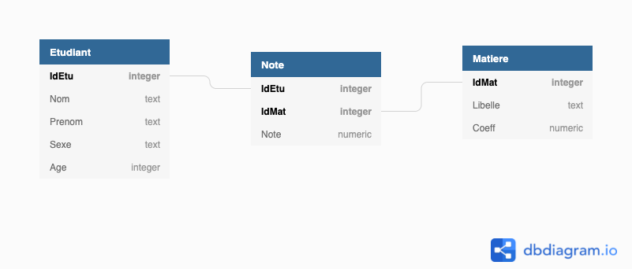
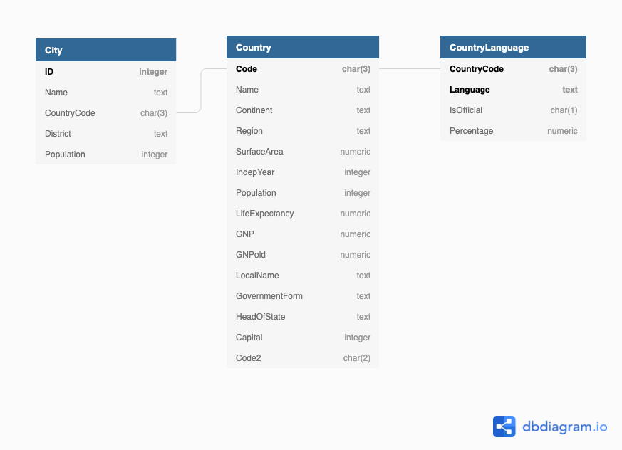
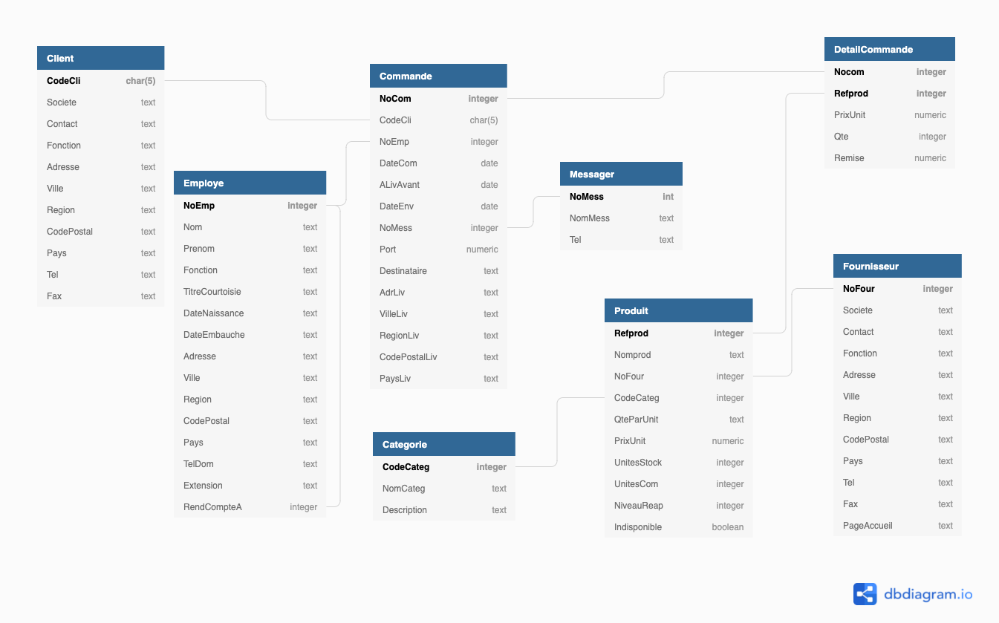

# TD1 : Découverte d'une base de données

## Comment lire un schéma ?

Le schéma ci-dessous est celui d'une base de données très simple sur des étudiants et leurs notes dans des matières.

### Tables

Les rectangles représentent les **tables** (on parle aussi de **relations**)

- Nous en avons donc trois ici : `Etudiant`, `Matiere` et `Note`
- Généralement, une table représente soit une **entité** (objet, individu, ...), soit une **association** entre ces entités (lien)
- Ici les entités sont les *étudiants* et les *matières*
- Les *notes* sont un lien entre les deux

### Attributs

Dans chaque table, il y a des **attributs** (colonnes, variables)

- Nom de l'attribut devant être explicite sur ce qu'il représente
- Différents types possibles dont : `integer` (entier), `numeric` (réel), `text` (texte)

#### Clé primaire

- Attribut(s) particulier(s) permettant d'**identifier de manière unique chaque ligne**
- Représentée dans le schéma en gras
- `IdEtu` est donc la clé primaire de la table `Etudiant` 
    - Il ne pourra pas y avoir 2 lignes avec la même valeur
    - 2 étudiants ne pourront donc jamais avoir le même identifiant (et cela est préférable)
- La clé primaire de `Note` est *double* : l'identifiant étudiant `IdEtu` et l'identifiant matière `IdMat`
    - Un étudiant peut donc avoir des notes dans plusieurs matières
    - Dans une matière, plusieurs étudiants peuvent avoir une note
    - Un étudiant aura une seule note pour une même matière
- Généralement, on force pour que cette clé primaire soit toujours renseignée (*i.e* ne soit jamais égale à `NULL` - qui indique l'absence d'information)

#### Clé externe

- Attribut dont **les valeurs ne peuvent être que celles prises par un attribut d'une autre table** (qui a souvent le même nom)
- Représentée ici par le lien entre les tables, placé au niveau des attributs concernés
- L'attribut `IdEtu` de la table `Note` est une clé externe, pointant vers l'attribut `IdEtu` de la table `Etudiant`
    - Il ne peut pas y avoir, dans la table `Note`, un identifiant étudiant qui ne soit pas dans la table `Etudiant`
- Une clé externe d'une table pointe très souvent vers une clé primaire de l'autre table
- Ces liens entre tables permettent de les relier
    - On peut donc savoir pour un étudiant les matières qu'il a suivi, grâce la table `Note`
    - On peut parler de *chemin* entre les tables `Etudiant` et `Matiere`, passant donc par `Note`

### Questions 

- Quelle est la clé primaire de `Matiere` ?
- Que représente le lien entre `Note` et `Matiere` ?

## BD World

Cette BD très simple permet de connaître les pays du monde (à la fin du millénaire précédent), certaines villes importantes de ces pays et les langues parlées.

Dans le schéma ci-dessus, trouver les bonnes réponses :

- Quelles sont les tables présentes ?
- Dans la table `Country`, quelle est la clé primaire ?
- Dans la table `City`, quelle est la clé primaire ?
- Que représente le lien entre les tables `Country` et `City` ?
- Dans la table `CountryLanguage`, quelle est la clé primaire ?
- Est-il possible qu'il y ait plusieurs langues pour un même pays ? Expliquez votre réponse

## BD Comptoir2000

C'est la BD que l'on utilisera pendant la majorité des TPs. Elle représente une entreprise vendant des produits (dont on connaît la catégorie et le fournisseur) à des clients, via des commandes. Chaque commande est gérée par un employé, et est envoyé via un messager.

- Quelles sont les tables présentes ? Et leur clé primaire respective ?
- Un client peut-il avoir plusieurs commandes ?
- Peut-il y avoir des produits différents (et combien) dans une même commmande ?
- Si je veux connaître pour un employé la liste des messagers, quel *chemin* je vais utiliser ?
- Et pour un client, je veux connaître les catégories de produits qu'il a commandé. Quel chemin je dois faire ?
- Que signifie le lien entre `RendCompteA` et `NoEmp` dans la table `Employe` ?

